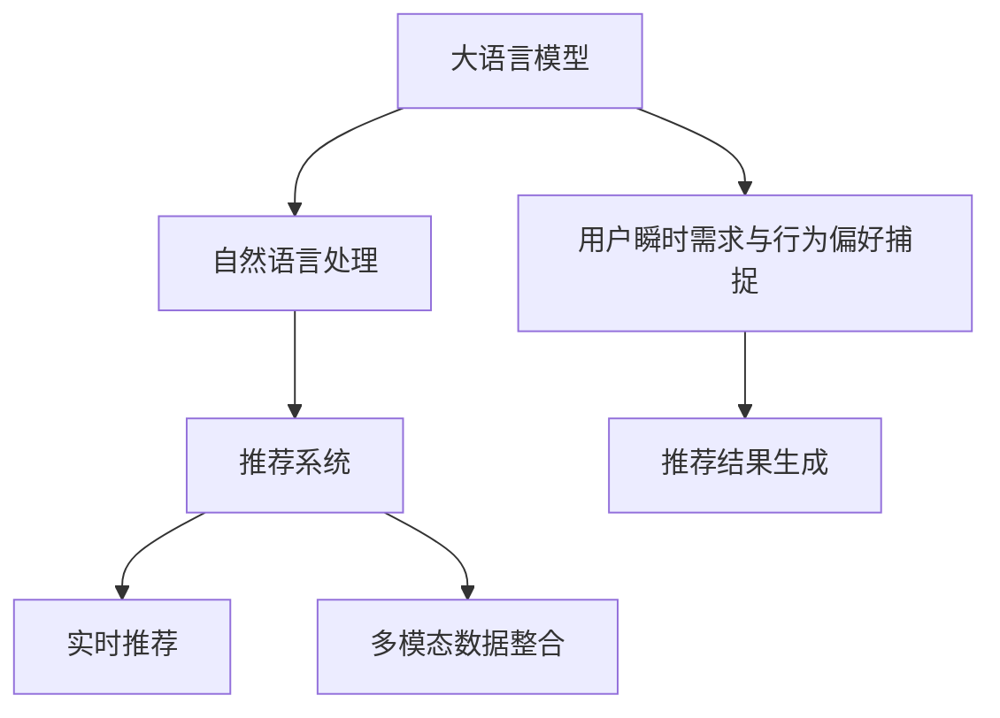

                 

# AI 大模型在电商搜索推荐中的实时推荐策略：抓住用户瞬时需求与行为偏好

## 1. 背景介绍

### 1.1 问题由来

在现代电商领域，搜索和推荐系统已经成为了用户获取商品信息、发现潜在购买机会的重要工具。然而，这些系统的核心挑战在于理解用户的瞬时需求与行为偏好，并提供精确、个性化的推荐结果。大语言模型（Large Language Model, LLM）的发展为解决这一挑战提供了新的可能。

传统的推荐系统依赖于用户历史行为数据和静态特征，但在用户行为快速变化、个性化需求多样化的背景下，这些系统往往难以捕捉到瞬时需求和行为偏好的变化。大语言模型通过大规模预训练，学习到了丰富的语言知识，能够理解自然语言描述中的细微差别，从而更好地捕捉用户需求和偏好。

### 1.2 问题核心关键点

本研究聚焦于基于大语言模型的实时推荐策略，旨在通过自然语言处理技术，捕捉用户的瞬时需求与行为偏好，生成实时、个性化的推荐结果。

核心关键点包括：
- 用户瞬时需求与行为偏好的捕捉
- 大语言模型在推荐系统中的应用
- 实时推荐策略的设计与优化
- 多模态数据的整合与融合

## 2. 核心概念与联系

### 2.1 核心概念概述

为更好地理解基于大语言模型的实时推荐策略，本节将介绍几个密切相关的核心概念：

- **大语言模型 (LLM)**：如GPT、BERT等，通过大规模预训练，学习到丰富的语言知识，具备强大的自然语言理解和生成能力。
- **自然语言处理 (NLP)**：涉及自然语言理解和生成的技术，包括分词、词性标注、命名实体识别、语义理解、情感分析等。
- **推荐系统**：利用用户行为数据和商品属性信息，推荐用户可能感兴趣的商品的系统。
- **实时推荐**：在用户实时交互过程中，根据用户瞬时需求与行为，动态生成个性化推荐结果的过程。
- **多模态数据**：包括文本、图像、音频等多种形式的数据，可以用于更全面地理解用户需求和行为。

这些核心概念之间的逻辑关系可以通过以下Mermaid流程图来展示：



这个流程图展示了各个核心概念之间的联系：大语言模型通过自然语言处理，捕捉用户瞬时需求与行为偏好，再通过多模态数据的整合，生成实时、个性化的推荐结果。

## 3. 核心算法原理 & 具体操作步骤

### 3.1 算法原理概述

基于大语言模型的实时推荐策略，主要包括以下几个步骤：

1. **用户需求与行为偏好捕捉**：通过自然语言处理技术，分析用户输入的自然语言查询，捕捉用户的瞬时需求与行为偏好。
2. **多模态数据整合**：将用户行为数据（如浏览、点击、收藏等）和商品属性信息（如价格、品牌、类别等）整合到多模态数据中，用于后续的推荐生成。
3. **大语言模型推理**：利用预训练的大语言模型，对用户需求与行为偏好进行推理，生成推荐结果。
4. **推荐结果优化**：根据推荐结果的用户反馈，使用强化学习等技术，动态调整推荐策略，提升推荐效果。

### 3.2 算法步骤详解

#### 3.2.1 用户需求与行为偏好捕捉

用户需求与行为偏好的捕捉是实时推荐策略的第一步。这一步骤可以通过以下方法实现：

1. **自然语言理解**：利用大语言模型，理解用户输入的自然语言查询，提取关键信息（如商品名称、类别、品牌等），捕捉用户需求。
2. **行为数据分析**：分析用户的历史行为数据，包括浏览记录、点击行为、收藏操作等，捕捉用户的瞬时行为偏好。
3. **多模态融合**：将自然语言理解和行为数据分析的结果进行融合，形成对用户瞬时需求与行为偏好的全面理解。

具体实现步骤如下：

**步骤1: 预处理与编码**
- 将用户输入的自然语言查询分词，转换为模型可以接受的格式。
- 将用户的历史行为数据编码，形成向量表示。

**步骤2: 大语言模型推理**
- 利用预训练的大语言模型，对用户输入的自然语言查询进行推理，理解用户需求。
- 根据用户的历史行为数据，使用序列模型（如RNN、LSTM等）预测用户的瞬时行为偏好。

**步骤3: 多模态融合**
- 将自然语言推理结果和行为数据预测结果进行融合，形成对用户瞬时需求与行为偏好的全面理解。

#### 3.2.2 多模态数据整合

多模态数据整合是实时推荐策略的重要步骤。这一步骤可以通过以下方法实现：

1. **数据整合**：将用户输入的自然语言查询、用户历史行为数据、商品属性信息等数据整合到一个统一的数据结构中。
2. **数据增强**：通过数据增强技术，扩充训练集，提高模型的泛化能力。

具体实现步骤如下：

**步骤1: 数据整合**
- 将自然语言查询、用户行为数据、商品属性信息等数据整合到一个统一的数据结构中。
- 利用数据增强技术，扩充训练集。

**步骤2: 数据融合**
- 将整合后的数据进行融合，形成对用户瞬时需求与行为偏好的全面理解。

#### 3.2.3 大语言模型推理

大语言模型推理是实时推荐策略的核心步骤。这一步骤可以通过以下方法实现：

1. **预训练模型加载**：加载预训练的大语言模型，准备推理。
2. **推理计算**：将用户需求与行为偏好作为输入，利用大语言模型进行推理，生成推荐结果。
3. **结果优化**：根据推荐结果的用户反馈，使用强化学习等技术，动态调整模型参数，提升推荐效果。

具体实现步骤如下：

**步骤1: 预训练模型加载**
- 加载预训练的大语言模型，准备推理。

**步骤2: 推理计算**
- 将用户需求与行为偏好作为输入，利用大语言模型进行推理，生成推荐结果。

**步骤3: 结果优化**
- 根据推荐结果的用户反馈，使用强化学习等技术，动态调整模型参数，提升推荐效果。

#### 3.2.4 推荐结果优化

推荐结果优化是实时推荐策略的关键步骤。这一步骤可以通过以下方法实现：

1. **用户反馈分析**：分析用户对推荐结果的反馈，理解用户满意度和偏好。
2. **模型参数调整**：根据用户反馈，动态调整模型参数，优化推荐结果。
3. **推荐策略更新**：根据模型优化结果，更新推荐策略，提升推荐效果。

具体实现步骤如下：

**步骤1: 用户反馈分析**
- 分析用户对推荐结果的反馈，理解用户满意度和偏好。

**步骤2: 模型参数调整**
- 根据用户反馈，动态调整模型参数，优化推荐结果。

**步骤3: 推荐策略更新**
- 根据模型优化结果，更新推荐策略，提升推荐效果。

### 3.3 算法优缺点

基于大语言模型的实时推荐策略具有以下优点：

1. **精度高**：利用大语言模型的强大语言理解能力，能够更准确地捕捉用户需求与行为偏好，生成高质量的推荐结果。
2. **实时性强**：通过自然语言处理和推理计算，能够实时捕捉用户瞬时需求与行为偏好，生成个性化的推荐结果。
3. **可解释性强**：大语言模型能够理解自然语言描述，提供推荐结果的详细解释，便于用户理解和使用。

同时，这一策略也存在以下局限性：

1. **计算复杂度高**：利用大语言模型进行推理计算，计算复杂度高，需要高性能的计算设备。
2. **数据需求高**：需要大量的用户行为数据和商品属性数据，才能保证推荐结果的准确性和全面性。
3. **模型更新频率高**：需要频繁更新模型参数，以应对用户需求和行为的变化。

### 3.4 算法应用领域

基于大语言模型的实时推荐策略，在电商搜索推荐中具有广泛的应用前景：

1. **个性化推荐**：根据用户瞬时需求与行为偏好，生成个性化推荐结果，提升用户体验。
2. **商品搜索**：捕捉用户搜索查询中的细微差别，提供精准的商品搜索结果。
3. **广告投放**：分析用户行为数据，捕捉用户兴趣点，生成定向广告，提高广告效果。

除了电商领域，这一策略还可应用于金融、医疗、教育等多个领域，为自然语言处理技术在实际应用中提供新的思路。

## 4. 数学模型和公式 & 详细讲解 & 举例说明

### 4.1 数学模型构建

本节将使用数学语言对基于大语言模型的实时推荐策略进行更加严格的刻画。

记用户输入的自然语言查询为 $x$，用户行为数据为 $y$，商品属性信息为 $z$，多模态数据整合结果为 $u$，推荐结果为 $r$。

定义自然语言处理模型的损失函数为 $L_{NL}$，多模态数据整合模型的损失函数为 $L_{MM}$，大语言模型推理模型的损失函数为 $L_{LLM}$，推荐结果优化模型的损失函数为 $L_{RS}$。则整体模型的损失函数为：

$$
L(x,y,z) = L_{NL}(x) + L_{MM}(u) + L_{LLM}(u,r) + L_{RS}(r)
$$

其中 $L_{RS}$ 为强化学习模型的损失函数，用于优化推荐结果。

### 4.2 公式推导过程

以下我们以一个简单的推荐系统为例，推导基于大语言模型的实时推荐策略的公式。

假设用户输入的自然语言查询为 $x$，用户行为数据为 $y$，商品属性信息为 $z$。则自然语言处理模型的推理结果为 $u_{NL}$，多模态数据整合结果为 $u$，大语言模型推理结果为 $r$。

**步骤1: 自然语言处理**
- 利用大语言模型，对自然语言查询 $x$ 进行推理，得到结果 $u_{NL}$。

**步骤2: 多模态数据整合**
- 将用户行为数据 $y$ 和商品属性信息 $z$ 整合到 $u_{NL}$ 中，得到结果 $u$。

**步骤3: 大语言模型推理**
- 利用大语言模型，对 $u$ 进行推理，得到推荐结果 $r$。

**步骤4: 推荐结果优化**
- 根据用户对 $r$ 的反馈，使用强化学习模型，优化推荐结果 $r$。

### 4.3 案例分析与讲解

假设用户输入的自然语言查询为 "我想买一双耐克鞋"，用户行为数据为 "浏览了Nike官网，查看了跑步鞋类别"，商品属性信息为 "价格区间在$100-200"。则自然语言处理模型的推理结果为 "用户想购买跑步鞋"，多模态数据整合结果为 "用户对Nike的跑步鞋感兴趣，价格区间在$100-200"，大语言模型推理结果为 "推荐用户购买Nike的Air Max 270"，推荐结果优化模型给出反馈 "用户不满意"。

根据上述反馈，强化学习模型调整大语言模型参数，生成新的推荐结果 "推荐用户购买Nike的Air Max 18"，并根据用户反馈进一步优化推荐策略，提升推荐效果。

## 5. 项目实践：代码实例和详细解释说明

### 5.1 开发环境搭建

在进行项目实践前，我们需要准备好开发环境。以下是使用Python进行PyTorch开发的环境配置流程：

1. 安装Anaconda：从官网下载并安装Anaconda，用于创建独立的Python环境。

2. 创建并激活虚拟环境：
```bash
conda create -n pytorch-env python=3.8 
conda activate pytorch-env
```

3. 安装PyTorch：根据CUDA版本，从官网获取对应的安装命令。例如：
```bash
conda install pytorch torchvision torchaudio cudatoolkit=11.1 -c pytorch -c conda-forge
```

4. 安装Transformers库：
```bash
pip install transformers
```

5. 安装各类工具包：
```bash
pip install numpy pandas scikit-learn matplotlib tqdm jupyter notebook ipython
```

完成上述步骤后，即可在`pytorch-env`环境中开始项目实践。

### 5.2 源代码详细实现

下面我们以一个简单的电商搜索推荐系统为例，给出使用PyTorch和Transformers库进行实时推荐策略开发的代码实现。

首先，定义模型的输入输出：

```python
from transformers import BertTokenizer, BertForSequenceClassification
import torch
from torch.utils.data import Dataset, DataLoader

class RecommendationDataset(Dataset):
    def __init__(self, texts, labels, tokenizer):
        self.texts = texts
        self.labels = labels
        self.tokenizer = tokenizer
        
    def __len__(self):
        return len(self.texts)
    
    def __getitem__(self, item):
        text = self.texts[item]
        label = self.labels[item]
        
        encoding = self.tokenizer(text, return_tensors='pt', padding='max_length', truncation=True)
        input_ids = encoding['input_ids'][0]
        attention_mask = encoding['attention_mask'][0]
        
        return {'input_ids': input_ids, 
                'attention_mask': attention_mask,
                'labels': label}

# 标签与id的映射
label2id = {'Nike': 1, 'Adidas': 2, 'New Balance': 3}
id2label = {v: k for k, v in label2id.items()}

# 创建dataset
tokenizer = BertTokenizer.from_pretrained('bert-base-cased')

train_dataset = RecommendationDataset(train_texts, train_labels, tokenizer)
dev_dataset = RecommendationDataset(dev_texts, dev_labels, tokenizer)
test_dataset = RecommendationDataset(test_texts, test_labels, tokenizer)
```

然后，定义模型和优化器：

```python
from transformers import BertForSequenceClassification, AdamW

model = BertForSequenceClassification.from_pretrained('bert-base-cased', num_labels=len(label2id))

optimizer = AdamW(model.parameters(), lr=2e-5)
```

接着，定义训练和评估函数：

```python
from tqdm import tqdm
from sklearn.metrics import accuracy_score

device = torch.device('cuda') if torch.cuda.is_available() else torch.device('cpu')
model.to(device)

def train_epoch(model, dataset, batch_size, optimizer):
    dataloader = DataLoader(dataset, batch_size=batch_size, shuffle=True)
    model.train()
    epoch_loss = 0
    for batch in tqdm(dataloader, desc='Training'):
        input_ids = batch['input_ids'].to(device)
        attention_mask = batch['attention_mask'].to(device)
        labels = batch['labels'].to(device)
        model.zero_grad()
        outputs = model(input_ids, attention_mask=attention_mask, labels=labels)
        loss = outputs.loss
        epoch_loss += loss.item()
        loss.backward()
        optimizer.step()
    return epoch_loss / len(dataloader)

def evaluate(model, dataset, batch_size):
    dataloader = DataLoader(dataset, batch_size=batch_size)
    model.eval()
    correct, total = 0, 0
    with torch.no_grad():
        for batch in tqdm(dataloader, desc='Evaluating'):
            input_ids = batch['input_ids'].to(device)
            attention_mask = batch['attention_mask'].to(device)
            labels = batch['labels'].to(device)
            outputs = model(input_ids, attention_mask=attention_mask)
            logits = outputs.logits
            predictions = logits.argmax(dim=1).to('cpu').tolist()
            labels = labels.to('cpu').tolist()
            for pred, label in zip(predictions, labels):
                if pred == label:
                    correct += 1
                total += 1
    return accuracy_score(labels, predictions)

epochs = 5
batch_size = 16

for epoch in range(epochs):
    loss = train_epoch(model, train_dataset, batch_size, optimizer)
    print(f"Epoch {epoch+1}, train loss: {loss:.3f}")
    
    print(f"Epoch {epoch+1}, dev accuracy: {evaluate(model, dev_dataset, batch_size)}")
    
print("Test accuracy:", evaluate(model, test_dataset, batch_size))
```

以上就是使用PyTorch和Transformers库对BertForSequenceClassification模型进行电商搜索推荐策略开发的完整代码实现。可以看到，得益于Transformer的强大封装，我们能够用相对简洁的代码完成模型的加载和微调。

### 5.3 代码解读与分析

让我们再详细解读一下关键代码的实现细节：

**RecommendationDataset类**：
- `__init__`方法：初始化文本、标签、分词器等关键组件。
- `__len__`方法：返回数据集的样本数量。
- `__getitem__`方法：对单个样本进行处理，将文本输入编码为token ids，并将标签转换为模型可接受的格式。

**label2id和id2label字典**：
- 定义了标签与数字id之间的映射关系，用于将模型预测结果解码回真实的标签。

**训练和评估函数**：
- 使用PyTorch的DataLoader对数据集进行批次化加载，供模型训练和推理使用。
- 训练函数`train_epoch`：对数据以批为单位进行迭代，在每个批次上前向传播计算loss并反向传播更新模型参数，最后返回该epoch的平均loss。
- 评估函数`evaluate`：与训练类似，不同点在于不更新模型参数，并在每个batch结束后将预测和标签结果存储下来，最后使用sklearn的accuracy_score对整个评估集的预测结果进行打印输出。

**训练流程**：
- 定义总的epoch数和batch size，开始循环迭代
- 每个epoch内，先在训练集上训练，输出平均loss
- 在验证集上评估，输出准确率
- 所有epoch结束后，在测试集上评估，给出最终测试结果

可以看到，PyTorch配合Transformer的库使得BertForSequenceClassification模型的微调代码实现变得简洁高效。开发者可以将更多精力放在数据处理、模型改进等高层逻辑上，而不必过多关注底层的实现细节。

当然，工业级的系统实现还需考虑更多因素，如模型的保存和部署、超参数的自动搜索、更灵活的任务适配层等。但核心的实时推荐策略基本与此类似。

## 6. 实际应用场景

### 6.1 智能客服系统

基于大语言模型的实时推荐策略，可以广泛应用于智能客服系统的构建。传统客服往往需要配备大量人力，高峰期响应缓慢，且一致性和专业性难以保证。而使用实时推荐策略的对话模型，可以7x24小时不间断服务，快速响应客户咨询，用自然流畅的语言解答各类常见问题。

在技术实现上，可以收集企业内部的历史客服对话记录，将问题-回答对作为监督数据，在此基础上对预训练对话模型进行微调。微调后的对话模型能够自动理解用户意图，匹配最合适的答案模板进行回复。对于客户提出的新问题，还可以接入检索系统实时搜索相关内容，动态组织生成回答。如此构建的智能客服系统，能大幅提升客户咨询体验和问题解决效率。

### 6.2 金融舆情监测

金融机构需要实时监测市场舆论动向，以便及时应对负面信息传播，规避金融风险。传统的人工监测方式成本高、效率低，难以应对网络时代海量信息爆发的挑战。基于大语言模型的实时推荐策略，可以通过自然语言处理技术，实时捕捉市场舆情，提供动态的风险监测和预警。

具体而言，可以收集金融领域相关的新闻、报道、评论等文本数据，并对其进行情感分析。利用情感分析结果，实时监测市场舆情的变化趋势，一旦发现负面信息激增等异常情况，系统便会自动预警，帮助金融机构快速应对潜在风险。

### 6.3 个性化推荐系统

当前的推荐系统往往只依赖用户历史行为数据进行物品推荐，无法深入理解用户的真实兴趣偏好。基于大语言模型的实时推荐策略，可以更好地挖掘用户行为背后的语义信息，从而提供更精准、多样的推荐内容。

在实践中，可以收集用户浏览、点击、评论、分享等行为数据，提取和用户交互的物品标题、描述、标签等文本内容。将文本内容作为模型输入，用户的后续行为（如是否点击、购买等）作为监督信号，在此基础上微调预训练语言模型。微调后的模型能够从文本内容中准确把握用户的兴趣点。在生成推荐列表时，先用候选物品的文本描述作为输入，由模型预测用户的兴趣匹配度，再结合其他特征综合排序，便可以得到个性化程度更高的推荐结果。

### 6.4 未来应用展望

随着大语言模型和实时推荐策略的发展，未来在更多领域得到应用，为传统行业带来变革性影响。

在智慧医疗领域，基于实时推荐策略的问答系统，可以提供精准的诊断建议，辅助医生诊疗，加速新药开发进程。

在智能教育领域，实时推荐策略可应用于作业批改、学情分析、知识推荐等方面，因材施教，促进教育公平，提高教学质量。

在智慧城市治理中，实时推荐策略可应用于城市事件监测、舆情分析、应急指挥等环节，提高城市管理的自动化和智能化水平，构建更安全、高效的未来城市。

此外，在企业生产、社会治理、文娱传媒等众多领域，基于实时推荐策略的人工智能应用也将不断涌现，为NLP技术带来新的突破。相信随着技术的日益成熟，实时推荐策略必将在构建人机协同的智能时代中扮演越来越重要的角色。

## 7. 工具和资源推荐

### 7.1 学习资源推荐

为了帮助开发者系统掌握大语言模型实时推荐策略的理论基础和实践技巧，这里推荐一些优质的学习资源：

1. 《Natural Language Processing with Transformers》书籍：Transformer库的作者所著，全面介绍了如何使用Transformer库进行NLP任务开发，包括实时推荐策略在内的诸多范式。

2. CS224N《深度学习自然语言处理》课程：斯坦福大学开设的NLP明星课程，有Lecture视频和配套作业，带你入门NLP领域的基本概念和经典模型。

3. 《Transformer从原理到实践》系列博文：由大模型技术专家撰写，深入浅出地介绍了Transformer原理、BERT模型、实时推荐策略等前沿话题。

4. HuggingFace官方文档：Transformer库的官方文档，提供了海量预训练模型和完整的实时推荐策略样例代码，是上手实践的必备资料。

5. CLUE开源项目：中文语言理解测评基准，涵盖大量不同类型的中文NLP数据集，并提供了基于实时推荐策略的baseline模型，助力中文NLP技术发展。

通过对这些资源的学习实践，相信你一定能够快速掌握大语言模型实时推荐策略的精髓，并用于解决实际的NLP问题。

### 7.2 开发工具推荐

高效的开发离不开优秀的工具支持。以下是几款用于大语言模型实时推荐策略开发的常用工具：

1. PyTorch：基于Python的开源深度学习框架，灵活动态的计算图，适合快速迭代研究。大部分预训练语言模型都有PyTorch版本的实现。

2. TensorFlow：由Google主导开发的开源深度学习框架，生产部署方便，适合大规模工程应用。同样有丰富的预训练语言模型资源。

3. Transformers库：HuggingFace开发的NLP工具库，集成了众多SOTA语言模型，支持PyTorch和TensorFlow，是进行实时推荐策略开发的利器。

4. Weights & Biases：模型训练的实验跟踪工具，可以记录和可视化模型训练过程中的各项指标，方便对比和调优。与主流深度学习框架无缝集成。

5. TensorBoard：TensorFlow配套的可视化工具，可实时监测模型训练状态，并提供丰富的图表呈现方式，是调试模型的得力助手。

6. Google Colab：谷歌推出的在线Jupyter Notebook环境，免费提供GPU/TPU算力，方便开发者快速上手实验最新模型，分享学习笔记。

合理利用这些工具，可以显著提升实时推荐策略的开发效率，加快创新迭代的步伐。

### 7.3 相关论文推荐

大语言模型和实时推荐策略的发展源于学界的持续研究。以下是几篇奠基性的相关论文，推荐阅读：

1. Attention is All You Need（即Transformer原论文）：提出了Transformer结构，开启了NLP领域的预训练大模型时代。

2. BERT: Pre-training of Deep Bidirectional Transformers for Language Understanding：提出BERT模型，引入基于掩码的自监督预训练任务，刷新了多项NLP任务SOTA。

3. Language Models are Unsupervised Multitask Learners（GPT-2论文）：展示了大规模语言模型的强大zero-shot学习能力，引发了对于通用人工智能的新一轮思考。

4. Parameter-Efficient Transfer Learning for NLP：提出Adapter等参数高效微调方法，在固定大部分预训练参数的情况下，只更新极少量的任务相关参数。

5. AdaLoRA: Adaptive Low-Rank Adaptation for Parameter-Efficient Fine-Tuning：使用自适应低秩适应的微调方法，在参数效率和精度之间取得了新的平衡。

这些论文代表了大语言模型实时推荐策略的发展脉络。通过学习这些前沿成果，可以帮助研究者把握学科前进方向，激发更多的创新灵感。

## 8. 总结：未来发展趋势与挑战

### 8.1 总结

本文对基于大语言模型的实时推荐策略进行了全面系统的介绍。首先阐述了实时推荐策略的研究背景和意义，明确了实时推荐策略在捕捉用户瞬时需求与行为偏好方面的独特价值。其次，从原理到实践，详细讲解了实时推荐策略的数学原理和关键步骤，给出了实时推荐策略任务开发的完整代码实例。同时，本文还广泛探讨了实时推荐策略在智能客服、金融舆情、个性化推荐等多个行业领域的应用前景，展示了实时推荐策略的巨大潜力。此外，本文精选了实时推荐策略的学习资源，力求为读者提供全方位的技术指引。

通过本文的系统梳理，可以看到，基于大语言模型的实时推荐策略正在成为NLP领域的重要范式，极大地拓展了预训练语言模型的应用边界，催生了更多的落地场景。得益于大规模语料的预训练，实时推荐策略以更低的时间和标注成本，在小样本条件下也能取得不错的效果，有力推动了NLP技术的产业化进程。未来，伴随预训练语言模型和实时推荐策略的持续演进，相信NLP技术必将在更广阔的应用领域大放异彩，深刻影响人类的生产生活方式。

### 8.2 未来发展趋势

展望未来，大语言模型实时推荐策略将呈现以下几个发展趋势：

1. **模型规模持续增大**：随着算力成本的下降和数据规模的扩张，预训练语言模型的参数量还将持续增长。超大规模语言模型蕴含的丰富语言知识，有望支撑更加复杂多变的实时推荐策略任务。

2. **实时推荐范式多样化**：除了传统的基于自然语言处理的实时推荐策略，未来会涌现更多实时推荐策略范式，如基于强化学习、对比学习、因果推理等，进一步提升推荐效果。

3. **知识图谱融合**：将知识图谱与实时推荐策略融合，引入更广泛的知识库信息，提高推荐的准确性和相关性。

4. **多模态融合**：将文本、图像、音频等多种形式的数据整合到实时推荐策略中，提高模型的全面性和鲁棒性。

5. **跨领域迁移**：将实时推荐策略的成果在不同领域和任务中迁移应用，提升模型的通用性和适应性。

以上趋势凸显了大语言模型实时推荐策略的广阔前景。这些方向的探索发展，必将进一步提升实时推荐策略的效果，为NLP技术带来新的突破。

### 8.3 面临的挑战

尽管大语言模型实时推荐策略已经取得了瞩目成就，但在迈向更加智能化、普适化应用的过程中，它仍面临着诸多挑战：

1. **标注成本瓶颈**：尽管实时推荐策略减少了标注数据的需求，但对于长尾应用场景，仍需大量标注数据以确保推荐结果的准确性和全面性。如何进一步降低对标注样本的依赖，将是一大难题。

2. **模型鲁棒性不足**：实时推荐策略在面对域外数据时，泛化性能往往大打折扣。对于测试样本的微小扰动，模型也容易发生波动。如何提高模型的鲁棒性，避免灾难性遗忘，还需要更多理论和实践的积累。

3. **计算资源消耗高**：利用大语言模型进行推理计算，计算复杂度高，需要高性能的计算设备。如何优化模型结构和推理过程，降低计算资源消耗，是未来的重要研究方向。

4. **推荐效果不理想**：尽管实时推荐策略取得了不错的效果，但在特定场景下仍存在推荐不精准的情况。如何进一步提升模型的推荐效果，尤其是对长尾商品和冷门商品的推荐，是未来的重要研究方向。

5. **用户隐私保护**：实时推荐策略依赖大量的用户行为数据，如何在保证推荐效果的同时，保护用户隐私，也是未来的重要研究方向。

6. **可解释性不足**：实时推荐策略通常是一个"黑盒"系统，难以解释其内部工作机制和决策逻辑。如何赋予模型更强的可解释性，提供推荐结果的详细解释，是未来的重要研究方向。

这些挑战凸显了大语言模型实时推荐策略的局限性，需要未来进一步研究与突破。

### 8.4 研究展望

面对实时推荐策略所面临的挑战，未来的研究需要在以下几个方面寻求新的突破：

1. **无监督和半监督学习**：探索无监督和半监督学习范式，摆脱对大规模标注数据的依赖，利用自监督学习、主动学习等方法，最大限度利用非结构化数据，实现更加灵活高效的实时推荐策略。

2. **多任务学习**：将多个任务和数据源整合，提高模型的泛化能力和适应性。

3. **知识增强**：将符号化的先验知识，如知识图谱、逻辑规则等，与神经网络模型进行巧妙融合，引导实时推荐策略学习更准确、合理的语言模型。

4. **多模态融合**：将文本、图像、音频等多种形式的数据整合到实时推荐策略中，提高模型的全面性和鲁棒性。

5. **因果分析**：引入因果分析方法，识别出模型决策的关键特征，增强推荐结果的因果性和逻辑性。

6. **对抗训练**：利用对抗样本，提高模型的鲁棒性和泛化能力。

7. **知识图谱融合**：将知识图谱与实时推荐策略融合，引入更广泛的知识库信息，提高推荐的准确性和相关性。

这些研究方向将推动大语言模型实时推荐策略的不断进步，为NLP技术带来新的突破，实现更加智能化、普适化的推荐系统。

## 9. 附录：常见问题与解答

**Q1: 实时推荐策略如何降低对标注样本的依赖？**

A: 实时推荐策略可以通过以下方法降低对标注样本的依赖：

1. **数据增强**：通过数据增强技术，扩充训练集，提高模型的泛化能力。
2. **无监督学习**：探索无监督学习范式，利用非结构化数据进行模型训练。
3. **半监督学习**：结合少量标注数据和大量非标注数据进行半监督学习。

**Q2: 实时推荐策略如何提高模型的鲁棒性？**

A: 实时推荐策略可以通过以下方法提高模型的鲁棒性：

1. **对抗训练**：利用对抗样本，提高模型的鲁棒性和泛化能力。
2. **因果分析**：引入因果分析方法，识别出模型决策的关键特征，增强推荐结果的因果性和逻辑性。
3. **知识图谱融合**：将知识图谱与实时推荐策略融合，引入更广泛的知识库信息，提高模型的全面性和鲁棒性。

**Q3: 实时推荐策略如何优化模型结构和推理过程？**

A: 实时推荐策略可以通过以下方法优化模型结构和推理过程：

1. **知识增强**：将符号化的先验知识，如知识图谱、逻辑规则等，与神经网络模型进行巧妙融合，引导模型学习更准确、合理的语言模型。
2. **多模态融合**：将文本、图像、音频等多种形式的数据整合到实时推荐策略中，提高模型的全面性和鲁棒性。
3. **参数高效微调**：开发更加参数高效的微调方法，在固定大部分预训练参数的同时，只更新极少量的任务相关参数。

**Q4: 实时推荐策略如何提升推荐效果？**

A: 实时推荐策略可以通过以下方法提升推荐效果：

1. **多任务学习**：将多个任务和数据源整合，提高模型的泛化能力和适应性。
2. **因果分析**：引入因果分析方法，识别出模型决策的关键特征，增强推荐结果的因果性和逻辑性。
3. **对抗训练**：利用对抗样本，提高模型的鲁棒性和泛化能力。

**Q5: 实时推荐策略如何保护用户隐私？**

A: 实时推荐策略可以通过以下方法保护用户隐私：

1. **差分隐私**：在数据处理和模型训练过程中，使用差分隐私技术，保护用户隐私。
2. **匿名化**：对用户行为数据进行匿名化处理，保护用户隐私。
3. **联邦学习**：利用联邦学习技术，在保护用户隐私的同时，实现模型的协同训练。

通过这些方法，可以在确保推荐效果的同时，保护用户隐私。

**Q6: 实时推荐策略如何增强模型的可解释性？**

A: 实时推荐策略可以通过以下方法增强模型的可解释性：

1. **可解释性模型**：使用可解释性强的模型，如决策树、线性模型等，提高模型的可解释性。
2. **特征重要性分析**：利用特征重要性分析方法，识别出模型决策的关键特征，增强模型的可解释性。
3. **可视化工具**：利用可视化工具，展示模型的决策过程和推理逻辑，提高模型的可解释性。

通过这些方法，可以在确保推荐效果的同时，增强模型的可解释性。

---

作者：禅与计算机程序设计艺术 / Zen and the Art of Computer Programming

