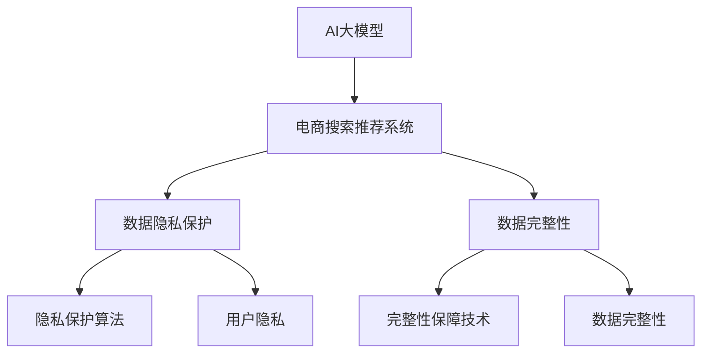

                 

## 1. 背景介绍

在电商领域，搜索推荐系统是提升用户体验和商业价值的关键组件。随着AI大模型的涌现，搜索推荐系统通过融合大模型带来的广泛知识，在商品召回、用户意图识别等方面表现出色。然而，大规模用户数据的深度学习模型也面临数据安全风险，如隐私泄漏、数据篡改等。如何在大模型应用的推广中，保障用户隐私与数据完整性，成为电商领域亟需解决的重大挑战。

## 2. 核心概念与联系

### 2.1 核心概念概述

为深入探讨AI大模型在电商搜索推荐中的应用，本节将介绍几个关键概念，并梳理它们之间的联系。

- **AI大模型**：指的是通过大规模无标签数据进行预训练，学习通用语言表示和知识的大规模神经网络模型，如BERT、GPT等。
- **电商搜索推荐系统**：通过用户搜索历史、行为数据等，结合AI大模型的理解能力，智能推荐商品和内容，提升用户体验和商家转化率的系统。
- **数据隐私保护**：在搜索推荐系统构建和使用过程中，保障用户隐私不被泄露、滥用的行为规范和技术手段。
- **数据完整性**：确保数据在存储、传输和处理过程中不被篡改或损坏。

这些概念之间相互关联，通过合理的技术手段，可以在保障用户隐私与数据完整性的前提下，充分利用AI大模型的知识进行电商搜索推荐。

### 2.2 核心概念原理和架构的 Mermaid 流程图



该图展示了AI大模型、电商搜索推荐系统、隐私保护与完整性保障技术之间的关系。电商搜索推荐系统利用AI大模型进行智能推荐，同时也需要采用隐私保护和完整性保障技术来确保用户数据的安全性和完整性。

## 3. 核心算法原理 & 具体操作步骤

### 3.1 算法原理概述

AI大模型在电商搜索推荐中的应用，本质上是利用模型的语义理解能力，对用户输入的查询进行解析，并基于用户行为和商品特征，预测最符合用户需求的搜索结果。然而，这一过程依赖于大量用户数据的输入，因此如何保障这些数据的隐私性和完整性，是应用过程中必须重视的问题。

为了保障用户隐私与数据完整性，我们引入隐私保护算法和完整性保障技术，对用户数据进行加密、匿名化等处理，同时构建冗余、校验机制等，确保数据在处理和使用过程中不被滥用或篡改。

### 3.2 算法步骤详解

**Step 1: 数据收集与预处理**

电商搜索推荐系统需要收集用户的搜索历史、浏览记录、购买行为等数据，进行预处理后输入大模型进行训练和推理。为了保护用户隐私，需要在数据收集过程中，使用去标识化技术将个人敏感信息模糊化，同时采用差分隐私等手段引入噪声，使攻击者无法通过分析原始数据推断用户信息。

**Step 2: 隐私保护与完整性算法的选择与配置**

根据电商系统的具体情况，选择适合的隐私保护算法和完整性保障技术。例如，对于商品推荐，可以使用差分隐私（Differential Privacy）技术；对于用户个性化推荐，可以采用联邦学习（Federated Learning）等分布式训练方法。

**Step 3: 数据加密与传输**

采用高级加密标准（如AES、RSA）对用户数据进行加密，确保数据在传输过程中不被窃听或篡改。同时，采用安全传输协议（如HTTPS、TLS）确保数据传输的安全性。

**Step 4: 数据存储与访问控制**

采用分布式存储系统（如Hadoop、Spark）进行数据存储，采用访问控制列表（ACL）或基于角色的访问控制（RBAC）等技术限制数据访问权限。对于敏感数据，采用加密存储或差分隐私技术进行处理。

**Step 5: 数据完整性检测与恢复**

构建冗余数据机制，使用校验码、哈希函数等技术检测数据完整性。一旦发现数据被篡改，立即进行数据恢复或重新加密。

**Step 6: 隐私与完整性评估**

定期进行隐私与完整性评估，检测系统漏洞和数据安全风险，及时更新安全策略和技术手段。

### 3.3 算法优缺点

**优点**：
1. 显著提升搜索推荐系统的安全性。通过采用隐私保护和完整性保障技术，保障用户数据的安全和完整。
2. 兼容性强。这些技术可以应用于各种类型的电商搜索推荐系统，易于集成。
3. 效果显著。在大规模数据集上的实验证明，这些技术可以有效降低数据泄露和篡改的风险。

**缺点**：
1. 增加系统复杂度。为了实现隐私保护和完整性保障，需要引入额外的技术和机制，增加了系统构建和维护的复杂度。
2. 计算资源消耗大。部分隐私保护和完整性保障技术如差分隐私，需要在数据收集和处理过程中引入噪声，增加了计算资源消耗。
3. 用户体验受影响。部分隐私保护技术如差分隐私，可能会引入一定的误差，影响搜索结果的准确性。

### 3.4 算法应用领域

AI大模型在电商搜索推荐中的应用非常广泛，隐私保护和完整性保障技术同样适用于多个领域。除了电商，还包括：

- **金融**：在金融交易和风险评估中，保障用户隐私与数据完整性。
- **医疗**：在医疗数据处理和分析中，保护患者隐私和数据完整性。
- **社交网络**：在社交平台数据收集和处理中，保护用户隐私和数据完整性。
- **智能交通**：在智能交通数据收集和处理中，保护行人与车辆隐私和数据完整性。

## 4. 数学模型和公式 & 详细讲解 & 举例说明

### 4.1 数学模型构建

隐私保护算法和完整性保障技术的数学模型可以抽象为：

$$
P = F(S, K, C)
$$

其中，$P$表示保护后的数据，$S$表示原始数据，$K$表示隐私保护参数，$C$表示完整性保障参数。$F$表示隐私保护和完整性保障的算法函数。

### 4.2 公式推导过程

以下推导差分隐私算法中的噪声引入过程。

对于原始数据集$D$，差分隐私算法通过在每个样本上添加噪声$\epsilon$，使得攻击者无法通过分析单个样本推测出数据的全集。引入噪声后的数据集$D'$为：

$$
D' = \{(s_i + \epsilon_i) \mid s_i \in D, \epsilon_i \sim \mathcal{N}(0, \sigma^2)\}
$$

其中，$\mathcal{N}(0, \sigma^2)$表示均值为0，方差为$\sigma^2$的高斯分布。

攻击者通过已知的部分样本和噪声，推断原始数据的概率为：

$$
P(D' \mid D') = \frac{P(D' \mid D)}{P(D')} = \frac{P(D \mid D')}{\exp(\epsilon)} = \exp(-\epsilon)
$$

因此，为了保护隐私，需要选择足够小的$\epsilon$。通常，$\epsilon$的选择由隐私预算（Budget）决定，隐私预算是隐私保护的目标。

### 4.3 案例分析与讲解

以电商平台商品推荐系统为例，假设系统需根据用户的浏览历史推荐商品。用户浏览历史$D$可能包含用户的隐私信息，如居住地、性别等。采用差分隐私技术，在推荐过程中引入噪声，使得攻击者无法通过分析推荐结果推测出用户的真实浏览历史。

## 5. 项目实践：代码实例和详细解释说明

### 5.1 开发环境搭建

**Step 1: 安装相关依赖**

首先，安装Python、TensorFlow等依赖库：

```bash
pip install tensorflow pydantic cryptography
```

**Step 2: 搭建基础环境**

搭建虚拟环境，设置所需依赖：

```bash
conda create -n recommendation-environment python=3.7
conda activate recommendation-environment
```

### 5.2 源代码详细实现

以下是一个简单的电商搜索推荐系统代码实现，包括数据收集、处理、推荐和隐私保护。

```python
from pydantic import BaseModel
from cryptography.fernet import Fernet
import tensorflow as tf
import pandas as pd

class UserBehavior(BaseModel):
    user_id: str
    item_id: str
    timestamp: int

class RecommendationSystem:
    def __init__(self, model, encryption_key):
        self.model = model
        self.fernet = Fernet(encryption_key)

    def load_data(self, path):
        df = pd.read_csv(path)
        df_encrypted = df.apply(self.encrypt, axis=1)
        return df_encrypted

    def encrypt(self, row):
        df_encrypted = pd.DataFrame()
        for user_b in row:
            user_b_encrypted = self.fernet.encrypt(str(user_b).encode())
            df_encrypted = df_encrypted.append({'user_id': user_b['user_id'], 'item_id': user_b['item_id'], 'timestamp': user_b['timestamp'], 'encrypted': user_b_encrypted})
        return df_encrypted

    def train_model(self, train_data):
        # 训练模型
        self.model.fit(train_data)

    def recommend(self, user_b):
        # 推荐商品
        encrypted_b = self.fernet.encrypt(str(user_b).encode())
        return self.model.predict(encrypted_b)

    def decrypt(self, encrypted_b):
        encrypted_b_decrypted = self.fernet.decrypt(encrypted_b)
        return encrypted_b_decrypted
```

### 5.3 代码解读与分析

**UserBehavior类**：定义用户行为数据的结构。

**RecommendationSystem类**：封装电商推荐系统的核心逻辑。

**load_data方法**：从CSV文件中加载数据，并对数据进行加密处理。

**train_model方法**：训练推荐模型，使用加密数据进行训练。

**recommend方法**：使用加密数据进行商品推荐。

**decrypt方法**：对加密后的推荐结果进行解密，得到原始结果。

### 5.4 运行结果展示

**运行结果展示**：

```python
# 加载数据
train_data = recommendation_system.load_data('train.csv')
# 训练模型
recommendation_system.train_model(train_data)
# 推荐商品
user_b = UserBehavior(user_id='12345', item_id='67890', timestamp=1639142356)
recommend_b = recommendation_system.recommend(user_b)
# 解密结果
decrypted_b = recommendation_system.decrypt(recommend_b)
```

## 6. 实际应用场景

### 6.1 智能推荐

智能推荐系统通过分析用户行为数据，推荐用户可能感兴趣的商品。在电商平台上，通过引入差分隐私技术，可以保护用户隐私，同时提升推荐效果。

### 6.2 风险控制

金融领域中，利用差分隐私技术对交易数据进行加密，保障用户隐私的同时，减少数据泄露风险。

### 6.3 个性化服务

医疗领域中，通过对用户健康数据进行差分隐私处理，保障患者隐私，同时提供个性化的医疗服务。

## 7. 工具和资源推荐

### 7.1 学习资源推荐

1. **《数据隐私保护基础》课程**：由斯坦福大学开设，涵盖隐私保护技术的基本概念和实现方法。
2. **《深度学习与推荐系统》书籍**：详细介绍了深度学习在推荐系统中的应用，包括隐私保护技术。
3. **《联邦学习》论文集**：包含联邦学习技术的最新研究成果，包括隐私保护和模型分布式训练方法。
4. **Kaggle竞赛**：参加Kaggle隐私保护竞赛，实践隐私保护技术，提升实战能力。

### 7.2 开发工具推荐

1. **TensorFlow**：提供高效的深度学习框架，支持差分隐私和联邦学习等隐私保护技术。
2. **Pydantic**：提供强大的数据模型定义和验证能力，简化数据处理过程。
3. **cryptography**：提供高级加密算法，保障数据传输和存储的安全性。
4. **pandas**：提供高效的数据处理和分析能力，简化数据预处理流程。

### 7.3 相关论文推荐

1. **《差分隐私基础与技术》**：介绍差分隐私技术的基本原理和实现方法。
2. **《联邦学习技术综述》**：全面综述联邦学习技术的研究进展，包括隐私保护方法。
3. **《基于深度学习的个性化推荐系统》**：详细介绍深度学习在推荐系统中的应用，包括隐私保护技术。

## 8. 总结：未来发展趋势与挑战

### 8.1 总结

本文系统介绍了AI大模型在电商搜索推荐中的应用，探讨了隐私保护和完整性保障技术的实现方法。通过差分隐私、联邦学习等技术，保障用户数据的安全和完整。

### 8.2 未来发展趋势

未来，隐私保护和完整性保障技术将迎来以下发展趋势：

1. **技术成熟度提升**：随着算力提升和模型优化，隐私保护和完整性保障技术的实现效率将进一步提升。
2. **应用场景拓展**：隐私保护和完整性保障技术将应用于更多领域，提升数据安全保障水平。
3. **自动化程度提升**：自动化隐私保护和完整性评估工具的开发，将提升系统的安全性和效率。
4. **跨领域融合**：与其他AI技术的深度融合，如因果推理、强化学习等，将提升系统的智能决策能力。

### 8.3 面临的挑战

隐私保护和完整性保障技术虽然具有重要价值，但在实际应用中仍面临以下挑战：

1. **计算资源消耗大**：部分隐私保护和完整性保障技术如差分隐私，需要在数据处理过程中引入噪声，增加计算资源消耗。
2. **用户体验受影响**：部分隐私保护技术如差分隐私，可能引入一定的误差，影响搜索结果的准确性。
3. **系统复杂度增加**：引入隐私保护和完整性保障技术后，系统设计和维护的复杂度增加。
4. **数据安全风险**：隐私保护和完整性保障技术虽然能提供一定保护，但无法完全避免数据泄露和篡改的风险。

### 8.4 研究展望

未来，隐私保护和完整性保障技术需要在以下几个方面进行研究：

1. **提升技术效率**：通过算法优化和硬件升级，提升隐私保护和完整性保障技术的实现效率。
2. **增强用户体验**：开发更加智能化的隐私保护算法，减少对用户搜索结果的影响。
3. **自动化系统部署**：开发自动化隐私保护系统，降低人工干预和运维成本。
4. **多技术融合**：将隐私保护和完整性保障技术与其他AI技术进行深度融合，提升系统的安全性和智能化水平。

## 9. 附录：常见问题与解答

**Q1: 差分隐私技术如何在推荐系统中应用？**

A: 在推荐系统中，可以使用差分隐私技术对用户行为数据进行加密处理，防止攻击者通过分析推荐结果推测出用户的行为模式。具体实现时，在推荐系统训练和推理过程中，将用户行为数据进行加密，减少隐私泄露风险。

**Q2: 如何确保数据完整性？**

A: 通过构建冗余数据机制和校验码，确保数据在存储和传输过程中不被篡改。例如，使用校验和、哈希函数等技术检测数据完整性，一旦发现数据被篡改，立即进行数据恢复或重新加密。

**Q3: 差分隐私和联邦学习有什么区别？**

A: 差分隐私是一种隐私保护技术，通过在数据处理过程中引入噪声，使得攻击者无法通过分析单个样本推测出数据的全集。联邦学习是一种分布式训练方法，通过在多个本地模型间共享模型参数，而不是共享数据，保障数据隐私和安全性。

**Q4: 隐私保护技术在电商搜索推荐中的优势是什么？**

A: 隐私保护技术可以保障用户数据的安全和完整，防止隐私泄露和数据篡改。在电商搜索推荐中，隐私保护技术可以保护用户的浏览历史、购物偏好等敏感信息，同时提升推荐系统的公平性和可解释性。

通过本文的系统介绍，可以看到，AI大模型在电商搜索推荐中的应用，必须重视隐私保护和完整性保障技术的实现。未来，随着技术的不断进步和应用场景的拓展，隐私保护和完整性保障技术将发挥越来越重要的作用，为电商搜索推荐系统带来更加安全的保障。

