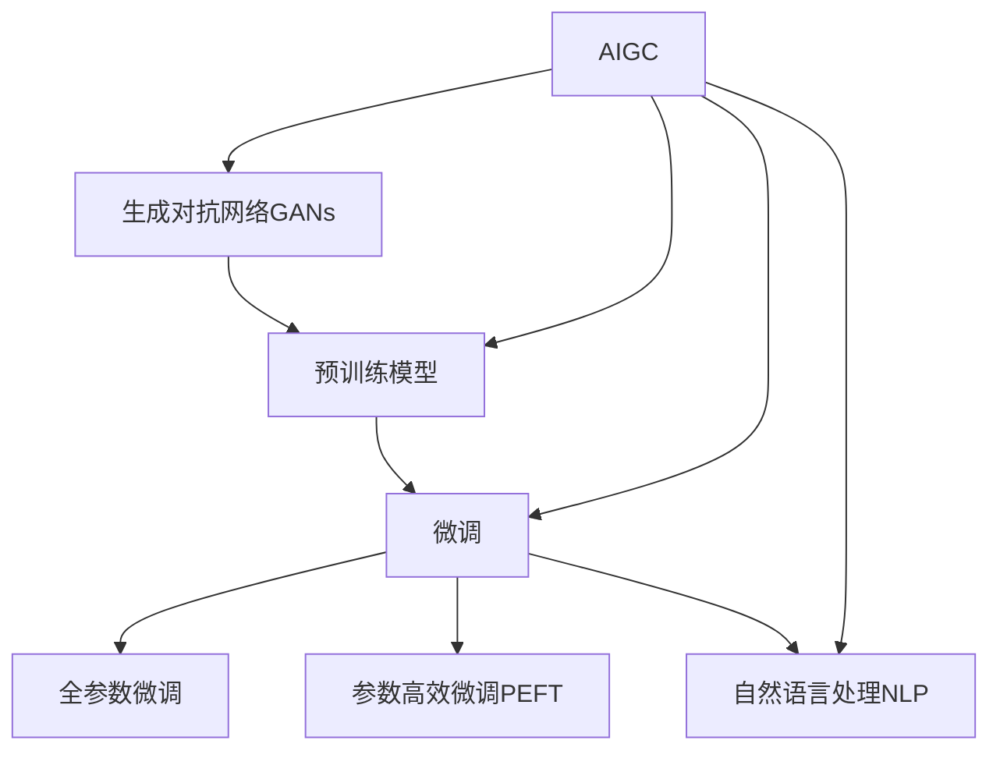

                 

# AIGC助力智慧城市建设

## 1. 背景介绍

### 1.1 问题由来

智慧城市建设作为新一代城市管理的战略选择，正在全球范围内掀起一场科技革命。面对城市管理复杂性、资源紧缺性等挑战，如何利用先进技术提升城市运行的智能化水平，改善市民生活质量，已成为世界各地的共同追求。人工智能（AI）和大模型技术在此背景下应运而生，以其强大的数据处理能力、高效的决策优化功能，为智慧城市建设提供了新思路和新方法。

### 1.2 问题核心关键点

AIGC（人工智能生成内容）技术通过深度学习和预训练模型，可以在短时间内生成大量高质量的文本、图像、视频等，其自动化、高效化的特点，为智慧城市建设带来了新的可能性。在交通管理、公共安全、环境监测、城市规划等多个方面，AIGC技术已经展现出广阔的应用前景。

## 2. 核心概念与联系

### 2.1 核心概念概述

要深入理解AIGC在智慧城市中的应用，首先需要理解一些核心概念：

- **人工智能生成内容（AIGC）**：利用深度学习和大规模预训练模型，自动生成文本、图像、视频等内容，显著提升内容创作效率和质量。
- **智慧城市**：通过信息技术手段，实现城市治理、公共服务、社会参与的智能化和精准化，构建人与环境和谐共生的城市发展模式。
- **预训练模型**：如BERT、GPT等，在大规模无标签数据上通过自监督学习训练得到，具备泛化能力强、推理能力优秀的特点。
- **微调（Fine-Tuning）**：在预训练模型基础上，针对特定任务进行有监督优化，提升模型性能。
- **参数高效微调（Parameter-Efficient Fine-Tuning, PEFT）**：只微调模型中少数参数，避免过多参数影响模型泛化能力。
- **生成对抗网络（GANs）**：利用生成器和判别器，训练生成高质量的图像和视频内容。
- **自然语言处理（NLP）**：利用语言模型生成文本内容，支持文本生成、文本摘要、翻译、问答等应用。

这些概念相互关联，构成了一个AIGC技术在智慧城市应用中的基本框架：



## 3. 核心算法原理 & 具体操作步骤

### 3.1 算法原理概述

AIGC技术在智慧城市中的应用，主要是通过深度学习和预训练模型，自动生成高质量的文本、图像和视频内容，支持城市管理的各个环节。核心算法原理包括：

- **预训练模型**：利用大规模无标签数据进行训练，学习通用的语言和视觉特征。
- **微调**：针对具体任务，如交通管理、环境监测、公共服务等，在少量有标签数据上进一步优化模型，提升模型性能。
- **生成对抗网络（GANs）**：通过对抗训练，生成逼真、多样化的图像和视频内容，增强城市管理的视觉化水平。
- **自然语言处理（NLP）**：利用语言模型生成文本内容，支持城市管理中的人机交互和信息交换。

### 3.2 算法步骤详解

AIGC在智慧城市建设中的应用，一般包括以下几个步骤：

1. **准备数据集**：收集城市管理相关的文本、图像和视频数据，如交通流量数据、环境监测数据、公共服务数据等，并划分为训练集、验证集和测试集。

2. **选择预训练模型**：根据应用场景，选择适合的大规模预训练模型，如BERT、GPT、GAN等。

3. **设计任务适配层**：根据具体任务需求，设计合适的任务适配层，如分类器、生成器、解码器等。

4. **设置超参数**：选择优化算法（如Adam、SGD等）及其参数，设置学习率、批大小、迭代轮数等。

5. **微调模型**：在训练集上，使用有监督的微调方法，优化模型在特定任务上的性能。

6. **评估与部署**：在验证集上评估微调后的模型性能，并在实际应用中测试和部署，集成到智慧城市系统中。

7. **持续学习**：持续收集新数据，定期重新微调模型，以适应城市环境变化和需求提升。

### 3.3 算法优缺点

AIGC在智慧城市建设中的应用具有以下优点：

- **高效性**：能够快速生成大量高质量内容，提高城市管理效率。
- **灵活性**：适用于各种场景，如交通、环境、公共服务等领域。
- **可扩展性**：模型可以不断更新，以适应城市发展的需要。

同时，也存在一些缺点：

- **依赖数据质量**：生成内容的质量很大程度上取决于训练数据的质量。
- **存在偏见**：预训练模型可能带有数据偏差，生成内容也可能继承这些偏见。
- **计算资源需求高**：大规模预训练和微调需要大量计算资源。

### 3.4 算法应用领域

AIGC技术在智慧城市建设中的应用领域广泛，主要包括以下几个方面：

- **智能交通管理**：生成交通流量报告、路况预测等内容，辅助交通管理部门制定策略。
- **环境监测与治理**：生成环境报告、空气质量预测等内容，支持环境监测和治理。
- **公共安全**：生成安全提示、应急预案等内容，增强公共安全保障。
- **城市规划与建设**：生成城市规划方案、建筑设计等内容，支持城市建设与改造。
- **智慧旅游**：生成旅游信息、景点介绍等内容，提升游客体验。
- **文化宣传**：生成宣传材料、活动介绍等内容，推广城市文化和活动。

## 4. 数学模型和公式 & 详细讲解  
### 4.1 数学模型构建

AIGC技术在智慧城市中的应用，主要涉及文本生成、图像生成和视频生成等任务。以下以文本生成为例，构建数学模型。

假设生成模型为 $P(x|y)$，其中 $x$ 为生成的文本，$y$ 为输入的上下文信息（如历史数据、用户指令等）。模型的目标是最小化生成文本与真实文本的差异，通常使用交叉熵损失函数：

$$
\mathcal{L} = -\frac{1}{N} \sum_{i=1}^N \sum_{x} P(x|y_i) \log Q(x|y_i)
$$

其中 $P(x|y)$ 为生成模型，$Q(x|y)$ 为目标文本的模型，$N$ 为生成文本的数量。通过优化上述损失函数，可以训练得到高质量的文本生成模型。

### 4.2 公式推导过程

以文本生成模型为例，推导如下：

1. **生成模型的定义**：
   - 生成模型 $P(x|y)$ 定义为：$P(x|y) = \prod_{t=1}^T P(x_t|x_{t-1},y)$，其中 $T$ 为文本长度。

2. **目标模型的定义**：
   - 目标文本的模型 $Q(x|y)$ 定义为：$Q(x|y) = \prod_{t=1}^T Q(x_t|x_{t-1},y)$。

3. **损失函数推导**：
   - 交叉熵损失函数：
     - $-\sum_{x} P(x|y) \log Q(x|y)$
     - $=-\sum_{x} \prod_{t=1}^T P(x_t|x_{t-1},y) \log \prod_{t=1}^T Q(x_t|x_{t-1},y)$
     - $=-\sum_{x} \prod_{t=1}^T P(x_t|x_{t-1},y) \log Q(x_t|x_{t-1},y)$
     - $=-\sum_{x} \sum_{t=1}^T P(x_t|x_{t-1},y) \log Q(x_t|x_{t-1},y)$
     - $=-\frac{1}{N} \sum_{i=1}^N \sum_{t=1}^T P(x_{i,t}|x_{i,t-1},y_i) \log Q(x_{i,t}|x_{i,t-1},y_i)$

4. **优化目标**：
   - 最小化损失函数 $\mathcal{L} = -\frac{1}{N} \sum_{i=1}^N \sum_{t=1}^T P(x_{i,t}|x_{i,t-1},y_i) \log Q(x_{i,t}|x_{i,t-1},y_i)$

### 4.3 案例分析与讲解

以智能交通管理中的路况预测为例：

- **数据准备**：收集历史交通流量数据，划分为训练集、验证集和测试集。
- **模型选择**：选择适合的预训练语言模型（如GPT），设计任务适配层。
- **微调训练**：在训练集上，使用有监督的微调方法，优化模型在路况预测任务上的性能。
- **模型评估**：在验证集上评估模型性能，调整超参数。
- **应用部署**：将微调后的模型部署到城市交通管理系统中，进行实时路况预测。

## 5. 项目实践：代码实例和详细解释说明

### 5.1 开发环境搭建

在进行项目实践前，需要准备好开发环境。以下以PyTorch为例，搭建开发环境：

1. **安装Anaconda**：
   - 从官网下载并安装Anaconda，用于创建独立的Python环境。

2. **创建虚拟环境**：
   - `conda create -n pytorch-env python=3.8`
   - `conda activate pytorch-env`

3. **安装PyTorch**：
   - `conda install pytorch torchvision torchaudio cudatoolkit=11.1 -c pytorch -c conda-forge`

4. **安装Transformers库**：
   - `pip install transformers`

5. **安装各类工具包**：
   - `pip install numpy pandas scikit-learn matplotlib tqdm jupyter notebook ipython`

完成上述步骤后，即可在 `pytorch-env` 环境中开始项目实践。

### 5.2 源代码详细实现

以智能交通管理中的路况预测为例，使用PyTorch和Transformers库进行模型微调。

```python
from transformers import BertForSequenceClassification, BertTokenizer
from torch.utils.data import Dataset, DataLoader
from torch import nn
import torch

# 定义数据集
class TrafficData(Dataset):
    def __init__(self, data, tokenizer):
        self.data = data
        self.tokenizer = tokenizer

    def __len__(self):
        return len(self.data)

    def __getitem__(self, idx):
        text = self.data[idx]
        tokenized = self.tokenizer(text, padding=True, truncation=True, max_length=512)
        input_ids = tokenized.input_ids
        attention_mask = tokenized.attention_mask
        label = torch.tensor(1, dtype=torch.long)  # 假设标签为1表示拥堵，0表示非拥堵
        return {'input_ids': input_ids, 'attention_mask': attention_mask, 'labels': label}

# 加载数据
tokenizer = BertTokenizer.from_pretrained('bert-base-cased')
train_dataset = TrafficData(train_data, tokenizer)
val_dataset = TrafficData(val_data, tokenizer)
test_dataset = TrafficData(test_data, tokenizer)

# 定义模型和损失函数
model = BertForSequenceClassification.from_pretrained('bert-base-cased', num_labels=2)
criterion = nn.CrossEntropyLoss()

# 定义优化器和超参数
optimizer = torch.optim.Adam(model.parameters(), lr=2e-5)
epochs = 10

# 训练模型
def train_epoch(model, dataset, optimizer, criterion):
    model.train()
    for batch in DataLoader(dataset, batch_size=32, shuffle=True):
        input_ids = batch['input_ids'].to(device)
        attention_mask = batch['attention_mask'].to(device)
        labels = batch['labels'].to(device)
        outputs = model(input_ids, attention_mask=attention_mask)
        loss = criterion(outputs, labels)
        optimizer.zero_grad()
        loss.backward()
        optimizer.step()

# 训练模型
device = torch.device('cuda') if torch.cuda.is_available() else torch.device('cpu')
model.to(device)

for epoch in range(epochs):
    train_epoch(model, train_dataset, optimizer, criterion)

# 评估模型
def evaluate(model, dataset):
    model.eval()
    correct = 0
    total = 0
    with torch.no_grad():
        for batch in DataLoader(dataset, batch_size=32, shuffle=False):
            input_ids = batch['input_ids'].to(device)
            attention_mask = batch['attention_mask'].to(device)
            labels = batch['labels'].to(device)
            outputs = model(input_ids, attention_mask=attention_mask)
            _, preds = torch.max(outputs, dim=1)
            total += labels.size(0)
            correct += (preds == labels).sum().item()
    accuracy = correct / total
    return accuracy

test_accuracy = evaluate(model, test_dataset)
print(f'Test accuracy: {test_accuracy:.2f}')
```

### 5.3 代码解读与分析

上述代码中，我们使用BertForSequenceClassification模型进行路况预测任务的微调。具体实现步骤如下：

1. **数据准备**：
   - 定义数据集类 `TrafficData`，包含数据预处理和标签化。
   - 使用BertTokenizer将文本数据进行分词和编码。
   - 将数据划分为训练集、验证集和测试集。

2. **模型定义**：
   - 选择BertForSequenceClassification模型，设置标签数量为2（拥堵和非拥堵）。
   - 定义交叉熵损失函数。

3. **训练模型**：
   - 使用Adam优化器进行模型训练，设定学习率为2e-5，训练10个epoch。
   - 在每个epoch内，对训练集数据进行前向传播和反向传播，更新模型参数。

4. **评估模型**：
   - 在测试集上评估模型性能，计算准确率。

## 6. 实际应用场景

### 6.1 智能交通管理

在智能交通管理中，AIGC技术可以用于实时路况预测、交通流量分析、路线规划等方面。

- **实时路况预测**：通过微调预训练模型，生成实时路况报告，为驾驶员提供导航建议。
- **交通流量分析**：生成交通流量报告，为交通管理部门提供数据支持。
- **路线规划**：生成最优路线，提高交通运输效率。

### 6.2 公共安全

AIGC技术在公共安全中的应用包括：

- **安全预警**：生成安全预警信息，如火灾、地震等自然灾害预警。
- **应急响应**：生成应急响应方案，提高应对突发事件的能力。
- **视频监控**：生成视频监控信息，实时监测城市公共安全。

### 6.3 环境监测与治理

AIGC技术在环境监测与治理中的应用包括：

- **环境报告生成**：生成环境报告，监测空气质量、水质等环境指标。
- **污染预测**：生成污染预测报告，预警污染事件。
- **生态保护**：生成生态保护方案，支持城市绿化和生态修复。

### 6.4 未来应用展望

未来，AIGC技术在智慧城市建设中的应用将更加广泛和深入。

- **多模态数据融合**：结合图像、视频、音频等多模态数据，提供更加全面、准确的信息支持。
- **跨领域迁移学习**：将AIGC技术应用于更多领域，如医疗、教育、旅游等。
- **实时动态优化**：通过持续学习，实时动态优化模型，提升智慧城市管理的智能化水平。

## 7. 工具和资源推荐

### 7.1 学习资源推荐

1. **《Transformer从原理到实践》系列博文**：详细介绍了Transformer原理、BERT模型和微调技术。
2. **CS224N《深度学习自然语言处理》课程**：斯坦福大学开设的NLP明星课程，涵盖NLP基础和前沿。
3. **《Natural Language Processing with Transformers》书籍**：介绍如何使用Transformers库进行NLP任务开发。
4. **HuggingFace官方文档**：提供海量预训练模型和微调样例代码。
5. **CLUE开源项目**：提供中文NLP数据集和微调baseline。

### 7.2 开发工具推荐

1. **PyTorch**：深度学习框架，灵活动态的计算图。
2. **TensorFlow**：由Google主导的深度学习框架，适合大规模工程应用。
3. **Transformers库**：HuggingFace开发的NLP工具库，集成了SOTA语言模型。
4. **Weights & Biases**：实验跟踪工具，记录和可视化模型训练过程。
5. **TensorBoard**：TensorFlow配套的可视化工具，监测模型训练状态。

### 7.3 相关论文推荐

1. **Attention is All You Need**：提出Transformer结构，开启预训练大模型时代。
2. **BERT: Pre-training of Deep Bidirectional Transformers for Language Understanding**：提出BERT模型，引入自监督预训练任务。
3. **Language Models are Unsupervised Multitask Learners**：展示大语言模型的零样本学习能力。
4. **Parameter-Efficient Transfer Learning for NLP**：提出 Adapter等参数高效微调方法。
5. **Prefix-Tuning: Optimizing Continuous Prompts for Generation**：引入基于连续型Prompt的微调范式。
6. **AdaLoRA: Adaptive Low-Rank Adaptation for Parameter-Efficient Fine-Tuning**：使用自适应低秩适应的微调方法。

## 8. 总结：未来发展趋势与挑战

### 8.1 研究成果总结

本文系统介绍了AIGC技术在智慧城市建设中的应用，包括智能交通管理、公共安全、环境监测与治理等多个领域。通过深度学习和预训练模型，AIGC技术能够快速生成高质量内容，提升城市管理效率和智能化水平。

### 8.2 未来发展趋势

未来，AIGC技术在智慧城市建设中的应用将呈现以下几个趋势：

1. **多模态数据融合**：结合图像、视频、音频等多模态数据，提供更加全面、准确的信息支持。
2. **跨领域迁移学习**：将AIGC技术应用于更多领域，如医疗、教育、旅游等。
3. **实时动态优化**：通过持续学习，实时动态优化模型，提升智慧城市管理的智能化水平。

### 8.3 面临的挑战

尽管AIGC技术在智慧城市建设中展现出巨大潜力，但也面临一些挑战：

1. **数据质量依赖**：生成内容的质量很大程度上取决于训练数据的质量。
2. **偏见问题**：预训练模型可能带有数据偏差，生成内容也可能继承这些偏见。
3. **计算资源需求高**：大规模预训练和微调需要大量计算资源。

### 8.4 研究展望

未来，AIGC技术在智慧城市建设中的应用需要进一步突破，解决上述挑战：

1. **数据增强**：通过数据增强技术，提升数据质量，减少偏差。
2. **公平性研究**：引入公平性评估指标，消除模型偏见。
3. **资源优化**：优化模型结构和训练过程，提高计算效率。
4. **多领域应用**：将AIGC技术应用于更多领域，提升智慧城市管理的智能化水平。

---

作者：禅与计算机程序设计艺术 / Zen and the Art of Computer Programming

