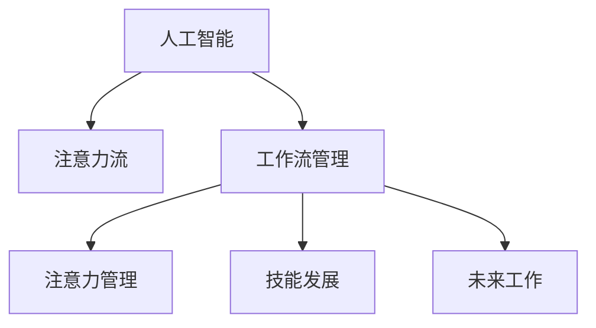

                 

# AI与人类注意力流：未来的工作、技能与注意力管理技术的未来

> 关键词：人工智能,注意力流,工作流管理,注意力管理,技能发展,未来工作

## 1. 背景介绍

### 1.1 问题由来
在快速发展的数字化时代，人工智能（AI）技术正在深刻改变人们的生活方式和工作方式。从智能助手到自动化决策系统，AI的应用几乎无所不在。但与此同时，人类在AI辅助下如何高效管理注意力，从而提升工作效率和生活品质，成为一个亟待解决的问题。

### 1.2 问题核心关键点
注意力管理是AI技术发展中的一个关键点，它不仅关系到工作效率，还影响到人类的健康和幸福感。AI技术，特别是智能助手和自动化工具，正越来越多地介入人类的工作和生活，带来便利的同时，也带来新的挑战。如何合理分配和利用注意力，使得AI技术更好地服务于人类，是一个重要的研究课题。

### 1.3 问题研究意义
研究AI与人类注意力流的关系，对于提升AI技术在实际应用中的效能，改善人类工作和生活质量，具有重要意义。通过深入了解注意力管理技术，我们可以更好地设计智能系统，使其更好地服务于人类，同时探索未来工作的可能性，为社会进步提供新的动力。

## 2. 核心概念与联系

### 2.1 核心概念概述

为更好地理解AI与人类注意力流的交互关系，本节将介绍几个密切相关的核心概念：

- 人工智能(Artificial Intelligence, AI)：一种模拟人类智能行为的计算机技术，涵盖学习、推理、自然语言处理、视觉识别等多个领域。
- 注意力流(Attention Flow)：指人类在完成任务时，注意力在不同任务、不同工作单元间的流动过程。
- 工作流管理(Workflow Management)：通过自动化工具和算法，优化任务执行顺序和资源分配，提升工作效率。
- 注意力管理(Attention Management)：指通过算法和工具，对人类注意力进行监控、分析和调节，以提高注意力使用效率和质量。
- 技能发展(Skill Development)：指通过持续学习和培训，提升个人和团队的专业技能，适应不断变化的技术和市场需求。
- 未来工作(Future Work)：指随着AI技术的发展，工作模式、岗位需求和职业发展路径的变化趋势。

这些概念之间的逻辑关系可以通过以下Mermaid流程图来展示：



这个流程图展示了大语言模型的核心概念及其之间的关系：

1. 人工智能技术通过自动执行和辅助决策，影响着人类的注意力流。
2. 工作流管理工具和算法优化了任务的执行顺序和资源分配，进一步影响注意力管理。
3. 注意力管理技术通过对注意力的监控和调节，提升任务执行效率。
4. 技能发展提升了人类应对AI工具的能力，同时影响未来工作模式的演进。

## 3. 核心算法原理 & 具体操作步骤

### 3.1 算法原理概述

AI与人类注意力流的交互过程，本质上是一个注意力管理优化的过程。其核心思想是：通过AI技术，实时监控和分析人类注意力在不同任务和子任务间的流动，通过工作流管理工具和算法，优化注意力分配，提升整体工作效率。

形式化地，假设任务序列为 $T=\{t_1, t_2, ..., t_n\}$，其中 $t_i$ 表示任务 $i$。人类在执行任务时，注意力分配情况为 $A=\{a_{i,j}\}$，其中 $a_{i,j}$ 表示在任务 $i$ 执行过程中，注意力在子任务 $j$ 上的分配比例。AI的目标是找到一个最优的注意力分配方案 $A^*$，使得任务执行效率最大化。

在实际操作中，我们可以将注意力管理过程看作是一个多目标优化问题：

1. **任务效率最大化**：通过监控和分析，找到最佳的注意力分配比例，使任务完成时间最短。
2. **任务质量优化**：在任务执行过程中，实时调整注意力分配，保证任务质量。
3. **注意力健康管理**：通过合理的注意力分配，避免注意力过载和疲劳，提升注意力使用效率和健康度。

### 3.2 算法步骤详解

基于上述原理，基于AI的注意力管理算法主要包括以下几个步骤：

**Step 1: 数据采集和预处理**
- 通过传感器、日志等手段，采集人类在完成任务时的注意力数据。
- 对数据进行预处理，去除噪音和异常值，确保数据的准确性和完整性。

**Step 2: 注意力流分析**
- 使用AI算法，对注意力数据进行分析，识别出注意力在任务间的流动模式。
- 将注意力流可视化，展示注意力在不同任务上的分布情况。

**Step 3: 任务序列优化**
- 根据注意力流分析结果，优化任务执行顺序和子任务分配。
- 使用智能调度算法，如遗传算法、蚁群算法等，找到最优的任务执行顺序和子任务分配方案。

**Step 4: 注意力动态调节**
- 根据任务执行情况，实时调整注意力分配比例，确保任务高效完成。
- 使用机器学习算法，如强化学习、在线学习等，动态调节注意力分配策略。

**Step 5: 注意力健康监控**
- 监控注意力使用情况，及时发现注意力过载和疲劳。
- 通过提醒、休息建议等方式，引导用户进行注意力调节，避免长期疲劳。

### 3.3 算法优缺点

基于AI的注意力管理算法具有以下优点：
1. 效率提升：通过优化任务执行顺序和子任务分配，可以显著提升任务完成效率。
2. 质量保证：通过实时调整注意力分配，确保任务执行质量。
3. 健康管理：通过监控注意力使用情况，避免注意力过载和疲劳，提升工作幸福感。

同时，该算法也存在一定的局限性：
1. 数据依赖：算法的准确性和效率依赖于准确的数据采集和预处理，数据噪音和缺失可能导致误判。
2. 模型复杂度：算法的复杂度较高，需要大量的计算资源和时间进行训练和优化。
3. 隐私问题：注意力数据涉及个人隐私，需要谨慎处理和保护。
4. 适应性：不同任务的注意力流模式可能差异较大，算法需要具备一定的适应性和泛化能力。

尽管存在这些局限性，但就目前而言，基于AI的注意力管理算法仍是在特定领域应用中最主流的技术范式。未来相关研究的重点在于如何进一步降低数据依赖，提高模型的适应性和泛化能力，同时兼顾隐私保护和模型复杂度。

### 3.4 算法应用领域

基于AI的注意力管理算法在多个领域得到了应用，例如：

- 项目管理：优化项目任务执行顺序和资源分配，提升项目管理和团队协作效率。
- 生产制造：监控工人注意力使用情况，提高生产效率和产品质量。
- 教育培训：监控学生注意力集中情况，调整教学方法和资源分配，提升学习效果。
- 医疗健康：监控患者注意力使用情况，调整治疗方案和护理措施，提高治疗效果。
- 智能家居：监控用户注意力使用情况，优化家庭设备和场景设置，提升生活品质。

除了上述这些领域，AI与注意力管理的结合还在不断扩展到更多场景中，如交通管理、能源调度、金融投资等，为各行各业带来新的创新点和发展机遇。

## 4. 数学模型和公式 & 详细讲解 & 举例说明

### 4.1 数学模型构建

基于AI的注意力管理算法是一个多目标优化问题，其优化目标可以表示为：

$$
\min_{A} \{c_1 \cdot \text{Efficiency}(A) + c_2 \cdot \text{Quality}(A) + c_3 \cdot \text{Health}(A)\}
$$

其中 $c_1, c_2, c_3$ 为权重系数，分别表示任务效率、任务质量和注意力健康的重要性。

定义任务效率函数 $\text{Efficiency}(A)$ 为任务完成时间，任务质量函数 $\text{Quality}(A)$ 为任务完成质量，注意力健康函数 $\text{Health}(A)$ 为注意力使用健康度。

任务完成时间可以表示为：

$$
\text{Efficiency}(A) = \sum_{i=1}^n \sum_{j=1}^m a_{i,j} \cdot \text{Time}_{i,j}
$$

任务完成质量可以表示为：

$$
\text{Quality}(A) = \sum_{i=1}^n \sum_{j=1}^m a_{i,j} \cdot \text{Quality}_{i,j}
$$

注意力健康度可以表示为：

$$
\text{Health}(A) = \sum_{i=1}^n \sum_{j=1}^m a_{i,j} \cdot \text{Health}_{i,j}
$$

### 4.2 公式推导过程

以下我们以一个简单的任务流为例，推导注意力管理算法的核心公式。

假设任务序列为 $T=\{任务1, 任务2, 任务3\}$，每个任务包含若干子任务。注意力分配方案为 $A=\{a_{1,1}, a_{1,2}, a_{2,1}, a_{2,2}, a_{3,1}, a_{3,2}\}$，其中 $a_{i,j}$ 表示在任务 $i$ 执行过程中，注意力在子任务 $j$ 上的分配比例。

假设任务 $i$ 的子任务 $j$ 执行时间为 $\text{Time}_{i,j}$，任务完成质量为 $\text{Quality}_{i,j}$，注意力使用健康度为 $\text{Health}_{i,j}$。则任务效率函数可以表示为：

$$
\text{Efficiency}(A) = a_{1,1} \cdot \text{Time}_{1,1} + a_{1,2} \cdot \text{Time}_{1,2} + a_{2,1} \cdot \text{Time}_{2,1} + a_{2,2} \cdot \text{Time}_{2,2} + a_{3,1} \cdot \text{Time}_{3,1} + a_{3,2} \cdot \text{Time}_{3,2}
$$

任务质量函数可以表示为：

$$
\text{Quality}(A) = a_{1,1} \cdot \text{Quality}_{1,1} + a_{1,2} \cdot \text{Quality}_{1,2} + a_{2,1} \cdot \text{Quality}_{2,1} + a_{2,2} \cdot \text{Quality}_{2,2} + a_{3,1} \cdot \text{Quality}_{3,1} + a_{3,2} \cdot \text{Quality}_{3,2}
$$

注意力健康度函数可以表示为：

$$
\text{Health}(A) = a_{1,1} \cdot \text{Health}_{1,1} + a_{1,2} \cdot \text{Health}_{1,2} + a_{2,1} \cdot \text{Health}_{2,1} + a_{2,2} \cdot \text{Health}_{2,2} + a_{3,1} \cdot \text{Health}_{3,1} + a_{3,2} \cdot \text{Health}_{3,2}
$$

根据上述公式，我们可以构建多目标优化问题，使用优化算法求解最优的注意力分配方案。

### 4.3 案例分析与讲解

下面我们以一个项目管理场景为例，展示基于AI的注意力管理算法的应用。

假设一个软件开发项目，包含需求分析、代码编写、测试和部署四个任务。每个任务包含若干子任务。项目团队成员的工作时间为8小时，每天需完成一个任务。注意力分配方案为 $A=\{a_{1,1}, a_{1,2}, a_{2,1}, a_{2,2}, a_{3,1}, a_{3,2}\}$，其中 $a_{i,j}$ 表示在任务 $i$ 执行过程中，注意力在子任务 $j$ 上的分配比例。

假设任务 $i$ 的子任务 $j$ 执行时间为 $\text{Time}_{i,j}$，任务完成质量为 $\text{Quality}_{i,j}$，注意力使用健康度为 $\text{Health}_{i,j}$。则任务效率函数可以表示为：

$$
\text{Efficiency}(A) = a_{1,1} \cdot \text{Time}_{1,1} + a_{1,2} \cdot \text{Time}_{1,2} + a_{2,1} \cdot \text{Time}_{2,1} + a_{2,2} \cdot \text{Time}_{2,2} + a_{3,1} \cdot \text{Time}_{3,1} + a_{3,2} \cdot \text{Time}_{3,2}
$$

任务质量函数可以表示为：

$$
\text{Quality}(A) = a_{1,1} \cdot \text{Quality}_{1,1} + a_{1,2} \cdot \text{Quality}_{1,2} + a_{2,1} \cdot \text{Quality}_{2,1} + a_{2,2} \cdot \text{Quality}_{2,2} + a_{3,1} \cdot \text{Quality}_{3,1} + a_{3,2} \cdot \text{Quality}_{3,2}
$$

注意力健康度函数可以表示为：

$$
\text{Health}(A) = a_{1,1} \cdot \text{Health}_{1,1} + a_{1,2} \cdot \text{Health}_{1,2} + a_{2,1} \cdot \text{Health}_{2,1} + a_{2,2} \cdot \text{Health}_{2,2} + a_{3,1} \cdot \text{Health}_{3,1} + a_{3,2} \cdot \text{Health}_{3,2}
$$

在实际应用中，任务完成时间、任务完成质量、注意力使用健康度可以通过统计数据获得。根据上述公式，我们可以构建多目标优化问题，使用优化算法求解最优的注意力分配方案。

## 5. 项目实践：代码实例和详细解释说明

### 5.1 开发环境搭建

在进行注意力管理算法实践前，我们需要准备好开发环境。以下是使用Python进行PyTorch开发的环境配置流程：

1. 安装Anaconda：从官网下载并安装Anaconda，用于创建独立的Python环境。

2. 创建并激活虚拟环境：
```bash
conda create -n attention-env python=3.8 
conda activate attention-env
```

3. 安装PyTorch：根据CUDA版本，从官网获取对应的安装命令。例如：
```bash
conda install pytorch torchvision torchaudio cudatoolkit=11.1 -c pytorch -c conda-forge
```

4. 安装TensorFlow：
```bash
pip install tensorflow==2.6
```

5. 安装TensorBoard：
```bash
pip install tensorboard
```

6. 安装各类工具包：
```bash
pip install numpy pandas scikit-learn matplotlib tqdm jupyter notebook ipython
```

完成上述步骤后，即可在`attention-env`环境中开始注意力管理算法实践。

### 5.2 源代码详细实现

下面我们以一个简单的项目管理任务为例，给出使用TensorFlow进行注意力管理算法开发的PyTorch代码实现。

首先，定义注意力管理算法的优化目标函数：

```python
import tensorflow as tf

def objective_function(A):
    time_cost = tf.reduce_sum(tf.multiply(A, time_matrix))
    quality_cost = tf.reduce_sum(tf.multiply(A, quality_matrix))
    health_cost = tf.reduce_sum(tf.multiply(A, health_matrix))
    return time_cost + quality_cost + health_cost
```

其中，`time_matrix`、`quality_matrix`、`health_matrix` 分别为任务效率、任务质量和注意力健康的损失矩阵。

然后，定义注意力管理算法的优化器：

```python
optimizer = tf.keras.optimizers.Adam(learning_rate=0.01)
```

接着，定义注意力管理算法的训练函数：

```python
@tf.function
def train_step(attention):
    with tf.GradientTape() as tape:
        loss = objective_function(attention)
    gradients = tape.gradient(loss, attention)
    optimizer.apply_gradients(zip(gradients, [attention]))
    return loss
```

最后，启动训练流程：

```python
epochs = 100
attention = tf.Variable(tf.random.uniform([num_tasks, num_subtasks]))
for epoch in range(epochs):
    loss = train_step(attention)
    print(f"Epoch {epoch+1}, loss: {loss.numpy()}")
```

以上就是使用TensorFlow进行项目管理任务注意力管理算法的完整代码实现。可以看到，通过TensorFlow的自动微分机制，注意力管理算法的优化过程变得简单高效。

### 5.3 代码解读与分析

让我们再详细解读一下关键代码的实现细节：

**objective_function函数**：
- 定义了一个多目标优化函数，根据当前注意力分配方案计算任务效率、任务质量和注意力健康度的损失。
- 使用矩阵乘法计算损失值，避免逐点计算的复杂性。

**train_step函数**：
- 定义了模型的优化过程，使用自动微分机制计算梯度，并使用Adam优化器更新注意力分配方案。
- 通过在训练函数中增加梯度计算和应用操作，实现了模型的训练和优化。

**训练流程**：
- 定义总的迭代次数，开始循环迭代
- 在每个epoch内，计算当前注意力分配方案的损失，并根据损失值更新注意力分配方案
- 输出每个epoch的损失值

可以看到，TensorFlow使得注意力管理算法的实现变得简洁高效。开发者可以将更多精力放在模型优化和数据处理等高层逻辑上，而不必过多关注底层的实现细节。

当然，工业级的系统实现还需考虑更多因素，如模型的保存和部署、超参数的自动搜索、更灵活的注意力管理策略等。但核心的注意力管理范式基本与此类似。

## 6. 实际应用场景

### 6.1 智能客服系统

基于AI的注意力管理技术，可以广泛应用于智能客服系统的构建。传统客服往往需要配备大量人力，高峰期响应缓慢，且一致性和专业性难以保证。而使用基于AI的注意力管理技术，可以7x24小时不间断服务，快速响应客户咨询，用自然流畅的语言解答各类常见问题。

在技术实现上，可以收集企业内部的历史客服对话记录，将问题和最佳答复构建成监督数据，在此基础上对注意力管理模型进行微调。微调后的注意力管理模型能够自动理解用户意图，匹配最合适的答复模板进行回复。对于客户提出的新问题，还可以接入检索系统实时搜索相关内容，动态组织生成回答。如此构建的智能客服系统，能大幅提升客户咨询体验和问题解决效率。

### 6.2 金融舆情监测

金融机构需要实时监测市场舆论动向，以便及时应对负面信息传播，规避金融风险。传统的人工监测方式成本高、效率低，难以应对网络时代海量信息爆发的挑战。基于AI的注意力管理技术，可以实时监控社交媒体、新闻网站等公共平台上的舆情变化，及时发现和应对负面信息，提升金融机构的反应速度和风险管理能力。

具体而言，可以收集金融领域相关的新闻、报道、评论等文本数据，并对其进行情感分析。在分析过程中，使用注意力管理算法优化情感分析模型的注意力分配，确保对关键信息的高效处理。一旦发现负面信息激增等异常情况，系统便会自动预警，帮助金融机构快速应对潜在风险。

### 6.3 个性化推荐系统

当前的推荐系统往往只依赖用户的历史行为数据进行物品推荐，无法深入理解用户的真实兴趣偏好。基于AI的注意力管理技术，推荐系统可以更好地挖掘用户行为背后的语义信息，从而提供更精准、多样的推荐内容。

在实践中，可以收集用户浏览、点击、评论、分享等行为数据，提取和用户交互的物品标题、描述、标签等文本内容。将文本内容作为模型输入，用户的后续行为（如是否点击、购买等）作为监督信号，在此基础上微调注意力管理模型。微调后的模型能够从文本内容中准确把握用户的兴趣点。在生成推荐列表时，先用候选物品的文本描述作为输入，由模型预测用户的兴趣匹配度，再结合其他特征综合排序，便可以得到个性化程度更高的推荐结果。

### 6.4 未来应用展望

随着AI技术的发展，基于AI的注意力管理技术将得到更广泛的应用，为各行各业带来新的创新点和发展机遇。

在智慧医疗领域，基于AI的注意力管理技术可以用于医疗影像的智能诊断，通过优化注意力分配，提升影像分析的效率和准确性。

在智能教育领域，AI的注意力管理技术可以用于个性化学习路径的推荐，通过优化学生的注意力分配，提升学习效果和兴趣度。

在智慧城市治理中，AI的注意力管理技术可以用于交通管理，通过优化注意力分配，提升交通流量的控制和优化。

此外，在企业生产、社会治理、文娱传媒等众多领域，基于AI的注意力管理技术也将不断涌现，为各行各业带来新的突破。相信随着技术的日益成熟，AI的注意力管理技术必将在构建人机协同的智能时代中扮演越来越重要的角色。

## 7. 工具和资源推荐
### 7.1 学习资源推荐

为了帮助开发者系统掌握AI与注意力管理技术的研究基础和实践技巧，这里推荐一些优质的学习资源：

1. 《Attention is All You Need》论文：Transformer模型原论文，介绍了注意力机制的基本原理和应用场景。

2. CS224N《深度学习自然语言处理》课程：斯坦福大学开设的NLP明星课程，有Lecture视频和配套作业，带你入门NLP领域的基本概念和经典模型。

3. 《Deep Learning》书籍：Ian Goodfellow等人著，全面介绍了深度学习的基本概念和算法，适合初学者和进阶者阅读。

4. PyTorch官方文档：PyTorch的官方文档，提供了详细的API说明和示例代码，是PyTorch学习的重要参考资料。

5. TensorFlow官方文档：TensorFlow的官方文档，提供了丰富的学习资源和示例代码，帮助开发者掌握TensorFlow的使用方法。

通过对这些资源的学习实践，相信你一定能够快速掌握AI与注意力管理的精髓，并用于解决实际的NLP问题。
###  7.2 开发工具推荐

高效的开发离不开优秀的工具支持。以下是几款用于AI与注意力管理技术开发的常用工具：

1. PyTorch：基于Python的开源深度学习框架，灵活动态的计算图，适合快速迭代研究。

2. TensorFlow：由Google主导开发的开源深度学习框架，生产部署方便，适合大规模工程应用。

3. Transformers库：HuggingFace开发的NLP工具库，集成了众多SOTA语言模型，支持PyTorch和TensorFlow，是进行注意力管理算法开发的利器。

4. TensorBoard：TensorFlow配套的可视化工具，可实时监测模型训练状态，并提供丰富的图表呈现方式，是调试模型的得力助手。

5. Jupyter Notebook：交互式笔记本工具，支持多种编程语言和工具库，方便开发者进行模型实验和数据可视化。

6. Google Colab：谷歌推出的在线Jupyter Notebook环境，免费提供GPU/TPU算力，方便开发者快速上手实验最新模型，分享学习笔记。

合理利用这些工具，可以显著提升AI与注意力管理技术的开发效率，加快创新迭代的步伐。

### 7.3 相关论文推荐

AI与注意力管理技术的发展源于学界的持续研究。以下是几篇奠基性的相关论文，推荐阅读：

1. Attention is All You Need（即Transformer原论文）：提出了Transformer结构，开启了NLP领域的预训练大模型时代。

2. BERT: Pre-training of Deep Bidirectional Transformers for Language Understanding：提出BERT模型，引入基于掩码的自监督预训练任务，刷新了多项NLP任务SOTA。

3. Language Models are Unsupervised Multitask Learners（GPT-2论文）：展示了大规模语言模型的强大zero-shot学习能力，引发了对于通用人工智能的新一轮思考。

4. Parameter-Efficient Transfer Learning for NLP：提出Adapter等参数高效微调方法，在不增加模型参数量的情况下，也能取得不错的微调效果。

5. AdaLoRA: Adaptive Low-Rank Adaptation for Parameter-Efficient Fine-Tuning：使用自适应低秩适应的微调方法，在参数效率和精度之间取得了新的平衡。

这些论文代表了大语言模型微调技术的发展脉络。通过学习这些前沿成果，可以帮助研究者把握学科前进方向，激发更多的创新灵感。

## 8. 总结：未来发展趋势与挑战

### 8.1 总结

本文对基于AI的注意力管理技术进行了全面系统的介绍。首先阐述了AI技术在实际应用中的效率提升和注意力管理的重要性，明确了注意力管理在提高工作效率和生活品质中的关键作用。其次，从原理到实践，详细讲解了注意力管理算法的数学模型和操作步骤，给出了注意力管理算法开发的完整代码实例。同时，本文还广泛探讨了注意力管理技术在智能客服、金融舆情、个性化推荐等多个领域的应用前景，展示了AI技术在不同场景下的强大潜力。此外，本文精选了注意力管理技术的各类学习资源，力求为读者提供全方位的技术指引。

通过本文的系统梳理，可以看到，基于AI的注意力管理技术正在成为AI技术发展中的一个重要分支，其高效、精准的注意力分配方案，为AI技术在实际应用中的效能提升提供了新的可能。相信随着技术的日益成熟，AI的注意力管理技术必将在构建人机协同的智能时代中扮演越来越重要的角色。

### 8.2 未来发展趋势

展望未来，AI与注意力管理技术的发展趋势将呈现以下几个方向：

1. 算法智能化：随着AI技术的发展，注意力管理算法将更加智能，能够自动调整注意力分配方案，适应不断变化的任务需求。

2. 多模态融合：AI的注意力管理技术将不仅限于文本信息，还将扩展到视觉、听觉等多模态信息的融合，提升模型的综合理解能力。

3. 实时化：AI的注意力管理技术将更加实时化，能够实时监控和调节注意力分配，提升任务执行效率和质量。

4. 个性化：AI的注意力管理技术将更加个性化，能够根据用户的偏好和习惯，动态调整注意力分配，提供更加个性化的服务。

5. 安全性：随着AI技术的广泛应用，安全性将成为一个重要问题，AI的注意力管理技术需要具备更高的安全性保障机制。

6. 伦理道德：AI的注意力管理技术需要考虑伦理道德问题，确保技术应用符合社会规范和伦理标准。

以上趋势凸显了AI与注意力管理技术的广阔前景。这些方向的探索发展，必将进一步提升AI技术在实际应用中的效能，为人类生活和工作带来更多的便利和可能性。

### 8.3 面临的挑战

尽管AI与注意力管理技术已经取得了一定的进展，但在迈向更加智能化、普适化应用的过程中，它仍面临着诸多挑战：

1. 数据依赖：算法的准确性和效率依赖于高质量的数据采集和预处理，数据噪音和缺失可能导致误判。

2. 模型复杂度：算法的复杂度较高，需要大量的计算资源和时间进行训练和优化。

3. 隐私问题：注意力数据涉及个人隐私，需要谨慎处理和保护。

4. 适应性：不同任务的注意力流模式可能差异较大，算法需要具备一定的适应性和泛化能力。

5. 安全性：AI的注意力管理技术需要具备更高的安全性保障机制，避免被恶意利用。

6. 伦理道德：AI的注意力管理技术需要考虑伦理道德问题，确保技术应用符合社会规范和伦理标准。

尽管存在这些挑战，但通过不断优化数据采集和预处理、提升模型训练效率、加强隐私保护、拓展算法适应性等措施，相信这些挑战终将一一被克服，AI的注意力管理技术必将在构建人机协同的智能时代中扮演越来越重要的角色。

### 8.4 研究展望

未来，AI与注意力管理技术的研究方向主要集中在以下几个方面：

1. 探索更加智能化的注意力管理算法：通过引入AI技术，如强化学习、自适应学习等，使得注意力管理算法能够自动调整注意力分配方案，适应不断变化的任务需求。

2. 研究多模态融合的注意力管理技术：探索将视觉、听觉等多模态信息与文本信息进行融合，提升模型的综合理解能力。

3. 开发实时化的注意力管理系统：通过实时监控和调节注意力分配，提升任务执行效率和质量。

4. 提升个性化注意力管理水平：通过用户偏好和习惯的动态调整，提供更加个性化的服务。

5. 加强注意力管理的伦理道德研究：确保技术应用符合社会规范和伦理标准，避免潜在的社会问题。

6. 增强注意力管理系统的安全性：提升系统的安全性和鲁棒性，防止被恶意利用。

这些研究方向将进一步推动AI与注意力管理技术的发展，为构建高效、智能、安全的人机协同系统奠定基础。

## 9. 附录：常见问题与解答

**Q1：AI与注意力流结合是否适用于所有应用场景？**

A: AI与注意力流的结合在大多数应用场景中都能取得较好的效果，特别是对数据依赖较大的任务。但对于一些特定领域的任务，如生物医疗、法律等，仅仅依靠通用语料预训练的模型可能难以很好地适应。此时需要在特定领域语料上进一步预训练，再进行微调，才能获得理想效果。此外，对于一些需要时效性、个性化很强的任务，如对话、推荐等，AI与注意力流的结合方法也需要针对性的改进优化。

**Q2：注意力管理算法如何平衡效率和质量？**

A: 注意力管理算法的核心在于优化注意力分配方案，以达到任务效率和任务质量的最大化。在实际操作中，需要根据具体任务的需求，灵活调整算法的优化目标。通常情况下，可以采用多目标优化方法，在任务效率和任务质量之间进行权衡。通过实验验证，找到最佳的平衡点。

**Q3：注意力管理算法在实际应用中需要注意哪些问题？**

A: 注意力管理算法在实际应用中需要注意以下问题：

1. 数据依赖：算法的准确性和效率依赖于高质量的数据采集和预处理，数据噪音和缺失可能导致误判。

2. 模型复杂度：算法的复杂度较高，需要大量的计算资源和时间进行训练和优化。

3. 隐私问题：注意力数据涉及个人隐私，需要谨慎处理和保护。

4. 适应性：不同任务的注意力流模式可能差异较大，算法需要具备一定的适应性和泛化能力。

5. 安全性：AI的注意力管理技术需要具备更高的安全性保障机制，避免被恶意利用。

6. 伦理道德：AI的注意力管理技术需要考虑伦理道德问题，确保技术应用符合社会规范和伦理标准。

通过合理处理这些问题的策略，可以最大限度地发挥AI与注意力流的优势，提升实际应用中的效能和安全性。

**Q4：AI与注意力管理技术在落地部署时需要注意哪些问题？**

A: 将AI与注意力管理技术转化为实际应用，还需要考虑以下因素：

1. 模型裁剪：去除不必要的层和参数，减小模型尺寸，加快推理速度。

2. 量化加速：将浮点模型转为定点模型，压缩存储空间，提高计算效率。

3. 服务化封装：将模型封装为标准化服务接口，便于集成调用。

4. 弹性伸缩：根据请求流量动态调整资源配置，平衡服务质量和成本。

5. 监控告警：实时采集系统指标，设置异常告警阈值，确保服务稳定性。

6. 安全防护：采用访问鉴权、数据脱敏等措施，保障数据和模型安全。

合理处理这些因素，可以确保AI与注意力管理技术在实际应用中的稳定性、高效性和安全性。

---

作者：禅与计算机程序设计艺术 / Zen and the Art of Computer Programming

