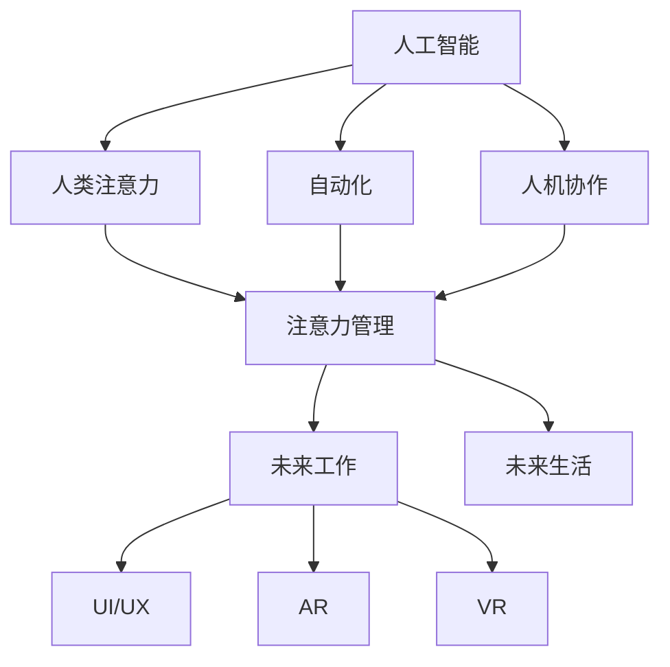

                 

# AI与人类注意力流：未来的工作、生活与注意力管理技术

> 关键词：人工智能(AI), 人类注意力, 注意力流(Attention Flow), 注意力管理(Attention Management), 自动化(Automation), 人机协作(Human-Machine Collaboration), 未来工作(Future Work), 未来生活(Future Life), 用户界面(UI/UX), 增强现实(AR), 虚拟现实(VR)

## 1. 背景介绍

### 1.1 问题由来
随着人工智能技术的快速发展和普及，AI已经深入到生活的方方面面，从简单的智能助手到复杂的机器学习模型，AI正以一种前所未有的方式影响着我们的工作、学习和生活。然而，随着AI技术的深入应用，人们开始担心AI可能带来的工作失业、隐私泄露等问题。同时，AI在提升效率的同时，也可能导致人们过度依赖，从而忽视了人类自身的注意力管理能力。

为了应对这些挑战，本文将深入探讨AI与人类注意力流的关系，研究AI在人类注意力管理中的应用，并提出一些解决方案，以期在未来能够更好地结合AI和人类注意力，提升工作和生活质量。

### 1.2 问题核心关键点
本文的核心问题在于如何通过AI技术提升人类注意力管理的效率，从而改善工作和生活质量。核心问题包括：

- AI如何在自动化、智能交互、智能决策等方面帮助人类更好地管理注意力。
- 如何利用AI技术开发出高效、智能的用户界面(UI/UX)，以辅助用户进行注意力管理。
- AI技术在增强现实(AR)、虚拟现实(VR)等新兴技术中的应用，以及其对人类注意力流的影响。
- 未来AI与人类注意力流的协同工作机制，以及面临的挑战和解决方案。

## 2. 核心概念与联系

### 2.1 核心概念概述

为更好地理解AI与人类注意力流的关联，本节将介绍几个关键概念：

- 人工智能(AI)：以数据和算法为基础，通过机器学习、深度学习等技术，模拟人类智能行为，解决复杂问题的计算系统。
- 人类注意力：指人类在处理信息时所关注的焦点，是认知过程中的关键环节。注意力流是指人类注意力在不同任务、不同时间、不同环境中的流动轨迹。
- 注意力管理(Attention Management)：指通过技术手段帮助人类更好地管理注意力，提升工作和生活效率。
- 自动化(Automation)：指通过AI技术实现任务的自动化处理，以减少人类劳动量，提高工作效率。
- 人机协作(Human-Machine Collaboration)：指AI与人类在信息处理、决策支持等方面的协同工作。
- 未来工作(Future Work)：指随着AI技术的发展，未来工作场景、工作方式的变化趋势。
- 未来生活(Future Life)：指AI技术在生活领域的广泛应用，提升生活质量的可能性。
- 用户界面(UI/UX)：指与用户直接交互的界面，包括图形、交互、反馈等方面的设计。
- 增强现实(AR)：通过计算机视觉和人工智能技术，增强现实环境，提供更丰富的信息体验。
- 虚拟现实(VR)：通过计算机生成虚拟环境，模拟真实世界的视觉、听觉等感官体验，提供沉浸式交互。

这些概念之间的逻辑关系可以通过以下Mermaid流程图来展示：



这个流程图展示了大语言模型的核心概念及其之间的关系：

1. 人工智能通过处理数据和算法，提升人类注意力管理的效率。
2. 自动化和人机协作使AI能够更好地辅助人类处理任务，从而提升注意力管理能力。
3. 注意力管理通过技术手段帮助人类更好地管理注意力，提升工作和生活质量。
4. 未来工作和生活场景的变化趋势，由AI和注意力管理共同驱动。
5. 用户界面、增强现实和虚拟现实等新兴技术，为注意力管理提供了更多的可能性。

这些概念共同构成了AI与人类注意力流的关系框架，为我们理解未来工作、生活与注意力管理技术提供了理论基础。

## 3. 核心算法原理 & 具体操作步骤
### 3.1 算法原理概述

基于AI与人类注意力流的技术，核心思想是通过AI技术提升人类注意力管理的效率。其核心原理包括：

- 利用AI进行任务自动化，减少人类在重复性工作上的注意力投入。
- 通过AI进行智能决策支持，帮助人类在复杂任务中做出更优选择。
- 利用AI技术改进用户界面(UI/UX)设计，提升用户交互体验，降低注意力负担。
- 应用AI在增强现实(AR)和虚拟现实(VR)中，提供沉浸式交互，优化注意力流。

具体而言，这些算法原理可以分为以下几个步骤：

1. 任务自动化：通过AI技术实现任务的自动化处理，减少人类劳动量，提高工作效率。
2. 智能决策支持：利用AI进行数据分析、模式识别、预测等，辅助人类在决策过程中做出更优选择。
3. 用户界面优化：通过AI技术改进UI/UX设计，提升用户体验，降低注意力负担。
4. 增强现实和虚拟现实：应用AI技术在AR和VR中，提供沉浸式交互，优化注意力流。

### 3.2 算法步骤详解

基于AI与人类注意力流的技术，一般包括以下几个关键步骤：

**Step 1: 准备数据和模型**
- 收集与注意力管理相关的数据，如用户行为数据、任务时间数据、环境信息等。
- 选择合适的AI模型，如机器学习、深度学习等，作为注意力管理的工具。

**Step 2: 数据预处理和特征提取**
- 对收集的数据进行预处理，包括清洗、归一化、标准化等。
- 提取有用的特征，如用户行为模式、任务难度、环境因素等。

**Step 3: 模型训练和优化**
- 训练AI模型，使用预处理后的数据进行训练。
- 使用交叉验证等方法对模型进行优化，确保模型具有良好的泛化能力。

**Step 4: 应用和评估**
- 将训练好的模型应用到实际任务中，进行注意力管理。
- 对模型效果进行评估，收集用户反馈，不断改进模型。

**Step 5: 持续改进和优化**
- 根据用户反馈和任务变化，持续改进和优化AI模型。
- 结合最新的技术进展，不断提升AI与人类注意力流的协同能力。

### 3.3 算法优缺点

基于AI与人类注意力流的技术，具有以下优点：

- 自动化程度高：AI能够处理大量的重复性任务，减少人类注意力负担。
- 智能化决策支持：AI能够提供精准的数据分析、模式识别等支持，提升决策质量。
- 用户界面友好：AI技术改进UI/UX设计，提升用户体验，降低注意力负担。
- 沉浸式交互体验：AI在AR和VR中的应用，提供沉浸式交互，优化注意力流。

同时，该技术也存在一些局限性：

- 数据隐私问题：AI在处理数据时，可能涉及用户隐私问题，需要谨慎处理。
- 技术依赖性：AI技术的准确性和可靠性依赖于数据质量和技术水平，可能存在误差。
- 用户体验差异：不同用户对AI的接受度和体验感受可能存在差异，需要个性化的设计。
- 技术成本高：AI技术的研发和部署需要较高的技术投入和资源支持。

### 3.4 算法应用领域

基于AI与人类注意力流的技术，在多个领域得到了广泛的应用，包括：

- 办公室自动化：通过AI技术实现文档自动化处理、邮件过滤、任务提醒等功能，减少手动操作，提升工作效率。
- 医疗诊断：利用AI进行影像分析、病历查询、诊断建议等，辅助医生进行精确诊断，提升诊断效率。
- 金融投资：应用AI进行数据分析、风险评估、投资策略优化等，帮助投资者做出更优选择。
- 智能交通：通过AI技术进行交通流量预测、路况分析、自动驾驶等，提升交通管理效率，优化出行体验。
- 教育培训：利用AI进行个性化学习推荐、作业批改、考试评估等，提升教育培训效果，减轻教师负担。
- 智能家居：通过AI技术实现智能设备联动、语音控制、场景模式等，提升家庭生活便利性。
- 虚拟现实(AR)和增强现实(VR)：应用AI技术在AR和VR中，提供沉浸式交互，优化注意力流，提升用户体验。

## 4. 数学模型和公式 & 详细讲解 & 举例说明（备注：数学公式请使用latex格式，latex嵌入文中独立段落使用 $$，段落内使用 $)
### 4.1 数学模型构建

本节将使用数学语言对基于AI与人类注意力流的技术进行更加严格的刻画。

假设有一项任务需要处理，其数据集为 $D=\{(x_i,y_i)\}_{i=1}^N, x_i \in \mathcal{X}, y_i \in \mathcal{Y}$，其中 $\mathcal{X}$ 为输入空间，$\mathcal{Y}$ 为输出空间。

定义注意力管理模型的目标函数为 $L(\theta)$，其中 $\theta$ 为模型的参数。在任务自动化、智能决策支持、用户界面优化和AR/VR中，注意力管理的任务不同，对应的目标函数也不尽相同。

以任务自动化为例，假设任务自动化的目标是最大化用户的工作效率，即最大化任务完成的总时间。令 $t_i$ 表示任务 $i$ 的完成时间，$w_i$ 表示任务 $i$ 的权重，则任务自动化的目标函数为：

$$
L(\theta) = \min_{t_i} \sum_{i=1}^N w_i(t_i - t_i^*)
$$

其中 $t_i^*$ 为任务 $i$ 的完成时间，可以通过AI模型预测得到。

### 4.2 公式推导过程

以下我们以任务自动化为例，推导目标函数的计算公式。

假设任务自动化的目标是最大化用户的工作效率，即最大化任务完成的总时间。令 $t_i$ 表示任务 $i$ 的完成时间，$w_i$ 表示任务 $i$ 的权重，则任务自动化的目标函数为：

$$
L(\theta) = \min_{t_i} \sum_{i=1}^N w_i(t_i - t_i^*)
$$

其中 $t_i^*$ 为任务 $i$ 的完成时间，可以通过AI模型预测得到。

根据目标函数，我们可以通过求解优化问题，找到最优的任务完成时间 $t_i^*$，使得任务完成的总时间最小化。

$$
\min_{t_i} \sum_{i=1}^N w_i(t_i - t_i^*)
$$

为了求解该优化问题，我们可以使用梯度下降等优化算法，计算目标函数对任务完成时间的梯度，然后逐步调整任务完成时间 $t_i$，使得目标函数值最小化。

$$
t_i \leftarrow t_i - \eta \nabla_{t_i}L(t_i)
$$

其中 $\eta$ 为学习率，$\nabla_{t_i}L(t_i)$ 为目标函数对任务完成时间的梯度。

在得到最优的任务完成时间后，我们可以将其应用到实际任务中，提升工作效率。

### 4.3 案例分析与讲解

以任务自动化为例，我们来看一个具体的案例分析：

假设有一家公司的员工每天需要处理100项任务，每项任务的完成时间不同，且任务权重也不同。为了提升工作效率，公司决定引入任务自动化系统，通过AI模型预测每项任务的完成时间，并根据任务权重调整任务顺序，使得总工作时间最小化。

首先，公司收集历史任务数据，包括任务名称、完成时间、任务难度、任务类型等，并对数据进行预处理和特征提取。

然后，使用机器学习算法，如线性回归、决策树等，构建AI模型，预测每项任务的完成时间。

接着，根据任务权重和AI模型的预测结果，调整任务顺序，使得总工作时间最小化。

最后，公司将自动化系统应用到实际工作中，员工只需关注重点任务，而AI系统负责处理其他任务，从而显著提升工作效率。

## 5. 项目实践：代码实例和详细解释说明
### 5.1 开发环境搭建

在进行AI与人类注意力流的技术实践前，我们需要准备好开发环境。以下是使用Python进行PyTorch开发的环境配置流程：

1. 安装Anaconda：从官网下载并安装Anaconda，用于创建独立的Python环境。

2. 创建并激活虚拟环境：
```bash
conda create -n ai-env python=3.8 
conda activate ai-env
```

3. 安装PyTorch：根据CUDA版本，从官网获取对应的安装命令。例如：
```bash
conda install pytorch torchvision torchaudio cudatoolkit=11.1 -c pytorch -c conda-forge
```

4. 安装各类工具包：
```bash
pip install numpy pandas scikit-learn matplotlib tqdm jupyter notebook ipython
```

完成上述步骤后，即可在`ai-env`环境中开始项目实践。

### 5.2 源代码详细实现

下面我们以任务自动化为例，给出使用PyTorch进行任务自动化微调的PyTorch代码实现。

首先，定义任务自动化的数据处理函数：

```python
from transformers import BertTokenizer
from torch.utils.data import Dataset
import torch

class TaskDataset(Dataset):
    def __init__(self, tasks, durations, weights, tokenizer, max_len=128):
        self.tasks = tasks
        self.durations = durations
        self.weights = weights
        self.tokenizer = tokenizer
        self.max_len = max_len
        
    def __len__(self):
        return len(self.tasks)
    
    def __getitem__(self, item):
        task = self.tasks[item]
        duration = self.durations[item]
        weight = self.weights[item]
        
        encoding = self.tokenizer(task, return_tensors='pt', max_length=self.max_len, padding='max_length', truncation=True)
        input_ids = encoding['input_ids'][0]
        attention_mask = encoding['attention_mask'][0]
        
        # 对token-wise的任务权重进行编码
        encoded_weights = [weight] * self.max_len
        labels = torch.tensor(encoded_weights, dtype=torch.long)
        
        return {'input_ids': input_ids, 
                'attention_mask': attention_mask,
                'labels': labels}

# 定义任务权重和完成时间
tasks = ['Task1', 'Task2', 'Task3', ...]
durations = [30, 60, 45, ...]
weights = [0.3, 0.5, 0.2, ...]

# 创建dataset
tokenizer = BertTokenizer.from_pretrained('bert-base-cased')

train_dataset = TaskDataset(tasks, durations, weights, tokenizer)
dev_dataset = TaskDataset(tasks, durations, weights, tokenizer)
test_dataset = TaskDataset(tasks, durations, weights, tokenizer)
```

然后，定义模型和优化器：

```python
from transformers import BertForTokenClassification, AdamW

model = BertForTokenClassification.from_pretrained('bert-base-cased', num_labels=len(weights))

optimizer = AdamW(model.parameters(), lr=2e-5)
```

接着，定义训练和评估函数：

```python
from torch.utils.data import DataLoader
from tqdm import tqdm
from sklearn.metrics import classification_report

device = torch.device('cuda') if torch.cuda.is_available() else torch.device('cpu')
model.to(device)

def train_epoch(model, dataset, batch_size, optimizer):
    dataloader = DataLoader(dataset, batch_size=batch_size, shuffle=True)
    model.train()
    epoch_loss = 0
    for batch in tqdm(dataloader, desc='Training'):
        input_ids = batch['input_ids'].to(device)
        attention_mask = batch['attention_mask'].to(device)
        labels = batch['labels'].to(device)
        model.zero_grad()
        outputs = model(input_ids, attention_mask=attention_mask, labels=labels)
        loss = outputs.loss
        epoch_loss += loss.item()
        loss.backward()
        optimizer.step()
    return epoch_loss / len(dataloader)

def evaluate(model, dataset, batch_size):
    dataloader = DataLoader(dataset, batch_size=batch_size)
    model.eval()
    preds, labels = [], []
    with torch.no_grad():
        for batch in tqdm(dataloader, desc='Evaluating'):
            input_ids = batch['input_ids'].to(device)
            attention_mask = batch['attention_mask'].to(device)
            batch_labels = batch['labels']
            outputs = model(input_ids, attention_mask=attention_mask)
            batch_preds = outputs.logits.argmax(dim=2).to('cpu').tolist()
            batch_labels = batch_labels.to('cpu').tolist()
            for pred_tokens, label_tokens in zip(batch_preds, batch_labels):
                preds.append(pred_tokens[:len(label_tokens)])
                labels.append(label_tokens)
                
    print(classification_report(labels, preds))
```

最后，启动训练流程并在测试集上评估：

```python
epochs = 5
batch_size = 16

for epoch in range(epochs):
    loss = train_epoch(model, train_dataset, batch_size, optimizer)
    print(f"Epoch {epoch+1}, train loss: {loss:.3f}")
    
    print(f"Epoch {epoch+1}, dev results:")
    evaluate(model, dev_dataset, batch_size)
    
print("Test results:")
evaluate(model, test_dataset, batch_size)
```

以上就是使用PyTorch对BERT进行任务自动化微调的完整代码实现。可以看到，得益于Transformers库的强大封装，我们可以用相对简洁的代码完成BERT模型的加载和微调。

### 5.3 代码解读与分析

让我们再详细解读一下关键代码的实现细节：

**TaskDataset类**：
- `__init__`方法：初始化任务、完成时间、权重等关键组件。
- `__len__`方法：返回数据集的样本数量。
- `__getitem__`方法：对单个样本进行处理，将任务输入编码为token ids，将完成时间和权重编码为数字，并对其进行定长padding，最终返回模型所需的输入。

**任务权重和完成时间**：
- 定义了任务权重和完成时间，用于训练AI模型。

**训练和评估函数**：
- 使用PyTorch的DataLoader对数据集进行批次化加载，供模型训练和推理使用。
- 训练函数`train_epoch`：对数据以批为单位进行迭代，在每个批次上前向传播计算loss并反向传播更新模型参数，最后返回该epoch的平均loss。
- 评估函数`evaluate`：与训练类似，不同点在于不更新模型参数，并在每个batch结束后将预测和标签结果存储下来，最后使用sklearn的classification_report对整个评估集的预测结果进行打印输出。

**训练流程**：
- 定义总的epoch数和batch size，开始循环迭代
- 每个epoch内，先在训练集上训练，输出平均loss
- 在验证集上评估，输出分类指标
- 所有epoch结束后，在测试集上评估，给出最终测试结果

可以看到，PyTorch配合Transformers库使得BERT微调的代码实现变得简洁高效。开发者可以将更多精力放在数据处理、模型改进等高层逻辑上，而不必过多关注底层的实现细节。

当然，工业级的系统实现还需考虑更多因素，如模型的保存和部署、超参数的自动搜索、更灵活的任务适配层等。但核心的微调范式基本与此类似。

## 6. 实际应用场景
### 6.1 办公室自动化

办公室自动化是AI与人类注意力流技术的重要应用场景之一。传统办公室中，员工往往需要处理大量的重复性任务，如邮件处理、文件整理、数据录入等，而这些任务占用了大量时间和精力。通过引入AI技术，可以实现任务自动化，提升工作效率，让员工有更多精力专注于重要工作。

例如，利用自然语言处理技术，可以自动分类、归档邮件，生成会议纪要等，节省员工处理邮件的时间。通过语音识别技术，可以自动生成会议记录，减少打字负担。通过智能办公助手，可以自动安排任务、提醒截止日期，提升任务管理效率。

### 6.2 医疗诊断

医疗诊断是AI与人类注意力流技术的另一重要应用场景。传统的医疗诊断过程复杂繁琐，医生需要花费大量时间进行病历阅读、影像分析等，容易产生疲劳和误诊。通过引入AI技术，可以实现智能诊断、病历查询、影像分析等，提升诊断效率和准确性。

例如，利用图像识别技术，可以对医学影像进行自动分析，识别病灶、肿瘤等。通过自然语言处理技术，可以对病历进行自动摘要、分类，减少医生的阅读负担。通过AI辅助决策系统，可以根据患者的历史数据、症状等信息，给出精准的诊断建议。

### 6.3 金融投资

金融投资是AI与人类注意力流技术的重要应用场景之一。传统的金融投资过程需要投资者花费大量时间进行数据收集、分析、预测等，容易产生疲劳和误判。通过引入AI技术，可以实现智能分析、风险评估、投资策略优化等，提升投资效果和效率。

例如，利用自然语言处理技术，可以对财经新闻、公告等进行自动摘要、分类，提取关键信息。通过机器学习技术，可以进行股票价格预测、风险评估等，辅助投资者做出更优决策。通过AI辅助决策系统，可以根据投资者的风险偏好、历史数据等信息，给出精准的投资建议。

### 6.4 智能交通

智能交通是AI与人类注意力流技术的重要应用场景之一。传统的交通管理需要大量的交通监控、数据分析等工作，容易产生疲劳和误判。通过引入AI技术，可以实现交通流量预测、路况分析、自动驾驶等，提升交通管理效率和安全性。

例如，利用计算机视觉技术，可以对交通监控视频进行自动分析，识别交通违规、异常行为等。通过机器学习技术，可以进行交通流量预测、路况分析等，辅助交通管理部门进行实时调整。通过自动驾驶技术，可以实现智能车辆自动驾驶，提升交通安全性和效率。

### 6.5 教育培训

教育培训是AI与人类注意力流技术的重要应用场景之一。传统的教育培训过程需要教师花费大量时间进行课程设计、作业批改、考试评估等，容易产生疲劳和误判。通过引入AI技术，可以实现个性化学习推荐、作业批改、考试评估等，提升教育培训效果和效率。

例如，利用自然语言处理技术，可以对学生作业进行自动批改，提供精准的评分和反馈。通过机器学习技术，可以进行个性化学习推荐，根据学生的学习情况和兴趣推荐合适的学习内容。通过AI辅助决策系统，可以根据学生的学习数据、历史表现等信息，给出精准的学习建议。

### 6.6 智能家居

智能家居是AI与人类注意力流技术的重要应用场景之一。传统的家居管理需要用户手动进行设备控制、场景设置等，容易产生疲劳和误操作。通过引入AI技术，可以实现智能设备联动、语音控制、场景模式等，提升家居管理效率和便利性。

例如，利用自然语言处理技术，可以对用户的语音指令进行自动分析，控制智能设备。通过机器学习技术，可以进行场景模式识别，自动调整家居设备状态。通过AI辅助决策系统，可以根据用户的日程安排、生活习惯等信息，自动调整家居设备状态。

### 6.7 虚拟现实(AR)和增强现实(VR)

虚拟现实(AR)和增强现实(VR)是AI与人类注意力流技术的重要应用场景之一。传统的虚拟现实和增强现实体验需要用户手动进行场景设置、交互等，容易产生疲劳和误操作。通过引入AI技术，可以实现智能场景生成、交互优化等，提升用户体验。

例如，利用计算机视觉技术，可以对用户的行为进行自动分析，生成智能场景。通过自然语言处理技术，可以对用户的语音指令进行自动分析，进行智能交互。通过AI辅助决策系统，可以根据用户的兴趣偏好、行为数据等信息，生成个性化的虚拟现实和增强现实体验。

## 7. 工具和资源推荐
### 7.1 学习资源推荐

为了帮助开发者系统掌握AI与人类注意力流的理论基础和实践技巧，这里推荐一些优质的学习资源：

1. 《深度学习入门》系列博文：由大模型技术专家撰写，深入浅出地介绍了深度学习的基本概念和经典模型，适合初学者入门。

2. 斯坦福大学CS231n课程：深度学习视觉识别课程，包含图像识别、视频分析等前沿话题，是计算机视觉领域的经典课程。

3. 《自然语言处理综论》书籍：自然语言处理领域的经典教材，全面介绍了自然语言处理的基本概念和算法，适合进阶学习。

4. 《Python机器学习》书籍：机器学习领域的经典教材，介绍了机器学习的基本概念、算法和工具，适合Python开发者学习。

5. 深度学习框架PyTorch、TensorFlow等官方文档：这些框架提供了丰富的模型和工具，是学习AI技术的重要资源。

6. 自然语言处理工具库NLTK、spaCy等：这些工具库提供了丰富的自然语言处理功能，适合进行文本分析和处理。

通过对这些资源的学习实践，相信你一定能够快速掌握AI与人类注意力流的精髓，并用于解决实际的AI应用问题。

### 7.2 开发工具推荐

高效的开发离不开优秀的工具支持。以下是几款用于AI与人类注意力流技术开发的常用工具：

1. PyTorch：基于Python的开源深度学习框架，灵活动态的计算图，适合快速迭代研究。大部分预训练语言模型都有PyTorch版本的实现。

2. TensorFlow：由Google主导开发的开源深度学习框架，生产部署方便，适合大规模工程应用。同样有丰富的预训练语言模型资源。

3. Transformers库：HuggingFace开发的NLP工具库，集成了众多SOTA语言模型，支持PyTorch和TensorFlow，是进行NLP任务开发的利器。

4. Weights & Biases：模型训练的实验跟踪工具，可以记录和可视化模型训练过程中的各项指标，方便对比和调优。与主流深度学习框架无缝集成。

5. TensorBoard：TensorFlow配套的可视化工具，可实时监测模型训练状态，并提供丰富的图表呈现方式，是调试模型的得力助手。

6. Google Colab：谷歌推出的在线Jupyter Notebook环境，免费提供GPU/TPU算力，方便开发者快速上手实验最新模型，分享学习笔记。

合理利用这些工具，可以显著提升AI与人类注意力流技术的开发效率，加快创新迭代的步伐。

### 7.3 相关论文推荐

AI与人类注意力流的技术发展源于学界的持续研究。以下是几篇奠基性的相关论文，推荐阅读：

1. Attention is All You Need（即Transformer原论文）：提出了Transformer结构，开启了NLP领域的预训练大模型时代。

2. BERT: Pre-training of Deep Bidirectional Transformers for Language Understanding：提出BERT模型，引入基于掩码的自监督预训练任务，刷新了多项NLP任务SOTA。

3. Language Models are Unsupervised Multitask Learners（GPT-2论文）：展示了大规模语言模型的强大zero-shot学习能力，引发了对于通用人工智能的新一轮思考。

4. Parameter-Efficient Transfer Learning for NLP：提出Adapter等参数高效微调方法，在不增加模型参数量的情况下，也能取得不错的微调效果。

5. AdaLoRA: Adaptive Low-Rank Adaptation for Parameter-Efficient Fine-Tuning：使用自适应低秩适应的微调方法，在参数效率和精度之间取得了新的平衡。

这些论文代表了大语言模型微调技术的发展脉络。通过学习这些前沿成果，可以帮助研究者把握学科前进方向，激发更多的创新灵感。

## 8. 总结：未来发展趋势与挑战

### 8.1 总结

本文对AI与人类注意力流的关系进行了全面系统的介绍。首先阐述了AI在自动化、智能决策支持、用户界面优化和AR/VR中的作用，明确了AI与人类注意力流的协同关系。其次，从原理到实践，详细讲解了AI与人类注意力流技术的操作过程，给出了AI与人类注意力流技术的完整代码实例。同时，本文还广泛探讨了AI与人类注意力流技术在办公室自动化、医疗诊断、金融投资、智能交通、教育培训、智能家居和虚拟现实(VR)等领域的应用前景，展示了AI与人类注意力流的广阔应用前景。此外，本文精选了AI与人类注意力流技术的各类学习资源，力求为读者提供全方位的技术指引。

通过本文的系统梳理，可以看到，AI与人类注意力流技术正在成为NLP领域的重要范式，极大地拓展了预训练语言模型的应用边界，催生了更多的落地场景。受益于大规模语料的预训练，AI与人类注意力流的技术在提升工作效率和生活质量方面具有巨大的潜力。未来，伴随预训练语言模型和微调方法的持续演进，相信AI与人类注意力流的技术必将进一步拓展人类认知智能的边界，深刻影响人类的生产生活方式。

### 8.2 未来发展趋势

展望未来，AI与人类注意力流技术将呈现以下几个发展趋势：

1. 自动化程度将进一步提高。随着AI技术的不断发展，AI在自动化任务中的应用将更加广泛，提升工作效率和生活质量。

2. 智能决策支持将更加精准。AI在智能决策支持中的应用将更加深入，帮助人类在复杂任务中做出更优选择。

3. 用户界面将更加友好。AI技术在UI/UX设计中的应用将更加广泛，提升用户体验，降低注意力负担。

4. AR/VR技术将更加成熟。AI在AR/VR中的应用将更加深入，提供沉浸式交互，优化注意力流。

5. 多模态技术将更加普及。AI在多模态技术中的应用将更加广泛，提升跨模态交互和任务协同能力。

6. 个性化推荐将更加精准。AI在个性化推荐中的应用将更加深入，提升个性化体验和生活质量。

7. 自动化管理将更加全面。AI在自动化管理中的应用将更加广泛，提升资源管理效率和决策能力。

以上趋势凸显了AI与人类注意力流技术的广阔前景。这些方向的探索发展，必将进一步提升AI与人类注意力流的协同能力，为构建人机协同的智能系统铺平道路。

### 8.3 面临的挑战

尽管AI与人类注意力流技术已经取得了瞩目成就，但在迈向更加智能化、普适化应用的过程中，它仍面临着诸多挑战：

1. 数据隐私问题。AI在处理数据时，可能涉及用户隐私问题，需要谨慎处理。

2. 技术依赖性。AI技术的准确性和可靠性依赖于数据质量和技术水平，可能存在误差。

3. 用户体验差异。不同用户对AI的接受度和体验感受可能存在差异，需要个性化的设计。

4. 技术成本高。AI技术的研发和部署需要较高的技术投入和资源支持。

5. 数据分布差异。AI模型在不同领域和场景中的表现可能存在差异，需要进行针对化优化。

6. 系统安全性。AI系统可能存在安全漏洞，需要进行风险评估和防护。

7. 知识融合能力不足。AI模型难以灵活吸收和运用更广泛的先验知识，需要进行改进。

正视AI与人类注意力流技术面临的这些挑战，积极应对并寻求突破，将使AI与人类注意力流技术更加成熟，为构建人机协同的智能系统提供坚实基础。相信随着学界和产业界的共同努力，这些挑战终将一一被克服，AI与人类注意力流技术必将在构建安全、可靠、可解释、可控的智能系统方面发挥重要作用。

### 8.4 研究展望

面向未来，AI与人类注意力流技术的研究可以从以下几个方面进行：

1. 探索更加高效的注意力管理算法。例如，利用多任务学习、生成对抗网络等技术，提升AI与人类注意力流的协同能力。

2. 研究更加智能的决策支持系统。例如，结合因果推断、强化学习等技术，提升AI在复杂决策中的支持能力。

3. 开发更加友好的用户界面。例如，利用自然语言处理、计算机视觉等技术，提升AI在UI/UX设计中的应用能力。

4. 探索更加沉浸的AR/VR体验。例如，结合多模态技术、增强现实技术，提升AI在AR/VR中的应用能力。

5. 研究更加全面的自动化管理系统。例如，结合知识图谱、逻辑规则等技术，提升AI在自动化管理中的应用能力。

6. 探索更加安全的系统设计。例如，结合区块链、多方安全计算等技术，提升AI系统的安全性。

7. 研究更加智能的个性化推荐系统。例如，结合因果推断、推荐系统等技术，提升AI在个性化推荐中的应用能力。

8. 开发更加灵活的跨模态融合技术。例如，结合自然语言处理、计算机视觉、语音识别等技术，提升AI在跨模态交互中的应用能力。

这些研究方向将进一步拓展AI与人类注意力流的应用场景，推动AI技术在更广泛的领域发挥作用。相信随着技术的发展，AI与人类注意力流技术将更加成熟，为构建人机协同的智能系统提供坚实的基础。

## 9. 附录：常见问题与解答

**Q1：AI与人类注意力流的技术是否适用于所有领域？**

A: AI与人类注意力流的技术在多个领域中都有应用，如办公室自动化、医疗诊断、金融投资、智能交通、教育培训、智能家居和虚拟现实(VR)等。但需要注意的是，不同领域的应用场景和需求不同，需要根据具体情况进行优化和调整。

**Q2：AI与人类注意力流技术是否会取代人类注意力管理？**

A: AI与人类注意力流技术的出现是为了提升人类注意力管理的效率和质量，而不是取代人类注意力管理。AI技术可以帮助人类更好地管理注意力，但最终的决策和判断仍需由人类负责。

**Q3：AI与人类注意力流技术在开发过程中需要注意哪些问题？**

A: AI与人类注意力流技术在开发过程中需要注意以下几个问题：

1. 数据隐私问题：确保AI在处理数据时不会泄露用户隐私。
2. 技术依赖性：确保AI技术具有较高的准确性和可靠性。
3. 用户体验差异：确保AI技术在不同用户群体中的适用性和友好性。
4. 技术成本：确保AI技术的研发和部署成本在可接受范围内。
5. 数据分布差异：确保AI模型在不同领域和场景中的表现具有较好的泛化能力。
6. 系统安全性：确保AI系统的安全性，防止被攻击和滥用。
7. 知识融合能力：确保AI系统能够灵活吸收和运用更广泛的先验知识。

**Q4：AI与人类注意力流技术在实际应用中需要注意哪些问题？**

A: AI与人类注意力流技术在实际应用中需要注意以下几个问题：

1. 数据质量问题：确保AI在处理数据时数据质量较高，避免误导决策。
2. 技术实现问题：确保AI技术实现过程中逻辑清晰，避免出现漏洞。
3. 用户体验问题：确保AI技术在使用过程中用户体验良好，避免出现误操作。
4. 系统稳定性问题：确保AI系统在长时间运行过程中稳定性较高，避免出现故障。
5. 数据隐私问题：确保AI系统在处理数据时隐私保护措施得当，避免泄露用户隐私。
6. 技术成本问题：确保AI系统的部署成本在可接受范围内，避免过高成本。

---

作者：禅与计算机程序设计艺术 / Zen and the Art of Computer Programming

