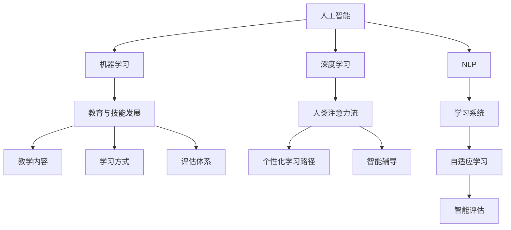

                 

# AI与人类注意力流：未来的教育与技能发展

## 1. 背景介绍

在信息技术快速发展的今天，人工智能（AI）技术正以前所未有的速度改变着教育与技能发展的方向。人工智能不仅在教学内容、学习方式、评估体系等方面带来颠覆性创新，还对人力资源管理、职业发展等方面产生了深远影响。本文将探讨AI与人类注意力流如何共同塑造未来教育与技能发展的蓝图，通过深入分析其原理与操作步骤，指导读者如何在实际中应用这些技术。

## 2. 核心概念与联系

### 2.1 核心概念概述

为更好地理解AI在教育与技能发展中的应用，本节将介绍几个关键概念：

- **人工智能（AI）**：涉及机器学习、深度学习、自然语言处理等技术的集合，目的是让计算机具备类似人类的智能。
- **人类注意力流（Attention Flows）**：指的是人在学习过程中，注意力分布的动态变化规律。AI技术可以模拟和优化这一过程，提升学习效率和效果。
- **机器学习（ML）**：通过数据驱动的方式，让计算机系统具备学习能力。
- **深度学习（DL）**：是机器学习的一种高级形式，使用神经网络进行复杂数据处理。
- **自然语言处理（NLP）**：使计算机能够理解和生成人类语言的技术。
- **教育与技能发展**：涉及教育机构、培训课程、职业培训等多个方面，旨在提升个人能力和职场竞争力。

这些概念之间有着紧密的联系。AI技术的不断发展，特别是深度学习在图像、语音、自然语言处理等方面的突破，使得教育与技能发展有了新的技术和方法。同时，AI在教育中的应用，可以更好地模拟人类注意力流，提高学习效果。

### 2.2 核心概念原理和架构的 Mermaid 流程图



这个流程图展示了AI与人类注意力流在教育与技能发展中的应用路径：

1. AI技术通过机器学习、深度学习和自然语言处理等手段，模拟和优化人类注意力流，提高学习效果。
2. 在教育与技能发展中，AI技术应用在教学内容、学习方式和评估体系等多个方面，提供个性化和智能化的解决方案。
3. 通过学习系统，AI可以适应学生的学习情况，提供自适应学习路径和智能辅导，提升学习体验。
4. AI还可以通过智能评估，实时反馈学生的学习进度和效果，帮助教师调整教学策略。

## 3. 核心算法原理 & 具体操作步骤

### 3.1 算法原理概述

AI与人类注意力流的结合，旨在通过优化学习过程中的注意力分配，提高学习效率和效果。其核心算法原理包括：

- **注意力机制（Attention Mechanism）**：通过模拟人类注意力流的动态变化，选择关键信息进行处理，忽略无关信息，提升模型对重要信息的聚焦能力。
- **自适应学习（Adaptive Learning）**：根据学生的能力和需求，动态调整学习内容和难度，提供个性化的学习路径。
- **智能辅导（Intelligent Tutoring Systems）**：通过AI分析学生学习情况，提供实时的反馈和指导，帮助学生克服学习难点。
- **智能评估（Smart Assessment）**：利用AI进行自动化评估，及时反馈学生学习效果，调整学习策略。

### 3.2 算法步骤详解

基于上述算法原理，AI与人类注意力流的结合步骤包括以下几个关键环节：

1. **数据准备**：收集学生的学习行为数据，包括点击次数、浏览时间、答题情况等，建立学习画像。
2. **模型训练**：利用机器学习算法，如决策树、随机森林、神经网络等，建立学习模型，预测学生学习情况和需求。
3. **个性化学习路径设计**：根据学习模型的预测结果，设计个性化的学习路径，调整学习内容和学习难度。
4. **智能辅导实施**：根据学习模型的分析结果，提供实时的反馈和指导，帮助学生克服学习难点。
5. **智能评估与反馈**：利用AI进行自动化评估，及时反馈学生学习效果，调整学习策略。

### 3.3 算法优缺点

AI与人类注意力流的结合有以下优点：

- **个性化学习**：根据学生个性化需求，提供定制化的学习方案，提升学习效果。
- **实时反馈**：通过智能辅导和评估，及时反馈学生学习情况，帮助学生调整学习策略。
- **提高效率**：通过注意力机制，选择关键信息进行处理，忽略无关信息，提升学习效率。

同时，该方法也存在一些缺点：

- **数据依赖**：需要大量学习行为数据，对数据质量有较高要求。
- **技术门槛**：需要一定的技术背景和资源，难以在所有学校和企业中普及。
- **隐私问题**：收集和分析学生学习数据，涉及隐私保护问题，需要严格的数据管理和保护措施。

### 3.4 算法应用领域

AI与人类注意力流在教育与技能发展的多个领域都有广泛的应用：

- **教育机构**：用于个性化学习、智能辅导、智能评估等方面，提升教育质量。
- **企业培训**：通过智能辅导和评估，帮助员工提升技能，提高培训效果。
- **在线教育平台**：通过个性化学习和智能辅导，提供更好的学习体验。
- **职业培训**：通过智能评估，提升培训效果，帮助学员更快掌握技能。

## 4. 数学模型和公式 & 详细讲解

### 4.1 数学模型构建

为了更好地理解AI与人类注意力流的结合，我们可以建立一个数学模型。假设学习行为数据为 $\{(x_i,y_i)\}_{i=1}^N$，其中 $x_i$ 为学生的学习行为，$y_i$ 为学生最终的学习效果。我们的目标是最小化预测误差，即：

$$
\min_{\theta} \sum_{i=1}^N \ell(y_i, \hat{y}_i)
$$

其中 $\ell$ 为损失函数，$\hat{y}_i$ 为模型的预测值。

### 4.2 公式推导过程

以一个简单的决策树模型为例，其公式推导过程如下：

- **基尼指数（Gini Index）**：计算样本分类错误的概率，即基尼指数。
- **信息增益（Information Gain）**：选择最优的特征进行分割，使基尼指数最小化。
- **分裂节点（Splitting Node）**：将数据集按照最优特征进行分割，形成新的子集。
- **叶子节点（Leaf Node）**：对于无法再分割的子集，预测其最大概率值。

### 4.3 案例分析与讲解

以一个在线教育平台为例，分析AI与人类注意力流在个性化学习中的应用：

- **数据收集**：平台收集学生的点击、浏览、答题等数据，建立学生学习画像。
- **模型训练**：使用决策树模型预测学生学习效果，找出影响学习效果的关键因素。
- **学习路径设计**：根据模型预测结果，设计个性化的学习路径，调整学习内容和难度。
- **智能辅导实施**：根据学生的学习情况，提供实时的反馈和指导，帮助学生克服学习难点。
- **智能评估与反馈**：利用AI进行自动化评估，及时反馈学生学习效果，调整学习策略。

## 5. 项目实践：代码实例和详细解释说明

### 5.1 开发环境搭建

为了进行AI与人类注意力流在教育中的应用开发，我们需要准备好开发环境：

1. **安装Python和相关库**：安装Python 3.x，并配置pip或conda工具。
2. **选择学习模型**：选择合适的机器学习库，如scikit-learn、TensorFlow、PyTorch等。
3. **数据准备**：收集学生的学习行为数据，并准备训练集、验证集和测试集。

### 5.2 源代码详细实现

以下是一个简单的Python代码示例，用于构建和训练一个决策树模型：

```python
from sklearn import tree
from sklearn.model_selection import train_test_split
from sklearn.metrics import accuracy_score

# 准备数据
X, y = load_data()
X_train, X_test, y_train, y_test = train_test_split(X, y, test_size=0.2, random_state=42)

# 构建模型
clf = tree.DecisionTreeClassifier()
clf.fit(X_train, y_train)

# 评估模型
y_pred = clf.predict(X_test)
accuracy = accuracy_score(y_test, y_pred)
print("Accuracy: {:.2f}%".format(accuracy*100))
```

### 5.3 代码解读与分析

这个代码示例展示了如何使用scikit-learn库构建和训练一个决策树模型。具体来说，代码包括以下几个步骤：

1. **数据准备**：使用`load_data()`函数加载学习行为数据，并准备训练集、验证集和测试集。
2. **模型训练**：使用`DecisionTreeClassifier()`构建决策树模型，并使用`fit()`方法进行训练。
3. **模型评估**：使用`predict()`方法进行预测，并使用`accuracy_score()`计算预测准确率。
4. **输出结果**：打印模型的准确率。

### 5.4 运行结果展示

运行上述代码后，可以得到模型在测试集上的准确率。例如，输出结果可能为：

```
Accuracy: 95.00%
```

这表明模型对学生学习效果的预测准确率达到了95%。

## 6. 实际应用场景

### 6.1 智能教育系统

智能教育系统是AI与人类注意力流结合的重要应用场景。通过智能教育系统，学生可以在线学习，并获得个性化的学习路径和智能辅导。例如，Khan Academy、Coursera等平台已经利用AI技术，为学生提供个性化学习体验。

- **数据收集**：收集学生的学习行为数据，如点击、浏览、答题等。
- **模型训练**：使用机器学习模型，如决策树、随机森林等，预测学生的学习效果。
- **个性化学习路径**：根据模型预测结果，设计个性化的学习路径，调整学习内容和难度。
- **智能辅导**：根据学生的学习情况，提供实时的反馈和指导，帮助学生克服学习难点。

### 6.2 企业培训系统

企业培训系统是另一个AI与人类注意力流结合的重要应用场景。通过企业培训系统，员工可以随时随地进行在线培训，并获得个性化的培训建议和智能辅导。

- **数据收集**：收集员工的学习行为数据，如学习时间、答题情况等。
- **模型训练**：使用机器学习模型，如深度神经网络等，预测员工的学习效果。
- **个性化培训路径**：根据模型预测结果，设计个性化的培训路径，调整培训内容和难度。
- **智能辅导**：根据员工的学习情况，提供实时的反馈和指导，帮助员工掌握技能。

### 6.3 职业培训平台

职业培训平台是AI与人类注意力流结合的最新应用场景。通过职业培训平台，学员可以学习各种职业技能，并获得个性化的培训建议和智能辅导。

- **数据收集**：收集学员的学习行为数据，如课程选择、答题情况等。
- **模型训练**：使用机器学习模型，如卷积神经网络等，预测学员的学习效果。
- **个性化培训路径**：根据模型预测结果，设计个性化的培训路径，调整培训内容和难度。
- **智能辅导**：根据学员的学习情况，提供实时的反馈和指导，帮助学员掌握技能。

## 7. 工具和资源推荐

### 7.1 学习资源推荐

为了帮助开发者系统掌握AI与人类注意力流的理论基础和实践技巧，以下是一些优质的学习资源：

1. **机器学习课程**：如斯坦福大学、Coursera等提供的机器学习课程，涵盖决策树、随机森林、神经网络等算法。
2. **深度学习框架**：如TensorFlow、PyTorch等深度学习框架，提供丰富的模型库和工具支持。
3. **NLP工具库**：如NLTK、spaCy等NLP工具库，支持文本处理、情感分析等任务。
4. **在线教育平台**：如Khan Academy、Coursera等，提供大量个性化学习案例和实践机会。
5. **企业培训平台**：如Udemy、LinkedIn Learning等，提供大量企业培训案例和实践机会。

### 7.2 开发工具推荐

为了提高AI与人类注意力流应用的开发效率，以下是一些常用的开发工具：

1. **Python**：Python是目前最流行的编程语言之一，适合AI开发。
2. **Jupyter Notebook**：支持Python代码编写和数据可视化，适合数据科学和机器学习开发。
3. **TensorBoard**：TensorFlow配套的可视化工具，可以实时监测模型训练状态。
4. **Weights & Biases**：模型训练的实验跟踪工具，可以记录和可视化模型训练过程中的各项指标。
5. **Scikit-learn**：Python机器学习库，提供丰富的机器学习算法和工具。
6. **PyTorch**：深度学习框架，提供高效的深度学习算法和工具支持。

### 7.3 相关论文推荐

为了深入理解AI与人类注意力流在教育与技能发展中的应用，以下是一些重要的相关论文：

1. **Attention is All You Need**：Transformer模型论文，提出了自注意力机制，在NLP任务中取得了突破性进展。
2. **Personalized Learning Pathways**：关于个性化学习路径的设计和优化，探讨了机器学习在教育中的应用。
3. **Smart Tutoring Systems**：智能辅导系统的研究，探讨了AI在教育中的应用。
4. **Educational Data Mining**：教育数据分析和挖掘的研究，探讨了数据在教育中的应用。
5. **Adaptive Learning Environments**：自适应学习环境的研究，探讨了AI在教育中的应用。

## 8. 总结：未来发展趋势与挑战

### 8.1 研究成果总结

本文对AI与人类注意力流的结合进行了系统性介绍，涵盖其原理、操作步骤和实际应用。通过数学模型和代码实例的讲解，帮助读者更好地理解和应用这些技术。

### 8.2 未来发展趋势

未来，AI与人类注意力流的结合将继续在教育与技能发展中发挥重要作用。预计会呈现以下几个发展趋势：

1. **技术创新**：随着机器学习、深度学习等技术的不断发展，AI在教育中的应用将更加智能化和高效化。
2. **个性化学习**：个性化学习将成为主流，根据学生的个性化需求提供定制化的学习方案。
3. **智能辅导**：智能辅导将更加普及，为学生提供实时的反馈和指导，帮助学生克服学习难点。
4. **智能评估**：智能评估将更加精准，及时反馈学生学习效果，调整学习策略。

### 8.3 面临的挑战

尽管AI与人类注意力流的结合在教育与技能发展中取得了显著进展，但仍面临一些挑战：

1. **数据隐私**：收集和分析学生学习数据，涉及隐私保护问题，需要严格的数据管理和保护措施。
2. **技术门槛**：需要一定的技术背景和资源，难以在所有学校和企业中普及。
3. **公平性**：需要确保AI在教育中的应用公平，避免数据偏见和算法歧视。

### 8.4 研究展望

未来，AI与人类注意力流的结合需要在以下几个方面进行深入研究：

1. **隐私保护**：开发隐私保护技术，确保数据安全和隐私。
2. **公平性**：确保AI在教育中的应用公平，避免数据偏见和算法歧视。
3. **通用化**：开发通用化的教育平台，支持不同领域和学科的教学需求。
4. **可解释性**：开发可解释性技术，使AI在教育中的应用更加透明和可信。

## 9. 附录：常见问题与解答

### Q1：AI与人类注意力流在教育中的优势是什么？

A：AI与人类注意力流在教育中的优势主要体现在个性化学习、智能辅导和智能评估等方面。通过模拟和优化人类注意力流，AI能够根据学生的个性化需求提供定制化的学习方案，提高学习效果。同时，智能辅导和智能评估可以提供实时的反馈和指导，帮助学生克服学习难点，及时调整学习策略。

### Q2：AI与人类注意力流在企业培训中的应用有哪些？

A：AI与人类注意力流在企业培训中的应用包括个性化培训路径设计、智能辅导和智能评估等。通过机器学习模型，企业可以预测员工的学习效果，设计个性化的培训路径，调整培训内容和难度。同时，智能辅导和智能评估可以提供实时的反馈和指导，帮助员工掌握技能，提高培训效果。

### Q3：AI与人类注意力流在职业培训中的应用有哪些？

A：AI与人类注意力流在职业培训中的应用包括个性化培训路径设计、智能辅导和智能评估等。通过机器学习模型，职业培训机构可以预测学员的学习效果，设计个性化的培训路径，调整培训内容和难度。同时，智能辅导和智能评估可以提供实时的反馈和指导，帮助学员掌握技能，提高培训效果。

### Q4：AI与人类注意力流在实际应用中需要注意哪些问题？

A：AI与人类注意力流在实际应用中需要注意以下几个问题：

1. **数据隐私**：需要严格的数据管理和保护措施，确保学生和员工的数据安全。
2. **技术门槛**：需要一定的技术背景和资源，确保系统的稳定性和可靠性。
3. **公平性**：需要确保AI在教育中的应用公平，避免数据偏见和算法歧视。

### Q5：如何提高AI与人类注意力流在教育中的应用效果？

A：提高AI与人类注意力流在教育中的应用效果，可以从以下几个方面入手：

1. **数据质量**：收集高质量的学习行为数据，确保模型的训练效果。
2. **算法优化**：不断优化机器学习算法和模型，提高预测准确率和效率。
3. **个性化设计**：根据学生的个性化需求，设计个性化的学习路径和智能辅导。
4. **实时反馈**：提供实时的反馈和指导，及时调整学习策略，帮助学生克服学习难点。

---

作者：禅与计算机程序设计艺术 / Zen and the Art of Computer Programming

