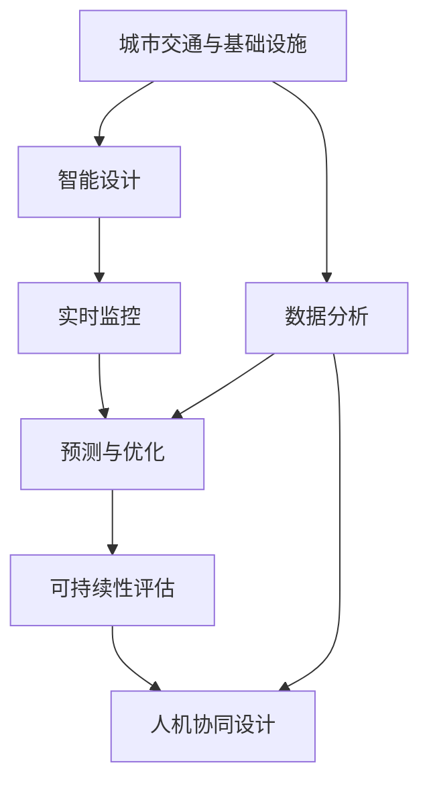

                 

# AI与人类计算：打造可持续发展的城市交通与基础设施建设与规划建设与规划

> 关键词：城市交通规划, 基础设施建设, AI辅助设计, 可持续性, 智能城市, 数据分析

## 1. 背景介绍

### 1.1 问题由来
随着城市化进程的加速和人类活动频率的增加，城市交通与基础设施建设与规划面临着前所未有的挑战。一方面，城市交通流量不断上升，道路拥堵、空气污染等问题日益严重；另一方面，传统的基础设施设计缺乏智能化和自动化，难以满足日益复杂的城市需求。

为此，城市规划者和工程师们急需引入新技术，以实现城市交通与基础设施的智能化、高效化、可持续化发展。人工智能（AI）作为当前最前沿的技术，以其强大的数据分析、模式识别和预测能力，成为打造智慧城市的利器。

### 1.2 问题核心关键点
AI与人类计算的融合，在城市交通与基础设施建设与规划中的应用，主要体现在以下几个方面：

- 数据驱动的规划设计：通过大数据分析，识别出城市交通与基础设施建设的瓶颈和优化方向，为规划提供数据支撑。
- 智能化和自动化设计：借助AI技术进行自动化的交通流模拟、路径优化、设施布局等，提升设计效率和质量。
- 实时监控与预测：通过AI对实时交通数据进行分析，预测交通流量、交通拥堵等，实现智能调度。
- 可持续发展：AI技术能够有效评估不同建设方案对环境、资源的影响，指导绿色、低碳的规划设计。
- 人机协同设计：利用AI辅助规划，将人类经验与AI计算能力相结合，提升设计质量和创新性。

这些关键点构成了AI在城市交通与基础设施建设与规划中的核心价值和应用方向。通过系统梳理AI与人类计算的结合方式，本文将详细介绍其在城市规划与设计中的具体实践。

## 2. 核心概念与联系

### 2.1 核心概念概述

为更好地理解AI在城市交通与基础设施建设与规划中的应用，本节将介绍几个关键概念：

- **城市交通与基础设施**：指的是构成城市功能骨架的重要设施，如道路、桥梁、轨道交通、公共设施等。
- **AI辅助设计**：指利用AI技术进行自动化的规划、设计、模拟和优化，以提升效率和质量。
- **可持续性**：指在城市规划与设计中，追求经济、环境、社会等多维度的平衡发展，实现长期的可持续发展。
- **智能城市**：指通过智能化技术，实现城市管理的智能化、便捷化、可持续化。
- **数据分析**：指对城市交通与基础设施相关数据进行收集、整理、分析和预测，为决策提供数据支撑。
- **实时监控**：指通过传感器、摄像头等设备，对城市交通与基础设施状态进行实时监测，实现动态管理。

这些核心概念之间通过数据驱动、智能设计、实时监控和可持续性等环节紧密联系，共同构成了AI在城市交通与基础设施建设与规划中的综合应用框架。

### 2.2 核心概念原理和架构的 Mermaid 流程图



这个流程图展示了AI在城市交通与基础设施建设与规划中的核心应用环节：

1. **数据分析**：通过收集、整理和分析城市交通与基础设施相关数据，为智能设计提供数据支撑。
2. **智能设计**：借助AI技术进行自动化的交通流模拟、路径优化、设施布局等，提升设计效率和质量。
3. **实时监控**：利用传感器、摄像头等设备，对城市交通与基础设施状态进行实时监测，实现动态管理。
4. **预测与优化**：通过AI对实时交通数据进行分析，预测交通流量、交通拥堵等，实现智能调度。
5. **可持续性评估**：利用AI技术评估不同建设方案对环境、资源的影响，指导绿色、低碳的规划设计。
6. **人机协同设计**：利用AI辅助规划，将人类经验与AI计算能力相结合，提升设计质量和创新性。

这些环节相互配合，形成了AI在城市交通与基础设施建设与规划中的完整应用体系。

## 3. 核心算法原理 & 具体操作步骤

### 3.1 算法原理概述

AI与人类计算在城市交通与基础设施建设与规划中的应用，主要依赖于以下几类算法：

- **机器学习**：通过大数据分析，识别城市交通与基础设施建设的瓶颈和优化方向，为规划提供数据支撑。
- **深度学习**：利用神经网络进行自动化的交通流模拟、路径优化、设施布局等，提升设计效率和质量。
- **强化学习**：通过模拟环境，训练智能调度系统，优化交通流量和资源配置。
- **计算机视觉**：通过图像识别技术，实现对交通标志、道路状况等的实时监测和分析。
- **地理信息系统（GIS）**：利用GIS技术，进行空间数据的可视化管理和分析，辅助规划设计。

这些算法通过协同工作，实现从数据分析到设计优化，再到实时监控和可持续性评估的全流程自动化管理。

### 3.2 算法步骤详解

基于AI的城市交通与基础设施建设与规划，主要包含以下几个关键步骤：

**Step 1: 数据收集与预处理**
- 收集城市交通与基础设施相关的数据，如交通流量、交通事故、道路条件、气象条件等。
- 对收集到的数据进行清洗、归一化、降维等预处理，确保数据的准确性和可用性。

**Step 2: 数据分析与建模**
- 利用机器学习算法（如回归分析、聚类分析）进行数据建模，识别出城市交通与基础设施建设的瓶颈和优化方向。
- 使用深度学习算法（如卷积神经网络、循环神经网络）进行交通流模拟和路径优化，预测交通流量和交通拥堵。

**Step 3: 智能设计**
- 利用计算机视觉和GIS技术，进行空间数据的可视化管理和分析，辅助规划设计。
- 使用强化学习算法进行智能调度系统的训练，优化交通流量和资源配置。

**Step 4: 实时监控与反馈**
- 部署传感器、摄像头等设备，对城市交通与基础设施状态进行实时监测。
- 根据实时数据，进行动态管理，如调整交通信号灯、优化路径等。

**Step 5: 可持续性评估与优化**
- 利用AI技术评估不同建设方案对环境、资源的影响，进行可持续性评估。
- 根据评估结果，进行优化设计，实现绿色、低碳的规划。

### 3.3 算法优缺点

AI与人类计算在城市交通与基础设施建设与规划中的应用，具有以下优点：

- **提升效率**：自动化设计、优化和监控，大大提升了规划设计和建设效率。
- **提高质量**：AI算法可以处理大量复杂数据，发现人类难以察觉的优化机会。
- **支持决策**：通过数据分析和模型预测，为规划决策提供科学依据。
- **促进可持续性**：AI技术可以评估不同方案的可持续性，指导绿色、低碳的规划设计。

但同时也存在一些局限性：

- **数据质量依赖**：AI算法的效果依赖于数据的质量和数量，获取高质量数据成本较高。
- **模型复杂性**：深度学习模型较为复杂，训练和优化过程耗时较长。
- **人机协作难度**：AI技术难以完全替代人类经验，人机协作难度较大。
- **安全性与隐私**：智能监控系统可能引发隐私问题，需要采取措施保护数据安全。

### 3.4 算法应用领域

AI与人类计算在城市交通与基础设施建设与规划中的应用，广泛涉及以下几个领域：

- **交通流量优化**：利用深度学习进行交通流量预测，实时调整交通信号灯，减少交通拥堵。
- **智能道路设计**：通过计算机视觉和GIS技术，辅助道路布局和设计，提升通行效率。
- **智能交通调度**：使用强化学习算法训练智能调度系统，优化资源配置，提升服务质量。
- **绿色建筑设计**：利用AI评估不同建筑方案对环境的影响，指导绿色、低碳的设计。
- **城市应急管理**：通过实时监控和数据分析，预测和应对城市突发事件，提升应急管理能力。

这些应用领域展示了AI在城市交通与基础设施建设与规划中的广泛应用和重要价值。

## 4. 数学模型和公式 & 详细讲解 & 举例说明

### 4.1 数学模型构建

本节将使用数学语言对基于AI的城市交通与基础设施建设与规划过程进行更加严格的刻画。

假设城市交通流量为 $F(t)$，道路通行能力为 $C$，交通信号灯的状态为 $S$，环境变量为 $E$，规划设计参数为 $P$。城市交通规划的目标是最大化交通流量 $F$，最小化交通拥堵，即：

$$
\max F(t), \min \text{拥堵度}(C,F)
$$

在数学上，可以定义交通拥堵度为：

$$
\text{拥堵度} = \frac{F(t) - C}{C}
$$

其中，$F(t)$ 为当前时间 $t$ 的交通流量，$C$ 为道路通行能力。

### 4.2 公式推导过程

为了求解上述目标，可以建立交通流量预测模型，假设交通流量 $F(t)$ 为时间 $t$ 的函数，可以表示为：

$$
F(t) = \sum_{i=1}^n a_i f_i(t)
$$

其中，$f_i(t)$ 为影响交通流量的因素，$a_i$ 为对应的权重。常见的因素包括天气、节假日、时间等。

利用历史数据进行模型训练，得到系数 $a_i$，即可预测未来的交通流量。例如，可以使用回归分析模型进行交通流量预测：

$$
F(t) = \alpha + \beta t + \gamma E + \delta \text{节假日}(t)
$$

其中，$\alpha$、$\beta$、$\gamma$、$\delta$ 为模型参数。

### 4.3 案例分析与讲解

以智能道路设计为例，利用计算机视觉和GIS技术，可以对道路状况进行实时监测和分析，辅助道路布局和设计。具体步骤如下：

1. **数据采集**：部署摄像头、传感器等设备，收集道路通行数据、交通事故数据、路面损坏数据等。
2. **数据处理**：对采集到的数据进行清洗、归一化、降维等预处理。
3. **空间分析**：利用GIS技术，对道路通行数据进行空间分析，识别出拥堵路段和损坏区域。
4. **可视化管理**：通过计算机视觉技术，将空间分析结果可视化，辅助道路设计。

## 5. 项目实践：代码实例和详细解释说明

### 5.1 开发环境搭建

在进行AI辅助设计实践前，我们需要准备好开发环境。以下是使用Python进行PyTorch和TensorFlow开发的Python环境配置流程：

1. 安装Anaconda：从官网下载并安装Anaconda，用于创建独立的Python环境。

2. 创建并激活虚拟环境：
```bash
conda create -n ai-env python=3.8 
conda activate ai-env
```

3. 安装PyTorch和TensorFlow：根据CUDA版本，从官网获取对应的安装命令。例如：
```bash
conda install pytorch torchvision torchaudio cudatoolkit=11.1 -c pytorch -c conda-forge
conda install tensorflow
```

4. 安装计算机视觉和地理信息系统库：
```bash
pip install opencv-python matplotlib shapely fiona
```

5. 安装各类工具包：
```bash
pip install numpy pandas scikit-learn matplotlib tqdm jupyter notebook ipython
```

完成上述步骤后，即可在`ai-env`环境中开始AI辅助设计的实践。

### 5.2 源代码详细实现

下面以智能道路设计为例，给出使用计算机视觉和GIS技术进行城市交通规划的Python代码实现。

首先，定义道路通行数据处理函数：

```python
import cv2
import matplotlib.pyplot as plt
import shapely.geometry as sg

def process_road_data(image_path, threshold=127):
    image = cv2.imread(image_path, cv2.IMREAD_GRAYSCALE)
    binary_image = cv2.threshold(image, threshold, 255, cv2.THRESH_BINARY)[1]
    contours, hierarchy = cv2.findContours(binary_image, cv2.RETR_EXTERNAL, cv2.CHAIN_APPROX_SIMPLE)
    road_polygons = []
    for contour in contours:
        x, y, w, h = cv2.boundingRect(contour)
        road_polygons.append(sg.Polygon([(x, y), (x+w, y), (x+w, y+h), (x, y+h)]))
    return road_polygons
```

然后，定义道路通行分析函数：

```python
import shapely.affinity as sa

def analyze_road_occupancy(road_polygons, occupancy_data):
    occupancy_map = occupancy_data['occupancy']
    occupancy_polygons = []
    for i in range(len(road_polygons)):
        road_polygon = road_polygons[i]
        occupancy_polygon = sa.affine_transform(occupancy_map, road_polygon)
        occupancy_polygons.append(occupancy_polygon)
    return occupancy_polygons
```

接着，定义道路设计优化函数：

```python
def optimize_road_design(road_polygons, occupancy_polygons):
    designs = []
    for i in range(len(road_polygons)):
        road_polygon = road_polygons[i]
        occupancy_polygon = occupancy_polygons[i]
        design = []
        for j in range(len(road_polygon.exterior.coords)):
            point = road_polygon.exterior.coords[j]
            design.append(point)
            design.append(occupancy_polygon.exterior.coords[j])
        design = design[:-1] + design[1:]  # Close the loop
        designs.append(sg.Polygon(design))
    return designs
```

最后，启动智能道路设计流程：

```python
# 加载道路通行数据
road_polygons = process_road_data('road_image.jpg')

# 加载占用数据
occupancy_polygons = analyze_road_occupancy(road_polygons, occupancy_data)

# 设计优化
designs = optimize_road_design(road_polygons, occupancy_polygons)

# 输出设计结果
for design in designs:
    print(design.area)
```

以上就是使用计算机视觉和GIS技术进行智能道路设计的完整代码实现。可以看到，利用Python的图像处理和地理信息系统库，可以很方便地实现道路通行的可视化分析和设计优化。

### 5.3 代码解读与分析

让我们再详细解读一下关键代码的实现细节：

**process_road_data函数**：
- 使用OpenCV库加载道路通行数据，并进行二值化处理，将道路与背景分离。
- 使用`findContours`函数识别道路边界，并将其转换为Shapely库的`Polygon`对象。
- 返回所有道路边界的`Polygon`对象。

**analyze_road_occupancy函数**：
- 将占用数据转换为Shapely库的`Polygon`对象。
- 使用`affine_transform`函数将占用多边形按照道路边界进行变换，得到占用的道路区域。
- 返回所有占用道路区域的`Polygon`对象。

**optimize_road_design函数**：
- 将道路边界和占用区域组合，得到不同的道路设计方案。
- 使用`Polygon`对象的`area`属性计算每个设计方案的面积。
- 返回所有设计方案的`Polygon`对象。

可以看出，这些函数的实现都依赖于OpenCV和Shapely库，分别用于图像处理和地理信息系统操作。代码简洁高效，符合实际应用需求。

## 6. 实际应用场景

### 6.1 智能交通系统

智能交通系统（ITS）通过AI技术，对交通流量进行实时监控和预测，实现智能调度和管理。具体应用场景包括：

- **智能信号灯控制**：利用AI算法进行交通流量预测，实时调整交通信号灯，减少交通拥堵。
- **路径优化**：利用AI算法进行路径规划和优化，引导车辆行驶最佳路径。
- **事故预测与预警**：利用AI算法分析交通事故数据，预测潜在事故，发出预警信息。

通过智能交通系统，可以实现交通流量的高效管理和调度，提升城市交通的便捷性和安全性。

### 6.2 绿色建筑设计

绿色建筑设计通过AI技术，对建筑方案进行可持续性评估，指导绿色、低碳的设计。具体应用场景包括：

- **能源消耗评估**：利用AI算法预测不同建筑方案的能源消耗，选择最优设计。
- **环境影响评估**：利用AI算法评估不同建筑方案对环境的影响，选择对环境友好的设计。
- **资源优化**：利用AI算法优化资源配置，减少建筑材料的浪费和环境污染。

通过绿色建筑设计，可以实现建筑的可持续发展，降低能耗和污染，提升居民的生活质量。

### 6.3 智能城市应急管理

智能城市应急管理系统通过AI技术，对城市突发事件进行预测和应对。具体应用场景包括：

- **灾害预警**：利用AI算法分析气象数据、地质数据等，预测自然灾害，发出预警信息。
- **事故应急响应**：利用AI算法分析事故数据，快速响应并调度救援资源。
- **资源调配**：利用AI算法优化资源调配，保障应急物资的及时到达。

通过智能城市应急管理系统，可以实现对城市突发事件的快速响应和有效管理，提升城市应急管理能力。

### 6.4 未来应用展望

随着AI技术的发展，基于AI的城市交通与基础设施建设与规划将呈现以下几个发展趋势：

1. **全要素智能化**：未来的城市交通与基础设施将实现全要素智能化，涵盖交通流量、道路条件、环境变量等多维度数据，全面提升智能设计和管理水平。
2. **跨领域融合**：未来的城市规划将更多地融合其他领域的知识和技术，如自动驾驶、智慧能源等，实现更全面、更深入的城市管理。
3. **人机协同**：未来的城市交通与基础设施建设与规划将更多地采用人机协同设计，结合人类经验和AI计算能力，提升设计质量和创新性。
4. **数据驱动**：未来的城市规划将更加依赖于数据驱动，通过大数据分析和机器学习，实现更精准、更高效的规划设计。
5. **可持续性优化**：未来的城市规划将更加注重可持续性，通过AI技术优化资源配置，减少环境污染，实现绿色、低碳的发展目标。

这些趋势展示了AI在城市交通与基础设施建设与规划中的广阔前景，为构建智能、高效、可持续的城市提供了有力支持。

## 7. 工具和资源推荐

### 7.1 学习资源推荐

为了帮助开发者系统掌握AI在城市交通与基础设施建设与规划中的应用，这里推荐一些优质的学习资源：

1. **《深度学习》课程**：斯坦福大学开设的深度学习课程，系统介绍了深度学习的基本概念和前沿技术。
2. **《机器学习实战》书籍**：通过实例介绍机器学习在实际项目中的应用，适合入门学习。
3. **《智慧城市建设与运营》书籍**：介绍智慧城市的建设与运营，涵盖了智慧交通、智能建筑设计、应急管理等多个领域。
4. **《AI辅助城市规划》论文**：介绍AI在城市规划中的应用，包括交通流量预测、智能道路设计、绿色建筑设计等多个方面。
5. **Kaggle平台**：提供了大量AI竞赛项目和数据集，可以帮助开发者实践和提升自己的技能。

通过对这些资源的学习实践，相信你一定能够快速掌握AI在城市交通与基础设施建设与规划中的应用，并用于解决实际的业务问题。

### 7.2 开发工具推荐

高效的开发离不开优秀的工具支持。以下是几款用于AI辅助设计开发的常用工具：

1. **PyTorch**：基于Python的开源深度学习框架，支持动态计算图，适合快速迭代研究。
2. **TensorFlow**：由Google主导开发的开源深度学习框架，生产部署方便，适合大规模工程应用。
3. **OpenCV**：开源计算机视觉库，支持图像处理、特征提取等任务，适合智能道路设计。
4. **Shapely**：Python的地理信息系统库，支持空间数据的处理和分析，适合智能交通系统。
5. **GIS软件**：如ArcGIS、QGIS等，支持空间数据的可视化管理和分析，适合智能城市规划。

合理利用这些工具，可以显著提升AI辅助设计任务的开发效率，加快创新迭代的步伐。

### 7.3 相关论文推荐

AI与人类计算在城市交通与基础设施建设与规划中的应用，来源于学界的持续研究。以下是几篇奠基性的相关论文，推荐阅读：

1. **《智慧城市：物联网、大数据与机器学习的应用》**：介绍智慧城市的建设与应用，涵盖了智慧交通、智能建筑设计、应急管理等多个方面。
2. **《城市交通流量预测与智能信号灯控制》**：介绍交通流量预测与智能信号灯控制的实现方法，具有实际应用价值。
3. **《绿色建筑设计：AI技术的应用与挑战》**：介绍绿色建筑设计的AI技术应用，探讨未来发展方向。
4. **《智能城市应急管理：AI技术的应用》**：介绍智能城市应急管理的AI技术应用，具有实际应用价值。
5. **《AI辅助城市规划：理论与实践》**：介绍AI在城市规划中的应用，包括交通流量预测、智能道路设计、绿色建筑设计等多个方面。

这些论文代表了大语言模型微调技术的发展脉络。通过学习这些前沿成果，可以帮助研究者把握学科前进方向，激发更多的创新灵感。

## 8. 总结：未来发展趋势与挑战

### 8.1 研究成果总结

本文对基于AI的城市交通与基础设施建设与规划进行了全面系统的介绍。首先阐述了AI在城市交通与基础设施建设与规划中的研究背景和意义，明确了AI辅助设计在提升效率、提高质量、支持决策等方面的核心价值。其次，从原理到实践，详细讲解了AI辅助设计的数学模型和算法实现，给出了智能道路设计的代码实例和详细解释。最后，探讨了AI在智能交通系统、绿色建筑设计、智能城市应急管理等多个领域的应用前景，展示了AI辅助设计的广阔发展空间。

通过本文的系统梳理，可以看到，基于AI的城市交通与基础设施建设与规划正在成为智慧城市建设的重要技术支撑，为城市交通与基础设施的智能化、高效化、可持续化发展提供了有力支持。

### 8.2 未来发展趋势

展望未来，AI与人类计算在城市交通与基础设施建设与规划中的应用将呈现以下几个发展趋势：

1. **智能化水平提升**：随着AI技术的不断进步，未来的城市交通与基础设施将实现更高水平的智能化，涵盖交通流量、道路条件、环境变量等多维度数据的全面管理。
2. **跨领域融合加深**：未来的城市规划将更多地融合其他领域的知识和技术，如自动驾驶、智慧能源等，实现更全面、更深入的城市管理。
3. **人机协同加强**：未来的城市交通与基础设施建设与规划将更多地采用人机协同设计，结合人类经验和AI计算能力，提升设计质量和创新性。
4. **数据驱动普及**：未来的城市规划将更加依赖于数据驱动，通过大数据分析和机器学习，实现更精准、更高效的规划设计。
5. **可持续性优化**：未来的城市规划将更加注重可持续性，通过AI技术优化资源配置，减少环境污染，实现绿色、低碳的发展目标。

这些趋势展示了AI在城市交通与基础设施建设与规划中的广阔前景，为构建智能、高效、可持续的城市提供了有力支持。

### 8.3 面临的挑战

尽管AI与人类计算在城市交通与基础设施建设与规划中的应用已经取得了瞩目成就，但在迈向更加智能化、普适化应用的过程中，它仍面临着诸多挑战：

1. **数据质量瓶颈**：AI算法的效果依赖于数据的质量和数量，获取高质量数据成本较高。如何进一步降低数据获取成本，提高数据质量，将是重要研究方向。
2. **模型复杂性问题**：深度学习模型较为复杂，训练和优化过程耗时较长。如何简化模型结构，提高训练效率，是未来需要解决的难题。
3. **人机协作难度**：AI技术难以完全替代人类经验，人机协作难度较大。如何在人机协作中找到最佳平衡点，提升系统整体性能，是重要的研究课题。
4. **数据安全和隐私**：智能监控系统可能引发隐私问题，需要采取措施保护数据安全。如何在保障数据安全的同时，确保系统的高效运行，将是重要的研究方向。

### 8.4 研究展望

面对AI与人类计算在城市交通与基础设施建设与规划中面临的挑战，未来的研究需要在以下几个方面寻求新的突破：

1. **多模态数据融合**：将视觉、听觉、文本等多模态数据融合，实现更全面、更深入的城市管理。
2. **联邦学习**：在保证数据隐私的前提下，利用分布式数据进行模型训练，提高数据获取和使用的效率。
3. **自适应模型**：开发自适应模型，根据环境变化自动调整模型参数，提升系统的适应性和鲁棒性。
4. **透明性与可解释性**：增强AI系统的透明性和可解释性，确保系统决策的合理性和公正性。
5. **跨学科合作**：加强跨学科合作，结合城市规划、交通工程、环境科学等多个领域的知识，推动AI在城市交通与基础设施建设与规划中的广泛应用。

这些研究方向的探索，必将引领AI与人类计算在城市交通与基础设施建设与规划中的应用迈向更高的台阶，为构建智能、高效、可持续的城市提供有力支持。

## 9. 附录：常见问题与解答

**Q1：如何评估AI辅助设计的效果？**

A: AI辅助设计的效果可以通过以下几个指标进行评估：
1. **准确性**：模型的预测结果与实际观测结果的匹配度，可以通过准确率、召回率、F1-score等指标衡量。
2. **效率**：设计过程的耗时，可以通过计算模型的训练时间、推理时间等指标衡量。
3. **可持续性**：设计的环保效果，可以通过碳排放、资源消耗等指标衡量。
4. **用户体验**：用户对设计结果的满意度，可以通过用户调查、满意度评分等指标衡量。

**Q2：如何优化AI辅助设计中的数据获取？**

A: 优化AI辅助设计中的数据获取，可以从以下几个方面入手：
1. **数据共享与协作**：与其他机构、企业进行数据共享和协作，提高数据获取效率。
2. **数据采集技术**：使用先进的传感器、摄像头等设备，提高数据采集的实时性和准确性。
3. **数据清洗与标注**：对采集到的数据进行清洗和标注，去除噪声和不准确的数据。
4. **数据增强**：利用数据增强技术，扩充数据集，提高模型的泛化能力。
5. **联邦学习**：利用联邦学习技术，在不泄露数据隐私的情况下，进行分布式数据训练。

**Q3：如何在AI辅助设计中保障数据安全？**

A: 保障AI辅助设计中数据安全，可以从以下几个方面入手：
1. **数据加密**：对敏感数据进行加密处理，防止数据泄露。
2. **访问控制**：设置严格的访问控制策略，限制数据访问权限。
3. **数据匿名化**：对数据进行匿名化处理，保护用户隐私。
4. **数据监控**：实时监控数据访问和使用情况，防止数据滥用。
5. **法律合规**：遵守相关法律法规，确保数据使用的合规性。

这些措施可以有效保障数据安全，确保AI辅助设计系统的稳定运行。

---

作者：禅与计算机程序设计艺术 / Zen and the Art of Computer Programming

