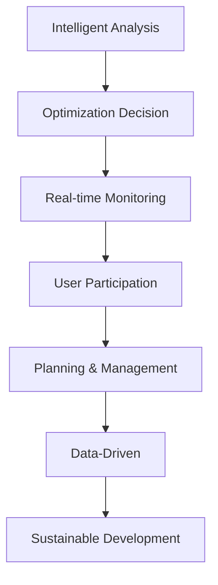

                 

# AI与人类计算：打造可持续发展的城市交通与基础设施规划管理

> 关键词：人工智能, 可持续性, 城市规划, 交通管理, 基础设施, 优化算法, 计算图, 模型评估, 网络化运营, 大数据分析, 机器学习

## 1. 背景介绍

### 1.1 问题由来

现代城市化进程中，交通与基础设施规划管理面临着前所未有的挑战。随着人口的快速增长和城市化水平的提升，交通拥堵、环境污染、资源浪费等问题日益突出。如何在有限的资源下，实现城市交通的可持续发展和基础设施的合理规划，成为一个亟待解决的问题。

与此同时，近年来，人工智能（AI）技术的发展为解决这些问题提供了新的思路和方法。AI技术的运用，尤其是在交通管理和城市规划领域，展现了巨大的潜力和应用前景。本文将介绍如何通过AI技术，尤其是AI与人类计算的结合，来优化城市交通与基础设施规划管理，打造可持续发展的未来城市。

### 1.2 问题核心关键点

AI与人类计算在城市交通与基础设施规划管理中的应用，核心在于将复杂的人类计算任务，借助AI技术的强大能力，实现高效、精确的决策支持。关键点包括：

- **智能分析**：利用AI技术，对海量数据进行智能分析和处理，实现交通流量预测、交通异常检测、基础设施使用情况评估等功能。
- **优化决策**：通过AI模型，对多种交通和基础设施方案进行优化决策，选出最优的规划和管理策略。
- **实时监控**：建立实时监控系统，对交通与基础设施运行状态进行持续监测，及时调整和优化运营策略。
- **用户参与**：将AI算法与人类专业知识相结合，构建智能辅助决策系统，使得规划者能够高效利用专家知识和经验。
- **数据驱动**：构建大数据分析平台，整合各类数据资源，实现数据驱动的城市规划和管理。

## 2. 核心概念与联系

### 2.1 核心概念概述

为更好地理解AI与人类计算在城市交通与基础设施规划管理中的应用，本节将介绍几个密切相关的核心概念：

- **人工智能（AI）**：一种通过机器学习、深度学习等技术，让机器具备智能分析、决策能力的科学。
- **可持续性（Sustainability）**：指在满足当前需求的同时，不损害后代人满足其需求的能力，强调资源的有效利用和环境的保护。
- **城市交通（Urban Traffic）**：指城市内部的交通流动和系统，包括道路、公共交通、自行车、步行等多种交通方式。
- **基础设施（Infrastructure）**：指城市运行和发展所必需的基础设施，包括道路、桥梁、隧道、公共交通等。
- **规划管理（Planning & Management）**：指对城市交通与基础设施进行系统性的规划、设计和管理，确保其可持续性。
- **智能分析（Intelligent Analysis）**：通过AI技术对数据进行智能处理和分析，辅助决策。
- **优化决策（Optimization Decision）**：利用AI模型，对多种方案进行优化，选出最优策略。
- **实时监控（Real-time Monitoring）**：通过传感器、数据采集设备等技术，实现对交通与基础设施的实时监测。
- **用户参与（User Participation）**：引入人工智能算法，结合人类专业知识，构建智能辅助决策系统。
- **数据驱动（Data-Driven）**：利用大数据分析技术，整合各类数据资源，实现数据驱动的城市规划和管理。

这些核心概念之间的逻辑关系可以通过以下Mermaid流程图来展示：



这个流程图展示了这个逻辑链条：

1. 通过智能分析，获取交通与基础设施运行数据。
2. 利用优化决策，对多种方案进行比较和选择。
3. 实时监控系统持续监测交通与基础设施状态。
4. 用户参与，结合人类专业知识，辅助决策。
5. 数据驱动，整合各类数据资源，支撑智能规划。
6. 最终实现可持续发展的城市交通与基础设施管理。

## 3. 核心算法原理 & 具体操作步骤
### 3.1 算法原理概述

AI与人类计算在城市交通与基础设施规划管理中的应用，本质上是一个数据驱动、智能辅助的决策优化过程。其核心思想是：通过数据收集、分析和处理，借助AI技术的强大计算能力，实现对城市交通与基础设施的智能化管理，提高资源利用效率，降低环境影响。

形式化地，假设我们有一系列决策变量 $x$，以及目标函数 $f(x)$ 和约束条件 $g(x)$，决策优化的目标是找到最优的 $x$：

$$
\min_{x} \; f(x) \quad \text{subject to} \; g(x) \leq 0
$$

其中，$f(x)$ 代表要最小化的目标（如交通拥堵、环境污染），$g(x)$ 代表约束条件（如道路容量、预算限制）。

在实际应用中，目标函数和约束条件往往比较复杂，难以直接求解。因此，利用AI技术，如机器学习、深度学习、优化算法等，可以在大规模数据集上训练模型，辅助决策优化。

### 3.2 算法步骤详解

基于AI与人类计算的城市交通与基础设施规划管理一般包括以下几个关键步骤：

**Step 1: 数据收集与预处理**
- 收集交通流量、公共交通运营、环境监测等数据。
- 对数据进行清洗、归一化等预处理，确保数据质量。
- 通过数据整合和融合，构建综合数据平台。

**Step 2: 智能分析与模型构建**
- 利用AI技术，如机器学习、深度学习、优化算法等，构建智能分析模型。
- 在数据平台上构建基于数据的交通与基础设施管理模型。
- 利用历史数据训练模型，提高预测和分析的准确性。

**Step 3: 优化决策与方案选择**
- 利用构建的智能分析模型，进行交通流量预测、交通异常检测、基础设施使用情况评估等。
- 结合专家知识和经验，设计多种方案，进行多目标优化决策。
- 选择最优的规划和管理策略，实现资源的有效利用。

**Step 4: 实时监控与动态调整**
- 利用传感器、数据采集设备等技术，实现对交通与基础设施的实时监控。
- 根据实时数据，动态调整运营策略，确保交通系统的稳定运行。
- 对监控数据进行实时分析，及时发现并解决潜在问题。

**Step 5: 用户参与与反馈**
- 通过智能辅助决策系统，将AI模型与人类专业知识相结合，构建智能辅助决策系统。
- 收集用户反馈，不断优化模型和决策策略。
- 定期进行决策评估，调整和优化运营方案。

以上是基于AI与人类计算的城市交通与基础设施规划管理的一般流程。在实际应用中，还需要针对具体任务的特点，对微调过程的各个环节进行优化设计，如改进数据预处理技术、优化模型训练过程、增强实时监控系统的响应速度等，以进一步提升模型性能。

### 3.3 算法优缺点

AI与人类计算在城市交通与基础设施规划管理中的应用，具有以下优点：

- **高效性**：通过AI技术，可以大幅提高数据处理和分析的效率，缩短决策周期。
- **精确性**：AI模型利用大数据训练，能够提供精确的预测和分析结果，减少人为误差。
- **可扩展性**：AI技术可以灵活应用于多种场景，支持大规模、复杂的城市规划和管理。
- **可持续性**：通过智能分析和优化决策，能够实现资源的最优利用，促进可持续发展的目标。

同时，该方法也存在一定的局限性：

- **数据依赖**：AI模型依赖高质量、大量的数据，数据质量不足或缺失将影响模型性能。
- **模型复杂性**：构建和优化AI模型需要专业知识和技能，初期投入较大。
- **实时性挑战**：实时监控和动态调整需要高效的数据处理和快速响应能力，技术实现难度较大。
- **隐私和安全**：处理敏感的交通和基础设施数据，需要严格的数据隐私和安全保护措施。

尽管存在这些局限性，但就目前而言，AI与人类计算在城市交通与基础设施规划管理中的应用，已经展示了巨大的潜力和优势，成为推动城市可持续发展的重要工具。

### 3.4 算法应用领域

AI与人类计算在城市交通与基础设施规划管理中的应用，涵盖了从交通流量预测、交通异常检测、基础设施使用情况评估到优化决策、实时监控、用户参与等多个方面。具体应用场景包括：

- **交通流量预测**：利用AI模型，对未来交通流量进行预测，为交通规划和管理提供数据支撑。
- **交通异常检测**：通过智能分析，实时检测交通异常事件，如交通堵塞、交通事故等，及时采取应对措施。
- **基础设施使用情况评估**：利用AI技术，对基础设施的使用情况进行评估，优化资源分配。
- **优化决策支持**：结合专家知识和AI模型，进行交通和基础设施的优化决策，提高资源利用效率。
- **实时监控与动态调整**：通过传感器、数据采集设备等技术，实现对交通与基础设施的实时监控，动态调整运营策略。
- **智能辅助决策系统**：将AI算法与人类专业知识相结合，构建智能辅助决策系统，提高决策效率和质量。

除了上述这些经典应用外，AI与人类计算在城市交通与基础设施规划管理中的应用还在不断拓展，如智慧城市建设、绿色交通系统、智能物流等，为城市可持续发展提供了新的解决方案。

## 4. 数学模型和公式 & 详细讲解 & 举例说明
### 4.1 数学模型构建

本节将使用数学语言对AI与人类计算在城市交通与基础设施规划管理中的应用进行更加严格的刻画。

假设有一系列决策变量 $x = (x_1, x_2, \dots, x_n)$，以及目标函数 $f(x)$ 和约束条件 $g(x) = \{g_1(x), g_2(x), \dots, g_m(x)\}$，其中 $g_i(x)$ 代表第 $i$ 个约束条件。决策优化的目标是找到最优的 $x$：

$$
\min_{x} \; f(x) \quad \text{subject to} \; g(x) \leq 0
$$

其中，$f(x)$ 代表要最小化的目标（如交通拥堵、环境污染），$g_i(x)$ 代表第 $i$ 个约束条件（如道路容量、预算限制）。

在实际应用中，目标函数和约束条件往往比较复杂，难以直接求解。因此，利用AI技术，如机器学习、深度学习、优化算法等，可以在大规模数据集上训练模型，辅助决策优化。

### 4.2 公式推导过程

以下我们以交通流量预测为例，推导线性回归模型的公式及其梯度计算公式。

假设已知历史交通流量数据 $\{(t_i, F_i)\}_{i=1}^N$，其中 $t_i$ 为时间点，$F_i$ 为该时间点的交通流量。目标是构建一个线性回归模型 $y = \beta_0 + \beta_1 x_1 + \beta_2 x_2 + \dots + \beta_p x_p$，其中 $x_j$ 为第 $j$ 个特征，$\beta_j$ 为对应的权重系数。

通过最小二乘法，线性回归模型的目标函数为：

$$
\mathcal{L}(\beta) = \frac{1}{2N} \sum_{i=1}^N (F_i - \beta_0 - \beta_1 x_{1,i} - \beta_2 x_{2,i} - \dots - \beta_p x_{p,i})^2
$$

其中，$x_{j,i}$ 为时间 $t_i$ 的第 $j$ 个特征。

利用梯度下降法，求解最优的 $\beta_j$，得到更新公式：

$$
\beta_j \leftarrow \beta_j - \frac{\eta}{N} \sum_{i=1}^N (F_i - \beta_0 - \beta_1 x_{1,i} - \beta_2 x_{2,i} - \dots - \beta_p x_{p,i}) x_{j,i}
$$

其中 $\eta$ 为学习率。

通过上述公式，可以在大规模数据集上训练线性回归模型，预测未来的交通流量。

### 4.3 案例分析与讲解

假设我们有一个中等规模的城市，需要对未来一年的交通流量进行预测。具体步骤如下：

1. **数据收集**：收集历史交通流量数据，包括时间、路段、车流量等。
2. **数据预处理**：对数据进行清洗、归一化等预处理，确保数据质量。
3. **特征选择**：选择影响交通流量的关键特征，如时间、天气、节假日等。
4. **模型训练**：利用历史数据训练线性回归模型，得到最优的权重系数 $\beta$。
5. **流量预测**：输入新时间点，利用训练好的模型预测交通流量。
6. **结果评估**：利用实际交通流量数据，评估模型预测的准确性。

通过上述过程，我们可以实现对未来交通流量的预测，为城市交通规划和管理提供数据支撑。

## 5. 项目实践：代码实例和详细解释说明
### 5.1 开发环境搭建

在进行城市交通与基础设施规划管理应用开发前，我们需要准备好开发环境。以下是使用Python进行TensorFlow开发的环境配置流程：

1. 安装Anaconda：从官网下载并安装Anaconda，用于创建独立的Python环境。

2. 创建并激活虚拟环境：
```bash
conda create -n tf-env python=3.8 
conda activate tf-env
```

3. 安装TensorFlow：从官网获取对应的安装命令。例如：
```bash
conda install tensorflow -c tensorflow -c conda-forge
```

4. 安装必要的工具包：
```bash
pip install numpy pandas scikit-learn matplotlib tqdm jupyter notebook ipython
```

完成上述步骤后，即可在`tf-env`环境中开始应用开发。

### 5.2 源代码详细实现

这里我们以交通流量预测为例，给出使用TensorFlow对线性回归模型进行训练的Python代码实现。

首先，定义模型训练函数：

```python
import tensorflow as tf
from sklearn.model_selection import train_test_split

# 定义线性回归模型
def linear_regression_model(input_features, output_features):
    model = tf.keras.Sequential([
        tf.keras.layers.Dense(32, activation='relu', input_shape=[len(input_features.keys())]),
        tf.keras.layers.Dense(1)
    ])
    return model

# 定义损失函数和优化器
def loss_function(y_true, y_pred):
    return tf.reduce_mean(tf.square(y_true - y_pred))

def optimizer_function():
    return tf.keras.optimizers.Adam(learning_rate=0.001)

# 训练模型
def train_model(X, y, epochs):
    X_train, X_test, y_train, y_test = train_test_split(X, y, test_size=0.2, random_state=42)
    model = linear_regression_model(X_train.columns, y_train)
    optimizer = optimizer_function()
    for epoch in range(epochs):
        model.compile(optimizer=optimizer, loss=loss_function)
        model.fit(X_train, y_train, epochs=1, verbose=0)
        train_loss = model.evaluate(X_test, y_test, verbose=0)
    return model, train_loss
```

然后，准备数据集并调用训练函数：

```python
import pandas as pd

# 准备数据集
data = pd.read_csv('traffic_data.csv')

# 定义特征和标签
features = ['time', 'weather', 'holiday', 'road_condition']
labels = 'flow'

# 训练模型
model, train_loss = train_model(data[features], data[labels], epochs=10)

# 输出训练结果
print('Training Loss:', train_loss)
```

以上就是使用TensorFlow对线性回归模型进行交通流量预测的完整代码实现。可以看到，TensorFlow的强大图计算能力，使得模型的训练和预测过程更加高效和灵活。

### 5.3 代码解读与分析

让我们再详细解读一下关键代码的实现细节：

**线性回归模型**：
- `linear_regression_model`函数：定义一个包含两个全连接层的线性回归模型，第一层32个神经元，使用ReLU激活函数，第二层1个神经元，输出预测值。
- `loss_function`函数：定义均方误差损失函数。
- `optimizer_function`函数：定义Adam优化器，学习率为0.001。

**模型训练**：
- `train_model`函数：将数据集划分为训练集和测试集，构建模型，使用Adam优化器进行训练，每轮训练1个epoch，在测试集上评估模型性能，返回训练后的模型和训练损失。
- 在`train_model`函数中，利用TensorFlow的`fit`方法进行模型训练，每轮训练1个epoch，在测试集上评估模型性能，返回训练后的模型和训练损失。

**数据准备**：
- `data`变量：读取CSV文件，将数据集存储为pandas DataFrame对象。
- `features`变量：定义特征列名。
- `labels`变量：定义标签列名。

通过上述代码，我们可以构建一个简单的线性回归模型，对交通流量进行预测。虽然这个模型比较基础，但在实际应用中，可以通过引入更多的特征和优化算法，提升模型的预测准确性。

## 6. 实际应用场景
### 6.1 智能交通系统

AI与人类计算在智能交通系统中的应用，能够显著提升交通系统的运行效率和安全性。智能交通系统通过实时数据采集和分析，实现对交通流量的智能调控，缓解交通拥堵，减少交通事故。

具体而言，智能交通系统可以包括以下几个核心模块：

1. **智能信号灯控制**：利用AI技术，对交通流量进行实时监测，智能调整信号灯的时序和配时，提高道路通行效率。
2. **车辆跟踪与路径规划**：通过AI算法，对车辆位置和行驶轨迹进行跟踪和分析，提供路径规划建议，降低行车风险。
3. **交通事故检测与预警**：利用摄像头和传感器，实时检测交通异常事件，如交通事故、车辆堵塞等，及时发出预警，确保道路安全。
4. **公交调度与优化**：通过AI模型，对公交车的运行数据进行智能分析，优化公交线路和发车时间，提升公交服务的效率和可靠性。

### 6.2 智慧城市建设

AI与人类计算在智慧城市建设中的应用，能够全面提升城市的治理水平和管理效率。智慧城市通过数据驱动和智能决策，实现对城市各个领域的全面监控和管理，构建智能化的城市运行系统。

具体而言，智慧城市可以包括以下几个核心模块：

1. **城市综合管理**：利用AI技术，对城市运行数据进行综合分析和处理，实现城市资源的最优分配和管理。
2. **环境保护与治理**：通过AI模型，对环境监测数据进行智能分析，优化环境治理方案，减少污染和资源浪费。
3. **公共安全与应急响应**：利用AI技术，对公共安全数据进行实时监控和分析，提高应急响应速度和效果。
4. **城市交通与规划**：通过AI算法，对交通流量进行智能预测和调控，优化交通网络，提高城市通行效率。
5. **智能物流与配送**：通过AI模型，对物流数据进行智能分析，优化配送路线和时间，提升物流效率和用户体验。

### 6.3 未来应用展望

随着AI技术的发展和应用，AI与人类计算在城市交通与基础设施规划管理中的应用前景将更加广阔。未来，我们可以预见以下几个发展趋势：

1. **大规模数据处理**：AI技术将实现对大规模数据的实时处理和分析，提供更加精准的决策支持。
2. **多模态融合**：AI技术将实现对多种数据源的整合，如交通数据、环境数据、社会数据等，实现多模态数据的协同分析。
3. **智能化决策**：AI技术将与人类专业知识相结合，构建智能决策系统，实现更加智能化的城市规划和管理。
4. **可持续性优化**：AI技术将优化城市资源的利用，减少环境污染和资源浪费，推动城市可持续发展。
5. **个性化服务**：AI技术将提供个性化的城市服务，如智能交通导航、个性化推荐等，提升用户体验。

## 7. 工具和资源推荐
### 7.1 学习资源推荐

为了帮助开发者系统掌握AI与人类计算在城市交通与基础设施规划管理中的应用，这里推荐一些优质的学习资源：

1. TensorFlow官方文档：详细介绍了TensorFlow的各个模块和应用场景，提供了丰富的学习资源和代码示例。
2. PyTorch官方文档：介绍了PyTorch的深度学习框架，提供了大量的学习资源和代码示例。
3. Coursera《深度学习》课程：斯坦福大学开设的深度学习课程，有Lecture视频和配套作业，适合初学者学习。
4. Udacity《人工智能与机器学习》课程：通过实战项目，深入浅出地讲解了AI与机器学习的核心概念和应用。
5. IEEE Transactions on Smart Cities：期刊论文集，涵盖了智慧城市建设中的各类AI技术应用。

通过对这些资源的学习实践，相信你一定能够快速掌握AI与人类计算在城市交通与基础设施规划管理中的应用，并用于解决实际的NLP问题。

### 7.2 开发工具推荐

高效的开发离不开优秀的工具支持。以下是几款用于AI与人类计算在城市交通与基础设施规划管理中的应用开发的常用工具：

1. TensorFlow：基于Python的开源深度学习框架，灵活动态的计算图，适合快速迭代研究。
2. PyTorch：基于Python的开源深度学习框架，灵活性高，支持动态计算图。
3. Jupyter Notebook：交互式编程环境，支持代码编写和数据可视化，适合学术研究和工程开发。
4. TensorBoard：TensorFlow配套的可视化工具，可实时监测模型训练状态，并提供丰富的图表呈现方式。
5. Weights & Biases：模型训练的实验跟踪工具，可以记录和可视化模型训练过程中的各项指标，方便对比和调优。

合理利用这些工具，可以显著提升AI与人类计算在城市交通与基础设施规划管理中的应用开发效率，加快创新迭代的步伐。

### 7.3 相关论文推荐

AI与人类计算在城市交通与基础设施规划管理中的应用，涉及多个前沿领域，以下是几篇奠基性的相关论文，推荐阅读：

1. "A Survey on Deep Learning Applications in Smart Cities"：综述了AI技术在智慧城市建设中的应用，涵盖了智能交通、环境保护、公共安全等多个领域。
2. "Traffic Flow Prediction Using Deep Learning"：介绍利用深度学习模型进行交通流量预测的方法和技术。
3. "Intelligent Traffic Signal Control Using Reinforcement Learning"：研究利用强化学习技术进行智能信号灯控制的方法和效果。
4. "A Survey on AI in Urban Traffic Management"：综述了AI技术在城市交通管理中的应用，包括交通流量预测、信号灯控制、路径规划等多个方面。
5. "Environmental Intelligence for Smart Cities"：研究利用AI技术进行城市环境保护和治理的方法和效果。

这些论文代表了大语言模型微调技术的发展脉络。通过学习这些前沿成果，可以帮助研究者把握学科前进方向，激发更多的创新灵感。

## 8. 总结：未来发展趋势与挑战
### 8.1 总结

本文对AI与人类计算在城市交通与基础设施规划管理中的应用进行了全面系统的介绍。首先阐述了AI与人类计算的研究背景和意义，明确了在城市交通与基础设施规划管理中的应用价值。其次，从原理到实践，详细讲解了AI与人类计算的核心算法和具体操作步骤，提供了交通流量预测等具体应用的代码实例。同时，本文还探讨了AI与人类计算在智能交通系统、智慧城市建设等多个领域的应用前景，展示了其广阔的发展潜力。

通过本文的系统梳理，可以看到，AI与人类计算在城市交通与基础设施规划管理中的应用，正在成为推动城市可持续发展的重要工具。这些技术的不断发展，将进一步提升城市管理的智能化水平，推动人类计算向更加智能化、普适化应用的方向发展。

### 8.2 未来发展趋势

展望未来，AI与人类计算在城市交通与基础设施规划管理中的应用将呈现以下几个发展趋势：

1. **智能化水平提升**：AI技术将实现对城市运行数据的全面智能分析，提供更加精准的决策支持。
2. **多模态融合**：AI技术将实现对多种数据源的整合，如交通数据、环境数据、社会数据等，实现多模态数据的协同分析。
3. **智慧化管理**：AI技术将与人类专业知识相结合，构建智能决策系统，实现更加智慧化的城市管理。
4. **可持续性优化**：AI技术将优化城市资源的利用，减少环境污染和资源浪费，推动城市可持续发展。
5. **个性化服务**：AI技术将提供个性化的城市服务，如智能交通导航、个性化推荐等，提升用户体验。

### 8.3 面临的挑战

尽管AI与人类计算在城市交通与基础设施规划管理中的应用已经取得了显著成果，但在迈向更加智能化、普适化应用的过程中，它仍面临着诸多挑战：

1. **数据质量问题**：城市交通与基础设施的数据量庞大且复杂，数据质量直接影响到AI模型的性能。如何确保数据质量，是实现AI应用的关键。
2. **模型复杂性**：AI模型涉及复杂的算法和数据处理，初期投入较大。如何降低模型复杂性，提高模型训练和推理效率，是未来的研究方向。
3. **实时性挑战**：AI系统需要实时处理和分析数据，对计算资源和算法效率提出了高要求。如何提高系统的实时性，是未来的技术挑战。
4. **隐私和安全**：处理敏感的城市交通与基础设施数据，需要严格的数据隐私和安全保护措施。如何保护数据隐私和安全，是未来的研究重点。
5. **可解释性**：AI模型通常被视为"黑盒"系统，难以解释其内部工作机制和决策逻辑。如何提高模型的可解释性，增强系统的透明度，是未来的研究方向。

### 8.4 研究展望

面对AI与人类计算在城市交通与基础设施规划管理中的应用面临的挑战，未来的研究需要在以下几个方面寻求新的突破：

1. **数据质量提升**：构建高质量、多模态的数据采集和处理体系，确保数据的准确性和完整性。
2. **模型高效化**：开发更加高效、轻量级的AI模型，降低计算资源消耗，提高模型训练和推理效率。
3. **实时性优化**：优化计算图和算法，提高系统的实时处理能力，确保数据能够及时处理和分析。
4. **数据隐私保护**：引入隐私保护技术，如联邦学习、差分隐私等，确保数据隐私和安全。
5. **模型可解释性**：引入可解释性技术，如模型蒸馏、特征重要性分析等，增强系统的透明度和可解释性。

这些研究方向的探索，必将引领AI与人类计算在城市交通与基础设施规划管理中的应用向更高的台阶发展，为构建智能、可持续发展的未来城市铺平道路。面向未来，AI与人类计算技术还需要与其他AI技术进行更深入的融合，如知识表示、因果推理、强化学习等，多路径协同发力，共同推动城市交通与基础设施规划管理的进步。只有勇于创新、敢于突破，才能不断拓展AI技术在城市管理的边界，让人类计算技术更好地服务于城市可持续发展。

## 9. 附录：常见问题与解答

**Q1：AI与人类计算在城市交通与基础设施规划管理中的应用是否适用于所有城市？**

A: AI与人类计算在城市交通与基础设施规划管理中的应用，具有较强的泛化能力，适用于各类规模和类型的城市。但对于一些特定城市，可能需要根据其独特的地理、气候、文化等条件进行适应性调整和优化。

**Q2：如何降低AI模型对数据质量的要求？**

A: 为了降低AI模型对数据质量的要求，可以采取以下措施：
1. 数据预处理：对数据进行清洗、归一化、去噪等预处理，确保数据质量。
2. 数据增强：利用数据增强技术，如数据扩充、合成数据生成等，增加训练数据的丰富性。
3. 模型鲁棒性：使用鲁棒性较强的模型，如深度学习、强化学习等，提高模型对数据噪音的容忍度。
4. 多源数据融合：引入多源数据，综合利用不同数据源的信息，提升数据质量。

**Q3：AI与人类计算在城市交通与基础设施规划管理中的应用是否需要大量数据？**

A: AI与人类计算在城市交通与基础设施规划管理中的应用，通常需要大量高质量的数据来训练模型，提升模型性能。但随着AI技术的不断进步，小样本学习和迁移学习等技术的发展，可以在数据量较小的情况下，仍能取得不错的效果。

**Q4：AI与人类计算在城市交通与基础设施规划管理中的应用是否需要高成本的计算资源？**

A: AI与人类计算在城市交通与基础设施规划管理中的应用，对计算资源的需求较大，特别是在模型的训练和推理过程中。但随着计算硬件的进步，如GPU、TPU等高性能设备的应用，可以显著降低计算成本，提高系统的效率和性能。

**Q5：AI与人类计算在城市交通与基础设施规划管理中的应用是否需要专业知识？**

A: AI与人类计算在城市交通与基础设施规划管理中的应用，确实需要专业知识来指导模型的设计和优化。但在实际应用中，可以利用预训练模型和开源工具，通过简单的模型微调和参数调整，实现较为高效的应用。

总之，AI与人类计算在城市交通与基础设施规划管理中的应用，具有广阔的前景和巨大的潜力。通过不断的技术创新和应用实践，相信这一领域将能够为城市的可持续发展带来更多的可能性。

---

作者：禅与计算机程序设计艺术 / Zen and the Art of Computer Programming

