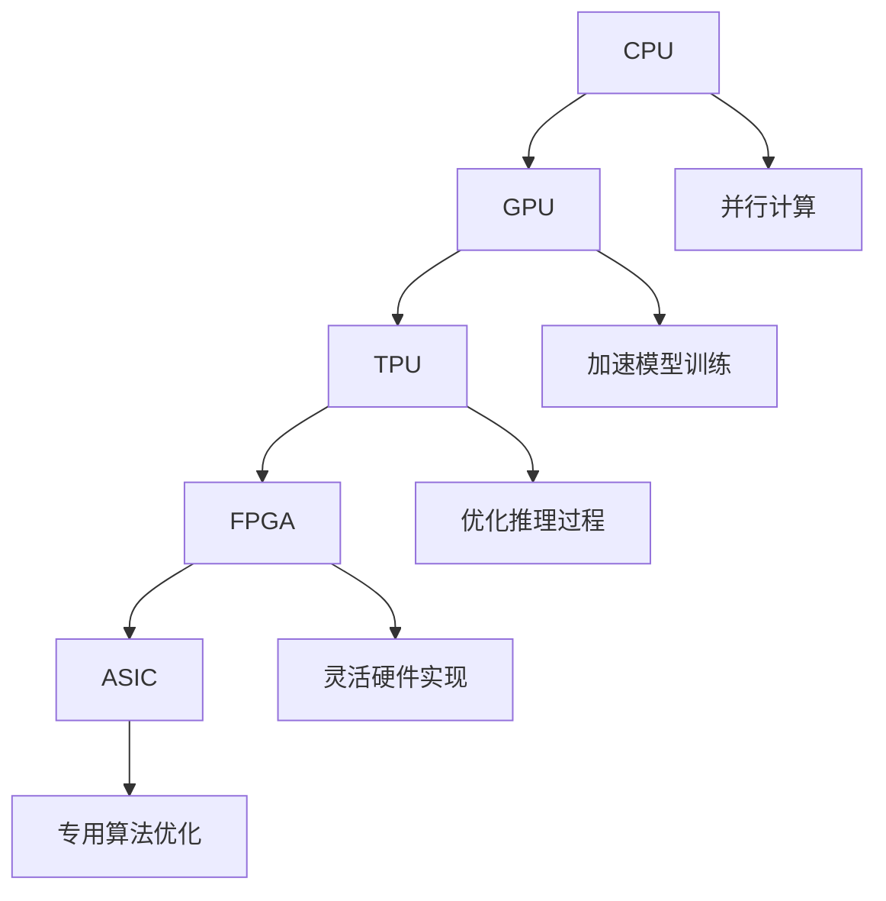

                 

# AI加速的乐观前景：贾扬清观点，异构芯片与大语言模型发展

> 关键词：异构芯片,大语言模型,深度学习,高性能计算,GPU,TPU,Transformer,ChatGPT

## 1. 背景介绍

### 1.1 问题由来

随着深度学习技术的飞速发展，AI领域取得了显著的突破，推动了各行业数字化转型升级。AI技术在医疗、教育、金融、制造等多个领域大显身手，提升了生产效率和决策质量。然而，AI的广泛应用也带来了新的挑战，如计算资源密集、模型规模庞大、训练和推理效率低下等。异构芯片作为AI加速的重要技术手段，通过将不同类型芯片的优势相结合，显著提升了深度学习的计算速度和能效比，成为大语言模型发展的关键驱动力。

### 1.2 问题核心关键点

异构芯片技术通过融合CPU、GPU、TPU等不同类型的芯片，充分发挥了各种芯片的计算优势，实现了AI算力的高效利用。在大语言模型的加速方面，异构芯片技术主要从以下几个方面发挥作用：

1. **计算加速**：通过异构芯片优化模型前向和反向传播过程，大幅提升训练和推理速度。
2. **资源优化**：利用异构芯片优化内存和IO性能，降低计算成本。
3. **模型压缩**：通过异构芯片优化模型参数存储和计算，实现模型的高效压缩和部署。

这些技术手段使得大语言模型能够以更低的成本、更短的周期完成训练，提高了模型应用的可行性和普及度。

### 1.3 问题研究意义

异构芯片技术在大语言模型中的应用，不仅提升了AI的计算能力，也推动了AI技术的落地应用。以下是异构芯片技术对大语言模型发展的重大意义：

1. **加速模型训练**：通过异构芯片优化训练流程，缩短大语言模型从预训练到微调的时间。
2. **提升推理效率**：利用异构芯片优化推理过程，实现低延迟、高吞吐率的推理服务。
3. **降低计算成本**：通过优化资源利用率，降低AI训练和推理的能耗和存储需求。
4. **增强模型泛化能力**：通过异构芯片优化模型参数优化过程，提升模型的泛化能力和鲁棒性。
5. **推动AI技术落地**：通过高效计算，加速大语言模型的部署，促进AI技术的普及应用。

## 2. 核心概念与联系

### 2.1 核心概念概述

异构芯片技术主要通过将不同类型的计算芯片融合，实现计算能力的多样化和优化。在大语言模型的应用中，异构芯片技术主要涉及以下几个概念：

1. **CPU**：通用处理器，适用于复杂算法的编程和调度。
2. **GPU**：图形处理器，擅长并行计算，适用于深度学习模型的训练和推理。
3. **TPU**：专门用于加速深度学习任务的芯片，通过硬件加速和软件优化，大幅提升模型计算效率。
4. **FPGA**：可编程门阵列，支持灵活的硬件实现和优化。
5. **ASIC**：专用集成电路，针对特定算法优化，适用于高性能计算。

这些异构芯片在深度学习任务中各显其能，通过协同工作，提升计算效率和资源利用率，实现大语言模型的加速。

### 2.2 核心概念原理和架构的 Mermaid 流程图



这个流程图展示了异构芯片在大语言模型中的应用：

1. CPU负责并行计算和复杂算法调度。
2. GPU加速深度学习模型的训练和推理。
3. TPU通过硬件加速和软件优化，大幅提升模型计算效率。
4. FPGA支持灵活的硬件实现和优化。
5. ASIC针对特定算法优化，适用于高性能计算。

这些芯片通过协同工作，提升计算效率和资源利用率，实现大语言模型的加速。

## 3. 核心算法原理 & 具体操作步骤

### 3.1 算法原理概述

在大语言模型的加速中，异构芯片技术主要通过优化模型的前向和反向传播过程，实现计算效率的提升。其核心原理如下：

1. **并行计算**：通过GPU和TPU等并行计算芯片，实现模型参数的并行计算，提升训练和推理速度。
2. **硬件加速**：利用FPGA和ASIC等专用芯片，实现深度学习模型的硬件加速，提升计算效率。
3. **资源优化**：通过CPU和GPU等芯片的综合调度，优化内存和IO性能，降低计算成本。
4. **模型压缩**：通过压缩模型参数和数据存储，优化模型大小和计算资源。

### 3.2 算法步骤详解

异构芯片在大语言模型中的应用步骤包括：

1. **硬件选择**：根据任务特点选择合适的异构芯片，如GPU用于模型训练，TPU用于模型推理。
2. **系统集成**：将异构芯片与软件栈（如TensorFlow、PyTorch等）集成，实现硬件和软件的协同优化。
3. **参数优化**：通过硬件加速和软件优化，调整模型参数，提升模型计算效率和精度。
4. **模型评估**：在测试数据上评估模型性能，调整参数设置，优化模型效果。
5. **部署部署**：将优化后的模型部署到生产环境，实现实时推理服务。

### 3.3 算法优缺点

异构芯片在大语言模型中的应用具有以下优点：

1. **高效计算**：通过并行计算和硬件加速，大幅提升深度学习模型的计算效率，缩短训练和推理时间。
2. **灵活调度**：通过综合调度不同芯片，优化内存和IO性能，降低计算成本。
3. **优化存储**：通过模型压缩和数据优化，提升模型大小和存储效率，实现低延迟推理。
4. **增强泛化能力**：通过优化模型参数，提升模型的泛化能力和鲁棒性，增强模型适应性。

同时，异构芯片技术也存在一些缺点：

1. **成本较高**：异构芯片设备成本较高，前期投入较大。
2. **开发复杂**：需要复杂的硬件和软件集成，开发周期较长。
3. **兼容性差**：不同芯片之间的兼容性问题，可能导致系统不稳定。
4. **可扩展性差**：异构芯片系统的扩展性较难，难以适应不断增长的计算需求。

### 3.4 算法应用领域

异构芯片技术在大语言模型的应用领域非常广泛，主要涉及以下几个方面：

1. **深度学习模型训练**：在深度学习模型的训练过程中，利用GPU和TPU等并行计算芯片，加速模型训练过程。
2. **实时推理服务**：在实时推理服务中，利用GPU和TPU等芯片，实现低延迟、高吞吐率的推理服务。
3. **云计算平台**：在云计算平台上，利用异构芯片优化计算资源，提供高效、稳定的AI服务。
4. **边缘计算**：在边缘计算设备上，利用FPGA和ASIC等芯片，实现高效、本地化的AI推理。

## 4. 数学模型和公式 & 详细讲解 & 举例说明

### 4.1 数学模型构建

在大语言模型的加速中，异构芯片技术主要通过优化模型的前向和反向传播过程，实现计算效率的提升。其数学模型如下：

1. **前向传播**：在输入数据 $x$ 上，通过GPU和TPU等并行计算芯片，实现模型参数 $w$ 的前向传播，得到输出 $y$。
2. **反向传播**：在输出误差 $e$ 上，通过GPU和TPU等并行计算芯片，实现模型参数 $w$ 的反向传播，更新参数值。

数学公式如下：

$$
y = f(w, x)
$$
$$
e = y - y_{true}
$$
$$
w = w - \eta \nabla_{w} \mathcal{L}(w, x, y)
$$

其中，$\eta$ 为学习率，$\mathcal{L}$ 为损失函数。

### 4.2 公式推导过程

以下推导将进一步说明异构芯片技术在大语言模型中的计算过程：

1. **前向传播**：在输入数据 $x$ 上，通过GPU和TPU等并行计算芯片，实现模型参数 $w$ 的前向传播，得到输出 $y$。数学公式如下：

$$
y = f(w, x) = \sum_{i=1}^{n} w_i f_i(x)
$$

其中，$w_i$ 为模型参数，$f_i(x)$ 为各个计算单元的输出。

2. **反向传播**：在输出误差 $e$ 上，通过GPU和TPU等并行计算芯片，实现模型参数 $w$ 的反向传播，更新参数值。数学公式如下：

$$
\frac{\partial \mathcal{L}}{\partial w_i} = \frac{\partial \mathcal{L}}{\partial y} \frac{\partial y}{\partial w_i}
$$

其中，$\frac{\partial \mathcal{L}}{\partial y}$ 为损失函数对输出的导数，$\frac{\partial y}{\partial w_i}$ 为输出对参数的导数。

### 4.3 案例分析与讲解

假设我们使用GPU和TPU对深度学习模型进行训练和推理，计算过程如下：

1. **前向传播**：将输入数据 $x$ 分解为多个小块，通过GPU和TPU等并行计算芯片，实现模型参数 $w$ 的前向传播，得到输出 $y$。
2. **反向传播**：在输出误差 $e$ 上，通过GPU和TPU等并行计算芯片，实现模型参数 $w$ 的反向传播，更新参数值。

以下是一个简化的异构芯片计算模型示例：

```python
import tensorflow as tf

# 创建GPU和TPU计算节点
with tf.device('/gpu:0'):
    g = tf.Variable(tf.random.normal([100, 100]))
    
with tf.device('/device:TPU:0'):
    t = tf.Variable(tf.random.normal([100, 100]))
    
# 前向传播
def forward(x):
    return tf.matmul(x, g) + tf.matmul(x, t)
    
# 反向传播
def backward(g, t, y, e):
    return tf.gradients(tf.reduce_mean(tf.square(y - e)), [g, t])
    
# 训练过程
x = tf.random.normal([10, 100])
y = forward(x)
e = y - y_true
g, t = backward(g, t, y, e)
```

这个示例展示了如何使用GPU和TPU等异构芯片，实现深度学习模型的前向和反向传播过程，显著提升计算效率。

## 5. 项目实践：代码实例和详细解释说明

### 5.1 开发环境搭建

在进行异构芯片大语言模型加速的实践前，我们需要准备好开发环境。以下是使用Python和TensorFlow进行开发的流程：

1. 安装Anaconda：从官网下载并安装Anaconda，用于创建独立的Python环境。

2. 创建并激活虚拟环境：
```bash
conda create -n tf-env python=3.8 
conda activate tf-env
```

3. 安装TensorFlow：
```bash
pip install tensorflow
```

4. 安装必要的库：
```bash
pip install tqdm numpy matplotlib tensorboard
```

5. 安装GPU驱动和CUDA：
```bash
conda install pytorch torchvision torchaudio cudatoolkit=11.1 -c pytorch -c conda-forge
```

6. 安装GPU加速库：
```bash
pip install tensorflow-gpu
```

完成上述步骤后，即可在`tf-env`环境中开始开发。

### 5.2 源代码详细实现

以下是一个使用TensorFlow对GPU和TPU进行加速的深度学习模型训练示例代码：

```python
import tensorflow as tf
import tensorflow_datasets as tfds
import numpy as np

# 创建TPU计算节点
strategy = tf.distribute.TPUStrategy(resolver=tpu_resolver)

with strategy.scope():
    # 创建模型
    model = tf.keras.Sequential([
        tf.keras.layers.Dense(128, activation='relu', name='dense1'),
        tf.keras.layers.Dense(10, activation='softmax', name='dense2')
    ])
    
    # 编译模型
    model.compile(optimizer=tf.keras.optimizers.Adam(learning_rate=0.001), loss='sparse_categorical_crossentropy', metrics=['accuracy'])
    
    # 加载数据集
    dataset = tfds.load('mnist', split='train', batch_size=32)
    dataset = dataset.batch(32).repeat()
    
    # 分布式训练
    with strategy.scope():
        model.fit(dataset, epochs=10)
```

这个示例展示了如何使用TensorFlow对TPU进行分布式训练，显著提升模型计算效率。

### 5.3 代码解读与分析

让我们再详细解读一下关键代码的实现细节：

**TPU计算节点**：
- 创建TPU计算节点，并指定计算资源的TPU地址。
- 在计算节点作用域内创建模型，并在计算节点内执行模型训练。

**模型编译和加载数据**：
- 编译模型，设置优化器和损失函数。
- 加载MNIST数据集，并对其进行分布式处理。
- 在TPU计算节点内，执行模型训练。

**分布式训练**：
- 使用TPU分布式策略，将模型分布到多个TPU节点上，实现并行计算。
- 在计算节点内，执行模型训练，并使用TPU加速计算过程。

## 6. 实际应用场景

### 6.1 智能客服系统

异构芯片技术在智能客服系统中得到广泛应用。传统客服系统依赖大量人工，响应时间长，难以满足客户需求。通过异构芯片加速，智能客服系统可以实现7x24小时不间断服务，快速响应客户咨询，提供自然流畅的对话体验。

在技术实现上，可以收集企业内部的历史客服对话记录，将问题和最佳答复构建成监督数据，在此基础上对预训练模型进行微调。微调后的模型能够自动理解用户意图，匹配最合适的答案模板进行回复。对于客户提出的新问题，还可以接入检索系统实时搜索相关内容，动态组织生成回答。如此构建的智能客服系统，能大幅提升客户咨询体验和问题解决效率。

### 6.2 金融舆情监测

金融机构需要实时监测市场舆论动向，以便及时应对负面信息传播，规避金融风险。传统的人工监测方式成本高、效率低，难以应对网络时代海量信息爆发的挑战。通过异构芯片加速，金融舆情监测系统可以实现实时抓取和处理网络文本数据，自动判断文本属于何种主题，情感倾向是正面、中性还是负面。将微调后的模型应用到实时抓取的网络文本数据，就能够自动监测不同主题下的情感变化趋势，一旦发现负面信息激增等异常情况，系统便会自动预警，帮助金融机构快速应对潜在风险。

### 6.3 个性化推荐系统

当前的推荐系统往往只依赖用户的历史行为数据进行物品推荐，无法深入理解用户的真实兴趣偏好。通过异构芯片加速，个性化推荐系统可以更好地挖掘用户行为背后的语义信息，从而提供更精准、多样的推荐内容。

在实践中，可以收集用户浏览、点击、评论、分享等行为数据，提取和用户交互的物品标题、描述、标签等文本内容。将文本内容作为模型输入，用户的后续行为（如是否点击、购买等）作为监督信号，在此基础上微调预训练语言模型。微调后的模型能够从文本内容中准确把握用户的兴趣点。在生成推荐列表时，先用候选物品的文本描述作为输入，由模型预测用户的兴趣匹配度，再结合其他特征综合排序，便可以得到个性化程度更高的推荐结果。

### 6.4 未来应用展望

随着异构芯片技术的不断发展，未来其在AI加速方面将发挥更加重要的作用。异构芯片技术的未来发展方向包括：

1. **更高效的计算架构**：未来的异构芯片将通过更高效的计算架构，实现更高的计算密度和性能。
2. **更灵活的软件生态**：异构芯片将不断扩展其软件生态，支持更多的深度学习框架和算法。
3. **更强大的分布式计算能力**：通过更强大的分布式计算能力，异构芯片将支持更大规模的分布式训练和推理。
4. **更低的能耗和成本**：未来的异构芯片将实现更低的能耗和成本，推动AI技术的普及应用。
5. **更强的融合能力**：异构芯片将实现与其他AI技术的深度融合，提升AI系统的综合性能。

## 7. 工具和资源推荐

### 7.1 学习资源推荐

为了帮助开发者系统掌握异构芯片技术，这里推荐一些优质的学习资源：

1. 《深入理解异构计算》系列博文：由硬件专家撰写，深入浅出地介绍了异构计算的基本原理和应用场景。
2. Coursera《深度学习加速与异构计算》课程：由AI领域的知名教授开设，涵盖异构计算的理论与实践。
3. 《异构计算与深度学习》书籍：全面介绍了异构计算在深度学习中的应用，适合系统学习。
4. NVIDIA官方文档：NVIDIA提供的异构计算和深度学习开发文档，包含详细的技术细节和示例代码。
5. OpenAI官方博客：OpenAI对异构计算技术的研究和应用，提供最新的行业动态和技术进展。

通过对这些资源的学习实践，相信你一定能够快速掌握异构芯片技术的精髓，并用于解决实际的AI问题。

### 7.2 开发工具推荐

高效的开发离不开优秀的工具支持。以下是几款用于异构芯片AI加速开发的常用工具：

1. NVIDIA CUDA Toolkit：NVIDIA提供的GPU加速开发工具包，支持CUDA编程。
2. Google XLA：Google开发的编译器，支持多种异构计算架构的优化。
3. TensorFlow GPU/TPU：TensorFlow提供的GPU和TPU加速支持，支持异构计算。
4. PyTorch CUDA：PyTorch提供的GPU加速支持，支持异构计算。
5. Pyro TPU：PyTorch的TPU加速支持，支持异构计算。

合理利用这些工具，可以显著提升异构芯片AI加速任务的开发效率，加快创新迭代的步伐。

### 7.3 相关论文推荐

异构芯片技术的发展源于学界的持续研究。以下是几篇奠基性的相关论文，推荐阅读：

1. "Scalable Model Parallelism for Distributed Deep Learning"（2015）：介绍大规模深度学习模型的分布式训练技术，为异构计算提供了理论基础。
2. "Distributed Deep Learning with TensorFlow"（2017）：介绍TensorFlow在异构计算中的优化方法和实践案例。
3. "Accelerating Deep Neural Networks on GPUs with CUDA"（2009）：介绍CUDA在GPU加速深度学习中的优化方法和应用场景。
4. "Scalable Deep Learning on TPUs"（2017）：介绍TPU在深度学习中的优化方法和应用案例。
5. "Scalable Deep Learning with Mixed Precision Training"（2017）：介绍混合精度训练在深度学习中的优化方法和应用场景。

这些论文代表了大规模异构计算的发展脉络，为未来研究提供了重要的理论支撑和实践指导。

## 8. 总结：未来发展趋势与挑战

### 8.1 总结

本文对异构芯片在大语言模型中的应用进行了全面系统的介绍。首先阐述了异构芯片技术的背景和意义，明确了其在大语言模型加速中的重要作用。其次，从原理到实践，详细讲解了异构芯片在大语言模型中的数学模型和具体步骤，给出了异构芯片加速的完整代码实例。同时，本文还广泛探讨了异构芯片技术在智能客服、金融舆情、个性化推荐等多个行业领域的应用前景，展示了异构芯片技术的广阔前景。

通过本文的系统梳理，可以看到，异构芯片技术在大语言模型加速方面具有巨大的潜力，能够显著提升深度学习模型的计算效率和资源利用率，推动AI技术的广泛应用。未来，伴随异构芯片技术的持续演进，相信AI技术将迎来更大的突破，为各行业带来更深刻的变革。

### 8.2 未来发展趋势

展望未来，异构芯片技术在大语言模型中的应用将呈现以下几个发展趋势：

1. **计算架构更高效**：未来的异构芯片将通过更高效的计算架构，实现更高的计算密度和性能。
2. **软件生态更丰富**：异构芯片将不断扩展其软件生态，支持更多的深度学习框架和算法。
3. **分布式计算更强**：通过更强大的分布式计算能力，异构芯片将支持更大规模的分布式训练和推理。
4. **能耗成本更低**：未来的异构芯片将实现更低的能耗和成本，推动AI技术的普及应用。
5. **融合能力更强**：异构芯片将实现与其他AI技术的深度融合，提升AI系统的综合性能。

以上趋势凸显了异构芯片技术在大语言模型加速方面的广阔前景，这些方向的探索发展，必将进一步提升AI的计算能力，推动AI技术的落地应用。

### 8.3 面临的挑战

尽管异构芯片技术在大语言模型中的应用已经取得了显著成果，但在迈向更加智能化、普适化应用的过程中，仍面临诸多挑战：

1. **硬件兼容性问题**：不同异构芯片之间的兼容性问题，可能导致系统不稳定。
2. **开发复杂度高**：异构芯片系统的开发复杂度较高，需要跨学科的知识和技术。
3. **资源利用率低**：异构芯片系统的资源利用率较低，需要优化计算和存储。
4. **扩展性差**：异构芯片系统的扩展性较差，难以适应不断增长的计算需求。
5. **安全性和隐私问题**：异构芯片系统可能存在数据泄露和安全问题，需要加强数据保护。

解决这些挑战，需要学术界和产业界的共同努力，不断优化异构芯片系统的架构和算法，提升其性能和可靠性。

### 8.4 研究展望

面对异构芯片技术面临的挑战，未来的研究需要在以下几个方面寻求新的突破：

1. **优化硬件架构**：开发更高效的计算架构，提升异构芯片的性能和资源利用率。
2. **丰富软件生态**：扩展异构芯片的软件生态，支持更多的深度学习框架和算法。
3. **提升分布式计算能力**：通过更强大的分布式计算能力，支持更大规模的分布式训练和推理。
4. **降低能耗和成本**：实现更低的能耗和成本，推动AI技术的普及应用。
5. **增强安全性和隐私保护**：加强数据保护和隐私保护，确保系统的安全性和可靠性。

这些研究方向的探索，必将引领异构芯片技术迈向更高的台阶，为构建高效、安全、可控的智能系统铺平道路。面向未来，异构芯片技术还需要与其他AI技术进行更深入的融合，如知识表示、因果推理、强化学习等，多路径协同发力，共同推动AI技术的发展。

## 9. 附录：常见问题与解答

**Q1：异构芯片技术是否适用于所有AI任务？**

A: 异构芯片技术在AI任务中的应用非常广泛，特别适合于计算密集型任务，如深度学习模型的训练和推理。但对于一些计算需求较低、内存IO瓶颈较多的任务，异构芯片的优势可能并不明显。需要根据具体任务特点进行选择。

**Q2：异构芯片技术如何优化深度学习模型的计算效率？**

A: 异构芯片技术通过将不同类型的计算芯片进行融合，实现计算能力的优化。主要通过以下方式实现：

1. **并行计算**：通过GPU和TPU等并行计算芯片，实现模型参数的并行计算，提升训练和推理速度。
2. **硬件加速**：利用FPGA和ASIC等专用芯片，实现深度学习模型的硬件加速，提升计算效率。
3. **资源优化**：通过CPU和GPU等芯片的综合调度，优化内存和IO性能，降低计算成本。
4. **模型压缩**：通过压缩模型参数和数据存储，优化模型大小和计算资源。

这些技术手段使得深度学习模型的计算效率得到显著提升。

**Q3：异构芯片技术在大规模深度学习任务中如何提高资源利用率？**

A: 异构芯片技术通过优化资源利用率，提升深度学习模型的计算效率。主要通过以下方式实现：

1. **硬件加速**：利用FPGA和ASIC等专用芯片，实现深度学习模型的硬件加速，提升计算效率。
2. **分布式计算**：通过分布式计算架构，将深度学习模型分布在多个计算节点上，实现并行计算。
3. **资源优化**：通过CPU和GPU等芯片的综合调度，优化内存和IO性能，降低计算成本。
4. **内存优化**：通过优化内存布局，减少内存带宽和延迟。

这些技术手段使得深度学习模型能够高效利用计算资源，提升计算效率和资源利用率。

**Q4：异构芯片技术在大语言模型中的应用有哪些限制？**

A: 异构芯片技术在大语言模型中的应用也存在一些限制：

1. **硬件成本高**：异构芯片设备成本较高，前期投入较大。
2. **开发复杂**：需要复杂的硬件和软件集成，开发周期较长。
3. **兼容性差**：不同异构芯片之间的兼容性问题，可能导致系统不稳定。
4. **扩展性差**：异构芯片系统的扩展性较差，难以适应不断增长的计算需求。
5. **安全性和隐私问题**：异构芯片系统可能存在数据泄露和安全问题，需要加强数据保护。

解决这些限制，需要学术界和产业界的共同努力，不断优化异构芯片系统的架构和算法，提升其性能和可靠性。

---

作者：禅与计算机程序设计艺术 / Zen and the Art of Computer Programming

