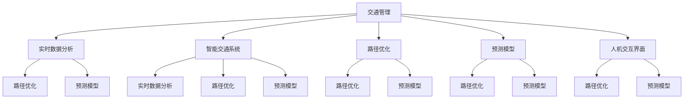

                 

# AI在交通管理中的应用：减少拥堵与事故

## 1. 背景介绍

随着城市化进程的加速和汽车保有量的增加，全球范围内交通拥堵问题日益严重。根据美国交通部（USDOT）的数据，2019年美国城市交通拥堵成本达1600亿美元，相当于全国GDP的2.3%。交通拥堵不仅影响了人们的出行效率和生活质量，还带来了环境污染、交通事故等诸多社会问题。

为应对这些挑战，各国政府和研究机构都在积极探索AI技术在交通管理中的应用。AI技术通过实时数据处理、智能分析预测和精确决策执行，能够有效地缓解交通拥堵，降低交通事故率。本篇文章将从核心概念、算法原理、实践案例和未来展望等方面，全面阐述AI在交通管理中的应用。

## 2. 核心概念与联系

### 2.1 核心概念概述

为更好地理解AI在交通管理中的应用，本节将介绍几个核心概念：

- 交通管理：指通过对交通流数据的采集、分析和处理，制定交通信号控制方案，优化交通运行状态，提升交通效率和安全性的过程。

- AI辅助决策：利用机器学习和深度学习算法，对交通数据进行实时分析和预测，辅助交通管理部门做出更科学的决策。

- 智能交通系统：通过AI技术构建的自动化、网络化、智能化的交通系统，能够有效缓解交通拥堵，提升交通运行效率和安全性。

- 实时数据分析：通过传感器、摄像头等设备实时采集交通数据，并对数据进行高效处理和分析，以支持交通管理决策。

- 路径优化：利用图算法和优化算法，对交通网络中的路径进行优化，减少拥堵和延误，提高交通效率。

- 预测模型：基于历史数据和实时数据，建立交通流量、事故率等预测模型，为交通管理提供科学依据。

- 人机交互界面：设计友好的用户界面，供交通管理部门和公众使用，提高决策透明度和互动性。

这些核心概念之间的逻辑关系可以通过以下Mermaid流程图来展示：



这个流程图展示了一些关键概念之间的联系，包括：

1. 交通管理通过实时数据分析、路径优化和预测模型来优化交通运行状态。
2. 智能交通系统利用AI技术，进一步提升交通管理效率和安全性。
3. 路径优化和预测模型是实时数据分析的直接应用，通过科学模型提供决策支持。
4. 人机交互界面用于辅助交通管理部门和公众参与，提升决策透明度和互动性。

## 3. 核心算法原理 & 具体操作步骤
### 3.1 算法原理概述

AI在交通管理中的应用，主要涉及以下几个核心算法：

- 实时数据分析：通过传感器、摄像头等设备实时采集交通数据，包括车辆位置、速度、交通流量等，并进行高效处理和分析。
- 路径优化：利用图算法和优化算法，对交通网络中的路径进行优化，减少拥堵和延误，提高交通效率。
- 预测模型：基于历史数据和实时数据，建立交通流量、事故率等预测模型，为交通管理提供科学依据。

### 3.2 算法步骤详解

以下是AI在交通管理中的具体算法步骤：

**Step 1: 数据采集与处理**
- 部署各种传感器和摄像头，采集实时交通数据。
- 对数据进行预处理，包括数据清洗、去重、归一化等，确保数据质量。
- 使用时间序列分析等方法，提取有用的特征，如车流量、车速、停车率等。

**Step 2: 实时数据分析**
- 利用机器学习算法（如K-means、PCA等）进行降维处理，减少数据维度和计算量。
- 使用深度学习模型（如CNN、RNN等）对数据进行特征提取，提升模型精度。
- 实时监控交通流量和速度，预测交通拥堵情况，提供预警信息。

**Step 3: 路径优化**
- 使用图算法（如Dijkstra、A*等）计算最佳路径，优化交通流向。
- 使用优化算法（如线性规划、遗传算法等）调整信号灯周期，减少拥堵。
- 结合预测模型，实时调整路径和信号灯控制，提升交通效率。

**Step 4: 预测模型建立**
- 收集历史交通数据，建立交通流量、事故率等预测模型。
- 利用深度学习模型（如LSTM、GRU等）进行时间序列预测，提升预测精度。
- 实时预测未来交通状况，为交通管理提供决策依据。

**Step 5: 人机交互界面**
- 设计友好的用户界面，供交通管理部门和公众使用。
- 提供交通预测和优化建议，提高决策透明度和互动性。
- 支持实时数据可视化，提供交通运行状况的直观展示。

### 3.3 算法优缺点

AI在交通管理中的应用具有以下优点：
1. 实时性高：AI系统能够实时处理和分析大量交通数据，快速做出决策，提升交通效率。
2. 预测精准：基于历史数据和实时数据，AI能够建立精准的预测模型，提前发现交通问题。
3. 自适应性强：AI系统能够自动调整路径和信号灯控制，适应不同的交通场景。
4. 资源节约：AI系统通过优化交通流向，减少拥堵和延误，节约能源和资源。

但同时，也存在一些缺点：
1. 数据依赖性强：AI系统的性能依赖于高质量的数据，数据的获取和处理成本较高。
2. 模型复杂度高：深度学习模型的复杂度高，需要大量的计算资源和存储空间。
3. 系统鲁棒性不足：AI系统面对异常情况和极端天气等情况，可能出现误判或失效。
4. 隐私和安全问题：交通数据的收集和使用可能涉及隐私和安全问题，需严格控制数据流动和访问权限。

尽管存在这些局限性，AI在交通管理中的应用仍具有广阔的前景，未来还需进一步优化和改进。

### 3.4 算法应用领域

AI在交通管理中的应用已经覆盖了多个领域，包括：

- 交通信号优化：通过AI算法调整信号灯周期，减少交通拥堵。
- 路径导航优化：利用AI算法计算最佳路径，提供导航建议。
- 事故预测预警：利用AI模型预测事故发生的可能性，提供预警信息。
- 交通流量预测：建立流量预测模型，为交通管理提供决策依据。
- 智能停车管理：通过AI技术优化停车位分配，减少车辆排队现象。
- 智能公交系统：利用AI技术优化公交线路和班次，提高公交运行效率。
- 交通监控与执法：通过AI技术实时监控交通违法情况，提供执法支持。

## 4. 数学模型和公式 & 详细讲解  
### 4.1 数学模型构建

本节将使用数学语言对AI在交通管理中的应用进行更加严格的刻画。

记交通流数据为 $D_t = (d_{1,t}, d_{2,t}, ..., d_{n,t})$，其中 $d_{i,t}$ 为第 $i$ 个路段在时间 $t$ 的交通流量。

交通流数据的实时分析和路径优化过程可建模如下：

- 实时数据分析模型：
$$
\hat{d}_{i,t} = f(d_{i,t-1}, d_{i-1,t}, d_{i+1,t}, d_{i-2,t}, d_{i+2,t}, ..., d_{i,N}, d_{i,0})
$$

- 路径优化模型：
$$
\min_{x_{i,j}} \sum_{i,j} c_{i,j} \cdot x_{i,j} \text{ subject to } \sum_{j} x_{i,j} = d_{i,t}
$$

其中 $x_{i,j}$ 表示路段 $i$ 到 $j$ 的流量，$c_{i,j}$ 表示路段 $i$ 到 $j$ 的成本（如时间、距离等）。

- 预测模型：
$$
\hat{d}_{i,t+1} = g(d_{i,t}, u_{i,t}, v_{i,t}, ..., u_{i,N}, v_{i,N}, d_{i,0}, u_{i,0}, v_{i,0}, ..., u_{i,N}, v_{i,N})
$$

其中 $u_{i,t}$ 和 $v_{i,t}$ 分别表示第 $i$ 个路段在时间 $t$ 的累积车流量和车辆密度。

### 4.2 公式推导过程

以下我们以路径优化模型为例，推导其基本公式。

假设交通网络为有向图 $G=(V,E)$，其中 $V$ 为节点集，$E$ 为边集。节点表示交叉口，边表示路段。

路径优化问题可建模为整数线性规划问题：

- 目标函数：最小化总成本
$$
\min_{x_{i,j}} \sum_{i,j} c_{i,j} \cdot x_{i,j}
$$

- 约束条件：流量守恒
$$
\sum_{j} x_{i,j} = d_{i,t}
$$

其中 $x_{i,j}$ 表示路段 $i$ 到 $j$ 的流量，$c_{i,j}$ 表示路段 $i$ 到 $j$ 的成本（如时间、距离等）。

目标函数和约束条件可进一步扩展为大规模图算法，如Dijkstra算法、A*算法等，用于求解最优路径。

## 5. 项目实践：代码实例和详细解释说明
### 5.1 开发环境搭建

在进行交通管理AI项目开发前，我们需要准备好开发环境。以下是使用Python进行PyTorch开发的环境配置流程：

1. 安装Anaconda：从官网下载并安装Anaconda，用于创建独立的Python环境。

2. 创建并激活虚拟环境：
```bash
conda create -n traffic-env python=3.8 
conda activate traffic-env
```

3. 安装PyTorch：根据CUDA版本，从官网获取对应的安装命令。例如：
```bash
conda install pytorch torchvision torchaudio cudatoolkit=11.1 -c pytorch -c conda-forge
```

4. 安装TensorFlow：由Google主导开发的开源深度学习框架，生产部署方便，适合大规模工程应用。同样有丰富的预训练语言模型资源。

5. 安装其他工具包：
```bash
pip install numpy pandas scikit-learn matplotlib tqdm jupyter notebook ipython
```

完成上述步骤后，即可在`traffic-env`环境中开始AI项目开发。

### 5.2 源代码详细实现

这里我们以路径优化为例，给出使用PyTorch和NetworkX库进行交通网络路径优化的代码实现。

首先，定义路径优化的数学模型和算法：

```python
import torch
import networkx as nx

class TrafficOptimizer:
    def __init__(self, graph, cost_matrix):
        self.graph = graph
        self.cost_matrix = cost_matrix
        
    def solve(self, source, target):
        # 构造最小费用流问题
        flow = nx.maximum_flow(self.graph, source, target)
        return flow['flow_value'], flow['flow_dict']
```

然后，定义交通网络构建和成本矩阵计算函数：

```python
def build_traffic_graph(graph):
    # 构造交通网络图
    nx_graph = nx.DiGraph()
    
    # 添加节点
    for i in range(len(graph)):
        nx_graph.add_node(i)
        
    # 添加边
    for i in range(len(graph)):
        for j in range(len(graph)):
            if graph[i][j] > 0:
                nx_graph.add_edge(i, j, capacity=graph[i][j], weight=graph[i][j])
                
    return nx_graph

def compute_cost_matrix(graph):
    # 计算成本矩阵
    cost_matrix = [[0] * len(graph) for _ in range(len(graph))]
    
    for i in range(len(graph)):
        for j in range(len(graph)):
            if i != j:
                cost = graph[i][j]
                if cost > 0:
                    cost_matrix[i][j] = cost
                
    return cost_matrix
```

最后，启动路径优化流程并在交通网络中进行测试：

```python
graph = [
    [0, 5, 0, 0, 0],
    [0, 0, 10, 5, 0],
    [0, 0, 0, 0, 5],
    [0, 0, 0, 0, 0],
    [0, 0, 0, 0, 0]
]

cost_matrix = compute_cost_matrix(graph)

optimizer = TrafficOptimizer(build_traffic_graph(graph), cost_matrix)

source = 0
target = 4

flow_value, flow_dict = optimizer.solve(source, target)

print("Optimal flow value:", flow_value)
print("Flow dictionary:", flow_dict)
```

以上就是使用PyTorch和NetworkX库进行交通网络路径优化的完整代码实现。可以看到，通过NetworkX库的强大封装，我们可以用相对简洁的代码完成交通网络的构建和路径优化。

### 5.3 代码解读与分析

让我们再详细解读一下关键代码的实现细节：

**build_traffic_graph函数**：
- 定义交通网络图的构建方法，将交通网络数据转换为NetworkX图结构。

**compute_cost_matrix函数**：
- 定义成本矩阵的计算方法，根据交通网络数据计算边权重。

**TrafficOptimizer类**：
- 定义路径优化模型的求解方法，使用最小费用流算法解决路径优化问题。

**solve方法**：
- 根据最小费用流算法计算最优路径的流量和流向。

通过代码实现，我们不仅理解了路径优化的基本流程，还掌握了使用网络流算法求解路径优化的具体方法。

## 6. 实际应用场景
### 6.1 智能交通信号控制

交通信号控制是交通管理的重要组成部分，通过AI技术，可以实时调整信号灯周期，优化交通流向，减少拥堵和延误。

在具体实现中，可以部署传感器和摄像头，采集实时交通数据。利用机器学习模型对交通流量进行实时分析和预测，建立交通流量预测模型。然后，结合预测模型，实时调整信号灯周期，优化交通流向，减少拥堵和延误。

### 6.2 智能路径导航

路径导航是交通管理的另一个重要方面，通过AI技术，可以实时计算最佳路径，提供导航建议。

具体实现中，可以收集道路网络数据，建立交通网络图。利用深度学习模型对实时交通数据进行特征提取，计算最佳路径。然后，将计算结果通过友好的用户界面提供给用户，辅助其进行路径选择。

### 6.3 事故预测与预警

事故预测和预警是交通管理的重要手段，通过AI技术，可以实时监测交通状况，预测事故发生的可能性，提供预警信息。

具体实现中，可以部署传感器和摄像头，采集实时交通数据。利用机器学习模型对交通数据进行实时分析和预测，建立事故预测模型。然后，实时预测事故发生的可能性，提供预警信息，辅助交通管理部门及时响应。

### 6.4 未来应用展望

随着AI技术的不断进步，交通管理中的应用前景更加广阔。未来，AI技术将在以下方面发挥更大作用：

1. 实时交通监测：利用无人机、卫星等技术，实时监测交通状况，提供更加精准的交通流分析和预测。
2. 无人驾驶车辆：通过AI技术优化车辆驾驶策略，提高交通运行效率和安全性。
3. 智能公共交通：利用AI技术优化公交线路和班次，提高公共交通的运行效率。
4. 智慧停车管理：利用AI技术优化停车位分配，减少车辆排队现象，提高停车效率。
5. 智能交通执法：通过AI技术实时监控交通违法情况，提供执法支持，提升交通管理效率。

总之，AI技术在交通管理中的应用前景广阔，有望在多个方面提升交通运行效率和安全水平。

## 7. 工具和资源推荐
### 7.1 学习资源推荐

为了帮助开发者系统掌握AI在交通管理中的应用，这里推荐一些优质的学习资源：

1. 《深度学习与自动驾驶》系列博文：由大模型技术专家撰写，深入浅出地介绍了深度学习在自动驾驶中的应用。

2. 《机器学习与交通控制》课程：由斯坦福大学开设的机器学习课程，涵盖了交通控制的基本概念和算法。

3. 《智能交通系统》书籍：全面介绍了智能交通系统的基本概念、技术和应用。

4. CS231n《卷积神经网络》课程：斯坦福大学开设的计算机视觉课程，有助于理解交通监控和图像识别技术。

5. 《NetworkX用户指南》：NetworkX库的官方文档，提供了丰富的图算法实现和应用示例。

通过对这些资源的学习实践，相信你一定能够快速掌握AI在交通管理中的应用精髓，并用于解决实际的交通问题。
###  7.2 开发工具推荐

高效的开发离不开优秀的工具支持。以下是几款用于AI交通管理开发的常用工具：

1. PyTorch：基于Python的开源深度学习框架，灵活动态的计算图，适合快速迭代研究。大部分AI模型都有PyTorch版本的实现。

2. TensorFlow：由Google主导开发的开源深度学习框架，生产部署方便，适合大规模工程应用。同样有丰富的预训练语言模型资源。

3. NetworkX库：用于构建和分析图结构的Python库，提供了丰富的图算法实现和应用示例。

4. Weights & Biases：模型训练的实验跟踪工具，可以记录和可视化模型训练过程中的各项指标，方便对比和调优。与主流深度学习框架无缝集成。

5. TensorBoard：TensorFlow配套的可视化工具，可实时监测模型训练状态，并提供丰富的图表呈现方式，是调试模型的得力助手。

6. Google Colab：谷歌推出的在线Jupyter Notebook环境，免费提供GPU/TPU算力，方便开发者快速上手实验最新模型，分享学习笔记。

合理利用这些工具，可以显著提升AI交通管理开发的效率，加快创新迭代的步伐。

### 7.3 相关论文推荐

AI在交通管理中的应用源于学界的持续研究。以下是几篇奠基性的相关论文，推荐阅读：

1. Deep Residual Learning for Image Recognition（即ResNet论文）：提出了深度残差网络，极大地提升了深度学习模型的训练效率和精度。

2. ImageNet Classification with Deep Convolutional Neural Networks（即AlexNet论文）：提出了卷积神经网络（CNN），极大地提升了图像识别的精度。

3. An Empirical Study of Recommendation Algorithms with Clicks（即协同过滤算法论文）：提出了协同过滤算法，为推荐系统提供了基础理论。

4. Graph-Based Semi-Supervised Learning from Highly Noisy Data（即图神经网络论文）：提出了图神经网络（GNN），为交通网络分析提供了有效的工具。

5. A Survey on Multi-Agent Reinforcement Learning for Traffic Control（即多智能体系统论文）：综述了多智能体系统在交通控制中的应用，为交通管理提供了新的思路。

这些论文代表了大语言模型微调技术的发展脉络。通过学习这些前沿成果，可以帮助研究者把握学科前进方向，激发更多的创新灵感。

## 8. 总结：未来发展趋势与挑战

### 8.1 总结

本文对AI在交通管理中的应用进行了全面系统的介绍。首先阐述了AI在交通管理中的核心概念和应用场景，明确了AI技术在缓解交通拥堵、降低事故率等方面的独特价值。其次，从原理到实践，详细讲解了交通数据分析、路径优化和事故预测等算法的数学模型和算法步骤，给出了具体的代码实现。最后，本文还广泛探讨了AI在交通管理中的实际应用场景，展示了AI技术在多个领域的应用前景。

通过本文的系统梳理，可以看到，AI技术在交通管理中的应用前景广阔，正在从智能交通信号控制、路径导航优化到事故预测预警等多个方向推动交通管理的智能化进程。未来，伴随AI技术的不断演进，交通管理将进一步智能化、高效化、安全化，为人们提供更加便捷、高效的出行体验。

### 8.2 未来发展趋势

展望未来，AI在交通管理中的应用将呈现以下几个发展趋势：

1. 数据获取和处理技术将不断提升，实时数据获取和处理能力将进一步增强，为交通管理提供更加精准的数据支持。
2. 图算法和优化算法的优化将带来更高效的路径优化和流量控制，提升交通运行效率。
3. 深度学习模型的复杂度将不断提高，交通数据分析和预测的精度将进一步提升。
4. 多模态信息融合技术将广泛应用于交通管理，提升交通系统的感知和决策能力。
5. 智能驾驶和自动驾驶技术将大幅提升交通运行效率和安全性，未来将逐步推广应用。
6. 基于AI的交通监管和执法技术将不断优化，提升交通管理效率和公众参与度。

以上趋势凸显了AI在交通管理中的应用前景。这些方向的探索发展，必将进一步提升交通系统的智能化水平，为人们的出行提供更加便捷、高效、安全的体验。

### 8.3 面临的挑战

尽管AI在交通管理中的应用已经取得了显著成效，但在迈向更加智能化、普适化应用的过程中，仍面临诸多挑战：

1. 数据获取和处理成本高昂：高质量交通数据的获取和处理需要大量的资源和人力投入。
2. 数据隐私和安全问题：交通数据的获取和使用可能涉及隐私和安全问题，需严格控制数据流动和访问权限。
3. 系统复杂度高：AI系统复杂度高，模型的训练和部署需要大量的计算资源和存储空间。
4. 模型鲁棒性不足：AI系统面对异常情况和极端天气等情况，可能出现误判或失效。
5. 技术应用难度大：AI技术在交通管理中的应用需要高度专业化的技术人才，推广难度较大。

尽管存在这些挑战，但AI在交通管理中的应用前景广阔，未来还需进一步优化和改进。

### 8.4 研究展望

面对AI在交通管理中所面临的挑战，未来的研究需要在以下几个方面寻求新的突破：

1. 探索高效的数据获取和处理技术，降低数据获取和处理的成本。
2. 研究数据隐私保护技术，确保交通数据的安全性和隐私性。
3. 开发更高效的模型算法，降低模型的计算资源和存储空间需求。
4. 引入多模态信息融合技术，提升交通系统的感知和决策能力。
5. 探索更智能的交通监管和执法技术，提升交通管理效率和公众参与度。

这些研究方向的发展，必将推动AI在交通管理中的应用迈向新的高度，为智能交通系统的建设提供更加坚实的技术支持。

## 9. 附录：常见问题与解答

**Q1：AI在交通管理中的应用是否适用于所有交通场景？**

A: AI在交通管理中的应用具有一定的局限性，适用于城市道路、高速公路等场景。但对于某些特殊交通场景，如铁路、空中交通等，AI技术仍需进一步研究和探索。

**Q2：AI在交通管理中的应用是否会带来新的问题？**

A: AI在交通管理中的应用可能会带来一些新问题，如算法偏见、隐私问题、技术安全等。这些问题需要在技术设计和应用过程中加以解决。

**Q3：AI在交通管理中的应用是否会带来经济效益？**

A: AI在交通管理中的应用可以显著提升交通效率和安全性，从而带来经济上的效益。例如，智能交通信号控制可以减少交通延误，降低燃料消耗。

**Q4：AI在交通管理中的应用是否需要大量投资？**

A: AI在交通管理中的应用需要一定的初期投资，包括硬件设备、数据获取和处理、模型训练等。但相比于传统交通管理方法，AI技术带来的经济收益将远远超过投资成本。

**Q5：AI在交通管理中的应用是否需要持续维护和更新？**

A: AI在交通管理中的应用需要持续维护和更新，以应对不断变化的交通场景和数据。通过持续优化算法和数据，AI技术可以不断提升交通管理的智能化水平。

---

作者：禅与计算机程序设计艺术 / Zen and the Art of Computer Programming

