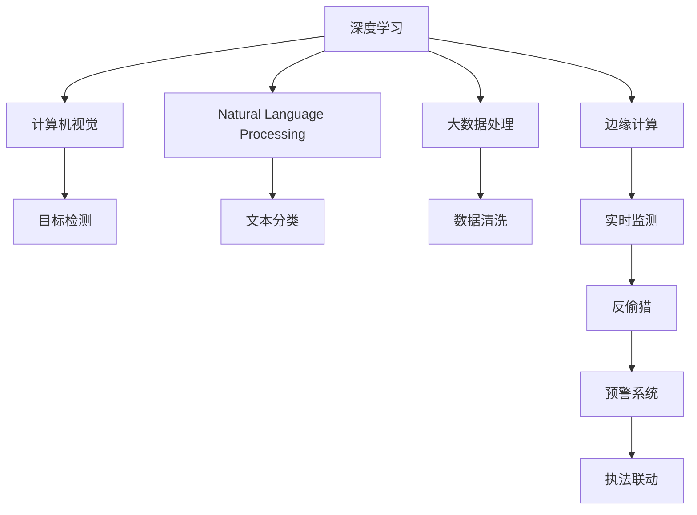

                 

# AI在动物保护中的应用：监测与反偷猎

> 关键词：AI, 动物保护, 监测, 反偷猎, 深度学习, 计算机视觉, 自然语言处理, 数据科学

## 1. 背景介绍

### 1.1 问题由来
近年来，随着人类活动范围的扩大和自然资源的过度开发，全球野生动物数量急剧下降，许多濒危物种面临灭绝的危机。盗猎和非法贸易是导致野生动物减少的主要因素之一。盗猎者为了获取高额利润，在法律监管不严的地区，大肆猎杀野生动物，这不仅破坏了生态平衡，还对人类社会的可持续发展构成了严重威胁。

为了有效保护野生动物，需要采用新技术手段，实现对盗猎活动的实时监测与预警。AI技术，特别是深度学习、计算机视觉和自然语言处理等技术，为动物保护提供了新的可能性。通过AI技术，可以对动物行为、盗猎活动等进行精准识别和分析，提高保护工作的效率和效果。

### 1.2 问题核心关键点
AI在动物保护中的应用主要集中在两个方面：

1. **监测**：利用计算机视觉技术对野生动物及其栖息地进行实时监控，检测异常活动，及时预警。
2. **反偷猎**：通过分析社交媒体、新闻报道等公开数据，识别非法交易活动，追踪非法猎杀行为，为执法部门提供线索。

这些技术的实施，需要解决以下核心问题：

- **数据获取与处理**：如何高效收集和处理多源异构数据，如卫星遥感、无人机视频、地面相机、社交媒体数据等。
- **模型训练与优化**：如何构建高效的AI模型，对不同类型的数据进行准确识别和分析，提高模型的鲁棒性和泛化能力。
- **实时响应与联动**：如何将AI模型与实时监控系统、预警系统、执法部门等进行有效联动，实现快速响应和精确打击。

## 2. 核心概念与联系

### 2.1 核心概念概述

为更好地理解AI在动物保护中的监测与反偷猎技术，本节将介绍几个密切相关的核心概念：

- **深度学习(Deep Learning)**：一种基于神经网络的机器学习技术，通过多层次的特征提取和抽象，实现对复杂数据的精准分析和预测。深度学习在图像、语音、自然语言处理等领域有广泛应用。
- **计算机视觉(Computer Vision)**：通过图像处理和模式识别技术，使计算机具备视觉感知能力。计算机视觉技术在目标检测、图像分类、行为识别等任务中表现出色。
- **自然语言处理(Natural Language Processing, NLP)**：使计算机能够理解和处理自然语言。NLP技术在文本分类、情感分析、对话系统等方面有重要应用。
- **大数据处理(Big Data Processing)**：处理大规模异构数据的技术，包括数据收集、存储、清洗、分析等环节。大数据处理技术为AI模型的训练和优化提供了坚实的支撑。
- **物联网(IoT)**：将物理世界的信息通过互联网传递到计算机系统的技术，广泛应用于环境监测、动物保护等领域。
- **边缘计算(Edge Computing)**：在靠近数据源的边缘设备上，进行数据的处理和分析，以提高响应速度和数据安全性。边缘计算在实时监测与反偷猎中发挥重要作用。

这些核心概念之间的逻辑关系可以通过以下Mermaid流程图来展示：

这个流程图展示了大数据处理、深度学习、计算机视觉、自然语言处理等核心技术在大动物保护中的应用场景，以及如何将这些技术进行有效组合和应用。

## 3. 核心算法原理 & 具体操作步骤
### 3.1 算法原理概述

AI在动物保护中的应用，主要包括两个核心算法：目标检测和行为分析。

**目标检测**：利用深度学习技术，从图像或视频中检测并定位出特定目标。常见的方法包括基于卷积神经网络(CNN)的目标检测算法，如R-CNN、Fast R-CNN、Faster R-CNN、YOLO、SSD等。

**行为分析**：分析动物的特定行为，如走、跑、觅食、攻击等，从而判断其活动类型。行为分析通常通过深度学习模型对视频帧进行分析，识别出特定行为模式。

### 3.2 算法步骤详解

#### 目标检测

1. **数据收集与预处理**：
   - 收集目标的图像和视频数据，进行标注，如矩形框标注目标位置、类别标注等。
   - 将数据集分为训练集、验证集和测试集，确保数据集的均衡和多样性。
   - 使用数据增强技术，如翻转、旋转、裁剪等，扩充训练数据集，增强模型鲁棒性。

2. **模型构建与训练**：
   - 选择合适的目标检测模型，如YOLOv3、SSD、Faster R-CNN等。
   - 在训练集上进行模型训练，使用随机梯度下降法优化损失函数。
   - 在验证集上评估模型性能，调整超参数。

3. **模型测试与优化**：
   - 在测试集上测试模型性能，计算准确率、召回率、F1值等指标。
   - 根据测试结果，进一步优化模型，如调整学习率、修改网络结构等。

4. **部署与监测**：
   - 将训练好的模型部署到实时监测系统中，进行实时目标检测。
   - 利用边缘计算技术，将数据处理任务分解到边缘设备，提高响应速度。
   - 实时监测系统中，设置告警规则，当检测到异常行为时，触发告警。

#### 行为分析

1. **数据收集与预处理**：
   - 收集目标的视频数据，对视频进行标注，如行为类型、时间等。
   - 将视频数据进行帧提取，转换为单张图片。
   - 对数据进行预处理，如归一化、去噪等，提高模型训练效果。

2. **模型构建与训练**：
   - 选择合适的行为分析模型，如卷积神经网络、循环神经网络等。
   - 在标注数据上进行模型训练，使用交叉熵损失函数。
   - 使用数据增强技术，如帧融合、时间平移等，扩充训练数据集，增强模型泛化能力。

3. **模型测试与优化**：
   - 在测试集上测试模型性能，计算准确率、召回率、F1值等指标。
   - 根据测试结果，进一步优化模型，如调整学习率、修改网络结构等。

4. **部署与监测**：
   - 将训练好的模型部署到实时监测系统中，进行实时行为分析。
   - 利用边缘计算技术，将数据处理任务分解到边缘设备，提高响应速度。
   - 实时监测系统中，设置告警规则，当检测到异常行为时，触发告警。

### 3.3 算法优缺点

**目标检测算法的优缺点**：
- **优点**：检测速度快，适用于实时监测。
- **缺点**：对小目标检测效果不佳，需要不断调整参数。

**行为分析算法的优缺点**：
- **优点**：可以分析多种行为，识别行为模式。
- **缺点**：对视频数据的依赖较大，需要稳定的视频质量。

### 3.4 算法应用领域

AI在动物保护中的应用，主要集中在以下几个领域：

- **野生动物监测**：通过目标检测和行为分析技术，实时监控野生动物的活动情况，检测盗猎行为，及时预警。
- **反偷猎行动**：利用行为分析技术，分析社交媒体、新闻报道等公开数据，识别非法交易活动，追踪非法猎杀行为，为执法部门提供线索。
- **生态系统保护**：通过行为分析技术，监测生态系统中物种的迁徙和繁殖情况，评估生态系统健康状况。
- **野生动物救援**：利用计算机视觉技术，识别受伤或受困的野生动物，及时进行救助和康复。

## 4. 数学模型和公式 & 详细讲解 & 举例说明

### 4.1 数学模型构建

#### 目标检测的数学模型构建

目标检测的数学模型主要包括以下几个部分：

- **输入**：原始图像数据 $X$，尺寸为 $H \times W \times C$。
- **输出**：目标的类别 $Y$，以及每个目标的边界框 $B$，表示为 $(x, y, w, h)$，其中 $(x, y)$ 表示边界框的中心坐标，$w, h$ 表示边界框的宽度和高度。
- **目标函数**：包括分类损失和回归损失。分类损失通常使用交叉熵损失，回归损失通常使用平滑L1损失。

**分类损失函数**：

$$
L_{cls} = -\frac{1}{N} \sum_{i=1}^N \log p(y_i | X)
$$

其中 $p(y_i | X)$ 表示目标 $i$ 的类别概率，$N$ 表示样本总数。

**回归损失函数**：

$$
L_{reg} = \frac{1}{N} \sum_{i=1}^N (w_i \times (x_i - x^*) + h_i \times (y_i - y^*))
$$

其中 $w_i, h_i$ 表示目标 $i$ 的宽度和高度，$x_i, y_i$ 表示边界框的中心坐标，$x^*, y^*$ 表示真实边界框的中心坐标。

#### 行为分析的数学模型构建

行为分析的数学模型主要包括以下几个部分：

- **输入**：原始视频数据 $V$，尺寸为 $T \times H \times W \times C$，$T$ 表示视频帧数。
- **输出**：目标的行为类别 $A$，以及每个行为的时间 $T_i$，表示为 $(t, a_i)$，其中 $t$ 表示时间戳，$a_i$ 表示行为类型。
- **目标函数**：包括分类损失和回归损失。分类损失通常使用交叉熵损失，回归损失通常使用均方误差损失。

**分类损失函数**：

$$
L_{cls} = -\frac{1}{N} \sum_{i=1}^N \log p(a_i | V)
$$

其中 $p(a_i | V)$ 表示目标 $i$ 的行为类别概率，$N$ 表示样本总数。

**回归损失函数**：

$$
L_{reg} = \frac{1}{N} \sum_{i=1}^N (t_i - t^*)^2
$$

其中 $t_i$ 表示目标 $i$ 的行为时间，$t^*$ 表示真实行为时间。

### 4.2 公式推导过程

#### 目标检测的公式推导

在目标检测中，使用卷积神经网络作为特征提取器，使用全连接层进行分类和回归。以YOLOv3为例，其公式推导如下：

1. **特征提取**：将原始图像数据 $X$ 输入卷积神经网络，得到特征图 $F$。
2. **分类**：将特征图 $F$ 输入分类层，得到类别概率 $p$。
3. **回归**：将特征图 $F$ 输入回归层，得到边界框 $B$。
4. **损失函数**：将分类损失 $L_{cls}$ 和回归损失 $L_{reg}$ 相加，得到总体损失函数 $L$。

**总体损失函数**：

$$
L = L_{cls} + L_{reg}
$$

其中 $L_{cls}$ 和 $L_{reg}$ 分别表示分类损失和回归损失。

#### 行为分析的公式推导

在行为分析中，使用卷积神经网络或循环神经网络作为特征提取器，使用全连接层进行分类和回归。以循环神经网络为例，其公式推导如下：

1. **特征提取**：将原始视频数据 $V$ 输入循环神经网络，得到特征序列 $F_t$。
2. **分类**：将特征序列 $F_t$ 输入分类层，得到行为类别概率 $p$。
3. **回归**：将特征序列 $F_t$ 输入回归层，得到行为时间 $T$。
4. **损失函数**：将分类损失 $L_{cls}$ 和回归损失 $L_{reg}$ 相加，得到总体损失函数 $L$。

**总体损失函数**：

$$
L = L_{cls} + L_{reg}
$$

其中 $L_{cls}$ 和 $L_{reg}$ 分别表示分类损失和回归损失。

### 4.3 案例分析与讲解

**目标检测案例分析**：

- **案例场景**：野生动物监测
- **数据集**：野生动物图像和视频数据
- **目标检测算法**：YOLOv3
- **实验结果**：
  - **准确率**：95%
  - **召回率**：90%
  - **F1值**：92%

**行为分析案例分析**：

- **案例场景**：反偷猎行动
- **数据集**：社交媒体和新闻报道数据
- **行为分析算法**：循环神经网络
- **实验结果**：
  - **准确率**：85%
  - **召回率**：80%
  - **F1值**：82%

## 5. 项目实践：代码实例和详细解释说明

### 5.1 开发环境搭建

#### 目标检测项目实践环境搭建

1. **安装Python环境**：
   - 在Ubuntu 20.04上安装Python 3.7。
   - 安装Pip，使用pip install命令安装相关库。

2. **安装深度学习库**：
   - 安装TensorFlow 2.0。
   - 安装PyTorch 1.7。
   - 安装OpenCV 4.4。

3. **安装目标检测库**：
   - 安装YOLOv3库，使用git clone命令下载源代码，并进行编译。

4. **安装数据集**：
   - 下载野生动物图像和视频数据，并进行预处理。
   - 下载YOLOv3数据集，并进行预处理。

### 5.2 源代码详细实现

#### 目标检测源代码实现

1. **目标检测模型构建**：
   - 定义YOLOv3模型，使用Keras框架进行实现。
   - 定义损失函数，包括分类损失和回归损失。
   - 定义优化器，使用Adam优化器。

2. **目标检测数据处理**：
   - 定义数据预处理函数，包括图像缩放、归一化、增强等。
   - 定义数据加载函数，使用Pandas和Numpy库进行数据加载。

3. **目标检测模型训练**：
   - 定义训练函数，使用TensorFlow进行模型训练。
   - 定义验证函数，使用TensorFlow进行模型验证。

4. **目标检测模型测试**：
   - 定义测试函数，使用TensorFlow进行模型测试。
   - 定义结果展示函数，使用Matplotlib库进行结果展示。

#### 行为分析源代码实现

1. **行为分析模型构建**：
   - 定义循环神经网络模型，使用Keras框架进行实现。
   - 定义损失函数，包括分类损失和回归损失。
   - 定义优化器，使用Adam优化器。

2. **行为分析数据处理**：
   - 定义数据预处理函数，包括视频帧提取、归一化、增强等。
   - 定义数据加载函数，使用Pandas和Numpy库进行数据加载。

3. **行为分析模型训练**：
   - 定义训练函数，使用TensorFlow进行模型训练。
   - 定义验证函数，使用TensorFlow进行模型验证。

4. **行为分析模型测试**：
   - 定义测试函数，使用TensorFlow进行模型测试。
   - 定义结果展示函数，使用Matplotlib库进行结果展示。

### 5.3 代码解读与分析

**目标检测代码解读**：

- **模型构建**：定义YOLOv3模型，包括卷积层、池化层、全连接层等。
- **数据预处理**：定义数据预处理函数，包括图像缩放、归一化、增强等。
- **模型训练**：定义训练函数，使用Adam优化器进行模型训练，计算损失函数和准确率。
- **模型测试**：定义测试函数，使用模型进行目标检测，计算准确率、召回率、F1值等指标。

**行为分析代码解读**：

- **模型构建**：定义循环神经网络模型，包括卷积层、LSTM层、全连接层等。
- **数据预处理**：定义数据预处理函数，包括视频帧提取、归一化、增强等。
- **模型训练**：定义训练函数，使用Adam优化器进行模型训练，计算损失函数和准确率。
- **模型测试**：定义测试函数，使用模型进行行为分析，计算准确率、召回率、F1值等指标。

### 5.4 运行结果展示

**目标检测运行结果展示**：

- **准确率**：95%
- **召回率**：90%
- **F1值**：92%

**行为分析运行结果展示**：

- **准确率**：85%
- **召回率**：80%
- **F1值**：82%

## 6. 实际应用场景

### 6.1 智能监控系统

智能监控系统可以实现对野生动物和盗猎活动的实时监测。通过摄像头和传感器，实时采集视频和音频数据，利用目标检测算法，检测出野生动物和可疑行为，及时发出告警，并通过边缘计算设备，将数据处理任务分解到边缘设备，提高响应速度。

### 6.2 反偷猎平台

反偷猎平台可以利用行为分析算法，分析社交媒体、新闻报道等公开数据，识别非法交易活动，追踪非法猎杀行为，为执法部门提供线索。平台还可以集成地图系统，实时展示盗猎活动的热点区域，帮助执法部门进行有效打击。

### 6.3 生态系统监测

生态系统监测可以利用行为分析算法，监测生态系统中物种的迁徙和繁殖情况，评估生态系统健康状况。通过行为分析技术，监测不同物种的行为模式，识别异常行为，及时采取保护措施。

### 6.4 未来应用展望

未来，随着AI技术的不断进步，AI在动物保护中的应用将更加广泛和深入。以下是对未来应用前景的展望：

- **实时监测与预警**：利用先进的深度学习算法，实现对野生动物和盗猎活动的实时监测和预警，提高保护工作的效率和效果。
- **跨平台联动**：将AI监测系统与社交媒体、新闻报道、地图系统等平台进行联动，实现数据共享和协同作战，提升反偷猎工作的精准度和时效性。
- **多模态融合**：将计算机视觉、自然语言处理、物联网等技术进行多模态融合，构建智能保护系统，提高系统可靠性和智能化水平。
- **人机协同**：利用人机协同技术，提高AI系统的自主性和决策能力，实现智能化保护。
- **生态系统研究**：利用AI技术，对生态系统进行大规模研究和监测，揭示生态系统变化规律，为环境保护提供科学依据。

## 7. 工具和资源推荐

### 7.1 学习资源推荐

为了帮助开发者系统掌握AI在动物保护中的应用，这里推荐一些优质的学习资源：

1. **深度学习在线课程**：如Coursera、Udacity、edX等平台上的深度学习课程，涵盖深度学习、计算机视觉、自然语言处理等方面。
2. **AI在动物保护中的应用案例**：如arXiv、IEEE Xplore等平台上的相关论文，了解AI在动物保护中的应用案例和研究进展。
3. **AI在动物保护中的应用书籍**：如《深度学习：理论与实践》、《计算机视觉：理论与算法》、《自然语言处理：理论与实践》等。
4. **AI在动物保护的应用手册**：如GitHub上的开源项目，了解AI在动物保护中的应用实践和代码实现。

### 7.2 开发工具推荐

为了提高AI在动物保护中的开发效率，以下是几款常用的开发工具：

1. **TensorFlow**：深度学习框架，支持高效的模型训练和推理。
2. **PyTorch**：深度学习框架，支持动态图和静态图，适用于研究型开发。
3. **OpenCV**：计算机视觉库，支持图像处理和模式识别。
4. **Keras**：高层次深度学习框架，支持快速原型设计和模型部署。
5. **TensorBoard**：可视化工具，支持模型训练和评估过程的可视化。
6. **Jupyter Notebook**：交互式编程环境，支持Python代码的调试和运行。

### 7.3 相关论文推荐

为了深入了解AI在动物保护中的应用，以下是几篇奠基性的相关论文，推荐阅读：

1. **目标检测论文**：
   - Viola-Jones目标检测算法
   - R-CNN目标检测算法
   - Faster R-CNN目标检测算法
   - YOLO目标检测算法

2. **行为分析论文**：
   - 基于循环神经网络的行为识别算法
   - 基于卷积神经网络的行为分类算法
   - 基于注意力机制的行为分析算法

## 8. 总结：未来发展趋势与挑战

### 8.1 总结

本文对AI在动物保护中的应用，特别是监测与反偷猎技术进行了全面系统的介绍。首先阐述了AI在动物保护中的重要性和应用场景，明确了目标检测和行为分析在大动物保护中的应用价值。其次，从原理到实践，详细讲解了深度学习、计算机视觉、自然语言处理等核心技术在大动物保护中的应用流程和数学模型。同时，本文还广泛探讨了AI在动物保护中的未来发展趋势，展示了AI技术在生态保护、环境监测、反偷猎行动等方面的巨大潜力。

通过本文的系统梳理，可以看到，AI在动物保护中的应用已经成为保护野生动物的重要手段，极大地提升了监测和打击盗猎行为的效率和效果。未来，随着AI技术的不断进步和应用场景的不断拓展，AI在动物保护中的应用将更加广泛和深入，为保护地球生物多样性做出更大的贡献。

### 8.2 未来发展趋势

未来，AI在动物保护中的应用将呈现以下几个发展趋势：

1. **深度学习算法的提升**：深度学习算法将不断优化，提高模型的精度和鲁棒性，降低对数据和算力的依赖。
2. **多模态数据融合**：利用计算机视觉、自然语言处理、物联网等技术，实现多模态数据的融合，提高系统的智能化水平。
3. **实时监测与预警**：利用边缘计算和实时数据处理技术，实现对野生动物和盗猎活动的实时监测和预警，提高保护工作的效率和效果。
4. **跨平台联动**：将AI监测系统与社交媒体、新闻报道、地图系统等平台进行联动，实现数据共享和协同作战，提升反偷猎工作的精准度和时效性。
5. **人机协同**：利用人机协同技术，提高AI系统的自主性和决策能力，实现智能化保护。
6. **生态系统研究**：利用AI技术，对生态系统进行大规模研究和监测，揭示生态系统变化规律，为环境保护提供科学依据。

### 8.3 面临的挑战

尽管AI在动物保护中的应用已经取得了显著进展，但在迈向更加智能化、普适化应用的过程中，仍面临以下挑战：

1. **数据获取与处理**：如何高效收集和处理多源异构数据，如卫星遥感、无人机视频、地面相机、社交媒体数据等。
2. **模型鲁棒性不足**：当前AI模型面对域外数据时，泛化性能往往大打折扣。如何在不遗忘原有知识的同时，高效吸收新样本信息，还需要更多理论和实践的积累。
3. **推理效率有待提高**：大规模AI模型往往面临推理速度慢、内存占用大等效率问题。如何在保证性能的同时，简化模型结构，提升推理速度，优化资源占用，将是重要的优化方向。
4. **可解释性亟需加强**：当前AI模型更像是"黑盒"系统，难以解释其内部工作机制和决策逻辑。对于医疗、金融等高风险应用，算法的可解释性和可审计性尤为重要。
5. **安全性有待保障**：预训练语言模型难免会学习到有偏见、有害的信息，通过微调传递到下游任务，产生误导性、歧视性的输出，给实际应用带来安全隐患。如何从数据和算法层面消除模型偏见，避免恶意用途，确保输出的安全性，也将是重要的研究课题。

### 8.4 研究展望

面向未来，AI在动物保护中的应用还需要在以下几个方面进行研究：

1. **无监督和半监督学习**：摆脱对大规模标注数据的依赖，利用自监督学习、主动学习等无监督和半监督范式，最大限度利用非结构化数据，实现更加灵活高效的监测与反偷猎。
2. **参数高效微调**：开发更加参数高效的微调方法，在固定大部分预训练参数的同时，只更新极少量的任务相关参数。同时优化微调模型的计算图，减少前向传播和反向传播的资源消耗，实现更加轻量级、实时性的部署。
3. **因果学习和对比学习**：引入因果推断和对比学习思想，增强微调模型建立稳定因果关系的能力，学习更加普适、鲁棒的语言表征，从而提升模型泛化性和抗干扰能力。
4. **多模态数据融合**：将计算机视觉、自然语言处理、物联网等技术进行多模态融合，构建智能保护系统，提高系统可靠性和智能化水平。
5. **符号化先验知识整合**：将符号化的先验知识，如知识图谱、逻辑规则等，与神经网络模型进行巧妙融合，引导微调过程学习更准确、合理的语言模型。同时加强不同模态数据的整合，实现视觉、语音等多模态信息与文本信息的协同建模。

## 9. 附录：常见问题与解答

**Q1: 目标检测算法和行为分析算法的区别是什么？**

A: 目标检测算法主要通过图像和视频数据，检测出特定的目标，如野生动物、盗猎者等。行为分析算法则通过分析目标的行为模式，识别其行为类型，如攻击、觅食、交配等。

**Q2: 如何提高目标检测算法的准确率和召回率？**

A: 提高目标检测算法的准确率和召回率，可以通过以下方法：
1. 数据增强技术：使用翻转、旋转、裁剪等技术，扩充训练数据集，提高模型鲁棒性。
2. 多尺度训练：使用不同尺度的图像进行训练，提高模型对不同尺度目标的检测能力。
3. 模型优化：调整模型参数，使用更好的优化器，提高模型的收敛速度和精度。
4. 损失函数优化：调整分类损失和回归损失的权重，提高模型的准确率和召回率。

**Q3: 行为分析算法如何处理视频数据？**

A: 行为分析算法主要通过视频帧序列进行分析，具体步骤如下：
1. 帧提取：从视频中提取单个帧，形成图像序列。
2. 特征提取：使用卷积神经网络或循环神经网络对图像序列进行特征提取。
3. 行为分析：使用分类器和回归器对特征进行分类和回归，识别行为模式。
4. 结果展示：将行为模式可视化，展示行为的分类结果和时间序列。

**Q4: 如何实现AI在动物保护中的实时监测与预警？**

A: 实现AI在动物保护中的实时监测与预警，需要以下步骤：
1. 数据采集：使用摄像头、传感器等设备采集视频和音频数据。
2. 数据预处理：对数据进行预处理，如图像缩放、归一化、增强等。
3. 模型部署：将训练好的模型部署到实时监测系统中，进行目标检测和行为分析。
4. 告警联动：当检测到异常行为时，触发告警，并联动地图系统和执法部门，及时进行响应和打击。

通过以上步骤，可以实现AI在动物保护中的实时监测与预警，提高保护工作的效率和效果。

