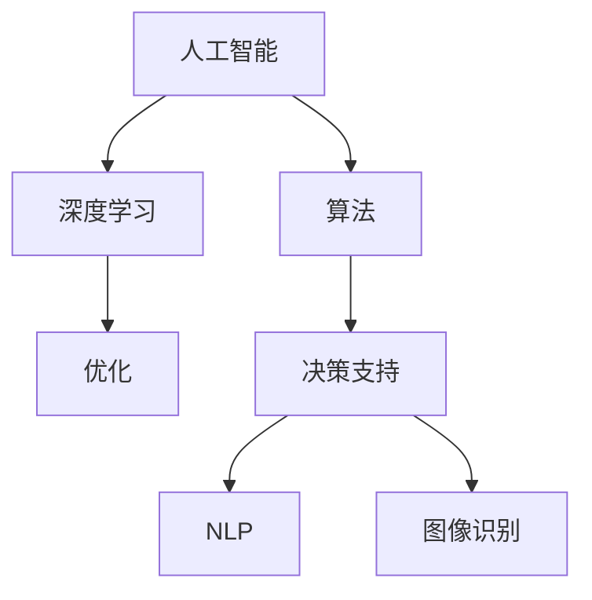

                 

# AI在复杂问题处理中的优势

> 关键词：人工智能,复杂问题,优势,算法,优化,深度学习,决策支持,自然语言处理,图像识别

## 1. 背景介绍

### 1.1 问题由来
在当今的信息爆炸时代，随着数据量的急剧增长和问题复杂性的提升，传统的基于规则和经验的人工处理方式已显得力不从心。面对诸如供应链管理、金融风险预测、医疗诊断、智能交通控制等复杂问题，人工干预不仅耗时耗力，且容易受到个人主观因素的影响。

人工智能(AI)技术的兴起，为解决这些复杂问题提供了新的可能性。AI通过学习大量的数据，挖掘出数据中的模式和规律，能够在短时间内处理大量数据，快速给出决策建议，为复杂问题的解决提供了新的思路和方法。

### 1.2 问题核心关键点
AI在处理复杂问题时的核心优势主要体现在以下几个方面：

- **数据驱动决策**：AI能够从海量的数据中自动学习并提炼出有用的信息和模式，作为决策依据，相比传统基于经验和规则的决策方法，具有更高的客观性和准确性。
- **高效处理能力**：AI可以并行处理大量数据，速度远超人工，尤其适合大数据处理和实时决策场景。
- **可扩展性**：AI模型和算法可以轻松扩展到更复杂的问题领域，如多模态数据融合、自适应学习等。
- **持续学习和优化**：AI模型能够在实际应用中不断学习，并根据反馈调整和优化自身，适应新的数据和环境变化。

这些核心优势使得AI在复杂问题的处理上展现出巨大潜力，成为解决复杂问题的重要手段。

### 1.3 问题研究意义
研究和应用AI在复杂问题处理中的优势，对于提升行业效率、推动科学发展、增强社会治理能力具有重要意义：

1. **提升行业效率**：AI能够自动化处理复杂问题，大幅度提高各行业的运作效率，降低人工成本。
2. **推动科学发展**：AI在科学研究中的应用，有助于揭示自然界和社会现象的规律，推动科学进步。
3. **增强社会治理能力**：AI在公共安全、环保、交通等领域的应用，有助于提升社会治理水平，构建更美好的社会环境。
4. **促进产业升级**：AI技术的应用，能够赋能传统行业转型升级，推动经济结构优化。
5. **带来技术创新**：AI与各领域的结合，催生了新的技术应用，如AI在医疗影像分析、自动驾驶、智能推荐等领域的应用，带来了新的技术突破。

## 2. 核心概念与联系

### 2.1 核心概念概述

为更好地理解AI在复杂问题处理中的优势，本节将介绍几个关键概念：

- **人工智能**：通过计算机算法和计算能力，使机器模拟人类智能，进行感知、推理、决策等任务的技术。
- **复杂问题**：结构复杂、涉及多维度信息、难以用传统方法解决的问题。
- **算法**：解决特定问题的一组规则、步骤或策略，包括监督学习、无监督学习、强化学习等。
- **优化**：通过迭代调整模型参数或算法策略，提高模型性能或问题解决效果的过程。
- **深度学习**：基于神经网络模型进行多层特征抽取和表示学习，适用于处理复杂模式识别和预测问题。
- **决策支持**：利用AI模型对问题进行分析和预测，辅助人类做出更科学的决策。
- **自然语言处理(NLP)**：使计算机能够理解、处理和生成人类自然语言的技术。
- **图像识别**：通过AI模型对图像进行特征提取和模式识别，实现目标检测、分类等任务。

这些核心概念之间的逻辑关系可以通过以下Mermaid流程图来展示：



这个流程图展示了AI技术的几个重要分支和它们之间的联系。

## 3. 核心算法原理 & 具体操作步骤
### 3.1 算法原理概述

AI在处理复杂问题时，主要依赖于机器学习和深度学习算法。这些算法通过训练模型，自动从数据中学习特征和规律，然后对新的数据进行预测或分类。具体步骤如下：

1. **数据准备**：收集和整理与问题相关的数据集，清洗数据，确保数据质量和完整性。
2. **模型选择**：根据问题的性质选择合适的算法和模型，如监督学习、无监督学习或深度学习模型。
3. **模型训练**：使用标注数据集训练模型，调整模型参数，使其能够准确地预测新数据。
4. **模型评估**：在验证集或测试集上评估模型的性能，确定模型是否满足应用要求。
5. **模型应用**：将训练好的模型应用到实际问题中，进行决策支持、问题求解等。

### 3.2 算法步骤详解

#### 步骤1：数据准备

数据准备是AI处理复杂问题的第一步，主要包括以下几个方面：

1. **数据收集**：从各种来源收集与问题相关的数据，包括历史数据、传感器数据、用户行为数据等。
2. **数据清洗**：处理缺失值、异常值和噪声，确保数据的准确性和一致性。
3. **数据预处理**：对数据进行归一化、标准化和特征提取等预处理操作，便于模型训练。
4. **数据划分**：将数据划分为训练集、验证集和测试集，用于模型训练、调优和评估。

#### 步骤2：模型选择

选择合适的模型是成功应用AI处理复杂问题的关键。根据问题性质和数据特点，可以选择不同的模型和算法，如：

- **监督学习**：适用于有标注数据的分类和回归问题，包括逻辑回归、支持向量机、决策树等。
- **无监督学习**：适用于无标注数据的聚类、降维和关联规则挖掘等，包括K-means、PCA、关联规则算法等。
- **深度学习**：适用于结构复杂、数据量大、特征丰富的模式识别和预测问题，包括卷积神经网络、循环神经网络、生成对抗网络等。

#### 步骤3：模型训练

模型训练是AI处理复杂问题的核心步骤，主要包括以下几个步骤：

1. **参数初始化**：设定模型的初始参数值。
2. **前向传播**：将输入数据送入模型，计算输出结果。
3. **损失计算**：计算模型输出与真实标签之间的差异，生成损失函数。
4. **反向传播**：根据损失函数计算梯度，更新模型参数。
5. **迭代优化**：重复前向传播和反向传播，直到损失函数收敛或达到预设迭代次数。

#### 步骤4：模型评估

模型评估是确保AI模型性能的关键步骤，主要包括以下几个方面：

1. **训练集评估**：在训练集上评估模型的性能，确保模型不过拟合。
2. **验证集评估**：在验证集上评估模型的泛化能力，调整模型参数和超参数。
3. **测试集评估**：在测试集上评估模型的最终性能，确保模型能够应对未知数据。

#### 步骤5：模型应用

模型应用是AI处理复杂问题的最终目的，主要包括以下几个方面：

1. **决策支持**：利用模型对新数据进行分析和预测，辅助人类决策。
2. **问题求解**：利用模型对复杂问题进行求解，提供最优解或近似解。
3. **实时监控**：利用模型对实时数据进行监控和预测，及时发现和处理问题。

### 3.3 算法优缺点

AI在处理复杂问题时，具有以下优点：

- **高效处理**：能够在短时间内处理大量数据，提供实时决策支持。
- **自适应性强**：能够自动学习和适应新数据和新环境变化，持续改进模型性能。
- **客观性强**：基于数据驱动的决策，不受人工偏见和主观影响。

同时，AI处理复杂问题也存在一些缺点：

- **数据依赖性强**：需要高质量的数据集进行训练，数据质量不佳可能导致模型失效。
- **模型复杂度高**：深度学习等复杂模型需要大量的计算资源和存储空间，难以在资源受限环境下应用。
- **可解释性差**：AI模型的决策过程通常是“黑盒”的，难以理解和解释其决策依据。

尽管存在这些缺点，AI在处理复杂问题上的优势仍然不容忽视，尤其在大数据、高复杂度、实时性要求高的场景中，AI具有不可替代的优势。

### 3.4 算法应用领域

AI在处理复杂问题时，已经广泛应用于以下几个领域：

- **金融风险预测**：利用AI模型对市场数据进行分析，预测股票、债券、期货等金融产品风险。
- **医疗诊断**：利用AI模型对医学影像、病历数据进行分析，辅助医生进行疾病诊断和治疗方案制定。
- **智能交通**：利用AI模型对交通数据进行分析，优化交通信号控制，减少交通拥堵。
- **自然灾害预警**：利用AI模型对气象、地质等数据进行分析，预测自然灾害，提供预警服务。
- **智能推荐系统**：利用AI模型对用户行为数据进行分析，推荐个性化的产品和服务。

除了这些应用领域，AI在环境保护、能源管理、公共安全等领域也展现出巨大的潜力。

## 4. 数学模型和公式 & 详细讲解

### 4.1 数学模型构建

AI处理复杂问题的数学模型可以基于多种算法进行构建，这里以监督学习模型为例进行详细讲解。

假设给定训练集 $D=\{(x_i, y_i)\}_{i=1}^N$，其中 $x_i$ 表示输入数据，$y_i$ 表示对应的标签。模型的目标是学习一个映射函数 $f(x;\theta)$，使得 $f(x_i;\theta)$ 尽可能接近真实标签 $y_i$。数学模型构建如下：

$$
f(x_i;\theta) = W^TX_i + b
$$

其中 $W$ 为权重矩阵，$b$ 为偏置项，$X_i$ 为输入数据的特征向量。

### 4.2 公式推导过程

以逻辑回归模型为例，进行详细公式推导：

逻辑回归模型的损失函数为交叉熵损失：

$$
\mathcal{L}(\theta) = -\frac{1}{N}\sum_{i=1}^N y_i\log f(x_i;\theta) + (1-y_i)\log (1-f(x_i;\theta))
$$

其中 $f(x_i;\theta) = \frac{1}{1+e^{-W^TX_i - b}}$ 表示逻辑回归模型的输出。

对损失函数求导，得到梯度：

$$
\frac{\partial \mathcal{L}(\theta)}{\partial W} = -\frac{1}{N}\sum_{i=1}^N (y_i-f(x_i;\theta))x_i
$$

$$
\frac{\partial \mathcal{L}(\theta)}{\partial b} = -\frac{1}{N}\sum_{i=1}^N (y_i-f(x_i;\theta))
$$

通过梯度下降等优化算法，不断调整模型参数 $W$ 和 $b$，最小化损失函数 $\mathcal{L}(\theta)$，直至收敛。

### 4.3 案例分析与讲解

以图像识别为例，展示AI在处理复杂问题中的应用。

假设给定一张手写数字图片 $x$，目标是通过图像识别模型 $f(x;\theta)$ 判断图片中的数字，模型为卷积神经网络(Convolutional Neural Network, CNN)。

具体步骤如下：

1. **数据准备**：收集和清洗手写数字图片数据集，将数据划分为训练集和测试集。
2. **模型选择**：选择CNN模型作为图像识别模型。
3. **模型训练**：利用训练集对模型进行训练，调整权重矩阵 $W$ 和偏置项 $b$。
4. **模型评估**：在测试集上评估模型性能，计算准确率、召回率、F1值等指标。
5. **模型应用**：利用训练好的模型对新图片进行识别，辅助决策支持。

## 5. 项目实践：代码实例和详细解释说明

### 5.1 开发环境搭建

在进行AI项目实践前，我们需要准备好开发环境。以下是使用Python进行TensorFlow开发的环境配置流程：

1. 安装Anaconda：从官网下载并安装Anaconda，用于创建独立的Python环境。

2. 创建并激活虚拟环境：
```bash
conda create -n tf-env python=3.8 
conda activate tf-env
```

3. 安装TensorFlow：根据CUDA版本，从官网获取对应的安装命令。例如：
```bash
conda install tensorflow -c tensorflow -c conda-forge
```

4. 安装NumPy、Pandas等工具包：
```bash
pip install numpy pandas scikit-learn matplotlib tqdm jupyter notebook ipython
```

完成上述步骤后，即可在`tf-env`环境中开始AI项目实践。

### 5.2 源代码详细实现

下面我们以手写数字识别为例，给出使用TensorFlow进行逻辑回归模型的PyTorch代码实现。

首先，定义手写数字识别任务的数据处理函数：

```python
import numpy as np
import pandas as pd
from tensorflow.keras.utils import to_categorical
from sklearn.model_selection import train_test_split
from sklearn.preprocessing import LabelBinarizer

def load_data(file_path):
    data = pd.read_csv(file_path)
    data = data.dropna().drop_duplicates().reset_index(drop=True)
    features = data[['x', 'y']]
    labels = data['label']
    return features, labels

def preprocess_data(features, labels):
    features = np.array(features)
    labels = np.array(labels)
    label_binarizer = LabelBinarizer()
    labels = label_binarizer.fit_transform(labels)
    features = features / 255.0
    return features, labels

def train_test_split_data(features, labels):
    features_train, features_test, labels_train, labels_test = train_test_split(features, labels, test_size=0.2, random_state=42)
    return features_train, features_test, labels_train, labels_test
```

然后，定义逻辑回归模型：

```python
import tensorflow as tf
from tensorflow.keras.models import Sequential
from tensorflow.keras.layers import Dense, Flatten

def build_model(input_shape):
    model = Sequential()
    model.add(Dense(64, activation='relu', input_shape=input_shape))
    model.add(Dense(10, activation='softmax'))
    model.compile(optimizer='adam', loss='categorical_crossentropy', metrics=['accuracy'])
    return model
```

接着，定义训练和评估函数：

```python
def train_model(model, features_train, labels_train, features_test, labels_test, epochs, batch_size):
    model.fit(features_train, labels_train, epochs=epochs, batch_size=batch_size, validation_data=(features_test, labels_test))

def evaluate_model(model, features_test, labels_test):
    _, accuracy = model.evaluate(features_test, labels_test)
    print('Test accuracy:', accuracy)
```

最后，启动训练流程并在测试集上评估：

```python
from sklearn.preprocessing import LabelBinarizer

file_path = 'mnist_train.csv'
features, labels = load_data(file_path)
features_train, features_test, labels_train, labels_test = preprocess_data(features, labels)
features_train, features_test, labels_train, labels_test = train_test_split_data(features_train, labels_train)
model = build_model(input_shape=(features_train.shape[1], features_train.shape[2]))
train_model(model, features_train, labels_train, features_test, labels_test, epochs=10, batch_size=64)
evaluate_model(model, features_test, labels_test)
```

以上就是使用TensorFlow进行手写数字识别的完整代码实现。可以看到，TensorFlow提供了强大的模型封装和高效的计算能力，使得模型的构建和训练变得简单易行。

### 5.3 代码解读与分析

让我们再详细解读一下关键代码的实现细节：

**load_data函数**：
- 定义手写数字图片数据集的加载函数，将数据转换为NumPy数组，并进行预处理。

**preprocess_data函数**：
- 对数据进行归一化处理，将像素值缩放到[0, 1]之间。
- 对标签进行独热编码，将标签转换成one-hot向量。

**train_test_split_data函数**：
- 将数据划分为训练集和测试集，方便模型训练和评估。

**build_model函数**：
- 定义逻辑回归模型的构建函数，使用Dense层进行全连接操作，输出层使用softmax激活函数进行多分类预测。

**train_model函数**：
- 定义模型的训练函数，使用交叉熵损失和Adam优化器进行梯度下降。

**evaluate_model函数**：
- 定义模型的评估函数，计算模型在测试集上的准确率。

**启动训练流程**：
- 加载手写数字图片数据集。
- 对数据进行预处理和划分。
- 构建逻辑回归模型。
- 训练模型并评估性能。

可以看到，TensorFlow提供的高级API和优化器，使得模型构建和训练变得更加高效便捷。

## 6. 实际应用场景

### 6.1 智能客服系统

AI在智能客服系统中的应用，可以显著提升客户服务体验和效率。传统客服依赖人工处理客户咨询，存在响应速度慢、服务质量不稳定等问题。而通过AI进行问题识别和智能回复，可以实现7x24小时不间断服务，快速响应客户咨询，用自然流畅的语言解答各类常见问题。

具体实现方式如下：

1. **数据准备**：收集企业内部的历史客服对话记录，将问题和最佳答复构建成监督数据。
2. **模型选择**：选择自然语言处理(NLP)模型，如BERT、GPT等。
3. **模型训练**：利用历史对话数据对模型进行微调，使其能够自动理解用户意图，匹配最合适的答案模板进行回复。
4. **模型应用**：部署微调后的模型到客服系统中，实现智能对话。

### 6.2 金融风险预测

AI在金融风险预测中的应用，可以帮助金融机构识别潜在的风险点，及时采取措施避免损失。传统金融风险预测依赖人工经验，存在主观性和局限性。而通过AI进行数据分析和模式识别，能够更客观、全面地识别风险，提供更准确的预测结果。

具体实现方式如下：

1. **数据准备**：收集历史交易数据、市场数据、公司财务数据等，构建金融风险预测数据集。
2. **模型选择**：选择监督学习模型，如随机森林、支持向量机等。
3. **模型训练**：利用标注数据集对模型进行训练，调整模型参数，使其能够准确预测金融风险。
4. **模型应用**：部署训练好的模型到金融系统，实时监测金融风险，提供预警服务。

### 6.3 医疗诊断

AI在医疗诊断中的应用，能够辅助医生进行疾病诊断和治疗方案制定，提升医疗服务质量。传统医疗诊断依赖人工经验，存在误诊、漏诊等问题。而通过AI进行数据分析和模式识别，能够更准确地诊断疾病，提供个性化的治疗方案。

具体实现方式如下：

1. **数据准备**：收集和清洗医学影像、病历数据等，构建医疗诊断数据集。
2. **模型选择**：选择深度学习模型，如卷积神经网络、循环神经网络等。
3. **模型训练**：利用标注数据集对模型进行训练，调整模型参数，使其能够准确诊断疾病。
4. **模型应用**：部署训练好的模型到医疗系统，辅助医生进行诊断和治疗。

### 6.4 未来应用展望

随着AI技术的不断进步，其在复杂问题处理中的应用将更加广泛和深入。未来，AI将在以下几个方面展现出更大潜力：

1. **多模态数据融合**：结合图像、语音、文本等多种数据源，实现更全面、准确的问题识别和预测。
2. **自适应学习**：根据新数据和新环境变化，动态调整模型参数，提高模型泛化能力。
3. **强化学习**：通过与环境的交互，学习最优决策策略，提升问题解决效率和效果。
4. **因果推断**：引入因果推断方法，增强模型对因果关系的理解和推理能力，提高决策的科学性和可靠性。
5. **跨领域应用**：将AI技术应用于更多行业领域，提升各行业智能化水平，推动经济社会进步。

## 7. 工具和资源推荐

### 7.1 学习资源推荐

为了帮助开发者系统掌握AI在复杂问题处理中的优势，这里推荐一些优质的学习资源：

1. **《深度学习》课程**：斯坦福大学的深度学习课程，全面介绍了深度学习的基本概念和应用。
2. **《Python机器学习》书籍**：Scikit-learn的作者撰写，介绍了Python中常用的机器学习库和算法。
3. **《TensorFlow实战》书籍**：介绍TensorFlow的基本用法和高级特性，适合初学者和中级开发者。
4. **Kaggle平台**：提供丰富的数据集和竞赛，让你在实战中提升AI技能。
5. **Coursera平台**：提供各类AI相关课程，包括深度学习、自然语言处理、计算机视觉等。

通过对这些资源的学习实践，相信你一定能够掌握AI在复杂问题处理中的优势，并应用于实际工作中。

### 7.2 开发工具推荐

高效的开发离不开优秀的工具支持。以下是几款用于AI开发常用的工具：

1. **PyTorch**：基于Python的深度学习框架，灵活性强，支持动态图和静态图。
2. **TensorFlow**：由Google开发的深度学习框架，支持分布式计算和GPU加速。
3. **Jupyter Notebook**：交互式的数据分析和编程环境，支持Python、R等多种语言。
4. **TensorBoard**：TensorFlow的可视化工具，可实时监测模型训练状态，提供丰富的图表呈现方式。
5. **Scikit-learn**：Python中常用的机器学习库，提供了丰富的算法和工具。

合理利用这些工具，可以显著提升AI开发效率，加速创新迭代。

### 7.3 相关论文推荐

AI在复杂问题处理中的应用，源于学界的持续研究。以下是几篇奠基性的相关论文，推荐阅读：

1. **《深度学习》书籍**：Goodfellow等人撰写，全面介绍了深度学习的基本概念和算法。
2. **《人工智能》书籍**：Russell等人撰写，介绍了AI的历史、现状和未来发展方向。
3. **《自然语言处理综述》论文**：介绍自然语言处理的基本概念和技术。
4. **《计算机视觉》书籍**：介绍计算机视觉的基本概念和技术。
5. **《强化学习》书籍**：介绍强化学习的基本概念和算法。

这些论文代表了大规模人工智能发展的最新进展，对于深入理解AI在复杂问题处理中的应用具有重要意义。

## 8. 总结：未来发展趋势与挑战

### 8.1 研究成果总结

AI在复杂问题处理中的优势主要体现在高效处理能力、自适应性强、客观性高等方面，已经广泛应用于金融、医疗、智能交通等多个领域。通过数据驱动的决策和学习，AI能够提供准确、实时的解决方案，显著提升各行业的智能化水平。

### 8.2 未来发展趋势

AI在复杂问题处理中的未来发展趋势主要体现在以下几个方面：

1. **多模态数据融合**：结合图像、语音、文本等多种数据源，实现更全面、准确的问题识别和预测。
2. **自适应学习**：根据新数据和新环境变化，动态调整模型参数，提高模型泛化能力。
3. **强化学习**：通过与环境的交互，学习最优决策策略，提升问题解决效率和效果。
4. **因果推断**：引入因果推断方法，增强模型对因果关系的理解和推理能力，提高决策的科学性和可靠性。
5. **跨领域应用**：将AI技术应用于更多行业领域，提升各行业智能化水平，推动经济社会进步。

### 8.3 面临的挑战

尽管AI在复杂问题处理中展现出巨大优势，但在实际应用中也面临一些挑战：

1. **数据质量问题**：数据质量不佳、数据量不足等问题，可能导致模型性能下降。
2. **模型复杂性**：深度学习等复杂模型需要大量的计算资源和存储空间，难以在资源受限环境下应用。
3. **可解释性问题**：AI模型的决策过程通常是“黑盒”的，难以理解和解释其决策依据。
4. **伦理和隐私问题**：AI应用过程中可能涉及用户隐私和伦理问题，需要制定相应的法律法规和技术标准。
5. **模型鲁棒性问题**：AI模型在面对数据偏差和异常值时，可能出现鲁棒性不足的问题。

### 8.4 研究展望

未来，AI在复杂问题处理中的应用前景广阔，需要在以下几个方面进行进一步研究：

1. **数据增强和数据生成**：开发更高效的数据增强和数据生成技术，提升数据质量。
2. **模型压缩和优化**：开发更高效的模型压缩和优化技术，降低模型复杂性。
3. **模型可解释性**：开发更可解释的模型，提高模型的透明性和可信度。
4. **隐私保护技术**：开发隐私保护技术，确保数据安全和用户隐私。
5. **鲁棒性增强**：开发更鲁棒的模型，提高模型在数据偏差和异常值下的性能。

通过这些研究方向的研究和突破，AI在复杂问题处理中的优势将更加显著，推动各行业智能化水平不断提升。

## 9. 附录：常见问题与解答

**Q1：AI在处理复杂问题时，是否需要大量标注数据？**

A: 一般来说，AI在处理复杂问题时，确实需要大量的标注数据进行模型训练。标注数据越多，模型性能越好。但也有一些方法可以通过无监督学习和半监督学习，利用非结构化数据进行训练，降低对标注数据的依赖。

**Q2：AI模型在实际应用中，如何保证数据隐私和安全性？**

A: AI模型在实际应用中，需要采用数据脱敏、差分隐私等技术，确保用户数据的安全和隐私。同时，需要制定相应的法律法规和技术标准，规范数据的使用和管理。

**Q3：AI模型在处理复杂问题时，如何提高模型可解释性？**

A: 提高AI模型可解释性，需要开发更可解释的模型，如决策树、规则学习等，以及可视化工具，如LIME、SHAP等，帮助理解和解释模型决策过程。

**Q4：AI在处理复杂问题时，如何优化模型性能？**

A: 优化AI模型性能，需要采用更高效的模型压缩和优化技术，如剪枝、量化、混合精度训练等。同时，需要结合更多的领域知识和专家经验，提高模型的鲁棒性和泛化能力。

**Q5：AI在处理复杂问题时，如何实现跨领域应用？**

A: 实现AI跨领域应用，需要开发通用的AI基础框架和工具，如TensorFlow、PyTorch等，同时结合不同领域的数据和知识，进行模型微调和优化。

这些常见问题的解答，希望能够为你深入理解AI在复杂问题处理中的应用提供帮助。通过不断学习和实践，相信你一定能够掌握AI的优势和潜力，为复杂问题的解决贡献力量。

---

作者：禅与计算机程序设计艺术 / Zen and the Art of Computer Programming

