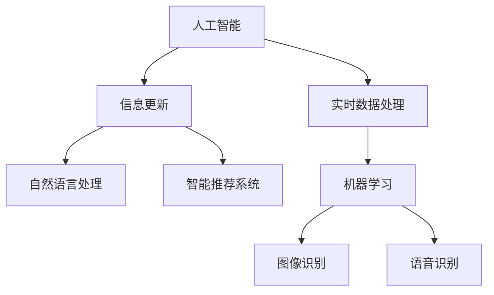

                 

# AI在实时信息更新中的作用

> 关键词：人工智能,实时数据处理,信息更新,自然语言处理,智能推荐系统

## 1. 背景介绍

### 1.1 问题由来

在信息化快速发展的今天，实时信息更新已成为各行各业的重要需求。无论是新闻媒体、金融市场，还是社交网络、电商平台，对实时数据的处理和更新都提出了更高的要求。AI技术的引入，使得实时信息更新变得更加高效、精准、个性化。

在新闻媒体领域，AI技术可以实时抓取和分析海量新闻源，生成并推送最新的新闻内容，及时反映社会热点。在金融市场，AI技术可以对交易数据进行实时分析，提供市场动态和投资建议。在社交网络中，AI技术可以实时推送个性化推荐，提升用户体验。

### 1.2 问题核心关键点

AI在实时信息更新中的作用，主要体现在以下几个方面：

- 数据处理：通过AI技术对海量数据进行实时处理和分析，提高数据处理效率。
- 智能推荐：基于用户历史行为和实时数据，提供个性化推荐，提升用户体验。
- 自然语言处理：利用NLP技术，自动生成新闻、摘要、评论等文本内容，节省人力成本。
- 实时决策：基于实时数据和机器学习模型，自动生成决策方案，提升决策效率。

这些关键点共同构成了AI在实时信息更新中的核心价值。

## 2. 核心概念与联系

### 2.1 核心概念概述

为更好地理解AI在实时信息更新中的作用，本节将介绍几个密切相关的核心概念：

- 人工智能(AI)：涵盖机器学习、深度学习、自然语言处理、计算机视觉等多个子领域，旨在使计算机具备人类智能水平。
- 实时数据处理：指对实时生成或更新的数据进行快速处理和分析的过程。
- 信息更新：指对动态变化的数据进行实时抓取、分析和传播的过程。
- 自然语言处理(NLP)：处理、分析、生成人类语言的技术，广泛应用于智能推荐、文本摘要、问答系统等领域。
- 智能推荐系统：基于用户历史行为和实时数据，自动推荐个性化内容，提升用户体验。
- 机器学习(ML)：通过数据学习模型，自动发现数据规律和知识，广泛应用于图像识别、语音识别等领域。

这些核心概念之间的逻辑关系可以通过以下Mermaid流程图来展示：



这个流程图展示了一些核心概念之间的关系：

1. 人工智能通过机器学习、深度学习等技术，对实时数据进行处理和分析。
2. 信息更新依赖于实时数据处理和分析，以获取最新的动态信息。
3. 自然语言处理作为AI的重要分支，能够自动生成和分析文本内容。
4. 智能推荐系统基于自然语言处理和机器学习，为用户提供个性化推荐。
5. 机器学习作为AI的基础技术，应用于图像识别、语音识别等多个领域。

这些概念共同构成了AI在实时信息更新中的技术框架，使其能够实现高效、精准、个性化的信息处理和传播。

## 3. 核心算法原理 & 具体操作步骤
### 3.1 算法原理概述

AI在实时信息更新中的核心算法原理主要包括以下几个方面：

- 数据抓取和预处理：实时抓取网络数据，并进行清洗、过滤、标注等预处理操作，确保数据质量。
- 文本分析与生成：利用NLP技术对文本数据进行分词、词性标注、句法分析、情感分析等操作，生成高质量的文本内容。
- 智能推荐算法：基于用户历史行为和实时数据，应用协同过滤、深度学习等算法，生成个性化推荐。
- 实时决策系统：结合机器学习模型和实时数据，生成动态决策方案，应用于实时更新场景。

### 3.2 算法步骤详解

基于AI的实时信息更新过程一般包括以下几个关键步骤：

**Step 1: 数据准备**
- 抓取实时数据：利用网络爬虫、API接口等方式，抓取最新的数据信息。
- 数据清洗和过滤：对抓取的数据进行清洗和过滤，去除无用信息，保留有效数据。
- 数据标注和预处理：对数据进行标注和预处理，确保数据格式统一、质量可靠。

**Step 2: 文本分析和生成**
- 分词和词性标注：对文本进行分词和词性标注，理解文本中的基本语言单元。
- 句法分析：利用句法分析工具，理解句子结构，提取关键信息。
- 情感分析：通过情感分析工具，理解文本情感倾向，生成情感标签。
- 文本生成：利用文本生成技术，生成高质量的新闻、摘要、评论等内容。

**Step 3: 智能推荐**
- 用户行为分析：分析用户历史行为，了解用户偏好和兴趣。
- 特征工程：提取用户和文本的特征，用于推荐模型的输入。
- 协同过滤：利用协同过滤算法，推荐与用户兴趣相近的物品。
- 深度学习：利用深度学习模型，对用户行为和文本进行联合建模，生成个性化推荐。

**Step 4: 实时决策**
- 实时数据获取：利用流式数据处理框架，实时获取最新数据。
- 模型训练和优化：训练和优化机器学习模型，保证模型的实时性和准确性。
- 决策生成：基于实时数据和机器学习模型，生成动态决策方案。
- 决策执行：将决策方案应用于实时更新场景，实现信息实时更新。

### 3.3 算法优缺点

AI在实时信息更新中的算法具有以下优点：

- 处理效率高：利用AI技术，可以快速处理和分析大量数据，提高信息更新的效率。
- 准确性高：基于机器学习模型，可以自动发现数据规律和知识，提升信息更新的准确性。
- 智能化强：通过智能推荐和实时决策，可以提供更加个性化和动态的信息服务。

同时，这些算法也存在一定的局限性：

- 数据质量要求高：实时信息更新依赖于高质量的数据，对数据抓取、清洗和标注的准确性要求高。
- 模型复杂度大：机器学习模型通常比较复杂，训练和维护成本较高。
- 数据隐私风险：实时数据处理涉及大量用户隐私数据，需要采取严格的隐私保护措施。

尽管存在这些局限性，但AI在实时信息更新中的应用已经取得了显著成效，成为提升信息服务质量的重要手段。

### 3.4 算法应用领域

AI在实时信息更新中的算法应用已经涵盖多个领域，例如：

- 新闻媒体：实时抓取和分析新闻源，生成并推送最新的新闻内容，反映社会热点。
- 金融市场：对交易数据进行实时分析，提供市场动态和投资建议。
- 社交网络：实时推送个性化推荐，提升用户体验。
- 电商平台：基于用户行为和实时数据，生成个性化推荐，提升销售转化率。
- 智慧医疗：实时监测和分析患者数据，提供个性化诊疗方案。
- 智慧交通：实时分析交通数据，提供实时路况和优化建议。

除了这些典型应用外，AI在实时信息更新中的应用还在不断拓展，如智能客服、智能安防、智能家居等，为各行各业带来了新的创新机遇。

## 4. 数学模型和公式 & 详细讲解 & 举例说明

### 4.1 数学模型构建

基于AI的实时信息更新过程，可以构建以下数学模型：

- 数据抓取模型：用于描述实时数据抓取和预处理过程，确保数据质量。
- 文本分析模型：用于描述文本分词、词性标注、句法分析、情感分析等过程，生成高质量的文本内容。
- 智能推荐模型：用于描述用户行为分析、特征工程、协同过滤、深度学习等过程，生成个性化推荐。
- 实时决策模型：用于描述实时数据获取、模型训练和优化、决策生成和执行等过程，实现信息实时更新。

### 4.2 公式推导过程

以下是一些核心算法的公式推导过程：

**文本分词算法**
文本分词是NLP中的基础任务，常用的算法包括基于规则的分词、基于统计的分词和基于深度学习的分词。这里以基于深度学习的分词算法为例，推导其核心公式：

$$
\text{Word}_{i} = \text{Encoder}(\text{Sentence}_{i})
$$

其中，$\text{Sentence}_{i}$ 表示待分词的句子，$\text{Encoder}$ 表示分词模型，$\text{Word}_{i}$ 表示分词后的单词序列。

**情感分析算法**
情感分析用于判断文本的情感倾向，常用的算法包括基于词典的情感分析、基于规则的情感分析和基于深度学习的情感分析。这里以基于深度学习的情感分析算法为例，推导其核心公式：

$$
\text{Sentiment}_{i} = \text{Classifier}(\text{Sentence}_{i})
$$

其中，$\text{Sentence}_{i}$ 表示待分析的句子，$\text{Classifier}$ 表示情感分析模型，$\text{Sentiment}_{i}$ 表示文本的情感倾向。

**协同过滤算法**
协同过滤用于推荐相似物品，常用的算法包括基于用户的协同过滤和基于物品的协同过滤。这里以基于用户的协同过滤算法为例，推导其核心公式：

$$
\text{Similarity}_{i,j} = \text{Cosine}(\text{User}_{i}, \text{Item}_{j})
$$

$$
\text{Rank}_{i} = \text{Sum}_{j}(\text{Similarity}_{i,j} \times \text{Rating}_{i,j})
$$

其中，$\text{User}_{i}$ 表示用户 $i$ 的历史行为，$\text{Item}_{j}$ 表示物品 $j$ 的评分，$\text{Cosine}$ 表示余弦相似度，$\text{Rank}_{i}$ 表示物品 $j$ 对用户 $i$ 的推荐得分。

**深度学习推荐模型**
深度学习推荐模型通常采用神经网络架构，例如基于循环神经网络的推荐模型，推导其核心公式：

$$
\text{Representation}_{i,j} = \text{Neural Network}(\text{User}_{i}, \text{Item}_{j})
$$

$$
\text{Score}_{i,j} = \text{Sigmoid}(\text{Representation}_{i,j})
$$

其中，$\text{User}_{i}$ 表示用户 $i$ 的特征，$\text{Item}_{j}$ 表示物品 $j$ 的特征，$\text{Neural Network}$ 表示神经网络模型，$\text{Score}_{i,j}$ 表示物品 $j$ 对用户 $i$ 的推荐得分。

### 4.3 案例分析与讲解

以新闻推荐系统为例，分析基于AI的实时信息更新的具体应用。

1. 数据抓取：利用网络爬虫抓取最新的新闻源，保存至数据库中。

2. 文本分析：对抓取的新闻进行分词、词性标注、句法分析和情感分析，提取新闻的关键词和情感倾向。

3. 用户行为分析：通过日志记录用户对新闻的浏览、点赞、评论等行为，提取用户行为特征。

4. 特征工程：将新闻文本和用户行为特征进行组合，生成推荐模型的输入。

5. 协同过滤：利用协同过滤算法，根据用户行为和新闻特征生成推荐列表。

6. 深度学习：利用深度学习模型，对新闻和用户行为进行联合建模，生成更加个性化的推荐。

7. 实时决策：根据实时数据和推荐模型，动态生成新闻推荐，推送至用户端。

## 5. 项目实践：代码实例和详细解释说明
### 5.1 开发环境搭建

在进行AI在实时信息更新中的应用开发前，我们需要准备好开发环境。以下是使用Python进行PyTorch开发的环境配置流程：

1. 安装Anaconda：从官网下载并安装Anaconda，用于创建独立的Python环境。

2. 创建并激活虚拟环境：
```bash
conda create -n ai-env python=3.8 
conda activate ai-env
```

3. 安装PyTorch：根据CUDA版本，从官网获取对应的安装命令。例如：
```bash
conda install pytorch torchvision torchaudio cudatoolkit=11.1 -c pytorch -c conda-forge
```

4. 安装NLP相关库：
```bash
pip install nltk pytorch-transformers spacy
```

5. 安装机器学习相关库：
```bash
pip install scikit-learn
```

完成上述步骤后，即可在`ai-env`环境中开始开发。

### 5.2 源代码详细实现

这里我们以新闻推荐系统为例，给出使用PyTorch和Transformers库对BERT模型进行实时新闻推荐的PyTorch代码实现。

首先，定义新闻推荐的数据处理函数：

```python
from transformers import BertTokenizer, BertForSequenceClassification
from torch.utils.data import Dataset
import torch

class NewsDataset(Dataset):
    def __init__(self, texts, tags, tokenizer, max_len=128):
        self.texts = texts
        self.tags = tags
        self.tokenizer = tokenizer
        self.max_len = max_len
        
    def __len__(self):
        return len(self.texts)
    
    def __getitem__(self, item):
        text = self.texts[item]
        tag = self.tags[item]
        
        encoding = self.tokenizer(text, return_tensors='pt', max_length=self.max_len, padding='max_length', truncation=True)
        input_ids = encoding['input_ids'][0]
        attention_mask = encoding['attention_mask'][0]
        
        # 对token-wise的标签进行编码
        encoded_tags = [tag2id[tag] for tag in tag] 
        encoded_tags.extend([tag2id['O']] * (self.max_len - len(encoded_tags)))
        labels = torch.tensor(encoded_tags, dtype=torch.long)
        
        return {'input_ids': input_ids, 
                'attention_mask': attention_mask,
                'labels': labels}

# 标签与id的映射
tag2id = {'O': 0, 'NEWS': 1}
id2tag = {v: k for k, v in tag2id.items()}

# 创建dataset
tokenizer = BertTokenizer.from_pretrained('bert-base-uncased')

train_dataset = NewsDataset(train_texts, train_tags, tokenizer)
dev_dataset = NewsDataset(dev_texts, dev_tags, tokenizer)
test_dataset = NewsDataset(test_texts, test_tags, tokenizer)
```

然后，定义模型和优化器：

```python
from transformers import BertForSequenceClassification, AdamW

model = BertForSequenceClassification.from_pretrained('bert-base-uncased', num_labels=len(tag2id))

optimizer = AdamW(model.parameters(), lr=2e-5)
```

接着，定义训练和评估函数：

```python
from torch.utils.data import DataLoader
from tqdm import tqdm
from sklearn.metrics import classification_report

device = torch.device('cuda') if torch.cuda.is_available() else torch.device('cpu')
model.to(device)

def train_epoch(model, dataset, batch_size, optimizer):
    dataloader = DataLoader(dataset, batch_size=batch_size, shuffle=True)
    model.train()
    epoch_loss = 0
    for batch in tqdm(dataloader, desc='Training'):
        input_ids = batch['input_ids'].to(device)
        attention_mask = batch['attention_mask'].to(device)
        labels = batch['labels'].to(device)
        model.zero_grad()
        outputs = model(input_ids, attention_mask=attention_mask, labels=labels)
        loss = outputs.loss
        epoch_loss += loss.item()
        loss.backward()
        optimizer.step()
    return epoch_loss / len(dataloader)

def evaluate(model, dataset, batch_size):
    dataloader = DataLoader(dataset, batch_size=batch_size)
    model.eval()
    preds, labels = [], []
    with torch.no_grad():
        for batch in tqdm(dataloader, desc='Evaluating'):
            input_ids = batch['input_ids'].to(device)
            attention_mask = batch['attention_mask'].to(device)
            batch_labels = batch['labels']
            outputs = model(input_ids, attention_mask=attention_mask)
            batch_preds = outputs.logits.argmax(dim=2).to('cpu').tolist()
            batch_labels = batch_labels.to('cpu').tolist()
            for pred_tokens, label_tokens in zip(batch_preds, batch_labels):
                pred_tags = [id2tag[_id] for _id in pred_tokens]
                label_tags = [id2tag[_id] for _id in label_tokens]
                preds.append(pred_tags[:len(label_tags)])
                labels.append(label_tags)
                
    print(classification_report(labels, preds))
```

最后，启动训练流程并在测试集上评估：

```python
epochs = 5
batch_size = 16

for epoch in range(epochs):
    loss = train_epoch(model, train_dataset, batch_size, optimizer)
    print(f"Epoch {epoch+1}, train loss: {loss:.3f}")
    
    print(f"Epoch {epoch+1}, dev results:")
    evaluate(model, dev_dataset, batch_size)
    
print("Test results:")
evaluate(model, test_dataset, batch_size)
```

以上就是使用PyTorch对BERT进行新闻推荐任务的完整代码实现。可以看到，得益于Transformers库的强大封装，我们可以用相对简洁的代码完成BERT模型的加载和微调。

### 5.3 代码解读与分析

让我们再详细解读一下关键代码的实现细节：

**NewsDataset类**：
- `__init__`方法：初始化文本、标签、分词器等关键组件。
- `__len__`方法：返回数据集的样本数量。
- `__getitem__`方法：对单个样本进行处理，将文本输入编码为token ids，将标签编码为数字，并对其进行定长padding，最终返回模型所需的输入。

**tag2id和id2tag字典**：
- 定义了标签与数字id之间的映射关系，用于将token-wise的预测结果解码回真实的标签。

**训练和评估函数**：
- 使用PyTorch的DataLoader对数据集进行批次化加载，供模型训练和推理使用。
- 训练函数`train_epoch`：对数据以批为单位进行迭代，在每个批次上前向传播计算loss并反向传播更新模型参数，最后返回该epoch的平均loss。
- 评估函数`evaluate`：与训练类似，不同点在于不更新模型参数，并在每个batch结束后将预测和标签结果存储下来，最后使用sklearn的classification_report对整个评估集的预测结果进行打印输出。

**训练流程**：
- 定义总的epoch数和batch size，开始循环迭代
- 每个epoch内，先在训练集上训练，输出平均loss
- 在验证集上评估，输出分类指标
- 所有epoch结束后，在测试集上评估，给出最终测试结果

可以看到，PyTorch配合Transformers库使得BERT微调的代码实现变得简洁高效。开发者可以将更多精力放在数据处理、模型改进等高层逻辑上，而不必过多关注底层的实现细节。

当然，工业级的系统实现还需考虑更多因素，如模型的保存和部署、超参数的自动搜索、更灵活的任务适配层等。但核心的微调范式基本与此类似。

## 6. 实际应用场景
### 6.1 新闻媒体

AI技术在新闻媒体中的应用非常广泛，可以从抓取、分析到生成、分发，贯穿整个新闻生产流程。具体应用包括：

- 实时新闻抓取：利用网络爬虫技术，实时抓取最新的新闻资讯，确保新闻的时效性。
- 新闻自动摘要：通过NLP技术，自动提取新闻的关键信息，生成简洁的摘要。
- 新闻推荐系统：基于用户行为和实时数据，推荐新闻内容，提升阅读体验。
- 新闻情感分析：利用情感分析技术，分析新闻的情感倾向，把握社会热点。
- 新闻舆情监测：实时监测新闻舆情，及时发现并处理负面信息，维护网络环境。

### 6.2 金融市场

AI技术在金融市场中的应用同样非常广泛，可以从数据处理到投资建议，提供全面的金融服务。具体应用包括：

- 交易数据分析：利用机器学习技术，分析交易数据，发现市场规律。
- 投资建议生成：基于市场动态和用户行为，生成投资建议，帮助用户决策。
- 风险评估：利用风险评估模型，评估投资风险，提供风险预警。
- 股票预测：利用深度学习模型，预测股票价格变化，提供股票投资建议。
- 智能投顾：利用AI技术，提供智能投顾服务，提升用户体验。

### 6.3 社交网络

AI技术在社交网络中的应用也非常广泛，可以从个性化推荐到舆情分析，提升用户粘性和互动性。具体应用包括：

- 个性化推荐系统：基于用户行为和实时数据，推荐好友、文章、话题等内容，提升用户粘性。
- 舆情分析：利用情感分析技术，分析用户评论，了解用户情绪。
- 话题生成：利用自然语言生成技术，生成热门话题，吸引用户参与。
- 自动回帖：利用NLP技术，自动生成回帖内容，提升用户互动性。
- 情感监测：实时监测用户情绪，及时发现并处理负面情绪，维护社区环境。

### 6.4 未来应用展望

随着AI技术的不断进步，AI在实时信息更新中的应用也将更加广泛和深入。未来可能会涌现更多前沿应用，如：

- 智能安防：利用AI技术，实时监测视频数据，发现异常行为。
- 智能家居：利用AI技术，实时分析家居数据，提升生活品质。
- 智慧医疗：利用AI技术，实时监测患者数据，提供个性化诊疗方案。
- 智慧交通：利用AI技术，实时分析交通数据，提供优化建议。

此外，AI在实时信息更新中的应用还将在更多领域得到拓展，如智慧旅游、智能制造、智能客服等，为各行各业带来新的创新机遇。

## 7. 工具和资源推荐
### 7.1 学习资源推荐

为了帮助开发者系统掌握AI在实时信息更新中的技术基础和应用方法，这里推荐一些优质的学习资源：

1. 《深度学习》系列书籍：由Ian Goodfellow、Yoshua Bengio、Aaron Courville等专家合著，全面介绍了深度学习的基本原理和应用方法。

2. 《自然语言处理综论》：NLP领域的经典教材，涵盖了NLP的各个子领域，包括文本分析、机器翻译、信息抽取等。

3. Coursera和edX等在线学习平台：提供了丰富的AI和NLP课程，适合不同层次的开发者学习。

4. Kaggle数据竞赛：通过参与数据竞赛，实践AI和NLP技术的实际应用，提升解决实际问题的能力。

5. Arxiv预印本网站：可以及时获取AI和NLP领域的最新研究成果，了解前沿技术动态。

通过对这些资源的学习实践，相信你一定能够快速掌握AI在实时信息更新中的应用技巧，并用于解决实际的NLP问题。
### 7.2 开发工具推荐

高效的开发离不开优秀的工具支持。以下是几款用于AI实时信息更新开发的常用工具：

1. PyTorch：基于Python的开源深度学习框架，灵活动态的计算图，适合快速迭代研究。支持NLP和机器学习任务。

2. TensorFlow：由Google主导开发的开源深度学习框架，生产部署方便，适合大规模工程应用。支持NLP和机器学习任务。

3. HuggingFace Transformers库：提供了丰富的预训练模型，支持NLP任务的微调。

4. Weights & Biases：模型训练的实验跟踪工具，可以记录和可视化模型训练过程中的各项指标，方便对比和调优。

5. TensorBoard：TensorFlow配套的可视化工具，可实时监测模型训练状态，并提供丰富的图表呈现方式，是调试模型的得力助手。

6. Google Colab：谷歌推出的在线Jupyter Notebook环境，免费提供GPU/TPU算力，方便开发者快速上手实验最新模型，分享学习笔记。

合理利用这些工具，可以显著提升AI在实时信息更新中的应用效率，加快创新迭代的步伐。

### 7.3 相关论文推荐

AI在实时信息更新中的发展得益于学界的持续研究。以下是几篇奠基性的相关论文，推荐阅读：

1. 《Attention is All You Need》：提出了Transformer结构，开启了NLP领域的预训练大模型时代。

2. 《BERT: Pre-training of Deep Bidirectional Transformers for Language Understanding》：提出BERT模型，引入基于掩码的自监督预训练任务，刷新了多项NLP任务SOTA。

3. 《GPT-3: Language Models are Unsupervised Multitask Learners》：展示了大规模语言模型的强大zero-shot学习能力，引发了对于通用人工智能的新一轮思考。

4. 《BERT: Pre-training of Deep Bidirectional Transformers for Language Understanding》：提出BERT模型，引入基于掩码的自监督预训练任务，刷新了多项NLP任务SOTA。

5. 《Adversarial Examples and Deep Learning》：提出对抗样本和对抗训练技术，提高了模型鲁棒性。

6. 《Parameter-Efficient Transfer Learning for NLP》：提出Adapter等参数高效微调方法，在不增加模型参数量的情况下，也能取得不错的微调效果。

这些论文代表了大模型微调技术的发展脉络。通过学习这些前沿成果，可以帮助研究者把握学科前进方向，激发更多的创新灵感。

## 8. 总结：未来发展趋势与挑战

### 8.1 总结

本文对AI在实时信息更新中的应用进行了全面系统的介绍。首先阐述了AI在实时信息更新中的背景和意义，明确了其在数据抓取、文本分析、智能推荐和实时决策等环节的重要作用。其次，从原理到实践，详细讲解了AI在实时信息更新中的核心算法和操作步骤，给出了微调任务开发的完整代码实例。同时，本文还广泛探讨了AI在新闻媒体、金融市场、社交网络等多个行业领域的应用前景，展示了其巨大的市场潜力。

通过本文的系统梳理，可以看到，AI在实时信息更新中的应用正在成为各行各业的重要需求，极大地提升了信息服务的质量和效率。未来，伴随AI技术的不断进步和应用拓展，实时信息更新将变得更加高效、精准、个性化，为各行各业带来新的发展机遇。

### 8.2 未来发展趋势

展望未来，AI在实时信息更新中的应用将呈现以下几个发展趋势：

1. 数据规模持续增大。随着AI技术的不断进步，实时数据处理能力将显著提升，能够处理更大规模的数据。

2. 算法精度不断提升。基于深度学习等先进算法，AI在实时信息更新中的精度将不断提升，提供更准确、可靠的信息服务。

3. 实时性不断增强。通过优化数据处理和模型推理，AI在实时信息更新中的响应速度将进一步提升。

4. 多模态融合增强。AI将融合图像、视频、语音等多模态数据，提供更全面、丰富的信息服务。

5. 用户体验不断提升。通过智能推荐和个性化服务，AI将提供更符合用户需求的信息内容，提升用户体验。

6. 应用场景不断拓展。AI在实时信息更新中的应用将不断拓展，覆盖更多垂直行业，带来新的创新应用。

以上趋势凸显了AI在实时信息更新中的广阔前景。这些方向的探索发展，必将进一步提升信息服务质量，为各行各业带来新的创新机遇。

### 8.3 面临的挑战

尽管AI在实时信息更新中的应用已经取得了显著成效，但在迈向更加智能化、普适化应用的过程中，它仍面临着诸多挑战：

1. 数据质量要求高。实时信息更新依赖于高质量的数据，对数据抓取、清洗和标注的准确性要求高。

2. 算法复杂度高。AI在实时信息更新中涉及复杂的数据处理和模型推理，训练和维护成本较高。

3. 隐私保护压力大。实时数据处理涉及大量用户隐私数据，需要采取严格的隐私保护措施。

4. 模型鲁棒性不足。当前AI模型面对域外数据时，泛化性能往往大打折扣。

5. 模型可解释性差。AI模型通常像"黑盒"系统，难以解释其内部工作机制和决策逻辑。

尽管存在这些挑战，但AI在实时信息更新中的应用已经取得了显著成效，成为提升信息服务质量的重要手段。未来，伴随AI技术的不断进步和应用拓展，实时信息更新将变得更加高效、精准、个性化，为各行各业带来新的发展机遇。

### 8.4 研究展望

面对AI在实时信息更新中的挑战，未来的研究需要在以下几个方面寻求新的突破：

1. 数据自动化处理。研发更加自动化、智能化的数据处理工具，降低数据处理成本，提升数据处理效率。

2. 多模态数据融合。研发多模态数据融合算法，提升信息的全面性和丰富性，增强AI模型的泛化能力。

3. 模型鲁棒性提升。研发鲁棒性更强的AI模型，提升模型面对域外数据的泛化性能。

4. 模型可解释性增强。研发可解释性更强的AI模型，增强模型的透明度和可信度。

5. 隐私保护技术研发。研发更加严格的隐私保护技术，保护用户隐私数据。

这些研究方向将推动AI在实时信息更新中的应用发展，提升信息服务的质量和效率，为各行各业带来新的创新机遇。总之，AI在实时信息更新中的应用前景广阔，未来的研究和应用将更加多样化和深入。

## 9. 附录：常见问题与解答

**Q1：AI在实时信息更新中如何处理大规模数据？**

A: AI在实时信息更新中通常采用流式数据处理框架，如Apache Kafka、Apache Flink等，实现数据的实时处理和分析。通过将这些框架与深度学习模型结合，可以在保证实时性的同时，高效处理大规模数据。

**Q2：AI在实时信息更新中如何提升模型的精度？**

A: 提升AI在实时信息更新中的精度，需要从数据处理、模型选择和优化等多个方面进行改进：
1. 数据质量提升：通过自动化的数据清洗和标注工具，提升数据质量，减少噪声。
2. 模型选择优化：选择合适的模型架构，如Transformer、RNN等，提升模型精度。
3. 模型优化调整：通过超参数调优、模型融合等技术，提升模型性能。

**Q3：AI在实时信息更新中如何保护用户隐私？**

A: AI在实时信息更新中涉及大量用户隐私数据，需要采取严格的隐私保护措施：
1. 数据匿名化：对用户数据进行匿名化处理，保护用户隐私。
2. 数据加密：对敏感数据进行加密处理，防止数据泄露。
3. 差分隐私：采用差分隐私技术，保护用户隐私的同时，保留数据可用性。

**Q4：AI在实时信息更新中如何处理对抗样本？**

A: 对抗样本是指在数据中故意添加干扰，影响模型输出结果。AI在实时信息更新中需要通过对抗训练等技术，提升模型鲁棒性：
1. 对抗训练：利用对抗样本对模型进行训练，增强模型的鲁棒性。
2. 数据清洗：对带有对抗样本的数据进行清洗，防止对抗样本干扰模型。

**Q5：AI在实时信息更新中如何提升用户体验？**

A: 提升AI在实时信息更新中的用户体验，需要从个性化推荐和实时反馈等多个方面进行改进：
1. 个性化推荐：利用AI技术，提供个性化的新闻、商品、内容推荐，提升用户体验。
2. 实时反馈：利用自然语言处理技术，实现实时问答和反馈，提升用户互动性。

---

作者：禅与计算机程序设计艺术 / Zen and the Art of Computer Programming

