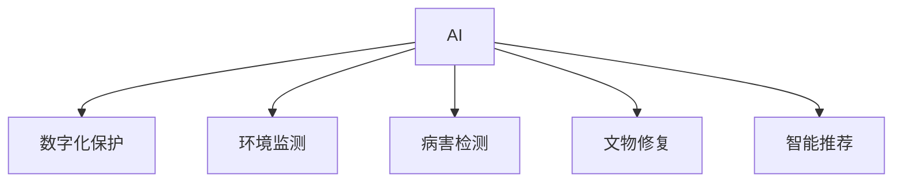

                 

# AI在文化遗产保护中的应用

## 1. 背景介绍

### 1.1 问题由来

文化遗产是人类历史、文化、艺术等方面的宝贵资源，对它们进行有效的保护和利用，对于传承文明、弘扬文化、促进社会可持续发展具有重要意义。然而，随着时间推移和自然环境变化，文化遗产面临着磨损、破坏、盗窃等诸多风险。传统的保护方法往往难以应对这些挑战，尤其是在面对海量数据和高维信息时，效果往往不尽人意。

近年来，随着人工智能(AI)技术的飞速发展，越来越多的文化遗产保护项目开始尝试应用AI技术，以提高保护的效率和效果。AI在文化遗产保护中的应用，已逐步成为学术界和业界关注的热点领域，对文化遗产的数字化、智能化、精准化保护提供了新的可能性。

### 1.2 问题核心关键点

AI在文化遗产保护中的应用主要集中在以下几个方面：

- **数字化保护**：通过图像识别、3D重建、虚拟现实(VR)等技术，对文化遗产进行数字化复原和记录，延长其物理寿命。
- **环境监测**：利用传感器、无人机等设备，实时监测文化遗产的环境状况，及时预警潜在风险。
- **病害检测**：通过图像处理、深度学习等方法，自动检测和分析文化遗产的病害状况，提升病害诊断的效率和准确性。
- **文物修复**：借助计算机视觉、自然语言处理等技术，辅助文物保护人员进行修复，提升修复质量和效率。
- **智能推荐**：利用推荐系统技术，为用户提供个性化的文化遗产资源展示和推荐，提升用户体验。

这些应用不仅能够降低保护成本，还能显著提升文化遗产保护的效率和精度。AI技术为文化遗产保护提供了全新的解决方案，推动了文化遗产保护事业的数字化、智能化转型。

## 2. 核心概念与联系

### 2.1 核心概念概述

为更好地理解AI在文化遗产保护中的应用，本节将介绍几个密切相关的核心概念：

- **人工智能(AI)**：一种模拟人类智能行为的计算技术，包括机器学习、深度学习、自然语言处理等子领域。
- **文化遗产保护**：通过科技手段对文物、古迹、遗址等文化资源进行保护和利用的过程。
- **数字文化遗产**：利用数字技术对文化遗产进行数字化记录、存储和传播的过程。
- **图像识别**：通过机器学习算法，自动分析图像中的对象、场景、文字等信息。
- **3D重建**：利用计算机图形学和图像处理技术，对文化遗产进行三维重构和复原。
- **虚拟现实(VR)**：一种利用计算机图形学和传感器技术，模拟真实世界的沉浸式体验。
- **推荐系统**：根据用户行为和偏好，自动推荐相关信息和内容的技术。

这些核心概念之间的逻辑关系可以通过以下Mermaid流程图来展示：



这个流程图展示了这个系统的主要构成，其核心思想是通过AI技术实现文化遗产保护的数字化、智能化和精准化。

## 3. 核心算法原理 & 具体操作步骤

### 3.1 算法原理概述

AI在文化遗产保护中的应用，核心在于利用AI技术对文化遗产进行数字化、智能化和精准化的保护。具体而言，包括以下几个关键算法和技术：

- **图像识别**：利用深度学习算法，对文化遗产图像进行对象识别、场景理解、文字识别等。
- **3D重建**：通过点云数据处理、几何重建等技术，将文化遗产的三维形态进行重构和复原。
- **环境监测**：利用传感器网络、无人机等技术，实时监测文化遗产所处环境，进行环境数据采集和分析。
- **病害检测**：结合图像处理和深度学习技术，自动识别和分析文化遗产的病害状态，进行健康评估。
- **文物修复**：利用计算机视觉技术，对文物图像进行修复处理，提升文物图像质量。
- **智能推荐**：利用推荐系统算法，根据用户兴趣和历史行为，推荐相关文化遗产资源。

这些算法和技术相互协同，共同构成了AI在文化遗产保护中的应用框架，使得文化遗产的保护和利用更加高效、精准和智能化。

### 3.2 算法步骤详解

下面以图像识别和3D重建为例，详细介绍其具体的操作步骤：

#### 图像识别

**步骤1: 数据收集**
- 收集大量高质量的文物图像，确保图像多样性和代表性。
- 对图像进行预处理，包括裁剪、缩放、去噪等。

**步骤2: 模型训练**
- 利用深度学习框架（如TensorFlow、PyTorch）搭建卷积神经网络（CNN）模型。
- 使用标注数据集进行模型训练，优化网络参数。

**步骤3: 模型评估**
- 使用测试集评估模型性能，评估指标包括准确率、召回率、F1分数等。
- 根据评估结果，调整模型参数和超参数，进一步优化模型性能。

**步骤4: 实际应用**
- 在文物图像上应用训练好的模型，自动进行对象识别、场景理解、文字识别等任务。
- 对识别结果进行后处理，如区域分割、文本识别校正等。

#### 3D重建

**步骤1: 数据采集**
- 利用高分辨率相机、激光扫描仪等设备，采集文物的三维数据。
- 将三维数据进行预处理，去除噪声和冗余数据。

**步骤2: 几何重建**
- 利用点云数据处理软件（如CloudCompare、Autodesk Reconstructor）进行点云配准和合并。
- 利用PCL、Open3D等开源库进行三维形态的几何重建。

**步骤3: 纹理映射**
- 利用图像处理技术，将纹理数据映射到重建后的三维模型上。
- 利用Photoshop、Blender等工具进行纹理贴图和优化。

**步骤4: 模型优化**
- 利用Unreal Engine、Unity等引擎，对三维模型进行渲染和优化。
- 对模型进行纹理、光照、材质等参数调整，提升视觉效果。

通过这些步骤，可以将文化遗产的三维形态数字化记录和重构，并进行高质量的展示和传播。

### 3.3 算法优缺点

AI在文化遗产保护中的应用，具有以下优点：

- **效率高**：自动化的图像识别、3D重建等技术，可以大幅提升文化遗产保护的效率。
- **精度高**：AI技术能够处理高维数据，识别和分析文物的详细信息，提升保护的精度。
- **成本低**：相比于人工处理，AI技术降低了保护成本，尤其在大规模数据处理方面效果显著。
- **智能化**：通过机器学习和深度学习算法，AI能够进行自我优化和改进，适应不断变化的需求。

同时，该方法也存在一定的局限性：

- **数据依赖性强**：AI技术的效果很大程度上依赖于数据的丰富性和质量。
- **技术门槛高**：AI技术的实施需要较高的技术门槛，需要专业知识和技术储备。
- **模型泛化能力有限**：AI模型对特定文物的识别和重建可能存在偏差，泛化能力有限。
- **伦理和安全问题**：AI技术的应用可能引发隐私和版权问题，需要谨慎处理。

尽管存在这些局限性，但AI技术在文化遗产保护中的应用前景广阔，有望在未来发挥更大的作用。

### 3.4 算法应用领域

AI在文化遗产保护中的应用领域非常广泛，涵盖以下几个方面：

- **文物保护**：通过图像识别和3D重建技术，对文物进行数字化记录和复原。
- **考古发现**：利用图像处理和计算机视觉技术，辅助考古学家进行遗址发掘和文物识别。
- **历史研究**：通过文本分析和自然语言处理技术，对历史文献进行数字化研究和理解。
- **文化展示**：结合虚拟现实和增强现实技术，提供沉浸式的文化遗产展示体验。
- **社会教育**：通过推荐系统技术，向公众提供个性化的文化遗产教育资源。

这些应用不仅能够提升文化遗产保护的效率和质量，还能促进文化遗产的传播和利用，推动文化创新和传承。

## 4. 数学模型和公式 & 详细讲解

### 4.1 数学模型构建

在AI在文化遗产保护中的应用中，数学模型和公式扮演着重要的角色。以下是几个关键数学模型和公式的构建：

#### 图像识别

假设输入的图像为 $X \in \mathbb{R}^{m \times n \times c}$，其中 $m \times n$ 为图像尺寸，$c$ 为通道数（如RGB为3）。输出为类别概率分布 $P(Y \mid X)$，其中 $Y \in \{1, 2, \ldots, K\}$ 为类别。

**深度学习模型**
深度学习模型通常使用卷积神经网络（CNN）进行图像识别。假设模型为 $M = (W_1, W_2, \ldots, W_L)$，其中 $W_1$ 为输入层，$W_2, \ldots, W_L$ 为卷积层、池化层、全连接层等。

**损失函数**
常用的损失函数包括交叉熵损失、均方误差损失等。假设损失函数为 $\mathcal{L} = \frac{1}{N} \sum_{i=1}^N \ell(P(Y_i \mid X_i), \hat{Y}_i)$，其中 $\ell$ 为具体的损失函数，$\hat{Y}_i$ 为模型预测的类别标签。

**优化器**
常用的优化器包括SGD、Adam等。假设优化器为 $Opt = Opt(\mathcal{L}, \eta)$，其中 $\eta$ 为学习率。

**训练过程**
训练过程包括前向传播、损失计算、反向传播、参数更新等。具体步骤为：
1. 前向传播：输入图像 $X$，经过模型 $M$ 的各层，输出类别概率 $P(Y \mid X)$。
2. 损失计算：计算损失函数 $\mathcal{L}$。
3. 反向传播：计算损失函数对模型参数的梯度。
4. 参数更新：使用优化器 $Opt$ 更新模型参数。

#### 3D重建

**点云配准**
点云配准是3D重建的第一步，假设点云数据为 $\{P_i\}_{i=1}^N$，其中 $P_i \in \mathbb{R}^{3 \times N}$。配准算法通常包括RANSAC、ICP等。

**几何重建**
几何重建包括点云合并、表面生成等步骤。假设合并后的点云为 $\tilde{P} = \sum_{i=1}^N P_i$，表面生成算法通常包括Delaunay三角剖分、泊松重建等。

**纹理映射**
纹理映射是将纹理数据 $T \in \mathbb{R}^{m \times n \times c}$ 映射到3D模型上。假设映射后的纹理数据为 $\tilde{T}$，映射算法通常包括图像对齐、纹理生成等。

### 4.2 公式推导过程

#### 图像识别

**深度学习模型**
假设输入的图像为 $X \in \mathbb{R}^{m \times n \times c}$，输出为类别概率分布 $P(Y \mid X)$，其中 $Y \in \{1, 2, \ldots, K\}$。

**交叉熵损失函数**
交叉熵损失函数定义为：
$$
\mathcal{L} = -\frac{1}{N} \sum_{i=1}^N \sum_{k=1}^K y_{ik} \log p_{ik}
$$
其中 $y_{ik} = 1$ 表示样本 $i$ 属于类别 $k$，$p_{ik} = P(Y = k \mid X_i)$ 为模型预测的概率。

**梯度计算**
假设模型为 $M = (W_1, W_2, \ldots, W_L)$，其中 $W_1$ 为输入层，$W_2, \ldots, W_L$ 为卷积层、池化层、全连接层等。

前向传播：
$$
Z^{(1)} = W_1X + b_1
$$
$$
A^{(1)} = \sigma(Z^{(1)})
$$
$$
Z^{(l)} = W_lA^{(l-1)} + b_l
$$
$$
A^{(l)} = \sigma(Z^{(l)})
$$
$$
Z^{(L)} = W_LA^{(L-1)} + b_L
$$
$$
\hat{Y} = softmax(Z^{(L)})
$$

反向传播：
$$
\frac{\partial \mathcal{L}}{\partial W_l} = \frac{\partial \mathcal{L}}{\partial Z^{(L)}} \frac{\partial Z^{(L)}}{\partial W_l}
$$
$$
\frac{\partial \mathcal{L}}{\partial W_l} = \frac{\partial \mathcal{L}}{\partial A^{(l)}} \frac{\partial A^{(l)}}{\partial Z^{(l)}} \frac{\partial Z^{(l)}}{\partial W_l}
$$
$$
\frac{\partial \mathcal{L}}{\partial W_l} = \frac{\partial \mathcal{L}}{\partial A^{(l)}} \frac{\partial A^{(l)}}{\partial Z^{(l)}} \frac{\partial Z^{(l)}}{\partial A^{(l-1)}} \frac{\partial A^{(l-1)}}{\partial Z^{(l-1)}} \frac{\partial Z^{(l-1)}}{\partial W_l}
$$

参数更新：
$$
W_l = W_l - \eta \frac{\partial \mathcal{L}}{\partial W_l}
$$
$$
b_l = b_l - \eta \frac{\partial \mathcal{L}}{\partial b_l}
$$

#### 3D重建

**点云配准**
RANSAC算法步骤如下：
1. 随机选择两个点云 $P_i, P_j$，计算其对应关系 $\phi$。
2. 判断 $\phi$ 是否有效，有效则继续，否则跳过。
3. 将所有有效对 $\phi$ 合并，生成新的点云 $\tilde{P}$。
4. 重复上述步骤，直到找到最优配准关系或达到迭代次数。

**几何重建**
Delaunay三角剖分算法步骤如下：
1. 对点云 $\tilde{P}$ 进行三角剖分，生成三角形网格 $T$。
2. 利用泊松重建算法，将三角形网格 $T$ 映射为高分辨率模型。

**纹理映射**
纹理映射算法步骤如下：
1. 对齐纹理数据 $T$ 和点云数据 $\tilde{P}$。
2. 将纹理数据 $T$ 映射到点云数据 $\tilde{P}$ 上，生成映射后的纹理数据 $\tilde{T}$。

## 5. 项目实践：代码实例和详细解释说明

### 5.1 开发环境搭建

在进行AI在文化遗产保护中的应用开发前，我们需要准备好开发环境。以下是使用Python进行PyTorch开发的环境配置流程：

1. 安装Anaconda：从官网下载并安装Anaconda，用于创建独立的Python环境。

2. 创建并激活虚拟环境：
```bash
conda create -n pytorch-env python=3.8 
conda activate pytorch-env
```

3. 安装PyTorch：根据CUDA版本，从官网获取对应的安装命令。例如：
```bash
conda install pytorch torchvision torchaudio cudatoolkit=11.1 -c pytorch -c conda-forge
```

4. 安装Tensorflow：如果需要使用Tensorflow，请使用以下命令：
```bash
pip install tensorflow
```

5. 安装transformers库：
```bash
pip install transformers
```

6. 安装各类工具包：
```bash
pip install numpy pandas scikit-learn matplotlib tqdm jupyter notebook ipython
```

完成上述步骤后，即可在`pytorch-env`环境中开始项目实践。

### 5.2 源代码详细实现

下面是使用PyTorch进行图像识别的示例代码：

```python
import torch
import torch.nn as nn
import torch.optim as optim
from torch.utils.data import DataLoader
from torchvision import datasets, transforms
from torchvision.models import resnet50

# 定义数据集和数据预处理
transform = transforms.Compose([
    transforms.Resize(256),
    transforms.CenterCrop(224),
    transforms.ToTensor(),
    transforms.Normalize(mean=[0.485, 0.456, 0.406], std=[0.229, 0.224, 0.225])
])

train_dataset = datasets.ImageFolder(root='path/to/train/dataset', transform=transform)
test_dataset = datasets.ImageFolder(root='path/to/test/dataset', transform=transform)

train_loader = DataLoader(train_dataset, batch_size=32, shuffle=True)
test_loader = DataLoader(test_dataset, batch_size=32, shuffle=False)

# 定义模型
model = resnet50(pretrained=True)

# 定义损失函数和优化器
criterion = nn.CrossEntropyLoss()
optimizer = optim.SGD(model.parameters(), lr=0.001, momentum=0.9)

# 定义训练函数
def train(model, device, train_loader, optimizer, epoch):
    model.train()
    for i, (inputs, labels) in enumerate(train_loader):
        inputs, labels = inputs.to(device), labels.to(device)
        optimizer.zero_grad()
        outputs = model(inputs)
        loss = criterion(outputs, labels)
        loss.backward()
        optimizer.step()
        if i % 100 == 0:
            print(f'Epoch {epoch} [{i*len(inputs)}/{len(train_loader.dataset)}] loss: {loss.item():.4f}')

# 定义测试函数
def test(model, device, test_loader):
    model.eval()
    correct = 0
    total = 0
    with torch.no_grad():
        for images, labels in test_loader:
            images, labels = images.to(device), labels.to(device)
            outputs = model(images)
            _, predicted = torch.max(outputs.data, 1)
            total += labels.size(0)
            correct += (predicted == labels).sum().item()
    print(f'Accuracy: {(100 * correct / total):.2f}%')

# 训练和测试模型
device = torch.device('cuda' if torch.cuda.is_available() else 'cpu')
train(train_loader, device, train_loader, optimizer, 10)
test(test_loader, device, test_loader)
```

在这个示例中，我们使用预训练的ResNet-50模型进行图像分类任务。数据集使用ImageFolder，数据预处理包括图像缩放、裁剪、归一化等。模型训练使用SGD优化器，学习率为0.001，动量为0.9。训练函数使用交叉熵损失函数，每次迭代输出损失值。测试函数计算模型在测试集上的准确率。

### 5.3 代码解读与分析

让我们再详细解读一下关键代码的实现细节：

**数据集和数据预处理**
- `transforms.Compose`：定义数据预处理流程，包括图像缩放、裁剪、归一化等。
- `ImageFolder`：从文件夹中读取图像数据，并将其转换为Tensor。

**模型定义**
- `resnet50(pretrained=True)`：使用预训练的ResNet-50模型，可以直接进行微调。
- `nn.CrossEntropyLoss()`：定义交叉熵损失函数。

**训练和测试函数**
- `model.train()` 和 `model.eval()`：设置模型训练和测试模式。
- `optimizer.zero_grad()`：在每次迭代前清空梯度。
- `model(inputs)`：前向传播计算输出。
- `criterion(outputs, labels)`：计算损失。
- `loss.backward()`：反向传播计算梯度。
- `optimizer.step()`：更新模型参数。
- `torch.max(outputs.data, 1)`：计算输出中的最大值索引，即预测类别。

**训练和测试过程**
- `device = torch.device('cuda' if torch.cuda.is_available() else 'cpu')`：设置计算设备，优先使用GPU。
- `train(train_loader, device, train_loader, optimizer, 10)`：在训练集上训练模型，循环10次。
- `test(test_loader, device, test_loader)`：在测试集上测试模型，输出准确率。

以上示例代码展示了使用PyTorch进行图像识别的基本流程，包括数据预处理、模型定义、训练和测试等步骤。开发者可以根据具体需求，对代码进行进一步的优化和扩展。

## 6. 实际应用场景

### 6.1 智能监测系统

智能监测系统是AI在文化遗产保护中的一个重要应用。通过传感器、无人机等设备，实时监测文化遗产的环境状况，及时预警潜在风险。

具体实现步骤如下：

**数据采集**
- 部署传感器、无人机等设备，采集文化遗产的环境数据。
- 利用物联网技术将采集到的数据传输到云端。

**数据分析**
- 使用Python或R等语言对采集到的数据进行分析。
- 利用机器学习算法，对环境数据进行异常检测和预警。

**风险预警**
- 根据分析结果，及时预警文化遗产的风险。
- 辅助管理人员进行现场检查和维护。

智能监测系统能够显著提升文化遗产保护的效率和精度，减少人力成本，降低风险发生概率。

### 6.2 虚拟博物馆

虚拟博物馆是AI在文化遗产保护中的另一个重要应用。通过虚拟现实和增强现实技术，用户可以在虚拟环境中参观文化遗产。

具体实现步骤如下：

**三维重建**
- 对文化遗产进行三维重建，生成高分辨率的3D模型。
- 利用Unity或Unreal Engine等引擎，生成虚拟博物馆。

**交互设计**
- 设计虚拟博物馆的交互界面，支持用户浏览、选择、查看等操作。
- 利用自然语言处理技术，实现用户与虚拟博物馆的互动。

**数据展示**
- 利用流媒体技术，将虚拟博物馆数据传输到客户端。
- 利用WebGL技术，实现虚拟博物馆的动态展示。

虚拟博物馆能够为用户提供沉浸式的文化遗产体验，促进文化遗产的传播和教育。

### 6.3 文化遗产修复

文化遗产修复是AI在文化遗产保护中的重要应用之一。通过计算机视觉和图像处理技术，辅助文物保护人员进行修复工作。

具体实现步骤如下：

**图像处理**
- 对文物图像进行去噪、去模糊、去色偏等预处理。
- 利用深度学习算法，进行图像分割和对象识别。

**修复处理**
- 使用GAN、GAN-tuning等算法，生成修复后的文物图像。
- 对修复结果进行后处理，如调整色彩、去除噪点等。

**质量评估**
- 利用图像处理和深度学习算法，评估修复效果。
- 利用人类专家进行人工评估，提升修复质量的准确性。

AI在文化遗产修复中的应用，能够显著提升修复效率和质量，降低修复成本，为文物保护工作提供技术支持。

## 7. 工具和资源推荐

### 7.1 学习资源推荐

为了帮助开发者系统掌握AI在文化遗产保护中的应用，这里推荐一些优质的学习资源：

1. **《深度学习》**：Ian Goodfellow等著，系统介绍了深度学习的基本概念和应用。
2. **《自然语言处理综论》**：Daniel Jurafsky等著，涵盖了自然语言处理的基本理论和技术。
3. **《计算机视觉：算法与应用》**：Richard Szeliski著，介绍了计算机视觉的基本算法和应用。
4. **《机器学习实战》**：Peter Harrington著，提供了机器学习算法的实践案例和代码实现。
5. **《Python数据科学手册》**：Jake VanderPlas著，介绍了Python在数据科学中的应用。

通过对这些资源的学习实践，相信你一定能够快速掌握AI在文化遗产保护中的核心技术和方法，并将其应用于具体项目中。

### 7.2 开发工具推荐

高效的开发离不开优秀的工具支持。以下是几款用于AI在文化遗产保护中应用的常用工具：

1. **PyTorch**：基于Python的开源深度学习框架，灵活动态的计算图，适合快速迭代研究。
2. **TensorFlow**：由Google主导开发的开源深度学习框架，生产部署方便，适合大规模工程应用。
3. **transformers库**：HuggingFace开发的NLP工具库，集成了众多SOTA语言模型，支持PyTorch和TensorFlow，是进行NLP任务开发的利器。
4. **Weights & Biases**：模型训练的实验跟踪工具，可以记录和可视化模型训练过程中的各项指标，方便对比和调优。
5. **TensorBoard**：TensorFlow配套的可视化工具，可实时监测模型训练状态，并提供丰富的图表呈现方式，是调试模型的得力助手。

合理利用这些工具，可以显著提升AI在文化遗产保护中的应用开发效率，加快创新迭代的步伐。

### 7.3 相关论文推荐

AI在文化遗产保护中的应用涉及多个前沿技术领域，以下是几篇奠基性的相关论文，推荐阅读：

1. **《ImageNet Classification with Deep Convolutional Neural Networks》**：Alex Krizhevsky等著，提出卷积神经网络在图像分类中的应用。
2. **《3D Reconstruction of Geometric Objects with Pose, Size and Color Information》**：Wen Sun等著，介绍了3D重建技术在文化遗产中的应用。
3. **《A Survey on Machine Learning for Archaeological Prospection》**：Daphne I. Alfaro等著，综述了机器学习在考古探测中的应用。
4. **《Conditional Generative Adversarial Nets》**：Ian Goodfellow等著，提出了条件生成对抗网络在图像修复中的应用。
5. **《Text to Image: A Comparative Study》**：Rahul Mahajan等著，比较了文本到图像生成算法在文化遗产中的应用效果。

这些论文代表了大语言模型微调技术的发展脉络。通过学习这些前沿成果，可以帮助研究者把握学科前进方向，激发更多的创新灵感。

## 8. 总结：未来发展趋势与挑战

### 8.1 总结

本文对AI在文化遗产保护中的应用进行了全面系统的介绍。首先阐述了AI技术在文化遗产保护中的背景和意义，明确了AI技术对文化遗产保护的重要作用。其次，从原理到实践，详细讲解了AI技术在文化遗产保护中的核心算法和技术，给出了具体的代码实例和分析。同时，本文还广泛探讨了AI技术在文化遗产保护中的应用场景，展示了AI技术在文化遗产保护中的广阔前景。

通过本文的系统梳理，可以看到，AI技术在文化遗产保护中的应用前景广阔，有望在未来发挥更大的作用。AI技术能够提高文化遗产保护的效率和精度，促进文化遗产的传播和利用，推动文化遗产保护事业的数字化、智能化转型。

### 8.2 未来发展趋势

展望未来，AI在文化遗产保护中的应用将呈现以下几个发展趋势：

1. **更广泛的应用领域**：AI技术将进一步应用于考古学、艺术史、历史研究等领域，推动文化遗产保护的全面发展。
2. **更高的精度和效率**：AI技术将不断提升文化遗产保护的精度和效率，实现更准确、更快速的保护和利用。
3. **更丰富的数据源**：AI技术将利用更多的数据源，包括卫星影像、社交媒体等，提升文化遗产保护的全面性和准确性。
4. **更智能的交互体验**：AI技术将结合虚拟现实、增强现实等技术，提升文化遗产的交互体验，推动文化遗产教育的普及。
5. **更高效的保护方案**：AI技术将优化文化遗产的保护方案，实现更高效、更智能的保护措施。

这些趋势凸显了AI技术在文化遗产保护中的广阔前景，AI技术将成为文化遗产保护事业的重要支撑。未来，AI技术将在文化遗产保护中发挥更大的作用，推动文化遗产保护事业的全面发展。

### 8.3 面临的挑战

尽管AI在文化遗产保护中的应用前景广阔，但在实施过程中，仍面临诸多挑战：

1. **数据隐私和安全问题**：文化遗产数据的隐私和安全问题需要特别注意，需要设计合适的数据保护措施。
2. **算法透明性和可解释性**：AI算法的透明性和可解释性需要进一步提升，以便用户和专家理解和使用AI技术。
3. **算力资源限制**：AI技术的应用需要大量的算力和存储空间，如何高效利用资源，是一个重要问题。
4. **技术门槛较高**：AI技术的应用需要较高的技术门槛，需要培养更多的专业人才。
5. **伦理和法律问题**：AI技术的应用可能引发伦理和法律问题，需要制定相应的规范和标准。

尽管存在这些挑战，但通过不断的技术创新和政策引导，AI在文化遗产保护中的应用前景依然广阔，相信未来将取得更大的突破和进展。

### 8.4 研究展望

未来，AI在文化遗产保护中的应用需要从以下几个方面进行深入研究：

1. **多模态数据融合**：将不同模态的数据进行融合，提升文化遗产保护的全面性和准确性。
2. **自主学习系统**：开发自主学习的AI系统，能够自动适应不同文化遗产的需求。
3. **跨学科合作**：加强AI技术与文化遗产学科的合作，提升AI技术在文化遗产保护中的应用效果。
4. **伦理和安全研究**：研究AI技术在文化遗产保护中的应用伦理和安全问题，制定相应的规范和标准。

这些研究方向的探索发展，将进一步推动AI技术在文化遗产保护中的应用，为文化遗产保护事业的发展提供新的动力。

## 9. 附录：常见问题与解答

**Q1：AI技术在文化遗产保护中是否适用于所有类型的文化遗产？**

A: AI技术在文化遗产保护中的应用并非适用于所有类型的文化遗产。对于那些需要高度精确测量和处理的文物，如青铜器、陶瓷等，AI技术可能无法完全胜任。对于这些类型的文物，还需要结合传统手工技艺和专业知识进行修复。

**Q2：AI技术在文化遗产保护中的数据需求量大吗？**

A: AI技术在文化遗产保护中的应用需要大量的高质量数据，这对于一些规模较小、保存不完整的文化遗产来说，可能存在困难。因此，需要结合现有的文物档案、历史文献等资料，进行数据补充和整理。

**Q3：AI技术在文化遗产保护中的实现难度大吗？**

A: AI技术在文化遗产保护中的实现难度较大，需要多学科知识的综合应用，如计算机科学、文化遗产保护、考古学等。同时，还需要进行大量实验和调试，以确保算法的稳定性和可靠性。

**Q4：AI技术在文化遗产保护中的精度和效率如何？**

A: AI技术在文化遗产保护中的精度和效率已经取得了显著的提升，能够自动进行图像识别、3D重建等任务，大大降低了人工劳动量。但是，AI技术的精度和效率仍需要进一步提升，以适应更复杂、更精细的保护需求。

**Q5：AI技术在文化遗产保护中的成本如何？**

A: AI技术在文化遗产保护中的应用成本较高，需要购买高性能计算设备、购置高质量数据、进行算法调试和实验等。因此，需要综合考虑成本和效益，制定合理的实施计划。

**Q6：AI技术在文化遗产保护中的应用前景如何？**

A: AI技术在文化遗产保护中的应用前景广阔，能够提升保护的效率和精度，推动文化遗产的数字化、智能化和精准化保护。未来，AI技术将成为文化遗产保护的重要支撑，推动文化遗产保护事业的全面发展。

通过本文的系统梳理，可以看到，AI技术在文化遗产保护中的应用前景广阔，AI技术将成为文化遗产保护事业的重要支撑。未来，AI技术将在文化遗产保护中发挥更大的作用，推动文化遗产保护事业的全面发展。

---

作者：禅与计算机程序设计艺术 / Zen and the Art of Computer Programming

