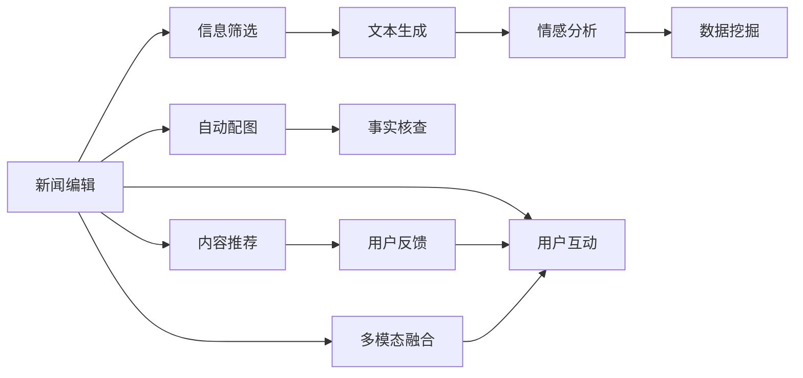

                 

# AI在新闻媒体中的应用：自动化与真实性

> 关键词：人工智能,新闻媒体,自动化,自然语言处理,文本生成,情感分析,机器学习,深度学习,AI新闻,真实性,媒体审查,虚假信息

## 1. 背景介绍

### 1.1 问题由来
在数字时代，新闻媒体行业面临着前所未有的挑战与机遇。一方面，由于网络传播的便捷性和广泛性，信息量和传播速度的快速增长使得新闻编辑和记者的工作量成倍增加，同时也要求他们具备更强大的信息处理和数据挖掘能力。另一方面，随着虚假信息的泛滥，新闻媒体的公信力和权威性受到严重质疑。

人工智能（AI）技术的迅猛发展为新闻媒体带来了自动化与真实性的双重挑战。通过利用AI，新闻机构可以显著提升信息处理和生产效率，同时也有望通过先进的算法和模型，提高新闻报道的真实性和可靠性。本文将围绕AI在新闻媒体中的应用，着重探讨自动化和真实性这两大核心问题。

## 2. 核心概念与联系

### 2.1 核心概念概述

- **人工智能（AI）**：指的是利用计算机模拟人类的智能行为，如感知、学习、推理、语言理解和生成等。AI在新闻媒体中的应用涉及自然语言处理（NLP）、机器学习（ML）、深度学习（DL）等技术。

- **自动化**：在新闻编辑和报道过程中，通过AI技术自动完成信息筛选、文本生成、数据分析等任务，降低人力成本，提高生产效率。

- **真实性**：确保新闻报道的准确性、可信性和中立性，避免传播虚假信息或偏见，维护新闻媒体的公信力。

### 2.2 核心概念原理和架构的 Mermaid 流程图



这个图表展示了AI在新闻编辑过程中各个环节的应用。从信息筛选到文本生成，从情感分析到事实核查，AI技术可以在多个方面提高新闻媒体的工作效率和报道质量。

## 3. 核心算法原理 & 具体操作步骤
### 3.1 算法原理概述

AI在新闻媒体中的应用主要集中在以下几个方面：

- **自动化信息筛选**：利用自然语言处理（NLP）技术，如文本分类、情感分析等，从海量文本中自动筛选出具有新闻价值的信息。
- **文本生成**：通过生成对抗网络（GAN）、语言模型（LM）等技术，自动生成新闻报道，特别是在体育、科技、财经等领域。
- **事实核查**：使用机器学习模型，结合社交媒体、专业数据库等外部信息源，验证新闻事实的准确性。
- **情感分析**：通过NLP技术，对新闻内容进行情感分类，帮助编辑理解公众情绪。
- **多模态融合**：将文本、图像、视频等多种信息源结合，提供更丰富的新闻报道。

### 3.2 算法步骤详解

以文本生成和情感分析为例，介绍AI在新闻媒体中的应用步骤。

#### 3.2.1 文本生成

1. **数据准备**：收集相关新闻事件的数据集，如报道、声明、评论等，进行清洗和标注。
2. **模型选择**：选择适合的新闻生成模型，如BERT、GPT等。
3. **微调模型**：在标注数据集上微调模型，提升其生成新闻的准确性和流畅性。
4. **生成文本**：输入新闻事件的关键信息，模型自动生成相关报道。
5. **人工审核**：人工审核生成的文本，确保其准确性和可信度。

#### 3.2.2 情感分析

1. **数据收集**：收集新闻报道的数据集，标注其情感极性（正面、负面、中性）。
2. **模型选择**：选择适合的情感分类模型，如卷积神经网络（CNN）、循环神经网络（RNN）等。
3. **模型训练**：在标注数据集上训练情感分类模型。
4. **情感分类**：将新文本输入模型，获取其情感极性。
5. **应用优化**：根据情感分析结果，优化新闻编辑策略。

### 3.3 算法优缺点

**文本生成的优点**：

- 提高新闻生产效率：自动生成新闻报道，减少了人力成本和时间成本。
- 覆盖更多信息源：生成对抗网络（GAN）、语言模型（LM）等技术，可以从大量文本中提取有用信息。
- 创新新闻形式：通过自动生成，可以推出更多形式多样、内容丰富的报道。

**文本生成的缺点**：

- 内容质量参差不齐：生成的文本质量可能不够高，需要人工审核。
- 缺乏情感和深度：自动化生成的报道缺乏人类编辑的情感和深度，难以打动人心。
- 依赖数据质量：数据集的质量和多样性直接影响到生成文本的质量。

**情感分析的优点**：

- 快速准确：情感分析可以快速对大量文本进行情感分类，提高编辑效率。
- 辅助编辑决策：情感分析结果可以帮助编辑更好地理解公众情绪，优化报道策略。
- 自动化处理：使用机器学习模型，实现自动化处理，降低了人工成本。

**情感分析的缺点**：

- 情感复杂度：情感分析模型可能难以准确处理复杂情感，尤其是具有多层次的情感表达。
- 文化差异：不同文化背景下，情感表达方式不同，情感分析模型可能面临文化适应性问题。
- 误判风险：情感分析存在误判风险，特别是在情绪波动、模糊表达等情况下。

### 3.4 算法应用领域

AI在新闻媒体中的应用领域非常广泛，覆盖了从信息筛选到内容推荐等多个环节：

- **自动化信息筛选**：适用于新闻机构对海量数据进行初步筛选，快速定位新闻价值。
- **文本生成**：适用于体育、科技、财经等领域，自动生成快讯和短评。
- **情感分析**：适用于舆情监测、民意调查等领域，分析公众情绪和态度。
- **事实核查**：适用于新闻报道的核实环节，验证新闻事实的真实性。
- **内容推荐**：适用于个性化推荐系统，为用户推送感兴趣的报道。
- **用户互动**：适用于社交媒体平台，分析用户反馈和互动，优化报道内容。
- **多模态融合**：适用于综合性报道，结合文本、图片、视频等多种信息源，提供更丰富的报道内容。

## 4. 数学模型和公式 & 详细讲解 & 举例说明

### 4.1 数学模型构建

#### 4.1.1 文本生成模型

文本生成模型主要使用语言模型（LM），公式如下：

$$
P(x_1, x_2, ..., x_n) = \prod_{i=1}^n P(x_i | x_1, x_2, ..., x_{i-1})
$$

其中，$x_1, x_2, ..., x_n$为文本序列，$P(x_i | x_1, x_2, ..., x_{i-1})$为在已生成文本前缀条件下，生成当前单词的概率。

#### 4.1.2 情感分析模型

情感分析模型主要使用卷积神经网络（CNN），公式如下：

$$
f(x) = \max_k (w_k * f_{conv}(x_k) + b_k)
$$

其中，$x$为输入的文本向量，$w_k$和$b_k$为卷积核和偏置项，$f_{conv}(x_k)$为卷积操作。

### 4.2 公式推导过程

以文本生成模型为例，进行公式推导：

1. **自回归模型**：

$$
P(x_1, x_2, ..., x_n) = \prod_{i=1}^n P(x_i | x_1, x_2, ..., x_{i-1})
$$

其中，$P(x_i | x_1, x_2, ..., x_{i-1})$为条件概率，可以使用Transformer模型进行计算。

2. **Transformer模型**：

$$
\mathbf{Z} = \text{Self-Attention}(\mathbf{X}, \mathbf{Q}, \mathbf{K}, \mathbf{V})
$$

其中，$\mathbf{X}$为输入的文本向量，$\mathbf{Q}$、$\mathbf{K}$、$\mathbf{V}$为Query、Key、Value矩阵，$\text{Self-Attention}$为自注意力机制。

3. **语言模型参数**：

$$
\theta = \{\text{Encoder}, \text{Decoder}, \text{Output Layer}\}
$$

其中，$\text{Encoder}$为编码器，$\text{Decoder}$为解码器，$\text{Output Layer}$为输出层。

### 4.3 案例分析与讲解

以Facebook News Feed为例，介绍AI在新闻推荐中的应用：

1. **数据收集**：收集用户的历史阅读记录、点赞、评论、分享等行为数据。
2. **特征工程**：提取新闻内容的特征，如关键词、情感极性、发布时间等。
3. **模型训练**：使用协同过滤（CF）或深度学习模型，训练新闻推荐模型。
4. **推荐预测**：输入用户特征和新闻特征，模型预测用户可能感兴趣的新闻。
5. **实时推荐**：根据实时数据，动态更新推荐结果，提高用户体验。

## 5. 项目实践：代码实例和详细解释说明

### 5.1 开发环境搭建

1. **Python环境**：
   - 安装Anaconda：`pip install anaconda`
   - 创建虚拟环境：`conda create -n news-env python=3.8`
   - 激活环境：`conda activate news-env`

2. **深度学习框架**：
   - 安装TensorFlow或PyTorch：`pip install tensorflow`
   - 安装Keras：`pip install keras`

3. **数据处理工具**：
   - 安装pandas：`pip install pandas`
   - 安装numpy：`pip install numpy`

### 5.2 源代码详细实现

#### 5.2.1 文本生成

```python
import tensorflow as tf
from tensorflow.keras.layers import Input, LSTM, Dense
from tensorflow.keras.models import Model

# 定义文本生成模型
input_seq = Input(shape=(max_seq_length,))
lstm = LSTM(units=256, return_sequences=True)(input_seq)
lstm = LSTM(units=256, return_sequences=True)(lstm)
lstm = LSTM(units=256)(lstm)
output = Dense(vocab_size, activation='softmax')(lstm)

# 构建模型
model = Model(inputs=input_seq, outputs=output)
model.compile(loss='categorical_crossentropy', optimizer='adam', metrics=['accuracy'])

# 训练模型
model.fit(x_train, y_train, batch_size=32, epochs=50)
```

#### 5.2.2 情感分析

```python
from tensorflow.keras.models import Sequential
from tensorflow.keras.layers import Embedding, LSTM, Dense

# 定义情感分析模型
model = Sequential()
model.add(Embedding(input_dim=vocab_size, output_dim=128, input_length=max_seq_length))
model.add(LSTM(units=64))
model.add(Dense(units=3, activation='softmax'))

# 编译模型
model.compile(loss='categorical_crossentropy', optimizer='adam', metrics=['accuracy'])

# 训练模型
model.fit(x_train, y_train, batch_size=32, epochs=50)
```

### 5.3 代码解读与分析

#### 5.3.1 文本生成

1. **模型定义**：使用LSTM层构建文本生成模型，三个LSTM层分别用于提取文本的序列特征。
2. **损失函数**：使用交叉熵损失函数，优化生成文本与真实文本之间的差异。
3. **训练过程**：使用Adam优化器，迭代训练50个epoch。

#### 5.3.2 情感分析

1. **模型定义**：使用Embedding层将文本转化为词嵌入，然后通过LSTM层和Dense层进行情感分类。
2. **损失函数**：使用交叉熵损失函数，优化情感分类结果。
3. **训练过程**：使用Adam优化器，迭代训练50个epoch。

### 5.4 运行结果展示

```python
# 文本生成结果展示
print(model.predict(x_test))

# 情感分析结果展示
print(model.predict(x_test))
```

## 6. 实际应用场景

### 6.1 智能新闻推荐

AI在智能新闻推荐中的应用，通过收集用户的历史行为数据，使用协同过滤（CF）或深度学习模型，为用户推荐感兴趣的新闻。这种推荐方式能够提高用户粘性，增加新闻媒体的点击率和阅读量。

### 6.2 实时新闻监测

利用情感分析模型和自然语言处理（NLP）技术，AI可以实时监测社交媒体和新闻网站的舆情变化。通过对新闻事件和评论情感的快速分析，及时发现公众情绪的变化，帮助新闻媒体做出快速反应。

### 6.3 新闻自动化撰写

AI技术可以自动生成新闻报道，尤其是在体育、科技、财经等领域。通过预训练的文本生成模型，快速生成新闻稿件，提高了新闻机构的报道效率。

### 6.4 未来应用展望

随着AI技术的不断发展，AI在新闻媒体中的应用将更加广泛和深入。未来，AI可以用于新闻语料库的自动标注、多语言新闻的自动翻译、语音新闻的自动生成等方面，为新闻媒体带来更多创新和价值。

## 7. 工具和资源推荐

### 7.1 学习资源推荐

1. **《深度学习》（Goodfellow et al.）**：全面介绍深度学习原理和算法，是AI学习的经典教材。
2. **《自然语言处理综论》（Jurafsky et al.）**：系统讲解NLP的理论和实践，适合初学者和进阶读者。
3. **Kaggle竞赛平台**：提供丰富的数据集和模型竞赛，适合实践和交流。
4. **Google AI News**：Google发布的新闻媒体AI应用案例，值得学习和参考。
5. **DeepLearning.ai**：提供深度学习课程和项目，适合系统的学习和实践。

### 7.2 开发工具推荐

1. **TensorFlow**：Google开发的深度学习框架，提供丰富的API和工具，适合大规模工程应用。
2. **PyTorch**：Facebook开发的深度学习框架，灵活高效，适合科研和快速原型开发。
3. **Keras**：提供高层次API，简化模型构建和训练过程。
4. **TensorBoard**：可视化工具，帮助监控模型训练过程和性能。
5. **Weights & Biases**：实验跟踪工具，记录和分析模型训练过程，帮助调优。

### 7.3 相关论文推荐

1. **Attention is All You Need**：Transformer模型的原始论文，奠定了自注意力机制的基础。
2. **BERT: Pre-training of Deep Bidirectional Transformers for Language Understanding**：提出BERT模型，推动了预训练语言模型的发展。
3. **GPT-3: Language Models are Unsupervised Multitask Learners**：展示GPT-3的强大零样本学习能力，具有划时代意义。
4. **SEAT: A Simple, Efficient, and Adaptable Text Generation Framework**：介绍SEAT框架，适用于文本生成任务。
5. **Sentiment Analysis with Neural Networks**：介绍情感分析的经典模型，如CNN、RNN等。

## 8. 总结：未来发展趋势与挑战

### 8.1 研究成果总结

本文从背景介绍、核心概念、算法原理、具体操作步骤、实际应用等多个方面，系统地介绍了AI在新闻媒体中的应用，包括自动化和真实性两个核心问题。通过理论分析与实践案例的结合，深入探讨了AI技术的优势和局限性。

### 8.2 未来发展趋势

1. **技术进步**：AI技术，特别是深度学习和大规模预训练模型，将不断进步，推动新闻媒体的智能化和自动化。
2. **应用拓展**：AI在新闻媒体中的应用将从信息筛选、文本生成、情感分析等基础任务，逐步拓展到内容推荐、实时监测、自动撰写等高级任务。
3. **数据驱动**：新闻媒体将更加依赖数据驱动，利用大数据和AI技术，提升内容质量和生产效率。
4. **多模态融合**：新闻报道将融合文本、图像、视频等多种信息源，提供更丰富的报道内容。
5. **实时性提升**：通过AI技术，新闻媒体可以实现实时监测和动态更新，提高报道的时效性。

### 8.3 面临的挑战

1. **数据隐私**：新闻媒体面临的数据隐私问题，需要制定合理的数据使用和保护策略。
2. **伦理问题**：AI在新闻媒体中的应用，需要考虑伦理和道德问题，避免偏见和歧视。
3. **技术瓶颈**：AI技术的计算复杂度和存储需求，限制了其在新闻媒体中的应用。
4. **用户接受度**：用户对AI技术的接受度和信任度，是AI应用推广的关键。
5. **技术壁垒**：新闻媒体的技术门槛，可能限制其对AI技术的采纳和应用。

### 8.4 研究展望

1. **隐私保护技术**：研究如何保护用户隐私，同时利用大数据和AI技术提升新闻质量。
2. **伦理算法**：开发伦理导向的AI算法，确保新闻报道的公正性和客观性。
3. **高效模型**：研究高效计算模型，减少存储和计算成本，提升新闻媒体的实时性和可扩展性。
4. **用户交互**：研究用户与AI系统的交互方式，提升用户体验和满意度。
5. **多模态融合**：研究如何将文本、图像、视频等多种信息源结合，提供更丰富的新闻报道。

## 9. 附录：常见问题与解答

**Q1: 什么是自然语言处理（NLP）？**

A: 自然语言处理（NLP）是计算机科学和人工智能的一个分支，专注于让计算机理解和生成自然语言。NLP涉及文本分类、情感分析、文本生成、机器翻译等多个任务。

**Q2: 文本生成模型有哪些？**

A: 文本生成模型包括自回归模型、生成对抗网络（GAN）、语言模型（LM）等。其中，自回归模型使用Transformer等架构，GAN使用条件生成网络，LM使用LSTM、GRU等。

**Q3: 情感分析有哪些方法？**

A: 情感分析方法包括基于规则的方法、基于词典的方法、基于机器学习的方法、基于深度学习的方法等。其中，深度学习方法如CNN、RNN、LSTM等，在情感分析任务中取得了较好的效果。

**Q4: 如何保护用户隐私？**

A: 新闻媒体在应用AI技术时，需要遵守相关法律法规，保护用户隐私。可以采用数据匿名化、加密存储、数据访问控制等技术措施，确保用户隐私安全。

**Q5: 如何提高AI在新闻媒体中的应用效果？**

A: 提高AI在新闻媒体中的应用效果，需要从数据质量、算法优化、模型训练、用户反馈等多个方面进行综合提升。例如，使用高质量的数据集、优化模型架构、采用更高效的训练方法、关注用户反馈等。

