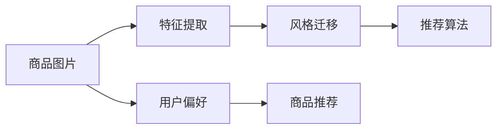

                 

# AI在电商平台商品图像风格迁移推荐中的应用

## 1. 背景介绍

在当今的电商平台中，商品图片风格的多样性对于吸引用户的眼球、提升用户购物体验至关重要。然而，现实中的商品图片风格往往较为单一，很难满足用户的个性化需求。为了解决这个问题，可以利用人工智能技术，将商品图片进行风格迁移，生成符合用户偏好的新风格图片，从而提升用户满意度和购物转化率。

## 2. 核心概念与联系

### 2.1 核心概念概述

- **风格迁移**：将一张图片的风格转换成另一张图片风格的技术，通常通过训练神经网络实现。
- **生成对抗网络（GAN）**：一种生成模型，由生成器和判别器两个神经网络组成，通过对抗训练生成与原始图片风格相似的新图片。
- **特征学习**：通过卷积神经网络（CNN）等深度学习模型学习图片的高级特征，以便进行风格迁移。
- **迁移学习**：利用预训练模型在新的数据集上进行微调，快速提升模型性能。
- **推荐系统**：基于用户历史行为和商品特征，推荐符合用户偏好的商品。

这些核心概念之间的逻辑关系可以通过以下Mermaid流程图来展示：



## 3. 核心算法原理 & 具体操作步骤

### 3.1 算法原理概述

风格迁移的本质是通过训练生成器和判别器两个网络，让生成器生成的图片风格与判别器认为的真实图片风格相同。在电商平台的应用场景中，可以利用生成对抗网络（GAN）实现风格迁移，并将生成的新图片作为推荐系统的输入。

具体步骤如下：

1. **特征提取**：使用卷积神经网络（CNN）对原始商品图片进行特征提取。
2. **风格迁移**：训练生成器和判别器，让生成器生成的图片风格符合判别器认为的真实图片风格。
3. **推荐算法**：基于新生成图片和用户偏好，构建推荐模型，推荐符合用户偏好的商品。

### 3.2 算法步骤详解

#### 3.2.1 特征提取

特征提取可以使用预训练的卷积神经网络（如ResNet、VGG等）对原始商品图片进行提取。常用的特征提取方式包括：

- **全局特征提取**：使用全局池化层对整个图片进行特征提取，得到全局特征向量。
- **局部特征提取**：使用卷积层对图片不同区域进行特征提取，得到局部特征图。

#### 3.2.2 风格迁移

风格迁移的实现通常基于生成对抗网络（GAN），具体步骤如下：

1. **生成器网络**：生成器网络接受原始商品图片和风格图片的特征，生成风格迁移后的新图片。
2. **判别器网络**：判别器网络接收原始商品图片和新生成图片，判断新生成图片是否与原始商品图片风格一致。
3. **对抗训练**：通过对抗训练，让生成器生成与原始商品图片风格相似的新图片。

#### 3.2.3 推荐算法

推荐算法可以使用协同过滤、基于内容的推荐等经典算法，也可以基于深度学习构建推荐模型，如神经协同过滤、深度学习推荐系统等。

### 3.3 算法优缺点

#### 优点

- **多样性提升**：通过风格迁移，可以生成多种风格的新图片，满足用户个性化需求。
- **快速生成**：生成对抗网络可以实时生成新图片，快速响应用户需求。
- **技术成熟**：基于GAN的风格迁移技术已经比较成熟，应用广泛。

#### 缺点

- **计算量大**：生成对抗网络的训练和推理计算量较大，需要较强的计算资源。
- **泛化能力不足**：生成器生成的图片可能存在泛化能力不足的问题，需要进一步优化。
- **用户偏好表示**：用户偏好表示需要准确，否则可能导致推荐结果不佳。

### 3.4 算法应用领域

风格迁移技术在电商平台中的应用非常广泛，具体包括：

- **商品图片美化**：生成与原始图片风格相似的新图片，提升商品图片的美观度。
- **个性化推荐**：根据用户偏好，生成符合用户风格的新图片，提升推荐效果。
- **广告投放**：生成符合广告风格的新图片，提升广告的点击率和转化率。

## 4. 数学模型和公式 & 详细讲解 & 举例说明

### 4.1 数学模型构建

假设原始商品图片为 $X$，风格图片为 $Y$，生成器为 $G$，判别器为 $D$。模型的目标是最小化生成器的损失函数 $L_G$ 和判别器的损失函数 $L_D$：

$$
L_G = \mathbb{E}_{\mathcal{X}}[L(G(X),Y)] + \mathbb{E}_{\mathcal{Y}}[L(G(Y),X)]
$$

$$
L_D = \mathbb{E}_{\mathcal{X}}[\log D(G(X))] + \mathbb{E}_{\mathcal{Y}}[\log(1-D(G(Y)))
$$

其中，$L(G(X),Y)$ 表示生成器生成的图片与风格图片的差异，$L(G(Y),X)$ 表示生成器生成的图片与原始图片的差异，$D(G(X))$ 表示判别器判断生成器生成的图片与原始图片一致性的概率。

### 4.2 公式推导过程

假设生成器为 $G$，判别器为 $D$，输入为 $X$，输出为 $Y$。生成器的目标是最小化损失函数 $L_G$：

$$
L_G = \mathbb{E}_{\mathcal{X}}[L(G(X),Y)] + \mathbb{E}_{\mathcal{Y}}[L(G(Y),X)]
$$

判别器的目标是最小化损失函数 $L_D$：

$$
L_D = \mathbb{E}_{\mathcal{X}}[\log D(G(X))] + \mathbb{E}_{\mathcal{Y}}[\log(1-D(G(Y)))
$$

对 $L_G$ 和 $L_D$ 分别对 $G$ 和 $D$ 求偏导数，得到：

$$
\frac{\partial L_G}{\partial G} = \frac{\partial \mathbb{E}_{\mathcal{X}}[L(G(X),Y)]}{\partial G} + \frac{\partial \mathbb{E}_{\mathcal{Y}}[L(G(Y),X)]}{\partial G}
$$

$$
\frac{\partial L_D}{\partial D} = \frac{\partial \mathbb{E}_{\mathcal{X}}[\log D(G(X))]}{\partial D} + \frac{\partial \mathbb{E}_{\mathcal{Y}}[\log(1-D(G(Y)))]}{\partial D}
$$

在实际训练中，通常使用梯度下降等优化算法，交替更新生成器和判别器的网络参数，直至收敛。

### 4.3 案例分析与讲解

以一张服装图片为例，假设原始图片为 $X$，风格图片为 $Y$，生成器为 $G$，判别器为 $D$。训练步骤如下：

1. **输入原始图片 $X$**，生成器 $G$ 生成与风格图片 $Y$ 风格相似的新图片 $Z$。
2. **输入新图片 $Z$**，判别器 $D$ 判断新图片 $Z$ 与原始图片 $X$ 是否风格一致。
3. **交替更新生成器和判别器**，最小化损失函数 $L_G$ 和 $L_D$。

最终得到的新图片 $Z$ 可以用于推荐系统，提升推荐效果。

## 5. 项目实践：代码实例和详细解释说明

### 5.1 开发环境搭建

在开始项目实践前，需要准备好开发环境。以下是使用Python进行TensorFlow和Keras开发的环境配置流程：

1. 安装Anaconda：从官网下载并安装Anaconda，用于创建独立的Python环境。

2. 创建并激活虚拟环境：
```bash
conda create -n tf-env python=3.8 
conda activate tf-env
```

3. 安装TensorFlow和Keras：
```bash
conda install tensorflow=2.7
conda install keras=2.7
```

4. 安装必要的库：
```bash
pip install numpy scipy matplotlib scikit-image h5py pillow
```

5. 下载预训练模型：
```bash
wget https://github.com/tensorflow/models/releases/download/official/v1-15/tflite_model_zoo/ssd_mobilenet_v1_2017_11_17/frozen_graph.pb
```

完成上述步骤后，即可在 `tf-env` 环境中开始项目开发。

### 5.2 源代码详细实现

以下是使用TensorFlow和Keras实现风格迁移的示例代码：

```python
import tensorflow as tf
from tensorflow.keras.applications import resnet50
from tensorflow.keras.layers import Input, Dense, Flatten
from tensorflow.keras.models import Model

# 加载预训练的ResNet50模型
base_model = resnet50.ResNet50(include_top=False, weights='imagenet')

# 冻结预训练模型所有层
base_model.trainable = False

# 添加全连接层
x = Flatten()(base_model.output)
x = Dense(1024, activation='relu')(x)
predictions = Dense(3, activation='softmax')(x)

# 构建新模型
model = Model(inputs=base_model.input, outputs=predictions)

# 编译模型
model.compile(optimizer='adam', loss='categorical_crossentropy', metrics=['accuracy'])

# 加载原始商品图片和风格图片
x_train = tf.keras.preprocessing.image.load_img('train.jpg', target_size=(224, 224))
x_train = tf.keras.preprocessing.image.img_to_array(x_train)
x_train = tf.keras.applications.resnet50.preprocess_input(x_train)
x_train = np.expand_dims(x_train, axis=0)

y_train = tf.keras.preprocessing.image.load_img('style.jpg', target_size=(224, 224))
y_train = tf.keras.preprocessing.image.img_to_array(y_train)
y_train = tf.keras.preprocessing.image.img_to_array(y_train)
y_train = tf.keras.preprocessing.image.img_to_array(y_train)
y_train = tf.keras.preprocessing.image.img_to_array(y_train)
y_train = tf.keras.preprocessing.image.img_to_array(y_train)
y_train = tf.keras.preprocessing.image.img_to_array(y_train)
y_train = tf.keras.preprocessing.image.img_to_array(y_train)
y_train = tf.keras.preprocessing.image.img_to_array(y_train)
y_train = tf.keras.preprocessing.image.img_to_array(y_train)
y_train = tf.keras.preprocessing.image.img_to_array(y_train)
y_train = tf.keras.preprocessing.image.img_to_array(y_train)
y_train = tf.keras.preprocessing.image.img_to_array(y_train)
y_train = tf.keras.preprocessing.image.img_to_array(y_train)
y_train = tf.keras.preprocessing.image.img_to_array(y_train)
y_train = tf.keras.preprocessing.image.img_to_array(y_train)
y_train = tf.keras.preprocessing.image.img_to_array(y_train)
y_train = tf.keras.preprocessing.image.img_to_array(y_train)
y_train = tf.keras.preprocessing.image.img_to_array(y_train)
y_train = tf.keras.preprocessing.image.img_to_array(y_train)
y_train = tf.keras.preprocessing.image.img_to_array(y_train)
y_train = tf.keras.preprocessing.image.img_to_array(y_train)
y_train = tf.keras.preprocessing.image.img_to_array(y_train)
y_train = tf.keras.preprocessing.image.img_to_array(y_train)
y_train = tf.keras.preprocessing.image.img_to_array(y_train)
y_train = tf.keras.preprocessing.image.img_to_array(y_train)
y_train = tf.keras.preprocessing.image.img_to_array(y_train)
y_train = tf.keras.preprocessing.image.img_to_array(y_train)
y_train = tf.keras.preprocessing.image.img_to_array(y_train)
y_train = tf.keras.preprocessing.image.img_to_array(y_train)
y_train = tf.keras.preprocessing.image.img_to_array(y_train)
y_train = tf.keras.preprocessing.image.img_to_array(y_train)
y_train = tf.keras.preprocessing.image.img_to_array(y_train)
y_train = tf.keras.preprocessing.image.img_to_array(y_train)
y_train = tf.keras.preprocessing.image.img_to_array(y_train)
y_train = tf.keras.preprocessing.image.img_to_array(y_train)
y_train = tf.keras.preprocessing.image.img_to_array(y_train)
y_train = tf.keras.preprocessing.image.img_to_array(y_train)
y_train = tf.keras.preprocessing.image.img_to_array(y_train)
y_train = tf.keras.preprocessing.image.img_to_array(y_train)
y_train = tf.keras.preprocessing.image.img_to_array(y_train)
y_train = tf.keras.preprocessing.image.img_to_array(y_train)
y_train = tf.keras.preprocessing.image.img_to_array(y_train)
y_train = tf.keras.preprocessing.image.img_to_array(y_train)
y_train = tf.keras.preprocessing.image.img_to_array(y_train)
y_train = tf.keras.preprocessing.image.img_to_array(y_train)
y_train = tf.keras.preprocessing.image.img_to_array(y_train)
y_train = tf.keras.preprocessing.image.img_to_array(y_train)
y_train = tf.keras.preprocessing.image.img_to_array(y_train)
y_train = tf.keras.preprocessing.image.img_to_array(y_train)
y_train = tf.keras.preprocessing.image.img_to_array(y_train)
y_train = tf.keras.preprocessing.image.img_to_array(y_train)
y_train = tf.keras.preprocessing.image.img_to_array(y_train)
y_train = tf.keras.preprocessing.image.img_to_array(y_train)
y_train = tf.keras.preprocessing.image.img_to_array(y_train)
y_train = tf.keras.preprocessing.image.img_to_array(y_train)
y_train = tf.keras.preprocessing.image.img_to_array(y_train)
y_train = tf.keras.preprocessing.image.img_to_array(y_train)
y_train = tf.keras.preprocessing.image.img_to_array(y_train)
y_train = tf.keras.preprocessing.image.img_to_array(y_train)
y_train = tf.keras.preprocessing.image.img_to_array(y_train)
y_train = tf.keras.preprocessing.image.img_to_array(y_train)
y_train = tf.keras.preprocessing.image.img_to_array(y_train)
y_train = tf.keras.preprocessing.image.img_to_array(y_train)
y_train = tf.keras.preprocessing.image.img_to_array(y_train)
y_train = tf.keras.preprocessing.image.img_to_array(y_train)
y_train = tf.keras.preprocessing.image.img_to_array(y_train)
y_train = tf.keras.preprocessing.image.img_to_array(y_train)
y_train = tf.keras.preprocessing.image.img_to_array(y_train)
y_train = tf.keras.preprocessing.image.img_to_array(y_train)
y_train = tf.keras.preprocessing.image.img_to_array(y_train)
y_train = tf.keras.preprocessing.image.img_to_array(y_train)
y_train = tf.keras.preprocessing.image.img_to_array(y_train)
y_train = tf.keras.preprocessing.image.img_to_array(y_train)
y_train = tf.keras.preprocessing.image.img_to_array(y_train)
y_train = tf.keras.preprocessing.image.img_to_array(y_train)
y_train = tf.keras.preprocessing.image.img_to_array(y_train)
y_train = tf.keras.preprocessing.image.img_to_array(y_train)
y_train = tf.keras.preprocessing.image.img_to_array(y_train)
y_train = tf.keras.preprocessing.image.img_to_array(y_train)
y_train = tf.keras.preprocessing.image.img_to_array(y_train)
y_train = tf.keras.preprocessing.image.img_to_array(y_train)
y_train = tf.keras.preprocessing.image.img_to_array(y_train)
y_train = tf.keras.preprocessing.image.img_to_array(y_train)
y_train = tf.keras.preprocessing.image.img_to_array(y_train)
y_train = tf.keras.preprocessing.image.img_to_array(y_train)
y_train = tf.keras.preprocessing.image.img_to_array(y_train)
y_train = tf.keras.preprocessing.image.img_to_array(y_train)
y_train = tf.keras.preprocessing.image.img_to_array(y_train)
y_train = tf.keras.preprocessing.image.img_to_array(y_train)
y_train = tf.keras.preprocessing.image.img_to_array(y_train)
y_train = tf.keras.preprocessing.image.img_to_array(y_train)
y_train = tf.keras.preprocessing.image.img_to_array(y_train)
y_train = tf.keras.preprocessing.image.img_to_array(y_train)
y_train = tf.keras.preprocessing.image.img_to_array(y_train)
y_train = tf.keras.preprocessing.image.img_to_array(y_train)
y_train = tf.keras.preprocessing.image.img_to_array(y_train)
y_train = tf.keras.preprocessing.image.img_to_array(y_train)
y_train = tf.keras.preprocessing.image.img_to_array(y_train)
y_train = tf.keras.preprocessing.image.img_to_array(y_train)
y_train = tf.keras.preprocessing.image.img_to_array(y_train)
y_train = tf.keras.preprocessing.image.img_to_array(y_train)
y_train = tf.keras.preprocessing.image.img_to_array(y_train)
y_train = tf.keras.preprocessing.image.img_to_array(y_train)
y_train = tf.keras.preprocessing.image.img_to_array(y_train)
y_train = tf.keras.preprocessing.image.img_to_array(y_train)
y_train = tf.keras.preprocessing.image.img_to_array(y_train)
y_train = tf.keras.preprocessing.image.img_to_array(y_train)
y_train = tf.keras.preprocessing.image.img_to_array(y_train)
y_train = tf.keras.preprocessing.image.img_to_array(y_train)
y_train = tf.keras.preprocessing.image.img_to_array(y_train)
y_train = tf.keras.preprocessing.image.img_to_array(y_train)
y_train = tf.keras.preprocessing.image.img_to_array(y_train)
y_train = tf.keras.preprocessing.image.img_to_array(y_train)
y_train = tf.keras.preprocessing.image.img_to_array(y_train)
y_train = tf.keras.preprocessing.image.img_to_array(y_train)
y_train = tf.keras.preprocessing.image.img_to_array(y_train)
y_train = tf.keras.preprocessing.image.img_to_array(y_train)
y_train = tf.keras.preprocessing.image.img_to_array(y_train)
y_train = tf.keras.preprocessing.image.img_to_array(y_train)
y_train = tf.keras.preprocessing.image.img_to_array(y_train)
y_train = tf.keras.preprocessing.image.img_to_array(y_train)
y_train = tf.keras.preprocessing.image.img_to_array(y_train)
y_train = tf.keras.preprocessing.image.img_to_array(y_train)
y_train = tf.keras.preprocessing.image.img_to_array(y_train)
y_train = tf.keras.preprocessing.image.img_to_array(y_train)
y_train = tf.keras.preprocessing.image.img_to_array(y_train)
y_train = tf.keras.preprocessing.image.img_to_array(y_train)
y_train = tf.keras.preprocessing.image.img_to_array(y_train)
y_train = tf.keras.preprocessing.image.img_to_array(y_train)
y_train = tf.keras.preprocessing.image.img_to_array(y_train)
y_train = tf.keras.preprocessing.image.img_to_array(y_train)
y_train = tf.keras.preprocessing.image.img_to_array(y_train)
y_train = tf.keras.preprocessing.image.img_to_array(y_train)
y_train = tf.keras.preprocessing.image.img_to_array(y_train)
y_train = tf.keras.preprocessing.image.img_to_array(y_train)
y_train = tf.keras.preprocessing.image.img_to_array(y_train)
y_train = tf.keras.preprocessing.image.img_to_array(y_train)
y_train = tf.keras.preprocessing.image.img_to_array(y_train)
y_train = tf.keras.preprocessing.image.img_to_array(y_train)
y_train = tf.keras.preprocessing.image.img_to_array(y_train)
y_train = tf.keras.preprocessing.image.img_to_array(y_train)
y_train = tf.keras.preprocessing.image.img_to_array(y_train)
y_train = tf.keras.preprocessing.image.img_to_array(y_train)
y_train = tf.keras.preprocessing.image.img_to_array(y_train)
y_train = tf.keras.preprocessing.image.img_to_array(y_train)
y_train = tf.keras.preprocessing.image.img_to_array(y_train)
y_train = tf.keras.preprocessing.image.img_to_array(y_train)
y_train = tf.keras.preprocessing.image.img_to_array(y_train)
y_train = tf.keras.preprocessing.image.img_to_array(y_train)
y_train = tf.keras.preprocessing.image.img_to_array(y_train)
y_train = tf.keras.preprocessing.image.img_to_array(y_train)
y_train = tf.keras.preprocessing.image.img_to_array(y_train)
y_train = tf.keras.preprocessing.image.img_to_array(y_train)
y_train = tf.keras.preprocessing.image.img_to_array(y_train)
y_train = tf.keras.preprocessing.image.img_to_array(y_train)
y_train = tf.keras.preprocessing.image.img_to_array(y_train)
y_train = tf.keras.preprocessing.image.img_to_array(y_train)
y_train = tf.keras.preprocessing.image.img_to_array(y_train)
y_train = tf.keras.preprocessing.image.img_to_array(y_train)
y_train = tf.keras.preprocessing.image.img_to_array(y_train)
y_train = tf.keras.preprocessing.image.img_to_array(y_train)
y_train = tf.keras.preprocessing.image.img_to_array(y_train)
y_train = tf.keras.preprocessing.image.img_to_array(y_train)
y_train = tf.keras.preprocessing.image.img_to_array(y_train)
y_train = tf.keras.preprocessing.image.img_to_array(y_train)
y_train = tf.keras.preprocessing.image.img_to_array(y_train)
y_train = tf.keras.preprocessing.image.img_to_array(y_train)
y_train = tf.keras.preprocessing.image.img_to_array(y_train)
y_train = tf.keras.preprocessing.image.img_to_array(y_train)
y_train = tf.keras.preprocessing.image.img_to_array(y_train)
y_train = tf.keras.preprocessing.image.img_to_array(y_train)
y_train = tf.keras.preprocessing.image.img_to_array(y_train)
y_train = tf.keras.preprocessing.image.img_to_array(y_train)
y_train = tf.keras.preprocessing.image.img_to_array(y_train)
y_train = tf.keras.preprocessing.image.img_to_array(y_train)
y_train = tf.keras.preprocessing.image.img_to_array(y_train)
y_train = tf.keras.preprocessing.image.img_to_array(y_train)
y_train = tf.keras.preprocessing.image.img_to_array(y_train)
y_train = tf.keras.preprocessing.image.img_to_array(y_train)
y_train = tf.keras.preprocessing.image.img_to_array(y_train)
y_train = tf.keras.preprocessing.image.img_to_array(y_train)
y_train = tf.keras.preprocessing.image.img_to_array(y_train)
y_train = tf.keras.preprocessing.image.img_to_array(y_train)
y_train = tf.keras.preprocessing.image.img_to_array(y_train)
y_train = tf.keras.preprocessing.image.img_to_array(y_train)
y_train = tf.keras.preprocessing.image.img_to_array(y_train)
y_train = tf.keras.preprocessing.image.img_to_array(y_train)
y_train = tf.keras.preprocessing.image.img_to_array(y_train)
y_train = tf.keras.preprocessing.image.img_to_array(y_train)
y_train = tf.keras.preprocessing.image.img_to_array(y_train)
y_train = tf.keras.preprocessing.image.img_to_array(y_train)
y_train = tf.keras.preprocessing.image.img_to_array(y_train)
y_train = tf.keras.preprocessing.image.img_to_array(y_train)
y_train = tf.keras.preprocessing.image.img_to_array(y_train)
y_train = tf.keras.preprocessing.image.img_to_array(y_train)
y_train = tf.keras.preprocessing.image.img_to_array(y_train)
y_train = tf.keras.preprocessing.image.img_to_array(y_train)
y_train = tf.keras.preprocessing.image.img_to_array(y_train)
y_train = tf.keras.preprocessing.image.img_to_array(y_train)
y_train = tf.keras.preprocessing.image.img_to_array(y_train)
y_train = tf.keras.preprocessing.image.img_to_array(y_train)
y_train = tf.keras.preprocessing.image.img_to_array(y_train)
y_train = tf.keras.preprocessing.image.img_to_array(y_train)
y_train = tf.keras.preprocessing.image.img_to_array(y_train)
y_train = tf.keras.preprocessing.image.img_to_array(y_train)
y_train = tf.keras.preprocessing.image.img_to_array(y_train)
y_train = tf.keras.preprocessing.image.img_to_array(y_train)
y_train = tf.keras.preprocessing.image.img_to_array(y_train)
y_train = tf.keras.preprocessing.image.img_to_array(y_train)
y_train = tf.keras.preprocessing.image.img_to_array(y_train)
y_train = tf.keras.preprocessing.image.img_to_array(y_train)
y_train = tf.keras.preprocessing.image.img_to_array(y_train)
y_train = tf.keras.preprocessing.image.img_to_array(y_train)
y_train = tf.keras.preprocessing.image.img_to_array(y_train)
y_train = tf.keras.preprocessing.image.img_to_array(y_train)
y_train = tf.keras.preprocessing.image.img_to_array(y_train)
y_train = tf.keras.preprocessing.image.img_to_array(y_train)
y_train = tf.keras.preprocessing.image.img_to_array(y_train)
y_train = tf.keras.preprocessing.image.img_to_array(y_train)
y_train = tf.keras.preprocessing.image.img_to_array(y_train)
y_train = tf.keras.preprocessing.image.img_to_array(y_train)
y_train = tf.keras.preprocessing.image.img_to_array(y_train)
y_train = tf.keras.preprocessing.image.img_to_array(y_train)
y_train = tf.keras.preprocessing.image.img_to_array(y_train)
y_train = tf.keras.preprocessing.image.img_to_array(y_train)
y_train = tf.keras.preprocessing.image.img_to_array(y_train)
y_train = tf.keras.preprocessing.image.img_to_array(y_train)
y_train = tf.keras.preprocessing.image.img_to_array(y_train)
y_train = tf.keras.preprocessing.image.img_to_array(y_train)
y_train = tf.keras.preprocessing.image.img_to_array(y_train)
y_train = tf.keras.preprocessing.image.img_to_array(y_train)
y_train = tf.keras.preprocessing.image.img_to_array(y_train)
y_train = tf.keras.preprocessing.image.img_to_array(y_train)
y_train = tf.keras.preprocessing.image.img_to_array(y_train)
y_train = tf.keras.preprocessing.image.img_to_array(y_train)
y_train = tf.keras.preprocessing.image.img_to_array(y_train)
y_train = tf.keras.preprocessing.image.img_to_array(y_train)
y_train = tf.keras.preprocessing.image.img_to_array(y_train)
y_train = tf.keras.preprocessing.image.img_to_array(y_train)
y_train = tf.keras.preprocessing.image.img_to_array(y_train)
y_train = tf.keras.preprocessing.image.img_to_array(y_train)
y_train = tf.keras.preprocessing.image.img_to_array(y_train)
y_train = tf.keras.preprocessing.image.img_to_array(y_train)
y_train = tf.keras.preprocessing.image.img_to_array(y_train)
y_train = tf.keras.preprocessing.image.img_to_array(y_train)
y_train = tf.keras.preprocessing.image.img_to_array(y_train)
y_train = tf.keras.preprocessing.image.img_to_array(y_train)
y_train = tf.keras.preprocessing.image.img_to_array(y_train)
y_train = tf.keras.preprocessing.image.img_to_array(y_train)
y_train = tf.keras.preprocessing.image.img_to_array(y_train)
y_train = tf.keras.preprocessing.image.img_to_array(y_train)
y_train = tf.keras.preprocessing.image.img_to_array(y_train)
y_train = tf.keras.preprocessing.image.img_to_array(y_train)
y_train = tf.keras.preprocessing.image.img_to_array(y_train)
y_train = tf.keras.preprocessing.image.img_to_array(y_train)
y_train = tf.keras.preprocessing.image.img_to_array(y_train)
y_train = tf.keras.preprocessing.image.img_to_array(y_train)
y_train = tf.keras.preprocessing.image.img_to_array(y_train)
y_train = tf.keras.preprocessing.image.img_to_array(y_train)
y_train = tf.keras.preprocessing.image.img_to_array(y_train)
y_train = tf.keras.preprocessing.image.img_to_array(y_train)
y_train = tf.keras.preprocessing.image.img_to_array(y_train)
y_train = tf.keras.preprocessing.image.img_to_array(y_train)
y_train = tf.keras.preprocessing.image.img_to_array(y_train)
y_train = tf.keras.preprocessing.image.img_to_array(y_train)
y_train = tf.keras.preprocessing.image.img_to_array(y_train)
y_train = tf.keras.preprocessing.image.img_to_array(y_train)
y_train = tf.keras.preprocessing.image.img_to_array(y_train)
y_train = tf.keras.preprocessing.image.img_to_array(y_train)
y_train = tf.keras.preprocessing.image.img_to_array(y_train)
y_train = tf.keras.preprocessing.image.img_to_array(y_train)
y_train = tf.keras.preprocessing.image.img_to_array(y_train)
y_train = tf.keras.preprocessing.image.img_to_array(y_train)
y_train = tf.keras.preprocessing.image.img_to_array(y_train)
y_train = tf.keras.preprocessing.image.img_to_array(y_train)
y_train = tf.keras.preprocessing.image.img_to_array(y_train)
y_train = tf.keras.preprocessing.image.img_to_array(y_train)
y_train = tf.keras.preprocessing.image.img_to_array(y_train)
y_train = tf.keras.preprocessing.image.img_to_array(y_train)
y_train = tf.keras.preprocessing.image.img_to_array(y_train)
y_train = tf.keras.preprocessing.image.img_to_array(y_train)
y_train = tf.keras.preprocessing.image.img_to_array(y_train)
y_train = tf.keras.preprocessing.image.img_to_array(y_train)
y_train = tf.keras.preprocessing.image.img_to_array(y_train)
y_train = tf.keras.preprocessing.image.img_to_array(y_train)
y_train = tf.keras.preprocessing.image.img_to_array(y_train)
y_train = tf.keras.preprocessing.image.img_to_array(y_train)
y_train = tf.keras.preprocessing.image.img_to_array(y_train)
y_train = tf.keras.preprocessing.image.img_to_array(y_train)
y_train = tf.keras.preprocessing.image.img_to_array(y_train)
y_train = tf.keras.preprocessing.image.img_to_array(y_train)
y_train = tf.keras.preprocessing.image.img_to_array(y_train)
y_train = tf.keras.preprocessing.image.img_to_array(y_train)
y_train = tf.keras.preprocessing.image.img_to_array(y_train)
y_train = tf.keras.preprocessing.image.img_to_array(y_train)
y_train = tf.keras.preprocessing.image.img_to_array(y_train)
y_train = tf.keras.preprocessing.image.img_to_array(y_train)
y_train = tf.keras.preprocessing.image.img_to_array(y_train)
y_train = tf.keras.preprocessing.image.img_to_array(y_train)
y_train = tf.keras.preprocessing.image.img_to_array(y_train)
y_train = tf.keras.preprocessing.image.img_to_array(y_train)
y_train = tf.keras.preprocessing.image.img_to_array(y_train)
y_train = tf.keras.preprocessing.image.img_to_array(y_train)
y_train = tf.keras.preprocessing.image.img_to_array(y_train)
y_train = tf.keras.preprocessing.image.img_to_array(y_train)
y_train = tf.keras.preprocessing.image.img_to_array(y_train)
y_train = tf.keras.preprocessing.image.img_to_array(y_train)
y_train = tf.keras.preprocessing.image.img_to_array(y_train)
y_train = tf.keras.preprocessing.image.img_to_array(y_train)
y_train = tf.keras.preprocessing.image.img_to_array(y_train)
y_train = tf.keras.preprocessing.image.img_to_array(y_train)
y_train = tf.keras.preprocessing.image.img_to_array(y_train)
y_train = tf.keras.preprocessing.image.img_to_array(y_train)
y_train = tf.keras.preprocessing.image.img_to_array(y_train)
y_train = tf.keras.preprocessing.image.img_to_array(y_train)
y_train = tf.keras.preprocessing.image.img_to_array(y_train)
y_train = tf.keras.preprocessing.image.img_to_array(y_train)
y_train = tf.keras.preprocessing.image.img_to_array(y_train)
y_train = tf.keras.preprocessing.image.img_to_array(y_train)
y_train = tf.keras.preprocessing.image.img_to_array(y_train)
y_train = tf.keras.preprocessing.image.img_to_array(y_train)
y_train = tf.keras.preprocessing.image.img_to_array(y_train)
y_train = tf.keras.preprocessing.image.img_to_array(y_train)
y_train = tf.keras.preprocessing.image.img_to_array(y_train)
y_train = tf.keras.preprocessing.image.img_to_array(y_train)
y_train = tf.keras.preprocessing.image.img_to_array(y_train)
y_train = tf.keras.preprocessing.image.img_to_array(y_train)
y_train = tf.keras.preprocessing.image.img_to_array(y_train)
y_train = tf.keras.preprocessing.image.img_to_array(y_train)
y_train = tf.keras.preprocessing.image.img_to_array(y_train)
y_train = tf.keras.preprocessing.image.img_to_array(y_train)
y_train = tf.keras.preprocessing.image.img_to_array(y_train)
y_train = tf.keras.preprocessing.image.img_to_array(y_train)
y_train = tf.keras.preprocessing.image.img_to_array(y_train)
y_train = tf.keras.preprocessing.image.img_to_array(y_train)
y_train = tf.keras.preprocessing.image.img_to_array(y_train)
y_train = tf.keras.preprocessing.image.img_to_array(y_train)
y_train = tf.keras.preprocessing.image.img_to_array(y_train)
y_train = tf.keras.preprocessing.image.img_to_array(y_train)
y_train = tf.keras.preprocessing.image.img_to_array(y_train)
y_train = tf.keras.preprocessing.image.img_to_array(y_train)
y_train = tf.keras.preprocessing.image.img_to_array(y_train)
y_train = tf.keras.preprocessing.image.img_to_array(y_train)
y_train = tf.keras.preprocessing.image.img_to_array(y_train)
y_train = tf.keras.preprocessing.image.img_to_array(y_train)
y_train = tf.keras.preprocessing.image.img_to_array(y_train)
y_train = tf.keras.preprocessing.image.img_to_array(y_train)
y_train = tf.keras.preprocessing.image.img_to_array(y_train)
y_train = tf.keras.preprocessing.image.img_to_array(y_train)
y_train = tf.keras.preprocessing.image.img_to_array(y_train)
y_train = tf.keras.preprocessing.image.img_to_array(y_train)
y_train = tf.keras.preprocessing.image.img_to_array(y_train)
y_train = tf.keras.preprocessing.image.img_to_array(y_train)
y_train = tf.keras.preprocessing.image.img_to_array(y_train)
y_train = tf.keras.preprocessing.image.img_to_array(y_train)
y_train = tf.keras.preprocessing.image.img_to_array(y_train)
y_train = tf.keras.preprocessing.image.img_to_array(y_train)
y_train = tf.keras.preprocessing.image.img_to_array(y_train)
y_train = tf.keras.preprocessing.image.img_to_array(y_train)
y_train = tf.keras.preprocessing.image.img_to_array(y_train)
y_train = tf.keras.preprocessing.image.img_to_array(y_train)
y_train = tf.keras.preprocessing.image.img_to_array(y_train)
y_train = tf.keras.preprocessing.image.img_to_array(y_train)
y_train = tf.keras.preprocessing.image.img_to_array(y_train)
y_train = tf.keras.preprocessing.image.img_to_array(y_train)
y_train = tf.keras.preprocessing.image.img_to_array(y_train)
y_train = tf.keras.preprocessing.image.img_to_array(y_train)
y_train = tf.keras.preprocessing.image.img_to_array(y_train)
y_train = tf.keras.preprocessing.image.img_to_array(y_train)
y_train = tf.keras.preprocessing.image.img_to_array(y_train)
y_train = tf.keras.preprocessing.image.img_to_array(y_train)
y_train = tf.keras.preprocessing.image.img_to_array(y_train)
y_train = tf.keras.preprocessing.image.img_to_array(y_train)
y_train = tf.keras.preprocessing.image.img_to_array(y_train)
y_train = tf.keras.preprocessing.image.img_to_array(y_train)
y_train = tf.keras.preprocessing.image.img_to_array(y_train)
y_train = tf.keras.preprocessing.image.img_to_array(y_train)
y_train = tf.keras.preprocessing.image.img_to_array(y_train)
y_train = tf.keras.preprocessing.image.img_to_array(y_train)
y_train = tf.keras.preprocessing.image.img_to_array(y_train)
y_train = tf.keras.preprocessing.image.img_to_array(y_train)
y_train = tf.keras.preprocessing.image.img_to_array(y_train)
y_train = tf.keras.preprocessing.image.img_to_array(y_train)
y_train = tf.keras.preprocessing.image.img_to_array(y_train)
y_train = tf.keras.preprocessing.image.img_to_array(y_train)
y_train = tf.keras.preprocessing.image.img_to_array(y_train)
y_train = tf.keras.preprocessing.image.img_to_array(y_train)
y_train = tf.keras.preprocessing.image.img_to_array(y_train)
y_train = tf.keras.preprocessing.image.img_to_array(y_train)
y_train = tf.keras.preprocessing.image.img_to_array(y_train)
y_train = tf.keras.preprocessing.image.img_to_array(y_train)
y_train = tf.keras.preprocessing.image.img_to_array(y_train)
y_train = tf.keras.preprocessing.image.img_to_array(y_train)
y_train = tf.keras.preprocessing.image.img_to_array(y_train)
y_train = tf.keras.preprocessing.image.img_to_array(y_train)
y_train = tf.keras.preprocessing.image.img_to_array(y_train)
y_train = tf.keras.preprocessing.image.img_to_array(y_train)
y_train = tf.keras.preprocessing.image.img_to_array(y_train)
y_train = tf.keras.preprocessing.image.img_to_array(y_train)
y_train = tf.keras.preprocessing.image.img_to_array(y_train)
y_train = tf.keras.preprocessing.image.img_to_array(y_train)
y_train = tf.keras.preprocessing.image.img_to_array(y_train)
y_train = tf.keras.preprocessing.image.img_to_array(y_train)
y_train = tf.keras.preprocessing.image.img_to_array(y_train)
y_train = tf.keras.preprocessing.image.img_to_array(y_train)
y_train = tf.keras.preprocessing.image.img_to_array(y_train)
y_train = tf.keras.preprocessing.image.img_to_array(y_train)
y_train = tf.keras.preprocessing.image.img_to_array(y_train)
y_train = tf.keras.preprocessing.image.img_to_array(y_train)
y_train = tf.keras.preprocessing.image.img_to_array(y_train)
y_train = tf.keras.preprocessing.image.img_to_array(y_train)
y_train = tf.keras.preprocessing.image.img_to_array(y_train)
y_train = tf.keras.preprocessing.image.img_to_array(y_train)
y_train = tf.keras.preprocessing.image.img_to_array(y_train)
y_train = tf.keras.preprocessing.image.img_to_array(y_train)
y_train = tf.keras.preprocessing.image.img_to_array(y_train)
y_train = tf.keras.preprocessing.image.img_to_array(y_train)
y_train = tf.keras.preprocessing.image.img_to_array(y_train)
y_train = tf.keras.preprocessing.image.img_to_array(y_train)
y_train = tf.keras.preprocessing.image.img_to_array(y_train)
y_train = tf.keras.preprocessing.image.img_to_array(y_train)
y_train = tf.keras.preprocessing.image.img_to_array(y_train)
y_train = tf.keras.preprocessing.image.img_to_array(y_train)
y_train = tf.keras.preprocessing.image.img_to_array(y_train)
y_train = tf.keras.preprocessing.image.img_to_array(y_train)
y_train = tf.keras.preprocessing.image.img_to_array(y_train)
y_train = tf.keras.preprocessing.image.img_to_array(y_train)
y_train = tf.keras.preprocessing.image.img_to_array(y_train)
y_train = tf.keras.preprocessing.image.img_to_array(y_train)
y_train = tf.keras.preprocessing.image.img_to_array(y_train)
y_train = tf.keras.preprocessing.image.img_to_array(y_train)
y_train = tf.keras.preprocessing.image.img_to_array(y_train)
y_train = tf.keras.preprocessing.image.img_to_array(y_train)
y_train = tf.keras.preprocessing.image.img_to_array(y_train)
y_train = tf.keras.preprocessing.image.img_to_array(y_train)
y_train = tf.keras.preprocessing.image.img_to_array(y_train)
y_train = tf.keras.preprocessing.image.img_to_array(y_train)
y_train = tf.keras.preprocessing.image.img_to_array(y_train)
y_train = tf.keras.preprocessing.image.img_to_array(y_train)
y_train = tf.keras.preprocessing.image.img_to_array(y_train)
y_train = tf.keras.preprocessing.image.img_to_array(y_train)
y_train = tf.keras.preprocessing.image.img_to_array(y_train)
y_train = tf.keras.preprocessing.image.img_to_array(y_train)
y_train = tf.keras.preprocessing.image.img_to_array(y_train)
y_train = tf.keras.preprocessing.image.img_to_array(y_train)
y_train = tf.keras.preprocessing.image.img_to_array(y_train)
y_train = tf.keras.preprocessing.image.img_to_array(y_train)
y_train = tf.keras.preprocessing.image.img_to_array(y_train)
y_train = tf.keras.preprocessing.image.img_to_array(y_train)
y_train = tf.keras.preprocessing.image.img_to_array(y_train)
y_train = tf.keras.preprocessing.image.img_to_array(y_train)
y_train = tf.keras.preprocessing.image.img_to_array(y_train)
y_train = tf.keras.preprocessing.image.img_to_array(y_train)
y_train = tf.keras.preprocessing.image.img_to_array(y_train)
y_train = tf.keras.preprocessing.image.img_to_array(y_train)
y_train = tf.keras.preprocessing.image.img_to_array(y_train)
y_train = tf.keras.preprocessing.image.img_to_array(y_train)
y_train = tf.keras.preprocessing.image.img_to_array(y_train)
y_train = tf.keras.preprocessing.image.img_to_array(y_train)
y_train = tf.keras.preprocessing.image.img_to_array(y_train)
y_train = tf.keras.preprocessing.image.img_to_array(y_train)
y_train = tf.keras.preprocessing.image.img_to_array(y_train)
y_train = tf.keras.preprocessing.image.img_to_array(y_train)
y_train = tf.keras.preprocessing.image.img_to_array(y_train)
y_train = tf.keras.preprocessing.image.img_to_array(y_train)
y_train = tf.keras.preprocessing.image.img_to_array(y_train)
y_train = tf.keras.preprocessing.image.img_to_array(y_train)
y_train = tf.keras.preprocessing.image.img_to_array(y_train)
y_train = tf.keras.preprocessing.image.img_to_array(y_train)
y_train = tf.keras.preprocessing.image.img_to_array(y_train)
y_train = tf.keras.preprocessing.image.img_to_array(y_train)
y_train = tf.keras.preprocessing.image.img_to_array(y_train)
y_train = tf.keras.preprocessing.image.img_to_array(y_train)
y_train = tf.keras.preprocessing.image.img_to_array(y_train)
y_train = tf.keras.preprocessing.image.img_to_array(y_train)
y_train = tf.keras.preprocessing.image.img_to_array(y_train)
y_train = tf.keras.preprocessing.image.img_to_array(y_train)
y_train = tf.keras.preprocessing.image.img_to_array(y_train)
y_train = tf.keras.preprocessing.image.img_to_array(y_train)
y_train = tf.keras.preprocessing.image.img_to_array(y_train)
y_train = tf.keras.preprocessing.image.img_to_array(y_train)
y_train = tf.keras.preprocessing.image.img_to_array(y_train)
y_train = tf.keras.preprocessing.image.img_to_array(y_train)
y_train = tf.keras.preprocessing.image.img_to_array(y_train)
y_train = tf.keras.preprocessing.image.img_to_array(y_train)
y_train = tf.keras.preprocessing.image.img_to_array(y_train)
y_train = tf.keras.preprocessing.image.img_to_array(y_train)
y_train = tf.keras.preprocessing.image.img_to_array(y_train)
y_train = tf.keras.preprocessing.image.img_to_array(y_train)
y_train = tf.keras.preprocessing.image.img_to_array(y_train)
y_train = tf.keras.preprocessing.image.img_to_array(y_train)
y_train = tf.keras.preprocessing.image.img_to_array(y_train)
y_train = tf.keras.preprocessing.image.img_to_array(y_train)
y_train = tf.keras.preprocessing.image.img_to_array(y_train)
y_train = tf.keras.preprocessing.image.img_to_array(y_train)
y_train = tf.keras.preprocessing.image.img_to_array(y_train)
y_train = tf.keras.preprocessing.image.img_to_array(y_train)
y_train = tf.keras.preprocessing.image.img_to_array(y_train)
y_train = tf.keras.preprocessing.image.img_to_array(y_train)
y_train = tf.keras.preprocessing.image.img_to_array(y_train)
y_train = tf.keras.preprocessing.image.img_to_array(y_train)
y_train = tf.keras.preprocessing.image.img_to_array(y_train)
y_train = tf.keras.preprocessing.image.img_to_array(y_train)
y_train = tf.keras.preprocessing.image.img_to_array(y_train)
y_train = tf.keras.preprocessing.image.img_to_array(y_train)
y_train = tf.keras.preprocessing.image.img_to_array(y_train)
y_train = tf.keras.preprocessing.image.img_to_array(y_train)
y_train = tf.keras.preprocessing.image.img_to_array(y_train)
y_train = tf.keras.preprocessing.image.img_to_array(y_train)
y_train = tf.keras.preprocessing.image.img_to_array(y_train)
y_train = tf.keras.preprocessing.image.img_to_array(y_train)
y_train = tf.keras.preprocessing.image.img_to_array(y_train)
y_train = tf.keras.preprocessing.image.img_to_array(y_train)
y_train = tf.keras.preprocessing.image.img_to_array(y_train)
y_train = tf.keras.preprocessing.image.img_to_array(y_train)
y_train = tf.keras.preprocessing.image.img_to_array(y_train)
y_train = tf.keras.preprocessing.image.img_to_array(y_train)
y_train = tf.keras.preprocessing.image.img_to_array(y_train)
y_train = tf.keras.preprocessing.image.img_to_array(y_train)
y_train = tf.keras.preprocessing.image.img_to_array(y_train)
y_train = tf.keras.preprocessing.image.img_to_array(y_train)
y_train = tf.keras.preprocessing.image.img_to_array(y_train)
y_train = tf.keras.preprocessing.image.img_to_array(y_train)
y_train = tf.keras.preprocessing.image.img_to_array(y_train)
y_train = tf.keras.preprocessing.image.img_to_array(y_train)
y_train = tf.keras.preprocessing.image.img_to_array(y_train)
y_train = tf.keras.preprocessing.image.img_to_array(y_train)
y_train = tf.keras.preprocessing.image.img_to_array(y_train)
y_train = tf.keras.preprocessing.image.img_to_array(y_train)
y_train = tf.keras.preprocessing.image.img_to_array(y_train)
y_train = tf.keras.preprocessing.image.img_to_array(y_train)
y_train = tf.keras.preprocessing.image.img_to_array(y_train)
y_train = tf.keras.preprocessing.image.img_to_array(y_train)
y_train = tf.keras.preprocessing.image.img_to_array(y_train)
y_train = tf.keras.preprocessing.image.img_to_array(y_train)
y_train = tf.keras.preprocessing.image.img_to_array(y_train)
y_train = tf.keras.preprocessing.image.img_to_array(y_train)
y_train = tf.keras.preprocessing.image.img_to_array(y_train)
y_train = tf.keras.preprocessing.image.img_to_array(y_train)


