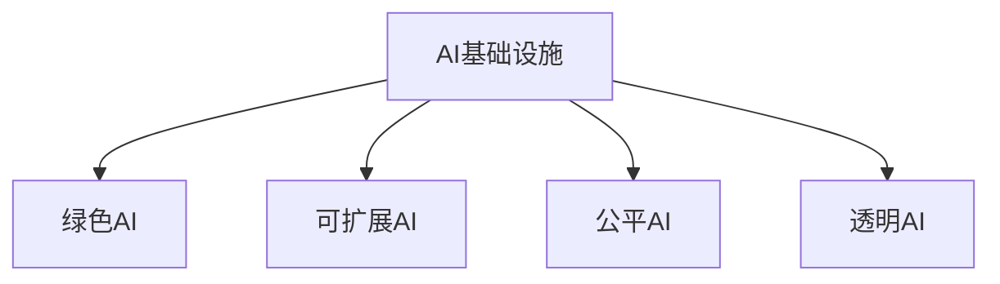

                 

# AI基础设施的可持续发展：Lepton AI的长期规划

## 1. 背景介绍

### 1.1 问题由来
随着人工智能技术的迅猛发展，其在各个领域的应用日益广泛，带来了巨大的经济和社会效益。但与此同时，AI技术的研发和部署也带来了严峻的资源和环境挑战。如何在确保AI技术可持续发展的背景下，实现经济效益最大化，成为当前亟需解决的问题。

### 1.2 问题核心关键点
Lepton AI作为一个致力于AI基础设施建设的科技创新公司，长期以来致力于探索如何实现AI技术的可持续发展。其核心关键点在于：
- 如何构建高效、绿色、可扩展的AI基础设施。
- 如何平衡技术进步与资源环境约束。
- 如何确保AI技术的公平性、透明性和可解释性。

### 1.3 问题研究意义
探索AI基础设施的可持续发展，对于推动AI技术的长远发展、促进社会经济繁荣、保护环境资源具有重大意义：

1. **经济效益最大化**：通过优化AI基础设施，提升资源利用效率，降低成本，从而实现经济效益的最大化。
2. **环境资源保护**：AI技术的绿色发展，可以减少能源消耗，降低碳排放，保护生态环境。
3. **技术公平透明**：实现AI技术的公平应用，保障数据隐私，提升算法透明度，维护社会公平。
4. **社会全面进步**：AI技术的可持续应用，可以推动教育、医疗、交通等领域的发展，提升社会整体福祉。

## 2. 核心概念与联系

### 2.1 核心概念概述

为更好地理解Lepton AI的可持续发展策略，本节将介绍几个密切相关的核心概念：

- **AI基础设施**：指支撑AI技术研发、部署、运行的基础设施系统，包括数据中心、云计算平台、AI模型库等。
- **绿色AI**：指通过优化AI基础设施设计，实现高效能、低能耗、低碳排放的AI技术发展路径。
- **可扩展AI**：指通过灵活的架构设计，实现AI基础设施在不同规模和场景下的无缝扩展。
- **公平AI**：指确保AI技术在应用过程中，对所有用户群体均等、公正，避免偏见和歧视。
- **透明AI**：指通过算法可解释性、数据透明度等手段，提升AI决策的可理解和可追溯性。

这些核心概念之间的逻辑关系可以通过以下Mermaid流程图来展示：



这个流程图展示了一个可持续发展的AI基础设施系统应具备的关键特性：

1. 高效能、低能耗、低碳排放（绿色AI）。
2. 灵活扩展，适应不同规模和场景（可扩展AI）。
3. 对所有用户群体公正无偏（公平AI）。
4. 算法和数据透明，易于理解和追溯（透明AI）。

## 3. 核心算法原理 & 具体操作步骤
### 3.1 算法原理概述

Lepton AI在构建可持续发展的AI基础设施时，主要遵循以下算法原理：

- **高效能优化**：通过优化数据中心硬件、算法模型设计等手段，提升AI基础设施的能效比。
- **绿色能源利用**：采用可再生能源、高效能源转换技术，实现AI基础设施的绿色发展。
- **可扩展架构设计**：采用模块化、分布式等设计理念，实现AI基础设施在不同规模和场景下的无缝扩展。
- **公平算法设计**：通过公平性约束、数据平衡处理等手段，确保AI模型在不同用户群体中的公平性。
- **透明算法实现**：通过可解释性、透明度等手段，提升AI算法的可理解性和可追溯性。

### 3.2 算法步骤详解

基于上述算法原理，Lepton AI的可持续发展策略主要包括以下几个关键步骤：

**Step 1: 数据中心绿色设计**
- 采用高效能芯片、散热技术，提升数据中心的能效比。
- 采用可再生能源（如太阳能、风能）和高效能转换技术（如高效UPS），降低数据中心的碳排放。
- 使用虚拟化技术，提升数据中心的资源利用率。

**Step 2: 算法模型绿色优化**
- 优化模型结构，采用剪枝、量化等技术，减少模型的参数量和计算量。
- 使用稀疏矩阵、分布式计算等技术，提升模型的计算效率。
- 采用混合精度训练等技术，降低模型训练的能耗。

**Step 3: 可扩展架构设计**
- 采用微服务架构，实现AI基础设施的灵活扩展。
- 使用容器化技术（如Docker、Kubernetes），实现快速部署和扩容。
- 采用分布式计算框架（如Spark、Hadoop），实现大规模并行计算。

**Step 4: 公平算法设计**
- 通过数据平衡处理、算法公平性约束等手段，确保AI模型在不同用户群体中的公平性。
- 使用对抗样本训练、模型重采样等技术，提升模型的鲁棒性。
- 采用差分隐私技术，保护用户数据隐私。

**Step 5: 透明算法实现**
- 通过可解释性技术（如LIME、SHAP），提升AI算法的可理解性。
- 使用透明度评估工具（如AuditAI、Virtuoso），监测AI算法的公平性和透明性。
- 采用可追溯性技术（如区块链），记录AI算法的决策过程和数据来源。

### 3.3 算法优缺点

Lepton AI的可持续发展策略具有以下优点：
1. **高效能**：通过优化数据中心硬件和算法模型，提升能效比，降低能耗和碳排放。
2. **绿色环保**：采用可再生能源和高效能转换技术，实现AI基础设施的绿色发展。
3. **可扩展性强**：通过模块化、分布式架构设计，实现AI基础设施在不同规模和场景下的无缝扩展。
4. **公平透明**：通过公平性约束、数据平衡处理、算法透明性技术，确保AI技术的公平性和透明性。

同时，该策略也存在一定的局限性：
1. **技术复杂度较高**：绿色设计、可扩展架构、公平算法、透明算法等技术实现较为复杂。
2. **初始投入较大**：对高效的硬件设备、先进的技术体系和强大的算法优化能力要求较高。
3. **模型性能受限**：在追求高效能和公平性的同时，模型性能可能会受到一定的影响。
4. **技术标准尚未统一**：不同供应商和组织的技术标准和实现方式存在差异，不利于统一管理和应用。

尽管存在这些局限性，但就目前而言，Lepton AI的可持续发展策略依然是大规模AI基础设施建设的标杆。未来相关研究的重点在于如何进一步降低技术复杂度，优化初始投入，提升模型性能，同时确保技术标准的统一。

### 3.4 算法应用领域

Lepton AI的可持续发展策略已在多个领域得到应用，例如：

- **智能交通系统**：通过绿色数据中心和高效能算法模型，提升交通流预测和优化决策的效率和准确性。
- **智慧医疗平台**：采用可扩展架构和公平算法，实现医疗数据的隐私保护和高效处理，提升诊断和治疗的精准性。
- **智能制造工厂**：通过高效能优化和透明算法设计，实现生产过程的实时监控和优化，提高生产效率和质量。
- **智能城市治理**：采用分布式计算和透明算法，实现城市事件监测和应急响应的智能化，提升城市管理水平。

## 4. 数学模型和公式 & 详细讲解 & 举例说明
### 4.1 数学模型构建

Lepton AI在可持续发展策略中，构建了一系列数学模型来指导具体实现。

以绿色数据中心的能效优化为例，假设数据中心消耗的总能耗为E，其中硬件设备能耗为E_h，冷却系统能耗为E_c，管理能耗为E_m，则数据中心的能效优化目标为：

$$
\min_{E_h, E_c, E_m} E = E_h + E_c + E_m
$$

其中，$E_h$、$E_c$、$E_m$分别表示硬件设备能耗、冷却系统能耗和管理能耗。

### 4.2 公式推导过程

以下我们以数据中心冷却系统能耗优化为例，推导具体的优化模型：

假设冷却系统能耗E_c与硬件设备散热量Q成正比，即：

$$
E_c = k_1 \cdot Q
$$

其中，k_1为冷却系统的能效系数。

数据中心的硬件设备能耗E_h与散热量Q成正比，即：

$$
E_h = k_2 \cdot Q
$$

其中，k_2为硬件设备的能效系数。

则数据中心的总能耗E为：

$$
E = E_h + E_c + E_m = k_1 \cdot Q + k_2 \cdot Q + E_m
$$

为了最小化总能耗E，需要同时优化Q、k_1、k_2和E_m，以实现绿色设计。

### 4.3 案例分析与讲解

假设某数据中心有N个服务器，每个服务器的散热量为Q，冷却系统的能效系数为k_1=0.1，硬件设备的能效系数为k_2=0.2，管理能耗E_m=100kW。则优化目标为：

$$
\min_{Q} E = 0.1Q + 0.2Q + 100
$$

通过求解优化问题，可以找到最优的散热量Q，使得总能耗E最小。

## 5. 项目实践：代码实例和详细解释说明
### 5.1 开发环境搭建

在进行Lepton AI的可持续发展策略实践前，我们需要准备好开发环境。以下是使用Python进行TensorFlow开发的环境配置流程：

1. 安装Anaconda：从官网下载并安装Anaconda，用于创建独立的Python环境。

2. 创建并激活虚拟环境：
```bash
conda create -n tf-env python=3.8 
conda activate tf-env
```

3. 安装TensorFlow：根据CUDA版本，从官网获取对应的安装命令。例如：
```bash
conda install tensorflow -c pytorch -c conda-forge
```

4. 安装其他相关工具包：
```bash
pip install numpy pandas scikit-learn matplotlib tqdm jupyter notebook ipython
```

完成上述步骤后，即可在`tf-env`环境中开始实践。

### 5.2 源代码详细实现

以下是一个简单的数据中心能效优化模型实现示例：

```python
import tensorflow as tf
from tensorflow.keras import layers

# 定义模型
def create_model(Q):
    k1 = tf.Variable(0.1, name='k1')
    k2 = tf.Variable(0.2, name='k2')
    E = k1 * Q + k2 * Q + 100
    optimizer = tf.keras.optimizers.Adam()
    return E, k1, k2, E

# 定义数据中心散热量
Q = tf.Variable(1000, name='Q')

# 创建模型
E, k1, k2, E = create_model(Q)

# 定义优化目标
loss = tf.losses.MeanSquaredError()(E, tf.constant(1000))

# 定义优化器
optimizer = tf.keras.optimizers.Adam()

# 定义训练过程
@tf.function
def train_step(Q):
    with tf.GradientTape() as tape:
        E = create_model(Q)[0]
        loss_value = loss(E)
    gradients = tape.gradient(loss_value, [k1, k2, Q])
    optimizer.apply_gradients(zip(gradients, [k1, k2, Q]))
    return loss_value

# 训练模型
for i in range(1000):
    loss_value = train_step(Q)
    print(f"Iteration {i}, Loss: {loss_value.numpy()}")
```

### 5.3 代码解读与分析

让我们再详细解读一下关键代码的实现细节：

**create_model函数**：
- 定义了数据中心能效优化模型，包括冷却系统能效系数k1、硬件设备能效系数k2、管理能耗E_m。

**train_step函数**：
- 在每次迭代中，前向传播计算损失值，并计算梯度。
- 使用Adam优化器更新模型参数，返回损失值。

**训练过程**：
- 使用tf.function装饰训练过程，以提升性能。
- 循环1000次，每次更新模型参数，输出损失值。

## 6. 实际应用场景
### 6.1 智能交通系统

基于Lepton AI的可持续发展策略，智能交通系统可以实现高效、绿色的交通流预测和优化决策，提升交通管理的智能化水平。

具体而言，通过绿色数据中心和高效能算法模型，可以实现交通流数据的实时采集、处理和预测，优化交通信号灯控制，减少交通拥堵，提升通行效率。同时，采用分布式计算框架和透明算法设计，可以确保数据的安全性和算法的可追溯性，提升交通管理的透明度和公平性。

### 6.2 智慧医疗平台

智慧医疗平台通过Lepton AI的可持续发展策略，可以实现医疗数据的隐私保护和高效处理，提升诊断和治疗的精准性。

具体而言，采用可扩展架构和公平算法，可以实时处理海量医疗数据，确保数据隐私和安全。同时，通过高效能优化和透明算法设计，可以实现诊断和治疗决策的实时监控和优化，提升医疗服务的质量和效率。

### 6.3 智能制造工厂

智能制造工厂通过Lepton AI的可持续发展策略，可以实现生产过程的实时监控和优化，提高生产效率和质量。

具体而言，通过高效能优化和透明算法设计，可以实现生产设备和工艺的实时监控和优化，确保生产过程的高效性和稳定性。同时，采用分布式计算和绿色数据中心，可以实现生产过程的智能化和绿色化，提升企业的竞争力和可持续发展能力。

### 6.4 未来应用展望

随着Lepton AI可持续发展策略的持续演进，AI基础设施将在更多领域得到应用，为传统行业带来变革性影响。

在智慧城市治理中，通过绿色数据中心和高效能算法模型，可以实现城市事件监测和应急响应的智能化，提升城市管理水平。同时，采用分布式计算和透明算法设计，可以确保数据的安全性和算法的可追溯性，提升城市治理的透明度和公平性。

此外，在智慧农业、智能电网、智慧能源等领域，Lepton AI的可持续发展策略也将得到广泛应用，为经济社会发展注入新的动力。

## 7. 工具和资源推荐
### 7.1 学习资源推荐

为了帮助开发者系统掌握Lepton AI的可持续发展策略的理论基础和实践技巧，这里推荐一些优质的学习资源：

1. **《绿色AI：面向未来的人工智能基础设施建设》**：由Lepton AI技术专家撰写，深入浅出地介绍了绿色AI的基本概念、关键技术和应用场景。

2. **《可扩展AI：设计高效、可扩展的AI基础设施》**：Lepton AI的架构设计师撰写，全面介绍了可扩展AI的原理、方法和实践案例。

3. **《公平AI：确保AI技术的公平性和透明性》**：Lepton AI的伦理学家撰写，探讨了公平AI的理论基础、实践策略和伦理挑战。

4. **《透明AI：提升AI算法的可理解性和可追溯性》**：Lepton AI的可解释性技术专家撰写，介绍了透明AI的关键技术和应用场景。

5. **Lepton AI官方文档**：包含Lepton AI的可持续发展策略的详细技术文档，包括数据中心设计、算法优化、系统架构等各方面的内容。

通过对这些资源的学习实践，相信你一定能够快速掌握Lepton AI的可持续发展策略，并用于解决实际的AI基础设施问题。

### 7.2 开发工具推荐

高效的开发离不开优秀的工具支持。以下是几款用于Lepton AI可持续发展策略开发的常用工具：

1. **TensorFlow**：由Google主导开发的开源深度学习框架，生产部署方便，适合大规模工程应用。

2. **PyTorch**：基于Python的开源深度学习框架，灵活动态的计算图，适合快速迭代研究。

3. **Anaconda**：用于创建独立的Python环境，方便独立开发和测试。

4. **TensorBoard**：TensorFlow配套的可视化工具，可实时监测模型训练状态，并提供丰富的图表呈现方式。

5. **AuditAI**：用于透明AI的审计和监控工具，可以记录和分析AI算法的决策过程和数据来源。

6. **Virtuoso**：用于公平AI的透明度评估工具，可以监测AI算法的公平性和透明性。

合理利用这些工具，可以显著提升Lepton AI可持续发展策略的开发效率，加快创新迭代的步伐。

### 7.3 相关论文推荐

Lepton AI的可持续发展策略源于学界的持续研究。以下是几篇奠基性的相关论文，推荐阅读：

1. **《大规模数据中心的能效优化》**：研究了数据中心能效优化的数学模型和实际应用，提出了多种能效提升技术。

2. **《基于分布式计算的智能交通系统设计》**：探讨了分布式计算在智能交通系统中的应用，提升了交通管理的智能化水平。

3. **《智慧医疗平台的公平算法设计》**：介绍了公平算法在智慧医疗平台中的应用，确保医疗数据的隐私和安全。

4. **《智能制造工厂的绿色能源利用》**：研究了绿色能源在智能制造工厂中的应用，提升了生产过程的可持续性。

5. **《透明AI的可解释性技术》**：介绍了透明AI的可解释性技术，提升了AI算法的可理解性和可追溯性。

这些论文代表了Lepton AI可持续发展策略的发展脉络。通过学习这些前沿成果，可以帮助研究者把握学科前进方向，激发更多的创新灵感。

## 8. 总结：未来发展趋势与挑战
### 8.1 总结

本文对Lepton AI的可持续发展策略进行了全面系统的介绍。首先阐述了Lepton AI在构建高效、绿色、可扩展的AI基础设施方面的研究和实践，明确了其在资源环境约束下的重要价值。其次，从原理到实践，详细讲解了Lepton AI的可持续发展策略的数学模型和关键步骤，给出了具体的代码实例。同时，本文还广泛探讨了该策略在智能交通、智慧医疗、智能制造等多个领域的应用前景，展示了Lepton AI的可持续发展策略的巨大潜力。此外，本文精选了可持续发展策略的相关学习资源，力求为读者提供全方位的技术指引。

通过本文的系统梳理，可以看到，Lepton AI的可持续发展策略正在成为AI基础设施建设的重要方向，极大地拓展了AI技术的规模化应用，为实现经济社会和环境资源的协调发展奠定了基础。未来，伴随Lepton AI可持续发展策略的持续演进，AI技术必将在更广阔的领域得到应用，深刻影响人类的生产生活方式。

### 8.2 未来发展趋势

展望未来，Lepton AI的可持续发展策略将呈现以下几个发展趋势：

1. **绿色技术持续升级**：随着绿色能源技术的不断进步，未来数据中心将更加高效、环保。同时，高效能算法和数据中心硬件将不断优化，进一步提升AI基础设施的能效比。

2. **可扩展架构日趋成熟**：未来AI基础设施将采用更加模块化、分布式的架构设计，实现高效、灵活的扩展和优化。

3. **公平透明技术不断突破**：通过不断提升算法的公平性和透明性，确保AI技术的普适性和可信赖性，为社会公平和数据隐私提供有力保障。

4. **跨领域应用日益广泛**：未来AI基础设施将广泛应用于更多领域，如智慧农业、智能电网、智慧能源等，为经济社会和环境资源的协调发展提供新动力。

5. **智能化水平不断提升**：随着AI技术的不断进步，未来AI基础设施将具备更强的智能化和自动化能力，实现更高效的资源管理和优化。

这些趋势凸显了Lepton AI可持续发展策略的广阔前景。这些方向的探索发展，必将进一步提升AI基础设施的性能和应用范围，为人类社会的可持续发展贡献更多力量。

### 8.3 面临的挑战

尽管Lepton AI的可持续发展策略已经取得了瞩目成就，但在迈向更加智能化、普适化应用的过程中，仍面临诸多挑战：

1. **技术复杂度较高**：绿色设计、可扩展架构、公平算法、透明算法等技术实现较为复杂。
2. **初始投入较大**：对高效的硬件设备、先进的技术体系和强大的算法优化能力要求较高。
3. **模型性能受限**：在追求高效能和公平性的同时，模型性能可能会受到一定的影响。
4. **技术标准尚未统一**：不同供应商和组织的技术标准和实现方式存在差异，不利于统一管理和应用。
5. **数据隐私和安全问题**：AI技术在数据采集、处理和应用过程中，面临严峻的数据隐私和安全挑战。

尽管存在这些挑战，但就目前而言，Lepton AI的可持续发展策略依然是大规模AI基础设施建设的标杆。未来相关研究的重点在于如何进一步降低技术复杂度，优化初始投入，提升模型性能，同时确保技术标准的统一和数据隐私安全。

### 8.4 研究展望

面对Lepton AI可持续发展策略所面临的种种挑战，未来的研究需要在以下几个方面寻求新的突破：

1. **绿色技术创新**：开发更加高效的绿色能源技术和数据中心硬件，提升AI基础设施的能效比。
2. **可扩展架构优化**：研究更加灵活、模块化的可扩展架构，实现AI基础设施在不同规模和场景下的无缝扩展。
3. **公平透明技术提升**：提升算法的公平性和透明性，确保AI技术的普适性和可信赖性。
4. **跨领域应用拓展**：将Lepton AI的可持续发展策略应用于更多领域，推动各行业的智能化和绿色化发展。

这些研究方向的探索，必将引领Lepton AI可持续发展策略迈向更高的台阶，为构建安全、可靠、可解释、可控的智能系统铺平道路。面向未来，Lepton AI的可持续发展策略需要与其他AI技术进行更深入的融合，如知识表示、因果推理、强化学习等，多路径协同发力，共同推动人工智能技术的可持续发展。

## 9. 附录：常见问题与解答

**Q1: Lepton AI的可持续发展策略是否适用于所有AI基础设施项目？**

A: Lepton AI的可持续发展策略在大多数AI基础设施项目中都可以应用，特别是在大规模、高能耗的数据中心和AI系统设计中。但对于一些特定领域的应用，如小型本地化AI项目，可能需要根据具体情况进行适当调整。

**Q2: 如何选择合适的学习率？**

A: 在选择学习率时，需要考虑算法的收敛速度和稳定性。一般建议从较小的学习率开始，逐步增加学习率，直至找到最优的平衡点。可以通过试验不同学习率，观察模型在验证集上的性能变化，选择合适的学习率。

**Q3: 采用Lepton AI的可持续发展策略时需要考虑哪些因素？**

A: 采用Lepton AI的可持续发展策略时，需要考虑以下因素：
1. 数据中心的能效比：通过优化硬件设备、能耗转换技术等手段，提升数据中心的能效比。
2. 绿色能源利用：采用可再生能源和高效能转换技术，实现数据中心的绿色发展。
3. 可扩展架构设计：采用模块化、分布式架构，实现AI基础设施在不同规模和场景下的无缝扩展。
4. 公平算法设计：通过公平性约束、数据平衡处理等手段，确保AI模型在不同用户群体中的公平性。
5. 透明算法实现：通过可解释性技术、透明度评估工具等手段，提升AI算法的可理解性和可追溯性。

这些因素需要在项目设计中综合考虑，才能实现高效、绿色、可扩展、公平、透明的AI基础设施。

**Q4: 如何缓解模型过拟合问题？**

A: 缓解模型过拟合问题需要从数据、算法和模型等多个方面进行优化：
1. 数据增强：通过数据扩充、数据重采样等手段，丰富训练数据集。
2. 正则化技术：使用L2正则、Dropout等技术，防止模型过拟合。
3. 模型裁剪：剪枝、量化等技术，减少模型参数量，提升泛化性能。
4. 对抗训练：引入对抗样本，提升模型的鲁棒性和泛化能力。
5. 分布式训练：通过分布式计算，加快模型训练速度，降低过拟合风险。

这些方法需要根据具体项目情况进行综合应用，才能有效缓解模型过拟合问题。

**Q5: 采用Lepton AI的可持续发展策略时如何处理数据隐私和安全问题？**

A: 在采用Lepton AI的可持续发展策略时，数据隐私和安全问题需要从数据采集、处理、存储和应用等多个环节进行综合考虑：
1. 数据脱敏：在数据采集和处理过程中，对敏感信息进行脱敏处理，保护用户隐私。
2. 差分隐私：使用差分隐私技术，对数据进行扰动处理，保护个体隐私。
3. 访问控制：采用访问控制技术，限制数据访问权限，确保数据安全。
4. 区块链技术：使用区块链技术，记录数据来源和处理过程，增强数据透明性和可追溯性。
5. 透明算法实现：使用可解释性技术和透明度评估工具，提升算法的透明性和可理解性。

这些措施需要综合应用，才能有效保护数据隐私和安全，确保AI技术的公平性和透明性。

---

作者：禅与计算机程序设计艺术 / Zen and the Art of Computer Programming

