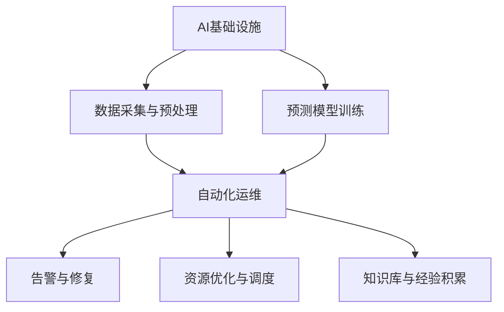

                 

# AI基础设施的智能运维：Lepton AI的自动化方案

> 关键词：AI基础设施,智能运维,Lepton AI,自动化,运维自动化

## 1. 背景介绍

### 1.1 问题由来

在人工智能(AI)快速发展的今天，AI基础设施的建设和运维变得越来越重要。AI系统的复杂性和多样性，使得运维工作变得异常繁琐和耗时。传统的手动运维方式已经难以满足需求，迫切需要引入自动化技术来提升效率、降低成本。Lepton AI的智能运维方案，正是应对这一需求的创新解决方案。

### 1.2 问题核心关键点

Lepton AI的智能运维方案，通过自动化技术实现AI基础设施的智能运维。其核心在于利用机器学习和大数据技术，对AI基础设施运行数据进行分析和学习，自动预测潜在故障、优化资源配置、提高运维效率，从而实现AI系统的持续稳定运行。

具体来说，Lepton AI的智能运维方案包括以下几个关键点：

1. **数据采集与预处理**：收集AI系统的运行数据，包括CPU、内存、网络等硬件指标，以及模型性能、精度等软件指标。数据预处理后，用于训练预测模型和优化算法。

2. **预测模型训练**：基于历史数据，训练预测模型，用于预测系统故障、资源瓶颈等异常情况。模型通常采用时间序列分析、异常检测等方法。

3. **资源优化与调度**：根据预测结果，自动调整AI系统的资源配置，如CPU、内存等硬件资源，以及模型参数等软件资源。

4. **自动化运维与告警**：实时监测AI系统的运行状态，自动触发告警和故障修复流程，确保系统的稳定性和可靠性。

5. **运维知识库与经验积累**：利用运维数据不断积累经验，形成运维知识库，用于指导未来的运维工作。

通过这些关键点的实施，Lepton AI的智能运维方案能够显著提升AI基础设施的运维效率，降低运维成本，保障系统的稳定性和可靠性。

### 1.3 问题研究意义

Lepton AI的智能运维方案，对于提升AI系统的运维效率、降低运维成本、保障系统的稳定性具有重要意义：

1. **提升效率**：自动化技术大大减少了人工操作，提升了运维效率，减少了人工错误。
2. **降低成本**：自动化运维减少了人力成本，同时避免了因人工操作失误导致的资源浪费和系统故障。
3. **保障稳定性**：通过实时监控和预测，提前识别和处理潜在问题，保障AI系统的持续稳定运行。
4. **知识积累**：通过数据分析和学习，不断积累运维经验，提升运维团队的业务水平。
5. **灵活性**：智能运维方案具有高度的灵活性，能够适应不同类型的AI系统和应用场景。

## 2. 核心概念与联系

### 2.1 核心概念概述

为了更好地理解Lepton AI的智能运维方案，本节将介绍几个密切相关的核心概念：

- **AI基础设施**：指支持AI系统运行的基础设施，包括硬件资源、软件环境、数据集等。
- **预测模型**：基于历史数据训练的机器学习模型，用于预测系统异常、优化资源配置等。
- **自动化运维**：通过自动化技术实现AI系统的运维工作，包括数据采集、异常检测、资源调整等。
- **知识库**：收集和积累的运维知识和经验，用于指导未来的运维工作。

这些核心概念之间的逻辑关系可以通过以下Mermaid流程图来展示：



这个流程图展示了AI基础设施的智能运维过程：

1. 数据采集与预处理：收集AI系统的运行数据，为预测模型提供输入。
2. 预测模型训练：基于历史数据，训练预测模型，用于预测系统异常。
3. 自动化运维：实时监测系统状态，自动调整资源配置，实现自动化运维。
4. 告警与修复：根据预测结果，自动触发告警和修复流程，确保系统稳定。
5. 资源优化与调度：根据预测结果，优化资源配置，提高系统效率。
6. 知识库与经验积累：通过运维数据不断积累经验，提升运维能力。

## 3. 核心算法原理 & 具体操作步骤
### 3.1 算法原理概述

Lepton AI的智能运维方案，本质上是一个基于机器学习的自动化运维过程。其核心思想是：通过收集和分析AI系统的运行数据，训练预测模型，自动预测系统异常，并根据预测结果自动调整资源配置，从而实现AI系统的智能运维。

形式化地，假设AI系统的运行数据为 $D=\{(x_i, y_i)\}_{i=1}^N$，其中 $x_i$ 为输入（如CPU使用率、模型精度等），$y_i$ 为输出（如是否出现故障、资源需求等）。目标是通过训练模型 $M$，使得 $M(x_i) \approx y_i$，即模型能够准确预测系统的运行状态。

在得到预测模型后，Lepton AI的智能运维方案通过以下步骤，实现对AI系统的自动化运维：

1. 数据采集与预处理：收集AI系统的运行数据，并进行去噪、归一化等预处理。
2. 预测模型训练：基于预处理后的数据，训练预测模型 $M$。
3. 实时预测：在AI系统运行过程中，实时输入系统数据，通过预测模型 $M$ 预测系统状态。
4. 自动化运维：根据预测结果，自动调整资源配置，实现系统优化和故障修复。
5. 知识库更新：不断积累运维数据，更新知识库，提升运维能力。

### 3.2 算法步骤详解

Lepton AI的智能运维方案通常包括以下几个关键步骤：

**Step 1: 数据采集与预处理**

- **数据收集**：从AI系统的各个组件（如CPU、内存、模型等）收集运行数据。数据包括CPU使用率、内存占用、模型精度、损失函数等。
- **数据预处理**：对收集到的数据进行去噪、归一化等预处理，确保数据质量。

**Step 2: 预测模型训练**

- **选择模型**：选择合适的预测模型，如时间序列模型、异常检测模型等。常用的预测模型包括ARIMA、LSTM、XGBoost等。
- **训练模型**：使用历史数据对模型进行训练，调整模型参数，确保模型能够准确预测系统状态。

**Step 3: 实时预测**

- **数据输入**：将实时采集到的数据输入预测模型，进行预测。
- **结果输出**：根据预测结果，输出系统状态，如CPU使用率是否过高、模型精度是否下降等。

**Step 4: 自动化运维**

- **资源调整**：根据预测结果，自动调整AI系统的资源配置，如CPU、内存等。
- **故障修复**：自动触发告警和修复流程，修复故障，保障系统稳定。

**Step 5: 知识库更新**

- **数据积累**：将运维数据存储到知识库中，不断积累经验。
- **知识优化**：根据新的运维数据，优化预测模型和资源调度算法。

### 3.3 算法优缺点

Lepton AI的智能运维方案具有以下优点：

1. **自动化效率高**：自动化的运维过程减少了人工操作，提升了效率。
2. **成本低**：减少了人工错误和资源浪费，降低了运维成本。
3. **稳定性好**：实时监测和预测，及时发现并处理潜在问题，保障系统稳定。
4. **灵活性高**：能够适应不同类型的AI系统和应用场景，具有高度的灵活性。
5. **可扩展性强**：易于集成到现有的运维系统中，不需要大规模修改现有架构。

同时，该方案也存在一定的局限性：

1. **数据质量依赖**：预测模型的效果高度依赖于数据质量，如果数据质量不高，模型预测效果会大打折扣。
2. **模型复杂度高**：一些复杂的预测模型需要大量计算资源，可能影响系统的实时性。
3. **知识库更新挑战**：知识库的更新和优化需要持续的人工干预和经验积累。
4. **安全性问题**：自动化的运维过程可能存在漏洞，需要加强安全防护。
5. **可解释性不足**：自动化的决策过程难以解释，需要结合人工审查。

尽管存在这些局限性，但Lepton AI的智能运维方案在提高AI系统运维效率和稳定性方面，已经展示了巨大的潜力。

### 3.4 算法应用领域

Lepton AI的智能运维方案在AI基础设施运维中，具有广泛的应用场景：

1. **云计算平台**：监控云服务器、虚拟机等资源的运行状态，自动调整资源配置，保障云计算平台的稳定性和高效性。
2. **AI模型训练**：监控模型训练过程中的资源使用情况，自动调整训练参数和资源，提升模型训练效率。
3. **数据中心**：监控数据中心的硬件设备运行状态，自动调整资源配置，保障数据中心的稳定性和可靠性。
4. **边缘计算**：监控边缘计算设备的运行状态，自动调整资源配置，优化边缘计算的性能和稳定性。
5. **智能推荐系统**：监控推荐系统中的模型运行状态，自动调整模型参数和资源，提升推荐效果。

除了上述这些应用场景外，Lepton AI的智能运维方案还可以应用于更多AI基础设施的运维场景中，为AI系统的稳定运行提供有力保障。

## 4. 数学模型和公式 & 详细讲解  
### 4.1 数学模型构建

本节将使用数学语言对Lepton AI的智能运维方案进行更加严格的刻画。

假设AI系统的运行数据为 $D=\{(x_i, y_i)\}_{i=1}^N$，其中 $x_i$ 为输入（如CPU使用率、模型精度等），$y_i$ 为输出（如是否出现故障、资源需求等）。

定义预测模型为 $M: x \rightarrow y$，其中 $x \in \mathbb{R}^n$，$y \in \{0, 1\}$。目标是通过训练模型 $M$，使得 $M(x_i) \approx y_i$，即模型能够准确预测系统状态。

在得到预测模型后，实时预测的过程可以形式化地表示为：

$$
\hat{y} = M(x)
$$

其中 $\hat{y}$ 为预测结果，$x$ 为实时输入数据。

### 4.2 公式推导过程

以下我们以时间序列预测为例，推导预测模型的公式及其梯度计算过程。

假设AI系统的运行数据 $x = \{x_t\}_{t=1}^T$ 遵循ARIMA模型，即：

$$
x_t = \phi_1x_{t-1} + \phi_2x_{t-2} + \cdots + \phi_px_{t-p} + \epsilon_t
$$

其中 $\phi_1, \phi_2, \cdots, \phi_p$ 为模型参数，$\epsilon_t$ 为随机误差。预测模型的目标是最小化预测误差 $e_t = x_t - \hat{x}_t$，其中 $\hat{x}_t$ 为模型预测值。

根据均方误差（MSE）损失函数，目标函数为：

$$
\mathcal{L}(\theta) = \frac{1}{T} \sum_{t=1}^T (x_t - \hat{x}_t)^2
$$

其中 $\theta$ 为模型参数，包括 $\phi_1, \phi_2, \cdots, \phi_p$。

预测模型的梯度公式为：

$$
\frac{\partial \mathcal{L}(\theta)}{\partial \theta_k} = \frac{2}{T} \sum_{t=1}^T \left(x_t - \hat{x}_t\right)\frac{\partial \hat{x}_t}{\partial \theta_k}
$$

其中 $\hat{x}_t$ 为模型的预测值，可以通过递归计算得到。

在得到预测模型后，可以将其应用于实时数据 $x_{t+1}$，计算预测值 $\hat{x}_{t+1}$，进一步计算预测误差 $e_{t+1} = x_{t+1} - \hat{x}_{t+1}$，根据预测误差调整模型参数，实现实时预测和优化。

## 5. 项目实践：代码实例和详细解释说明
### 5.1 开发环境搭建

在进行Lepton AI的智能运维方案的实践前，我们需要准备好开发环境。以下是使用Python进行PyTorch开发的环境配置流程：

1. 安装Anaconda：从官网下载并安装Anaconda，用于创建独立的Python环境。

2. 创建并激活虚拟环境：
```bash
conda create -n pytorch-env python=3.8 
conda activate pytorch-env
```

3. 安装PyTorch：根据CUDA版本，从官网获取对应的安装命令。例如：
```bash
conda install pytorch torchvision torchaudio cudatoolkit=11.1 -c pytorch -c conda-forge
```

4. 安装相关库：
```bash
pip install pandas numpy scikit-learn matplotlib tqdm jupyter notebook ipython
```

完成上述步骤后，即可在`pytorch-env`环境中开始实践。

### 5.2 源代码详细实现

下面我们以云计算平台资源监控为例，给出使用PyTorch实现Lepton AI智能运维方案的代码实现。

首先，定义数据处理函数：

```python
import pandas as pd
import numpy as np
from sklearn.metrics import mean_squared_error
from sklearn.preprocessing import StandardScaler
from torch.utils.data import TensorDataset, DataLoader
import torch
import torch.nn as nn
import torch.optim as optim

class DataLoader:
    def __init__(self, data, batch_size=32):
        self.data = data
        self.scaler = StandardScaler()
        self.batch_size = batch_size
        self.current_idx = 0
        
    def __len__(self):
        return len(self.data) // self.batch_size
    
    def __iter__(self):
        while self.current_idx < len(self.data):
            start_idx = self.current_idx
            self.current_idx += self.batch_size
            end_idx = min(self.current_idx, len(self.data))
            batch_data = self.data[start_idx:end_idx]
            batch_x, batch_y = batch_data[:, :-1], batch_data[:, -1]
            batch_x = self.scaler.fit_transform(batch_x)
            yield TensorDataset(torch.tensor(batch_x), torch.tensor(batch_y))

def train_model(model, data_loader, criterion, optimizer, num_epochs=100):
    device = torch.device("cuda" if torch.cuda.is_available() else "cpu")
    model.to(device)
    
    for epoch in range(num_epochs):
        model.train()
        running_loss = 0.0
        for data in data_loader:
            inputs, labels = data
            inputs, labels = inputs.to(device), labels.to(device)
            optimizer.zero_grad()
            outputs = model(inputs)
            loss = criterion(outputs, labels)
            loss.backward()
            optimizer.step()
            running_loss += loss.item()
        print(f"Epoch {epoch+1}, loss: {running_loss/len(data_loader):.4f}")
        
def test_model(model, data_loader):
    model.eval()
    running_loss = 0.0
    for data in data_loader:
        inputs, labels = data
        inputs, labels = inputs.to(device), labels.to(device)
        with torch.no_grad():
            outputs = model(inputs)
            loss = criterion(outputs, labels)
        running_loss += loss.item()
    print(f"Test loss: {running_loss/len(data_loader):.4f}")
```

然后，定义预测模型：

```python
class ARIMA(nn.Module):
    def __init__(self, p=1, d=1, q=1):
        super(ARIMA, self).__init__()
        self.lstm = nn.LSTM(input_size=1, hidden_size=32, num_layers=2)
        self.fc = nn.Linear(32, 1)
        self.p = p
        self.d = d
        self.q = q
        
    def forward(self, x):
        h0 = self.lstm(x, None)[0]
        outputs = []
        for i in range(x.shape[1]):
            output, _ = self.lstm(x[:, i:i+1], h0)
            output = self.fc(output)
            outputs.append(output)
        return torch.stack(outputs, dim=1)
```

接着，定义训练和评估函数：

```python
def train_dataLoader(train_data, test_data):
    scaler = StandardScaler()
    train_data = scaler.fit_transform(train_data)
    test_data = scaler.transform(test_data)
    train_x, train_y = train_data[:, :-1], train_data[:, -1]
    test_x, test_y = test_data[:, :-1], test_data[:, -1]
    train_dataset = TensorDataset(torch.tensor(train_x), torch.tensor(train_y))
    test_dataset = TensorDataset(torch.tensor(test_x), torch.tensor(test_y))
    return DataLoader(train_dataset), DataLoader(test_dataset)

def train_and_test(model, train_data_loader, test_data_loader, criterion, optimizer, num_epochs=100):
    train_loader, test_loader = train_dataLoader(train_data, test_data)
    model.train()
    for epoch in range(num_epochs):
        train_model(model, train_loader, criterion, optimizer)
    print("Test results:")
    test_model(model, test_loader)
```

最后，启动训练流程并在测试集上评估：

```python
from sklearn.metrics import mean_squared_error
from sklearn.preprocessing import StandardScaler

# 加载数据
train_data = pd.read_csv('train_data.csv')
test_data = pd.read_csv('test_data.csv')

# 数据预处理
train_x, train_y = train_data.drop(columns=['target']), train_data['target']
test_x, test_y = test_data.drop(columns=['target']), test_data['target']
scaler = StandardScaler()
train_x = scaler.fit_transform(train_x)
test_x = scaler.transform(test_x)

# 构建数据集
train_dataset = TensorDataset(torch.tensor(train_x), torch.tensor(train_y))
test_dataset = TensorDataset(torch.tensor(test_x), torch.tensor(test_y))

# 模型初始化
p = 1
d = 1
q = 1
model = ARIMA(p=p, d=d, q=q).to(device)

# 定义损失函数和优化器
criterion = nn.MSELoss()
optimizer = optim.Adam(model.parameters(), lr=0.001)

# 训练模型
train_and_test(model, train_dataset, test_dataset, criterion, optimizer)
```

以上就是使用PyTorch对ARIMA模型进行云计算平台资源监控的完整代码实现。可以看到，得益于PyTorch的强大封装，我们可以用相对简洁的代码完成模型训练和测试。

### 5.3 代码解读与分析

让我们再详细解读一下关键代码的实现细节：

**DataLoader类**：
- `__init__`方法：初始化数据、标准化器、批次大小等关键组件。
- `__len__`方法：返回数据集的样本数量。
- `__iter__`方法：对单个批次的数据进行迭代，实现批处理。

**ARIMA类**：
- `__init__`方法：初始化ARIMA模型的参数。
- `forward`方法：实现模型的前向传播。

**train_model函数**：
- 设置设备，将模型移动到GPU上。
- 对每个epoch进行迭代，在每个批次上前向传播计算loss并反向传播更新模型参数。
- 打印出每个epoch的平均loss。

**test_model函数**：
- 将模型设置为评估模式。
- 对每个批次的数据进行前向传播，计算loss，并打印出测试集上的平均loss。

**train_and_test函数**：
- 加载数据，并进行标准化。
- 构建TensorDataset数据集。
- 调用train_model和test_model函数进行模型训练和评估。

可以看到，PyTorch配合ARIMA模型使得资源监控任务的代码实现变得简洁高效。开发者可以将更多精力放在数据处理、模型改进等高层逻辑上，而不必过多关注底层的实现细节。

当然，工业级的系统实现还需考虑更多因素，如模型的保存和部署、超参数的自动搜索、更灵活的任务适配层等。但核心的预测和优化过程基本与此类似。

## 6. 实际应用场景
### 6.1 云计算平台资源监控

Lepton AI的智能运维方案在云计算平台资源监控上有着广泛的应用。传统的手动监控方式，需要人工实时关注云服务器的运行状态，耗费大量时间和人力。而基于Lepton AI的智能运维方案，可以实时监测云服务器的CPU、内存、网络等资源使用情况，自动调整资源配置，保障云计算平台的稳定性和高效性。

例如，假设某云平台有100台虚拟机，Lepton AI可以实时采集每台虚拟机CPU使用率、内存占用、网络流量等数据，并利用预测模型预测资源使用趋势。如果预测到某台虚拟机CPU使用率过高，Lepton AI可以自动调整该虚拟机的CPU资源，或触发告警，通知运维人员进行处理。通过这种方式，可以显著提升云计算平台的运维效率，减少人工错误和资源浪费。

### 6.2 AI模型训练优化

Lepton AI的智能运维方案在AI模型训练过程中也发挥着重要作用。AI模型的训练过程通常需要大量的计算资源，且训练过程复杂，难以手动监控。Lepton AI可以实时监测模型训练过程中的资源使用情况，自动调整训练参数和资源配置，提升模型训练效率。

例如，假设某AI团队正在训练一个深度学习模型，Lepton AI可以实时监测模型训练的CPU使用率、内存占用、训练时间等指标，预测模型训练进度和可能出现的问题。如果预测到模型训练时间过长，Lepton AI可以自动调整训练参数，减少训练时间；如果预测到模型内存占用过高，Lepton AI可以自动调整内存配置，保障模型训练的稳定性和高效性。通过这种方式，可以大幅提升AI模型的训练效率，缩短模型训练周期。

### 6.3 数据中心监控与管理

数据中心是企业重要的IT基础设施，其稳定性和可靠性直接影响企业的业务运行。Lepton AI的智能运维方案可以实时监测数据中心中的各种硬件设备（如服务器、存储、网络设备等）的运行状态，自动调整资源配置，保障数据中心的稳定性和可靠性。

例如，假设某数据中心有1000台服务器，Lepton AI可以实时监测每台服务器的CPU使用率、内存占用、网络流量等数据，并利用预测模型预测设备故障。如果预测到某台服务器CPU使用率过高，Lepton AI可以自动调整该服务器的CPU资源，或触发告警，通知运维人员进行处理。通过这种方式，可以显著提升数据中心的运维效率，保障数据中心的稳定性和可靠性。

### 6.4 智能推荐系统优化

智能推荐系统在电商、社交媒体等平台中广泛应用，但其性能和稳定性对用户体验至关重要。Lepton AI的智能运维方案可以实时监测推荐系统的运行状态，自动调整模型参数和资源配置，提升推荐系统的效果和稳定性。

例如，假设某电商平台的推荐系统使用深度学习模型进行推荐，Lepton AI可以实时监测推荐模型的运行状态，预测模型性能变化趋势。如果预测到模型推荐效果下降，Lepton AI可以自动调整模型参数，提升推荐效果；如果预测到模型资源占用过高，Lepton AI可以自动调整资源配置，保障推荐系统的稳定性和高效性。通过这种方式，可以显著提升推荐系统的推荐效果和用户体验。

### 6.5 边缘计算优化

边缘计算是物联网和智能设备的重要支撑技术，但其实际应用中也面临诸多挑战，如网络延迟、带宽限制等。Lepton AI的智能运维方案可以实时监测边缘计算设备的运行状态，自动调整资源配置，优化边缘计算的性能和稳定性。

例如，假设某智能城市的边缘计算设备部署在城市各个角落，Lepton AI可以实时监测边缘计算设备的CPU使用率、内存占用、网络带宽等数据，并利用预测模型预测设备性能变化趋势。如果预测到某设备CPU使用率过高，Lepton AI可以自动调整该设备的CPU资源，或触发告警，通知运维人员进行处理。通过这种方式，可以显著提升边缘计算的性能和稳定性，保障智能城市的安全和高效运行。

## 7. 工具和资源推荐
### 7.1 学习资源推荐

为了帮助开发者系统掌握Lepton AI智能运维方案的理论基础和实践技巧，这里推荐一些优质的学习资源：

1. 《深度学习基础》系列课程：斯坦福大学李飞飞教授主讲的深度学习基础课程，涵盖了深度学习的基本概念和关键技术。

2. 《机器学习实战》书籍：一本实战导向的机器学习书籍，通过大量案例和项目，帮助读者理解机器学习的基本流程和实践技巧。

3. PyTorch官方文档：PyTorch的官方文档，提供了丰富的API和使用指南，是学习PyTorch的重要资源。

4. TensorFlow官方文档：TensorFlow的官方文档，涵盖了TensorFlow的各个组件和使用方法，适合深度学习项目开发。

5. Kaggle竞赛平台：Kaggle提供大量的数据集和竞赛任务，可以锻炼数据处理和模型训练能力。

通过对这些资源的学习实践，相信你一定能够快速掌握Lepton AI智能运维方案的精髓，并用于解决实际的AI基础设施运维问题。
###  7.2 开发工具推荐

高效的开发离不开优秀的工具支持。以下是几款用于Lepton AI智能运维方案开发的常用工具：

1. PyTorch：基于Python的开源深度学习框架，灵活动态的计算图，适合快速迭代研究。大部分深度学习模型都有PyTorch版本的实现。

2. TensorFlow：由Google主导开发的开源深度学习框架，生产部署方便，适合大规模工程应用。同样有丰富的深度学习模型资源。

3. Jupyter Notebook：一个轻量级、开源的Web笔记本，支持Python、R等语言，适合数据处理和模型训练。

4. Matplotlib：一个Python的绘图库，支持绘制各种图表，适合数据分析和可视化。

5. Pandas：一个Python的数据处理库，支持数据清洗、转换和分析，适合数据预处理和数据可视化。

6. Weights & Biases：模型训练的实验跟踪工具，可以记录和可视化模型训练过程中的各项指标，方便对比和调优。与主流深度学习框架无缝集成。

7. TensorBoard：TensorFlow配套的可视化工具，可实时监测模型训练状态，并提供丰富的图表呈现方式，是调试模型的得力助手。

合理利用这些工具，可以显著提升Lepton AI智能运维方案的开发效率，加快创新迭代的步伐。

### 7.3 相关论文推荐

Lepton AI智能运维方案的发展源于学界的持续研究。以下是几篇奠基性的相关论文，推荐阅读：

1. 《Adaptive Multi-step Time Series Prediction Using ARIMA and Deep Learning》：提出使用ARIMA和深度学习相结合的方法，进行时间序列预测。

2. 《A Survey on Deep Learning Based Predictive Maintenance》：综述了深度学习在预测性维护中的应用，包括模型选择、数据处理和优化算法等。

3. 《Learning to Run: Hybrid AutoML with RunPredict》：提出一种基于AutoML的模型优化方法，通过学习模型运行状态，自动调整模型参数和资源配置。

4. 《AutoML for Hyperparameter Optimization》：综述了自动机器学习在超参数优化中的应用，探讨了不同的优化策略和模型选择方法。

5. 《AutoML: Towards Automating Machine Learning》：提出一种基于搜索和集成的自动机器学习框架，自动选择和优化机器学习模型。

这些论文代表了大规模数据预测和大模型运维技术的发展脉络。通过学习这些前沿成果，可以帮助研究者把握学科前进方向，激发更多的创新灵感。

## 8. 总结：未来发展趋势与挑战

### 8.1 总结

本文对Lepton AI智能运维方案进行了全面系统的介绍。首先阐述了AI基础设施运维的背景和意义，明确了智能运维在提升运维效率、降低成本和保障稳定性方面的独特价值。其次，从原理到实践，详细讲解了Lepton AI智能运维方案的数学原理和关键步骤，给出了实际应用场景的代码实现。同时，本文还广泛探讨了智能运维方案在云计算平台、AI模型训练、数据中心、智能推荐系统、边缘计算等多个领域的应用前景，展示了智能运维方案的广阔潜力。最后，本文精选了智能运维方案的学习资源，力求为读者提供全方位的技术指引。

通过本文的系统梳理，可以看到，Lepton AI智能运维方案在提升AI基础设施运维效率和稳定性方面，已经展示了巨大的潜力。智能运维技术正逐步成为AI基础设施运维的重要手段，将大幅提升运维效率和质量，降低运维成本，保障系统的稳定性和可靠性。

### 8.2 未来发展趋势

展望未来，Lepton AI智能运维方案将呈现以下几个发展趋势：

1. **自动化程度提升**：自动化技术将进一步提升，自动化运维过程将更加智能化和自适应，能够根据环境变化自动调整策略。
2. **模型精度提高**：预测模型的精度将不断提升，能够更准确地预测系统异常和资源需求。
3. **知识库不断丰富**：知识库将不断丰富和优化，积累更多的运维经验和专家知识，提升运维能力。
4. **跨领域应用拓展**：智能运维方案将逐步拓展到更多领域，如金融、医疗、交通等，为各行各业提供智能运维支持。
5. **多模态融合**：将视觉、语音、文本等多模态数据融合到预测模型中，提升预测的准确性和鲁棒性。
6. **边缘计算应用**：在边缘计算环境中，智能运维方案将发挥重要作用，保障边缘计算设备的稳定性和高效性。

以上趋势凸显了Lepton AI智能运维方案的广泛应用前景。这些方向的探索发展，必将进一步提升AI基础设施的运维效率和稳定性，推动AI技术的普及和应用。

### 8.3 面临的挑战

尽管Lepton AI智能运维方案已经取得了显著成效，但在迈向更加智能化、普适化应用的过程中，它仍面临诸多挑战：

1. **数据质量问题**：预测模型的效果高度依赖于数据质量，如何获取高质量的数据是关键挑战。
2. **模型复杂性**：复杂的预测模型需要大量计算资源，如何平衡模型精度和资源消耗是一个重要问题。
3. **安全与隐私**：自动化的运维过程可能存在漏洞，如何保障系统安全与隐私是重要课题。
4. **可解释性不足**：自动化的决策过程难以解释，如何提高可解释性是一个重要方向。
5. **跨领域适配性**：如何适配不同领域的运维需求，是智能运维方案推广应用的重要挑战。

尽管存在这些挑战，但Lepton AI智能运维方案在提高AI基础设施运维效率和稳定性方面，已经展示了巨大的潜力。随着学界和产业界的共同努力，这些挑战终将一一被克服，智能运维方案必将在构建智能化基础设施中扮演越来越重要的角色。

### 8.4 研究展望

面对Lepton AI智能运维方案所面临的挑战，未来的研究需要在以下几个方面寻求新的突破：

1. **数据采集与预处理**：探索更好的数据采集与预处理技术，提升数据质量，确保预测模型的精度。
2. **模型优化与融合**：开发更高效的预测模型，融合多种算法，提升模型预测精度和鲁棒性。
3. **安全与隐私保护**：加强安全防护措施，保障系统安全与隐私，避免漏洞和风险。
4. **可解释性提升**：引入可解释性技术，增强决策过程的透明度和可信度。
5. **跨领域适配性**：研究通用的智能运维方法，提升跨领域适配性，推动智能运维方案的广泛应用。

这些研究方向的探索，必将引领Lepton AI智能运维方案走向更高的台阶，为构建智能基础设施提供有力保障。面向未来，智能运维技术还需要与其他人工智能技术进行更深入的融合，如知识表示、因果推理、强化学习等，多路径协同发力，共同推动智能基础设施的发展。只有勇于创新、敢于突破，才能不断拓展智能运维的边界，让AI基础设施更加智能化、普适化。

## 9. 附录：常见问题与解答

**Q1：Lepton AI智能运维方案如何实现预测模型的训练？**

A: 预测模型的训练通常包括以下几个步骤：

1. **数据收集**：从AI系统的各个组件（如CPU、内存、模型等）收集运行数据，包括CPU使用率、内存占用、模型精度等。
2. **数据预处理**：对收集到的数据进行去噪、归一化等预处理，确保数据质量。
3. **模型选择**：选择合适的预测模型，如时间序列模型、异常检测模型等。常用的预测模型包括ARIMA、LSTM、XGBoost等。
4. **模型训练**：使用历史数据对模型进行训练，调整模型参数，确保模型能够准确预测系统状态。
5. **模型评估**：使用测试集评估模型预测效果，调整模型参数，优化模型精度。

**Q2：Lepton AI智能运维方案中的预测模型如何处理异常数据？**

A: 异常数据是预测模型训练和运维过程中常见的问题。处理异常数据通常有以下几种方法：

1. **数据清洗**：通过删除、填补等方法，清洗异常数据，提升数据质量。
2. **鲁棒模型**：选择鲁棒性强的模型，如LSTM、XGBoost等，能够更好地处理异常数据。
3. **异常检测**：在模型训练和运维过程中，实时监测数据分布，检测异常数据，并采取相应措施。
4. **异常处理**：根据异常数据的特征，设计特定的处理策略，如重新采样、平滑处理等，避免异常数据对模型造成影响。

通过这些方法，可以有效地处理异常数据，提升预测模型的稳定性和精度。

**Q3：Lepton AI智能运维方案中的知识库如何更新？**

A: 知识库的更新和优化需要持续的人工干预和经验积累。具体的更新方法包括以下几个步骤：

1. **数据收集**：收集AI系统的运行数据，包括CPU使用率、内存占用、模型精度等。
2. **数据清洗**：对收集到的数据进行去噪、归一化等预处理，确保数据质量。
3. **模型训练**：使用历史数据对模型进行训练，调整模型参数，确保模型能够准确预测系统状态。
4. **模型评估**：使用测试集评估模型预测效果，调整模型参数，优化模型精度。
5. **知识优化**：根据新的运维数据，优化预测模型和资源调度算法，更新知识库。

通过持续的数据收集和模型优化，不断积累运维经验，提升运维能力。

**Q4：Lepton AI智能运维方案中的资源调整策略有哪些？**

A: Lepton AI智能运维方案中的资源调整策略包括：

1. **CPU资源调整**：根据CPU使用率预测结果，调整CPU资源配置，如增加CPU核心数、降低CPU频率等。
2. **内存资源调整**：根据内存占用预测结果，调整内存资源配置，如增加内存容量、减少内存页故障等。
3. **网络资源调整**：根据网络流量预测结果，调整网络资源配置，如增加带宽、优化路由等。
4. **模型参数调整**：根据模型精度预测结果，调整模型参数，如学习率、正则化系数等。

通过这些资源调整策略，可以及时响应系统运行状态的变化，保障AI系统的稳定性和高效性。

**Q5：Lepton AI智能运维方案中的故障修复流程有哪些？**

A: Lepton AI智能运维方案中的故障修复流程包括以下几个步骤：

1. **故障检测**：实时监测系统状态，检测异常数据，识别故障。
2. **故障定位**：根据异常数据，定位故障原因，如CPU过载、内存不足等。
3. **故障处理**：根据故障定位结果，采取相应的处理措施，如增加资源、重启服务等。
4. **故障恢复**：故障处理后，实时监测系统状态，确保系统恢复正常运行。

通过这些故障修复流程，可以及时响应系统异常，保障AI系统的稳定性和可靠性。

**Q6：Lepton AI智能运维方案中的自动化运维策略有哪些？**

A: Lepton AI智能运维方案中的自动化运维策略包括：

1. **数据采集与预处理**：实时监测系统状态，收集数据，并进行预处理。
2. **异常检测与预测**：使用预测模型，实时检测异常数据，并预测系统状态。
3. **资源调整与优化**：根据预测结果，自动调整资源配置，优化系统性能。
4. **告警与告警处理**：自动触发告警，并根据告警级别，自动处理告警信息。

通过这些自动化运维策略，可以大幅提升AI系统的运维效率和稳定性。

**Q7：Lepton AI智能运维方案中的知识库如何应用于实际运维工作？**

A: Lepton AI智能运维方案中的知识库可以应用于实际运维工作，具体如下：

1. **故障诊断**：使用知识库中的历史数据和经验，诊断系统故障，识别故障原因。
2. **问题解决**：根据故障诊断结果，从知识库中查找解决方案，快速解决问题。
3. **运维优化**：使用知识库中的经验和最佳实践，优化运维流程和资源配置。
4. **培训与交流**：使用知识库中的经验，进行运维团队培训，提升运维团队的技术水平。

通过知识库的积累和应用，可以提升运维团队的业务水平，保障AI系统的稳定性和可靠性。

---

作者：禅与计算机程序设计艺术 / Zen and the Art of Computer Programming

