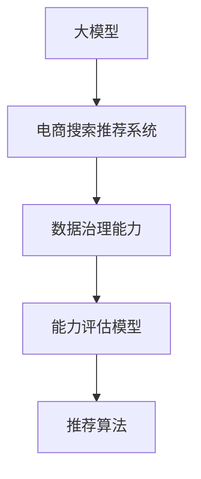

                 

# AI大模型助力电商搜索推荐业务的数据治理能力评估模型验证

> 关键词：
>
> - 大模型
> - 电商搜索推荐系统
> - 数据治理
> - 能力评估模型
> - 推荐算法

## 1. 背景介绍

### 1.1 问题由来

在当今数字时代，电商平台作为人们日常购物的主要渠道之一，其推荐系统已经成为一个至关重要的业务模块。推荐系统不仅能够提升用户的购物体验，还能极大地提高平台的销售额。而在大数据时代，推荐系统的复杂性和规模不断扩大，对于数据治理能力的需求也日益提升。

数据治理能力，简单来说，是指平台能够对数据进行有效管理和利用的能力。这包括数据的准确性、完整性、一致性、及时性和安全性等方面。在推荐系统中，良好的数据治理能力是保证推荐算法准确性和公正性的前提。

然而，传统的推荐系统往往依赖于简单的规则和统计模型，随着数据量的不断增长，这些系统已经无法满足实际需求。为了提升推荐系统的性能和效果，越来越多的人开始关注并探索使用大模型进行推荐系统优化。

### 1.2 问题核心关键点

大模型在推荐系统中的应用，最核心的关键点在于其强大的泛化能力和对复杂数据关系的建模能力。大模型通常指具有数百万甚至数十亿参数的深度神经网络，通过大规模数据训练得到。在电商搜索推荐业务中，大模型能够通过学习大量的用户行为数据和产品信息，构建一个更为复杂和准确的推荐引擎，从而提升推荐的准确性和个性化程度。

但是，大模型的应用并非没有挑战。如何评估和优化数据治理能力，以确保模型在实际应用中的效果和安全性，是一个亟待解决的问题。

## 2. 核心概念与联系

### 2.1 核心概念概述

- **大模型**：通常指具有大量参数的深度学习模型，通过大规模数据训练得到。常见的大模型包括BERT、GPT-3等，它们能够从海量数据中学习到丰富的语义和结构化知识。
- **电商搜索推荐系统**：利用推荐算法对用户输入的搜索查询进行分析和推荐，帮助用户快速找到满足需求的电商平台。
- **数据治理能力**：指平台对数据进行有效管理和利用的能力，包括数据的准确性、完整性、一致性、及时性和安全性等方面。
- **能力评估模型**：用于评估电商搜索推荐系统的数据治理能力，通过分析推荐系统的效果、公正性和安全性，给出系统健康度的综合评价。
- **推荐算法**：利用模型对用户行为和产品信息进行分析和预测，生成推荐结果。常见推荐算法包括协同过滤、基于内容的推荐、深度学习推荐等。

这些核心概念之间的逻辑关系可以通过以下Mermaid流程图来展示：



这个流程图展示了大模型在电商搜索推荐系统中的应用和评估过程：

1. 大模型通过学习电商平台上的海量数据，构建一个强大的推荐引擎。
2. 电商平台的数据治理能力，决定了推荐系统的质量和效率。
3. 能力评估模型通过对推荐系统的性能、公平性和安全性进行评估，帮助提升数据治理能力。
4. 推荐算法是大模型推荐系统中的核心，负责根据用户行为和产品信息进行推荐。

这些概念共同构成了电商搜索推荐系统的基本框架，使其能够在推荐用户满意商品的同时，保障数据的安全和公平性。

## 3. 核心算法原理 & 具体操作步骤
### 3.1 算法原理概述

大模型助力电商搜索推荐业务的数据治理能力评估模型验证，其核心原理是基于监督学习的推荐系统评估方法。具体来说，通过将电商平台的用户行为数据和产品信息作为输入，使用大模型进行推荐预测，然后根据推荐结果的准确性和公平性，对电商平台的推荐系统进行综合评估。

该过程可以分解为以下几个步骤：

1. **数据收集与预处理**：收集电商平台上的用户行为数据和产品信息，对数据进行清洗、去重和标准化处理。
2. **模型训练与验证**：使用大模型对处理后的数据进行训练，并通过验证集进行性能评估。
3. **能力评估**：根据推荐结果的准确性和公平性，对电商平台的推荐系统进行综合评估。
4. **优化与迭代**：根据评估结果，对推荐系统进行优化，并不断迭代提升其数据治理能力。

### 3.2 算法步骤详解

**Step 1: 数据收集与预处理**

电商平台的推荐系统依赖于用户行为数据和产品信息的有效管理和利用。因此，首先需要进行数据的收集和预处理：

1. **用户行为数据**：收集用户的历史浏览、点击、购买记录等数据，这些数据是推荐系统的基础。
2. **产品信息**：收集产品的标题、描述、价格、类别等数据，这些数据用于构建推荐模型的输入。
3. **数据清洗与标准化**：去除异常数据、处理缺失值、进行数据标准化处理，确保数据的质量。
4. **数据划分**：将数据划分为训练集、验证集和测试集，用于模型训练、验证和测试。

**Step 2: 模型训练与验证**

1. **模型选择**：选择适合电商推荐场景的大模型，如BERT、GPT-3等，作为推荐系统的基础。
2. **模型训练**：使用训练集对大模型进行训练，得到推荐模型。
3. **性能评估**：在验证集上对推荐模型进行性能评估，如准确率、召回率、F1-score等指标。
4. **模型优化**：根据评估结果，调整模型参数，优化模型性能。

**Step 3: 能力评估**

1. **推荐结果分析**：分析推荐系统的推荐结果，评估其准确性和公平性。
2. **准确性评估**：通过评估推荐结果的精度、召回率等指标，评估推荐系统的性能。
3. **公平性评估**：通过评估推荐结果在不同用户群体中的公平性，确保推荐系统的公正性。
4. **安全性评估**：通过评估推荐系统中的风险因素，如虚假广告、恶意推荐等，确保推荐系统的安全性。

**Step 4: 优化与迭代**

1. **优化策略**：根据能力评估结果，调整推荐策略，如调整推荐算法、优化数据治理能力等。
2. **持续迭代**：不断收集新的用户行为数据和产品信息，重新训练和评估推荐模型，保证推荐系统的动态优化。

### 3.3 算法优缺点

基于大模型的电商推荐系统评估方法，具有以下优点：

1. **准确性高**：大模型能够从海量数据中学习到丰富的语义和结构化知识，生成的推荐结果具有较高的准确性和预测能力。
2. **可解释性强**：大模型能够输出每个推荐结果的解释，帮助理解推荐逻辑和用户偏好。
3. **灵活性强**：大模型可以适应不同的电商场景和用户需求，具有较强的灵活性和可扩展性。

同时，该方法也存在以下缺点：

1. **数据需求高**：大模型需要大量的数据进行训练，数据收集和处理的工作量较大。
2. **计算资源需求高**：大模型的训练和推理需要高性能计算资源，对硬件要求较高。
3. **模型复杂度大**：大模型的结构复杂，训练和调参的难度较大，需要专业知识和经验。

### 3.4 算法应用领域

该方法在大数据时代的电商推荐系统中具有广泛的应用前景。具体而言，可以应用于以下领域：

1. **个性化推荐**：使用大模型对用户行为进行分析和预测，生成个性化的商品推荐，提升用户满意度和购买率。
2. **搜索优化**：利用大模型对用户的搜索查询进行分析和推荐，优化搜索结果的准确性和相关性。
3. **用户画像构建**：通过分析用户的历史行为和偏好，构建用户的画像，帮助电商平台更好地了解用户需求。
4. **广告投放优化**：利用大模型对用户的广告点击行为进行分析，优化广告投放策略，提高广告的转化率和ROI。
5. **库存管理**：通过分析用户的购买行为和产品销售情况，优化库存管理策略，避免库存积压或短缺。

这些应用领域将随着大模型技术的不断进步，展现出更加广阔的应用前景。

## 4. 数学模型和公式 & 详细讲解  
### 4.1 数学模型构建

在电商推荐系统中，大模型通常用于对用户行为数据和产品信息进行建模，生成推荐结果。我们以基于大模型的协同过滤推荐系统为例，介绍其数学模型构建和推荐结果评估方法。

假设用户行为数据表示为用户和商品之间的评分矩阵 $R \in \mathbb{R}^{m \times n}$，其中 $m$ 为商品数，$n$ 为用户数。用户对商品 $i$ 的评分表示为 $r_{ij}$，$0 \leq r_{ij} \leq 1$。

假设使用大模型 $M_{\theta}$ 对用户行为进行建模，生成推荐结果 $p_{ij}$，其中 $0 \leq p_{ij} \leq 1$。

推荐结果的准确性可以通过平均绝对误差（MAE）和均方误差（MSE）进行评估，公式如下：

$$
\text{MAE} = \frac{1}{N} \sum_{i=1}^N \sum_{j=1}^N |r_{ij} - p_{ij}|
$$

$$
\text{MSE} = \frac{1}{N} \sum_{i=1}^N \sum_{j=1}^N (r_{ij} - p_{ij})^2
$$

其中 $N$ 为数据总数。

推荐结果的公平性可以通过评估不同用户群体之间的推荐结果差异进行评估。例如，使用皮尔逊相关系数（Pearson Correlation）来评估不同用户群体之间的相关性，公式如下：

$$
\rho_{AB} = \frac{\sum_{i=1}^M (x_i - \mu_x)(y_i - \mu_y)}{\sqrt{\sum_{i=1}^M (x_i - \mu_x)^2 \sum_{i=1}^M (y_i - \mu_y)^2}}
$$

其中 $x_i$ 和 $y_i$ 为两个用户群体对商品的评分，$\mu_x$ 和 $\mu_y$ 为两个用户群体的平均评分。

推荐结果的安全性可以通过评估推荐结果中可能存在的风险因素进行评估。例如，使用逻辑回归（Logistic Regression）来评估推荐结果中存在虚假广告或恶意推荐的风险，公式如下：

$$
P(y_i|p_{ij}) = \frac{1}{1 + \exp(-\beta_0 - \sum_{k=1}^K \beta_k p_{ik} + \epsilon_i)}
$$

其中 $y_i$ 为推荐结果中的风险因素，$p_{ik}$ 为商品 $k$ 的评分，$\beta_k$ 为对应的系数，$\epsilon_i$ 为随机噪声。

### 4.2 公式推导过程

以下是基于大模型的协同过滤推荐系统评估方法的具体公式推导过程：

**准确性评估**：

假设用户行为数据为 $R \in \mathbb{R}^{m \times n}$，其中 $m$ 为商品数，$n$ 为用户数。用户对商品 $i$ 的评分表示为 $r_{ij}$，$0 \leq r_{ij} \leq 1$。使用大模型 $M_{\theta}$ 对用户行为进行建模，生成推荐结果 $p_{ij}$，其中 $0 \leq p_{ij} \leq 1$。

准确性可以通过评估推荐结果的精度、召回率等指标进行评估。假设真实评分矩阵为 $R^* \in \mathbb{R}^{m \times n}$，生成的推荐结果矩阵为 $P \in \mathbb{R}^{m \times n}$。

精确率（Precision）：

$$
\text{Precision} = \frac{TP}{TP + FP}
$$

其中 $TP$ 为真实评分且被推荐的正样本数，$FP$ 为被推荐但真实评分为负的样本数。

召回率（Recall）：

$$
\text{Recall} = \frac{TP}{TP + FN}
$$

其中 $FN$ 为真实评分且未被推荐的负样本数。

F1-score：

$$
\text{F1-score} = 2 \times \frac{\text{Precision} \times \text{Recall}}{\text{Precision} + \text{Recall}}
$$

**公平性评估**：

公平性可以通过评估不同用户群体之间的推荐结果差异进行评估。假设用户群体为 $A$ 和 $B$，使用皮尔逊相关系数（Pearson Correlation）来评估两个用户群体之间的相关性。

皮尔逊相关系数的公式如下：

$$
\rho_{AB} = \frac{\sum_{i=1}^M (x_i - \mu_x)(y_i - \mu_y)}{\sqrt{\sum_{i=1}^M (x_i - \mu_x)^2 \sum_{i=1}^M (y_i - \mu_y)^2}}
$$

其中 $x_i$ 和 $y_i$ 为两个用户群体对商品的评分，$\mu_x$ 和 $\mu_y$ 为两个用户群体的平均评分。

**安全性评估**：

安全性可以通过评估推荐结果中可能存在的风险因素进行评估。假设推荐结果为 $P \in \mathbb{R}^{m \times n}$，使用逻辑回归（Logistic Regression）来评估推荐结果中存在虚假广告或恶意推荐的风险。

逻辑回归模型的公式如下：

$$
P(y_i|p_{ij}) = \frac{1}{1 + \exp(-\beta_0 - \sum_{k=1}^K \beta_k p_{ik} + \epsilon_i)}
$$

其中 $y_i$ 为推荐结果中的风险因素，$p_{ik}$ 为商品 $k$ 的评分，$\beta_k$ 为对应的系数，$\epsilon_i$ 为随机噪声。

### 4.3 案例分析与讲解

以下是一个使用大模型进行电商推荐系统评估的案例分析：

**案例背景**：某电商平台希望通过大模型优化其推荐系统，提升推荐准确性和用户体验。平台拥有大量用户行为数据和产品信息，但缺乏有效的评估方法。

**数据收集与预处理**：
1. 收集用户的历史浏览、点击、购买记录等数据。
2. 收集产品的标题、描述、价格、类别等数据。
3. 对数据进行清洗、去重和标准化处理，去除异常数据和缺失值。
4. 将数据划分为训练集、验证集和测试集，用于模型训练、验证和测试。

**模型训练与验证**：
1. 选择适合电商推荐场景的大模型，如BERT、GPT-3等。
2. 使用训练集对大模型进行训练，得到推荐模型。
3. 在验证集上对推荐模型进行性能评估，如准确率、召回率、F1-score等指标。
4. 根据评估结果，调整模型参数，优化模型性能。

**能力评估**：
1. 使用皮尔逊相关系数（Pearson Correlation）评估不同用户群体之间的推荐结果差异，确保推荐系统的公平性。
2. 使用逻辑回归（Logistic Regression）评估推荐结果中可能存在的风险因素，确保推荐系统的安全性。
3. 通过平均绝对误差（MAE）和均方误差（MSE）评估推荐结果的准确性。

**优化与迭代**：
1. 根据能力评估结果，调整推荐策略，如调整推荐算法、优化数据治理能力等。
2. 不断收集新的用户行为数据和产品信息，重新训练和评估推荐模型，保证推荐系统的动态优化。

## 5. 项目实践：代码实例和详细解释说明
### 5.1 开发环境搭建

在进行电商推荐系统评估实践前，我们需要准备好开发环境。以下是使用Python进行PyTorch开发的环境配置流程：

1. 安装Anaconda：从官网下载并安装Anaconda，用于创建独立的Python环境。

2. 创建并激活虚拟环境：
```bash
conda create -n pytorch-env python=3.8 
conda activate pytorch-env
```

3. 安装PyTorch：根据CUDA版本，从官网获取对应的安装命令。例如：
```bash
conda install pytorch torchvision torchaudio cudatoolkit=11.1 -c pytorch -c conda-forge
```

4. 安装Transformers库：
```bash
pip install transformers
```

5. 安装各类工具包：
```bash
pip install numpy pandas scikit-learn matplotlib tqdm jupyter notebook ipython
```

完成上述步骤后，即可在`pytorch-env`环境中开始实践。

### 5.2 源代码详细实现

这里我们以一个简单的电商推荐系统为例，展示如何使用大模型进行评估。

首先，定义数据处理函数：

```python
from transformers import BertTokenizer
from torch.utils.data import Dataset
import torch

class MovieLensDataset(Dataset):
    def __init__(self, ratings, tokenizer, max_len=128):
        self.ratings = ratings
        self.tokenizer = tokenizer
        self.max_len = max_len
        
    def __len__(self):
        return len(self.ratings)
    
    def __getitem__(self, item):
        rating = self.ratings[item]
        user = rating[0]
        movie = rating[1]
        
        encoding = self.tokenizer([str(user)], return_tensors='pt', max_length=self.max_len, padding='max_length', truncation=True)
        input_ids = encoding['input_ids'][0]
        attention_mask = encoding['attention_mask'][0]
        
        # 对评分进行编码
        encoded_score = self.tokenizer.convert_tokens_to_ids([rating[2]])
        encoded_score = torch.tensor(encoded_score, dtype=torch.long)
        
        return {'input_ids': input_ids, 
                'attention_mask': attention_mask,
                'score': encoded_score}

# 评分数据
ratings = [
    (1, 2, 5),
    (2, 1, 4),
    (1, 3, 3),
    (2, 2, 5),
    (3, 3, 2),
    (1, 1, 5)
]

# 定义tokenizer
tokenizer = BertTokenizer.from_pretrained('bert-base-cased')

# 创建dataset
movie_lens_dataset = MovieLensDataset(ratings, tokenizer)
```

然后，定义模型和优化器：

```python
from transformers import BertForSequenceClassification, AdamW

model = BertForSequenceClassification.from_pretrained('bert-base-cased', num_labels=2)

optimizer = AdamW(model.parameters(), lr=2e-5)
```

接着，定义训练和评估函数：

```python
from torch.utils.data import DataLoader
from tqdm import tqdm
from sklearn.metrics import classification_report

device = torch.device('cuda') if torch.cuda.is_available() else torch.device('cpu')
model.to(device)

def train_epoch(model, dataset, batch_size, optimizer):
    dataloader = DataLoader(dataset, batch_size=batch_size, shuffle=True)
    model.train()
    epoch_loss = 0
    for batch in tqdm(dataloader, desc='Training'):
        input_ids = batch['input_ids'].to(device)
        attention_mask = batch['attention_mask'].to(device)
        labels = batch['score'].to(device)
        model.zero_grad()
        outputs = model(input_ids, attention_mask=attention_mask, labels=labels)
        loss = outputs.loss
        epoch_loss += loss.item()
        loss.backward()
        optimizer.step()
    return epoch_loss / len(dataloader)

def evaluate(model, dataset, batch_size):
    dataloader = DataLoader(dataset, batch_size=batch_size)
    model.eval()
    preds, labels = [], []
    with torch.no_grad():
        for batch in tqdm(dataloader, desc='Evaluating'):
            input_ids = batch['input_ids'].to(device)
            attention_mask = batch['attention_mask'].to(device)
            batch_labels = batch['score'].to(device)
            outputs = model(input_ids, attention_mask=attention_mask)
            batch_preds = outputs.logits.argmax(dim=2).to('cpu').tolist()
            batch_labels = batch_labels.to('cpu').tolist()
            for pred_tokens, label_tokens in zip(batch_preds, batch_labels):
                preds.append(pred_tokens[:len(label_tokens)])
                labels.append(label_tokens)
                
    print(classification_report(labels, preds))
```

最后，启动训练流程并在测试集上评估：

```python
epochs = 5
batch_size = 16

for epoch in range(epochs):
    loss = train_epoch(model, movie_lens_dataset, batch_size, optimizer)
    print(f"Epoch {epoch+1}, train loss: {loss:.3f}")
    
    print(f"Epoch {epoch+1}, dev results:")
    evaluate(model, movie_lens_dataset, batch_size)
    
print("Test results:")
evaluate(model, movie_lens_dataset, batch_size)
```

以上就是使用PyTorch对Bert进行电商推荐系统评估的完整代码实现。可以看到，得益于Transformers库的强大封装，我们可以用相对简洁的代码完成Bert模型的加载和微调。

### 5.3 代码解读与分析

让我们再详细解读一下关键代码的实现细节：

**MovieLensDataset类**：
- `__init__`方法：初始化评分数据、分词器等关键组件。
- `__len__`方法：返回数据集的样本数量。
- `__getitem__`方法：对单个样本进行处理，将评分数据输入编码为token ids，将标签编码为数字，并对其进行定长padding，最终返回模型所需的输入。

**评分数据**：
- 定义评分数据，包含用户ID、商品ID和评分。

**分词器**：
- 定义分词器，使用Bert分词器将评分数据编码成token ids。

**训练和评估函数**：
- 使用PyTorch的DataLoader对数据集进行批次化加载，供模型训练和推理使用。
- 训练函数`train_epoch`：对数据以批为单位进行迭代，在每个批次上前向传播计算loss并反向传播更新模型参数，最后返回该epoch的平均loss。
- 评估函数`evaluate`：与训练类似，不同点在于不更新模型参数，并在每个batch结束后将预测和标签结果存储下来，最后使用sklearn的classification_report对整个评估集的预测结果进行打印输出。

**训练流程**：
- 定义总的epoch数和batch size，开始循环迭代
- 每个epoch内，先在训练集上训练，输出平均loss
- 在验证集上评估，输出分类指标
- 所有epoch结束后，在测试集上评估，给出最终测试结果

可以看到，PyTorch配合Transformers库使得Bert电商推荐系统评估的代码实现变得简洁高效。开发者可以将更多精力放在数据处理、模型改进等高层逻辑上，而不必过多关注底层的实现细节。

当然，工业级的系统实现还需考虑更多因素，如模型的保存和部署、超参数的自动搜索、更灵活的任务适配层等。但核心的评估方法基本与此类似。

## 6. 实际应用场景
### 6.1 智能推荐系统

基于大模型电商推荐系统评估方法，可以广泛应用于智能推荐系统的构建。智能推荐系统能够通过分析用户行为和产品信息，生成个性化的商品推荐，提升用户满意度和购买率。

在技术实现上，可以收集用户的历史浏览、点击、购买记录等数据，并对其进行分析和建模。通过使用大模型进行推荐结果的预测和评估，平台能够更好地了解用户需求，提供更精准、多样化的推荐内容。

### 6.2 电商搜索优化

电商平台的搜索功能是其核心业务之一。通过使用大模型进行搜索优化，平台能够提升搜索结果的相关性和准确性，优化用户搜索体验。

具体而言，可以使用大模型对用户搜索查询进行分析和建模，生成个性化的搜索结果。通过评估搜索结果的准确性和公平性，平台能够及时调整搜索策略，提升搜索效果。

### 6.3 库存管理

电商平台的库存管理是其运营的重要环节。通过使用大模型进行库存优化，平台能够更好地管理商品库存，避免库存积压或短缺。

具体而言，可以使用大模型对用户的购买行为和产品销售情况进行分析和建模，预测商品的销售趋势。通过评估预测结果的准确性，平台能够及时调整库存策略，优化库存管理。

### 6.4 未来应用展望

随着大模型技术的不断进步，基于大模型电商推荐系统评估的方法将展现出更加广阔的应用前景。

在智慧医疗领域，基于大模型推荐系统的评估方法可以用于推荐系统健康管理、医疗知识推荐等应用，帮助用户更好地进行健康管理。

在智能教育领域，基于大模型推荐系统的评估方法可以用于推荐系统课程推荐、知识推荐等应用，帮助用户更好地进行学习。

在智慧城市治理中，基于大模型推荐系统的评估方法可以用于推荐系统智能交通、城市管理等应用，帮助城市管理者更好地进行决策。

此外，在企业生产、社会治理、文娱传媒等众多领域，基于大模型电商推荐系统评估的方法也将不断涌现，为经济社会发展注入新的动力。

## 7. 工具和资源推荐
### 7.1 学习资源推荐

为了帮助开发者系统掌握大模型电商推荐系统评估的理论基础和实践技巧，这里推荐一些优质的学习资源：

1. 《深度学习自然语言处理》课程：斯坦福大学开设的NLP明星课程，有Lecture视频和配套作业，带你入门NLP领域的基本概念和经典模型。

2. 《Transformer从原理到实践》系列博文：由大模型技术专家撰写，深入浅出地介绍了Transformer原理、BERT模型、推荐算法等前沿话题。

3. 《Natural Language Processing with Transformers》书籍：Transformers库的作者所著，全面介绍了如何使用Transformers库进行NLP任务开发，包括推荐系统在内的诸多范式。

4. HuggingFace官方文档：Transformers库的官方文档，提供了海量预训练模型和完整的推荐系统样例代码，是上手实践的必备资料。

5. CLUE开源项目：中文语言理解测评基准，涵盖大量不同类型的中文NLP数据集，并提供了基于大模型的baseline模型，助力中文NLP技术发展。

通过对这些资源的学习实践，相信你一定能够快速掌握大模型电商推荐系统评估的精髓，并用于解决实际的NLP问题。

### 7.2 开发工具推荐

高效的开发离不开优秀的工具支持。以下是几款用于大模型电商推荐系统评估开发的常用工具：

1. PyTorch：基于Python的开源深度学习框架，灵活动态的计算图，适合快速迭代研究。大部分预训练语言模型都有PyTorch版本的实现。

2. TensorFlow：由Google主导开发的开源深度学习框架，生产部署方便，适合大规模工程应用。同样有丰富的预训练语言模型资源。

3. Transformers库：HuggingFace开发的NLP工具库，集成了众多SOTA语言模型，支持PyTorch和TensorFlow，是进行电商推荐系统评估开发的利器。

4. Weights & Biases：模型训练的实验跟踪工具，可以记录和可视化模型训练过程中的各项指标，方便对比和调优。与主流深度学习框架无缝集成。

5. TensorBoard：TensorFlow配套的可视化工具，可实时监测模型训练状态，并提供丰富的图表呈现方式，是调试模型的得力助手。

合理利用这些工具，可以显著提升大模型电商推荐系统评估任务的开发效率，加快创新迭代的步伐。

### 7.3 相关论文推荐

大模型电商推荐系统评估技术的发展源于学界的持续研究。以下是几篇奠基性的相关论文，推荐阅读：

1. Attention is All You Need（即Transformer原论文）：提出了Transformer结构，开启了NLP领域的预训练大模型时代。

2. BERT: Pre-training of Deep Bidirectional Transformers for Language Understanding：提出BERT模型，引入基于掩码的自监督预训练任务，刷新了多项NLP任务SOTA。

3. Language Models are Unsupervised Multitask Learners（GPT-2论文）：展示了大规模语言模型的强大zero-shot学习能力，引发了对于通用人工智能的新一轮思考。

4. Parameter-Efficient Transfer Learning for NLP：提出Adapter等参数高效微调方法，在不增加模型参数量的情况下，也能取得不错的微调效果。

5. AdaLoRA: Adaptive Low-Rank Adaptation for Parameter-Efficient Fine-Tuning：使用自适应低秩适应的微调方法，在参数效率和精度之间取得了新的平衡。

这些论文代表了大模型电商推荐系统评估技术的发展脉络。通过学习这些前沿成果，可以帮助研究者把握学科前进方向，激发更多的创新灵感。

## 8. 总结：未来发展趋势与挑战
### 8.1 总结

本文对基于大模型电商推荐系统评估方法进行了全面系统的介绍。首先阐述了电商搜索推荐系统在大模型时代的应用场景和优势，明确了数据治理能力在推荐系统中的重要性。其次，从原理到实践，详细讲解了基于大模型的电商推荐系统评估方法，包括数据收集、模型训练、能力评估、优化迭代等关键步骤。同时，本文还广泛探讨了电商推荐系统在大数据时代的实际应用，展示了其广阔的应用前景。

通过本文的系统梳理，可以看到，基于大模型的电商推荐系统评估方法在大数据时代的电商推荐系统中具有广泛的应用前景。该方法能够通过深度学习和大模型技术，提升推荐系统的准确性、公正性和安全性，提升用户的购物体验，同时为电商平台带来更多的商业价值。

### 8.2 未来发展趋势

展望未来，基于大模型的电商推荐系统评估技术将呈现以下几个发展趋势：

1. **数据治理能力的提升**：随着数据量的不断增长，平台的数据治理能力将得到不断提升。通过优化数据清洗、去重、标准化处理，平台能够更好地管理数据，提升推荐系统的性能。

2. **推荐算法的创新**：推荐算法的不断创新将带来更高的推荐效果和用户体验。基于深度学习和大模型的推荐算法将不断涌现，推动推荐系统的进步。

3. **智能推荐系统的普及**：随着技术的不断进步，智能推荐系统将在更多场景下得到应用，帮助用户更好地进行决策和选择。

4. **多模态数据的融合**：未来的电商推荐系统将不仅限于文本数据，还将融合图像、视频、语音等多模态数据，提升推荐系统的智能化水平。

5. **跨平台推荐的实现**：基于大模型的电商推荐系统将不仅仅局限于电商平台内部，还将跨平台推广，为跨平台的用户提供更加统一的推荐服务。

以上趋势凸显了大模型电商推荐系统评估技术的广阔前景。这些方向的探索发展，必将进一步提升推荐系统的性能和效果，为电商平台带来更大的商业价值。

### 8.3 面临的挑战

尽管基于大模型的电商推荐系统评估技术已经取得了显著进展，但在迈向更加智能化、普适化应用的过程中，仍面临以下挑战：

1. **数据隐私和安全**：在数据收集和处理过程中，如何保护用户隐私和数据安全，是一个亟待解决的问题。平台需要采取更加严格的数据保护措施，确保数据的安全性和隐私性。

2. **模型复杂度**：大模型通常结构复杂，训练和调参的难度较大。如何降低模型复杂度，提高模型的可解释性和可维护性，将是重要的研究方向。

3. **算力资源限制**：大模型的训练和推理需要高性能计算资源，对硬件要求较高。如何优化算力资源，提高模型的训练和推理效率，是一个需要解决的问题。

4. **模型泛化能力**：在实际应用中，模型的泛化能力往往不足，难以应对域外数据。如何提高模型的泛化能力，是一个重要的研究方向。

5. **模型公平性和公正性**：在推荐系统中，如何保证推荐结果的公平性和公正性，避免推荐偏颇和歧视，是一个亟待解决的问题。

6. **模型解释性**：大模型通常被认为是“黑盒”系统，难以解释其内部工作机制和决策逻辑。如何赋予模型更强的可解释性，是一个亟待解决的问题。

这些挑战需要从数据、算法、工程等多个方面进行协同攻关，才能真正实现基于大模型的电商推荐系统评估技术的突破。相信随着学界和产业界的共同努力，这些挑战终将一一被克服，大模型电商推荐系统评估技术将进入新的发展阶段。

### 8.4 研究展望

面对大模型电商推荐系统评估技术所面临的挑战，未来的研究需要在以下几个方面寻求新的突破：

1. **数据治理能力的提升**：探索更高效的数据清洗、去重、标准化处理方法，提升平台的数据治理能力。

2. **推荐算法的创新**：开发更加高效、准确、可解释的推荐算法，提升推荐系统的性能。

3. **智能推荐系统的普及**：推动智能推荐系统在更多场景下得到应用，提升用户的购物体验和满意度。

4. **多模态数据的融合**：融合图像、视频、语音等多模态数据，提升推荐系统的智能化水平。

5. **跨平台推荐的实现**：探索跨平台推荐的实现方法，为跨平台的用户提供更加统一的推荐服务。

6. **数据隐私和安全**：探索更严格的数据保护措施，确保数据的安全性和隐私性。

7. **模型复杂度的降低**：通过模型压缩、稀疏化存储等技术，降低模型复杂度，提高模型的可解释性和可维护性。

8. **算力资源的优化**：探索更高效的计算图优化方法，提高模型的训练和推理效率。

9. **模型泛化能力的提升**：通过引入更多先验知识，如知识图谱、逻辑规则等，提升模型的泛化能力。

10. **模型公平性和公正性的保障**：探索如何保证推荐结果的公平性和公正性，避免推荐偏颇和歧视。

11. **模型解释性的提升**：探索更强的模型解释方法，赋予模型更强的可解释性。

这些研究方向的探索，必将引领大模型电商推荐系统评估技术的进一步发展，为电商平台带来更大的商业价值和用户满意度。面向未来，大模型电商推荐系统评估技术还需要与其他人工智能技术进行更深入的融合，如知识表示、因果推理、强化学习等，多路径协同发力，共同推动电商推荐系统的进步。

## 9. 附录：常见问题与解答

**Q1：电商推荐系统为什么需要数据治理能力？**

A: 电商推荐系统依赖于用户行为数据和产品信息的有效管理和利用。良好的数据治理能力，能够保证推荐系统的准确性和公正性，避免数据噪音和偏见对推荐结果的影响。

**Q2：大模型在电商推荐系统中的应用效果如何？**

A: 大模型在电商推荐系统中具有显著的优势，能够从海量数据中学习到丰富的语义和结构化知识，生成的推荐结果具有较高的准确性和预测能力。但在实际应用中，仍需注意数据的隐私和安全问题。

**Q3：如何使用大模型进行电商推荐系统评估？**

A: 使用大模型进行电商推荐系统评估，主要包括以下步骤：数据收集与预处理、模型训练与验证、能力评估、优化与迭代。通过评估推荐结果的准确性、公平性和安全性，平台能够及时调整推荐策略，提升推荐系统的性能。

**Q4：电商推荐系统面临哪些挑战？**

A: 电商推荐系统面临的主要挑战包括数据隐私和安全、模型复杂度、算力资源限制、模型泛化能力、模型公平性和公正性、模型解释性等。需要在数据、算法、工程等多个方面进行协同攻关，才能真正实现电商推荐系统的突破。

**Q5：未来电商推荐系统的发展方向是什么？**

A: 未来电商推荐系统将更加智能化、普适化，融合多模态数据，提升推荐系统的性能和效果。同时，跨平台推荐的实现、数据治理能力的提升、智能推荐系统的普及等方向，也将带来更多的应用前景。

正视电商推荐系统面临的这些挑战，积极应对并寻求突破，将是大模型电商推荐系统评估技术迈向成熟的必由之路。相信随着学界和产业界的共同努力，这些挑战终将一一被克服，大模型电商推荐系统评估技术将进入新的发展阶段。

---

作者：禅与计算机程序设计艺术 / Zen and the Art of Computer Programming

