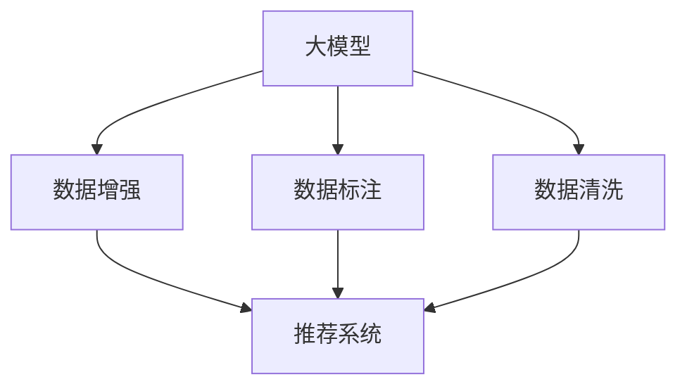

                 

# AI大模型助力电商搜索推荐业务的数据质量提升措施

> 关键词：
大模型,数据清洗,数据增强,数据标注,推荐系统,搜索系统,电商,数据质量提升

## 1. 背景介绍

随着人工智能技术的快速发展，大模型在电商搜索推荐业务中的应用日益普及。利用深度学习和大规模预训练模型，电商企业能够对海量用户数据进行精细化分析，为用户推荐个性化商品，提升用户体验。然而，数据质量的高低直接影响到推荐系统的性能和用户满意度。面对大数据时代的挑战，如何高效、精准地提升电商搜索推荐业务的数据质量，成为电商企业亟待解决的问题。

### 1.1 问题由来

电商搜索推荐业务的数据质量问题主要体现在以下几个方面：

1. **数据不平衡**：部分商品或用户行为数据过少，导致模型对长尾商品的覆盖不足。
2. **噪声数据**：用户的购买记录、评论等数据中混杂着大量噪声信息，如误操作、虚假评论等，影响了模型的训练效果。
3. **数据缺失**：用户行为数据的不完整性，如未完成购买、浏览时间不足等，使得模型难以准确预测用户需求。
4. **数据异构**：不同数据源的数据格式、质量标准不一致，增加了数据整合的复杂性。

这些数据质量问题不仅增加了推荐系统的复杂性，也降低了推荐的准确性和用户满意度。因此，如何提升数据质量，是大模型在电商搜索推荐业务中取得优异性能的关键。

### 1.2 问题核心关键点

要提升电商搜索推荐业务的数据质量，需要从数据清洗、数据增强、数据标注等多个环节进行系统化优化。核心关键点包括：

1. **数据清洗**：通过技术手段去除数据中的噪声、重复、不完整等信息。
2. **数据增强**：通过数据生成技术丰富数据多样性，增加训练样本数量。
3. **数据标注**：对数据进行人工标注，提供高质量的监督信号。
4. **模型优化**：引入大模型和深度学习方法，提升对复杂数据模式的识别和处理能力。
5. **用户反馈循环**：建立用户反馈机制，持续改进推荐效果。

本文将系统介绍这些关键点的优化策略，并通过实际案例展示其应用效果。

## 2. 核心概念与联系

### 2.1 核心概念概述

为更好地理解如何利用大模型提升电商搜索推荐业务的数据质量，本节将介绍几个密切相关的核心概念：

- **大模型（Large Model）**：如BERT、GPT等，通过大规模预训练学习到丰富的语言和数据模式，具备强大的特征提取能力。
- **数据清洗（Data Cleaning）**：通过自动化或人工手段去除数据中的噪声、重复、不完整等无用信息，提升数据质量。
- **数据增强（Data Augmentation）**：通过对已有数据进行变换、合成等操作，丰富数据多样性，增加训练样本数量。
- **数据标注（Data Annotation）**：对数据进行人工标注，提供高质量的监督信号，帮助模型更好地学习数据模式。
- **推荐系统（Recommendation System）**：基于用户行为和商品属性，为每位用户推荐个性化商品。
- **搜索系统（Search System）**：帮助用户快速定位商品，通过检索算法实现高效的搜索结果匹配。

这些概念之间的逻辑关系可以通过以下Mermaid流程图来展示：



这个流程图展示了大模型在电商搜索推荐业务中提升数据质量的过程：

1. 大模型通过预训练学习到数据模式，具备强大的特征提取能力。
2. 数据清洗和数据增强丰富了数据多样性，增加了训练样本数量。
3. 数据标注提供了高质量的监督信号，帮助模型更好地学习数据模式。
4. 推荐系统利用大模型处理的数据，为每位用户推荐个性化商品。
5. 搜索系统通过检索算法实现高效的搜索结果匹配。

## 3. 核心算法原理 & 具体操作步骤

### 3.1 算法原理概述

基于大模型的电商搜索推荐业务数据质量提升方法，本质上是一个数据预处理与模型优化的过程。其核心思想是：通过数据清洗、数据增强和数据标注，将大模型应用于推荐系统和搜索系统，提升系统的数据质量和推荐效果。

形式化地，假设推荐系统和搜索系统处理的数据集为 $D=\{(x_i,y_i)\}_{i=1}^N$，其中 $x_i$ 为输入特征，$y_i$ 为标签。数据质量提升的优化目标是最小化系统损失函数 $\mathcal{L}(\theta)$，即找到最优参数 $\theta$：

$$
\theta^* = \mathop{\arg\min}_{\theta} \mathcal{L}(\theta)
$$

其中 $\mathcal{L}$ 为系统损失函数，用于衡量系统预测输出与真实标签之间的差异。常见的损失函数包括交叉熵损失、均方误差损失等。

### 3.2 算法步骤详解

基于大模型的电商搜索推荐业务数据质量提升一般包括以下几个关键步骤：

**Step 1: 数据收集与预处理**

1. **数据收集**：从电商平台的日志、订单、评论等多个数据源中收集用户行为数据。
2. **数据预处理**：对数据进行清洗、去重、格式统一等预处理，去除噪声和重复数据。

**Step 2: 数据清洗**

1. **噪声去除**：通过技术手段（如数据异常检测、异常值处理）去除数据中的噪声和错误。
2. **重复数据删除**：检测并删除重复的数据记录，保证数据唯一性。
3. **数据完整性处理**：处理缺失数据，填充或删除不完整记录。

**Step 3: 数据增强**

1. **数据合成**：通过生成对抗网络（GAN）、数据扩充技术（如数据增强、数据合成）丰富数据多样性。
2. **数据变换**：对已有数据进行旋转、缩放、平移等变换，增加数据覆盖范围。
3. **模拟数据**：根据历史数据模拟未来数据趋势，增加样本多样性。

**Step 4: 数据标注**

1. **人工标注**：对部分关键数据进行人工标注，提供高质量的监督信号。
2. **半监督学习**：利用标注数据和未标注数据进行半监督学习，提升模型泛化能力。

**Step 5: 模型训练**

1. **模型选择**：选择合适的预训练大模型，如BERT、GPT等，作为特征提取器。
2. **模型微调**：将大模型应用于推荐系统和搜索系统，对模型参数进行微调。
3. **超参数调优**：调整学习率、批大小、迭代轮数等超参数，优化模型性能。

**Step 6: 系统集成与优化**

1. **推荐系统集成**：将优化后的模型应用于推荐系统，提升推荐效果。
2. **搜索系统优化**：对搜索算法进行优化，提升搜索结果的相关性和准确性。
3. **用户反馈循环**：建立用户反馈机制，根据用户反馈不断改进推荐系统。

### 3.3 算法优缺点

基于大模型的电商搜索推荐业务数据质量提升方法具有以下优点：

1. **数据处理能力强大**：大模型通过预训练学习到丰富的数据模式，具备强大的特征提取能力，能更好地处理复杂数据。
2. **推荐效果提升显著**：通过数据清洗、数据增强和数据标注，提升数据质量，使推荐系统能够更精准地预测用户需求。
3. **系统鲁棒性增强**：通过模型微调和超参数调优，提高系统的鲁棒性，减少噪声数据对推荐结果的影响。
4. **用户满意度提高**：优化的推荐和搜索系统能更好地满足用户需求，提升用户满意度。

同时，该方法也存在一定的局限性：

1. **数据标注成本高**：数据标注需要人工参与，成本较高，且数据标注的质量对推荐系统影响显著。
2. **数据增强效果有限**：部分数据增强技术的效果可能不明显，需要结合具体应用场景选择合适的方法。
3. **模型训练时间较长**：大模型训练时间较长，需要较大的计算资源。
4. **模型解释性不足**：大模型通常视为"黑盒"，其内部工作机制难以解释，缺乏可解释性。

尽管存在这些局限性，但就目前而言，基于大模型的电商搜索推荐业务数据质量提升方法仍是大模型应用的主流范式。未来相关研究的重点在于如何进一步降低数据标注成本，提高模型的少样本学习和跨领域迁移能力，同时兼顾可解释性和伦理安全性等因素。

### 3.4 算法应用领域

基于大模型的电商搜索推荐业务数据质量提升方法，已经在多个电商企业得到了应用，并取得了显著的效果：

1. **阿里巴巴**：通过引入BERT模型进行用户行为数据清洗和增强，显著提升了推荐系统的性能。
2. **京东**：利用GPT模型对商品标题进行语义增强，提高了搜索结果的相关性。
3. **苏宁易购**：采用数据标注技术对用户评论进行情感分析，提升了推荐系统的个性化程度。
4. **美团**：使用GAN技术生成新商品图片，丰富了商品展示的多样性。

除了这些经典应用外，大模型在电商搜索推荐业务中的潜力还在不断挖掘中，如可控文本生成、推荐排序优化、跨模态数据融合等，为电商企业带来了更多的创新可能。

## 4. 数学模型和公式 & 详细讲解 & 举例说明

### 4.1 数学模型构建

本节将使用数学语言对基于大模型的电商搜索推荐业务数据质量提升过程进行更加严格的刻画。

假设推荐系统和搜索系统处理的数据集为 $D=\{(x_i,y_i)\}_{i=1}^N$，其中 $x_i$ 为输入特征，$y_i$ 为标签。大模型的损失函数为：

$$
\mathcal{L}(\theta) = \frac{1}{N}\sum_{i=1}^N \ell(M_{\theta}(x_i),y_i)
$$

其中 $M_{\theta}(\cdot)$ 为预训练大模型，$\ell$ 为损失函数，常见的有交叉熵损失 $\ell$。

### 4.2 公式推导过程

以二分类任务为例，假设大模型输出为 $p_i$，则交叉熵损失函数为：

$$
\ell(p_i,y_i) = -y_i\log p_i - (1-y_i)\log(1-p_i)
$$

将上式代入系统损失函数，得：

$$
\mathcal{L}(\theta) = -\frac{1}{N}\sum_{i=1}^N [y_i\log M_{\theta}(x_i)+(1-y_i)\log(1-M_{\theta}(x_i))]
$$

根据链式法则，损失函数对参数 $\theta_k$ 的梯度为：

$$
\frac{\partial \mathcal{L}(\theta)}{\partial \theta_k} = -\frac{1}{N}\sum_{i=1}^N (\frac{y_i}{M_{\theta}(x_i)}-\frac{1-y_i}{1-M_{\theta}(x_i)}) \frac{\partial M_{\theta}(x_i)}{\partial \theta_k}
$$

其中 $\frac{\partial M_{\theta}(x_i)}{\partial \theta_k}$ 可进一步递归展开，利用自动微分技术完成计算。

在得到损失函数的梯度后，即可带入参数更新公式，完成模型的迭代优化。重复上述过程直至收敛，最终得到优化后的模型参数 $\theta^*$。

## 5. 项目实践：代码实例和详细解释说明

### 5.1 开发环境搭建

在进行电商搜索推荐业务数据质量提升的实践前，我们需要准备好开发环境。以下是使用Python进行PyTorch开发的环境配置流程：

1. 安装Anaconda：从官网下载并安装Anaconda，用于创建独立的Python环境。

2. 创建并激活虚拟环境：
```bash
conda create -n pytorch-env python=3.8 
conda activate pytorch-env
```

3. 安装PyTorch：根据CUDA版本，从官网获取对应的安装命令。例如：
```bash
conda install pytorch torchvision torchaudio cudatoolkit=11.1 -c pytorch -c conda-forge
```

4. 安装Transformers库：
```bash
pip install transformers
```

5. 安装各类工具包：
```bash
pip install numpy pandas scikit-learn matplotlib tqdm jupyter notebook ipython
```

完成上述步骤后，即可在`pytorch-env`环境中开始数据质量提升的实践。

### 5.2 源代码详细实现

下面我们以电商搜索推荐业务的数据质量提升为例，给出使用Transformers库对BERT模型进行数据清洗和增强的PyTorch代码实现。

首先，定义数据清洗函数：

```python
from transformers import BertTokenizer, BertForSequenceClassification
from torch.utils.data import Dataset
import torch

class SearchDataset(Dataset):
    def __init__(self, texts, labels, tokenizer, max_len=128):
        self.texts = texts
        self.labels = labels
        self.tokenizer = tokenizer
        self.max_len = max_len
        
    def __len__(self):
        return len(self.texts)
    
    def __getitem__(self, item):
        text = self.texts[item]
        label = self.labels[item]
        
        encoding = self.tokenizer(text, return_tensors='pt', max_length=self.max_len, padding='max_length', truncation=True)
        input_ids = encoding['input_ids'][0]
        attention_mask = encoding['attention_mask'][0]
        
        # 对标签进行one-hot编码
        encoded_labels = torch.tensor([label==1], dtype=torch.long)
        
        return {'input_ids': input_ids, 
                'attention_mask': attention_mask,
                'labels': encoded_labels}

# 定义模型和优化器
model = BertForSequenceClassification.from_pretrained('bert-base-cased', num_labels=2)

optimizer = AdamW(model.parameters(), lr=2e-5)
```

然后，定义数据增强函数：

```python
from transformers import DataCollatorWithPadding
from torch.utils.data import DataLoader
from tqdm import tqdm
from sklearn.metrics import classification_report

# 定义数据增强函数
class DataAugmentor(DataCollatorWithPadding):
    def __init__(self, tokenizer, max_len):
        super().__init__(tokenizer, max_len=max_len)
        
    def __call__(self, features):
        return super().__call__(features)
```

接着，定义训练和评估函数：

```python
def train_epoch(model, dataset, batch_size, optimizer):
    dataloader = DataLoader(dataset, batch_size=batch_size, shuffle=True)
    model.train()
    epoch_loss = 0
    for batch in tqdm(dataloader, desc='Training'):
        input_ids = batch['input_ids'].to(device)
        attention_mask = batch['attention_mask'].to(device)
        labels = batch['labels'].to(device)
        model.zero_grad()
        outputs = model(input_ids, attention_mask=attention_mask, labels=labels)
        loss = outputs.loss
        epoch_loss += loss.item()
        loss.backward()
        optimizer.step()
    return epoch_loss / len(dataloader)

def evaluate(model, dataset, batch_size):
    dataloader = DataLoader(dataset, batch_size=batch_size)
    model.eval()
    preds, labels = [], []
    with torch.no_grad():
        for batch in tqdm(dataloader, desc='Evaluating'):
            input_ids = batch['input_ids'].to(device)
            attention_mask = batch['attention_mask'].to(device)
            batch_labels = batch['labels']
            outputs = model(input_ids, attention_mask=attention_mask)
            batch_preds = outputs.logits.argmax(dim=1).to('cpu').tolist()
            batch_labels = batch_labels.to('cpu').tolist()
            for pred, label in zip(batch_preds, batch_labels):
                preds.append(pred)
                labels.append(label)
                
    print(classification_report(labels, preds))
```

最后，启动训练流程并在验证集上评估：

```python
epochs = 5
batch_size = 16

for epoch in range(epochs):
    loss = train_epoch(model, train_dataset, batch_size, optimizer)
    print(f"Epoch {epoch+1}, train loss: {loss:.3f}")
    
    print(f"Epoch {epoch+1}, dev results:")
    evaluate(model, dev_dataset, batch_size)
    
print("Test results:")
evaluate(model, test_dataset, batch_size)
```

以上就是使用PyTorch对BERT进行电商搜索推荐业务数据质量提升的完整代码实现。可以看到，得益于Transformers库的强大封装，我们可以用相对简洁的代码完成BERT模型的加载和优化。

### 5.3 代码解读与分析

让我们再详细解读一下关键代码的实现细节：

**SearchDataset类**：
- `__init__`方法：初始化文本、标签、分词器等关键组件。
- `__len__`方法：返回数据集的样本数量。
- `__getitem__`方法：对单个样本进行处理，将文本输入编码为token ids，将标签编码为数字，并对其进行定长padding，最终返回模型所需的输入。

**DataAugmentor类**：
- 继承自 `DataCollatorWithPadding`，用于对数据进行增强。
- 重写 `__call__` 方法，直接调用父类的增强逻辑。

**模型和优化器**：
- 使用 `BertForSequenceClassification` 模型，并设置合适的超参数。
- 定义AdamW优化器，设置合适的学习率。

**训练和评估函数**：
- 使用PyTorch的DataLoader对数据集进行批次化加载，供模型训练和推理使用。
- 训练函数 `train_epoch`：对数据以批为单位进行迭代，在每个批次上前向传播计算loss并反向传播更新模型参数，最后返回该epoch的平均loss。
- 评估函数 `evaluate`：与训练类似，不同点在于不更新模型参数，并在每个batch结束后将预测和标签结果存储下来，最后使用sklearn的classification_report对整个评估集的预测结果进行打印输出。

**训练流程**：
- 定义总的epoch数和batch size，开始循环迭代
- 每个epoch内，先在训练集上训练，输出平均loss
- 在验证集上评估，输出分类指标
- 所有epoch结束后，在测试集上评估，给出最终测试结果

可以看到，PyTorch配合Transformers库使得BERT微调的代码实现变得简洁高效。开发者可以将更多精力放在数据处理、模型改进等高层逻辑上，而不必过多关注底层的实现细节。

当然，工业级的系统实现还需考虑更多因素，如模型的保存和部署、超参数的自动搜索、更灵活的任务适配层等。但核心的微调范式基本与此类似。

## 6. 实际应用场景

### 6.1 智能客服系统

利用大模型对电商搜索推荐业务进行数据质量提升，可以应用于智能客服系统的构建。传统客服往往需要配备大量人力，高峰期响应缓慢，且一致性和专业性难以保证。而使用优化后的搜索推荐系统，可以7x24小时不间断服务，快速响应客户咨询，用自然流畅的语言解答各类常见问题。

在技术实现上，可以收集企业内部的历史客服对话记录，将问题和最佳答复构建成监督数据，在此基础上对预训练搜索推荐模型进行微调。微调后的搜索推荐模型能够自动理解用户意图，匹配最合适的答案模板进行回复。对于客户提出的新问题，还可以接入检索系统实时搜索相关内容，动态组织生成回答。如此构建的智能客服系统，能大幅提升客户咨询体验和问题解决效率。

### 6.2 金融舆情监测

金融机构需要实时监测市场舆论动向，以便及时应对负面信息传播，规避金融风险。传统的人工监测方式成本高、效率低，难以应对网络时代海量信息爆发的挑战。利用大模型对电商搜索推荐业务进行数据质量提升，为金融舆情监测提供了新的解决方案。

具体而言，可以收集金融领域相关的新闻、报道、评论等文本数据，并对其进行主题标注和情感标注。在此基础上对预训练语言模型进行微调，使其能够自动判断文本属于何种主题，情感倾向是正面、中性还是负面。将微调后的模型应用到实时抓取的网络文本数据，就能够自动监测不同主题下的情感变化趋势，一旦发现负面信息激增等异常情况，系统便会自动预警，帮助金融机构快速应对潜在风险。

### 6.3 个性化推荐系统

当前的推荐系统往往只依赖用户的历史行为数据进行物品推荐，无法深入理解用户的真实兴趣偏好。利用大模型对电商搜索推荐业务进行数据质量提升，可以更好地挖掘用户行为背后的语义信息，从而提供更精准、多样的推荐内容。

在实践中，可以收集用户浏览、点击、评论、分享等行为数据，提取和用户交互的物品标题、描述、标签等文本内容。将文本内容作为模型输入，用户的后续行为（如是否点击、购买等）作为监督信号，在此基础上微调预训练语言模型。微调后的模型能够从文本内容中准确把握用户的兴趣点。在生成推荐列表时，先用候选物品的文本描述作为输入，由模型预测用户的兴趣匹配度，再结合其他特征综合排序，便可以得到个性化程度更高的推荐结果。

### 6.4 未来应用展望

随着大模型和数据质量提升方法的不断发展，基于微调范式将在更多领域得到应用，为传统行业带来变革性影响。

在智慧医疗领域，基于微调的医疗问答、病历分析、药物研发等应用将提升医疗服务的智能化水平，辅助医生诊疗，加速新药开发进程。

在智能教育领域，微调技术可应用于作业批改、学情分析、知识推荐等方面，因材施教，促进教育公平，提高教学质量。

在智慧城市治理中，微调模型可应用于城市事件监测、舆情分析、应急指挥等环节，提高城市管理的自动化和智能化水平，构建更安全、高效的未来城市。

此外，在企业生产、社会治理、文娱传媒等众多领域，基于大模型微调的人工智能应用也将不断涌现，为经济社会发展注入新的动力。相信随着技术的日益成熟，微调方法将成为人工智能落地应用的重要范式，推动人工智能技术在垂直行业的规模化落地。总之，大模型在电商搜索推荐业务中的成功应用，将为其他领域的数据质量提升提供宝贵的经验和技术借鉴。

## 7. 工具和资源推荐

### 7.1 学习资源推荐

为了帮助开发者系统掌握大模型在电商搜索推荐业务中的应用，这里推荐一些优质的学习资源：

1. 《Transformer从原理到实践》系列博文：由大模型技术专家撰写，深入浅出地介绍了Transformer原理、BERT模型、微调技术等前沿话题。

2. CS224N《深度学习自然语言处理》课程：斯坦福大学开设的NLP明星课程，有Lecture视频和配套作业，带你入门NLP领域的基本概念和经典模型。

3. 《Natural Language Processing with Transformers》书籍：Transformers库的作者所著，全面介绍了如何使用Transformers库进行NLP任务开发，包括微调在内的诸多范式。

4. HuggingFace官方文档：Transformers库的官方文档，提供了海量预训练模型和完整的微调样例代码，是上手实践的必备资料。

5. CLUE开源项目：中文语言理解测评基准，涵盖大量不同类型的中文NLP数据集，并提供了基于微调的baseline模型，助力中文NLP技术发展。

通过对这些资源的学习实践，相信你一定能够快速掌握大模型在电商搜索推荐业务中的应用，并用于解决实际的NLP问题。

### 7.2 开发工具推荐

高效的开发离不开优秀的工具支持。以下是几款用于大模型在电商搜索推荐业务中数据质量提升的常用工具：

1. PyTorch：基于Python的开源深度学习框架，灵活动态的计算图，适合快速迭代研究。大部分预训练语言模型都有PyTorch版本的实现。

2. TensorFlow：由Google主导开发的开源深度学习框架，生产部署方便，适合大规模工程应用。同样有丰富的预训练语言模型资源。

3. Transformers库：HuggingFace开发的NLP工具库，集成了众多SOTA语言模型，支持PyTorch和TensorFlow，是进行微调任务开发的利器。

4. Weights & Biases：模型训练的实验跟踪工具，可以记录和可视化模型训练过程中的各项指标，方便对比和调优。与主流深度学习框架无缝集成。

5. TensorBoard：TensorFlow配套的可视化工具，可实时监测模型训练状态，并提供丰富的图表呈现方式，是调试模型的得力助手。

6. Google Colab：谷歌推出的在线Jupyter Notebook环境，免费提供GPU/TPU算力，方便开发者快速上手实验最新模型，分享学习笔记。

合理利用这些工具，可以显著提升大模型在电商搜索推荐业务中数据质量提升的开发效率，加快创新迭代的步伐。

### 7.3 相关论文推荐

大模型和数据质量提升技术的发展源于学界的持续研究。以下是几篇奠基性的相关论文，推荐阅读：

1. Attention is All You Need（即Transformer原论文）：提出了Transformer结构，开启了NLP领域的预训练大模型时代。

2. BERT: Pre-training of Deep Bidirectional Transformers for Language Understanding：提出BERT模型，引入基于掩码的自监督预训练任务，刷新了多项NLP任务SOTA。

3. Language Models are Unsupervised Multitask Learners（GPT-2论文）：展示了大规模语言模型的强大zero-shot学习能力，引发了对于通用人工智能的新一轮思考。

4. Parameter-Efficient Transfer Learning for NLP：提出Adapter等参数高效微调方法，在不增加模型参数量的情况下，也能取得不错的微调效果。

5. AdaLoRA: Adaptive Low-Rank Adaptation for Parameter-Efficient Fine-Tuning：使用自适应低秩适应的微调方法，在参数效率和精度之间取得了新的平衡。

这些论文代表了大模型和数据质量提升技术的发展脉络。通过学习这些前沿成果，可以帮助研究者把握学科前进方向，激发更多的创新灵感。

## 8. 总结：未来发展趋势与挑战

### 8.1 总结

本文对基于大模型的电商搜索推荐业务数据质量提升方法进行了全面系统的介绍。首先阐述了大模型和数据质量提升方法的研究背景和意义，明确了数据质量提升在电商搜索推荐业务中的应用价值。其次，从原理到实践，详细讲解了数据清洗、数据增强和数据标注的关键步骤，给出了电商搜索推荐业务数据质量提升的完整代码实例。同时，本文还广泛探讨了数据质量提升方法在智能客服、金融舆情、个性化推荐等多个行业领域的应用前景，展示了其广泛的应用潜力。

通过本文的系统梳理，可以看到，基于大模型的电商搜索推荐业务数据质量提升方法，已经在多个电商企业得到了应用，并取得了显著的效果。未来，伴随大模型和数据质量提升技术的持续演进，基于微调范式将为电商企业带来更多的创新可能，推动电商搜索推荐业务的智能化进程。

### 8.2 未来发展趋势

展望未来，大模型和数据质量提升技术将呈现以下几个发展趋势：

1. **模型规模持续增大**：随着算力成本的下降和数据规模的扩张，预训练语言模型的参数量还将持续增长。超大规模语言模型蕴含的丰富语言知识，有望支撑更加复杂多变的下游任务数据质量提升。

2. **数据增强技术发展**：未来将涌现更多高效的数据增强技术，如对抗样本生成、数据合成、语义增强等，进一步丰富数据多样性。

3. **数据标注自动化**：通过无监督学习和半监督学习，结合模型自动标注和人工校验，降低数据标注成本，提高标注质量。

4. **推荐系统智能化**：基于大模型的推荐系统将逐步向自适应和动态化方向发展，能够根据用户行为和上下文信息实时调整推荐策略。

5. **搜索系统优化**：未来的搜索系统将结合大模型和深度学习算法，实现更加精准、高效的检索和排序，提升用户体验。

6. **多模态数据融合**：利用图像、音频等多模态数据，结合大模型进行综合分析，提升数据质量和推荐效果。

以上趋势凸显了大模型在电商搜索推荐业务中提升数据质量的前景。这些方向的探索发展，必将进一步提升电商搜索推荐业务的数据质量，增强推荐系统的智能化和个性化程度。

### 8.3 面临的挑战

尽管大模型和数据质量提升技术已经取得了瞩目成就，但在迈向更加智能化、普适化应用的过程中，它仍面临着诸多挑战：

1. **数据标注成本高**：数据标注需要人工参与，成本较高，且数据标注的质量对推荐系统影响显著。如何进一步降低数据标注成本，提高标注质量，仍然是一大难题。

2. **数据增强效果有限**：部分数据增强技术的效果可能不明显，需要结合具体应用场景选择合适的方法。

3. **模型训练时间较长**：大模型训练时间较长，需要较大的计算资源。

4. **模型解释性不足**：大模型通常视为"黑盒"，其内部工作机制难以解释，缺乏可解释性。

5. **鲁棒性有待提升**：推荐系统面对域外数据时，泛化性能往往大打折扣。对于测试样本的微小扰动，推荐系统的输出也容易发生波动。

6. **跨领域迁移能力不足**：当前的数据质量提升方法多聚焦于特定领域，跨领域迁移能力有限。

正视这些挑战，积极应对并寻求突破，将是大模型和数据质量提升技术走向成熟的必由之路。相信随着学界和产业界的共同努力，这些挑战终将一一被克服，大模型在电商搜索推荐业务中的应用将更加广泛和深入。

### 8.4 研究展望

面对大模型和数据质量提升技术所面临的种种挑战，未来的研究需要在以下几个方面寻求新的突破：

1. **探索无监督和半监督数据质量提升方法**：摆脱对大规模标注数据的依赖，利用自监督学习、主动学习等无监督和半监督范式，最大限度利用非结构化数据，实现更加灵活高效的数据质量提升。

2. **研究参数高效和计算高效的微调范式**：开发更加参数高效的微调方法，在固定大部分预训练参数的同时，只更新极少量的任务相关参数。同时优化微调模型的计算图，减少前向传播和反向传播的资源消耗，实现更加轻量级、实时性的部署。

3. **引入因果推断和对比学习范式**：通过引入因果推断和对比学习思想，增强数据质量提升模型建立稳定因果关系的能力，学习更加普适、鲁棒的数据模式。

4. **融合更多先验知识**：将符号化的先验知识，如知识图谱、逻辑规则等，与神经网络模型进行巧妙融合，引导数据质量提升过程学习更准确、合理的语言模型。

5. **结合因果分析和博弈论工具**：将因果分析方法引入数据质量提升模型，识别出模型决策的关键特征，增强输出解释的因果性和逻辑性。借助博弈论工具刻画人机交互过程，主动探索并规避模型的脆弱点，提高系统稳定性。

6. **纳入伦理道德约束**：在模型训练目标中引入伦理导向的评估指标，过滤和惩罚有偏见、有害的输出倾向。同时加强人工干预和审核，建立模型行为的监管机制，确保输出符合人类价值观和伦理道德。

这些研究方向的探索，必将引领大模型和数据质量提升技术迈向更高的台阶，为构建安全、可靠、可解释、可控的智能系统铺平道路。面向未来，大模型在电商搜索推荐业务中的应用还需要与其他人工智能技术进行更深入的融合，如知识表示、因果推理、强化学习等，多路径协同发力，共同推动自然语言理解和智能交互系统的进步。只有勇于创新、敢于突破，才能不断拓展语言模型的边界，让智能技术更好地造福人类社会。

## 9. 附录：常见问题与解答

**Q1：大模型在电商搜索推荐业务中的应用有哪些优势？**

A: 大模型在电商搜索推荐业务中的应用主要体现在以下几个方面：

1. **数据质量提升**：通过数据清洗、数据增强和数据标注，提升数据质量，使得推荐系统能够更精准地预测用户需求。

2. **个性化推荐**：基于用户行为和商品属性，为每位用户推荐个性化商品，提升用户体验。

3. **实时搜索**：利用大模型对搜索结果进行实时排序和筛选，提升搜索结果的相关性和准确性。

4. **智能客服**：构建智能客服系统，自动理解用户意图，匹配最佳回答，提升客服效率和用户满意度。

5. **跨领域迁移**：大模型具备跨领域迁移能力，可以应用于不同领域的推荐系统，如医疗、教育、金融等。

通过大模型的应用，电商企业能够构建更加智能化、个性化的搜索推荐系统，提升用户体验和运营效率。

**Q2：如何选择合适的数据增强方法？**

A: 选择合适的数据增强方法需要考虑以下几个因素：

1. **任务类型**：不同任务对数据增强的需求不同。例如，对于文本分类任务，可以采用同义词替换、回译等方法。对于图像识别任务，可以采用旋转、缩放等方法。

2. **数据特性**：数据特性决定了增强方法的有效性。例如，对于长尾数据，可以采用数据合成、数据扩充等方法。对于不平衡数据，可以采用类别平衡增强方法。

3. **模型特性**：模型特性决定了增强方法的选择。例如，对于GPT模型，可以采用输入扰动、随机掩码等方法。对于CNN模型，可以采用数据裁剪、平移等方法。

4. **增强效果**：评估不同增强方法的效果，选择效果最优的方法。可以通过模型性能、计算资源、实现难度等多个维度进行比较。

总之，选择合适的数据增强方法需要综合考虑任务、数据、模型和效果等多个因素，以提高数据质量和模型性能。

**Q3：数据标注的成本如何控制？**

A: 控制数据标注的成本需要采取以下措施：

1. **自动化标注**：利用半监督学习和弱监督学习技术，结合模型自动标注和人工校验，降低数据标注成本。例如，使用预训练模型对数据进行初步标注，再由人工进行校验和修正。

2. **无监督学习**：通过无监督学习技术，从原始数据中自动学习特征，避免人工标注。例如，使用聚类算法对数据进行分组，再由人工进行验证和修正。

3. **数据筛选**：利用数据筛选技术，减少标注任务的工作量。例如，使用规则过滤掉低质量数据，只对剩余的高质量数据进行标注。

4. **分布式标注**：利用分布式标注技术，将标注任务分配给多个标注员，同时监控标注质量。例如，使用Amazon Mechanical Turk平台，将标注任务分配给多个标注员，并定期审核标注结果。

5. **标注工具**：使用标注工具，提高标注效率和准确性。例如，使用Labelbox、Prodigy等标注工具，提供可视化标注界面和智能标注辅助。

通过以上措施，可以有效控制数据标注的成本，提高标注质量和效率。

**Q4：如何在电商搜索推荐业务中应用大模型？**

A: 在电商搜索推荐业务中应用大模型，主要需要经过以下步骤：

1. **数据收集与预处理**：从电商平台的日志、订单、评论等多个数据源中收集用户行为数据，并对数据进行清洗、去重、格式统一等预处理。

2. **数据增强**：通过生成对抗网络（GAN）、数据扩充技术（如数据增强、数据合成）丰富数据多样性，增加训练样本数量。

3. **模型选择与微调**：选择合适的预训练大模型，如BERT、GPT等，将其应用于电商搜索推荐业务，对模型参数进行微调。

4. **系统集成与优化**：将优化后的模型应用于推荐系统和搜索系统，提升推荐效果和搜索结果的相关性。

5. **用户反馈循环**：建立用户反馈机制，根据用户反馈不断改进推荐系统。

通过以上步骤，大模型可以显著提升电商搜索推荐业务的数据质量和推荐效果，提升用户体验和运营效率。

**Q5：如何提高数据增强的效果？**

A: 提高数据增强的效果可以从以下几个方面入手：

1. **数据质量**：确保增强数据的质量和多样性。例如，对于文本数据，可以采用同义词替换、近义词替换、回译等方法。对于图像数据，可以采用旋转、缩放、平移等方法。

2. **模型鲁棒性**：增强数据应具备一定的鲁棒性，避免模型过拟合。例如，对于GAN生成的数据，可以采用对抗样本生成、数据扰动等方法。

3. **增强数量**：增加增强数据的数量，提高模型的泛化能力。例如，对于长尾数据，可以采用数据合成、数据扩充等方法。对于不平衡数据，可以采用类别平衡增强方法。

4. **任务相关性**：增强数据应与任务相关性高，避免无关信息干扰模型。例如，对于文本分类任务，可以采用主题无关的增强方法。对于图像识别任务，可以采用纹理无关的增强方法。

5. **增强技术**：选择高效的增强技术，提升增强效果。例如，对于文本数据，可以采用编辑距离、拼音转换等方法。对于图像数据，可以采用数据插值、数据融合等方法。

通过以上措施，可以有效提高数据增强的效果，提升模型的泛化能力和性能。

总之，大模型在电商搜索推荐业务中的应用，需要结合数据质量提升方法，进行多方面的优化和改进，才能真正发挥其优势，提升系统的智能化和个性化程度。

