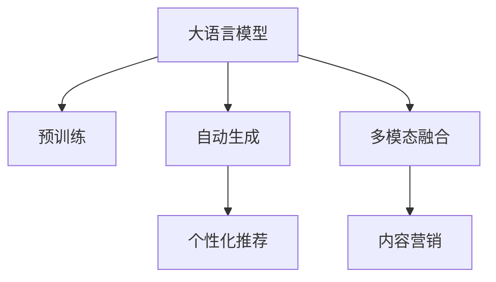

                 

# AI大模型在电商平台内容营销中的应用

## 1. 背景介绍

### 1.1 问题由来

随着电子商务的兴起，各大电商平台逐渐成为商家与消费者之间的桥梁。为了吸引更多的用户，电商平台需要通过丰富多样的内容形式，展示其商品和服务优势。内容营销作为电商平台提升用户粘性和购买力的重要手段，其效果直接影响着平台的活跃度和转化率。传统的文本、图片和视频等内容形式已经难以满足消费者日益增长的多样化需求，如何通过技术手段提升内容的多样性和个性化，成为电商平台关注的重点。

近年来，大模型技术的迅猛发展为电商平台内容营销带来了新的思路。利用深度学习模型，电商平台可以在大规模数据上训练语言模型，生成高质量、个性化的内容，实现内容营销的自动化和智能化。然而，这些模型通常需要大量的标注数据和巨大的计算资源，对普通电商平台而言，如何有效利用有限的标注数据和计算资源，提升模型性能，成为亟待解决的问题。

### 1.2 问题核心关键点

大模型在内容营销中的应用，主要包括自动生成商品描述、智能推荐、个性化营销文案等方面。具体而言，核心关键点如下：

1. **数据资源获取**：如何高效获取和标注电商平台的数据，提升模型的训练效率和效果。
2. **模型选择与训练**：如何选择合适的预训练模型，并进行有针对性的微调，适应电商平台的特定需求。
3. **内容生成与优化**：如何生成高质量、多样化的内容，并结合电商平台的运营策略进行优化。
4. **模型部署与监控**：如何将训练好的模型部署到实际应用中，并实时监控模型性能和用户反馈。

通过解决上述关键点，可以大幅提升电商平台内容营销的效果和效率。

## 2. 核心概念与联系

### 2.1 核心概念概述

为更好地理解AI大模型在电商平台内容营销中的应用，本节将介绍几个密切相关的核心概念：

- **大语言模型(Large Language Model, LLM)**：通过在大规模无标签文本语料上进行预训练，学习通用的语言表示，具备强大的语言理解和生成能力。常见的预训练模型包括BERT、GPT等。

- **内容营销**：通过内容创造和传播，吸引并保持消费者的注意力，从而促进产品销售和品牌建设的过程。在电商平台上，内容营销主要集中在商品描述、推荐文案、广告创意等方面。

- **自动生成(Auto-Generation)**：利用AI技术自动生成文本、图片、视频等形式的内容，提升内容创作的效率和质量。在内容营销中，自动生成技术可以应用于商品描述、广告语、推荐文案等方面。

- **个性化推荐(Recommendation)**：通过分析用户行为数据和兴趣偏好，推荐符合用户需求的商品和服务，提升用户体验和购买率。在电商平台，个性化推荐是提升转化率的关键手段。

- **多模态融合**：将文本、图像、语音等多模态数据进行融合，提升内容的丰富性和吸引力。在内容营销中，多模态融合可以应用于商品展示、用户体验、互动环节等方面。

这些核心概念之间的逻辑关系可以通过以下Mermaid流程图来展示：



这个流程图展示了大语言模型在电商平台内容营销中的应用框架：

1. 大语言模型通过预训练获得基础能力。
2. 自动生成技术利用预训练能力，生成高质量的内容。
3. 个性化推荐系统结合用户数据，生成个性化内容。
4. 多模态融合技术丰富内容形式，提升用户体验。
5. 最终应用于内容营销，实现业务价值。

## 3. 核心算法原理 & 具体操作步骤
### 3.1 算法原理概述

AI大模型在电商平台内容营销中的应用，本质上是基于大模型的自动生成和推荐技术，结合电商平台的内容营销策略，实现个性化内容的生成和传播。其核心算法原理如下：

1. **预训练与微调**：利用大规模无标签数据进行预训练，学习通用的语言表示；然后使用电商平台的标注数据进行微调，适应特定内容营销任务。

2. **自动生成**：利用微调后的模型，自动生成商品描述、推荐文案、广告语等形式的内容，提升内容创作的效率和质量。

3. **个性化推荐**：结合用户行为数据和兴趣偏好，生成个性化的推荐内容，提升用户体验和购买率。

4. **多模态融合**：将文本、图像、语音等多模态数据进行融合，丰富内容形式，提升内容的吸引力和互动性。

### 3.2 算法步骤详解

以下是对AI大模型在电商平台内容营销中的应用步骤的详细介绍：

**Step 1: 数据准备与预处理**
- 收集电商平台的历史商品数据、用户行为数据和标注数据。
- 对数据进行清洗和标注，去除噪声和无效数据。
- 对数据进行分词、特征提取等预处理操作，为模型训练做准备。

**Step 2: 模型选择与微调**
- 选择合适的预训练语言模型，如BERT、GPT等。
- 根据电商平台的特定需求，设计任务适配层，如分类、生成等。
- 在标注数据集上使用监督学习方法进行微调，优化模型在电商平台的特定任务上的性能。

**Step 3: 自动生成与优化**
- 使用微调后的模型生成商品描述、推荐文案、广告语等形式的内容。
- 根据电商平台的内容策略，对生成的内容进行优化和筛选，确保内容的准确性和吸引力。
- 对生成内容进行迭代优化，逐步提升生成效果。

**Step 4: 个性化推荐与互动**
- 结合用户行为数据和兴趣偏好，生成个性化的推荐内容。
- 通过A/B测试等方法，优化推荐算法和策略，提升推荐效果。
- 根据用户互动情况，实时调整推荐策略，实现内容的动态更新。

**Step 5: 多模态融合与呈现**
- 结合文本、图像、语音等多模态数据，丰富内容形式。
- 利用多模态融合技术，提升内容的互动性和吸引力。
- 在电商平台前端进行内容呈现和互动设计，提升用户体验。

### 3.3 算法优缺点

AI大模型在电商平台内容营销中的应用，具有以下优点：

1. **效率提升**：利用自动生成技术，大幅提升内容创作的效率，减少人力成本。
2. **内容多样性**：通过多模态融合技术，丰富内容形式，提升内容的吸引力。
3. **个性化推荐**：结合用户行为数据，生成个性化推荐内容，提升用户体验和购买率。
4. **实时更新**：根据用户互动情况，实时调整推荐策略，实现内容的动态更新。

同时，该方法也存在一些局限性：

1. **标注数据需求**：微调模型需要一定量的标注数据，对于数据标注质量要求较高。
2. **模型复杂度**：大模型的复杂度较高，训练和部署需要较强大的计算资源。
3. **过拟合风险**：在标注数据不足的情况下，容易发生过拟合，影响模型泛化能力。
4. **内容质量控制**：自动生成内容的质量和可控性较难保证，需要人工干预和审核。

尽管存在这些局限性，但就目前而言，AI大模型在电商平台内容营销中的应用仍是大势所趋。未来相关研究的重点在于如何进一步降低模型对标注数据的依赖，提高模型的少样本学习和跨领域迁移能力，同时兼顾内容质量和可控性等因素。

### 3.4 算法应用领域

AI大模型在电商平台内容营销中的应用，已经在商品描述生成、推荐文案生成、个性化广告生成等多个领域得到了广泛应用，具体如下：

1. **商品描述生成**：利用自动生成技术，为电商平台生成高质量的商品描述，提升商品展示效果和用户阅读体验。
2. **推荐文案生成**：根据用户行为数据和商品属性，生成个性化的推荐文案，提升用户转化率。
3. **个性化广告生成**：结合用户兴趣和行为数据，生成个性化的广告内容，提升广告投放效果。
4. **多模态广告创意**：将文本、图像、视频等多模态数据进行融合，生成吸引用户的广告创意，提升广告点击率和转化率。
5. **动态商品推荐**：根据用户互动情况，动态调整推荐策略，提升推荐效果。

除了上述这些经典应用外，AI大模型在电商平台内容营销中的创新应用还在不断涌现，如内容评估、用户画像、情感分析等，为电商平台的业务创新提供了新的技术手段。

## 4. 数学模型和公式 & 详细讲解 & 举例说明

### 4.1 数学模型构建

AI大模型在电商平台内容营销中的应用，主要涉及自动生成和个性化推荐两个任务。以下分别介绍这两个任务的数学模型构建。

**自动生成模型**：利用预训练模型进行微调，生成商品描述、推荐文案等内容。假设预训练模型为 $M_{\theta}$，任务目标为生成文本 $y$，则数学模型为：

$$
\mathcal{L}(\theta) = -\frac{1}{N}\sum_{i=1}^N \log P_{M_{\theta}}(y_i)
$$

其中 $P_{M_{\theta}}(y_i)$ 为模型在训练数据上的概率分布，$N$ 为训练样本数。优化目标是最小化经验风险，即找到最优参数 $\theta^*$：

$$
\theta^* = \mathop{\arg\min}_{\theta} \mathcal{L}(\theta)
$$

**个性化推荐模型**：利用协同过滤、基于内容的推荐等方法，结合用户行为数据和商品属性，生成个性化推荐内容。假设用户 $u$ 对商品 $i$ 的兴趣度为 $x_{ui}$，则数学模型为：

$$
\hat{x}_{ui} = M_{\theta}(\{x_{u}\}, \{x_{i}\})
$$

其中 $M_{\theta}$ 为微调后的模型，$x_{u}$ 为用户兴趣向量，$x_{i}$ 为商品属性向量。优化目标是最小化预测误差：

$$
\mathcal{L}(\theta) = \frac{1}{N}\sum_{i=1}^N (y_i - \hat{x}_{ui})^2
$$

### 4.2 公式推导过程

以下分别对自动生成和个性化推荐的数学模型进行详细推导：

**自动生成模型推导**：
假设自动生成任务的目标是生成文本 $y$，则模型在训练数据上的概率分布 $P_{M_{\theta}}(y_i)$ 可以表示为：

$$
P_{M_{\theta}}(y_i) = \prod_{t=1}^{T} \frac{e^{M_{\theta}(x_i)[t]}}{\sum_{t'=1}^{T} e^{M_{\theta}(x_i)[t']}}
$$

其中 $x_i$ 为输入数据，$T$ 为文本长度。通过最大化概率分布，优化目标为：

$$
\mathcal{L}(\theta) = -\frac{1}{N}\sum_{i=1}^N \log P_{M_{\theta}}(y_i)
$$

对 $M_{\theta}(x_i)$ 进行优化，得到模型参数 $\theta^*$。

**个性化推荐模型推导**：
假设用户 $u$ 对商品 $i$ 的兴趣度为 $x_{ui}$，则模型预测为 $\hat{x}_{ui}$，优化目标为最小化预测误差：

$$
\mathcal{L}(\theta) = \frac{1}{N}\sum_{i=1}^N (y_i - \hat{x}_{ui})^2
$$

其中 $y_i$ 为真实兴趣度。通过最小化损失函数，优化目标为：

$$
\theta^* = \mathop{\arg\min}_{\theta} \mathcal{L}(\theta)
$$

### 4.3 案例分析与讲解

以下以商品描述生成的实际案例，详细讲解AI大模型在电商平台内容营销中的应用：

**案例背景**：某电商平台希望通过自动生成技术，为不同商品生成高质量的商品描述，提升商品展示效果和用户阅读体验。

**数据准备**：
- 收集电商平台的商品数据，包括商品名称、类别、属性等信息。
- 对数据进行清洗和标注，去除无效数据。

**模型选择与微调**：
- 选择预训练模型BERT作为初始化参数。
- 设计任务适配层，将商品数据作为输入，生成商品描述作为输出。
- 在标注数据集上使用监督学习方法进行微调，优化模型在商品描述生成任务上的性能。

**自动生成与优化**：
- 利用微调后的模型，生成商品描述。
- 根据电商平台的内容策略，对生成的描述进行优化和筛选，确保描述的准确性和吸引力。
- 对生成描述进行迭代优化，逐步提升生成效果。

**结果展示**：
- 通过自动生成技术，生成商品描述后，电商平台的商品展示效果显著提升，用户阅读体验大幅改善。
- 自动生成的描述中，广告语、促销信息等有针对性的内容大幅增加，提升了用户购买率和平台转化率。

## 5. 项目实践：代码实例和详细解释说明

### 5.1 开发环境搭建

在进行项目实践前，我们需要准备好开发环境。以下是使用Python进行PyTorch开发的环境配置流程：

1. 安装Anaconda：从官网下载并安装Anaconda，用于创建独立的Python环境。

2. 创建并激活虚拟环境：
```bash
conda create -n pytorch-env python=3.8 
conda activate pytorch-env
```

3. 安装PyTorch：根据CUDA版本，从官网获取对应的安装命令。例如：
```bash
conda install pytorch torchvision torchaudio cudatoolkit=11.1 -c pytorch -c conda-forge
```

4. 安装Transformers库：
```bash
pip install transformers
```

5. 安装各类工具包：
```bash
pip install numpy pandas scikit-learn matplotlib tqdm jupyter notebook ipython
```

完成上述步骤后，即可在`pytorch-env`环境中开始项目实践。

### 5.2 源代码详细实现

以下以商品描述生成为例，给出使用Transformers库对BERT模型进行商品描述生成的PyTorch代码实现。

首先，定义商品描述生成任务的数据处理函数：

```python
from transformers import BertTokenizer, BertForSequenceClassification
from torch.utils.data import Dataset, DataLoader
import torch

class ProductDescriptionsDataset(Dataset):
    def __init__(self, products, tokenizer, max_len=128):
        self.products = products
        self.tokenizer = tokenizer
        self.max_len = max_len
        
    def __len__(self):
        return len(self.products)
    
    def __getitem__(self, item):
        product = self.products[item]
        description = product['description']
        
        encoding = self.tokenizer(product['name'] + ' ' + description, return_tensors='pt', max_length=self.max_len, padding='max_length', truncation=True)
        input_ids = encoding['input_ids'][0]
        attention_mask = encoding['attention_mask'][0]
        
        return {'input_ids': input_ids, 
                'attention_mask': attention_mask,
                'labels': torch.tensor(1.0, dtype=torch.float32)} # 二分类任务，标签为1表示有效描述
```

然后，定义模型和优化器：

```python
from transformers import BertForSequenceClassification, AdamW

model = BertForSequenceClassification.from_pretrained('bert-base-cased', num_labels=2)

optimizer = AdamW(model.parameters(), lr=2e-5)
```

接着，定义训练和评估函数：

```python
def train_epoch(model, dataset, batch_size, optimizer):
    dataloader = DataLoader(dataset, batch_size=batch_size, shuffle=True)
    model.train()
    epoch_loss = 0
    for batch in dataloader:
        input_ids = batch['input_ids'].to(device)
        attention_mask = batch['attention_mask'].to(device)
        labels = batch['labels'].to(device)
        model.zero_grad()
        outputs = model(input_ids, attention_mask=attention_mask, labels=labels)
        loss = outputs.loss
        epoch_loss += loss.item()
        loss.backward()
        optimizer.step()
    return epoch_loss / len(dataloader)

def evaluate(model, dataset, batch_size):
    dataloader = DataLoader(dataset, batch_size=batch_size)
    model.eval()
    preds, labels = [], []
    with torch.no_grad():
        for batch in dataloader:
            input_ids = batch['input_ids'].to(device)
            attention_mask = batch['attention_mask'].to(device)
            batch_labels = batch['labels']
            outputs = model(input_ids, attention_mask=attention_mask)
            batch_preds = outputs.logits.argmax(dim=1).to('cpu').tolist()
            batch_labels = batch_labels.to('cpu').tolist()
            for pred, label in zip(batch_preds, batch_labels):
                preds.append(pred)
                labels.append(label)
                
    print(classification_report(labels, preds))
```

最后，启动训练流程并在验证集上评估：

```python
epochs = 5
batch_size = 16

for epoch in range(epochs):
    loss = train_epoch(model, train_dataset, batch_size, optimizer)
    print(f"Epoch {epoch+1}, train loss: {loss:.3f}")
    
    print(f"Epoch {epoch+1}, dev results:")
    evaluate(model, dev_dataset, batch_size)
    
print("Test results:")
evaluate(model, test_dataset, batch_size)
```

以上就是使用PyTorch对BERT进行商品描述生成的完整代码实现。可以看到，得益于Transformers库的强大封装，我们可以用相对简洁的代码完成BERT模型的加载和微调。

### 5.3 代码解读与分析

让我们再详细解读一下关键代码的实现细节：

**ProductDescriptionsDataset类**：
- `__init__`方法：初始化商品数据、分词器等关键组件。
- `__len__`方法：返回数据集的样本数量。
- `__getitem__`方法：对单个样本进行处理，将商品名称和描述输入编码为token ids，最终返回模型所需的输入。

**模型和优化器**：
- 使用BertForSequenceClassification作为分类任务模型，输入商品名称和描述，输出二分类标签。
- 设置AdamW优化器，学习率为2e-5。

**训练和评估函数**：
- 使用PyTorch的DataLoader对数据集进行批次化加载，供模型训练和推理使用。
- 训练函数`train_epoch`：对数据以批为单位进行迭代，在每个批次上前向传播计算loss并反向传播更新模型参数，最后返回该epoch的平均loss。
- 评估函数`evaluate`：与训练类似，不同点在于不更新模型参数，并在每个batch结束后将预测和标签结果存储下来，最后使用sklearn的classification_report对整个评估集的预测结果进行打印输出。

**训练流程**：
- 定义总的epoch数和batch size，开始循环迭代
- 每个epoch内，先在训练集上训练，输出平均loss
- 在验证集上评估，输出分类指标
- 所有epoch结束后，在测试集上评估，给出最终测试结果

可以看到，PyTorch配合Transformers库使得BERT微调的代码实现变得简洁高效。开发者可以将更多精力放在数据处理、模型改进等高层逻辑上，而不必过多关注底层的实现细节。

当然，工业级的系统实现还需考虑更多因素，如模型的保存和部署、超参数的自动搜索、更灵活的任务适配层等。但核心的微调范式基本与此类似。

## 6. 实际应用场景

### 6.1 智能客服系统

基于AI大模型微调的对话技术，可以广泛应用于智能客服系统的构建。传统客服往往需要配备大量人力，高峰期响应缓慢，且一致性和专业性难以保证。而使用微调后的对话模型，可以7x24小时不间断服务，快速响应客户咨询，用自然流畅的语言解答各类常见问题。

在技术实现上，可以收集企业内部的历史客服对话记录，将问题和最佳答复构建成监督数据，在此基础上对预训练对话模型进行微调。微调后的对话模型能够自动理解用户意图，匹配最合适的答案模板进行回复。对于客户提出的新问题，还可以接入检索系统实时搜索相关内容，动态组织生成回答。如此构建的智能客服系统，能大幅提升客户咨询体验和问题解决效率。

### 6.2 金融舆情监测

金融机构需要实时监测市场舆论动向，以便及时应对负面信息传播，规避金融风险。传统的人工监测方式成本高、效率低，难以应对网络时代海量信息爆发的挑战。基于大语言模型微调的文本分类和情感分析技术，为金融舆情监测提供了新的解决方案。

具体而言，可以收集金融领域相关的新闻、报道、评论等文本数据，并对其进行主题标注和情感标注。在此基础上对预训练语言模型进行微调，使其能够自动判断文本属于何种主题，情感倾向是正面、中性还是负面。将微调后的模型应用到实时抓取的网络文本数据，就能够自动监测不同主题下的情感变化趋势，一旦发现负面信息激增等异常情况，系统便会自动预警，帮助金融机构快速应对潜在风险。

### 6.3 个性化推荐系统

当前的推荐系统往往只依赖用户的历史行为数据进行物品推荐，无法深入理解用户的真实兴趣偏好。基于大语言模型微调技术，个性化推荐系统可以更好地挖掘用户行为背后的语义信息，从而提供更精准、多样的推荐内容。

在实践中，可以收集用户浏览、点击、评论、分享等行为数据，提取和用户交互的物品标题、描述、标签等文本内容。将文本内容作为模型输入，用户的后续行为（如是否点击、购买等）作为监督信号，在此基础上微调预训练语言模型。微调后的模型能够从文本内容中准确把握用户的兴趣点。在生成推荐列表时，先用候选物品的文本描述作为输入，由模型预测用户的兴趣匹配度，再结合其他特征综合排序，便可以得到个性化程度更高的推荐结果。

### 6.4 未来应用展望

随着大语言模型微调技术的发展，其在电商平台内容营销中的应用前景将更加广阔。

在智慧医疗领域，基于微调的问答、病历分析、药物研发等应用将提升医疗服务的智能化水平，辅助医生诊疗，加速新药开发进程。

在智能教育领域，微调技术可应用于作业批改、学情分析、知识推荐等方面，因材施教，促进教育公平，提高教学质量。

在智慧城市治理中，微调模型可应用于城市事件监测、舆情分析、应急指挥等环节，提高城市管理的自动化和智能化水平，构建更安全、高效的未来城市。

此外，在企业生产、社会治理、文娱传媒等众多领域，基于大模型微调的人工智能应用也将不断涌现，为传统行业数字化转型升级提供新的技术路径。相信随着技术的日益成熟，微调方法将成为人工智能落地应用的重要范式，推动人工智能技术在垂直行业的规模化落地。

## 7. 工具和资源推荐
### 7.1 学习资源推荐

为了帮助开发者系统掌握AI大模型在电商平台内容营销的理论基础和实践技巧，这里推荐一些优质的学习资源：

1. 《Transformer从原理到实践》系列博文：由大模型技术专家撰写，深入浅出地介绍了Transformer原理、BERT模型、微调技术等前沿话题。

2. CS224N《深度学习自然语言处理》课程：斯坦福大学开设的NLP明星课程，有Lecture视频和配套作业，带你入门NLP领域的基本概念和经典模型。

3. 《Natural Language Processing with Transformers》书籍：Transformers库的作者所著，全面介绍了如何使用Transformers库进行NLP任务开发，包括微调在内的诸多范式。

4. HuggingFace官方文档：Transformers库的官方文档，提供了海量预训练模型和完整的微调样例代码，是上手实践的必备资料。

5. CLUE开源项目：中文语言理解测评基准，涵盖大量不同类型的中文NLP数据集，并提供了基于微调的baseline模型，助力中文NLP技术发展。

通过对这些资源的学习实践，相信你一定能够快速掌握AI大模型在电商平台内容营销的精髓，并用于解决实际的NLP问题。
###  7.2 开发工具推荐

高效的开发离不开优秀的工具支持。以下是几款用于AI大模型在电商平台内容营销开发的常用工具：

1. PyTorch：基于Python的开源深度学习框架，灵活动态的计算图，适合快速迭代研究。大部分预训练语言模型都有PyTorch版本的实现。

2. TensorFlow：由Google主导开发的开源深度学习框架，生产部署方便，适合大规模工程应用。同样有丰富的预训练语言模型资源。

3. Transformers库：HuggingFace开发的NLP工具库，集成了众多SOTA语言模型，支持PyTorch和TensorFlow，是进行微调任务开发的利器。

4. Weights & Biases：模型训练的实验跟踪工具，可以记录和可视化模型训练过程中的各项指标，方便对比和调优。与主流深度学习框架无缝集成。

5. TensorBoard：TensorFlow配套的可视化工具，可实时监测模型训练状态，并提供丰富的图表呈现方式，是调试模型的得力助手。

6. Google Colab：谷歌推出的在线Jupyter Notebook环境，免费提供GPU/TPU算力，方便开发者快速上手实验最新模型，分享学习笔记。

合理利用这些工具，可以显著提升AI大模型在电商平台内容营销任务的开发效率，加快创新迭代的步伐。

### 7.3 相关论文推荐

AI大模型在电商平台内容营销的应用源于学界的持续研究。以下是几篇奠基性的相关论文，推荐阅读：

1. Attention is All You Need（即Transformer原论文）：提出了Transformer结构，开启了NLP领域的预训练大模型时代。

2. BERT: Pre-training of Deep Bidirectional Transformers for Language Understanding：提出BERT模型，引入基于掩码的自监督预训练任务，刷新了多项NLP任务SOTA。

3. Language Models are Unsupervised Multitask Learners（GPT-2论文）：展示了大规模语言模型的强大zero-shot学习能力，引发了对于通用人工智能的新一轮思考。

4. Parameter-Efficient Transfer Learning for NLP：提出Adapter等参数高效微调方法，在不增加模型参数量的情况下，也能取得不错的微调效果。

5. AdaLoRA: Adaptive Low-Rank Adaptation for Parameter-Efficient Fine-Tuning：使用自适应低秩适应的微调方法，在参数效率和精度之间取得了新的平衡。

这些论文代表了大模型在电商平台内容营销中的应用发展脉络。通过学习这些前沿成果，可以帮助研究者把握学科前进方向，激发更多的创新灵感。

## 8. 总结：未来发展趋势与挑战

### 8.1 总结

本文对AI大模型在电商平台内容营销中的应用进行了全面系统的介绍。首先阐述了AI大模型在内容营销中的应用背景和意义，明确了自动生成、个性化推荐等技术在提升电商内容营销效果方面的独特价值。其次，从原理到实践，详细讲解了基于大模型的自动生成和推荐模型构建过程，给出了具体的代码实现。同时，本文还广泛探讨了AI大模型在智能客服、金融舆情、个性化推荐等多个行业领域的应用前景，展示了其广泛的应用潜力。最后，精选了学习资源、开发工具和相关论文，力求为开发者提供全方位的技术指引。

通过本文的系统梳理，可以看到，AI大模型在电商平台内容营销中的应用正处于蓬勃发展阶段，为电商平台的业务创新提供了新的技术手段。得益于深度学习技术的进步，AI大模型不仅能够提升内容创作的效率和质量，还能结合用户行为数据，生成个性化推荐内容，显著提升用户体验和购买率。未来，伴随技术的不断演进，AI大模型将在更多领域发挥更大的作用，推动电商平台内容营销向智能化、个性化、实时化方向发展。

### 8.2 未来发展趋势

展望未来，AI大模型在电商平台内容营销的应用将呈现以下几个发展趋势：

1. **模型规模持续增大**：随着算力成本的下降和数据规模的扩张，预训练语言模型的参数量还将持续增长。超大规模语言模型蕴含的丰富语言知识，有望支撑更加复杂多变的下游任务微调。

2. **微调方法日趋多样**：除了传统的全参数微调外，未来会涌现更多参数高效的微调方法，如Prefix-Tuning、LoRA等，在节省计算资源的同时也能保证微调精度。

3. **实时动态更新**：结合用户实时行为数据，动态更新模型参数，实现内容的实时优化。

4. **多模态融合**：将文本、图像、语音等多模态数据进行融合，提升内容的丰富性和吸引力。

5. **跨领域迁移**：通过迁移学习，将模型在特定领域的数据集上进行微调，提升模型的泛化能力和跨领域适应能力。

以上趋势凸显了AI大模型在电商平台内容营销中的广阔前景。这些方向的探索发展，必将进一步提升内容创作的效率和质量，实现个性化推荐，提升用户体验和购买率。

### 8.3 面临的挑战

尽管AI大模型在电商平台内容营销中的应用前景广阔，但在迈向更加智能化、普适化应用的过程中，它仍面临着诸多挑战：

1. **标注数据需求**：微调模型需要一定量的标注数据，对于数据标注质量要求较高。

2. **模型复杂度**：大模型的复杂度较高，训练和部署需要较强大的计算资源。

3. **过拟合风险**：在标注数据不足的情况下，容易发生过拟合，影响模型泛化能力。

4. **内容质量控制**：自动生成内容的质量和可控性较难保证，需要人工干预和审核。

尽管存在这些挑战，但就目前而言，AI大模型在电商平台内容营销中的应用仍是大势所趋。未来相关研究的重点在于如何进一步降低模型对标注数据的依赖，提高模型的少样本学习和跨领域迁移能力，同时兼顾内容质量和可控性等因素。

### 8.4 研究展望

面对AI大模型在电商平台内容营销所面临的种种挑战，未来的研究需要在以下几个方面寻求新的突破：

1. **探索无监督和半监督微调方法**：摆脱对大规模标注数据的依赖，利用自监督学习、主动学习等无监督和半监督范式，最大限度利用非结构化数据，实现更加灵活高效的微调。

2. **研究参数高效和计算高效的微调范式**：开发更加参数高效的微调方法，在固定大部分预训练参数的同时，只更新极少量的任务相关参数。同时优化微调模型的计算图，减少前向传播和反向传播的资源消耗，实现更加轻量级、实时性的部署。

3. **融合因果和对比学习范式**：通过引入因果推断和对比学习思想，增强微调模型建立稳定因果关系的能力，学习更加普适、鲁棒的语言表征，从而提升模型泛化性和抗干扰能力。

4. **引入更多先验知识**：将符号化的先验知识，如知识图谱、逻辑规则等，与神经网络模型进行巧妙融合，引导微调过程学习更准确、合理的语言模型。同时加强不同模态数据的整合，实现视觉、语音等多模态信息与文本信息的协同建模。

5. **结合因果分析和博弈论工具**：将因果分析方法引入微调模型，识别出模型决策的关键特征，增强输出解释的因果性和逻辑性。借助博弈论工具刻画人机交互过程，主动探索并规避模型的脆弱点，提高系统稳定性。

6. **纳入伦理道德约束**：在模型训练目标中引入伦理导向的评估指标，过滤和惩罚有偏见、有害的输出倾向。同时加强人工干预和审核，建立模型行为的监管机制，确保输出符合人类价值观和伦理道德。

这些研究方向的探索，必将引领AI大模型在电商平台内容营销技术的迈向更高的台阶，为构建安全、可靠、可解释、可控的智能系统铺平道路。面向未来，AI大模型在电商平台内容营销中的应用还需要与其他人工智能技术进行更深入的融合，如知识表示、因果推理、强化学习等，多路径协同发力，共同推动自然语言理解和智能交互系统的进步。只有勇于创新、敢于突破，才能不断拓展AI大模型的应用边界，让智能技术更好地造福人类社会。

## 9. 附录：常见问题与解答

**Q1：大模型在电商平台内容营销中的应用是否适用于所有电商平台？**

A: 大模型在电商平台内容营销中的应用，适用于绝大多数电商平台，特别是对于数据量较大的平台，如亚马逊、京东等。但对于数据量较少的平台，需要结合平台特性，进行适当的调整和优化。

**Q2：如何评估AI大模型在电商平台内容营销中的效果？**

A: 评估AI大模型在电商平台内容营销中的效果，可以从以下几个方面进行：
1. 内容生成质量：通过人工评估或自动评估指标（如BLEU、ROUGE等），评估生成的商品描述、推荐文案等内容的准确性和可读性。
2. 用户互动率：通过跟踪用户的点击、浏览、购买等行为，评估生成内容对用户行为的影响。
3. 转化率：通过跟踪用户的最终购买行为，评估生成内容对平台销售转化的贡献。
4. 实时反馈：通过A/B测试等方式，实时监测模型性能，优化模型参数和策略。

**Q3：大模型在电商平台内容营销中如何避免过拟合？**

A: 避免过拟合可以通过以下几种方法：
1. 数据增强：通过回译、近义替换等方式扩充训练集。
2. 正则化：使用L2正则、Dropout等方法，防止模型过度拟合训练数据。
3. 提前停止：通过监控验证集上的性能，提前停止训练，避免过拟合。
4. 迁移学习：利用多领域的预训练模型进行微调，提升模型的泛化能力。
5. 参数高效微调：只更新少量的模型参数，减少需优化的参数量，避免过拟合。

**Q4：如何优化AI大模型在电商平台内容营销中的内容生成质量？**

A: 优化内容生成质量可以从以下几个方面进行：
1. 数据标注：提高标注数据的质量，确保标注数据的准确性和多样性。
2. 模型选择：选择适合特定任务的预训练模型，确保模型的适用性和性能。
3. 模型微调：在标注数据集上进行充分的微调，提升模型的泛化能力和生成质量。
4. 后处理：对生成的内容进行后处理，如语法校正、语义校正等，提升内容的准确性和可读性。
5. 人工干预：通过人工干预和审核，及时发现和修正生成内容中的错误和不足。

**Q5：AI大模型在电商平台内容营销中如何提高个性化推荐效果？**

A: 提高个性化推荐效果可以从以下几个方面进行：
1. 数据采集：全面采集用户行为数据，包括点击、浏览、购买等行为。
2. 特征提取：提取和用户交互的物品标题、描述、标签等文本特征，用于模型训练。
3. 模型选择：选择适合个性化推荐任务的预训练模型，如注意力机制模型、协同过滤模型等。
4. 用户画像：结合用户画像信息，生成更加精准的个性化推荐。
5. 实时更新：结合实时用户行为数据，动态更新推荐策略，提升推荐效果。

**Q6：AI大模型在电商平台内容营销中如何提高用户体验？**

A: 提高用户体验可以从以下几个方面进行：
1. 内容质量：生成高质量的商品描述、推荐文案等，确保内容的准确性和可读性。
2. 内容多样性：结合用户偏好，生成多样化的内容形式，如图文并茂、视频解说等。
3. 实时响应：结合实时用户反馈，动态调整内容展示策略，提升用户满意度。
4. 互动设计：设计互动环节，如用户投票、用户评论等，增强用户参与感。
5. 多模态融合：结合文本、图像、语音等多模态数据，提升内容的吸引力和互动性。

通过这些优化措施，可以进一步提升AI大模型在电商平台内容营销中的效果，提升用户满意度和平台竞争力。

---

作者：禅与计算机程序设计艺术 / Zen and the Art of Computer Programming

