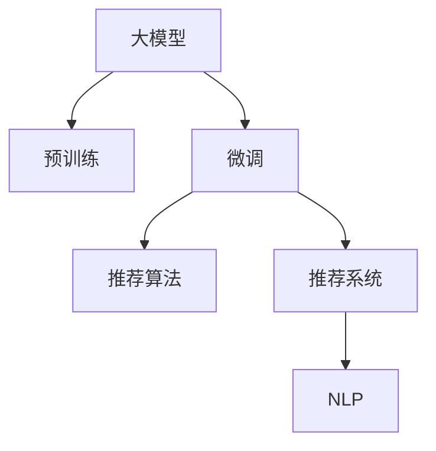

                 

# AI大模型在电商平台商品关联分析中的应用

> 关键词：大模型,商品关联分析,电商平台,自然语言处理(NLP),推荐系统

## 1. 背景介绍

### 1.1 问题由来
随着电子商务的蓬勃发展，电商平台已成为消费者购物的重要渠道。为了提升用户体验和销售额，电商平台需要提供个性化的商品推荐服务。商品关联分析通过对用户历史行为和商品特征进行建模，能够发现潜在的关系，从而实现精准推荐。然而，传统的关联分析方法如共现分析、协方差矩阵等，难以适应电商平台上海量数据和复杂商品特征的需求。

大模型技术的兴起，为商品关联分析提供了新的解决方案。通过在大规模语料和电商数据上进行预训练，大模型可以学习到丰富的语言和商品知识，通过微调即可适配电商平台的推荐场景，从而在商品关联分析中发挥巨大作用。

### 1.2 问题核心关键点
基于大模型的商品关联分析方法，主要依赖于以下几个关键点：

- 预训练：使用大规模无标签语料和电商数据对大模型进行预训练，学习通用的语言和商品表示。
- 微调：在大模型预训练的基础上，针对电商平台的推荐任务进行微调，优化模型参数以提高推荐效果。
- 推荐算法：结合微调后的模型，设计推荐算法，生成个性化商品推荐列表。

大模型在商品关联分析中的核心优势在于其强大的语言理解能力和知识迁移能力，能够从文本数据中挖掘出复杂的语义信息，并将这些信息转化为推荐场景下的有用特征。

### 1.3 问题研究意义
研究大模型在电商平台商品关联分析中的应用，对于提升电商平台的推荐效果，增强用户粘性，促进销售增长，具有重要意义：

1. 提升推荐效果：大模型能够从大量语料中学习到丰富的语言知识和商品知识，经过微调后能够更好地适应电商推荐场景，提供更为精准的商品推荐。
2. 降低推荐成本：传统推荐系统依赖人工特征工程，费时费力，而大模型可自动提取特征，降低人工成本。
3. 增加用户粘性：个性化的商品推荐能够满足用户的个性化需求，提升购物体验，增加用户留存率。
4. 促进销售增长：精准推荐能够有效提升商品的曝光率和点击率，进而提升销售额。
5. 推动技术发展：大模型技术的发展和应用，促进了推荐系统领域的科技进步，推动了人工智能技术的落地应用。

## 2. 核心概念与联系

### 2.1 核心概念概述

为更好地理解大模型在商品关联分析中的应用，本节将介绍几个密切相关的核心概念：

- 大模型(Large Model)：以Transformer、BERT等深度学习模型为代表的大规模预训练模型。通过在大规模无标签语料和电商数据上进行预训练，学习通用的语言和商品表示。
- 预训练(Pre-training)：指在大规模无标签语料和电商数据上进行自监督学习任务训练通用语言和商品模型的过程。预训练使得模型学习到通用的语言和商品表示。
- 微调(Fine-tuning)：指在预训练模型的基础上，使用电商平台的推荐任务标注数据，通过有监督学习优化模型在特定任务上的性能。
- 推荐算法(Recommendation Algorithm)：结合微调后的模型，设计推荐算法，生成个性化商品推荐列表。
- 推荐系统(Recommendation System)：通过分析用户行为和商品特征，为用户推荐感兴趣的商品的系统。
- 自然语言处理(Natural Language Processing, NLP)：研究计算机如何理解和生成人类语言的技术，是大模型在电商平台商品关联分析中的重要应用领域。

这些核心概念之间的逻辑关系可以通过以下Mermaid流程图来展示：



这个流程图展示了大模型在电商平台商品关联分析中的核心概念及其之间的关系：

1. 大模型通过预训练获得基础能力。
2. 微调在大模型预训练的基础上，针对电商平台的推荐任务进行优化。
3. 推荐算法结合微调后的模型，生成个性化推荐列表。
4. 推荐系统基于推荐算法生成推荐结果，为用户服务。
5. NLP技术作为推荐系统的重要工具，帮助解析和理解用户需求和商品信息。

这些概念共同构成了大模型在电商平台商品关联分析中的应用框架，使其能够在电商推荐场景中发挥强大的作用。通过理解这些核心概念，我们可以更好地把握大模型的应用逻辑和优化方向。

## 3. 核心算法原理 & 具体操作步骤
### 3.1 算法原理概述

基于大模型的电商平台商品关联分析方法，本质上是一个有监督的细粒度迁移学习过程。其核心思想是：将大模型视作一个强大的"特征提取器"，通过在电商推荐任务的标注数据上进行有监督微调，使得模型输出能够匹配任务标签，从而获得针对电商推荐任务的优化模型。

形式化地，假设大模型为 $M_{\theta}$，其中 $\theta$ 为预训练得到的模型参数。电商推荐任务 $T$ 的标注数据集 $D=\{(x_i, y_i)\}_{i=1}^N$，其中 $x_i$ 为用户行为记录，$y_i$ 为推荐列表。微调的目标是找到新的模型参数 $\hat{\theta}$，使得：

$$
\hat{\theta}=\mathop{\arg\min}_{\theta} \mathcal{L}(M_{\theta},D)
$$

其中 $\mathcal{L}$ 为针对任务 $T$ 设计的损失函数，用于衡量模型预测输出与真实标签之间的差异。常见的损失函数包括交叉熵损失、均方误差损失等。

通过梯度下降等优化算法，微调过程不断更新模型参数 $\theta$，最小化损失函数 $\mathcal{L}$，使得模型输出逼近真实标签。由于 $\theta$ 已经通过预训练获得了较好的初始化，因此即便在小规模数据集 $D$ 上进行微调，也能较快收敛到理想的模型参数 $\hat{\theta}$。

### 3.2 算法步骤详解

基于大模型的电商平台商品关联分析一般包括以下几个关键步骤：

**Step 1: 准备预训练模型和数据集**
- 选择合适的预训练大模型 $M_{\theta}$ 作为初始化参数，如BERT、RoBERTa等。
- 准备电商平台推荐任务的标注数据集 $D$，划分为训练集、验证集和测试集。一般要求标注数据与预训练数据的分布不要差异过大。

**Step 2: 设计任务适配层**
- 根据任务类型，在预训练模型顶层设计合适的输出层和损失函数。
- 对于推荐任务，通常在顶层添加用户行为-商品关系的分类器，交叉熵损失函数。
- 对于文本推荐任务，通常使用语言模型的解码器输出概率分布，并以负对数似然为损失函数。

**Step 3: 设置微调超参数**
- 选择合适的优化算法及其参数，如 AdamW、SGD 等，设置学习率、批大小、迭代轮数等。
- 设置正则化技术及强度，包括权重衰减、Dropout、Early Stopping 等。
- 确定冻结预训练参数的策略，如仅微调顶层，或全部参数都参与微调。

**Step 4: 执行梯度训练**
- 将训练集数据分批次输入模型，前向传播计算损失函数。
- 反向传播计算参数梯度，根据设定的优化算法和学习率更新模型参数。
- 周期性在验证集上评估模型性能，根据性能指标决定是否触发 Early Stopping。
- 重复上述步骤直到满足预设的迭代轮数或 Early Stopping 条件。

**Step 5: 测试和部署**
- 在测试集上评估微调后模型 $M_{\hat{\theta}}$ 的性能，对比微调前后的精度提升。
- 使用微调后的模型对新样本进行推理预测，集成到电商平台推荐系统中。
- 持续收集新的数据，定期重新微调模型，以适应数据分布的变化。

以上是基于大模型的电商平台商品关联分析的一般流程。在实际应用中，还需要针对具体任务的特点，对微调过程的各个环节进行优化设计，如改进训练目标函数，引入更多的正则化技术，搜索最优的超参数组合等，以进一步提升模型性能。

### 3.3 算法优缺点

基于大模型的电商平台商品关联分析方法具有以下优点：

- 简单高效。只需准备少量标注数据，即可对预训练模型进行快速适配，获得较大的性能提升。
- 泛化能力强。大模型经过大规模语料和电商数据的预训练，学习到通用的语言和商品表示，在特定任务上能够泛化到新的数据。
- 推荐效果显著。经过微调的大模型可以更好地理解用户行为和商品属性，生成更加精准的推荐列表。
- 参数高效。利用参数高效微调技术，在固定大部分预训练权重不变的情况下，仍可取得不错的提升。
- 实时更新。电商数据是动态变化的，定期重新微调模型，可以及时捕捉用户行为和商品属性的变化，保持推荐系统的时效性。

同时，该方法也存在一定的局限性：

- 依赖标注数据。微调的效果很大程度上取决于标注数据的质量和数量，获取高质量标注数据的成本较高。
- 模型复杂度高。大模型参数量巨大，推理和存储成本较高。
- 冷启动问题。对于新用户或新商品，缺少历史数据，无法使用传统的基于历史行为分析的推荐算法。
- 过拟合风险。电商数据量庞大且复杂，易出现过拟合现象。

尽管存在这些局限性，但就目前而言，基于大模型的商品关联分析方法仍是大数据时代电商平台推荐系统的重要手段。未来相关研究的重点在于如何进一步降低标注数据的依赖，提高模型的少样本学习和跨领域迁移能力，同时兼顾实时性和冷启动问题。

### 3.4 算法应用领域

基于大模型的电商平台商品关联分析方法，已经在电商推荐系统上得到了广泛的应用，覆盖了几乎所有推荐任务，例如：

- 用户兴趣推荐：根据用户浏览和购买历史，推荐用户可能感兴趣的商品。
- 商品相关推荐：根据商品属性、价格、评分等特征，推荐相关的商品。
- 个性化推荐：结合用户属性（如性别、年龄、职业等），生成个性化的推荐列表。
- 实时推荐：根据用户实时行为，动态调整推荐结果，提升推荐效率。

除了上述这些经典任务外，基于大模型的商品关联分析方法还被创新性地应用到更多场景中，如精准营销、库存管理、用户画像构建等，为电商平台提供了更加精准、高效的服务。

## 4. 数学模型和公式 & 详细讲解  
### 4.1 数学模型构建

本节将使用数学语言对基于大模型的电商平台商品关联分析过程进行更加严格的刻画。

记预训练大模型为 $M_{\theta}$，其中 $\theta$ 为预训练得到的模型参数。电商平台推荐任务的训练集为 $D=\{(x_i, y_i)\}_{i=1}^N$，其中 $x_i$ 为电商平台上用户的浏览、点击、购买等行为记录，$y_i$ 为推荐列表。

定义模型 $M_{\theta}$ 在数据样本 $(x,y)$ 上的损失函数为 $\ell(M_{\theta}(x),y)$，则在数据集 $D$ 上的经验风险为：

$$
\mathcal{L}(\theta) = \frac{1}{N} \sum_{i=1}^N \ell(M_{\theta}(x_i),y_i)
$$

微调的优化目标是最小化经验风险，即找到最优参数：

$$
\theta^* = \mathop{\arg\min}_{\theta} \mathcal{L}(\theta)
$$

在实践中，我们通常使用基于梯度的优化算法（如SGD、Adam等）来近似求解上述最优化问题。设 $\eta$ 为学习率，$\lambda$ 为正则化系数，则参数的更新公式为：

$$
\theta \leftarrow \theta - \eta \nabla_{\theta}\mathcal{L}(\theta) - \eta\lambda\theta
$$

其中 $\nabla_{\theta}\mathcal{L}(\theta)$ 为损失函数对参数 $\theta$ 的梯度，可通过反向传播算法高效计算。

### 4.2 公式推导过程

以下我们以推荐任务为例，推导交叉熵损失函数及其梯度的计算公式。

假设模型 $M_{\theta}$ 在输入 $x$ 上的输出为 $\hat{y}=M_{\theta}(x) \in [0,1]$，表示模型预测推荐列表属于某一特定类别的概率。真实标签 $y \in \{0,1\}$。则二分类交叉熵损失函数定义为：

$$
\ell(M_{\theta}(x),y) = -[y\log \hat{y} + (1-y)\log (1-\hat{y})]
$$

将其代入经验风险公式，得：

$$
\mathcal{L}(\theta) = -\frac{1}{N}\sum_{i=1}^N [y_i\log M_{\theta}(x_i)+(1-y_i)\log(1-M_{\theta}(x_i))]
$$

根据链式法则，损失函数对参数 $\theta_k$ 的梯度为：

$$
\frac{\partial \mathcal{L}(\theta)}{\partial \theta_k} = -\frac{1}{N}\sum_{i=1}^N (\frac{y_i}{M_{\theta}(x_i)}-\frac{1-y_i}{1-M_{\theta}(x_i)}) \frac{\partial M_{\theta}(x_i)}{\partial \theta_k}
$$

其中 $\frac{\partial M_{\theta}(x_i)}{\partial \theta_k}$ 可进一步递归展开，利用自动微分技术完成计算。

在得到损失函数的梯度后，即可带入参数更新公式，完成模型的迭代优化。重复上述过程直至收敛，最终得到适应电商平台推荐任务的最优模型参数 $\theta^*$。

## 5. 项目实践：代码实例和详细解释说明
### 5.1 开发环境搭建

在进行商品关联分析实践前，我们需要准备好开发环境。以下是使用Python进行PyTorch开发的环境配置流程：

1. 安装Anaconda：从官网下载并安装Anaconda，用于创建独立的Python环境。

2. 创建并激活虚拟环境：
```bash
conda create -n pytorch-env python=3.8 
conda activate pytorch-env
```

3. 安装PyTorch：根据CUDA版本，从官网获取对应的安装命令。例如：
```bash
conda install pytorch torchvision torchaudio cudatoolkit=11.1 -c pytorch -c conda-forge
```

4. 安装Transformers库：
```bash
pip install transformers
```

5. 安装各类工具包：
```bash
pip install numpy pandas scikit-learn matplotlib tqdm jupyter notebook ipython
```

完成上述步骤后，即可在`pytorch-env`环境中开始商品关联分析实践。

### 5.2 源代码详细实现

下面我们以电商平台商品推荐任务为例，给出使用Transformers库对BERT模型进行商品关联分析的PyTorch代码实现。

首先，定义推荐任务的数据处理函数：

```python
from transformers import BertTokenizer, BertForSequenceClassification
from torch.utils.data import Dataset
import torch

class RecommendationDataset(Dataset):
    def __init__(self, user_browses, item_features, labels, tokenizer, max_len=128):
        self.user_browses = user_browses
        self.item_features = item_features
        self.labels = labels
        self.tokenizer = tokenizer
        self.max_len = max_len
        
    def __len__(self):
        return len(self.user_browses)
    
    def __getitem__(self, item):
        user_browse = self.user_browses[item]
        item_feature = self.item_features[item]
        label = self.labels[item]
        
        encoded_browses = self.tokenizer(user_browse, return_tensors='pt', max_length=self.max_len, padding='max_length', truncation=True)
        encoded_item = self.tokenizer(item_feature, return_tensors='pt', max_length=self.max_len, padding='max_length', truncation=True)
        
        # 拼接用户行为和商品特征，作为输入
        input_ids = torch.cat([encoded_browses['input_ids'], encoded_item['input_ids']], dim=1)
        attention_mask = torch.cat([encoded_browses['attention_mask'], encoded_item['attention_mask']], dim=1)
        
        # 将标签拼接为输出
        labels = torch.tensor([label], dtype=torch.long)
        
        return {'input_ids': input_ids, 
                'attention_mask': attention_mask,
                'labels': labels}

# 标签与id的映射
label2id = {'1': 0, '2': 1, '3': 2}
id2label = {v: k for k, v in label2id.items()}

# 创建dataset
tokenizer = BertTokenizer.from_pretrained('bert-base-cased')

train_dataset = RecommendationDataset(train_user_browses, train_item_features, train_labels, tokenizer)
dev_dataset = RecommendationDataset(dev_user_browses, dev_item_features, dev_labels, tokenizer)
test_dataset = RecommendationDataset(test_user_browses, test_item_features, test_labels, tokenizer)
```

然后，定义模型和优化器：

```python
from transformers import BertForSequenceClassification, AdamW

model = BertForSequenceClassification.from_pretrained('bert-base-cased', num_labels=3)

optimizer = AdamW(model.parameters(), lr=2e-5)
```

接着，定义训练和评估函数：

```python
from torch.utils.data import DataLoader
from tqdm import tqdm
from sklearn.metrics import classification_report

device = torch.device('cuda') if torch.cuda.is_available() else torch.device('cpu')
model.to(device)

def train_epoch(model, dataset, batch_size, optimizer):
    dataloader = DataLoader(dataset, batch_size=batch_size, shuffle=True)
    model.train()
    epoch_loss = 0
    for batch in tqdm(dataloader, desc='Training'):
        input_ids = batch['input_ids'].to(device)
        attention_mask = batch['attention_mask'].to(device)
        labels = batch['labels'].to(device)
        model.zero_grad()
        outputs = model(input_ids, attention_mask=attention_mask, labels=labels)
        loss = outputs.loss
        epoch_loss += loss.item()
        loss.backward()
        optimizer.step()
    return epoch_loss / len(dataloader)

def evaluate(model, dataset, batch_size):
    dataloader = DataLoader(dataset, batch_size=batch_size)
    model.eval()
    preds, labels = [], []
    with torch.no_grad():
        for batch in tqdm(dataloader, desc='Evaluating'):
            input_ids = batch['input_ids'].to(device)
            attention_mask = batch['attention_mask'].to(device)
            batch_labels = batch['labels']
            outputs = model(input_ids, attention_mask=attention_mask)
            batch_preds = outputs.logits.argmax(dim=2).to('cpu').tolist()
            batch_labels = batch_labels.to('cpu').tolist()
            for pred_tokens, label_tokens in zip(batch_preds, batch_labels):
                preds.append(pred_tokens[:len(label_tokens)])
                labels.append(label_tokens)
                
    print(classification_report(labels, preds))
```

最后，启动训练流程并在测试集上评估：

```python
epochs = 5
batch_size = 16

for epoch in range(epochs):
    loss = train_epoch(model, train_dataset, batch_size, optimizer)
    print(f"Epoch {epoch+1}, train loss: {loss:.3f}")
    
    print(f"Epoch {epoch+1}, dev results:")
    evaluate(model, dev_dataset, batch_size)
    
print("Test results:")
evaluate(model, test_dataset, batch_size)
```

以上就是使用PyTorch对BERT进行电商平台商品关联分析的完整代码实现。可以看到，得益于Transformers库的强大封装，我们可以用相对简洁的代码完成BERT模型的加载和关联分析。

### 5.3 代码解读与分析

让我们再详细解读一下关键代码的实现细节：

**RecommendationDataset类**：
- `__init__`方法：初始化用户行为、商品特征、标签等关键组件，并使用分词器进行文本编码。
- `__len__`方法：返回数据集的样本数量。
- `__getitem__`方法：对单个样本进行处理，将用户行为和商品特征拼接，进行编码，得到模型所需的输入。

**label2id和id2label字典**：
- 定义了标签与数字id之间的映射关系，用于将预测结果解码回真实的标签。

**训练和评估函数**：
- 使用PyTorch的DataLoader对数据集进行批次化加载，供模型训练和推理使用。
- 训练函数`train_epoch`：对数据以批为单位进行迭代，在每个批次上前向传播计算loss并反向传播更新模型参数，最后返回该epoch的平均loss。
- 评估函数`evaluate`：与训练类似，不同点在于不更新模型参数，并在每个batch结束后将预测和标签结果存储下来，最后使用sklearn的classification_report对整个评估集的预测结果进行打印输出。

**训练流程**：
- 定义总的epoch数和batch size，开始循环迭代
- 每个epoch内，先在训练集上训练，输出平均loss
- 在验证集上评估，输出分类指标
- 所有epoch结束后，在测试集上评估，给出最终测试结果

可以看到，PyTorch配合Transformers库使得BERT关联分析的代码实现变得简洁高效。开发者可以将更多精力放在数据处理、模型改进等高层逻辑上，而不必过多关注底层的实现细节。

当然，工业级的系统实现还需考虑更多因素，如模型的保存和部署、超参数的自动搜索、更灵活的任务适配层等。但核心的关联分析范式基本与此类似。

## 6. 实际应用场景
### 6.1 智能推荐系统

基于大模型的电商平台商品关联分析方法，可以广泛应用于智能推荐系统的构建。传统的推荐系统往往依赖人工特征工程，难以捕捉复杂的用户行为和商品特征。而使用微调后的模型，可以自动学习并挖掘用户行为背后的语义信息，从而实现精准推荐。

在技术实现上，可以收集用户的浏览、点击、购买等行为数据，提取和商品相关的特征，如商品属性、用户评分等，构建训练集。将用户行为和商品特征作为输入，用户的后续行为（如是否点击、购买等）作为监督信号，在此基础上对预训练模型进行微调。微调后的模型能够自动理解用户行为和商品特征，生成个性化推荐列表。对于用户输入的新查询，可以继续动态调整推荐结果，提升推荐效果。

### 6.2 精准营销

电商平台通过精准营销可以更好地理解用户需求，增加用户粘性，提升销售转化率。基于大模型的关联分析方法，可以提取用户行为中的关键特征，并关联商品属性，生成精准的营销内容。具体而言，可以分析用户的浏览记录，提取出用户偏好的商品类别和关键词，进一步关联到相似的营销活动和促销信息，生成个性化的推荐广告。通过精准营销，电商平台能够更好地满足用户需求，提升营销效果。

### 6.3 库存管理

电商平台的库存管理需要平衡库存量与销售额，避免缺货和积压。基于大模型的关联分析方法，可以预测用户的购买意愿，从而优化库存管理。具体而言，可以分析用户的浏览记录，预测用户的购买行为，生成推荐列表，根据推荐列表的点击率，动态调整库存水平。如此，电商平台能够更好地控制库存，降低运营成本。

### 6.4 未来应用展望

随着大模型和关联分析方法的不断发展，基于大模型的推荐系统将在更多领域得到应用，为电商平台的运营管理带来变革性影响。

在智慧物流领域，基于大模型的关联分析方法可以应用于库存管理、配送路径优化等方面，提升物流效率和客户满意度。

在智能家居领域，关联分析可以应用于智能设备推荐、个性化广告投放等方面，为用户提供更智能化的家居体验。

在智慧金融领域，关联分析可以应用于金融产品推荐、风险评估等方面，提升金融服务质量，降低风险。

此外，在智能医疗、智慧教育、智慧交通等众多领域，基于大模型的关联分析方法也将不断涌现，为各行各业带来新的应用场景和创新思路。相信随着技术的日益成熟，大模型关联分析方法必将在构建智慧社会中扮演越来越重要的角色。

## 7. 工具和资源推荐
### 7.1 学习资源推荐

为了帮助开发者系统掌握大模型在电商平台商品关联分析中的应用，这里推荐一些优质的学习资源：

1. 《Transformers from Zero to Hero》系列博文：由大模型技术专家撰写，从基础到高级详细介绍了Transformer原理、BERT模型、微调技术等前沿话题。

2. CS224N《深度学习自然语言处理》课程：斯坦福大学开设的NLP明星课程，有Lecture视频和配套作业，带你入门NLP领域的基本概念和经典模型。

3. 《Natural Language Processing with Transformers》书籍：Transformers库的作者所著，全面介绍了如何使用Transformers库进行NLP任务开发，包括关联分析在内的诸多范式。

4. HuggingFace官方文档：Transformers库的官方文档，提供了海量预训练模型和完整的关联分析样例代码，是上手实践的必备资料。

5. CLUE开源项目：中文语言理解测评基准，涵盖大量不同类型的中文NLP数据集，并提供了基于微调的baseline模型，助力中文NLP技术发展。

通过对这些资源的学习实践，相信你一定能够快速掌握大模型在电商平台商品关联分析的精髓，并用于解决实际的NLP问题。
###  7.2 开发工具推荐

高效的开发离不开优秀的工具支持。以下是几款用于大模型在电商平台商品关联分析开发的常用工具：

1. PyTorch：基于Python的开源深度学习框架，灵活动态的计算图，适合快速迭代研究。大部分预训练语言模型都有PyTorch版本的实现。

2. TensorFlow：由Google主导开发的开源深度学习框架，生产部署方便，适合大规模工程应用。同样有丰富的预训练语言模型资源。

3. Transformers库：HuggingFace开发的NLP工具库，集成了众多SOTA语言模型，支持PyTorch和TensorFlow，是进行关联分析任务开发的利器。

4. Weights & Biases：模型训练的实验跟踪工具，可以记录和可视化模型训练过程中的各项指标，方便对比和调优。与主流深度学习框架无缝集成。

5. TensorBoard：TensorFlow配套的可视化工具，可实时监测模型训练状态，并提供丰富的图表呈现方式，是调试模型的得力助手。

6. Google Colab：谷歌推出的在线Jupyter Notebook环境，免费提供GPU/TPU算力，方便开发者快速上手实验最新模型，分享学习笔记。

合理利用这些工具，可以显著提升大模型在电商平台商品关联分析的开发效率，加快创新迭代的步伐。

### 7.3 相关论文推荐

大模型在电商平台商品关联分析中的应用源于学界的持续研究。以下是几篇奠基性的相关论文，推荐阅读：

1. Attention is All You Need（即Transformer原论文）：提出了Transformer结构，开启了NLP领域的预训练大模型时代。

2. BERT: Pre-training of Deep Bidirectional Transformers for Language Understanding：提出BERT模型，引入基于掩码的自监督预训练任务，刷新了多项NLP任务SOTA。

3. Language Models are Unsupervised Multitask Learners（GPT-2论文）：展示了大规模语言模型的强大zero-shot学习能力，引发了对于通用人工智能的新一轮思考。

4. Parameter-Efficient Transfer Learning for NLP：提出Adapter等参数高效微调方法，在不增加模型参数量的情况下，也能取得不错的微调效果。

5. Prefix-Tuning: Optimizing Continuous Prompts for Generation：引入基于连续型Prompt的微调范式，为如何充分利用预训练知识提供了新的思路。

6. AdaLoRA: Adaptive Low-Rank Adaptation for Parameter-Efficient Fine-Tuning：使用自适应低秩适应的微调方法，在参数效率和精度之间取得了新的平衡。

这些论文代表了大模型在电商平台商品关联分析中的应用方向。通过学习这些前沿成果，可以帮助研究者把握学科前进方向，激发更多的创新灵感。

## 8. 总结：未来发展趋势与挑战
### 8.1 总结

本文对基于大模型的电商平台商品关联分析方法进行了全面系统的介绍。首先阐述了大模型和微调技术的研究背景和意义，明确了关联分析在电商推荐系统中的应用价值。其次，从原理到实践，详细讲解了微调模型的数学原理和关键步骤，给出了完整的代码实现。同时，本文还广泛探讨了微调方法在智能推荐、精准营销、库存管理等多个电商场景中的应用前景，展示了微调范式的广泛应用潜力。此外，本文精选了微调技术的各类学习资源，力求为读者提供全方位的技术指引。

通过本文的系统梳理，可以看到，基于大模型的商品关联分析方法在电商平台推荐系统中扮演了重要角色，极大地提升了推荐系统的准确性和用户满意度。未来，伴随大模型技术的不断演进，基于大模型的推荐系统将在更多领域得到应用，为电商平台的运营管理带来新的突破。

### 8.2 未来发展趋势

展望未来，基于大模型的电商平台商品关联分析技术将呈现以下几个发展趋势：

1. 模型规模持续增大。随着算力成本的下降和数据规模的扩张，预训练语言模型的参数量还将持续增长。超大批次的训练和推理也可能遇到显存不足的问题。如何优化模型结构，提升推理效率，是未来重要的研究方向。

2. 微调方法日趋多样。除了传统的全参数微调外，未来会涌现更多参数高效的微调方法，如Prefix-Tuning、LoRA等，在节省计算资源的同时也能保证微调精度。

3. 持续学习成为常态。随着数据分布的不断变化，微调模型也需要持续学习新知识以保持性能。如何在不遗忘原有知识的同时，高效吸收新样本信息，将是重要的研究课题。

4. 标注样本需求降低。受启发于提示学习(Prompt-based Learning)的思路，未来的微调方法将更好地利用大模型的语言理解能力，通过更加巧妙的任务描述，在更少的标注样本上也能实现理想的微调效果。

5. 参数高效微调技术将进一步发展。未来将出现更多轻量级的模型结构，如Transformer-XL、T5等，以及更高效的结构搜索技术，实现模型参数量的进一步降低，提升推理速度。

6. 融合因果和对比学习范式。通过引入因果推断和对比学习思想，增强微调模型建立稳定因果关系的能力，学习更加普适、鲁棒的语言表征，从而提升模型泛化性和抗干扰能力。

以上趋势凸显了大模型在电商平台商品关联分析技术的广阔前景。这些方向的探索发展，必将进一步提升推荐系统的性能和应用范围，为电商平台的运营管理带来新的突破。

### 8.3 面临的挑战

尽管基于大模型的商品关联分析技术已经取得了瞩目成就，但在迈向更加智能化、普适化应用的过程中，它仍面临着诸多挑战：

1. 标注成本瓶颈。虽然微调大大降低了标注数据的需求，但对于长尾应用场景，难以获得充足的高质量标注数据，成为制约微调性能的瓶颈。如何进一步降低微调对标注样本的依赖，将是一大难题。

2. 模型鲁棒性不足。当前微调模型面对域外数据时，泛化性能往往大打折扣。对于测试样本的微小扰动，微调模型的预测也容易发生波动。如何提高微调模型的鲁棒性，避免灾难性遗忘，还需要更多理论和实践的积累。

3. 推理效率有待提高。大规模语言模型虽然精度高，但在实际部署时往往面临推理速度慢、内存占用大等效率问题。如何在保证性能的同时，简化模型结构，提升推理速度，优化资源占用，将是重要的优化方向。

4. 可解释性亟需加强。当前微调模型更像是"黑盒"系统，难以解释其内部工作机制和决策逻辑。对于医疗、金融等高风险应用，算法的可解释性和可审计性尤为重要。如何赋予微调模型更强的可解释性，将是亟待攻克的难题。

5. 安全性有待保障。预训练语言模型难免会学习到有偏见、有害的信息，通过微调传递到下游任务，产生误导性、歧视性的输出，给实际应用带来安全隐患。如何从数据和算法层面消除模型偏见，避免恶意用途，确保输出的安全性，也将是重要的研究课题。

6. 知识整合能力不足。现有的微调模型往往局限于任务内数据，难以灵活吸收和运用更广泛的先验知识。如何让微调过程更好地与外部知识库、规则库等专家知识结合，形成更加全面、准确的信息整合能力，还有很大的想象空间。

正视微调面临的这些挑战，积极应对并寻求突破，将是大模型在电商平台商品关联分析技术走向成熟的必由之路。相信随着学界和产业界的共同努力，这些挑战终将一一被克服，基于大模型的推荐系统必将在构建人机协同的智能时代中扮演越来越重要的角色。

### 8.4 研究展望

面对大模型在电商平台商品关联分析所面临的种种挑战，未来的研究需要在以下几个方面寻求新的突破：

1. 探索无监督和半监督微调方法。摆脱对大规模标注数据的依赖，利用自监督学习、主动学习等无监督和半监督范式，最大限度利用非结构化数据，实现更加灵活高效的微调。

2. 研究参数高效和计算高效的微调范式。开发更加参数高效的微调方法，在固定大部分预训练参数的同时，只更新极少量的任务相关参数。同时优化微调模型的计算图，减少前向传播和反向传播的资源消耗，实现更加轻量级、实时性的部署。

3. 融合因果和对比学习范式。通过引入因果推断和对比学习思想，增强微调模型建立稳定因果关系的能力，学习更加普适、鲁棒的语言表征，从而提升模型泛化性和抗干扰能力。

4. 引入更多先验知识。将符号化的先验知识，如知识图谱、逻辑规则等，与神经网络模型进行巧妙融合，引导微调过程学习更准确、合理的语言模型。同时加强不同模态数据的整合，实现视觉、语音等多模态信息与文本信息的协同建模。

5. 结合因果分析和博弈论工具。将因果分析方法引入微调模型，识别出模型决策的关键特征，增强输出解释的因果性和逻辑性。借助博弈论工具刻画人机交互过程，主动探索并规避模型的脆弱点，提高系统稳定性。

6. 纳入伦理道德约束。在模型训练目标中引入伦理导向的评估指标，过滤和惩罚有偏见、有害的输出倾向。同时加强人工干预和审核，建立模型行为的监管机制，确保输出符合人类价值观和伦理道德。

这些研究方向的探索，必将引领大模型在电商平台商品关联分析技术迈向更高的台阶，为构建安全、可靠、可解释、可控的智能系统铺平道路。面向未来，大模型在电商平台商品关联分析技术还需要与其他人工智能技术进行更深入的融合，如知识表示、因果推理、强化学习等，多路径协同发力，共同推动自然语言理解和智能交互系统的进步。只有勇于创新、敢于突破，才能不断拓展语言模型的边界，让智能技术更好地造福人类社会。

## 9. 附录：常见问题与解答

**Q1：大模型在电商平台商品关联分析中如何处理数据？**

A: 大模型在电商平台商品关联分析中，通常需要处理多种类型的数据，包括用户行为数据、商品特征数据、用户属性数据等。具体数据处理流程如下：

1. 用户行为数据：收集用户的浏览、点击、购买等行为数据，提取行为序列特征。常用的方法包括时间戳序列、点击率、浏览时长等。

2. 商品特征数据：收集商品的标题、描述、价格、评分等特征，构建商品特征向量。常用的方法包括TF-IDF、词向量、嵌入等。

3. 用户属性数据：收集用户的性别、年龄、职业等属性信息，构建用户属性向量。常用的方法包括One-Hot编码、嵌入等。

4. 数据预处理：对数据进行清洗、归一化、去重等预处理操作，去除噪音和异常值。

5. 特征工程：对用户行为、商品特征、用户属性等数据进行特征提取和融合，构建训练集和测试集。常用的方法包括拼接、交叉、组合等。

6. 数据增强：对训练集进行扩充，引入更多的负样本和扰动样本，增强模型的泛化能力。常用的方法包括近义词替换、同义词生成、随机噪声等。

7. 数据标准化：对数据进行标准化处理，统一数据格式和单位，便于模型的输入和处理。常用的方法包括统一单位、标准化评分等。

通过以上数据处理流程，大模型可以有效地利用电商平台上的多种数据源，构建出更加全面和丰富的训练集，提升推荐效果。

**Q2：大模型在电商平台商品关联分析中如何处理冷启动问题？**

A: 冷启动问题是大模型在电商平台商品关联分析中的一个重要挑战。对于新用户或新商品，缺乏历史行为和属性信息，无法使用传统的基于历史行为分析的推荐算法。为了解决这一问题，可以采用以下方法：

1. 基于预训练的嵌入模型：使用预训练的语言模型（如BERT、RoBERTa等）提取用户行为和商品特征的嵌入向量，再结合冷启动用户和商品的属性信息，生成初始的推荐列表。

2. 基于内容的推荐算法：利用商品的属性信息，通过简单的相似度计算，生成推荐列表。这种方法适用于属性信息较丰富的商品，如书籍、电影等。

3. 基于上下文的推荐算法：利用用户的历史行为和属性信息，结合上下文特征，生成推荐列表。这种方法适用于用户的浏览和点击行为较少的场景，如电商平台的商品搜索功能。

4. 基于标签的推荐算法：利用商品的标签信息，通过标签之间的关联关系，生成推荐列表。这种方法适用于标签较丰富的商品，如视频、文章等。

5. 基于协同过滤的推荐算法：利用用户之间的相似度，通过协同过滤算法，生成推荐列表。这种方法适用于用户行为数据较丰富的场景，如电商平台的个性化推荐系统。

通过以上方法，大模型可以有效地处理冷启动问题，提升推荐系统的覆盖范围和推荐效果。

**Q3：大模型在电商平台商品关联分析中如何进行参数高效微调？**

A: 大模型在电商平台商品关联分析中，由于模型规模庞大，训练和推理成本较高，参数高效微调（PEFT）技术显得尤为重要。以下是几种常见的参数高效微调方法：

1. Adapter： Adapter方法在预训练模型的顶层添加多个自适应层，保留大部分预训练权重，只微调顶层参数。这种方法可以在保证模型性能的同时，显著降低微调参数量。

2. Prompt Tuning： Prompt Tuning方法通过精心设计输入模板，引导大模型生成特定的输出，从而在微调过程中不更新模型参数。这种方法可以在不增加额外计算资源的情况下，实现精准的微调效果。

3. FastFinetune： FastFinetune方法在微调过程中只更新顶层参数，使用随机梯度下降（SGD）优化器，加快模型收敛速度。这种方法可以显著降低微调计算资源，提高微调效率。

4. Transformer-XL： Transformer-XL方法通过优化模型的自注意力机制，减少计算量，提升推理速度。这种方法适用于大规模模型的微调，可以在保证性能的同时，降低推理资源消耗。

5. T5模型： T5模型通过多任务学习，优化模型结构，降低参数量，提升推理效率。这种方法适用于多任务微调场景，可以在不增加额外计算资源的情况下，实现高效的微调效果。

通过以上参数高效微调方法，大模型可以在保证性能的同时，显著降低微调计算资源，提高微调效率，适应电商平台的实时推荐需求。

**Q4：大模型在电商平台商品关联分析中如何进行数据增强？**

A: 数据增强是大模型在电商平台商品关联分析中的重要技术手段，可以提升模型的泛化能力和鲁棒性。以下是几种常见的数据增强方法：

1. 数据合成：通过合成新的用户行为数据，扩充训练集。例如，对于用户的浏览记录，可以生成新的浏览行为序列，增加数据多样性。

2. 数据扰动：对原始数据进行扰动，引入噪声和扰动样本。例如，对于商品的评分数据，可以引入随机噪声，增加数据稳定性。

3. 数据混合：将多个用户或商品的数据进行混合，生成新的数据集。例如，对于用户的浏览记录，可以将多个用户的浏览记录混合在一起，生成新的训练集。

4. 数据变换：对原始数据进行变换，生成新的数据集。例如，对于商品的特征数据，可以进行特征组合和交叉，生成新的特征向量。

5. 数据扩充：对原始数据进行扩充，生成新的数据集。例如，对于用户的属性信息，可以增加新的属性特征，生成新的用户属性向量。

通过以上数据增强方法，大模型可以有效地提升模型的泛化能力和鲁棒性，适应电商平台的动态变化，提升推荐效果。

---

作者：禅与计算机程序设计艺术 / Zen and the Art of Computer Programming

