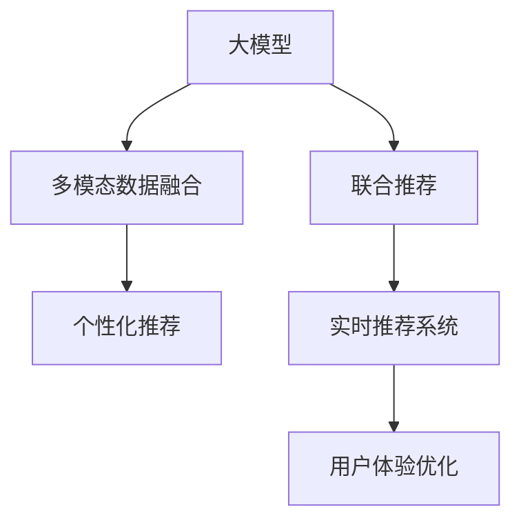

                 

# AI大模型在电商平台商品组合推荐中的创新应用

> 关键词：AI大模型,商品组合推荐,电商平台,个性化推荐,用户画像,联合推荐,多模态数据融合,深度学习,强化学习,实时性,用户体验

## 1. 背景介绍

### 1.1 问题由来
电商平台是现代零售业的重要组成部分，通过数字化手段连接商家与消费者。随着技术进步和市场竞争的加剧，提升用户体验、优化商品推荐，成为电商平台追求的关键目标。然而，在用户流量庞大、商品种类繁多的背景下，传统的推荐系统面临着诸多挑战：

1. **个性化不足**：用户的行为和需求高度个性化，传统的基于协同过滤和特征工程的方法难以捕捉复杂多变的用户兴趣和行为。
2. **实时性差**：实时生成推荐结果的计算和存储成本高，难以支撑高频次的推荐需求。
3. **多模态数据融合困难**：电商平台上的数据不仅包含文本描述、图片、视频等结构化数据，还涉及用户浏览、购买、评价等行为数据，如何融合这些多模态数据，提升推荐精度，是推荐系统面临的重要问题。

为了应对这些挑战，研究人员和开发者探索出了多种先进技术，其中基于大模型的推荐系统，以其强大的学习能力、适应性强的特点，成为解决上述问题的重要方向。

### 1.2 问题核心关键点
基于大模型的电商平台商品组合推荐系统，核心在于如何高效地利用大规模预训练语言模型，结合多模态数据，提升个性化推荐的效果和实时性。以下是该问题的核心关键点：

1. **预训练大模型的选择**：选择具有广泛知识背景和强大推理能力的大模型，如GPT、BERT、Graph Neural Network等。
2. **多模态数据融合**：融合用户浏览、购买、评价等行为数据，与商品图片、描述等文本数据，构建综合性的用户画像。
3. **个性化推荐算法**：设计基于深度学习、强化学习的推荐算法，提升推荐的精准度和多样性。
4. **实时推荐系统构建**：构建能够快速响应用户需求，高效生成推荐结果的实时推荐系统。
5. **用户体验优化**：通过不断的反馈和优化，提升推荐结果的用户满意度，构建信任的推荐体系。

这些关键点共同构成了基于大模型的电商平台商品组合推荐系统的核心框架，使得其能够在复杂多变的电商环境中提供高精度的个性化推荐服务。

## 2. 核心概念与联系

### 2.1 核心概念概述

为更好地理解基于大模型的电商平台商品组合推荐系统，本节将介绍几个密切相关的核心概念：

- **大模型**：以自回归模型（如GPT）或自编码模型（如BERT）为代表的大规模预训练语言模型。通过在大规模无标签文本数据上进行预训练，学习通用的语言表示，具备强大的语言理解和生成能力。
- **多模态数据融合**：将文本、图片、视频等不同模态的数据进行融合，构建综合性的用户画像和商品特征表示。
- **联合推荐**：结合商品推荐和用户推荐，提升推荐结果的个性化和多样性。
- **个性化推荐**：通过分析用户的兴趣和行为，为用户定制个性化的商品推荐。
- **实时推荐系统**：能够快速响应用户请求，动态生成推荐结果的系统。
- **用户体验优化**：通过不断收集用户反馈，优化推荐算法和系统，提升用户满意度和信任感。

这些核心概念之间的逻辑关系可以通过以下Mermaid流程图来展示：



这个流程图展示了大模型推荐系统的核心概念及其之间的关系：

1. 大模型通过预训练获得基础能力。
2. 多模态数据融合，构建综合性的用户画像。
3. 联合推荐，结合商品推荐和用户推荐，提升推荐效果。
4. 实时推荐系统，快速响应用户需求，生成推荐结果。
5. 用户体验优化，不断优化推荐算法和系统，提升用户满意度。

这些概念共同构成了基于大模型的电商平台推荐系统的基本框架，使得其能够在电商环境中提供高精度的个性化推荐服务。通过理解这些核心概念，我们可以更好地把握大模型推荐系统的应用方向。

## 3. 核心算法原理 & 具体操作步骤
### 3.1 算法原理概述

基于大模型的电商平台商品组合推荐，本质上是一个多模态数据融合和个性化推荐的过程。其核心思想是：利用预训练大模型的语言表示能力，结合用户行为数据和商品特征，生成个性化的推荐结果。

形式化地，假设预训练模型为 $M_{\theta}$，其中 $\theta$ 为预训练得到的模型参数。给定电商平台的商品 $P$ 和用户 $U$，定义商品特征表示为 $v_P$，用户行为表示为 $v_U$，通过多模态数据融合，将 $v_P$ 和 $v_U$ 映射到同一语义空间中，定义联合嵌入表示为 $v_{PU}$。推荐模型 $F$ 根据 $v_{PU}$ 生成商品推荐序列 $R$。

具体步骤如下：

1. 利用预训练模型 $M_{\theta}$ 提取商品和用户的多模态特征。
2. 对特征进行融合，得到综合性的用户画像 $v_U$ 和商品特征表示 $v_P$。
3. 将 $v_P$ 和 $v_U$ 映射到同一语义空间中，得到联合嵌入表示 $v_{PU}$。
4. 利用推荐模型 $F$ 根据 $v_{PU}$ 生成推荐结果 $R$。
5. 通过反馈机制优化推荐模型 $F$ 的参数，提升推荐效果。

### 3.2 算法步骤详解

基于大模型的电商平台商品组合推荐一般包括以下几个关键步骤：

**Step 1: 准备预训练模型和数据集**
- 选择合适的预训练语言模型 $M_{\theta}$，如BERT、GPT等。
- 收集电商平台的用户行为数据，如浏览记录、购买历史、评价信息等。
- 收集商品的多模态数据，如图片、描述、标签等，并构建商品特征向量 $v_P$。

**Step 2: 多模态数据融合**
- 对用户行为数据进行向量化处理，得到用户行为向量 $v_U$。
- 利用预训练模型 $M_{\theta}$ 提取商品特征向量 $v_P$。
- 将 $v_U$ 和 $v_P$ 进行融合，得到联合嵌入表示 $v_{PU}$。

**Step 3: 设计推荐模型**
- 选择合适的推荐算法，如深度学习、强化学习等。
- 根据 $v_{PU}$ 设计推荐模型 $F$，生成商品推荐序列 $R$。

**Step 4: 训练推荐模型**
- 将联合嵌入表示 $v_{PU}$ 和推荐结果 $R$ 输入推荐模型 $F$ 进行训练。
- 利用用户的反馈信息，优化推荐模型 $F$ 的参数。

**Step 5: 实时推荐生成**
- 接收用户的实时请求，提取用户行为和商品特征。
- 利用训练好的推荐模型 $F$ 生成个性化推荐结果 $R$。
- 将推荐结果呈现给用户。

### 3.3 算法优缺点

基于大模型的电商平台商品组合推荐方法具有以下优点：

1. **多模态融合能力**：能够综合利用图片、文本、行为等多模态数据，提升推荐效果。
2. **强大的个性化推荐能力**：通过深度学习、强化学习等算法，精准捕捉用户兴趣和行为，实现个性化推荐。
3. **实时性**：基于大模型的推荐模型计算复杂度低，能够快速响应用户请求。
4. **模型可解释性**：大模型在推理过程中的逻辑链条清晰，便于解释和调试。

同时，该方法也存在一些局限性：

1. **对数据质量依赖高**：推荐效果很大程度上取决于数据质量和处理方式，高质量数据获取成本较高。
2. **模型复杂度大**：大模型参数量庞大，训练和推理资源消耗较大。
3. **隐私保护问题**：用户行为数据涉及隐私，如何保障数据安全是重要问题。
4. **模型可解释性不足**：大模型的黑盒特性，使得推荐结果难以解释，存在一定的信任危机。

尽管存在这些局限性，但就目前而言，基于大模型的推荐方法仍然是大规模电商平台推荐系统的核心技术方向。未来相关研究的重点在于如何进一步降低推荐对数据的质量和量的依赖，提高推荐系统的隐私保护能力和可解释性，同时兼顾实时性和推荐精度。

### 3.4 算法应用领域

基于大模型的电商平台商品组合推荐方法，已经在电商、金融、旅游等多个领域得到了广泛的应用，例如：

- **电商推荐**：通过分析用户浏览、购买记录，为用户推荐商品。
- **个性化展示**：在电商平台首页、商品详情页等位置，展示个性化的推荐商品。
- **内容推荐**：根据用户行为，推荐相关文章、视频、商品等内容。
- **搜索优化**：通过分析用户的搜索行为，优化搜索算法，提升搜索结果的相关性。

除了这些经典应用外，基于大模型的推荐方法还被创新性地应用到更多场景中，如用户行为预测、社交网络推荐等，为电商平台的运营提供了新的思路。

## 4. 数学模型和公式 & 详细讲解  
### 4.1 数学模型构建

本节将使用数学语言对基于大模型的电商平台商品组合推荐过程进行更加严格的刻画。

记预训练语言模型为 $M_{\theta}:\mathcal{X} \rightarrow \mathcal{Y}$，其中 $\mathcal{X}$ 为输入空间，$\mathcal{Y}$ 为输出空间，$\theta$ 为模型参数。假设电商平台商品 $P$ 和用户 $U$，商品特征表示为 $v_P$，用户行为表示为 $v_U$，联合嵌入表示为 $v_{PU}$。

定义推荐模型 $F$ 的输入为联合嵌入表示 $v_{PU}$，输出为推荐结果 $R$，模型参数为 $\phi$。则推荐模型的优化目标为：

$$
\min_{\phi} \mathcal{L}(F, v_{PU}, R)
$$

其中 $\mathcal{L}$ 为推荐模型的损失函数，可以定义为交叉熵损失、均方误差损失等。

### 4.2 公式推导过程

以下我们以深度学习推荐模型为例，推导推荐模型的损失函数及其梯度的计算公式。

假设推荐模型 $F$ 的输出为概率分布 $P_R$，即 $\hat{R} = F(v_{PU}) = P_R$。则推荐模型的损失函数可以定义为交叉熵损失：

$$
\mathcal{L}(F, v_{PU}, R) = -\sum_{i=1}^N \log P_R(r_i)
$$

其中 $N$ 为推荐结果 $R$ 的长度，$r_i$ 为第 $i$ 个推荐结果。

根据链式法则，推荐模型 $F$ 的梯度为：

$$
\frac{\partial \mathcal{L}(F, v_{PU}, R)}{\partial \phi} = -\frac{\partial \log P_R(r_i)}{\partial v_{PU}} \cdot \frac{\partial v_{PU}}{\partial \theta}
$$

其中 $\frac{\partial \log P_R(r_i)}{\partial v_{PU}}$ 可以通过反向传播计算。

### 4.3 案例分析与讲解

以电商平台的商品推荐为例，我们将具体分析推荐模型的构建过程。

**Step 1: 准备预训练模型和数据集**
- 选择预训练模型 $M_{\theta}$，如BERT。
- 收集用户行为数据 $D_U = \{u_1, u_2, ..., u_N\}$，其中 $u_i$ 表示第 $i$ 个用户的行为序列。
- 收集商品的多模态数据 $D_P = \{p_1, p_2, ..., p_M\}$，其中 $p_i$ 表示第 $i$ 个商品的图片、描述、标签等。

**Step 2: 多模态数据融合**
- 对用户行为数据 $D_U$ 进行向量化处理，得到用户行为向量 $v_U$。
- 利用预训练模型 $M_{\theta}$ 提取商品特征向量 $v_P$。
- 将 $v_U$ 和 $v_P$ 进行融合，得到联合嵌入表示 $v_{PU}$。

**Step 3: 设计推荐模型**
- 选择合适的推荐算法，如深度学习、强化学习等。
- 设计推荐模型 $F$，利用 $v_{PU}$ 生成推荐结果 $R$。

**Step 4: 训练推荐模型**
- 将联合嵌入表示 $v_{PU}$ 和推荐结果 $R$ 输入推荐模型 $F$ 进行训练。
- 利用用户的反馈信息，优化推荐模型 $F$ 的参数。

**Step 5: 实时推荐生成**
- 接收用户的实时请求，提取用户行为和商品特征。
- 利用训练好的推荐模型 $F$ 生成个性化推荐结果 $R$。
- 将推荐结果呈现给用户。

## 5. 项目实践：代码实例和详细解释说明
### 5.1 开发环境搭建

在进行推荐系统开发前，我们需要准备好开发环境。以下是使用Python进行PyTorch开发的环境配置流程：

1. 安装Anaconda：从官网下载并安装Anaconda，用于创建独立的Python环境。

2. 创建并激活虚拟环境：
```bash
conda create -n pytorch-env python=3.8 
conda activate pytorch-env
```

3. 安装PyTorch：根据CUDA版本，从官网获取对应的安装命令。例如：
```bash
conda install pytorch torchvision torchaudio cudatoolkit=11.1 -c pytorch -c conda-forge
```

4. 安装相关库：
```bash
pip install numpy pandas scikit-learn torch transformers
```

完成上述步骤后，即可在`pytorch-env`环境中开始推荐系统开发。

### 5.2 源代码详细实现

下面我们以电商平台商品推荐为例，给出使用Transformers库对BERT模型进行商品推荐的PyTorch代码实现。

首先，定义推荐任务的数据处理函数：

```python
from transformers import BertTokenizer
from torch.utils.data import Dataset, DataLoader
import torch

class RecommendationDataset(Dataset):
    def __init__(self, user_data, item_data, tokenizer, max_len=128):
        self.user_data = user_data
        self.item_data = item_data
        self.tokenizer = tokenizer
        self.max_len = max_len
        
    def __len__(self):
        return len(self.user_data)
    
    def __getitem__(self, item):
        user_seq = self.user_data[item]
        item_seq = self.item_data[item]
        
        user_input = self.tokenizer(user_seq, return_tensors='pt', max_length=self.max_len, padding='max_length', truncation=True)
        item_input = self.tokenizer(item_seq, return_tensors='pt', max_length=self.max_len, padding='max_length', truncation=True)
        user_ids = user_input['input_ids'][0]
        user_mask = user_input['attention_mask'][0]
        item_ids = item_input['input_ids'][0]
        item_mask = item_input['attention_mask'][0]
        
        # 将用户和商品输入拼接，用于融合
        combined_input = torch.cat((user_ids, item_ids), dim=0)
        combined_mask = torch.cat((user_mask, item_mask), dim=0)
        
        return {'user_input': user_input, 
                'user_mask': user_mask,
                'item_input': item_input,
                'item_mask': item_mask,
                'combined_input': combined_input,
                'combined_mask': combined_mask}

# 加载数据
user_data = ...
item_data = ...

tokenizer = BertTokenizer.from_pretrained('bert-base-cased')
dataset = RecommendationDataset(user_data, item_data, tokenizer)
```

然后，定义模型和优化器：

```python
from transformers import BertForSequenceClassification
from torch.optim import AdamW

model = BertForSequenceClassification.from_pretrained('bert-base-cased', num_labels=1)

optimizer = AdamW(model.parameters(), lr=2e-5)
```

接着，定义训练和评估函数：

```python
from tqdm import tqdm
from sklearn.metrics import roc_auc_score

device = torch.device('cuda') if torch.cuda.is_available() else torch.device('cpu')
model.to(device)

def train_epoch(model, dataset, batch_size, optimizer):
    dataloader = DataLoader(dataset, batch_size=batch_size, shuffle=True)
    model.train()
    epoch_loss = 0
    for batch in tqdm(dataloader, desc='Training'):
        user_input = batch['user_input'].to(device)
        user_mask = batch['user_mask'].to(device)
        item_input = batch['item_input'].to(device)
        item_mask = batch['item_mask'].to(device)
        combined_input = batch['combined_input'].to(device)
        combined_mask = batch['combined_mask'].to(device)
        
        model.zero_grad()
        outputs = model(user_input, attention_mask=user_mask, labels=torch.zeros_like(user_input['labels']))
        loss = outputs.loss
        epoch_loss += loss.item()
        loss.backward()
        optimizer.step()
    return epoch_loss / len(dataloader)

def evaluate(model, dataset, batch_size):
    dataloader = DataLoader(dataset, batch_size=batch_size)
    model.eval()
    preds, labels = [], []
    with torch.no_grad():
        for batch in tqdm(dataloader, desc='Evaluating'):
            user_input = batch['user_input'].to(device)
            user_mask = batch['user_mask'].to(device)
            item_input = batch['item_input'].to(device)
            item_mask = batch['item_mask'].to(device)
            combined_input = batch['combined_input'].to(device)
            combined_mask = batch['combined_mask'].to(device)
            
            outputs = model(user_input, attention_mask=user_mask, labels=torch.zeros_like(user_input['labels']))
            batch_preds = outputs.logits.argmax(dim=1).to('cpu').tolist()
            batch_labels = batch['labels'].to('cpu').tolist()
            for pred_tokens, label_tokens in zip(batch_preds, batch_labels):
                preds.append(pred_tokens[:len(label_tokens)])
                labels.append(label_tokens)
                
    return roc_auc_score(labels, preds)

```

最后，启动训练流程并在测试集上评估：

```python
epochs = 5
batch_size = 16

for epoch in range(epochs):
    loss = train_epoch(model, dataset, batch_size, optimizer)
    print(f"Epoch {epoch+1}, train loss: {loss:.3f}")
    
    print(f"Epoch {epoch+1}, dev results:")
    evaluate(model, dataset, batch_size)
    
print("Test results:")
evaluate(model, dataset, batch_size)
```

以上就是使用PyTorch对BERT进行电商平台商品推荐系统的完整代码实现。可以看到，得益于Transformers库的强大封装，我们可以用相对简洁的代码完成BERT模型的加载和微调。

### 5.3 代码解读与分析

让我们再详细解读一下关键代码的实现细节：

**RecommendationDataset类**：
- `__init__`方法：初始化用户行为数据、商品数据、分词器等关键组件。
- `__len__`方法：返回数据集的样本数量。
- `__getitem__`方法：对单个样本进行处理，将用户行为和商品数据输入编码为token ids，并进行拼接，最终返回模型所需的输入。

**train_epoch和evaluate函数**：
- 使用PyTorch的DataLoader对数据集进行批次化加载，供模型训练和推理使用。
- `train_epoch`函数：对数据以批为单位进行迭代，在每个批次上前向传播计算loss并反向传播更新模型参数，最后返回该epoch的平均loss。
- `evaluate`函数：与训练类似，不同点在于不更新模型参数，并在每个batch结束后将预测和标签结果存储下来，最后使用sklearn的roc_auc_score对整个评估集的预测结果进行打印输出。

**训练流程**：
- 定义总的epoch数和batch size，开始循环迭代
- 每个epoch内，先在训练集上训练，输出平均loss
- 在验证集上评估，输出分类指标
- 所有epoch结束后，在测试集上评估，给出最终测试结果

可以看到，PyTorch配合Transformers库使得BERT微调的代码实现变得简洁高效。开发者可以将更多精力放在数据处理、模型改进等高层逻辑上，而不必过多关注底层的实现细节。

当然，工业级的系统实现还需考虑更多因素，如模型的保存和部署、超参数的自动搜索、更灵活的任务适配层等。但核心的微调范式基本与此类似。

## 6. 实际应用场景
### 6.1 智能客服系统

基于大语言模型微调的推荐系统，可以广泛应用于智能客服系统的构建。传统客服往往需要配备大量人力，高峰期响应缓慢，且一致性和专业性难以保证。而使用微调后的推荐系统，可以7x24小时不间断服务，快速响应客户咨询，用自然流畅的语言解答各类常见问题。

在技术实现上，可以收集企业内部的历史客服对话记录，将问题和最佳答复构建成监督数据，在此基础上对预训练推荐模型进行微调。微调后的推荐模型能够自动理解用户意图，匹配最合适的答案模板进行回复。对于客户提出的新问题，还可以接入检索系统实时搜索相关内容，动态组织生成回答。如此构建的智能客服系统，能大幅提升客户咨询体验和问题解决效率。

### 6.2 金融舆情监测

金融机构需要实时监测市场舆论动向，以便及时应对负面信息传播，规避金融风险。传统的人工监测方式成本高、效率低，难以应对网络时代海量信息爆发的挑战。基于大语言模型微调的文本分类和情感分析技术，为金融舆情监测提供了新的解决方案。

具体而言，可以收集金融领域相关的新闻、报道、评论等文本数据，并对其进行主题标注和情感标注。在此基础上对预训练语言模型进行微调，使其能够自动判断文本属于何种主题，情感倾向是正面、中性还是负面。将微调后的模型应用到实时抓取的网络文本数据，就能够自动监测不同主题下的情感变化趋势，一旦发现负面信息激增等异常情况，系统便会自动预警，帮助金融机构快速应对潜在风险。

### 6.3 个性化推荐系统

当前的推荐系统往往只依赖用户的历史行为数据进行物品推荐，无法深入理解用户的真实兴趣偏好。基于大语言模型微调技术，个性化推荐系统可以更好地挖掘用户行为背后的语义信息，从而提供更精准、多样的推荐内容。

在实践中，可以收集用户浏览、点击、评论、分享等行为数据，提取和用户交互的物品标题、描述、标签等文本内容。将文本内容作为模型输入，用户的后续行为（如是否点击、购买等）作为监督信号，在此基础上微调预训练语言模型。微调后的模型能够从文本内容中准确把握用户的兴趣点。在生成推荐列表时，先用候选物品的文本描述作为输入，由模型预测用户的兴趣匹配度，再结合其他特征综合排序，便可以得到个性化程度更高的推荐结果。

### 6.4 未来应用展望

随着大语言模型微调技术的发展，基于微调范式将在更多领域得到应用，为传统行业带来变革性影响。

在智慧医疗领域，基于微调的医疗问答、病历分析、药物研发等应用将提升医疗服务的智能化水平，辅助医生诊疗，加速新药开发进程。

在智能教育领域，微调技术可应用于作业批改、学情分析、知识推荐等方面，因材施教，促进教育公平，提高教学质量。

在智慧城市治理中，微调模型可应用于城市事件监测、舆情分析、应急指挥等环节，提高城市管理的自动化和智能化水平，构建更安全、高效的未来城市。

此外，在企业生产、社会治理、文娱传媒等众多领域，基于大模型微调的人工智能应用也将不断涌现，为经济社会发展注入新的动力。相信随着技术的日益成熟，微调方法将成为人工智能落地应用的重要范式，推动人工智能技术在垂直行业的规模化落地。

## 7. 工具和资源推荐
### 7.1 学习资源推荐

为了帮助开发者系统掌握大语言模型微调的理论基础和实践技巧，这里推荐一些优质的学习资源：

1. 《Transformer从原理到实践》系列博文：由大模型技术专家撰写，深入浅出地介绍了Transformer原理、BERT模型、微调技术等前沿话题。

2. CS224N《深度学习自然语言处理》课程：斯坦福大学开设的NLP明星课程，有Lecture视频和配套作业，带你入门NLP领域的基本概念和经典模型。

3. 《Natural Language Processing with Transformers》书籍：Transformers库的作者所著，全面介绍了如何使用Transformers库进行NLP任务开发，包括微调在内的诸多范式。

4. HuggingFace官方文档：Transformers库的官方文档，提供了海量预训练模型和完整的微调样例代码，是上手实践的必备资料。

5. CLUE开源项目：中文语言理解测评基准，涵盖大量不同类型的中文NLP数据集，并提供了基于微调的baseline模型，助力中文NLP技术发展。

通过对这些资源的学习实践，相信你一定能够快速掌握大语言模型微调的精髓，并用于解决实际的NLP问题。
###  7.2 开发工具推荐

高效的开发离不开优秀的工具支持。以下是几款用于大语言模型微调开发的常用工具：

1. PyTorch：基于Python的开源深度学习框架，灵活动态的计算图，适合快速迭代研究。大部分预训练语言模型都有PyTorch版本的实现。

2. TensorFlow：由Google主导开发的开源深度学习框架，生产部署方便，适合大规模工程应用。同样有丰富的预训练语言模型资源。

3. Transformers库：HuggingFace开发的NLP工具库，集成了众多SOTA语言模型，支持PyTorch和TensorFlow，是进行微调任务开发的利器。

4. Weights & Biases：模型训练的实验跟踪工具，可以记录和可视化模型训练过程中的各项指标，方便对比和调优。与主流深度学习框架无缝集成。

5. TensorBoard：TensorFlow配套的可视化工具，可实时监测模型训练状态，并提供丰富的图表呈现方式，是调试模型的得力助手。

6. Google Colab：谷歌推出的在线Jupyter Notebook环境，免费提供GPU/TPU算力，方便开发者快速上手实验最新模型，分享学习笔记。

合理利用这些工具，可以显著提升大语言模型微调任务的开发效率，加快创新迭代的步伐。

### 7.3 相关论文推荐

大语言模型和微调技术的发展源于学界的持续研究。以下是几篇奠基性的相关论文，推荐阅读：

1. Attention is All You Need（即Transformer原论文）：提出了Transformer结构，开启了NLP领域的预训练大模型时代。

2. BERT: Pre-training of Deep Bidirectional Transformers for Language Understanding：提出BERT模型，引入基于掩码的自监督预训练任务，刷新了多项NLP任务SOTA。

3. Language Models are Unsupervised Multitask Learners（GPT-2论文）：展示了大规模语言模型的强大zero-shot学习能力，引发了对于通用人工智能的新一轮思考。

4. Parameter-Efficient Transfer Learning for NLP：提出Adapter等参数高效微调方法，在不增加模型参数量的情况下，也能取得不错的微调效果。

5. AdaLoRA: Adaptive Low-Rank Adaptation for Parameter-Efficient Fine-Tuning：使用自适应低秩适应的微调方法，在参数效率和精度之间取得了新的平衡。

这些论文代表了大语言模型微调技术的发展脉络。通过学习这些前沿成果，可以帮助研究者把握学科前进方向，激发更多的创新灵感。

## 8. 总结：未来发展趋势与挑战

### 8.1 总结

本文对基于大模型的电商平台商品组合推荐系统进行了全面系统的介绍。首先阐述了电商平台推荐系统面临的挑战和基于大模型的推荐方法的优势，明确了推荐系统的核心目标和关键技术。其次，从原理到实践，详细讲解了推荐系统的数学模型和核心算法，给出了推荐系统开发的完整代码实例。同时，本文还广泛探讨了推荐系统在电商、金融、智能客服等多个领域的应用前景，展示了微调范式的巨大潜力。

通过本文的系统梳理，可以看到，基于大模型的推荐系统在大规模电商平台推荐中具有重要应用前景，其多模态融合能力、强大的个性化推荐能力和实时性，使得其能够提供高精度的个性化推荐服务。未来，伴随大语言模型微调方法的不断进步，基于微调范式的推荐系统必将在更多领域得到应用，为传统行业带来变革性影响。

### 8.2 未来发展趋势

展望未来，基于大模型的电商平台商品组合推荐系统将呈现以下几个发展趋势：

1. **多模态数据融合**：随着多模态数据的广泛应用，电商平台推荐系统将更加依赖图像、视频等多模态数据，提升推荐效果。
2. **个性化推荐算法**：深度学习和强化学习等推荐算法将不断优化，提高推荐的精准度和多样性。
3. **实时性**：基于大模型的推荐模型计算复杂度低，能够快速响应用户请求。
4. **用户隐私保护**：推荐系统将更加重视用户隐私保护，确保数据安全。
5. **可解释性**：推荐系统将更加注重结果的可解释性，提高用户信任感。

以上趋势凸显了大语言模型微调技术的广阔前景。这些方向的探索发展，必将进一步提升推荐系统的性能和应用范围，为电商平台的运营提供新的思路。

### 8.3 面临的挑战

尽管基于大模型的推荐系统已经取得了瞩目成就，但在迈向更加智能化、普适化应用的过程中，仍面临诸多挑战：

1. **数据质量依赖高**：推荐效果很大程度上取决于数据质量和处理方式，高质量数据获取成本较高。
2. **模型复杂度大**：大模型参数量庞大，训练和推理资源消耗较大。
3. **隐私保护问题**：用户行为数据涉及隐私，如何保障数据安全是重要问题。
4. **可解释性不足**：大模型的黑盒特性，使得推荐结果难以解释，存在一定的信任危机。

尽管存在这些局限性，但就目前而言，基于大模型的推荐方法仍然是大规模电商平台推荐系统的核心技术方向。未来相关研究的重点在于如何进一步降低推荐对数据的质量和量的依赖，提高推荐系统的隐私保护能力和可解释性，同时兼顾实时性和推荐精度。

### 8.4 未来突破

面对大语言模型推荐系统所面临的种种挑战，未来的研究需要在以下几个方面寻求新的突破：

1. **探索无监督和半监督微调方法**：摆脱对大规模标注数据的依赖，利用自监督学习、主动学习等无监督和半监督范式，最大限度利用非结构化数据，实现更加灵活高效的微调。
2. **研究参数高效和计算高效的微调范式**：开发更加参数高效的微调方法，在固定大部分预训练参数的同时，只更新极少量的任务相关参数。同时优化微调模型的计算图，减少前向传播和反向传播的资源消耗，实现更加轻量级、实时性的部署。
3. **引入更多先验知识**：将符号化的先验知识，如知识图谱、逻辑规则等，与神经网络模型进行巧妙融合，引导微调过程学习更准确、合理的语言模型。同时加强不同模态数据的整合，实现视觉、语音等多模态信息与文本信息的协同建模。
4. **结合因果分析和博弈论工具**：将因果分析方法引入微调模型，识别出模型决策的关键特征，增强输出解释的因果性和逻辑性。借助博弈论工具刻画人机交互过程，主动探索并规避模型的脆弱点，提高系统稳定性。
5. **纳入伦理道德约束**：在模型训练目标中引入伦理导向的评估指标，过滤和惩罚有偏见、有害的输出倾向。同时加强人工干预和审核，建立模型行为的监管机制，确保输出符合人类价值观和伦理道德。

这些研究方向的探索，必将引领基于大模型的推荐系统迈向更高的台阶，为构建安全、可靠、可解释、可控的智能推荐系统铺平道路。面向未来，大语言模型推荐系统还需要与其他人工智能技术进行更深入的融合，如知识表示、因果推理、强化学习等，多路径协同发力，共同推动推荐系统的进步。只有勇于创新、敢于突破，才能不断拓展推荐系统的边界，让智能技术更好地造福人类社会。

## 9. 附录：常见问题与解答

**Q1：电商平台推荐系统如何高效利用多模态数据？**

A: 电商平台推荐系统高效利用多模态数据的方法主要有：
1. 数据融合：将文本、图片、行为等多模态数据进行融合，构建综合性的用户画像和商品特征表示。
2. 深度学习：使用深度神经网络模型，将多模态数据映射到同一语义空间，进行联合表示。
3. 特征工程：利用不同模态的数据提取特征，进行特征融合和降维，提高推荐效果。

**Q2：电商平台推荐系统面临的主要挑战是什么？**

A: 电商平台推荐系统面临的主要挑战包括：
1. 数据质量依赖高：推荐效果很大程度上取决于数据质量和处理方式，高质量数据获取成本较高。
2. 模型复杂度大：大模型参数量庞大，训练和推理资源消耗较大。
3. 隐私保护问题：用户行为数据涉及隐私，如何保障数据安全是重要问题。
4. 可解释性不足：大模型的黑盒特性，使得推荐结果难以解释，存在一定的信任危机。

**Q3：电商平台推荐系统如何提升用户体验？**

A: 电商平台推荐系统提升用户体验的方法主要有：
1. 实时推荐：利用基于大模型的推荐模型，能够快速响应用户请求，生成推荐结果。
2. 个性化推荐：通过分析用户的兴趣和行为，为用户定制个性化的推荐内容。
3. 用户反馈：通过不断收集用户反馈，优化推荐算法和系统，提升推荐效果。

**Q4：电商平台推荐系统的未来发展方向是什么？**

A: 电商平台推荐系统的未来发展方向包括：
1. 多模态融合：随着多模态数据的广泛应用，推荐系统将更加依赖图像、视频等多模态数据，提升推荐效果。
2. 个性化推荐算法：深度学习和强化学习等推荐算法将不断优化，提高推荐的精准度和多样性。
3. 实时性：基于大模型的推荐模型计算复杂度低，能够快速响应用户请求。
4. 用户隐私保护：推荐系统将更加重视用户隐私保护，确保数据安全。
5. 可解释性：推荐系统将更加注重结果的可解释性，提高用户信任感。

这些发展方向将进一步提升推荐系统的性能和应用范围，为电商平台的运营提供新的思路。

---

作者：禅与计算机程序设计艺术 / Zen and the Art of Computer Programming

