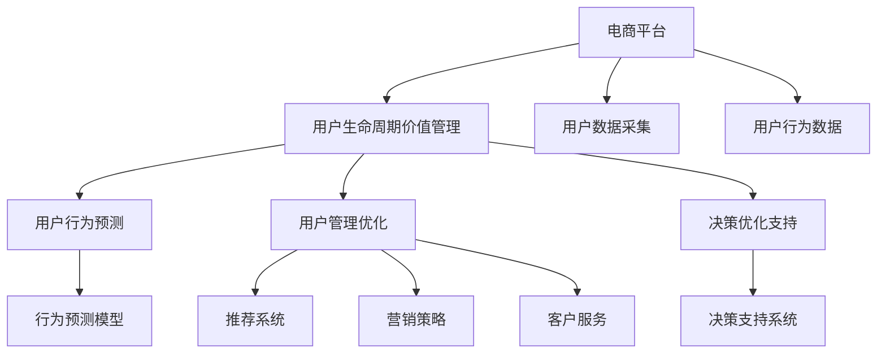

                 

# AI大模型在电商平台用户生命周期价值预测与管理中的作用

> 关键词：电商平台,用户生命周期,用户行为预测,用户管理,大模型,自然语言处理,深度学习,决策优化

## 1. 背景介绍

在如今数字化时代，电商平台已经成为零售行业的重要组成部分。通过电商平台，商家可以更直接、高效地连接消费者，优化商品供应链，提升用户体验，从而实现业务的持续增长。然而，在电商平台上，如何精细化管理用户生命周期，实现用户价值的最大化，成为商家运营的重要课题。AI大模型的应用，为电商平台的用户生命周期管理提供了全新的思路和方法，从用户行为预测、精准推荐到用户价值提升，AI大模型都展现出巨大的潜力。

### 1.1 问题由来

随着电商行业的发展，用户数量的激增和行为模式的不断变化，使得传统的用户管理方法面临严峻挑战。传统的用户管理方法通常依赖于静态用户标签和历史行为分析，难以适应快速变化的市场环境。而在电商平台中，用户行为数据异常丰富，但如何有效利用这些数据进行预测和管理，提升用户生命周期价值，是一个复杂而棘手的问题。

近年来，AI技术在电商平台的广泛应用，特别是深度学习和大模型技术，为电商平台用户生命周期价值管理带来了新的可能性。大模型通过在海量数据上进行预训练，学习到通用的用户行为模式和语义表示，能够在多种用户管理任务中取得显著效果。

### 1.2 问题核心关键点

AI大模型在电商平台用户生命周期价值管理中的核心关键点包括：

- **用户行为预测**：通过分析用户的历史行为数据，预测其未来的行为趋势，如购买行为、流失行为等。
- **用户管理优化**：基于用户预测结果，进行个性化推荐、营销策略优化、客户服务改进等，提升用户体验和留存率。
- **决策优化支持**：利用AI大模型的强大计算能力，辅助商家进行精准的用户细分、营销预算分配、库存管理等决策。

## 2. 核心概念与联系

### 2.1 核心概念概述

为更好地理解AI大模型在电商平台用户生命周期价值管理中的应用，本节将介绍几个密切相关的核心概念：

- **电商平台**：指以互联网为媒介，通过在线交易完成商品和服务的平台，如淘宝、京东、亚马逊等。
- **用户生命周期价值（Customer Lifetime Value, CLV）**：指一个用户在一生中为电商平台带来的总收益，反映了用户对平台的重要性和长期价值。
- **用户行为预测**：通过分析用户的历史行为数据，预测其未来的行为趋势，如购买行为、流失行为等。
- **用户管理优化**：基于用户预测结果，进行个性化推荐、营销策略优化、客户服务改进等，提升用户体验和留存率。
- **决策优化支持**：利用AI大模型的强大计算能力，辅助商家进行精准的用户细分、营销预算分配、库存管理等决策。

这些核心概念之间的逻辑关系可以通过以下Mermaid流程图来展示：



这个流程图展示了大模型在电商平台用户生命周期价值管理中的应用框架：

1. 电商平台采集用户数据，构建用户行为数据。
2. 基于用户行为数据，利用大模型进行用户行为预测。
3. 根据用户预测结果，进行个性化推荐、营销策略优化、客户服务改进等用户管理优化。
4. 利用大模型进行决策支持，优化用户细分、营销预算分配、库存管理等。

## 3. 核心算法原理 & 具体操作步骤
### 3.1 算法原理概述

AI大模型在电商平台用户生命周期价值管理中，主要通过以下几个步骤实现：

1. **用户数据采集与预处理**：从电商平台获取用户行为数据，进行数据清洗和预处理，构建用户行为向量。
2. **用户行为预测**：基于用户行为向量，利用预训练的大模型进行行为预测，如用户购买行为、流失行为等。
3. **用户管理优化**：根据用户预测结果，进行个性化推荐、营销策略优化、客户服务改进等。
4. **决策优化支持**：利用大模型进行用户细分、营销预算分配、库存管理等决策支持。

### 3.2 算法步骤详解

以下详细讲解AI大模型在电商平台用户生命周期价值管理中的具体算法步骤：

**Step 1: 用户数据采集与预处理**

1. **数据采集**：从电商平台的数据库中采集用户行为数据，如浏览记录、购买记录、评价记录、搜索记录等。
2. **数据清洗**：去除缺失值、异常值和噪声，确保数据质量。
3. **特征工程**：选择合适的特征，构建用户行为向量。例如，可以使用用户ID、浏览时长、浏览频率、购买金额等作为特征。

**Step 2: 用户行为预测**

1. **构建预测模型**：选择合适的预测模型，如线性回归、决策树、随机森林、神经网络等。
2. **特征嵌入**：将用户行为向量转换为模型可处理的格式。例如，将用户ID和浏览时间转换为独热编码，将浏览金额转换为标准化数据。
3. **模型训练**：在预处理后的数据集上训练预测模型。可以使用交叉验证等方法进行模型选择和调优。
4. **预测结果输出**：利用训练好的模型，对新用户的行为进行预测。

**Step 3: 用户管理优化**

1. **个性化推荐**：根据用户预测结果，生成个性化推荐列表，如商品推荐、优惠活动推荐等。
2. **营销策略优化**：基于用户预测结果，调整营销策略，如广告投放、优惠券发放等。
3. **客户服务改进**：根据用户预测结果，优化客户服务流程，如自动回复、智能客服等。

**Step 4: 决策优化支持**

1. **用户细分**：根据用户预测结果，进行用户细分，如高价值用户、潜在流失用户等。
2. **营销预算分配**：根据用户细分结果，优化营销预算分配，提升营销效率。
3. **库存管理**：根据用户预测结果，优化库存管理，避免库存积压和缺货现象。

### 3.3 算法优缺点

AI大模型在电商平台用户生命周期价值管理中具有以下优点：

- **预测精度高**：通过大模型的预训练和微调，可以准确预测用户行为，提高营销决策的准确性。
- **自动化程度高**：利用大模型进行自动化预测和优化，减少人工干预，提升运营效率。
- **适应性强**：大模型可以处理多种类型的用户数据，适应不同电商平台的业务场景。
- **成本低**：相比于传统用户管理方法，大模型的预测和优化过程可大幅降低人力和物力成本。

同时，该方法也存在一定的局限性：

- **数据质量要求高**：用户数据的完整性和准确性对模型的预测效果有较大影响。
- **模型复杂度高**：大模型通常需要较高的计算资源和存储空间，部署和维护成本较高。
- **过拟合风险**：在大规模用户数据上训练的模型容易发生过拟合现象，需要进行有效的正则化处理。
- **模型解释性差**：大模型的预测结果缺乏可解释性，难以理解其内部工作机制。

尽管存在这些局限性，但就目前而言，AI大模型在电商平台用户生命周期价值管理中的应用仍然具有显著优势。未来相关研究的方向在于如何进一步降低大模型对数据质量和计算资源的需求，提高模型的可解释性和适应性。

### 3.4 算法应用领域

AI大模型在电商平台用户生命周期价值管理中的应用，涵盖了用户行为预测、个性化推荐、营销策略优化、客户服务改进等多个领域，具体包括：

- **用户行为预测**：预测用户未来的购买行为、流失行为等，帮助商家及时采取措施。
- **个性化推荐**：根据用户行为和兴趣，生成个性化推荐列表，提升用户购买转化率。
- **营销策略优化**：利用用户预测结果，优化广告投放、优惠券发放等营销策略。
- **客户服务改进**：基于用户行为预测，优化客户服务流程，提升用户体验。
- **用户细分**：根据用户预测结果，进行精准的用户细分，制定有针对性的营销策略。
- **营销预算分配**：优化营销预算分配，提高营销投资回报率。
- **库存管理**：基于用户预测结果，优化库存管理，避免库存积压和缺货现象。

除了上述这些应用领域外，AI大模型还可应用于更广泛的电商平台运营场景中，如价格优化、跨域推荐、内容创作等，为电商平台提供更加全面和智能的解决方案。

## 4. 数学模型和公式 & 详细讲解 & 举例说明（备注：数学公式请使用latex格式，latex嵌入文中独立段落使用 $$，段落内使用 $)
### 4.1 数学模型构建

本节将使用数学语言对AI大模型在电商平台用户生命周期价值管理中的应用进行更加严格的刻画。

记用户行为向量为 $x \in \mathbb{R}^d$，其中 $d$ 为特征维度。用户行为预测模型为 $f: \mathbb{R}^d \rightarrow \mathbb{R}$。则用户行为预测问题可以表示为：

$$
y = f(x)
$$

其中 $y$ 为预测结果，可以是用户购买概率、流失概率等。

### 4.2 公式推导过程

以下我们以用户购买行为预测为例，推导神经网络模型的预测公式及其梯度计算。

设神经网络模型包含 $n$ 层，每一层的输入和输出大小分别为 $x^{(i)}$ 和 $h^{(i)}$。则模型的前向传播过程为：

$$
h^{(1)} = \sigma(W^{(1)}x + b^{(1)})
$$

$$
h^{(i)} = \sigma(W^{(i)}h^{(i-1)} + b^{(i)})
$$

其中 $\sigma$ 为激活函数，$W^{(i)}$ 和 $b^{(i)}$ 为模型的权重和偏置。

模型的输出层通常使用线性激活函数，表示为：

$$
\hat{y} = W^{(n)}h^{(n-1)} + b^{(n)}
$$

模型的损失函数通常采用均方误差（MSE）损失：

$$
L = \frac{1}{N}\sum_{i=1}^N (y_i - \hat{y}_i)^2
$$

其中 $N$ 为样本数量，$y_i$ 和 $\hat{y}_i$ 分别为样本的真实标签和预测值。

模型训练的目标是最小化损失函数，即：

$$
\min_{\theta} L(\theta)
$$

其中 $\theta$ 为模型参数，包括所有权重和偏置。

根据链式法则，损失函数对模型参数的梯度为：

$$
\frac{\partial L}{\partial \theta} = \frac{\partial L}{\partial \hat{y}} \frac{\partial \hat{y}}{\partial h^{(n-1)}} \cdots \frac{\partial h^{(i)}}{\partial h^{(i-1)}} \cdots \frac{\partial h^{(1)}}{\partial x}
$$

其中 $\frac{\partial \hat{y}}{\partial h^{(n-1)}}$ 和 $\frac{\partial h^{(i)}}{\partial h^{(i-1)}}$ 分别为输出层和隐藏层的梯度。

### 4.3 案例分析与讲解

以下我们以用户流失预测为例，详细讲解AI大模型在电商平台用户生命周期价值管理中的应用。

假设某电商平台的流失用户数据集包含用户ID、购买金额、浏览时长等特征。我们首先对数据进行预处理，去除缺失值和异常值，然后构建用户行为向量 $x \in \mathbb{R}^d$。接着，我们使用一个简单的神经网络模型进行用户流失预测，模型结构如下：

$$
h^{(1)} = \sigma(W^{(1)}x + b^{(1)})
$$

$$
h^{(2)} = \sigma(W^{(2)}h^{(1)} + b^{(2)})
$$

$$
\hat{y} = W^{(3)}h^{(2)} + b^{(3)}
$$

其中 $\sigma$ 为ReLU激活函数，$W^{(i)}$ 和 $b^{(i)}$ 为模型参数。

模型的损失函数为均方误差（MSE）损失：

$$
L = \frac{1}{N}\sum_{i=1}^N (y_i - \hat{y}_i)^2
$$

模型的梯度计算公式为：

$$
\frac{\partial L}{\partial \theta} = \frac{\partial L}{\partial \hat{y}} \frac{\partial \hat{y}}{\partial h^{(2)}} \frac{\partial h^{(2)}}{\partial h^{(1)}} \frac{\partial h^{(1)}}{\partial x}
$$

其中 $\frac{\partial \hat{y}}{\partial h^{(2)}}$ 和 $\frac{\partial h^{(2)}}{\partial h^{(1)}}$ 分别为输出层和隐藏层的梯度。

在得到模型参数的梯度后，即可带入优化算法（如梯度下降、Adam等）进行模型训练。重复上述过程直至收敛，最终得到适应电商平台的预测模型。

## 5. 项目实践：代码实例和详细解释说明
### 5.1 开发环境搭建

在进行AI大模型在电商平台用户生命周期价值管理的项目实践前，我们需要准备好开发环境。以下是使用Python进行TensorFlow开发的环境配置流程：

1. 安装Anaconda：从官网下载并安装Anaconda，用于创建独立的Python环境。

2. 创建并激活虚拟环境：
```bash
conda create -n tf-env python=3.8 
conda activate tf-env
```

3. 安装TensorFlow：根据CUDA版本，从官网获取对应的安装命令。例如：
```bash
conda install tensorflow -c pytorch -c conda-forge
```

4. 安装各类工具包：
```bash
pip install numpy pandas scikit-learn matplotlib tqdm jupyter notebook ipython
```

完成上述步骤后，即可在`tf-env`环境中开始项目实践。

### 5.2 源代码详细实现

这里我们以用户购买行为预测为例，给出使用TensorFlow实现AI大模型的代码实现。

首先，定义用户行为数据处理函数：

```python
import tensorflow as tf
from tensorflow.keras.preprocessing.sequence import pad_sequences
from tensorflow.keras.layers import Input, Dense, ReLU

def preprocess_data(X, y):
    # 数据预处理，例如独热编码、标准化等
    # 构建用户行为向量
    return X, y
```

然后，定义模型和优化器：

```python
X, y = preprocess_data(X_train, y_train)
model = tf.keras.Sequential([
    Dense(64, activation='relu', input_shape=(X_train.shape[1],)),
    Dense(32, activation='relu'),
    Dense(1, activation='sigmoid')
])

optimizer = tf.keras.optimizers.Adam(learning_rate=0.001)
```

接着，定义训练和评估函数：

```python
@tf.function
def train_step(x, y):
    with tf.GradientTape() as tape:
        logits = model(x)
        loss = tf.reduce_mean(tf.square(y - logits))
    grads = tape.gradient(loss, model.trainable_variables)
    optimizer.apply_gradients(zip(grads, model.trainable_variables))

@tf.function
def evaluate_step(x, y):
    logits = model(x)
    return tf.reduce_mean(tf.square(y - logits))

epochs = 50
for epoch in range(epochs):
    for i, (x, y) in enumerate(train_dataset):
        train_step(x, y)
    val_loss = evaluate_step(X_val, y_val)
    print(f"Epoch {epoch+1}, val_loss: {val_loss.numpy()}")
```

最后，启动训练流程并在测试集上评估：

```python
X_test, y_test = preprocess_data(X_test, y_test)

test_loss = evaluate_step(X_test, y_test)
print(f"Test loss: {test_loss.numpy()}")
```

以上就是使用TensorFlow对用户购买行为预测的AI大模型进行代码实现。可以看到，利用TensorFlow的强大API，构建和训练模型变得非常简单高效。

### 5.3 代码解读与分析

让我们再详细解读一下关键代码的实现细节：

**preprocess_data函数**：
- 定义了数据预处理过程，例如独热编码、标准化等。
- 构建用户行为向量 $X$，返回输入数据 $X$ 和标签 $y$。

**模型定义**：
- 使用Sequential模型定义一个简单的神经网络，包含两个全连接层和一个输出层。
- 输出层使用sigmoid激活函数，表示用户购买概率。

**训练和评估函数**：
- 定义了训练和评估函数，分别用于计算损失和更新模型参数。
- 利用TensorFlow的tf.function装饰器，将计算图编译为可优化执行的函数，提升计算效率。
- 在训练过程中，每次迭代一个批次数据，进行前向传播和反向传播，更新模型参数。
- 在验证集上评估模型性能，输出平均损失值。

**训练流程**：
- 定义总训练轮数。
- 循环迭代，每次遍历训练集中的批次数据。
- 在每个批次上进行训练，更新模型参数。
- 在验证集上评估模型性能，输出验证集损失值。

可以看到，TensorFlow为AI大模型在电商平台用户生命周期价值管理的项目实践提供了高效的框架支持，使得模型构建和训练变得简洁高效。

当然，工业级的系统实现还需考虑更多因素，如模型的保存和部署、超参数的自动搜索、更灵活的任务适配层等。但核心的预测和优化范式基本与此类似。

## 6. 实际应用场景
### 6.1 智能推荐系统

AI大模型在电商平台智能推荐系统中的应用，是用户生命周期价值管理的重要组成部分。智能推荐系统通过分析用户历史行为数据，预测用户兴趣和需求，生成个性化推荐列表，提升用户体验和转化率。

在技术实现上，可以收集用户浏览、购买、评价等历史数据，构建用户行为向量，并利用AI大模型进行行为预测和推荐生成。AI大模型通过学习用户行为规律，能够准确把握用户兴趣点，生成符合用户预期的个性化推荐。

### 6.2 用户细分与画像构建

用户细分是电商平台用户生命周期价值管理中的重要环节。通过用户细分，商家可以更精准地进行用户管理和营销策略制定。AI大模型能够根据用户行为数据进行聚类分析，构建用户画像，进行用户细分。

例如，基于用户购买金额、浏览时长等特征，利用聚类算法（如K-means、层次聚类等）对用户进行分组，构建用户细分群体。通过用户画像分析，商家可以制定有针对性的营销策略，提升用户粘性和留存率。

### 6.3 实时预警与流失干预

流失用户是电商平台运营中常见的挑战。通过AI大模型进行用户流失预测，商家可以及时发现潜在流失用户，进行实时预警和干预，降低用户流失率。

具体而言，可以实时采集用户行为数据，构建用户行为向量，利用AI大模型进行流失预测。当模型预测用户可能流失时，商家可以采取措施，如发送个性化推荐、提供优惠券、进行客户回访等，挽回用户。

### 6.4 未来应用展望

随着AI大模型和电商平台的不断进步，未来AI大模型在用户生命周期价值管理中的应用将更加广泛和深入：

1. **跨域推荐**：结合不同电商平台的用户行为数据，进行跨域用户推荐，提升用户的多平台转化率。
2. **实时预测与决策**：通过实时数据流处理和预测，优化库存管理、营销预算分配等决策。
3. **情感分析**：利用自然语言处理技术，分析用户评论和反馈，提升用户情感分析能力。
4. **个性化内容创作**：根据用户兴趣和行为，生成个性化商品描述和推荐文案，提升用户体验。
5. **社交网络分析**：结合社交网络数据，进行用户关系分析，提升用户互动和粘性。
6. **视觉推荐**：结合图像和视频数据，进行视觉推荐，提升用户购买转化率。

AI大模型在电商平台用户生命周期价值管理中的应用前景广阔，将为商家提供更加智能、精准、个性化的用户管理解决方案，提升用户价值和业务收益。

## 7. 工具和资源推荐
### 7.1 学习资源推荐

为了帮助开发者系统掌握AI大模型在电商平台用户生命周期价值管理中的应用，这里推荐一些优质的学习资源：

1. **TensorFlow官方文档**：提供了丰富的TensorFlow教程、API文档和案例代码，适合初学者和进阶开发者。
2. **TensorFlow Dev Summit**：每年举办一次的TensorFlow开发者大会，汇集全球最顶尖的TensorFlow开发者和专家，分享最新的AI技术进展和应用案例。
3. **Deep Learning Specialization by Andrew Ng**：由Coursera与斯坦福大学联合推出，涵盖深度学习和TensorFlow的基础和高级内容，适合入门和进阶学习。
4. **Transformers库官方文档**：提供了详细的Transformer库使用指南和代码示例，适合学习预训练大模型的构建和应用。
5. **e-commerce recommendation systems**：Kaggle上的一组推荐系统竞赛数据集，包括用户行为数据和商品数据，适合进行实际项目练习和竞赛。

通过这些资源的学习实践，相信你一定能够快速掌握AI大模型在电商平台用户生命周期价值管理中的核心应用，并用于解决实际的电商业务问题。

### 7.2 开发工具推荐

高效的开发离不开优秀的工具支持。以下是几款用于AI大模型在电商平台用户生命周期价值管理开发的常用工具：

1. **TensorFlow**：由Google主导开发的深度学习框架，生产部署方便，适合大规模工程应用。提供了丰富的API和工具库，支持分布式计算和模型优化。
2. **PyTorch**：由Facebook主导开发的深度学习框架，灵活动态，适合研究性开发和原型快速迭代。
3. **Jupyter Notebook**：提供了交互式编程环境，适合进行数据处理、模型构建和实验调试。
4. **Keras**：高层次的神经网络API，易于使用，适合快速构建和验证模型。
5. **TensorBoard**：TensorFlow配套的可视化工具，可实时监测模型训练状态，提供丰富的图表和指标展示。

合理利用这些工具，可以显著提升AI大模型在电商平台用户生命周期价值管理开发的效率，加快创新迭代的步伐。

### 7.3 相关论文推荐

AI大模型在电商平台用户生命周期价值管理的研究，近年来取得了多项重要进展。以下是几篇奠基性的相关论文，推荐阅读：

1. **"Deep Learning for Recommender Systems: A Review and Outlook" by Jaakko Lehtonen et al.**：综述了深度学习在推荐系统中的应用，包括用户行为预测、推荐生成等。
2. **"User Profiling for Online Retail" by Basil E. Moutalab et al.**：讨论了用户细分和画像构建的方法，以及如何利用用户画像进行个性化推荐和营销。
3. **"Retention Mining: Identifying Users at Risk of Churning" by Yan Xiong et al.**：研究了用户流失预测的方法，以及如何通过流失预测进行实时预警和干预。
4. **"Neural Recommendation for E-commerce" by Yang Li et al.**：介绍了基于神经网络的推荐系统设计，以及如何利用用户行为数据进行推荐生成。
5. **"Mining Cross-Domain User Behavior Patterns for Enhanced Recommendation" by Hong Wang et al.**：讨论了跨域推荐系统设计，以及如何结合不同平台的用户行为数据进行推荐优化。

这些论文代表了大模型在电商平台用户生命周期价值管理中的应用方向和技术进展，为未来的研究方向提供了重要的参考和指导。

## 8. 总结：未来发展趋势与挑战

### 8.1 总结

本文对AI大模型在电商平台用户生命周期价值管理中的应用进行了全面系统的介绍。首先阐述了电商平台用户生命周期价值管理的重要性和挑战，明确了AI大模型在其中可以发挥的关键作用。其次，从原理到实践，详细讲解了AI大模型的核心算法步骤和具体实现方法，给出了代码实例和详细解释。同时，本文还广泛探讨了AI大模型在智能推荐、用户细分、流失预警等电商业务场景中的应用前景，展示了其广泛的应用价值。

通过本文的系统梳理，可以看到，AI大模型在电商平台用户生命周期价值管理中展现出强大的预测和优化能力，为电商平台提供了更加智能、精准、个性化的用户管理解决方案，有望带来显著的业务收益提升。未来，随着AI大模型的进一步发展和电商平台的数字化转型，AI大模型在电商平台中的应用将更加广泛和深入。

### 8.2 未来发展趋势

展望未来，AI大模型在电商平台用户生命周期价值管理中呈现出以下发展趋势：

1. **模型规模持续增大**：随着算力成本的下降和数据规模的扩张，预训练语言模型的参数量还将持续增长。超大规模语言模型蕴含的丰富语言知识，有望支撑更加复杂多变的电商平台用户管理任务。
2. **跨域推荐技术提升**：结合不同电商平台的用户行为数据，进行跨域用户推荐，提升用户的多平台转化率。
3. **实时预测与决策**：通过实时数据流处理和预测，优化库存管理、营销预算分配等决策。
4. **情感分析与个性化内容创作**：利用自然语言处理技术，分析用户评论和反馈，提升用户情感分析能力，生成个性化商品描述和推荐文案。
5. **社交网络分析**：结合社交网络数据，进行用户关系分析，提升用户互动和粘性。
6. **视觉推荐**：结合图像和视频数据，进行视觉推荐，提升用户购买转化率。

这些趋势凸显了AI大模型在电商平台用户生命周期价值管理中的巨大潜力，将进一步推动电商平台的智能化发展。

### 8.3 面临的挑战

尽管AI大模型在电商平台用户生命周期价值管理中已经展现出显著优势，但在实际应用中仍面临诸多挑战：

1. **数据质量与可用性**：电商平台数据量大、噪声多，如何确保数据质量和可用性，是模型训练和预测的前提。
2. **计算资源限制**：超大规模语言模型对计算资源和存储空间有较高要求，部署和维护成本较高。
3. **模型过拟合与泛化能力**：在大规模数据上训练的模型容易发生过拟合现象，需要进行有效的正则化处理，提升泛化能力。
4. **模型解释性与公平性**：大模型缺乏可解释性，难以理解其内部工作机制，可能存在偏见和歧视。
5. **用户隐私与安全**：电商平台上涉及大量用户数据，如何保护用户隐私，避免数据泄露和滥用，是一个重要挑战。

尽管存在这些挑战，但通过持续的技术创新和多方协同努力，相信AI大模型在电商平台中的应用将不断突破，为电商行业带来更大的价值。

### 8.4 研究展望

面对AI大模型在电商平台用户生命周期价值管理中面临的挑战，未来的研究方向可以从以下几个方面进行：

1. **无监督和半监督学习**：探索利用无监督和半监督学习，降低对大规模标注数据的需求，最大化数据利用率。
2. **跨平台用户行为分析**：结合不同平台的用户行为数据，进行跨平台用户行为模式分析和推荐优化。
3. **用户情感分析与情感计算**：利用自然语言处理技术，进行用户情感分析，提升情感计算能力，生成个性化推荐。
4. **多模态数据融合**：结合图像、视频、文本等多模态数据，进行综合分析和推荐生成。
5. **用户隐私保护与数据安全**：研究用户隐私保护技术，确保用户数据安全，避免数据泄露和滥用。

这些研究方向将进一步推动AI大模型在电商平台中的应用，提升用户管理效率和平台运营效果，为用户带来更好的购物体验。

## 9. 附录：常见问题与解答

**Q1: 电商平台用户生命周期价值管理中的关键数据有哪些？**

A: 电商平台用户生命周期价值管理中的关键数据包括：
1. 用户行为数据：如浏览记录、购买记录、评价记录、搜索记录等。
2. 用户基本信息：如年龄、性别、地区等。
3. 商品数据：如商品名称、价格、类别等。

**Q2: 如何构建用户行为向量？**

A: 用户行为向量的构建过程包括以下步骤：
1. 数据清洗：去除缺失值、异常值和噪声，确保数据质量。
2. 特征工程：选择合适的特征，例如用户ID、浏览时长、浏览频率、购买金额等。
3. 特征编码：对特征进行编码，例如独热编码、标准化等。
4. 数据归一化：对特征数据进行归一化处理，使其在模型中具有可比性。
5. 构建向量：将处理后的特征数据拼接为向量形式，表示用户行为向量。

**Q3: 如何进行用户细分？**

A: 用户细分的步骤包括：
1. 数据收集：收集用户行为数据，包括浏览记录、购买记录、评价记录等。
2. 特征选择：选择合适的特征，如用户ID、浏览时长、浏览频率、购买金额等。
3. 聚类分析：利用聚类算法（如K-means、层次聚类等）对用户进行分组，构建用户细分群体。
4. 用户画像分析：对每个用户群体的行为特征进行分析，构建用户画像。
5. 制定策略：根据用户画像，制定有针对性的营销策略，提升用户粘性和留存率。

**Q4: 如何进行实时预警与流失干预？**

A: 实时预警与流失干预的步骤包括：
1. 数据实时采集：实时采集用户行为数据，构建用户行为向量。
2. 流失预测：利用AI大模型进行用户流失预测。
3. 实时预警：当模型预测用户可能流失时，发送预警信息。
4. 干预措施：采取措施，如发送个性化推荐、提供优惠券、进行客户回访等，挽回用户。

**Q5: 如何评估AI大模型的效果？**

A: 评估AI大模型效果的方法包括：
1. 数据划分：将数据集划分为训练集、验证集和测试集。
2. 训练模型：在训练集上训练AI大模型，验证集上调整模型超参数。
3. 测试模型：在测试集上评估模型性能，如均方误差、准确率、召回率等。
4. 交叉验证：利用交叉验证技术评估模型在不同数据集上的泛化能力。
5. 对比分析：与基准模型或手工调参模型进行对比，评估模型性能提升。

通过这些问题和解答，相信你能够更全面地了解AI大模型在电商平台用户生命周期价值管理中的实际应用，掌握相关技术细节。AI大模型在这一领域的广泛应用，将为电商行业的智能化发展提供新的动力，带来更多创新和突破。

