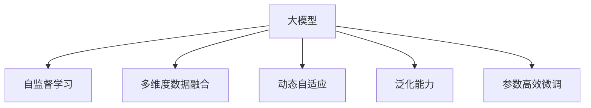

                 

## 1. 背景介绍

随着电子商务的蓬勃发展，电商平台数据量呈现出指数级增长。与此同时，用户行为异常检测也成为了电商平台数据安全与用户管理的重要环节。传统的异常检测方法依赖规则与经验，难以应对复杂的用户行为模式。而近年来，基于大模型的异常检测方法以其强大的自适应能力和泛化能力，逐步成为行业的新趋势。

### 1.1 问题由来

电商平台上的用户行为数据种类繁多，包括点击、浏览、收藏、购买、评价等行为数据，以及用户基本信息（如性别、年龄、地域等）和上下文环境数据（如时间、设备等）。这些数据呈现出非结构化和多维度特征，难以用传统统计模型处理。传统规则驱动的异常检测方法，依赖人工设置的规则，难以覆盖所有异常情况，且容易产生误判和漏判。

### 1.2 问题核心关键点

大模型在电商平台用户行为异常检测中的应用，主要基于以下核心关键点：

- **大数据训练**：大模型具备自监督学习的能力，能够在大量非标注数据上进行预训练，学习到通用的用户行为模式。
- **多维度数据融合**：大模型能够处理多维度、非结构化的用户行为数据，并结合上下文环境进行建模。
- **动态自适应**：大模型能够持续地从新数据中学习，动态更新异常检测模型，适应用户行为的变化。
- **泛化能力**：大模型具备良好的泛化能力，能够有效地检测到新的、未知的异常行为模式。
- **高效部署**：大模型可以通过参数高效微调等技术，在较小的计算资源下进行高效的推理部署。

### 1.3 问题研究意义

大模型在电商平台用户行为异常检测中的应用，对于电商平台的安全防护、用户管理、个性化推荐等多个方面具有重要意义：

1. **提升安全防护能力**：异常检测技术可以帮助电商平台识别潜在的欺诈、恶意行为等，保障用户数据安全。
2. **优化用户管理**：通过异常检测，电商平台可以识别不活跃用户、高风险用户等，进行针对性的管理，提升用户满意度和留存率。
3. **增强推荐系统**：异常检测技术可以辅助推荐系统识别不合理的用户行为，提升推荐内容的精准性和用户体验。

## 2. 核心概念与联系

### 2.1 核心概念概述

为更好地理解基于大模型的异常检测方法，本节将介绍几个密切相关的核心概念：

- **大模型**：指基于深度学习技术训练的超大规模语言模型，如BERT、GPT等。这些模型通常在大量无标签数据上进行自监督预训练，学习到丰富的语言知识和常识。
- **自监督学习**：指在无标签数据上进行训练，模型通过学习数据的内在结构进行自我监督学习，从而学习到一般性的知识表示。
- **多维度数据融合**：指将多种来源的用户行为数据进行整合，形成统一的多维度特征表示，便于模型处理。
- **动态自适应**：指模型能够持续地从新数据中学习，动态更新模型参数，适应数据分布的变化。
- **泛化能力**：指模型在训练数据之外的新数据上表现良好的能力。
- **参数高效微调**：指在微调过程中，只更新少量的模型参数，而固定大部分预训练权重不变，以提高微调效率，避免过拟合。

这些核心概念之间的逻辑关系可以通过以下Mermaid流程图来展示：



这个流程图展示了大模型的核心概念及其之间的关系：

1. 大模型通过自监督学习获得基础能力。
2. 多维度数据融合使得模型能够处理多种数据类型，形成多维特征表示。
3. 动态自适应让模型能够持续学习新数据，适应数据分布的变化。
4. 泛化能力使模型能够泛化到训练数据之外的新数据上。
5. 参数高效微调提高了微调效率，避免过拟合。

这些概念共同构成了基于大模型的异常检测方法的理论基础，使其能够有效应对复杂的用户行为数据。

## 3. 核心算法原理 & 具体操作步骤

### 3.1 算法原理概述

基于大模型的异常检测方法，本质上是一个有监督的细粒度迁移学习过程。其核心思想是：将预训练的大模型视作一个强大的"特征提取器"，通过在电商平台标注的用户行为数据上进行有监督的微调，使得模型输出能够匹配异常与非异常两类标签，从而获得针对特定任务优化的异常检测模型。

形式化地，假设预训练模型为 $M_{\theta}$，其中 $\theta$ 为预训练得到的模型参数。给定电商平台用户行为异常检测任务 $T$ 的标注数据集 $D=\{(x_i, y_i)\}_{i=1}^N$，其中 $x_i$ 为行为数据特征，$y_i \in \{0, 1\}$ 为异常标签，$0$ 表示正常，$1$ 表示异常。微调的目标是找到新的模型参数 $\hat{\theta}$，使得：

$$
\hat{\theta}=\mathop{\arg\min}_{\theta} \mathcal{L}(M_{\theta},D)
$$

其中 $\mathcal{L}$ 为针对任务 $T$ 设计的损失函数，用于衡量模型预测输出与真实标签之间的差异。常见的损失函数包括交叉熵损失、均方误差损失等。

通过梯度下降等优化算法，微调过程不断更新模型参数 $\theta$，最小化损失函数 $\mathcal{L}$，使得模型输出逼近真实标签。由于 $\theta$ 已经通过自监督预训练获得了较好的初始化，因此即便在标注数据集 $D$ 上进行微调，也能较快收敛到理想的模型参数 $\hat{\theta}$。

### 3.2 算法步骤详解

基于大模型的异常检测方法一般包括以下几个关键步骤：

**Step 1: 准备预训练模型和数据集**
- 选择合适的预训练语言模型 $M_{\theta}$ 作为初始化参数，如 BERT、GPT 等。
- 准备电商平台用户行为数据集 $D$，划分为训练集、验证集和测试集。一般要求标注数据与预训练数据的分布不要差异过大。

**Step 2: 添加任务适配层**
- 根据任务类型，在预训练模型顶层设计合适的输出层和损失函数。
- 对于二分类任务，通常在顶层添加线性分类器和交叉熵损失函数。
- 对于多分类任务，通常使用softmax函数输出概率分布，并以交叉熵损失函数进行训练。

**Step 3: 设置微调超参数**
- 选择合适的优化算法及其参数，如 AdamW、SGD 等，设置学习率、批大小、迭代轮数等。
- 设置正则化技术及强度，包括权重衰减、Dropout、Early Stopping等。
- 确定冻结预训练参数的策略，如仅微调顶层，或全部参数都参与微调。

**Step 4: 执行梯度训练**
- 将训练集数据分批次输入模型，前向传播计算损失函数。
- 反向传播计算参数梯度，根据设定的优化算法和学习率更新模型参数。
- 周期性在验证集上评估模型性能，根据性能指标决定是否触发 Early Stopping。
- 重复上述步骤直到满足预设的迭代轮数或 Early Stopping 条件。

**Step 5: 测试和部署**
- 在测试集上评估微调后模型 $M_{\hat{\theta}}$ 的性能，对比微调前后的精度提升。
- 使用微调后的模型对实时用户行为进行推理预测，集成到实际的应用系统中。
- 持续收集新的数据，定期重新微调模型，以适应数据分布的变化。

以上是基于大模型的异常检测方法的一般流程。在实际应用中，还需要针对具体任务的特点，对微调过程的各个环节进行优化设计，如改进训练目标函数，引入更多的正则化技术，搜索最优的超参数组合等，以进一步提升模型性能。

### 3.3 算法优缺点

基于大模型的异常检测方法具有以下优点：
1. 强大自适应能力：大模型具备强大的自适应能力，能够动态学习新的行为模式，适应数据分布的变化。
2. 泛化能力强：大模型能够泛化到训练数据之外的新数据上，识别未知的异常行为。
3. 多维度融合：大模型能够处理多种来源、多维度的数据，形成统一的多维特征表示。
4. 高效微调：通过参数高效微调等技术，可以在较小的计算资源下进行高效的推理部署。
5. 动态更新：大模型能够持续从新数据中学习，动态更新异常检测模型，保持最新的识别能力。

同时，该方法也存在一定的局限性：
1. 标注数据需求高：虽然大模型能够利用自监督预训练的知识，但微调仍然需要标注数据，标注成本较高。
2. 模型复杂度高：大模型的参数量庞大，推理速度较慢，计算资源消耗大。
3. 误判率较高：大模型在标注数据不足的情况下，容易产生误判，特别是在噪声较多的数据中。
4. 解释性不足：大模型通常被视为"黑盒"，难以解释其决策过程和逻辑。
5. 数据分布依赖：大模型在预训练数据和微调数据分布相似的情况下表现较好，但在分布差异较大的情况下，效果可能不佳。

尽管存在这些局限性，但就目前而言，基于大模型的异常检测方法仍然是电商平台用户行为异常检测的重要手段。未来相关研究的重点在于如何进一步降低标注数据的依赖，提高模型的泛化能力和解释性，优化模型的计算资源消耗，以适应电商平台数据量巨大的特点。

### 3.4 算法应用领域

基于大模型的异常检测方法在电商平台用户行为异常检测中具有广泛的应用：

1. **交易欺诈检测**：通过微调模型，识别交易中的异常行为，如大额交易、异常转账等，防止欺诈行为发生。
2. **用户行为监控**：监控用户的异常行为，如频繁退货、恶意评价等，进行及时的预警和处理。
3. **风险用户管理**：识别高风险用户，如信用低、恶意用户等，进行针对性的管理和限制。
4. **个性化推荐**：通过异常检测，识别用户的不合理行为，调整推荐策略，提升推荐精准度。
5. **客户流失预警**：识别用户的流失行为，如长时间不活跃、频繁投诉等，及时采取留存措施。

除了上述这些经典应用外，大模型异常检测还创新性地应用到更多场景中，如订单处理、物流跟踪、舆情分析等，为电商平台带来了新的突破。

## 4. 数学模型和公式 & 详细讲解  
### 4.1 数学模型构建

本节将使用数学语言对基于大模型的异常检测过程进行更加严格的刻画。

记预训练语言模型为 $M_{\theta}$，其中 $\theta$ 为预训练得到的模型参数。假设电商平台用户行为异常检测任务 $T$ 的训练集为 $D=\{(x_i,y_i)\}_{i=1}^N, x_i \in \mathbb{R}^d, y_i \in \{0, 1\}$。

定义模型 $M_{\theta}$ 在输入 $x$ 上的损失函数为 $\ell(M_{\theta}(x),y)$，则在数据集 $D$ 上的经验风险为：

$$
\mathcal{L}(\theta) = \frac{1}{N} \sum_{i=1}^N \ell(M_{\theta}(x_i),y_i)
$$

微调的优化目标是最小化经验风险，即找到最优参数：

$$
\theta^* = \mathop{\arg\min}_{\theta} \mathcal{L}(\theta)
$$

在实践中，我们通常使用基于梯度的优化算法（如SGD、Adam等）来近似求解上述最优化问题。设 $\eta$ 为学习率，$\lambda$ 为正则化系数，则参数的更新公式为：

$$
\theta \leftarrow \theta - \eta \nabla_{\theta}\mathcal{L}(\theta) - \eta\lambda\theta
$$

其中 $\nabla_{\theta}\mathcal{L}(\theta)$ 为损失函数对参数 $\theta$ 的梯度，可通过反向传播算法高效计算。

### 4.2 公式推导过程

以下我们以二分类任务为例，推导交叉熵损失函数及其梯度的计算公式。

假设模型 $M_{\theta}$ 在输入 $x$ 上的输出为 $\hat{y}=M_{\theta}(x) \in [0,1]$，表示样本属于正类的概率。真实标签 $y \in \{0, 1\}$。则二分类交叉熵损失函数定义为：

$$
\ell(M_{\theta}(x),y) = -[y\log \hat{y} + (1-y)\log (1-\hat{y})]
$$

将其代入经验风险公式，得：

$$
\mathcal{L}(\theta) = -\frac{1}{N}\sum_{i=1}^N [y_i\log M_{\theta}(x_i)+(1-y_i)\log(1-M_{\theta}(x_i))]
$$

根据链式法则，损失函数对参数 $\theta_k$ 的梯度为：

$$
\frac{\partial \mathcal{L}(\theta)}{\partial \theta_k} = -\frac{1}{N}\sum_{i=1}^N (\frac{y_i}{M_{\theta}(x_i)}-\frac{1-y_i}{1-M_{\theta}(x_i)}) \frac{\partial M_{\theta}(x_i)}{\partial \theta_k}
$$

其中 $\frac{\partial M_{\theta}(x_i)}{\partial \theta_k}$ 可进一步递归展开，利用自动微分技术完成计算。

在得到损失函数的梯度后，即可带入参数更新公式，完成模型的迭代优化。重复上述过程直至收敛，最终得到适应电商平台用户行为异常检测任务的最优模型参数 $\theta^*$。

## 5. 项目实践：代码实例和详细解释说明
### 5.1 开发环境搭建

在进行异常检测实践前，我们需要准备好开发环境。以下是使用Python进行PyTorch开发的环境配置流程：

1. 安装Anaconda：从官网下载并安装Anaconda，用于创建独立的Python环境。

2. 创建并激活虚拟环境：
```bash
conda create -n pytorch-env python=3.8 
conda activate pytorch-env
```

3. 安装PyTorch：根据CUDA版本，从官网获取对应的安装命令。例如：
```bash
conda install pytorch torchvision torchaudio cudatoolkit=11.1 -c pytorch -c conda-forge
```

4. 安装Transformers库：
```bash
pip install transformers
```

5. 安装各类工具包：
```bash
pip install numpy pandas scikit-learn matplotlib tqdm jupyter notebook ipython
```

完成上述步骤后，即可在`pytorch-env`环境中开始异常检测实践。

### 5.2 源代码详细实现

下面我们以电商平台交易欺诈检测为例，给出使用Transformers库对BERT模型进行异常检测的PyTorch代码实现。

首先，定义异常检测任务的数据处理函数：

```python
from transformers import BertTokenizer
from torch.utils.data import Dataset
import torch

class FraudDetectionDataset(Dataset):
    def __init__(self, transactions, labels, tokenizer, max_len=128):
        self.transactions = transactions
        self.labels = labels
        self.tokenizer = tokenizer
        self.max_len = max_len
        
    def __len__(self):
        return len(self.transactions)
    
    def __getitem__(self, item):
        transaction = self.transactions[item]
        label = self.labels[item]
        
        encoding = self.tokenizer(transaction, return_tensors='pt', max_length=self.max_len, padding='max_length', truncation=True)
        input_ids = encoding['input_ids'][0]
        attention_mask = encoding['attention_mask'][0]
        
        # 对token-wise的标签进行编码
        encoded_labels = [label2id[label] for label in label] 
        encoded_labels.extend([label2id['normal']] * (self.max_len - len(encoded_labels)))
        labels = torch.tensor(encoded_labels, dtype=torch.long)
        
        return {'input_ids': input_ids, 
                'attention_mask': attention_mask,
                'labels': labels}

# 标签与id的映射
label2id = {'normal': 0, 'fraud': 1}
id2label = {v: k for k, v in label2id.items()}

# 创建dataset
tokenizer = BertTokenizer.from_pretrained('bert-base-cased')

train_dataset = FraudDetectionDataset(train_transactions, train_labels, tokenizer)
dev_dataset = FraudDetectionDataset(dev_transactions, dev_labels, tokenizer)
test_dataset = FraudDetectionDataset(test_transactions, test_labels, tokenizer)
```

然后，定义模型和优化器：

```python
from transformers import BertForTokenClassification, AdamW

model = BertForTokenClassification.from_pretrained('bert-base-cased', num_labels=len(label2id))

optimizer = AdamW(model.parameters(), lr=2e-5)
```

接着，定义训练和评估函数：

```python
from torch.utils.data import DataLoader
from tqdm import tqdm
from sklearn.metrics import classification_report

device = torch.device('cuda') if torch.cuda.is_available() else torch.device('cpu')
model.to(device)

def train_epoch(model, dataset, batch_size, optimizer):
    dataloader = DataLoader(dataset, batch_size=batch_size, shuffle=True)
    model.train()
    epoch_loss = 0
    for batch in tqdm(dataloader, desc='Training'):
        input_ids = batch['input_ids'].to(device)
        attention_mask = batch['attention_mask'].to(device)
        labels = batch['labels'].to(device)
        model.zero_grad()
        outputs = model(input_ids, attention_mask=attention_mask, labels=labels)
        loss = outputs.loss
        epoch_loss += loss.item()
        loss.backward()
        optimizer.step()
    return epoch_loss / len(dataloader)

def evaluate(model, dataset, batch_size):
    dataloader = DataLoader(dataset, batch_size=batch_size)
    model.eval()
    preds, labels = [], []
    with torch.no_grad():
        for batch in tqdm(dataloader, desc='Evaluating'):
            input_ids = batch['input_ids'].to(device)
            attention_mask = batch['attention_mask'].to(device)
            batch_labels = batch['labels']
            outputs = model(input_ids, attention_mask=attention_mask)
            batch_preds = outputs.logits.argmax(dim=2).to('cpu').tolist()
            batch_labels = batch_labels.to('cpu').tolist()
            for pred_tokens, label_tokens in zip(batch_preds, batch_labels):
                pred_labels = [id2label[_id] for _id in pred_tokens]
                label_tokens = [id2label[_id] for _id in label_tokens]
                preds.append(pred_labels[:len(label_tokens)])
                labels.append(label_tokens)
                
    print(classification_report(labels, preds))
```

最后，启动训练流程并在测试集上评估：

```python
epochs = 5
batch_size = 16

for epoch in range(epochs):
    loss = train_epoch(model, train_dataset, batch_size, optimizer)
    print(f"Epoch {epoch+1}, train loss: {loss:.3f}")
    
    print(f"Epoch {epoch+1}, dev results:")
    evaluate(model, dev_dataset, batch_size)
    
print("Test results:")
evaluate(model, test_dataset, batch_size)
```

以上就是使用PyTorch对BERT进行交易欺诈检测的完整代码实现。可以看到，得益于Transformers库的强大封装，我们可以用相对简洁的代码完成BERT模型的加载和微调。

### 5.3 代码解读与分析

让我们再详细解读一下关键代码的实现细节：

**FraudDetectionDataset类**：
- `__init__`方法：初始化交易数据、标签、分词器等关键组件。
- `__len__`方法：返回数据集的样本数量。
- `__getitem__`方法：对单个样本进行处理，将交易数据输入编码为token ids，将标签编码为数字，并对其进行定长padding，最终返回模型所需的输入。

**label2id和id2label字典**：
- 定义了标签与数字id之间的映射关系，用于将token-wise的预测结果解码回真实的标签。

**训练和评估函数**：
- 使用PyTorch的DataLoader对数据集进行批次化加载，供模型训练和推理使用。
- 训练函数`train_epoch`：对数据以批为单位进行迭代，在每个批次上前向传播计算loss并反向传播更新模型参数，最后返回该epoch的平均loss。
- 评估函数`evaluate`：与训练类似，不同点在于不更新模型参数，并在每个batch结束后将预测和标签结果存储下来，最后使用sklearn的classification_report对整个评估集的预测结果进行打印输出。

**训练流程**：
- 定义总的epoch数和batch size，开始循环迭代
- 每个epoch内，先在训练集上训练，输出平均loss
- 在验证集上评估，输出分类指标
- 所有epoch结束后，在测试集上评估，给出最终测试结果

可以看到，PyTorch配合Transformers库使得BERT异常检测的代码实现变得简洁高效。开发者可以将更多精力放在数据处理、模型改进等高层逻辑上，而不必过多关注底层的实现细节。

当然，工业级的系统实现还需考虑更多因素，如模型的保存和部署、超参数的自动搜索、更灵活的任务适配层等。但核心的微调范式基本与此类似。

## 6. 实际应用场景
### 6.1 智能客服系统

基于大模型的异常检测方法，可以应用于智能客服系统的异常行为监测。智能客服系统依赖于自然语言处理(NLP)技术，通过自动理解用户意图和语义，提供准确的回答。异常检测技术可以帮助识别低效客服对话、恶意用户攻击等行为，保障客服系统的正常运行和用户安全。

在技术实现上，可以收集智能客服系统中的历史对话记录，标记异常行为（如辱骂、攻击、无关话题等）和正常行为，作为监督数据，对预训练语言模型进行微调。微调后的模型能够自动判断当前对话是否异常，及时进行预警和处理，提升客服系统的稳定性和用户满意度。

### 6.2 金融欺诈检测

金融欺诈检测是大模型异常检测的重要应用之一。金融领域的数据量庞大且分布复杂，传统的规则驱动方法难以全面覆盖欺诈行为。基于大模型的异常检测方法，能够在大规模无标注数据上进行预训练，学习到通用的欺诈模式。再通过微调，使其在标注数据上进行细化，适应金融欺诈检测任务。

在具体应用中，可以收集金融交易数据，标注其中的欺诈行为和非欺诈行为，对预训练模型进行微调。微调后的模型能够实时监测交易行为，识别出异常交易，防止金融欺诈行为的发生。

### 6.3 医疗异常诊断

医疗领域对异常检测的需求同样强烈。医疗数据具有高维度、多模态的特点，传统的规则驱动方法难以应对。基于大模型的异常检测方法，能够在大规模无标注数据上进行预训练，学习到通用的异常模式。再通过微调，使其在标注数据上进行细化，适应医疗异常诊断任务。

在具体应用中，可以收集医院的电子病历数据，标注其中的异常情况（如误诊、漏诊、过度治疗等）和正常情况，对预训练模型进行微调。微调后的模型能够自动诊断病历中的异常情况，辅助医生进行诊断和治疗，提升医疗系统的效率和准确性。

### 6.4 未来应用展望

随着大模型和异常检测技术的不断发展，未来将会有更多基于大模型的异常检测应用出现，为各行各业带来变革性影响。

在智慧医疗领域，基于大模型的异常检测方法可以应用于疾病预测、病历分析、药物研发等，辅助医生进行精准诊疗，加速新药开发进程。

在智能教育领域，异常检测技术可以应用于作业批改、学情分析、知识推荐等方面，因材施教，促进教育公平，提高教学质量。

在智慧城市治理中，异常检测技术可以应用于城市事件监测、舆情分析、应急指挥等环节，提高城市管理的自动化和智能化水平，构建更安全、高效的未来城市。

此外，在企业生产、社会治理、文娱传媒等众多领域，基于大模型的异常检测方法也将不断涌现，为社会带来更多智能化应用。相信随着技术的日益成熟，异常检测技术必将在大规模数据驱动的各行各业中发挥重要作用，推动人工智能技术向更广的领域渗透。

## 7. 工具和资源推荐
### 7.1 学习资源推荐

为了帮助开发者系统掌握大模型异常检测的理论基础和实践技巧，这里推荐一些优质的学习资源：

1. 《Transformer from the Ground Up》系列博文：由大模型技术专家撰写，深入浅出地介绍了Transformer原理、BERT模型、异常检测技术等前沿话题。

2. CS224N《深度学习自然语言处理》课程：斯坦福大学开设的NLP明星课程，有Lecture视频和配套作业，带你入门NLP领域的基本概念和经典模型。

3. 《Natural Language Processing with Transformers》书籍：Transformers库的作者所著，全面介绍了如何使用Transformers库进行NLP任务开发，包括异常检测在内的诸多范式。

4. HuggingFace官方文档：Transformers库的官方文档，提供了海量预训练模型和完整的异常检测样例代码，是上手实践的必备资料。

5. Kaggle异常检测竞赛：参与实际竞赛项目，实战练习异常检测技术，积累经验。

通过对这些资源的学习实践，相信你一定能够快速掌握大模型异常检测的精髓，并用于解决实际的NLP问题。
###  7.2 开发工具推荐

高效的开发离不开优秀的工具支持。以下是几款用于大模型异常检测开发的常用工具：

1. PyTorch：基于Python的开源深度学习框架，灵活动态的计算图，适合快速迭代研究。大部分预训练语言模型都有PyTorch版本的实现。

2. TensorFlow：由Google主导开发的开源深度学习框架，生产部署方便，适合大规模工程应用。同样有丰富的预训练语言模型资源。

3. Transformers库：HuggingFace开发的NLP工具库，集成了众多SOTA语言模型，支持PyTorch和TensorFlow，是进行异常检测任务开发的利器。

4. Weights & Biases：模型训练的实验跟踪工具，可以记录和可视化模型训练过程中的各项指标，方便对比和调优。与主流深度学习框架无缝集成。

5. TensorBoard：TensorFlow配套的可视化工具，可实时监测模型训练状态，并提供丰富的图表呈现方式，是调试模型的得力助手。

6. Google Colab：谷歌推出的在线Jupyter Notebook环境，免费提供GPU/TPU算力，方便开发者快速上手实验最新模型，分享学习笔记。

合理利用这些工具，可以显著提升大模型异常检测任务的开发效率，加快创新迭代的步伐。

### 7.3 相关论文推荐

大模型异常检测技术的发展源于学界的持续研究。以下是几篇奠基性的相关论文，推荐阅读：

1. Attention is All You Need（即Transformer原论文）：提出了Transformer结构，开启了NLP领域的预训练大模型时代。

2. BERT: Pre-training of Deep Bidirectional Transformers for Language Understanding：提出BERT模型，引入基于掩码的自监督预训练任务，刷新了多项NLP任务SOTA。

3. Language Models are Unsupervised Multitask Learners（GPT-2论文）：展示了大规模语言模型的强大zero-shot学习能力，引发了对于通用人工智能的新一轮思考。

4. Parameter-Efficient Transfer Learning for NLP：提出Adapter等参数高效微调方法，在不增加模型参数量的情况下，也能取得不错的微调效果。

5. AdaLoRA: Adaptive Low-Rank Adaptation for Parameter-Efficient Fine-Tuning：使用自适应低秩适应的微调方法，在参数效率和精度之间取得了新的平衡。

6. Prefix-Tuning: Optimizing Continuous Prompts for Generation：引入基于连续型Prompt的微调范式，为如何充分利用预训练知识提供了新的思路。

这些论文代表了大模型异常检测技术的发展脉络。通过学习这些前沿成果，可以帮助研究者把握学科前进方向，激发更多的创新灵感。

## 8. 总结：未来发展趋势与挑战

### 8.1 总结

本文对基于大模型的电商平台用户行为异常检测方法进行了全面系统的介绍。首先阐述了大模型和异常检测方法的研究背景和意义，明确了异常检测在电商平台数据安全与用户管理方面的重要价值。其次，从原理到实践，详细讲解了异常检测的数学原理和关键步骤，给出了异常检测任务开发的完整代码实例。同时，本文还广泛探讨了异常检测方法在多个行业领域的应用前景，展示了异常检测范式的巨大潜力。

通过本文的系统梳理，可以看到，基于大模型的异常检测方法正在成为电商平台用户行为异常检测的重要手段，极大地提升了平台的安全防护和用户管理能力。未来，伴随大模型和异常检测技术的持续演进，基于异常检测的方法必将在更多领域得到应用，为各行各业带来变革性影响。

### 8.2 未来发展趋势

展望未来，大模型异常检测技术将呈现以下几个发展趋势：

1. **模型规模持续增大**：随着算力成本的下降和数据规模的扩张，预训练语言模型的参数量还将持续增长。超大规模语言模型蕴含的丰富语言知识，有望支撑更加复杂多变的异常检测任务。

2. **异常检测多样化**：未来将涌现更多基于大模型的异常检测方法，如无监督异常检测、半监督异常检测等，在减少标注数据需求的同时，提高异常检测的鲁棒性和泛化能力。

3. **多维度数据融合**：大模型能够处理多种来源、多维度的数据，形成统一的多维特征表示，便于模型处理。多维度数据的融合，将进一步提升异常检测的准确性和鲁棒性。

4. **动态自适应**：大模型能够持续从新数据中学习，动态更新异常检测模型，适应数据分布的变化。动态自适应将使异常检测模型能够适应不断变化的异常行为模式。

5. **泛化能力增强**：大模型具备良好的泛化能力，能够泛化到训练数据之外的新数据上，识别未知的异常行为。泛化能力的提升，将使异常检测模型能够更好地应对未知的异常情况。

6. **参数高效微调**：通过参数高效微调等技术，可以在较小的计算资源下进行高效的推理部署。参数高效微调将使异常检测模型在实际应用中更加灵活、高效。

7. **实时性提升**：通过模型压缩、剪枝、量化等技术，提升异常检测模型的计算效率，实现实时性推理。实时性提升将使异常检测模型在实际应用中能够快速响应，提高用户体验。

8. **解释性增强**：异常检测模型通常被视为"黑盒"，难以解释其决策过程和逻辑。未来，异常检测模型将引入可解释性技术，增强模型的透明性和可解释性。

以上趋势凸显了大模型异常检测技术的广阔前景。这些方向的探索发展，必将进一步提升异常检测模型的性能和应用范围，为各行各业带来更多的智能化应用。

### 8.3 面临的挑战

尽管大模型异常检测技术已经取得了显著进展，但在迈向更加智能化、普适化应用的过程中，它仍面临着诸多挑战：

1. **标注成本高**：虽然大模型能够利用自监督预训练的知识，但异常检测任务仍需要标注数据，标注成本较高。如何进一步降低标注数据的依赖，将是一大难题。

2. **数据分布依赖**：大模型在预训练数据和微调数据分布相似的情况下表现较好，但在分布差异较大的情况下，效果可能不佳。如何使模型在不同分布下表现一致，还需要更多研究。

3. **模型复杂度高**：大模型的参数量庞大，推理速度较慢，计算资源消耗大。如何在保证性能的同时，减小模型复杂度，提高推理速度，是重要的优化方向。

4. **误判率较高**：大模型在标注数据不足的情况下，容易产生误判，特别是在噪声较多的数据中。如何提高模型的鲁棒性和泛化能力，减少误判率，将是重要的研究课题。

5. **解释性不足**：异常检测模型通常被视为"黑盒"，难以解释其决策过程和逻辑。如何赋予模型更强的可解释性，将是亟待攻克的难题。

6. **数据隐私保护**：异常检测模型通常需要处理大量的用户隐私数据，如何在保证隐私安全的前提下进行异常检测，将是一个重要的问题。

7. **模型通用性不足**：异常检测模型通常局限于特定的应用场景，难以跨领域泛化。如何构建更加通用的异常检测模型，以适应更多应用场景，还需要进一步探索。

正视异常检测面临的这些挑战，积极应对并寻求突破，将是大模型异常检测技术迈向成熟的必由之路。相信随着学界和产业界的共同努力，这些挑战终将一一被克服，大模型异常检测技术必将在构建智能系统的过程中发挥重要作用。

### 8.4 研究展望

面对大模型异常检测所面临的种种挑战，未来的研究需要在以下几个方面寻求新的突破：

1. **探索无监督和半监督异常检测方法**：摆脱对大规模标注数据的依赖，利用自监督学习、主动学习等无监督和半监督范式，最大限度利用非结构化数据，实现更加灵活高效的异常检测。

2. **研究参数高效和计算高效的异常检测范式**：开发更加参数高效的异常检测方法，在固定大部分预训练参数的同时，只更新极少量的异常检测参数。同时优化异常检测模型的计算图，减少前向传播和反向传播的资源消耗，实现更加轻量级、实时性的部署。

3. **引入因果和对比学习范式**：通过引入因果推断和对比学习思想，增强异常检测模型建立稳定因果关系的能力，学习更加普适、鲁棒的语言表征，从而提升模型泛化性和抗干扰能力。

4. **融合更多先验知识**：将符号化的先验知识，如知识图谱、逻辑规则等，与神经网络模型进行巧妙融合，引导异常检测过程学习更准确、合理的语言模型。同时加强不同模态数据的整合，实现视觉、语音等多模态信息与文本信息的协同建模。

5. **结合因果分析和博弈论工具**：将因果分析方法引入异常检测模型，识别出模型决策的关键特征，增强输出解释的因果性和逻辑性。借助博弈论工具刻画人机交互过程，主动探索并规避模型的脆弱点，提高系统稳定性。

6. **纳入伦理道德约束**：在模型训练目标中引入伦理导向的评估指标，过滤和惩罚有偏见、有害的输出倾向。同时加强人工干预和审核，建立模型行为的监管机制，确保输出符合人类价值观和伦理道德。

这些研究方向的探索，必将引领大模型异常检测技术迈向更高的台阶，为构建安全、可靠、可解释、可控的智能系统铺平道路。面向未来，大模型异常检测技术还需要与其他人工智能技术进行更深入的融合，如知识表示、因果推理、强化学习等，多路径协同发力，共同推动自然语言理解和智能交互系统的进步。只有勇于创新、敢于突破，才能不断拓展语言模型的边界，让智能技术更好地造福人类社会。

## 9. 附录：常见问题与解答

**Q1：异常检测是否适用于所有电商平台数据？**

A: 异常检测方法对数据质量要求较高，如数据缺失、噪声较多等情况可能会影响模型的性能。对于数据质量较差的电商平台，可以考虑先进行数据清洗、特征工程等预处理工作，提升数据质量后再进行异常检测。

**Q2：如何选择合适的学习率？**

A: 异常检测的学习率一般要比预训练时小1-2个数量级，如果使用过大的学习率，容易破坏预训练权重，导致过拟合。一般建议从1e-5开始调参，逐步减小学习率，直至收敛。也可以使用warmup策略，在开始阶段使用较小的学习率，再逐渐过渡到预设值。

**Q3：异常检测在实际应用中需要注意哪些问题？**

A: 异常检测在实际应用中还需要考虑以下因素：
1. 数据隐私保护：处理用户隐私数据时，需要遵守数据隐私法律法规，保障用户数据安全。
2. 模型解释性：异常检测模型通常被视为"黑盒"，难以解释其决策过程和逻辑。需要引入可解释性技术，增强模型的透明性和可解释性。
3. 模型鲁棒性：异常检测模型需要具备良好的鲁棒性，避免在噪声较多的数据中产生误判。需要引入正则化技术、对抗训练等方法，提高模型的鲁棒性。
4. 模型动态更新：异常检测模型需要能够持续从新数据中学习，动态更新模型参数，适应数据分布的变化。需要引入在线学习、增量学习等技术，保持模型的最新性能。

这些因素在实际应用中都需要综合考虑，确保异常检测模型在保证性能的同时，具备良好的可解释性和鲁棒性，并遵守数据隐私法律法规。

**Q4：异常检测的误判率如何降低？**

A: 降低异常检测的误判率，需要从以下几个方面入手：
1. 数据预处理：通过数据清洗、特征工程等手段，提升数据质量，减少噪声干扰。
2. 模型优化：引入正则化技术、对抗训练等方法，提高模型的鲁棒性和泛化能力。
3. 参数高效微调：通过参数高效微调等技术，在固定大部分预训练参数的同时，只更新极少量的异常检测参数，避免过拟合。
4. 多模型集成：训练多个异常检测模型，取平均输出，抑制误判。
5. 动态自适应：异常检测模型需要能够持续从新数据中学习，动态更新模型参数，适应数据分布的变化。

这些方法可以结合使用，进一步降低异常检测的误判率，提升模型的性能。

**Q5：异常检测的实时性如何提升？**

A: 提升异常检测的实时性，需要从以下几个方面入手：
1. 模型压缩：通过剪枝、量化等技术，减小模型规模，提高推理速度。
2. 模型并行：利用分布式计算，将模型并行部署到多台服务器上，提高计算效率。
3. 增量学习：通过增量学习技术，使模型能够动态更新，实时响应新数据。
4. 模型优化：引入混合精度训练等技术，提升模型的计算效率，降低资源消耗。

这些方法可以结合使用，进一步提升异常检测的实时性，确保模型能够快速响应新数据，提高用户体验。

---

作者：禅与计算机程序设计艺术 / Zen and the Art of Computer Programming

