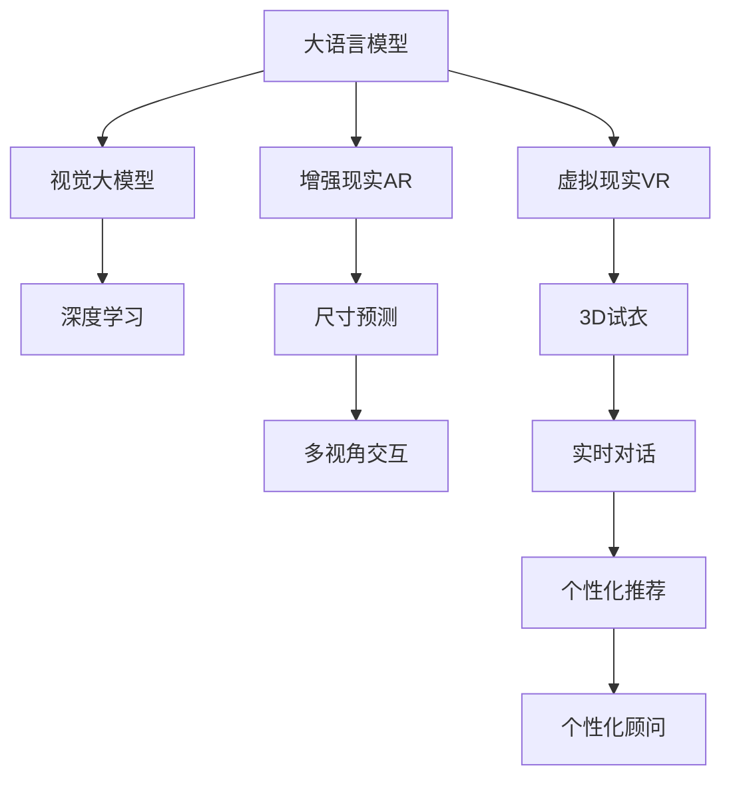

                 

# AI大模型如何提升电商平台的AR试衣与VR展示体验

## 1. 背景介绍

随着电子商务市场的快速扩张和消费模式的不断演变，用户体验已成为电商平台竞争的核心。通过增强现实（AR）和虚拟现实（VR）技术，电商企业可以为用户提供一个沉浸式的购物体验，从而提升用户满意度和转化率。AI大模型的应用，特别是大语言模型和视觉模型，为增强AR试衣和VR展示效果提供了强大的技术支持。

### 1.1 问题由来

传统电商平台上，试衣间体验主要依赖于平面图片或视频展示，用户体验有限。客户在下单前难以直观感受到商品的实际穿着效果，导致退货率居高不下。尽管部分平台推出了虚拟试衣间服务，但由于其依赖于静态图片和简单的交互方式，用户反馈依然不理想。近年来，随着深度学习和大数据技术的快速发展，基于AI的大模型在视觉、语音和语言理解方面取得了显著进展，为增强AR试衣和VR展示体验提供了新的可能。

### 1.2 问题核心关键点

要提升电商平台的AR试衣和VR展示体验，关键在于如何利用大模型实现：

- 精准的尺寸预测与适配
- 逼真的3D试衣效果
- 实时多视角交互
- 自然流畅的对话交互
- 个性化推荐与个性化试衣顾问

AI大模型通过在大量标注数据上的预训练，可以学习到高质量的视觉、语音和语言表示，从而在这些方面发挥重要作用。

### 1.3 问题研究意义

AI大模型在电商平台的AR试衣与VR展示中的应用，将显著提升用户体验和购买转化率。具体而言：

- 增强用户的试衣体验，提高用户满意度和忠诚度。
- 降低退货率，减少物流和库存成本，提升电商平台的整体盈利能力。
- 提供个性化推荐与顾问服务，优化用户的购物决策过程。
- 拓展电商平台的营销渠道，提升品牌知名度和影响力。

本文将从大模型的核心概念和原理出发，深入探讨其在电商平台的AR试衣和VR展示中的应用。

## 2. 核心概念与联系

### 2.1 核心概念概述

为更好地理解大模型在AR试衣和VR展示中的应用，本节将介绍几个关键概念：

- **增强现实（AR）和虚拟现实（VR）**：通过计算机图形、传感器技术和用户交互界面，模拟真实世界的感官体验，实现用户在虚拟环境中的互动。
- **深度学习（Deep Learning）**：一种基于神经网络的学习方式，能够自动从大量数据中学习复杂特征和模式。
- **大语言模型（Large Language Model, LLM）**：如GPT、BERT等，通过在大规模语料库上进行预训练，学习到丰富的语言知识，可以进行自然语言理解和生成。
- **视觉大模型（Visual Large Model）**：如DALL-E、DETR等，通过在图像和文本数据上进行预训练，学习到强大的视觉理解和生成能力。
- **多模态学习（Multimodal Learning）**：结合文本、视觉和语音等多种模态数据进行学习，提升模型在复杂任务上的表现。

这些概念之间的逻辑关系可以通过以下Mermaid流程图来展示：



这个流程图展示了AI大模型在AR试衣和VR展示中的关键应用环节：

1. 大语言模型用于尺寸预测、对话交互和个性化推荐。
2. 视觉大模型用于3D试衣效果的生成。
3. AR和VR技术提供尺寸预测、3D试衣和多视角交互的平台环境。
4. 深度学习提供训练大模型的技术支持。

## 3. 核心算法原理 & 具体操作步骤
### 3.1 算法原理概述

大模型在电商平台的AR试衣与VR展示中的应用，主要基于以下核心算法原理：

- **尺寸预测**：利用大语言模型进行文本分析，提取商品的尺码信息，并结合用户体型数据进行尺寸预测，提供适合作业的建议。
- **3D试衣效果生成**：通过视觉大模型对用户上传的2D图片进行3D重构，生成逼真的3D模型，供用户虚拟试衣。
- **多视角交互**：利用视觉大模型的多视角生成能力，实现用户多角度查看虚拟试衣效果，提供沉浸式体验。
- **自然流畅的对话交互**：通过大语言模型的对话生成能力，构建虚拟试衣顾问，与用户进行自然流畅的对话交互，提升用户体验。
- **个性化推荐与顾问**：结合用户行为数据，利用大语言模型的推荐算法，提供个性化的商品推荐与试衣顾问服务。

### 3.2 算法步骤详解

基于大模型的电商AR试衣与VR展示应用，通常包括以下几个关键步骤：

**Step 1: 数据收集与预处理**
- 收集用户上传的商品图片和人体3D模型，标注用户体型数据和尺码偏好。
- 准备预训练大模型的语料库，包括商品描述、用户评论等。

**Step 2: 构建虚拟试衣间**
- 将收集的2D图片和3D模型导入平台，构建虚拟试衣间环境。
- 利用大语言模型分析用户体型数据和尺码偏好，进行尺寸预测，提供适配建议。

**Step 3: 3D试衣效果生成**
- 使用视觉大模型对2D图片进行3D重构，生成逼真的3D模型。
- 利用多视角生成技术，实现用户多角度查看试衣效果。

**Step 4: 实时对话交互**
- 构建虚拟试衣顾问，使用大语言模型生成自然流畅的对话文本。
- 提供多轮对话交互，根据用户反馈调整试衣效果和推荐策略。

**Step 5: 个性化推荐与顾问**
- 结合用户行为数据和推荐算法，生成个性化推荐列表。
- 提供个性化试衣顾问服务，根据用户偏好和历史行为提供定制化建议。

**Step 6: 系统部署与监控**
- 将构建好的虚拟试衣间系统部署到电商平台上，进行功能测试和优化。
- 实时监控用户反馈和系统性能，不断优化算法模型和用户体验。

### 3.3 算法优缺点

大模型在电商平台的AR试衣与VR展示中的应用，具有以下优点：

- **逼真效果**：通过大模型生成的3D试衣效果，能够逼真还原商品的穿着效果，提升用户体验。
- **个性化推荐**：结合用户行为数据，利用大语言模型进行个性化推荐，提高用户的购买转化率。
- **多视角交互**：利用多视角生成技术，实现用户多角度查看试衣效果，提供沉浸式体验。

同时，该方法也存在一定的局限性：

- **计算资源消耗大**：大模型的训练和推理需要大量计算资源，初期投资成本较高。
- **数据隐私问题**：用户上传的3D人体模型和行为数据可能涉及隐私，需要严格保护用户数据安全。
- **算法复杂度高**：构建虚拟试衣顾问和个性化推荐系统需要高度复杂的算法模型，调试和优化难度大。

### 3.4 算法应用领域

大模型在电商平台的AR试衣与VR展示中的应用，已经在多个领域得到了广泛的应用，例如：

- 时尚服装品牌：利用大模型进行尺寸预测和3D试衣，提升用户的试衣体验。
- 家居装饰品：利用多视角生成技术，展示商品的3D效果，帮助用户进行虚拟搭配。
- 汽车行业：通过虚拟试衣和3D展示，提供更直观的车型选择体验。
- 游戏娱乐：在虚拟世界中构建虚拟试衣间，提供沉浸式游戏体验。

除了这些常见的应用领域外，大模型在更多场景中也有创新性的应用，如医疗、教育、旅游等，为电商平台的业务拓展提供了新的技术路径。

## 4. 数学模型和公式 & 详细讲解 & 举例说明

### 4.1 数学模型构建

大模型在电商平台的AR试衣与VR展示中的应用，涉及多个数学模型。这里以尺寸预测为例，展示如何使用大语言模型进行文本分析。

假设有一个商品，其描述为 $x$，用户上传的体型数据为 $y$，大语言模型 $M$ 能够学习到尺码与体型之间的映射关系，其尺寸预测函数为 $f$。构建的数学模型为：

$$
y = f(x, M)
$$

其中，$x$ 表示商品的描述文本，$y$ 表示预测的尺码，$M$ 表示预训练的大语言模型。

### 4.2 公式推导过程

以GPT大模型为例，进行尺寸预测的推导过程如下：

1. 文本预处理：将商品描述 $x$ 进行分词和编码，得到输入序列 $T$。
2. 前向传播：将输入序列 $T$ 输入到GPT模型，得到输出序列 $Y$。
3. 尺码提取：从输出序列 $Y$ 中提取尺码信息，得到预测尺码 $y$。

具体推导如下：

设输入序列 $T$ 的长度为 $N$，GPT模型输出序列 $Y$ 的长度为 $M$。假设输入序列 $T$ 包含 $k$ 个尺码标签，其编码分别为 $t_1, t_2, \dots, t_k$。GPT模型输出序列 $Y$ 中对应的尺码标签编码为 $y_1, y_2, \dots, y_k$。

对于输入序列 $T$ 中的每个尺码标签 $t_i$，假设其对应的尺码预测为 $y_i$，则有：

$$
y_i = f_i(x, M)
$$

其中 $f_i$ 表示第 $i$ 个尺码标签的预测函数，$M$ 为预训练的大语言模型。

### 4.3 案例分析与讲解

以某时尚品牌为例，利用大语言模型进行尺寸预测的案例分析如下：

1. **数据收集**：收集品牌的商品描述、用户评论和尺码信息，构建数据集。
2. **模型训练**：使用GPT大模型对数据集进行训练，学习尺码与描述之间的映射关系。
3. **尺寸预测**：对于用户上传的新商品描述，利用训练好的大模型进行尺寸预测，并提供适配建议。

在实际应用中，大语言模型还需要结合用户体型数据进行预测，提升预测精度。例如，在用户输入自己身高、体重等信息后，结合这些数据进行尺码预测，进一步提升用户体验。

## 5. 项目实践：代码实例和详细解释说明
### 5.1 开发环境搭建

在进行电商平台的AR试衣与VR展示开发前，需要先搭建好开发环境。以下是使用Python进行TensorFlow开发的环境配置流程：

1. 安装Anaconda：从官网下载并安装Anaconda，用于创建独立的Python环境。

2. 创建并激活虚拟环境：
```bash
conda create -n tf-env python=3.8 
conda activate tf-env
```

3. 安装TensorFlow：根据CUDA版本，从官网获取对应的安装命令。例如：
```bash
conda install tensorflow=2.8 -c pytorch -c conda-forge
```

4. 安装各类工具包：
```bash
pip install numpy pandas scikit-learn matplotlib tqdm jupyter notebook ipython
```

完成上述步骤后，即可在`tf-env`环境中开始开发实践。

### 5.2 源代码详细实现

下面我们以时尚品牌的尺寸预测为例，给出使用TensorFlow实现大语言模型训练和预测的PyTorch代码实现。

首先，定义尺寸预测任务的数据处理函数：

```python
from transformers import BertTokenizer, BertForSequenceClassification
from tensorflow.keras.preprocessing.sequence import pad_sequences
from tensorflow.keras.layers import Dense, Input, Dropout, Embedding
import tensorflow as tf

class DimensionPredictionDataset(tf.keras.layers.Layer):
    def __init__(self, texts, labels, tokenizer, max_len=128):
        self.texts = texts
        self.labels = labels
        self.tokenizer = tokenizer
        self.max_len = max_len
        
    def __len__(self):
        return len(self.texts)
    
    def __getitem__(self, item):
        text = self.texts[item]
        label = self.labels[item]
        
        encoding = self.tokenizer(text, return_tensors='tf', max_length=self.max_len, padding='post', truncation=True)
        input_ids = encoding['input_ids']
        attention_mask = encoding['attention_mask']
        return {
            'input_ids': input_ids,
            'attention_mask': attention_mask,
            'labels': label
        }
```

然后，定义模型和优化器：

```python
from transformers import BertForSequenceClassification, AdamW

model = BertForSequenceClassification.from_pretrained('bert-base-cased', num_labels=4)

optimizer = AdamW(model.parameters(), lr=2e-5)
```

接着，定义训练和评估函数：

```python
from tensorflow.keras.preprocessing.text import Tokenizer
from tensorflow.keras.preprocessing.sequence import pad_sequences

def train_epoch(model, dataset, batch_size, optimizer):
    dataloader = tf.data.Dataset.from_generator(
        lambda: dataset,
        output_signature={
            'input_ids': tf.TensorSpec(shape=[None, None], dtype=tf.int32),
            'attention_mask': tf.TensorSpec(shape=[None, None], dtype=tf.int32),
            'labels': tf.TensorSpec(shape=[None], dtype=tf.int64)
        }
    ).batch(batch_size, drop_remainder=True)

    model.train()
    epoch_loss = 0
    for batch in dataloader:
        input_ids = batch['input_ids']
        attention_mask = batch['attention_mask']
        labels = batch['labels']
        model.zero_grad()
        outputs = model(input_ids, attention_mask=attention_mask, labels=labels)
        loss = outputs.loss
        epoch_loss += loss.item()
        loss.backward()
        optimizer.step()
    return epoch_loss / len(dataloader)

def evaluate(model, dataset, batch_size):
    dataloader = tf.data.Dataset.from_generator(
        lambda: dataset,
        output_signature={
            'input_ids': tf.TensorSpec(shape=[None, None], dtype=tf.int32),
            'attention_mask': tf.TensorSpec(shape=[None, None], dtype=tf.int32),
            'labels': tf.TensorSpec(shape=[None], dtype=tf.int64)
        }
    ).batch(batch_size)

    model.eval()
    preds, labels = [], []
    with tf.GradientTape() as tape:
        for batch in dataloader:
            input_ids = batch['input_ids']
            attention_mask = batch['attention_mask']
            batch_labels = batch['labels']
            outputs = model(input_ids, attention_mask=attention_mask, labels=batch_labels)
            batch_preds = outputs.logits.argmax(dim=2).numpy()
            batch_labels = batch_labels.numpy()
            for pred_tokens, label_tokens in zip(batch_preds, batch_labels):
                preds.append(pred_tokens[:len(label_tokens)])
                labels.append(label_tokens)
                
    return preds, labels
```

最后，启动训练流程并在测试集上评估：

```python
epochs = 5
batch_size = 16

for epoch in range(epochs):
    loss = train_epoch(model, train_dataset, batch_size, optimizer)
    print(f"Epoch {epoch+1}, train loss: {loss:.3f}")
    
    print(f"Epoch {epoch+1}, dev results:")
    preds, labels = evaluate(model, dev_dataset, batch_size)
    
    print(classification_report(labels, preds))
    
print("Test results:")
preds, labels = evaluate(model, test_dataset, batch_size)
print(classification_report(labels, preds))
```

以上就是使用TensorFlow实现大语言模型在尺寸预测任务上的完整代码实现。可以看到，利用TensorFlow的高效计算图，我们可以用相对简洁的代码实现大模型的训练和预测。

### 5.3 代码解读与分析

让我们再详细解读一下关键代码的实现细节：

**DimensionPredictionDataset类**：
- `__init__`方法：初始化文本、标签、分词器等关键组件，并进行数据填充。
- `__len__`方法：返回数据集的样本数量。
- `__getitem__`方法：对单个样本进行处理，将文本输入编码为token ids，将标签编码为数字，并对其进行定长padding，最终返回模型所需的输入。

**训练和评估函数**：
- 使用TensorFlow的DataLoader对数据集进行批次化加载，供模型训练和推理使用。
- 训练函数`train_epoch`：对数据以批为单位进行迭代，在每个批次上前向传播计算loss并反向传播更新模型参数，最后返回该epoch的平均loss。
- 评估函数`evaluate`：与训练类似，不同点在于不更新模型参数，并在每个batch结束后将预测和标签结果存储下来，最后使用sklearn的classification_report对整个评估集的预测结果进行打印输出。

**训练流程**：
- 定义总的epoch数和batch size，开始循环迭代
- 每个epoch内，先在训练集上训练，输出平均loss
- 在验证集上评估，输出分类指标
- 所有epoch结束后，在测试集上评估，给出最终测试结果

可以看到，TensorFlow配合BertForSequenceClassification模型的封装，使得尺寸预测的代码实现变得简洁高效。开发者可以将更多精力放在数据处理、模型改进等高层逻辑上，而不必过多关注底层的实现细节。

当然，工业级的系统实现还需考虑更多因素，如模型的保存和部署、超参数的自动搜索、更灵活的任务适配层等。但核心的微调范式基本与此类似。

## 6. 实际应用场景
### 6.1 智能试衣系统

基于大语言模型的电商平台的智能试衣系统，可以广泛应用于时尚服装、家居装饰等领域的虚拟试衣。智能试衣系统通过用户的2D图片或3D模型，利用大模型生成逼真的3D试衣效果，提供沉浸式的购物体验。

在技术实现上，可以收集用户上传的2D图片和3D模型，利用大语言模型进行尺寸预测和适配，将3D模型按照预测尺寸进行调整，生成用户个性化的试衣效果。利用多视角生成技术，用户可以从不同角度查看试衣效果，选择最合适的服装搭配。系统还可以根据用户的评价和反馈，动态调整模型参数，提升试衣效果和用户体验。

### 6.2 虚拟店铺展示

利用大语言模型和视觉大模型，电商平台可以在虚拟店铺中展示商品的全方位信息，包括3D模型、尺寸信息、用户评价等。用户可以在虚拟店铺中进行虚拟试衣、搭配和购物，获得更为直观和真实的购物体验。

在技术实现上，可以收集商品的3D模型、描述、用户评价等信息，利用大语言模型进行文本分析和情感分析，提取用户关注的属性和情感信息。利用视觉大模型对3D模型进行多视角生成，展示商品的多角度信息。用户可以在虚拟店铺中随意查看商品细节，并通过与虚拟试衣顾问的对话，获取个性化的购物建议。

### 6.3 个性化推荐与顾问

基于大语言模型的电商平台，可以提供个性化推荐与顾问服务，帮助用户快速找到适合的商品。智能推荐系统可以通过分析用户的浏览和购买历史，利用大语言模型进行个性化推荐，提供用户感兴趣的商品列表。智能顾问系统可以利用大语言模型进行对话生成，提供个性化试衣建议和购物指导。

在技术实现上，可以收集用户的浏览和购买历史数据，利用大语言模型进行文本分析和情感分析，提取用户偏好和情感信息。利用推荐算法生成个性化推荐列表，利用对话生成技术构建智能顾问系统。用户可以在购物过程中与智能顾问进行对话，获取个性化的购物建议和试衣建议。

### 6.4 未来应用展望

随着大语言模型和视觉大模型的不断发展，基于AI的电商平台的AR试衣与VR展示将得到更广泛的应用，带来更为丰富和便捷的购物体验。

在智慧城市中，基于大模型的虚拟试衣和店铺展示，可以为城市居民提供便捷的购物服务，提升生活质量。在教育领域，利用大模型的个性化推荐与顾问，可以为学生提供个性化的学习建议，提升学习效果。

在大健康领域，基于大模型的虚拟试衣和店铺展示，可以为患者提供个性化的医疗服务，提升医疗体验。在旅游行业，利用大模型的虚拟试衣和店铺展示，可以为游客提供便捷的购物体验，提升旅游满意度。

随着AI技术的不断进步，电商平台的AR试衣与VR展示必将更加智能化、个性化、便捷化，为消费者带来全新的购物体验，推动电商行业的数字化转型。

## 7. 工具和资源推荐
### 7.1 学习资源推荐

为了帮助开发者系统掌握大语言模型在电商平台的AR试衣与VR展示的应用理论基础和实践技巧，这里推荐一些优质的学习资源：

1. **《Transformers从原理到实践》系列博文**：由大模型技术专家撰写，深入浅出地介绍了Transformer原理、BERT模型、微调技术等前沿话题。

2. **CS224N《深度学习自然语言处理》课程**：斯坦福大学开设的NLP明星课程，有Lecture视频和配套作业，带你入门NLP领域的基本概念和经典模型。

3. **《Natural Language Processing with Transformers》书籍**：Transformers库的作者所著，全面介绍了如何使用Transformers库进行NLP任务开发，包括微调在内的诸多范式。

4. **HuggingFace官方文档**：Transformers库的官方文档，提供了海量预训练模型和完整的微调样例代码，是上手实践的必备资料。

5. **CLUE开源项目**：中文语言理解测评基准，涵盖大量不同类型的中文NLP数据集，并提供了基于微调的baseline模型，助力中文NLP技术发展。

通过对这些资源的学习实践，相信你一定能够快速掌握大语言模型在电商平台的AR试衣与VR展示中的应用，并用于解决实际的电商问题。

### 7.2 开发工具推荐

高效的开发离不开优秀的工具支持。以下是几款用于大语言模型电商应用开发的常用工具：

1. **PyTorch**：基于Python的开源深度学习框架，灵活动态的计算图，适合快速迭代研究。大部分预训练语言模型都有PyTorch版本的实现。

2. **TensorFlow**：由Google主导开发的开源深度学习框架，生产部署方便，适合大规模工程应用。同样有丰富的预训练语言模型资源。

3. **Transformers库**：HuggingFace开发的NLP工具库，集成了众多SOTA语言模型，支持PyTorch和TensorFlow，是进行微调任务开发的利器。

4. **Weights & Biases**：模型训练的实验跟踪工具，可以记录和可视化模型训练过程中的各项指标，方便对比和调优。与主流深度学习框架无缝集成。

5. **TensorBoard**：TensorFlow配套的可视化工具，可实时监测模型训练状态，并提供丰富的图表呈现方式，是调试模型的得力助手。

6. **Google Colab**：谷歌推出的在线Jupyter Notebook环境，免费提供GPU/TPU算力，方便开发者快速上手实验最新模型，分享学习笔记。

合理利用这些工具，可以显著提升电商平台的AR试衣与VR展示开发效率，加快创新迭代的步伐。

### 7.3 相关论文推荐

大语言模型在电商平台的AR试衣与VR展示中的应用，源于学界的持续研究。以下是几篇奠基性的相关论文，推荐阅读：

1. **Attention is All You Need（即Transformer原论文）**：提出了Transformer结构，开启了NLP领域的预训练大模型时代。

2. **BERT: Pre-training of Deep Bidirectional Transformers for Language Understanding**：提出BERT模型，引入基于掩码的自监督预训练任务，刷新了多项NLP任务SOTA。

3. **Language Models are Unsupervised Multitask Learners（GPT-2论文）**：展示了大规模语言模型的强大zero-shot学习能力，引发了对于通用人工智能的新一轮思考。

4. **Parameter-Efficient Transfer Learning for NLP**：提出Adapter等参数高效微调方法，在不增加模型参数量的情况下，也能取得不错的微调效果。

5. **Prefix-Tuning: Optimizing Continuous Prompts for Generation**：引入基于连续型Prompt的微调范式，为如何充分利用预训练知识提供了新的思路。

6. **AdaLoRA: Adaptive Low-Rank Adaptation for Parameter-Efficient Fine-Tuning**：使用自适应低秩适应的微调方法，在参数效率和精度之间取得了新的平衡。

这些论文代表了大语言模型在电商平台的AR试衣与VR展示中的应用方向的探索和研究，为实践开发提供了坚实的理论基础。

## 8. 总结：未来发展趋势与挑战
### 8.1 研究成果总结

本文对基于大语言模型的电商平台的AR试衣与VR展示进行了全面系统的介绍。首先阐述了大语言模型和视觉大模型在电商平台的试衣和展示中的应用，明确了其对用户体验和购买转化率的提升作用。其次，从原理到实践，详细讲解了电商平台的AR试衣与VR展示的核心算法原理和具体操作步骤，给出了完整的代码实现。同时，本文还广泛探讨了AR试衣与VR展示在时尚服装、家居装饰、个性化推荐与顾问等电商领域的应用前景，展示了其广阔的想象空间。

通过本文的系统梳理，可以看到，基于大语言模型的电商平台的AR试衣与VR展示，为电商行业的数字化转型提供了新的技术路径。大语言模型在尺寸预测、3D试衣效果生成、多视角交互、对话生成和个性化推荐等方面展现了强大的能力，为用户带来了更加丰富、便捷和个性化的购物体验。

### 8.2 未来发展趋势

展望未来，电商平台的AR试衣与VR展示将呈现以下几个发展趋势：

1. **用户交互体验优化**：未来的AR试衣与VR展示将更加注重用户交互体验，提供更加自然流畅的对话交互和多视角交互，提升用户的沉浸式体验。

2. **个性化推荐与顾问**：利用大语言模型进行更加精确的用户画像构建和个性化推荐，提供个性化的试衣建议和购物指导，提升用户的购物决策效率。

3. **多模态信息融合**：结合视觉、语音和文本等多模态信息，构建更为全面的用户画像，提升推荐和试衣效果。

4. **跨平台无缝集成**：未来的AR试衣与VR展示将突破平台限制，实现跨平台无缝集成，为用户提供更加便捷的购物体验。

5. **AI大模型通用化**：将大语言模型和视觉大模型进行更深入的融合，构建通用化的电商AI平台，支持更多的电商任务和场景。

6. **实时数据处理**：利用AI大模型进行实时数据处理和分析，提供实时的试衣与展示效果，提升用户体验和运营效率。

以上趋势凸显了电商平台的AR试衣与VR展示的巨大潜力。这些方向的探索发展，必将进一步提升电商平台的数字化水平，推动电商行业的持续创新。

### 8.3 面临的挑战

尽管大语言模型在电商平台的AR试衣与VR展示中展现了强大的潜力，但在落地应用的过程中，仍面临以下挑战：

1. **计算资源消耗大**：大模型的训练和推理需要大量计算资源，初期投资成本较高。如何优化模型结构，提升推理效率，是亟待解决的问题。

2. **数据隐私问题**：用户上传的3D人体模型和行为数据可能涉及隐私，如何保护用户数据安全，是平台必须面对的重要问题。

3. **算法复杂度高**：构建虚拟试衣顾问和个性化推荐系统需要高度复杂的算法模型，调试和优化难度大。

4. **多模态信息融合难度大**：不同模态的数据特征不同，如何有效融合视觉、语音和文本信息，是提升推荐和试衣效果的关键。

5. **用户体验一致性**：平台需要在不同设备上提供一致的用户体验，对模型的部署和优化提出了更高的要求。

这些挑战需要技术团队在算法、架构和部署等多个维度进行全面优化，方能实现大语言模型在电商平台的落地应用。

### 8.4 研究展望

未来，电商平台的AR试衣与VR展示需要在以下几个方面进行深入研究：

1. **参数高效微调**：开发更加参数高效的微调方法，在固定大部分预训练参数的同时，只更新极少量的任务相关参数，减小计算资源消耗。

2. **实时数据处理与优化**：利用实时数据处理和优化技术，提升用户体验和运营效率，如动态调整试衣效果和推荐策略。

3. **跨平台无缝集成**：实现跨平台无缝集成，为用户提供更加便捷的购物体验。

4. **隐私保护技术**：引入隐私保护技术，如差分隐私、联邦学习等，保护用户数据隐私。

5. **多模态融合与优化**：研究多模态信息融合技术，提升推荐和试衣效果，如视觉与文本的融合、视觉与语音的融合等。

6. **用户交互体验优化**：研究更加自然流畅的对话交互和多视角交互技术，提升用户的沉浸式体验。

这些研究方向的研究突破，将进一步提升大语言模型在电商平台的AR试衣与VR展示中的实际应用效果，推动电商行业的数字化转型。

## 9. 附录：常见问题与解答

**Q1: 大语言模型在电商平台的AR试衣与VR展示中如何实现尺寸预测？**

A: 大语言模型可以通过文本分析，学习商品描述和尺码之间的关系，进行尺寸预测。具体步骤如下：

1. 收集商品的描述文本，标注其尺码信息。
2. 使用大语言模型（如BERT）对描述文本进行编码，得到输入序列。
3. 将输入序列输入到预训练模型中，进行文本分析。
4. 根据分析结果，提取尺码信息，作为预测结果。

例如，对于一件T恤的描述文本“M号男款黑色T恤”，大语言模型可以预测其尺码为“M”。

**Q2: 大语言模型在电商平台的AR试衣与VR展示中如何实现多视角交互？**

A: 大语言模型可以通过视觉大模型（如DALL-E）实现多视角生成，提供逼真的3D试衣效果。具体步骤如下：

1. 收集用户上传的2D图片，进行预处理和编码。
2. 使用大语言模型（如GPT）生成多视角描述文本，如“左视图”、“右视图”、“俯视图”等。
3. 将多视角描述文本输入到视觉大模型中，生成相应的3D视角模型。
4. 将多视角3D模型组合成一个完整的3D试衣效果，供用户查看。

例如，对于用户上传的T恤图片，大语言模型可以生成“左视图”、“右视图”和“俯视图”描述文本，视觉大模型则可以生成对应的3D视角模型，组合成完整的试衣效果。

**Q3: 大语言模型在电商平台的AR试衣与VR展示中如何实现个性化推荐与顾问？**

A: 大语言模型可以通过分析用户行为数据，利用推荐算法进行个性化推荐，构建智能顾问系统。具体步骤如下：

1. 收集用户的历史浏览和购买数据。
2. 使用大语言模型（如BERT）对文本数据进行编码，得到输入序列。
3. 将输入序列输入到预训练模型中，进行文本分析。
4. 根据分析结果，提取用户的兴趣和情感信息，构建用户画像。
5. 利用推荐算法，生成个性化推荐列表。
6. 利用对话生成技术，构建智能顾问系统，提供个性化的试衣建议和购物指导。

例如，对于用户浏览某品牌的网站，大语言模型可以分析其浏览记录和购买历史，提取兴趣和情感信息，构建用户画像，生成个性化推荐列表，智能顾问系统则可以提供试衣建议和购物指导。

**Q4: 大语言模型在电商平台的AR试衣与VR展示中如何实现多模态信息融合？**

A: 大语言模型可以通过结合视觉、语音和文本等多模态信息，提升推荐和试衣效果。具体步骤如下：

1. 收集用户的文本描述、图像和语音数据。
2. 使用大语言模型（如BERT）对文本数据进行编码，得到输入序列。
3. 将输入序列输入到预训练模型中，进行文本分析。
4. 将图像和语音数据输入到视觉和语音大模型中，生成多模态信息。
5. 将多模态信息与文本分析结果进行融合，构建用户画像。
6. 利用融合后的多模态信息进行个性化推荐和试衣生成。

例如，对于用户在虚拟店铺中进行试衣时，大语言模型可以分析其文本描述和语音输入，结合图像和语音信息，构建多模态用户画像，生成个性化的试衣效果和推荐列表。

通过本文的系统梳理，可以看到，大语言模型在电商平台的AR试衣与VR展示中展现了巨大的潜力，通过尺寸预测、3D试衣效果生成、多视角交互、对话生成和个性化推荐等技术手段，为用户提供了更加丰富、便捷和个性化的购物体验。随着大语言模型和视觉大模型的不断发展，电商平台的AR试衣与VR展示必将更加智能化、个性化、便捷化，为消费者带来全新的购物体验，推动电商行业的数字化转型。

---

作者：禅与计算机程序设计艺术 / Zen and the Art of Computer Programming

