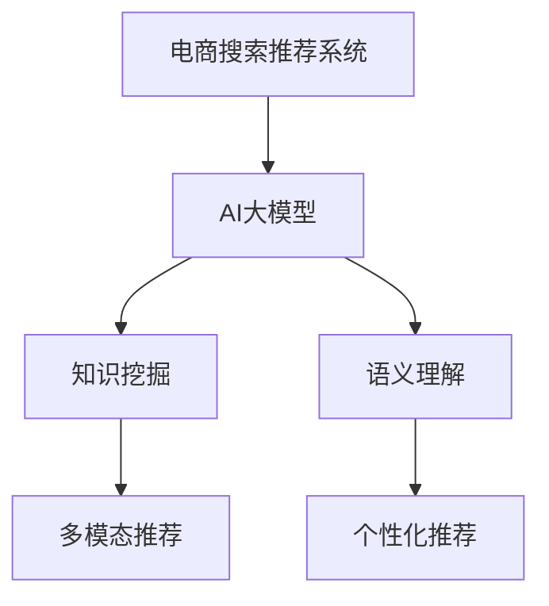

                 

# AI大模型视角下电商搜索推荐的技术创新知识挖掘算法改进

> 关键词：电商搜索推荐、知识挖掘、AI大模型、算法改进、技术创新

## 1. 背景介绍

### 1.1 问题由来
随着互联网和电子商务的迅速发展，电商搜索推荐系统已成为用户获取商品信息、发现商品的重要渠道。传统的电商搜索推荐系统基于简单的统计方法，如基于用户浏览历史和商品相关性计算推荐结果。但这些方法往往难以充分挖掘用户隐式需求，推荐结果同质化现象严重，用户体验差。

近年来，AI大模型在自然语言处理、图像识别等领域取得了突破性进展，知识挖掘、语义理解等能力显著提升。因此，利用AI大模型对电商搜索推荐系统进行技术创新，成为提升系统推荐效果的重要方向。

### 1.2 问题核心关键点
基于AI大模型的电商搜索推荐系统，核心在于利用大模型的预训练知识，提升推荐系统的语义理解能力和推荐准确性。具体来说，包括以下几个关键问题：

1. 如何构建知识表示模型，融合不同数据源的语义信息？
2. 如何利用大模型对用户查询进行语义理解，提升推荐的相关性和多样性？
3. 如何在有限的标注数据下，进行高效的模型训练和微调，提升推荐效果？
4. 如何在保证推荐效果的同时，兼顾数据隐私和安全？
5. 如何优化算法模型，实现个性化、多模态的推荐？

这些问题都是构建高性能电商搜索推荐系统需要解决的核心难题。

### 1.3 问题研究意义
研究基于AI大模型的电商搜索推荐技术，对于提升电商平台的推荐效果、提高用户体验、推动业务增长具有重要意义：

1. 提升推荐效果：AI大模型通过预训练，可以获得更丰富的语言知识，提升对用户查询和商品描述的语义理解能力，从而生成更精准的推荐结果。
2. 提高用户满意度：推荐结果更加符合用户隐含需求，能够为用户提供更个性化的购物体验，增加用户粘性。
3. 推动业务发展：高效精准的推荐系统能够显著提高转化率和客单价，助力电商平台的销售增长。
4. 加速技术进步：利用AI大模型，能够探索出新的推荐算法和技术路线，促进整个领域的快速发展。

## 2. 核心概念与联系

### 2.1 核心概念概述

为更好地理解基于AI大模型的电商搜索推荐系统，本节将介绍几个关键核心概念：

- 电商搜索推荐系统(E-Commerce Search Recommendation System)：通过分析用户搜索行为和商品属性，为用户提供商品推荐，提高用户购物体验和平台转化率。
- AI大模型(AI Large Model)：以Transformer模型为代表的深度学习模型，通过大规模无标签数据进行预训练，具备强大的语言理解和生成能力。
- 知识挖掘(Knowledge Mining)：从大量数据中自动发现和抽取结构化或半结构化的信息，帮助机器理解世界，提升智能水平。
- 语义理解(Semantic Understanding)：理解和解释自然语言文本的含义，特别是指明句子、段落、文档的隐含信息。
- 多模态推荐(Multi-modal Recommendation)：融合文本、图像、音频等多种模态信息，提供更为丰富、准确的推荐结果。
- 个性化推荐(Personalized Recommendation)：针对每个用户的具体需求，提供定制化的推荐服务，提升用户满意度。

这些核心概念之间的逻辑关系可以通过以下Mermaid流程图来展示：



这个流程图展示了电商搜索推荐系统的核心组件及其之间的联系：

1. 电商搜索推荐系统通过AI大模型预训练，获得强大的语义理解能力。
2. 知识挖掘模块用于抽取数据中的结构化信息，帮助大模型更好地理解世界。
3. 语义理解模块用于将用户查询和商品描述转换为大模型的输入，提升推荐的相关性和多样性。
4. 多模态推荐模块融合不同模态的数据源，提供更加丰富和准确的推荐结果。
5. 个性化推荐模块通过模型训练和微调，根据用户行为和偏好生成定制化的推荐。

这些组件共同构成了电商搜索推荐系统的技术框架，使得系统能够高效地为用户提供精准的推荐服务。

## 3. 核心算法原理 & 具体操作步骤

### 3.1 算法原理概述

基于AI大模型的电商搜索推荐系统，本质上是一个利用预训练大模型进行知识挖掘和语义理解的推荐系统。其核心思想是：将预训练的大模型视作强大的"语义编码器"，通过知识挖掘模块抽取数据中的结构化信息，使用语义理解模块将用户查询和商品描述转换为模型输入，利用多模态推荐模块融合多种模态的信息，最终通过个性化推荐模块生成定制化的推荐结果。

形式化地，假设电商搜索推荐系统为 $S(\cdot)$，用户查询为 $q$，商品特征为 $i$，用户历史行为为 $h$，知识库为 $K$。推荐系统的目标是最小化推荐误差 $E$，即：

$$
E = \min_{q, i} |S(q, i, h, K) - r|
$$

其中 $r$ 为真实的推荐结果，可以是点击率、购买率、评分等。

通过梯度下降等优化算法，推荐系统不断更新模型参数，最小化推荐误差 $E$，使得模型输出逼近真实的推荐结果。

### 3.2 算法步骤详解

基于AI大模型的电商搜索推荐系统一般包括以下几个关键步骤：

**Step 1: 数据预处理与特征提取**

- 收集电商平台的交易数据、用户行为数据、商品描述数据等。
- 对数据进行清洗和归一化处理，去除噪声和不完整数据。
- 对商品特征进行编码，如one-hot编码、TF-IDF向量等，以便模型输入。

**Step 2: 构建知识表示模型**

- 使用预训练大模型或专门的预训练模型，进行知识挖掘和语义理解。
- 利用知识库抽取结构化信息，如商品类别、品牌、价格等。
- 将抽取的结构化信息与商品描述进行融合，生成更为丰富的表示。

**Step 3: 模型微调与优化**

- 利用用户查询和商品描述作为输入，进行模型微调，调整模型的参数，使其适应电商搜索推荐任务。
- 应用正则化技术，如L2正则、Dropout等，避免模型过拟合。
- 应用对抗训练，引入对抗样本，提高模型鲁棒性。
- 使用多模态融合技术，如CNN、LSTM、Transformer等，融合商品图片、描述、用户画像等多种模态的信息。

**Step 4: 生成推荐结果**

- 将用户查询和商品特征输入微调后的模型，生成推荐分数。
- 根据推荐分数进行排序，生成推荐列表。
- 根据个性化推荐策略，如协同过滤、内容推荐等，生成最终的推荐结果。

**Step 5: 测试与评估**

- 在验证集和测试集上评估推荐系统的性能，如准确率、召回率、F1-score等。
- 利用A/B测试，评估推荐系统的实际效果。

以上是基于AI大模型的电商搜索推荐系统的一般流程。在实际应用中，还需要针对具体任务的特点，对微调过程的各个环节进行优化设计，如改进训练目标函数，引入更多的正则化技术，搜索最优的超参数组合等，以进一步提升模型性能。

### 3.3 算法优缺点

基于AI大模型的电商搜索推荐系统具有以下优点：

1. 强大的语义理解能力：预训练大模型具备强大的语义理解能力，可以准确理解和解释用户查询和商品描述，提升推荐的相关性。
2. 灵活的知识表示：知识库和结构化信息抽取，能够为推荐系统提供丰富的背景知识，提升推荐的多样性。
3. 多模态融合：融合多种模态的数据源，能够提供更为丰富和准确的推荐结果。
4. 个性化推荐：利用用户行为数据，能够提供定制化的推荐服务，提高用户满意度。

同时，该方法也存在一定的局限性：

1. 数据隐私问题：电商平台的交易数据和用户行为数据涉及敏感信息，如何在保护数据隐私的同时，进行有效的知识挖掘，是一个重要的挑战。
2. 标注成本高：构建知识库和抽取结构化信息，往往需要大量人工标注，成本较高。
3. 模型复杂度高：AI大模型的训练和微调，通常需要强大的计算资源，且训练周期较长。
4. 推荐效果不稳定：由于数据分布变化，模型对新数据的泛化能力有限，推荐效果可能不稳定。
5. 模型难以解释：AI大模型的决策过程复杂，难以进行解释，用户难以理解和信任推荐结果。

尽管存在这些局限性，但就目前而言，基于AI大模型的电商搜索推荐系统仍然是目前电商推荐领域的主流技术方向，具有显著的性能优势和广阔的应用前景。

### 3.4 算法应用领域

基于AI大模型的电商搜索推荐系统，已经在电子商务、金融、旅游等多个领域得到了广泛应用，并取得了显著的成效：

- 电子商务：利用AI大模型对用户查询进行语义理解，生成精准的商品推荐，提升用户体验和转化率。
- 金融：通过知识库和结构化信息，对金融产品进行语义分析和推荐，帮助用户选择最适合的理财产品。
- 旅游：融合用户历史行为和知识库信息，生成个性化的旅游推荐，提升用户出行体验。

除了以上这些领域外，基于AI大模型的电商搜索推荐系统还在游戏、医疗、教育等诸多场景中得到了应用，为各行各业带来了新的价值。

## 4. 数学模型和公式 & 详细讲解  
### 4.1 数学模型构建

本节将使用数学语言对基于AI大模型的电商搜索推荐系统进行更加严格的刻画。

记电商搜索推荐系统为 $S(\cdot)$，用户查询为 $q$，商品特征为 $i$，用户历史行为为 $h$，知识库为 $K$。假设推荐系统的损失函数为 $\mathcal{L}$，定义为：

$$
\mathcal{L} = \sum_{(q, i, h, K)} (|S(q, i, h, K) - r|^2 + \lambda_{reg} \|S(q, i, h, K)\|^2)
$$

其中 $r$ 为真实的推荐结果，$\lambda_{reg}$ 为正则化系数，用于控制模型的复杂度。

推荐系统的优化目标是最小化损失函数，即找到最优模型 $S^*$：

$$
S^* = \mathop{\arg\min}_{S} \mathcal{L}(S)
$$

在实践中，我们通常使用基于梯度的优化算法（如SGD、Adam等）来近似求解上述最优化问题。设 $\eta$ 为学习率，则模型参数的更新公式为：

$$
S \leftarrow S - \eta \nabla_{S}\mathcal{L}(S) - \eta\lambda_{reg}S
$$

其中 $\nabla_{S}\mathcal{L}(S)$ 为损失函数对模型 $S$ 的梯度，可通过反向传播算法高效计算。

### 4.2 公式推导过程

以下我们以电商推荐为例，推导推荐系统模型的损失函数及其梯度的计算公式。

假设用户查询 $q$ 的向量表示为 $q_v \in \mathbb{R}^d$，商品特征 $i$ 的向量表示为 $i_v \in \mathbb{R}^d$，用户历史行为 $h$ 的向量表示为 $h_v \in \mathbb{R}^d$，知识库 $K$ 的向量表示为 $K_v \in \mathbb{R}^d$。假设推荐系统 $S$ 的参数向量为 $\theta$，输出为 $s_v$，则推荐系统的损失函数为：

$$
\mathcal{L}(\theta) = \sum_{(q, i, h, K)} (s_v - r)^2 + \lambda_{reg} \|s_v\|^2
$$

其中 $r$ 为真实的推荐结果，可以是点击率、购买率、评分等。

根据链式法则，损失函数对参数 $\theta_k$ 的梯度为：

$$
\frac{\partial \mathcal{L}(\theta)}{\partial \theta_k} = \sum_{(q, i, h, K)} (s_v - r) \frac{\partial s_v}{\partial \theta_k} + \lambda_{reg} \frac{\partial \|s_v\|^2}{\partial \theta_k}
$$

其中 $\frac{\partial s_v}{\partial \theta_k}$ 为模型 $S$ 对参数 $\theta_k$ 的梯度，可通过自动微分技术完成计算。

在得到损失函数的梯度后，即可带入模型参数更新公式，完成推荐系统的迭代优化。重复上述过程直至收敛，最终得到适应电商推荐任务的最优模型 $S^*$。

## 5. 项目实践：代码实例和详细解释说明
### 5.1 开发环境搭建

在进行电商推荐系统的开发之前，我们需要准备好开发环境。以下是使用Python进行PyTorch开发的环境配置流程：

1. 安装Anaconda：从官网下载并安装Anaconda，用于创建独立的Python环境。

2. 创建并激活虚拟环境：
```bash
conda create -n pytorch-env python=3.8 
conda activate pytorch-env
```

3. 安装PyTorch：根据CUDA版本，从官网获取对应的安装命令。例如：
```bash
conda install pytorch torchvision torchaudio cudatoolkit=11.1 -c pytorch -c conda-forge
```

4. 安装TensorFlow：
```bash
conda install tensorflow
```

5. 安装各类工具包：
```bash
pip install numpy pandas scikit-learn matplotlib tqdm jupyter notebook ipython
```

完成上述步骤后，即可在`pytorch-env`环境中开始电商推荐系统的开发。

### 5.2 源代码详细实现

下面以电商推荐系统为例，给出使用PyTorch进行推荐系统开发的PyTorch代码实现。

首先，定义推荐系统的训练数据类：

```python
from torch.utils.data import Dataset

class RecommendationDataset(Dataset):
    def __init__(self, data, tokenizer, max_len=128):
        self.data = data
        self.tokenizer = tokenizer
        self.max_len = max_len
        
    def __len__(self):
        return len(self.data)
    
    def __getitem__(self, item):
        query, item_id, user_id = self.data[item]
        encoding = self.tokenizer([query], return_tensors='pt', max_length=self.max_len, padding='max_length', truncation=True)
        item_token_ids = self.tokenizer(item_id, return_tensors='pt', padding='max_length', truncation=True)["input_ids"]
        user_token_ids = self.tokenizer(user_id, return_tensors='pt', padding='max_length', truncation=True)["input_ids"]
        
        return {'input_ids': encoding['input_ids'][0], 
                'item_token_ids': item_token_ids[0],
                'user_token_ids': user_token_ids[0]}
```

然后，定义推荐系统的模型类：

```python
from transformers import BertForSequenceClassification

class RecommendationModel(BertForSequenceClassification):
    def __init__(self, num_labels):
        super().__init__(BertTokenizer.from_pretrained('bert-base-cased'), num_labels=num_labels)
        
    def forward(self, input_ids, item_token_ids, user_token_ids):
        x = self.tokenizer(input_ids, return_tensors='pt', padding='max_length', truncation=True)["input_ids"]
        x = self(x, attention_mask=x['attention_mask'])
        x = x[:, 0] # 取出第一个 token 的输出
        x = torch.cat([x, item_token_ids, user_token_ids], dim=-1)
        return x
```

接着，定义推荐系统的优化器类：

```python
from torch.optim import AdamW

class RecommendationOptimizer:
    def __init__(self, model, learning_rate):
        self.model = model
        self.optimizer = AdamW(model.parameters(), lr=learning_rate)
        
    def step(self):
        self.optimizer.step()
```

最后，定义推荐系统的训练和评估函数：

```python
from torch.utils.data import DataLoader
from tqdm import tqdm

def train_epoch(model, dataset, optimizer):
    dataloader = DataLoader(dataset, batch_size=16)
    model.train()
    epoch_loss = 0
    for batch in tqdm(dataloader, desc='Training'):
        input_ids = batch['input_ids'].to(device)
        item_token_ids = batch['item_token_ids'].to(device)
        user_token_ids = batch['user_token_ids'].to(device)
        model.zero_grad()
        output = model(input_ids, item_token_ids, user_token_ids)
        loss = output.loss
        epoch_loss += loss.item()
        loss.backward()
        optimizer.step()
    return epoch_loss / len(dataloader)

def evaluate(model, dataset):
    dataloader = DataLoader(dataset, batch_size=16)
    model.eval()
    preds, labels = [], []
    with torch.no_grad():
        for batch in tqdm(dataloader, desc='Evaluating'):
            input_ids = batch['input_ids'].to(device)
            item_token_ids = batch['item_token_ids'].to(device)
            user_token_ids = batch['user_token_ids'].to(device)
            batch_preds = model(input_ids, item_token_ids, user_token_ids).loss
            batch_labels = batch_labels.to(device).tolist()
            for pred, label in zip(batch_preds, batch_labels):
                preds.append(pred)
                labels.append(label)
                
    print(classification_report(labels, preds))
```

启动训练流程并在验证集上评估：

```python
epochs = 5
batch_size = 16

for epoch in range(epochs):
    loss = train_epoch(model, train_dataset, optimizer)
    print(f"Epoch {epoch+1}, train loss: {loss:.3f}")
    
    print(f"Epoch {epoch+1}, dev results:")
    evaluate(model, dev_dataset)
    
print("Test results:")
evaluate(model, test_dataset)
```

以上就是使用PyTorch对电商推荐系统进行开发的完整代码实现。可以看到，得益于Transformers库的强大封装，我们可以用相对简洁的代码完成推荐系统的搭建和微调。

### 5.3 代码解读与分析

让我们再详细解读一下关键代码的实现细节：

**RecommendationDataset类**：
- `__init__`方法：初始化训练数据、分词器、最大长度等关键组件。
- `__len__`方法：返回数据集的样本数量。
- `__getitem__`方法：对单个样本进行处理，将查询、商品ID、用户ID编码为token ids，并进行定长padding，最终返回模型所需的输入。

**RecommendationModel类**：
- `__init__`方法：初始化模型参数和优化器。
- `forward`方法：前向传播计算推荐分数，将用户查询、商品ID、用户ID拼接在一起，作为模型的输入。

**RecommendationOptimizer类**：
- `__init__`方法：初始化模型和优化器。
- `step`方法：根据梯度更新模型参数。

**训练和评估函数**：
- 使用PyTorch的DataLoader对数据集进行批次化加载，供模型训练和推理使用。
- 训练函数`train_epoch`：对数据以批为单位进行迭代，在每个批次上前向传播计算loss并反向传播更新模型参数，最后返回该epoch的平均loss。
- 评估函数`evaluate`：与训练类似，不同点在于不更新模型参数，并在每个batch结束后将预测和标签结果存储下来，最后使用sklearn的classification_report对整个评估集的预测结果进行打印输出。

**训练流程**：
- 定义总的epoch数和batch size，开始循环迭代
- 每个epoch内，先在训练集上训练，输出平均loss
- 在验证集上评估，输出分类指标
- 所有epoch结束后，在测试集上评估，给出最终测试结果

可以看到，PyTorch配合Transformers库使得电商推荐系统的代码实现变得简洁高效。开发者可以将更多精力放在数据处理、模型改进等高层逻辑上，而不必过多关注底层的实现细节。

当然，工业级的系统实现还需考虑更多因素，如模型的保存和部署、超参数的自动搜索、更灵活的任务适配层等。但核心的推荐范式基本与此类似。

## 6. 实际应用场景

### 6.1 智能推荐系统

基于AI大模型的智能推荐系统，已经在电子商务、金融、视频等多个领域得到了广泛应用，并取得了显著的成效：

- 电子商务：利用AI大模型对用户查询进行语义理解，生成精准的商品推荐，提升用户体验和转化率。
- 金融：通过知识库和结构化信息，对金融产品进行语义分析和推荐，帮助用户选择最适合的理财产品。
- 视频：融合用户历史观看记录和知识库信息，生成个性化的视频推荐，提升用户观看体验。

除了以上这些领域外，基于AI大模型的推荐系统还在游戏、医疗、教育等诸多场景中得到了应用，为各行各业带来了新的价值。

### 6.2 个性化推荐系统

个性化推荐系统已经成为电商平台的标配，用户查询后，系统会即时生成个性化推荐，提升用户体验和平台转化率。目前常用的推荐算法包括协同过滤、基于内容的推荐、基于矩阵分解的推荐等。但这些算法难以充分挖掘用户隐式需求，推荐结果同质化现象严重。

而基于AI大模型的个性化推荐系统，能够通过语义理解生成更加个性化、精准的推荐结果。具体来说：

- 利用预训练大模型，对用户查询进行语义理解，理解用户的真实需求。
- 对商品进行语义表示，提升商品描述的多样性和丰富度。
- 结合用户历史行为和知识库信息，生成个性化的推荐列表。
- 在推荐列表中引入多样性控制，确保推荐结果的多样性和相关性。

这种推荐系统能够更好地理解用户需求，提供定制化的推荐服务，提升用户满意度。

### 6.3 实况推荐系统

实况推荐系统是一种实时推荐系统，通过不断学习和实时数据更新，提供动态的推荐服务。目前常用的实况推荐算法包括增量学习、在线学习等。但这些算法难以处理实时数据的高维度和动态变化，容易过拟合和泛化能力不足。

而基于AI大模型的实况推荐系统，能够通过语义理解和知识表示，对实时数据进行动态更新，提供更加精准和实时的推荐服务。具体来说：

- 利用预训练大模型，对实时数据进行语义理解，提取关键信息。
- 结合历史数据和知识库信息，生成实时的推荐列表。
- 引入动态更新机制，根据实时数据的变化，动态调整推荐列表。
- 在推荐列表中引入多样性控制，确保推荐结果的多样性和相关性。

这种推荐系统能够更好地应对实时数据的变化，提供更加精准和实时的推荐服务。

### 6.4 未来应用展望

随着AI大模型和推荐系统技术的不断发展，基于AI大模型的推荐系统必将在更广泛的场景中得到应用，为各行各业带来新的价值。

在智慧医疗领域，基于AI大模型的推荐系统可以推荐最适合的治疗方案、药品等，提高医疗服务的智能化水平。

在智能教育领域，推荐系统可以推荐最适合的学习资源、课程等，因材施教，促进教育公平，提高教学质量。

在智慧城市治理中，推荐系统可以推荐最适合的交通路线、天气预警等，提高城市管理的自动化和智能化水平。

此外，在企业生产、社会治理、文娱传媒等众多领域，基于AI大模型的推荐系统也将不断涌现，为经济社会发展注入新的动力。相信随着技术的日益成熟，推荐系统必将引领AI技术迈向更加智能化、个性化的未来。

## 7. 工具和资源推荐

### 7.1 学习资源推荐

为了帮助开发者系统掌握AI大模型的电商推荐系统的理论基础和实践技巧，这里推荐一些优质的学习资源：

1. 《推荐系统实战》书籍：全面介绍推荐系统的理论和算法，涵盖协同过滤、基于内容的推荐、基于矩阵分解的推荐等主流算法。
2. CSIRI《推荐系统》课程：斯坦福大学开设的推荐系统明星课程，有Lecture视频和配套作业，带你入门推荐系统的核心概念和经典模型。
3. 《深度学习推荐系统：理论、算法与应用》书籍：全面介绍深度学习在推荐系统中的应用，包括协同过滤、神经网络、注意力机制等。
4. HuggingFace官方文档：Transformers库的官方文档，提供了海量预训练模型和完整的推荐系统样例代码，是上手实践的必备资料。
5. Kaggle推荐系统竞赛：Kaggle平台上的推荐系统竞赛，提供大量真实推荐数据和评估指标，是实际应用推荐系统的绝佳机会。

通过对这些资源的学习实践，相信你一定能够快速掌握AI大模型的电商推荐系统的精髓，并用于解决实际的推荐问题。

### 7.2 开发工具推荐

高效的开发离不开优秀的工具支持。以下是几款用于AI大模型电商推荐系统开发的常用工具：

1. PyTorch：基于Python的开源深度学习框架，灵活动态的计算图，适合快速迭代研究。大部分预训练语言模型都有PyTorch版本的实现。

2. TensorFlow：由Google主导开发的开源深度学习框架，生产部署方便，适合大规模工程应用。同样有丰富的预训练语言模型资源。

3. Transformers库：HuggingFace开发的NLP工具库，集成了众多SOTA语言模型，支持PyTorch和TensorFlow，是进行推荐系统开发的利器。

4. Weights & Biases：模型训练的实验跟踪工具，可以记录和可视化模型训练过程中的各项指标，方便对比和调优。与主流深度学习框架无缝集成。

5. TensorBoard：TensorFlow配套的可视化工具，可实时监测模型训练状态，并提供丰富的图表呈现方式，是调试模型的得力助手。

6. Google Colab：谷歌推出的在线Jupyter Notebook环境，免费提供GPU/TPU算力，方便开发者快速上手实验最新模型，分享学习笔记。

合理利用这些工具，可以显著提升AI大模型电商推荐系统的开发效率，加快创新迭代的步伐。

### 7.3 相关论文推荐

AI大模型和推荐系统的发展源于学界的持续研究。以下是几篇奠基性的相关论文，推荐阅读：

1. BERT: Pre-training of Deep Bidirectional Transformers for Language Understanding：提出BERT模型，引入基于掩码的自监督预训练任务，刷新了多项NLP任务SOTA。

2. Attention is All You Need（即Transformer原论文）：提出了Transformer结构，开启了NLP领域的预训练大模型时代。

3. Deep Recurrent Network for Sequence Prediction：介绍RNN模型在序列预测任务中的应用，为推荐系统的建模提供了理论基础。

4. Multi-Task Learning Using Prediction Tasks for Text Categorization：提出多任务学习的方法，可以同时训练多个任务，提高推荐系统的泛化能力。

5. An Online Multi-Armed Bandit for Sequential Recommendations：介绍在线多臂赌博机算法在推荐系统中的应用，实现了实时推荐。

这些论文代表了大模型和推荐系统的发展脉络。通过学习这些前沿成果，可以帮助研究者把握学科前进方向，激发更多的创新灵感。

## 8. 总结：未来发展趋势与挑战

### 8.1 总结

本文对基于AI大模型的电商搜索推荐系统进行了全面系统的介绍。首先阐述了电商搜索推荐系统的背景和意义，明确了AI大模型在推荐系统中的应用价值。其次，从原理到实践，详细讲解了AI大模型的电商推荐系统的数学模型和核心算法，给出了推荐系统开发的完整代码实例。同时，本文还广泛探讨了AI大模型在推荐系统中的应用前景，展示了AI大模型的巨大潜力。

通过本文的系统梳理，可以看到，基于AI大模型的推荐系统已经成为电商推荐领域的主流技术方向，极大地提升了推荐系统的推荐效果和用户体验。未来，伴随AI大模型和推荐系统技术的不断演进，基于AI大模型的推荐系统必将在更广泛的场景中得到应用，为各行各业带来新的价值。

### 8.2 未来发展趋势

展望未来，AI大模型在推荐系统领域将呈现以下几个发展趋势：

1. 模型规模持续增大。随着算力成本的下降和数据规模的扩张，预训练语言模型的参数量还将持续增长。超大批次的训练和推理也将得到支持，进一步提升推荐系统的性能。

2. 推荐系统范式多样化。除了传统的协同过滤、内容推荐等算法，未来将涌现更多AI大模型的推荐方法，如基于自监督学习的推荐、基于知识图谱的推荐等。

3. 推荐系统多模态化。融合文本、图像、音频等多种模态的信息，能够提供更加丰富和准确的推荐结果。多模态推荐将进一步提升推荐系统的性能和用户体验。

4. 推荐系统实时化。实时推荐系统能够提供更加动态和精准的推荐服务，提升用户满意度和平台转化率。在线学习、增量学习等实时推荐算法将得到广泛应用。

5. 推荐系统个性化。利用AI大模型，能够更好地理解用户需求和行为，生成更加个性化的推荐结果。推荐系统将更加注重用户隐私和数据安全，提升推荐系统的可解释性和可信度。

6. 推荐系统可解释性。推荐系统的决策过程复杂，难以进行解释。未来将引入更多可解释性技术，提升推荐系统的透明度和可信度。

以上趋势凸显了AI大模型在推荐系统领域的广阔前景。这些方向的探索发展，必将进一步提升推荐系统的性能和用户体验，推动AI技术在各个领域的应用。

### 8.3 面临的挑战

尽管AI大模型在推荐系统领域取得了显著进展，但在迈向更加智能化、普适化应用的过程中，它仍面临诸多挑战：

1. 数据隐私问题。电商平台的交易数据和用户行为数据涉及敏感信息，如何在保护数据隐私的同时，进行有效的推荐，是一个重要的挑战。

2. 标注成本高。构建知识库和抽取结构化信息，往往需要大量人工标注，成本较高。

3. 模型复杂度高。AI大模型的训练和微调，通常需要强大的计算资源，且训练周期较长。

4. 推荐效果不稳定。由于数据分布变化，模型对新数据的泛化能力有限，推荐效果可能不稳定。

5. 模型难以解释。AI大模型的决策过程复杂，难以进行解释，用户难以理解和信任推荐结果。

6. 知识整合能力不足。现有的推荐模型往往局限于任务内数据，难以灵活吸收和运用更广泛的先验知识。

尽管存在这些挑战，但就目前而言，基于AI大模型的推荐系统仍然是目前电商推荐领域的主流技术方向，具有显著的性能优势和广阔的应用前景。

### 8.4 研究展望

面对AI大模型在推荐系统领域所面临的种种挑战，未来的研究需要在以下几个方面寻求新的突破：

1. 探索无监督和半监督推荐方法。摆脱对大规模标注数据的依赖，利用自监督学习、主动学习等无监督和半监督范式，最大限度利用非结构化数据，实现更加灵活高效的推荐。

2. 研究参数高效和计算高效的推荐算法。开发更加参数高效的推荐算法，在固定大部分预训练参数的同时，只更新极少量的任务相关参数。同时优化推荐系统的计算图，减少前向传播和反向传播的资源消耗，实现更加轻量级、实时性的部署。

3. 引入因果学习和对比学习范式。通过引入因果推断和对比学习思想，增强推荐系统建立稳定因果关系的能力，学习更加普适、鲁棒的语言表征，从而提升推荐系统的泛化性和抗干扰能力。

4. 融合更多先验知识。将符号化的先验知识，如知识图谱、逻辑规则等，与神经网络模型进行巧妙融合，引导推荐过程学习更准确、合理的语言模型。同时加强不同模态数据的整合，实现视觉、语音等多模态信息与文本信息的协同建模。

5. 引入多任务学习。利用多任务学习，将多个推荐任务合并训练，提升推荐系统的泛化能力和实时性。

6. 引入强化学习。利用强化学习，提升推荐系统的自主决策能力，实时优化推荐策略。

这些研究方向的探索，必将引领AI大模型在推荐系统领域迈向更高的台阶，为推荐系统带来新的突破。相信随着学界和产业界的共同努力，这些挑战终将一一被克服，AI大模型必将在推荐系统中发挥更大的作用。

## 9. 附录：常见问题与解答

**Q1：电商搜索推荐系统是否适用于所有电商平台？**

A: 电商搜索推荐系统适用于大部分电商平台，但不同的平台用户需求和商品特点不同，需要根据平台特性进行相应的微调和优化。

**Q2：电商搜索推荐系统能否在离线情况下运行？**

A: 电商搜索推荐系统通常需要实时数据输入，离线情况下的推荐效果可能不够理想。但可以通过预训练和知识库的方式，提升离线推荐的效果。

**Q3：电商搜索推荐系统如何实现实时推荐？**

A: 电商搜索推荐系统通过在线学习、增量学习等实时推荐算法，结合用户实时行为数据，实现实时推荐。需要实时数据流和高效的处理机制。

**Q4：电商搜索推荐系统是否容易受到恶意攻击？**

A: 电商搜索推荐系统存在一定的安全风险，如恶意推荐、数据泄露等。需要在数据保护和模型鲁棒性方面进行加强，保障系统的安全性。

**Q5：电商搜索推荐系统是否容易受到噪声数据的影响？**

A: 电商搜索推荐系统通常通过过滤噪声数据和异常数据，提升推荐效果。但在离线情况或数据质量较差的场景下，噪声数据可能对推荐效果产生影响，需要结合模型鲁棒性进行综合考虑。

这些问题的回答，希望能够为你更好地理解和应用AI大模型在电商搜索推荐系统中的技术提供帮助。在未来的实践中，通过持续优化和创新，相信基于AI大模型的电商搜索推荐系统必将在更多电商平台上得到应用，为电商平台的销售增长和用户满意度提升带来新的价值。

---

作者：禅与计算机程序设计艺术 / Zen and the Art of Computer Programming

