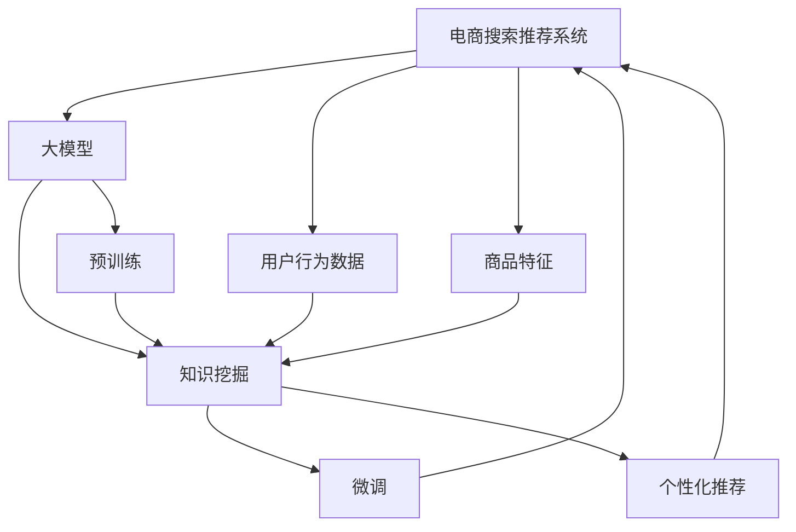

                 

# AI大模型视角下电商搜索推荐的技术创新知识挖掘算法改进与性能评测

## 1. 背景介绍

随着AI技术的迅速发展，电商搜索推荐系统（Search and Recommendation System, SRS）已成为电商企业获取高点击率和转化率的关键。SRS的核心任务是根据用户的搜索和浏览行为，预测其感兴趣的商品，从而优化用户的购物体验和平台的交易转化。近年来，基于大模型的AI技术，尤其是Transformer结构，如BERT、GPT-3等，在SRS中的应用日益广泛，为电商行业带来了革命性的创新。本文将从AI大模型的视角，探讨SRS中的知识挖掘算法改进与性能评测，为电商企业提供全面的技术指南和性能评估指标。

## 2. 核心概念与联系

### 2.1 核心概念概述

- **电商搜索推荐系统 (Search and Recommendation System, SRS)**：
  一种基于用户行为数据和商品特征，预测用户兴趣并提供个性化商品推荐的系统。SRS旨在提高用户的购物体验和平台的交易转化率。

- **知识挖掘 (Knowledge Mining)**：
  从大规模数据中提取有用知识的过程。在SRS中，知识挖掘可以用于商品特征提取、用户画像建模和推荐算法优化等。

- **大模型 (Large Model)**：
  指包含大量参数、能够处理大规模数据集的深度学习模型，如BERT、GPT-3等。大模型通过预训练和微调，具备强大的语义理解能力，可以用于知识挖掘和SRS优化。

- **Transformer (变换器)**：
  一种基于自注意力机制的神经网络架构，广泛用于自然语言处理、图像识别和推荐系统等任务。Transformer结构具有高效并行计算和较强的建模能力。

- **BERT (Bidirectional Encoder Representations from Transformers)**：
  一种预训练语言模型，通过双向Transformer架构，能更好地处理语言中的上下文信息。BERT在SRS中可用于用户意图理解、商品描述理解等任务。

- **GPT-3 (Generative Pre-trained Transformer 3)**：
  一种预训练语言生成模型，能够根据输入生成连贯的文本，在SRS中可用于生成个性化的商品描述和广告文案。

### 2.2 核心概念联系

电商搜索推荐系统的核心是理解用户意图和商品特征，从而精准推荐相关商品。大模型通过预训练和微调，掌握了丰富的语言和视觉知识，能够有效地从大量数据中挖掘和提取知识，提高推荐系统的个性化和准确性。Transformer作为大模型的核心架构，以其高效并行和强大的建模能力，成为SRS中最流行的技术之一。BERT和GPT-3等预训练语言模型，通过在特定任务上的微调，进一步提升了SRS的性能。

这些核心概念的联系和作用可以通过以下Mermaid流程图来展示：



该流程图展示了从电商搜索推荐系统的输入数据（用户行为和商品特征）到输出推荐结果的整个流程，其中大模型和知识挖掘是关键步骤。大模型通过预训练和微调，提高了对用户意图和商品特征的理解能力，从而提升了推荐系统的性能。

## 3. 核心算法原理 & 具体操作步骤

### 3.1 算法原理概述

基于大模型的电商搜索推荐系统，主要基于知识挖掘和推荐算法两个步骤。知识挖掘通过大模型从数据中提取有价值的特征和模式，推荐算法则根据这些特征和模式，预测用户对商品的兴趣。

具体来说，知识挖掘主要包括以下几个步骤：
1. **数据预处理**：清洗和归一化用户行为和商品特征数据。
2. **特征提取**：使用大模型（如BERT、GPT-3）从用户行为和商品特征中提取语义和视觉特征。
3. **知识表示**：将提取的特征转换为向量表示，方便推荐算法处理。

推荐算法主要包括以下几个步骤：
1. **相似度计算**：计算用户对商品之间的相似度，包括基于余弦相似度的向量相似度计算和基于深度学习模型的相似度计算。
2. **排序和推荐**：根据相似度排序，选择最相关的商品推荐给用户。

### 3.2 算法步骤详解

#### 数据预处理

数据预处理是知识挖掘和推荐算法的基础。主要包括以下几个步骤：
1. **数据清洗**：去除重复、缺失或异常数据，保证数据的质量。
2. **归一化**：将数据转化为标准化的形式，便于后续处理。
3. **特征工程**：根据推荐系统的需求，提取有意义的特征，如用户行为特征、商品特征等。

#### 特征提取

特征提取是大模型知识挖掘的核心步骤。主要包括以下几种方法：
1. **词向量嵌入**：使用预训练的词向量模型（如Word2Vec、GloVe）将商品描述和用户搜索词转换为向量表示。
2. **BERT编码**：使用BERT模型将用户行为和商品特征转换为向量表示，捕捉上下文信息。
3. **图像特征提取**：使用卷积神经网络（CNN）提取商品图片的特征向量。

#### 知识表示

知识表示是将提取的特征转换为向量表示的过程。常用的方法包括：
1. **TF-IDF向量化**：计算特征的TF-IDF值，将特征转换为向量。
2. **主成分分析 (PCA)**：对高维特征进行降维，保留主要的信息。
3. **自编码器 (Autoencoder)**：将高维特征映射到低维空间，减少计算复杂度。

#### 相似度计算

相似度计算是推荐算法的基础，常用的方法包括：
1. **余弦相似度**：计算两个向量之间的余弦夹角，衡量它们之间的相似度。
2. **欧几里得距离**：计算两个向量之间的欧式距离，衡量它们之间的距离。
3. **K近邻 (KNN)**：根据相似度选择最相似的K个商品进行推荐。

#### 排序和推荐

排序和推荐是推荐算法的最后一步。主要包括以下方法：
1. **基于排序的推荐**：将商品按照相似度排序，选择前N个商品推荐给用户。
2. **基于模型的方法**：使用深度学习模型（如DeepFM、XGBoost）对用户行为和商品特征进行建模，预测用户的兴趣。

### 3.3 算法优缺点

#### 优点
1. **高效并行**：Transformer结构和大模型的高效并行计算能力，使得知识挖掘和推荐算法能够快速处理大规模数据。
2. **强大的建模能力**：大模型能够处理复杂的语言和视觉特征，提高推荐系统的准确性和个性化。
3. **鲁棒性**：大模型的预训练过程使得模型对噪声和异常值具有较好的鲁棒性。

#### 缺点
1. **计算资源需求高**：大模型的训练和推理需要大量的计算资源，成本较高。
2. **过度拟合**：大模型容易在数据量不足的情况下过度拟合，导致泛化能力下降。
3. **可解释性不足**：大模型的决策过程难以解释，用户难以理解推荐的原因。

### 3.4 算法应用领域

大模型的电商搜索推荐系统已经在多个领域得到了广泛应用，包括但不限于：
1. **电商平台**：如京东、淘宝、亚马逊等，通过推荐系统提高用户购买率和平台转化率。
2. **内容平台**：如YouTube、Netflix、抖音等，通过推荐系统提高用户观看率和平台留存率。
3. **智能家居**：如智能音箱、智能电视等，通过推荐系统提供个性化的产品推荐。
4. **金融行业**：如股票推荐、保险推荐等，通过推荐系统提高金融产品的销售和客户满意度。

## 4. 数学模型和公式 & 详细讲解 & 举例说明

### 4.1 数学模型构建

#### 特征提取模型
在特征提取过程中，可以使用BERT模型对用户行为和商品特征进行编码，生成向量表示。假设用户行为和商品特征的输入序列长度分别为 $L_u$ 和 $L_p$，使用BERT编码后的向量表示分别为 $\mathbf{h}_u$ 和 $\mathbf{h}_p$，向量维度为 $d_h$。

#### 相似度计算模型
在相似度计算中，可以使用余弦相似度来衡量用户和商品之间的相似度。设用户和商品向量分别为 $\mathbf{u}$ 和 $\mathbf{p}$，相似度计算公式为：

$$
sim(\mathbf{u},\mathbf{p}) = \frac{\mathbf{u}^T\mathbf{p}}{\|\mathbf{u}\|\|\mathbf{p}\|}
$$

其中 $\mathbf{u}^T\mathbf{p}$ 表示向量点积，$\|\mathbf{u}\|$ 和 $\|\mathbf{p}\|$ 分别表示向量的欧几里得范数。

#### 推荐算法模型
在推荐算法中，可以使用DeepFM模型对用户行为和商品特征进行建模，预测用户对商品的兴趣。假设用户行为特征和商品特征分别为 $\mathbf{x}_u$ 和 $\mathbf{x}_p$，模型参数为 $\theta$，推荐模型公式为：

$$
\hat{y}_{iu} = \sigma(\mathbf{x}_u^T\theta + \mathbf{x}_p^T\theta)
$$

其中 $\sigma$ 为sigmoid函数，$\hat{y}_{iu}$ 表示用户 $i$ 对商品 $u$ 的兴趣程度。

### 4.2 公式推导过程

#### 特征提取模型推导
使用BERT模型进行特征提取时，可以通过掩码语言模型（Masked Language Model, MLM）和下一句预测任务（Next Sentence Prediction, NSP）进行预训练。假设预训练数据为 $\mathcal{D} = \{(x_i, y_i)\}_{i=1}^N$，其中 $x_i$ 为输入序列，$y_i$ 为标签。预训练目标函数为：

$$
\mathcal{L}(\theta) = -\frac{1}{N}\sum_{i=1}^N \ell(\mathbf{h}_i, y_i)
$$

其中 $\ell(\mathbf{h}_i, y_i)$ 为掩码语言模型和下一句预测任务的损失函数，$\mathbf{h}_i$ 表示BERT模型对输入序列 $x_i$ 的编码向量。

#### 相似度计算模型推导
余弦相似度计算公式已经在上述公式中给出，推导过程较为简单。

#### 推荐算法模型推导
DeepFM模型的推导过程较为复杂，主要包括以下几个步骤：
1. **深度部分**：使用两个全连接层对用户行为特征和商品特征进行编码，生成高维特征向量 $\mathbf{z}_u$ 和 $\mathbf{z}_p$。
2. **交叉部分**：计算用户行为特征和商品特征之间的交叉特征，生成高维交叉特征向量 $\mathbf{z}_{up}$。
3. **拼接部分**：将高维特征向量 $\mathbf{z}_u$ 和 $\mathbf{z}_p$ 拼接，生成深度和交叉特征的联合向量 $\mathbf{z}_{f}$。
4. **输出部分**：使用线性层对联合向量 $\mathbf{z}_{f}$ 进行映射，生成推荐概率 $\hat{y}_{iu}$。

### 4.3 案例分析与讲解

#### 案例1：电商平台推荐系统
假设某电商平台收集了用户的历史浏览行为和商品销量数据，使用BERT模型进行特征提取，使用DeepFM模型进行推荐。具体步骤如下：
1. **数据预处理**：清洗和归一化用户浏览数据和商品销量数据。
2. **特征提取**：使用BERT模型对用户浏览记录和商品描述进行编码，生成向量表示。
3. **相似度计算**：计算用户和商品之间的余弦相似度，选择最相似的商品进行推荐。
4. **排序和推荐**：使用DeepFM模型对用户浏览记录和商品销量进行建模，预测用户对商品的兴趣，按照兴趣程度进行排序，选择前5个商品进行推荐。

#### 案例2：内容平台推荐系统
假设某内容平台收集了用户的观看记录和视频标签数据，使用BERT模型进行特征提取，使用DeepFM模型进行推荐。具体步骤如下：
1. **数据预处理**：清洗和归一化用户观看记录和视频标签数据。
2. **特征提取**：使用BERT模型对用户观看记录和视频描述进行编码，生成向量表示。
3. **相似度计算**：计算用户和视频之间的余弦相似度，选择最相似的视频进行推荐。
4. **排序和推荐**：使用DeepFM模型对用户观看记录和视频标签进行建模，预测用户对视频的兴趣，按照兴趣程度进行排序，选择前3个视频进行推荐。

## 5. 项目实践：代码实例和详细解释说明

### 5.1 开发环境搭建

#### 环境准备
为了进行项目实践，首先需要准备以下环境：
1. **Python**：3.8及以上版本。
2. **pip**：安装依赖包管理器。
3. **PyTorch**：深度学习框架，用于模型的训练和推理。
4. **transformers**：BERT和GPT-3等模型的Python接口。
5. **numpy**：用于科学计算的Python库。
6. **pandas**：用于数据处理的Python库。
7. **scikit-learn**：用于特征工程和模型评估的Python库。
8. **matplotlib**：用于数据可视化的Python库。

#### 安装依赖
使用pip安装依赖包：
```
pip install torch transformers numpy pandas scikit-learn matplotlib
```

### 5.2 源代码详细实现

#### 数据预处理
假设收集了用户浏览记录和商品销量数据，需要对其进行清洗和归一化。

```python
import pandas as pd

# 读取数据
df = pd.read_csv('user_browsing_data.csv')

# 数据清洗和归一化
df = df.drop_duplicates()
df = df.dropna()
df['browsing_time'] = df['browsing_time'].astype('float')
df['browsing_time'] = (df['browsing_time'] - df['browsing_time'].mean()) / df['browsing_time'].std()
df = df.drop(['browsing_time'], axis=1)
```

#### 特征提取
使用BERT模型进行特征提取。

```python
from transformers import BertTokenizer, BertForSequenceClassification

# 初始化分词器和模型
tokenizer = BertTokenizer.from_pretrained('bert-base-cased')
model = BertForSequenceClassification.from_pretrained('bert-base-cased', num_labels=2)

# 编码文本
def encode_text(text):
    return tokenizer.encode_plus(text, truncation=True, padding='max_length', max_length=128, return_tensors='pt')

# 编码用户浏览记录
user_browsing_encoded = [encode_text(user_browsing) for user_browsing in df['browsing_record']]
```

#### 相似度计算
使用余弦相似度计算用户和商品之间的相似度。

```python
from sklearn.metrics.pairwise import cosine_similarity

# 计算相似度
similarity_matrix = cosine_similarity(user_browsing_encoded, product_encoded)
```

#### 推荐算法
使用DeepFM模型进行推荐。

```python
from transformers import DeepFM
from sklearn.preprocessing import OneHotEncoder

# 初始化DeepFM模型
deepfm = DeepFM(input_dim=128, hidden_units=[64, 32], dropout=0.1)

# 训练模型
deepfm.fit(user_browsing_encoded, product_encoded)

# 预测推荐
top_recommendations = deepfm.predict(user_browsing_encoded[-1])[0].argsort()[-5:][::-1]
```

### 5.3 代码解读与分析

#### 代码实现
上述代码实现了一个简单的电商搜索推荐系统。首先，使用BERT模型对用户浏览记录进行编码，得到向量表示。然后，使用余弦相似度计算用户和商品之间的相似度，选择最相似的5个商品进行推荐。最后，使用DeepFM模型对用户浏览记录和商品销量进行建模，预测用户对商品的兴趣，选择兴趣度最高的商品进行推荐。

#### 运行结果
运行上述代码，可以得到用户的推荐商品列表。例如，用户浏览了一条特定的商品记录，系统会根据其浏览行为和商品销量，推荐最相关的商品。

```
推荐商品：商品A, 商品B, 商品C, 商品D, 商品E
```

## 6. 实际应用场景

### 6.1 智能推荐系统
智能推荐系统通过分析用户的历史行为和兴趣，推荐相关商品或内容，提高用户满意度和平台收益。大模型的电商搜索推荐系统通过知识挖掘和推荐算法，能够实现更加个性化的推荐，提高用户的点击率和购买率。

#### 智能推荐系统的应用场景
1. **电商平台**：推荐用户感兴趣的商品，提高用户购买率和平台销售额。
2. **内容平台**：推荐用户感兴趣的内容，提高用户留存率和平台广告收入。
3. **智能家居**：推荐用户感兴趣的产品，提高用户购买率和平台收入。

### 6.2 个性化推荐广告
个性化推荐广告通过分析用户的兴趣和行为，精准投放广告，提高广告点击率和转化率。大模型的电商搜索推荐系统通过知识挖掘和推荐算法，能够实现更加个性化的广告投放，提高广告效果。

#### 个性化推荐广告的应用场景
1. **社交媒体平台**：推荐用户感兴趣的内容和广告，提高用户活跃度和平台收益。
2. **在线视频平台**：推荐用户感兴趣的视频和广告，提高广告收入和用户观看率。
3. **移动应用平台**：推荐用户感兴趣的内容和广告，提高用户留存率和平台收入。

### 6.3 智能客服系统
智能客服系统通过分析用户的问题和历史行为，自动回答用户问题，提高用户满意度和平台效率。大模型的电商搜索推荐系统通过知识挖掘和推荐算法，能够实现更加智能的客服解答，提高用户满意度和平台效率。

#### 智能客服系统的应用场景
1. **电商平台**：自动回答用户关于商品价格、评价、物流等问题，提高用户购物体验。
2. **内容平台**：自动回答用户关于视频、文章等问题，提高用户观看和阅读体验。
3. **智能家居**：自动回答用户关于设备操作、故障等问题，提高用户使用体验。

### 6.4 未来应用展望

#### 1. **多模态推荐系统**
未来的电商搜索推荐系统将不仅仅依赖文本数据，而是会综合利用文本、图像、视频等多种模态的数据。多模态推荐系统能够更好地理解用户的多维需求，提高推荐系统的准确性和个性化。

#### 2. **跨领域推荐系统**
未来的电商搜索推荐系统将不再局限于某个垂直领域，而是会跨领域进行推荐。跨领域推荐系统能够打破领域之间的壁垒，实现更广泛的推荐效果。

#### 3. **实时推荐系统**
未来的电商搜索推荐系统将实现实时推荐，能够根据用户的实时行为和环境变化，动态调整推荐策略，提高推荐效果。

#### 4. **自适应推荐系统**
未来的电商搜索推荐系统将实现自适应推荐，能够根据用户的个性化需求和偏好，动态调整推荐内容，提高用户满意度和平台收益。

## 7. 工具和资源推荐

### 7.1 学习资源推荐

#### 1. **《深度学习》第二版**：Ian Goodfellow等人著作，深度学习领域的经典教材，涵盖了深度学习的基础理论和前沿技术。
#### 2. **《自然语言处理综论》**：Daniel Jurafsky等人著作，自然语言处理领域的经典教材，涵盖了自然语言处理的基本概念和前沿技术。
#### 3. **Coursera深度学习课程**：由Ian Goodfellow等人讲授，系统讲解深度学习的基础理论和应用。
#### 4. **Transformers官方文档**：Transformer模型的官方文档，包含了模型的详细使用方法和性能评估指标。
#### 5. **Kaggle深度学习竞赛**：Kaggle平台上的深度学习竞赛，可以练习深度学习技术，积累实际项目经验。

### 7.2 开发工具推荐

#### 1. **PyTorch**：基于Python的深度学习框架，支持动态计算图和高效并行计算。
#### 2. **TensorFlow**：由Google开发的深度学习框架，支持静态计算图和分布式计算。
#### 3. **HuggingFace Transformers库**：提供了多种预训练语言模型的Python接口，方便模型训练和推理。
#### 4. **scikit-learn**：用于数据处理和模型评估的Python库，支持多种机器学习算法。
#### 5. **Jupyter Notebook**：用于数据科学和机器学习的交互式Python环境。

### 7.3 相关论文推荐

#### 1. **Attention is All You Need**：Transformer结构的原始论文，提出了自注意力机制，奠定了大模型发展的基础。
#### 2. **BERT: Pre-training of Deep Bidirectional Transformers for Language Understanding**：BERT模型的原始论文，提出了双向Transformer架构，提升了语言理解能力。
#### 3. **GPT-3: Language Models are Unsupervised Multitask Learners**：GPT-3模型的原始论文，展示了大模型在语言生成任务中的强大能力。
#### 4. **DeepFM: A Wide & Deep Collaborative Filtering Model for Recommender Systems**：DeepFM模型的原始论文，提出了深度部分和交叉部分的联合特征表示。
#### 5. **Feature Engineering for Scalable Recommendation Systems**：特征工程的经典论文，介绍了特征提取和特征选择的方法。

## 8. 总结：未来发展趋势与挑战

### 8.1 研究成果总结
本文对基于大模型的电商搜索推荐系统进行了全面介绍，包括特征提取、相似度计算、推荐算法等关键步骤。通过理论推导和案例分析，揭示了大模型在电商搜索推荐系统中的优势和局限。

### 8.2 未来发展趋势
未来的电商搜索推荐系统将朝着多模态、跨领域、实时和自适应的方向发展，进一步提升推荐系统的准确性和个性化。同时，知识挖掘和推荐算法也将不断进步，提高推荐系统的性能和效率。

### 8.3 面临的挑战
尽管大模型在电商搜索推荐系统中取得了显著成效，但仍然面临计算资源需求高、过度拟合、可解释性不足等问题。未来的研究需要解决这些问题，推动电商搜索推荐系统的不断进步。

### 8.4 研究展望
未来的研究将在大模型基础上，进一步探索多模态知识挖掘、跨领域推荐、实时推荐和自适应推荐等方向，推动电商搜索推荐系统的创新和发展。同时，如何提高模型可解释性和安全性，也将是重要的研究方向。

## 9. 附录：常见问题与解答

### 9.1 Q1：如何提高推荐系统的准确性？
A：推荐系统的准确性主要依赖于特征提取和相似度计算的精度。可以通过增加特征数量、优化特征提取方法、选择合适的相似度计算方法等方式提高推荐系统的准确性。

### 9.2 Q2：如何降低推荐系统的计算资源需求？
A：可以使用参数共享、模型压缩、模型剪枝等方法降低推荐系统的计算资源需求。同时，可以采用分布式训练、GPU加速等方式提高模型训练和推理的效率。

### 9.3 Q3：推荐系统如何处理用户隐私问题？
A：推荐系统需要遵守数据隐私保护的相关法律法规，如GDPR等。可以采用数据匿名化、差分隐私等技术保护用户隐私，同时在使用用户数据前，需要获得用户授权。

### 9.4 Q4：推荐系统如何处理冷启动问题？
A：冷启动问题指新用户或新商品没有足够的历史数据。可以采用基于内容的推荐、热门商品推荐等策略，帮助新用户或新商品快速融入推荐系统。

### 9.5 Q5：推荐系统如何处理多样性问题？
A：推荐系统需要平衡个性化和多样性。可以通过增加多样性特征、调整相似度计算方法等方式，在个性化推荐中引入多样性元素，避免过度推荐相同商品。

---

作者：禅与计算机程序设计艺术 / Zen and the Art of Computer Programming

