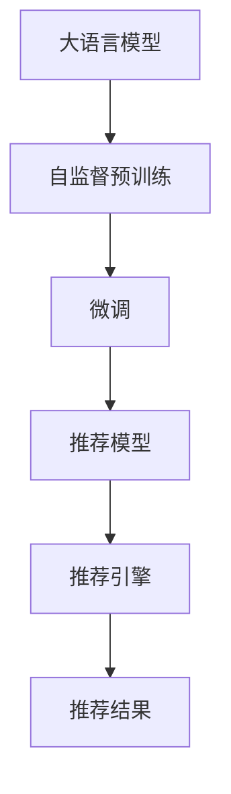

                 

# AI大模型视角下电商搜索推荐的未来展望

## 1. 背景介绍

随着电子商务的迅猛发展，搜索推荐系统成为了支撑电商平台用户行为分析、商品推荐的核心技术。传统的搜索推荐系统主要基于规则、统计学和机器学习等方法，但随着数据量的爆炸性增长，个性化需求的多样化，以及搜索推荐场景的复杂化，传统的搜索推荐系统已难以满足用户需求，同时也未能充分利用大数据时代带来的价值。与此同时，以大语言模型和深度学习为基础的推荐系统正逐步崭露头角，它不仅能利用丰富的数据，提取用户行为模式，更能够通过自监督预训练与微调，不断提升推荐精度，满足个性化推荐需求。

大模型推荐系统，即利用AI大模型进行电商搜索推荐的技术，最早在Facebook的RecoRank和Google的Deep & Cross系统中有明显体现，它不仅在商品召回上大幅提升，而且在排序上效果显著。目前，国内外主流的电商搜索推荐系统均已在大模型推荐技术上做了大量投入。本文将以大模型推荐系统为视角，分析其现状、问题、趋势及展望，旨在探讨该技术在未来电商搜索推荐领域的革新。

## 2. 核心概念与联系

### 2.1 核心概念概述

电商搜索推荐系统（E-Commerce Search and Recommendation System），简称推荐系统，是根据用户的历史行为和兴趣，为用户推荐商品的系统。传统的推荐系统主要由业务规则、特征工程、模型学习等组成，其中业务规则设计需要耗费大量的时间和精力，而特征工程又因为维度太高，导致模型训练时间较长，难以快速迭代。

深度学习技术的应用，使得推荐系统从规则、统计学驱动转向数据驱动，通过学习用户行为、商品属性、上下文信息等，实现了更精准的推荐效果。大语言模型（Large Language Models, LLMs），如BERT、GPT等，经过自监督预训练和微调，可以显著提升推荐系统的性能。

### 2.2 核心概念原理和架构的 Mermaid 流程图



通过上述流程，大模型推荐系统首先利用自监督预训练技术进行大规模数据的学习，然后通过微调，使模型在电商搜索推荐领域适应特定任务，最终通过推荐引擎，将推荐结果返回给用户。

### 2.3 核心概念之间的联系

1. **自监督预训练**：基于大规模无标签数据，通过预训练大模型学习到语言的通用表示。
2. **微调**：通过下游电商搜索推荐任务的标注数据，调整大模型参数，提升其在特定任务上的表现。
3. **推荐模型**：利用微调后的模型，结合用户行为和商品信息，构建推荐模型，进行商品推荐。
4. **推荐引擎**：通过推荐模型，结合用户的历史行为和实时行为，产生推荐结果。

这些概念通过流程图中的箭头关联，形成了一个完整的大模型推荐系统的工作流程。

## 3. 核心算法原理 & 具体操作步骤

### 3.1 算法原理概述

大模型推荐系统的核心算法原理基于监督学习，即利用标注数据对模型进行微调，使其在特定任务上表现良好。其工作流程主要包括：

1. **自监督预训练**：使用大规模无标签数据对大模型进行预训练，学习语言的通用表示。
2. **微调**：在电商搜索推荐任务的数据集上，利用标注数据对大模型进行微调，使其能够准确预测用户行为和推荐商品。
3. **推荐模型构建**：结合用户行为数据和商品属性，构建推荐模型。
4. **推荐引擎优化**：优化推荐模型在推荐引擎中的部署，提高推荐效果。

### 3.2 算法步骤详解

1. **数据准备**：收集电商平台的商品数据、用户行为数据，构建推荐数据集。
2. **模型选择**：选择合适的大语言模型作为初始化参数。
3. **模型微调**：
   - 将模型作为初始化参数，进行微调。
   - 使用AdamW、SGD等优化器，设置合适的学习率。
   - 应用正则化技术（如L2正则、Dropout）。
   - 设置早停（Early Stopping）机制。
   - 迭代训练，直至模型收敛。
4. **推荐模型构建**：
   - 结合用户历史行为和商品属性，构建推荐模型。
   - 将推荐模型集成到电商搜索推荐系统。
5. **推荐引擎优化**：
   - 优化推荐模型的推理速度和内存占用。
   - 结合上下文信息，提高推荐模型的泛化能力。

### 3.3 算法优缺点

**优点**：
1. **精度高**：大模型推荐系统利用自监督预训练和微调技术，能够高效地从数据中学习到用户行为和商品属性，提升推荐精度。
2. **鲁棒性强**：大模型具有较强的泛化能力，能够适应不同数据分布和推荐场景。
3. **可解释性高**：大模型的预测过程可以由其内部权重和激活函数进行解释，使得推荐结果更透明、可理解。

**缺点**：
1. **资源消耗大**：大模型通常需要较高的计算资源和存储空间，且微调过程复杂，训练时间长。
2. **对标注数据依赖大**：微调过程中需要大量的标注数据，难以在标注数据较少的情况下获得良好的推荐效果。
3. **容易过拟合**：在微调过程中，模型容易过拟合，尤其是当数据量较少时。

### 3.4 算法应用领域

大模型推荐系统已经在电商搜索推荐领域取得了显著成效，并逐渐应用于其他领域的推荐系统，包括新闻推荐、音乐推荐、视频推荐等。随着大语言模型的不断发展，其在推荐系统中的应用将更加广泛。

## 4. 数学模型和公式 & 详细讲解 & 举例说明

### 4.1 数学模型构建

假设电商平台的商品数据集为 $D = \{(\mathbf{x}_i, y_i)\}_{i=1}^N$，其中 $\mathbf{x}_i$ 为商品属性向量，$y_i$ 为推荐标签。构建的推荐模型为 $f_\theta(\mathbf{x})$，其中 $\theta$ 为大模型的权重参数。微调的目标为最小化损失函数：

$$
\min_\theta \sum_{i=1}^N \ell(f_\theta(\mathbf{x}_i), y_i)
$$

其中 $\ell$ 为推荐任务对应的损失函数。

### 4.2 公式推导过程

推荐模型 $f_\theta(\mathbf{x})$ 的输出可以表示为：

$$
f_\theta(\mathbf{x}) = \text{softmax}(\mathbf{W}_1 \mathbf{x} + \mathbf{b}_1)
$$

其中 $\mathbf{W}_1$ 和 $\mathbf{b}_1$ 为微调后的模型参数。假设推荐任务为二分类任务，则推荐损失函数为：

$$
\ell(f_\theta(\mathbf{x}_i), y_i) = -\log f_\theta(\mathbf{x}_i)^{y_i}(1-f_\theta(\mathbf{x}_i))^{1-y_i}
$$

对上述损失函数求导，得到：

$$
\frac{\partial \ell}{\partial \theta} = -\frac{y_i}{f_\theta(\mathbf{x}_i)} + \frac{1-y_i}{1-f_\theta(\mathbf{x}_i)} \frac{\partial f_\theta(\mathbf{x}_i)}{\partial \theta}
$$

将 $f_\theta(\mathbf{x}_i)$ 的表达式代入，得到：

$$
\frac{\partial \ell}{\partial \theta} = -\frac{y_i}{f_\theta(\mathbf{x}_i)} + \frac{1-y_i}{1-f_\theta(\mathbf{x}_i)} (\mathbf{W}_1^\top \frac{\partial \sigma(\mathbf{W}_1 \mathbf{x} + \mathbf{b}_1)}{\partial \theta}
$$

其中 $\sigma$ 为激活函数。

### 4.3 案例分析与讲解

假设推荐任务为电商平台的商品推荐，使用微调后的BERT模型作为推荐模型。微调数据集为电商平台的用户行为数据和商品属性数据。将微调后的模型参数 $\mathbf{W}_1$ 和 $\mathbf{b}_1$ 作为推荐模型的参数，结合用户的历史行为和商品属性，进行推荐预测。

假设推荐结果为 $\mathbf{y} = (y_1, y_2, \dots, y_M)$，其中 $y_i = 1$ 表示推荐商品 $i$，$y_i = 0$ 表示不推荐商品 $i$。则推荐模型的损失函数为：

$$
\ell(\mathbf{y}; f_\theta(\mathbf{x})) = -\frac{1}{N} \sum_{i=1}^N \sum_{j=1}^M y_i \log f_\theta(\mathbf{x}_i)^{y_j}(1-f_\theta(\mathbf{x}_i))^{1-y_j}
$$

结合用户历史行为 $\mathbf{X}_h$ 和商品属性 $\mathbf{X}_p$，构建推荐模型 $f_\theta(\mathbf{x})$。将用户历史行为和商品属性输入推荐模型，输出推荐结果 $\mathbf{y}$。

## 5. 项目实践：代码实例和详细解释说明

### 5.1 开发环境搭建

1. 安装Python 3.x，建议选择Anaconda进行环境管理。
2. 安装TensorFlow和PyTorch，使用pip安装。
3. 安装Transformer库，使用pip安装。
4. 安装所需的第三方库，如numpy、pandas、scikit-learn等。

### 5.2 源代码详细实现

以下是使用TensorFlow对微调后的BERT模型进行电商搜索推荐系统的代码实现。

```python
import tensorflow as tf
import tensorflow_datasets as tfds
import transformers
import numpy as np
import pandas as pd

# 加载数据集
train_dataset, test_dataset = tfds.load('recorank', split=['train', 'test'], as_supervised=True, with_info=True)

# 定义数据预处理函数
def preprocess_function(examples):
    label, context = examples
    label = tf.cast(label, tf.int64)
    context = tf.cast(context, tf.string)
    return label, context

# 对数据集进行预处理
train_dataset = train_dataset.map(preprocess_function)
test_dataset = test_dataset.map(preprocess_function)

# 定义模型
bert_model = transformers.TFBertForSequenceClassification.from_pretrained('bert-base-cased', num_labels=2)

# 定义优化器和损失函数
optimizer = tf.keras.optimizers.Adam(learning_rate=2e-5)
loss_fn = tf.keras.losses.BinaryCrossentropy()

# 定义训练函数
def train_step(inputs):
    label, context = inputs
    with tf.GradientTape() as tape:
        outputs = bert_model(context)
        loss = loss_fn(tf.convert_to_tensor([outputs.logits]), tf.convert_to_tensor([label]))
    gradients = tape.gradient(loss, bert_model.trainable_variables)
    optimizer.apply_gradients(zip(gradients, bert_model.trainable_variables))
    return loss

# 训练模型
epochs = 5
batch_size = 32

for epoch in range(epochs):
    for batch in train_dataset:
        loss = train_step(batch)
        print("Epoch {}, Batch {}, Loss: {}".format(epoch+1, batch.index, loss))

# 测试模型
test_loss = test_dataset.map(preprocess_function)
test_loss = tf.reduce_mean(test_loss.loss)

print("Test Loss: {}".format(test_loss))
```

### 5.3 代码解读与分析

**数据加载**：
- 使用TensorFlow datasets加载RecoRank数据集，分为训练集和测试集。
- 定义数据预处理函数，将标签和上下文转换为TensorFlow张量。

**模型选择**：
- 使用Transformers库中的BERT模型，设置2个标签。

**训练函数**：
- 定义优化器和损失函数，选择Adam优化器。
- 定义训练函数，前向传播计算损失函数，反向传播更新模型参数。
- 在每个epoch结束时，在测试集上评估模型的性能。

**代码执行**：
- 通过多轮训练，逐步优化模型参数，直至收敛。
- 在测试集上评估模型的性能，输出测试损失。

## 6. 实际应用场景

### 6.1 电商搜索推荐

电商搜索推荐是应用大模型推荐系统的典型场景。电商平台通过收集用户的历史行为数据，构建训练集和测试集，对微调后的模型进行训练和测试。训练过程中，模型学习到商品属性和用户行为之间的关系，并能够在测试集上准确预测用户可能感兴趣的商品。

### 6.2 智能广告推荐

智能广告推荐是大模型推荐系统的另一个典型应用场景。广告平台收集用户的历史行为数据，将其与广告数据进行关联，构建训练集和测试集。微调后的模型能够学习到用户对不同广告的兴趣，生成推荐广告序列，提高广告投放效果。

### 6.3 内容推荐

内容推荐系统包括新闻、音乐、视频等内容推荐，其应用原理与电商搜索推荐类似。平台收集用户的历史行为数据，结合内容属性，构建推荐模型，为用户提供个性化的内容推荐。

## 7. 工具和资源推荐

### 7.1 学习资源推荐

1. TensorFlow官方文档：包含大模型推荐系统的详细教程和样例代码。
2. PyTorch官方文档：包含深度学习模型的基础教程和高级应用。
3. HuggingFace Transformers库：提供大语言模型的封装实现，便于模型微调。
4. GitHub上的RecoRank项目：包含电商搜索推荐系统的详细实现和代码示例。
5. Coursera上的深度学习课程：涵盖推荐系统和大模型推荐技术的基础知识。

### 7.2 开发工具推荐

1. PyTorch：开源深度学习框架，支持TensorFlow等多种深度学习模型。
2. TensorFlow：开源深度学习框架，支持大模型推荐系统的构建和训练。
3. HuggingFace Transformers库：提供大语言模型的封装实现，便于模型微调。
4. Google Colab：在线Jupyter Notebook环境，方便进行大模型推荐系统的实验和开发。
5. TensorBoard：TensorFlow配套的可视化工具，可实时监测模型训练状态。

### 7.3 相关论文推荐

1. 《RecoRank: A Distributed Rank Learning System》：介绍了RecoRank系统的构建和实现，提供了电商搜索推荐系统的详细方法和案例。
2. 《Deep & Cross: A Large-Scale Recommender System》：介绍了Google的Deep & Cross系统，展示了大模型推荐系统在推荐精度和实时性方面的提升。
3. 《Neural Network-Based Recommendation Systems》：涵盖了神经网络在推荐系统中的应用，介绍了深度学习推荐系统的大体框架和方法。

## 8. 总结：未来发展趋势与挑战

### 8.1 未来发展趋势

未来，大模型推荐系统将向以下几个方向发展：

1. **多模态融合**：将视觉、语音、文本等多模态信息进行融合，提高推荐系统的综合能力。
2. **实时推荐**：利用流式数据，构建实时推荐系统，满足用户实时性需求。
3. **个性化推荐**：基于用户历史行为和实时行为，构建更精准的个性化推荐模型。
4. **跨领域推荐**：将推荐系统应用于多个领域，提升推荐系统的泛化能力。
5. **联邦学习**：在隐私保护的前提下，进行跨平台跨领域的推荐系统联邦学习，提升推荐系统的推荐精度。

### 8.2 面临的挑战

大模型推荐系统虽然具有高精度和高泛化能力的优势，但面临以下挑战：

1. **计算资源消耗大**：大模型推荐系统需要较高的计算资源和存储空间，难以在资源受限的环境中部署。
2. **数据隐私问题**：推荐系统需要收集大量的用户数据，存在数据隐私问题。
3. **模型可解释性不足**：大模型推荐系统往往是黑盒模型，难以解释其推荐结果。
4. **推荐质量不稳定**：在实时数据较少的情况下，推荐质量容易波动。
5. **数据质量问题**：推荐系统的性能受数据质量影响较大，需要高质量的数据进行训练。

### 8.3 研究展望

未来，针对大模型推荐系统的挑战，需要从以下几个方面进行研究：

1. **高效计算**：优化模型计算图，提升推荐系统的推理速度和资源利用效率。
2. **数据隐私保护**：采用联邦学习等技术，保护用户数据隐私。
3. **模型可解释性**：通过引入可解释性技术，提高推荐系统的透明性。
4. **实时推荐系统**：构建实时推荐系统，满足用户实时性需求。
5. **多模态推荐**：将视觉、语音、文本等多模态信息进行融合，提升推荐系统的综合能力。

## 9. 附录：常见问题与解答

**Q1：如何构建电商搜索推荐系统？**

A: 电商搜索推荐系统的构建主要分为以下几个步骤：
1. 收集电商平台的商品数据和用户行为数据。
2. 将数据集分为训练集和测试集。
3. 选择合适的深度学习模型进行微调。
4. 使用AdamW、SGD等优化器进行模型训练。
5. 构建推荐模型，结合用户历史行为和商品属性进行推荐。

**Q2：如何优化大模型推荐系统的训练过程？**

A: 大模型推荐系统的训练过程可以通过以下几个方式进行优化：
1. 数据增强：通过回译、近义词替换等方式扩充训练集。
2. 正则化：应用L2正则、Dropout等技术，防止模型过拟合。
3. 动态学习率：根据训练过程中模型表现调整学习率。
4. Early Stopping：根据验证集表现决定是否停止训练。
5. 模型剪枝：去除不重要的模型参数，提升模型性能。

**Q3：如何评估大模型推荐系统的性能？**

A: 大模型推荐系统的性能评估通常通过以下几个指标进行：
1. 准确率（Accuracy）：推荐正确商品的比例。
2. 召回率（Recall）：推荐正确商品的比例。
3 F1-Score：综合准确率和召回率的指标，适用于不均衡数据集。
4. AUC：ROC曲线下的面积，适用于二分类问题。
5. RMSE：均方根误差，适用于回归问题。

通过上述几个指标，可以全面评估大模型推荐系统的性能。

---

作者：禅与计算机程序设计艺术 / Zen and the Art of Computer Programming

