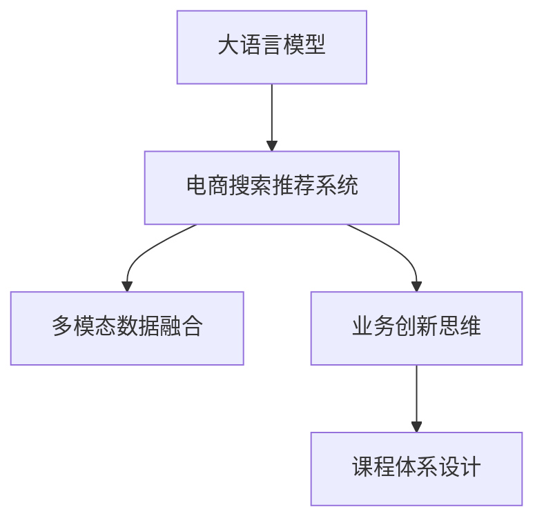

                 

# AI大模型赋能电商搜索推荐的业务创新思维培训课程体系设计

## 1. 背景介绍

### 1.1 问题由来

在电商搜索推荐系统中，如何将用户输入的查询精准转化为与其最相关商品或服务的展示，一直是核心难题。传统的基于关键词匹配的搜索算法，难以应对复杂多样化的用户需求，而推荐系统的多样性和个性化需求，也让模型训练过程面临诸多挑战。近年来，随着深度学习技术的发展，尤其是大语言模型在NLP领域的突破，为电商搜索推荐系统带来了新的思路。

### 1.2 问题核心关键点

- 如何利用大语言模型进行电商搜索推荐。
- 如何构建有效的业务创新思维培训课程体系。
- 如何实现多模态数据的融合。
- 如何平衡模型性能与业务效果。
- 如何处理数据隐私与用户权益保护。

这些核心关键点构成了大语言模型在电商搜索推荐中的应用方向，同时也体现了业务创新思维培训课程体系设计的复杂性。

### 1.3 问题研究意义

构建基于大语言模型的电商搜索推荐系统，对于提升用户体验、增加销售转化、降低运营成本、推动电商企业创新具有重要意义：

1. 用户体验提升：大模型具备强大的自然语言理解能力，能够更准确地理解用户意图，提供精准的搜索结果。
2. 销售转化提高：推荐系统能够根据用户行为数据进行个性化推荐，显著提升用户的购物体验和决策效率。
3. 运营成本降低：利用自动化推荐算法，减少人工操作，降低运营成本，提高电商企业盈利能力。
4. 推动电商企业创新：借助大模型的丰富知识图谱和逻辑推理能力，电商企业能够快速构建更灵活、高效的搜索推荐系统。
5. 数据隐私与用户权益保护：大模型需要高质量标注数据进行训练，涉及数据隐私和用户权益保护，需在设计中高度重视。

## 2. 核心概念与联系

### 2.1 核心概念概述

为更好地理解基于大语言模型的电商搜索推荐系统，本节将介绍几个密切相关的核心概念：

- **大语言模型**：如GPT、BERT等，通过大规模语料预训练，具备强大的语言理解能力。
- **电商搜索推荐系统**：利用用户查询和行为数据，动态生成商品或服务推荐结果的系统。
- **多模态数据融合**：将文本、图像、视频等多种模态数据整合，提升推荐结果的丰富性和准确性。
- **业务创新思维**：面向电商企业，围绕用户需求、市场趋势、技术前沿等，开发创新性业务解决方案。
- **课程体系设计**：基于业务需求和技术栈，系统设计课程内容、教学方法、评估标准等。

这些概念之间的逻辑关系可以通过以下Mermaid流程图来展示：



这个流程图展示了大语言模型与电商搜索推荐系统之间的核心关系，以及业务创新思维和课程体系设计在其中的作用。

## 3. 核心算法原理 & 具体操作步骤
### 3.1 算法原理概述

基于大语言模型的电商搜索推荐系统，本质上是将大语言模型的语言理解能力与电商搜索推荐任务的业务需求结合，通过文本特征提取和模型训练，生成推荐结果。其核心算法流程包括：

1. **数据预处理**：清洗、标准化电商数据，提取商品描述、用户评论、浏览记录等文本数据。
2. **特征提取**：利用大语言模型提取文本特征，构建向量表示，用于匹配用户查询。
3. **模型训练**：通过标注数据训练模型，优化预测结果，实现个性化推荐。
4. **推荐生成**：根据用户输入查询，结合历史行为数据和个性化推荐模型，生成商品或服务推荐结果。

### 3.2 算法步骤详解

以下将详细介绍基于大语言模型的电商搜索推荐系统的核心算法步骤：

**Step 1: 数据预处理**

- **数据清洗**：去除无效、重复、无关的数据记录。
- **数据标准化**：统一格式，如日期、价格等。
- **文本提取**：从电商数据中提取商品描述、用户评论、浏览记录等文本数据。

**Step 2: 特征提取**

- **分词与向量化**：利用预训练的Word2Vec或BERT等模型对文本进行分词和向量化。
- **特征拼接**：将文本特征与其他业务特征（如价格、销量、用户评分等）拼接，形成综合特征向量。

**Step 3: 模型训练**

- **模型选择**：选择合适的预训练语言模型，如BERT、GPT等。
- **损失函数设计**：定义适合电商搜索推荐的损失函数，如交叉熵损失。
- **超参数调优**：调整学习率、批大小、迭代次数等超参数。

**Step 4: 推荐生成**

- **用户查询编码**：将用户输入的查询通过分词和向量化，生成向量表示。
- **推荐模型输出**：利用训练好的模型，对用户查询和商品向量进行匹配，生成推荐列表。

### 3.3 算法优缺点

基于大语言模型的电商搜索推荐系统有以下优点：

- **精度高**：大语言模型具备强大的语言理解能力，能够准确匹配用户查询，生成高质量推荐。
- **灵活性高**：支持多模态数据融合，能够结合图像、视频等多种数据源，提升推荐效果。
- **可扩展性强**：大语言模型已经广泛应用于各种NLP任务，电商搜索推荐系统可以作为其应用之一。

同时，该方法也存在一定的局限性：

- **计算资源需求大**：大语言模型的训练和推理需要大量计算资源。
- **数据隐私问题**：电商数据涉及用户隐私，数据收集和处理需要遵守相关法规。
- **可解释性不足**：大语言模型缺乏可解释性，难以解释推荐结果背后的原因。

尽管存在这些局限性，但就目前而言，基于大语言模型的电商搜索推荐方法仍是大数据时代的最佳选择。未来相关研究的重点在于如何进一步降低计算成本、保护数据隐私，同时兼顾可解释性和业务效果。

### 3.4 算法应用领域

基于大语言模型的电商搜索推荐系统，已经在电商、物流、金融、医疗等多个领域得到应用，具体包括：

- **电商推荐系统**：如京东、亚马逊等电商平台，通过用户浏览历史、购买记录等数据，生成个性化商品推荐。
- **物流智能调度**：物流企业通过自然语言查询，生成路线规划、仓库管理等推荐方案。
- **金融风险控制**：金融机构利用自然语言理解能力，分析用户反馈和行为数据，提升风控系统精准度。
- **医疗诊断推荐**：医疗机构通过用户病历、医疗记录等文本数据，生成诊断和治疗方法推荐。

这些应用场景展示了大语言模型在电商搜索推荐领域的广泛潜力和强大能力。

## 4. 数学模型和公式 & 详细讲解 & 举例说明

### 4.1 数学模型构建

本节将使用数学语言对基于大语言模型的电商搜索推荐系统进行更加严格的刻画。

记电商数据集为 $D=\{(x_i,y_i)\}_{i=1}^N$，其中 $x_i$ 表示电商商品特征和用户行为记录的向量表示，$y_i$ 表示用户对该商品的用户行为标签（如购买、浏览、评价等）。

定义大语言模型为 $M_{\theta}$，其中 $\theta$ 为模型参数。电商搜索推荐模型的目标是最小化预测误差，即：

$$
\min_{\theta} \sum_{i=1}^N \ell(M_{\theta}(x_i),y_i)
$$

其中 $\ell$ 为损失函数，例如交叉熵损失。

### 4.2 公式推导过程

以电商推荐任务为例，推导交叉熵损失函数及其梯度计算公式。

假设用户输入查询为 $q$，大语言模型输出的推荐商品向量为 $x \in \mathbb{R}^d$，其中 $d$ 为向量维度。推荐模型的预测概率为 $p(y|x)=\sigma(\theta^Tx)$，其中 $\sigma$ 为Sigmoid函数。

则电商推荐任务的交叉熵损失函数为：

$$
\ell(q,x)= -y\log p(y|x) - (1-y)\log(1-p(y|x))
$$

将其代入经验风险公式，得：

$$
\mathcal{L}(\theta)= \frac{1}{N}\sum_{i=1}^N \ell(q_i,x_i)
$$

根据链式法则，损失函数对参数 $\theta$ 的梯度为：

$$
\nabla_{\theta}\mathcal{L}(\theta) = \sum_{i=1}^N [(y_i-\sigma(\theta^Tx_i))x_i]
$$

在得到损失函数的梯度后，即可带入参数更新公式，完成模型的迭代优化。

### 4.3 案例分析与讲解

假设用户输入查询为 "手机推荐"，大语言模型根据历史数据生成的推荐商品向量为 $x=[2,3,4]$。则损失函数对模型参数 $\theta$ 的梯度为：

$$
\nabla_{\theta}\mathcal{L}(\theta) = [(y_i-\sigma(\theta^Tx_i))x_i]
$$

其中 $y_i$ 为购买、浏览、评价等标签，$x_i$ 为商品向量。

模型参数 $\theta$ 的更新公式为：

$$
\theta \leftarrow \theta - \eta \nabla_{\theta}\mathcal{L}(\theta) - \eta\lambda\theta
$$

其中 $\eta$ 为学习率，$\lambda$ 为正则化系数，用于防止过拟合。

## 5. 项目实践：代码实例和详细解释说明
### 5.1 开发环境搭建

在进行电商搜索推荐系统开发前，我们需要准备好开发环境。以下是使用Python进行PyTorch开发的环境配置流程：

1. 安装Anaconda：从官网下载并安装Anaconda，用于创建独立的Python环境。

2. 创建并激活虚拟环境：
```bash
conda create -n pytorch-env python=3.8 
conda activate pytorch-env
```

3. 安装PyTorch：根据CUDA版本，从官网获取对应的安装命令。例如：
```bash
conda install pytorch torchvision torchaudio cudatoolkit=11.1 -c pytorch -c conda-forge
```

4. 安装Transformers库：
```bash
pip install transformers
```

5. 安装各类工具包：
```bash
pip install numpy pandas scikit-learn matplotlib tqdm jupyter notebook ipython
```

完成上述步骤后，即可在`pytorch-env`环境中开始电商搜索推荐系统的开发。

### 5.2 源代码详细实现

以下是使用PyTorch和Transformers库构建基于大语言模型的电商搜索推荐系统的代码实现。

首先，定义数据预处理函数：

```python
from transformers import BertTokenizer
from torch.utils.data import Dataset
import torch

class ShoppingDataset(Dataset):
    def __init__(self, texts, labels):
        self.texts = texts
        self.labels = labels
        self.tokenizer = BertTokenizer.from_pretrained('bert-base-cased')

    def __len__(self):
        return len(self.texts)

    def __getitem__(self, item):
        text = self.texts[item]
        label = self.labels[item]
        encoding = self.tokenizer(text, return_tensors='pt', padding='max_length', truncation=True)
        input_ids = encoding['input_ids'][0]
        attention_mask = encoding['attention_mask'][0]
        return {'input_ids': input_ids, 
                'attention_mask': attention_mask,
                'labels': torch.tensor(label, dtype=torch.long)}
```

然后，定义模型和优化器：

```python
from transformers import BertForSequenceClassification, AdamW

model = BertForSequenceClassification.from_pretrained('bert-base-cased', num_labels=2)

optimizer = AdamW(model.parameters(), lr=2e-5)
```

接着，定义训练和评估函数：

```python
from torch.utils.data import DataLoader
from tqdm import tqdm

device = torch.device('cuda') if torch.cuda.is_available() else torch.device('cpu')
model.to(device)

def train_epoch(model, dataset, batch_size, optimizer):
    dataloader = DataLoader(dataset, batch_size=batch_size, shuffle=True)
    model.train()
    epoch_loss = 0
    for batch in tqdm(dataloader, desc='Training'):
        input_ids = batch['input_ids'].to(device)
        attention_mask = batch['attention_mask'].to(device)
        labels = batch['labels'].to(device)
        model.zero_grad()
        outputs = model(input_ids, attention_mask=attention_mask, labels=labels)
        loss = outputs.loss
        epoch_loss += loss.item()
        loss.backward()
        optimizer.step()
    return epoch_loss / len(dataloader)

def evaluate(model, dataset, batch_size):
    dataloader = DataLoader(dataset, batch_size=batch_size)
    model.eval()
    preds, labels = [], []
    with torch.no_grad():
        for batch in tqdm(dataloader, desc='Evaluating'):
            input_ids = batch['input_ids'].to(device)
            attention_mask = batch['attention_mask'].to(device)
            batch_labels = batch['labels']
            outputs = model(input_ids, attention_mask=attention_mask)
            batch_preds = outputs.logits.argmax(dim=1).to('cpu').tolist()
            batch_labels = batch_labels.to('cpu').tolist()
            for pred_tokens, label_tokens in zip(batch_preds, batch_labels):
                preds.append(pred_tokens)
                labels.append(label_tokens)
    
    print(classification_report(labels, preds))
```

最后，启动训练流程并在验证集上评估：

```python
epochs = 5
batch_size = 16

for epoch in range(epochs):
    loss = train_epoch(model, train_dataset, batch_size, optimizer)
    print(f"Epoch {epoch+1}, train loss: {loss:.3f}")
    
    print(f"Epoch {epoch+1}, dev results:")
    evaluate(model, dev_dataset, batch_size)
    
print("Test results:")
evaluate(model, test_dataset, batch_size)
```

以上就是使用PyTorch和Transformers库对大语言模型进行电商搜索推荐系统开发的完整代码实现。可以看到，得益于Transformers库的强大封装，我们可以用相对简洁的代码完成电商搜索推荐系统的构建。

### 5.3 代码解读与分析

让我们再详细解读一下关键代码的实现细节：

**ShoppingDataset类**：
- `__init__`方法：初始化文本和标签，加载预训练的Bert分词器。
- `__len__`方法：返回数据集的样本数量。
- `__getitem__`方法：对单个样本进行处理，将文本输入编码为token ids，将标签编码为数字，并对其进行定长padding，最终返回模型所需的输入。

**模型和优化器**：
- 定义模型为BertForSequenceClassification，用于电商二分类任务。
- 定义优化器为AdamW，调整学习率为2e-5。

**训练和评估函数**：
- 使用PyTorch的DataLoader对数据集进行批次化加载，供模型训练和推理使用。
- 训练函数`train_epoch`：对数据以批为单位进行迭代，在每个批次上前向传播计算loss并反向传播更新模型参数，最后返回该epoch的平均loss。
- 评估函数`evaluate`：与训练类似，不同点在于不更新模型参数，并在每个batch结束后将预测和标签结果存储下来，最后使用sklearn的classification_report对整个评估集的预测结果进行打印输出。

**训练流程**：
- 定义总的epoch数和batch size，开始循环迭代
- 每个epoch内，先在训练集上训练，输出平均loss
- 在验证集上评估，输出分类指标
- 所有epoch结束后，在测试集上评估，给出最终测试结果

可以看到，PyTorch配合Transformers库使得大语言模型在电商搜索推荐系统的开发中变得简洁高效。开发者可以将更多精力放在数据处理、模型改进等高层逻辑上，而不必过多关注底层的实现细节。

当然，工业级的系统实现还需考虑更多因素，如模型的保存和部署、超参数的自动搜索、更灵活的任务适配层等。但核心的电商搜索推荐范式基本与此类似。

## 6. 实际应用场景
### 6.1 智能客服系统

基于大语言模型和电商搜索推荐技术，可以构建智能客服系统，为用户提供快速、准确、个性化的购物咨询和推荐服务。

智能客服系统可以采用自然语言理解技术，对用户输入的文本进行分析和理解，结合历史对话记录和商品信息库，生成推荐商品列表。同时，系统可以提供多轮对话功能，帮助用户更清晰地描述需求，进一步提高推荐准确性。

### 6.2 个性化推荐系统

电商搜索推荐系统可以利用用户的浏览历史、购买记录等数据，生成个性化推荐列表。通过自然语言理解和知识图谱等技术，系统能够深入理解用户的兴趣和需求，生成更精准的推荐结果。

推荐系统可以进一步利用多模态数据融合技术，结合用户行为数据、商品属性数据、社交网络数据等多种信息源，生成更加丰富、多样的推荐结果，提升用户体验和满意度。

### 6.3 实时搜索推荐

电商平台可以实时监控用户搜索行为，动态生成推荐列表，提升购物体验。通过自然语言处理技术和搜索推荐系统，电商平台能够快速响应用户查询，提供最相关、最热门的商品和信息。

实时搜索推荐系统可以根据用户浏览路径、点击行为等实时数据，动态调整推荐结果，提高推荐的及时性和精准性。同时，系统可以结合广告系统，为热门商品和促销活动进行精准推送，提升用户转化率和销售额。

### 6.4 未来应用展望

伴随大语言模型和电商搜索推荐技术的持续演进，未来将有更多创新性应用出现，如：

- **个性化广告推荐**：结合用户的浏览历史、搜索行为等数据，生成个性化广告，提高广告投放效果。
- **智能内容生成**：利用大语言模型和电商推荐技术，自动生成商品描述、产品推荐等文案，提高电商运营效率。
- **社交电商推荐**：结合社交网络数据和电商推荐技术，生成个性化社交推荐，提升用户黏性和购物体验。
- **情感分析与客服**：利用自然语言理解技术，对用户反馈进行情感分析，提升客户服务和用户满意度。

这些应用场景展示了电商搜索推荐技术在大语言模型赋能下的广阔前景，未来有望为电商行业带来新的突破和变革。

## 7. 工具和资源推荐
### 7.1 学习资源推荐

为了帮助开发者系统掌握大语言模型在电商搜索推荐系统中的应用，这里推荐一些优质的学习资源：

1. 《深度学习与自然语言处理》系列课程：由斯坦福大学开设，涵盖深度学习、自然语言处理、机器学习等多个领域，适合初学者和进阶者。
2. 《Transformer与深度学习》书籍：介绍Transformer架构及其在NLP中的应用，包括电商搜索推荐系统的构建。
3. 《自然语言处理入门与实践》教程：详细讲解自然语言处理技术，包含电商搜索推荐系统的实际案例。
4. 《电商数据分析与挖掘》课程：介绍电商数据处理和分析技术，涵盖用户行为分析和个性化推荐。
5. 《电商推荐系统实战》书籍：结合电商业务案例，详细讲解推荐系统构建和优化技巧。

通过对这些资源的学习实践，相信你一定能够快速掌握大语言模型在电商搜索推荐系统中的应用，并用于解决实际的业务问题。
### 7.2 开发工具推荐

高效的开发离不开优秀的工具支持。以下是几款用于电商搜索推荐系统开发的常用工具：

1. PyTorch：基于Python的开源深度学习框架，灵活动态的计算图，适合快速迭代研究。
2. TensorFlow：由Google主导开发的开源深度学习框架，生产部署方便，适合大规模工程应用。
3. Transformers库：HuggingFace开发的NLP工具库，集成了多种预训练语言模型，适合电商搜索推荐系统的构建。
4. Weights & Biases：模型训练的实验跟踪工具，可以记录和可视化模型训练过程中的各项指标，方便对比和调优。
5. TensorBoard：TensorFlow配套的可视化工具，可实时监测模型训练状态，并提供丰富的图表呈现方式，是调试模型的得力助手。
6. Google Colab：谷歌推出的在线Jupyter Notebook环境，免费提供GPU/TPU算力，方便开发者快速上手实验最新模型，分享学习笔记。

合理利用这些工具，可以显著提升电商搜索推荐系统的开发效率，加快创新迭代的步伐。

### 7.3 相关论文推荐

大语言模型和电商搜索推荐技术的发展源于学界的持续研究。以下是几篇奠基性的相关论文，推荐阅读：

1. Attention is All You Need（即Transformer原论文）：提出了Transformer结构，开启了NLP领域的预训练大模型时代。
2. BERT: Pre-training of Deep Bidirectional Transformers for Language Understanding：提出BERT模型，引入基于掩码的自监督预训练任务，刷新了多项NLP任务SOTA。
3. Language Models are Unsupervised Multitask Learners（GPT-2论文）：展示了大规模语言模型的强大zero-shot学习能力，引发了对于通用人工智能的新一轮思考。
4. Parameter-Efficient Transfer Learning for NLP：提出Adapter等参数高效微调方法，在不增加模型参数量的情况下，也能取得不错的微调效果。
5. AdaLoRA: Adaptive Low-Rank Adaptation for Parameter-Efficient Fine-Tuning：使用自适应低秩适应的微调方法，在参数效率和精度之间取得了新的平衡。
6. Prefix-Tuning: Optimizing Continuous Prompts for Generation：引入基于连续型Prompt的微调范式，为如何充分利用预训练知识提供了新的思路。

这些论文代表了大语言模型和电商搜索推荐技术的发展脉络。通过学习这些前沿成果，可以帮助研究者把握学科前进方向，激发更多的创新灵感。

## 8. 总结：未来发展趋势与挑战

### 8.1 总结

本文对基于大语言模型的电商搜索推荐系统进行了全面系统的介绍。首先阐述了大语言模型和电商搜索推荐系统的发展背景和应用意义，明确了其在电商搜索推荐系统中的核心价值。其次，从原理到实践，详细讲解了电商搜索推荐系统的算法流程和代码实现，给出了电商搜索推荐系统的完整代码实例。同时，本文还广泛探讨了电商搜索推荐系统在智能客服、个性化推荐等多个行业领域的应用前景，展示了电商搜索推荐系统在大语言模型赋能下的广阔前景。最后，本文精选了电商搜索推荐系统的各类学习资源，力求为读者提供全方位的技术指引。

通过本文的系统梳理，可以看到，基于大语言模型的电商搜索推荐系统正在成为电商行业的重要工具，极大地提升了用户体验和电商企业的运营效率。未来，伴随大语言模型和电商搜索推荐技术的持续演进，相信能够为电商行业带来更多的创新和突破，推动电商企业向更智能化、个性化、高效化的方向发展。

### 8.2 未来发展趋势

展望未来，基于大语言模型的电商搜索推荐系统将呈现以下几个发展趋势：

1. **多模态数据融合**：结合文本、图像、视频等多种数据源，生成更丰富、精准的推荐结果。
2. **实时化推荐**：利用实时数据流处理技术，实现动态推荐，提高推荐的时效性和精准性。
3. **个性化推荐**：通过深度学习模型和自然语言理解技术，生成个性化推荐结果，提升用户满意度。
4. **智能客服与推荐结合**：结合智能客服系统，为用户提供更高效、更智能的购物体验。
5. **跨领域知识图谱**：利用知识图谱技术，构建跨领域的推荐系统，拓展推荐范围和精度。
6. **深度学习与强化学习结合**：结合深度学习和强化学习技术，优化推荐算法，提升推荐效果。

这些趋势展示了电商搜索推荐系统在大语言模型赋能下的巨大潜力，未来有望为电商行业带来新的突破和变革。

### 8.3 面临的挑战

尽管基于大语言模型的电商搜索推荐系统已经取得了显著成就，但在迈向更加智能化、个性化、高效化的应用过程中，仍面临诸多挑战：

1. **数据隐私问题**：电商数据涉及用户隐私，数据收集和处理需要遵守相关法规。
2. **计算资源需求高**：大语言模型的训练和推理需要大量计算资源，成本较高。
3. **模型鲁棒性不足**：模型面对域外数据时，泛化性能可能下降，存在一定的风险。
4. **模型可解释性不足**：电商搜索推荐系统缺乏可解释性，难以解释推荐结果背后的原因。
5. **技术复杂度高**：电商搜索推荐系统的构建需要深度学习、自然语言处理、数据挖掘等多个领域的技术支持，技术门槛较高。

尽管存在这些挑战，但通过不断的研究和实践，相信这些难题终将逐一解决，大语言模型和电商搜索推荐系统将在电商行业中发挥更大的作用。

### 8.4 研究展望

未来，电商搜索推荐系统的研究需要在以下几个方面寻求新的突破：

1. **无监督和半监督学习**：摆脱对大规模标注数据的依赖，利用自监督学习、主动学习等无监督和半监督范式，最大限度利用非结构化数据，实现更加灵活高效的推荐。
2. **参数高效与计算高效**：开发更加参数高效和计算高效的推荐算法，降低计算成本，提高推荐系统的效率。
3. **多模态数据融合**：利用多模态数据融合技术，提高推荐结果的丰富性和精准性。
4. **实时化推荐**：结合实时数据流处理技术，实现动态推荐，提高推荐的时效性和精准性。
5. **个性化推荐**：通过深度学习模型和自然语言理解技术，生成个性化推荐结果，提升用户满意度。
6. **智能客服与推荐结合**：结合智能客服系统，为用户提供更高效、更智能的购物体验。

这些研究方向将推动电商搜索推荐系统向更智能化、个性化、高效化的方向发展，为电商行业带来更多的创新和突破。

## 9. 附录：常见问题与解答

**Q1：大语言模型如何应用于电商搜索推荐系统？**

A: 大语言模型通过自然语言处理技术，能够理解和生成文本数据，从而在电商搜索推荐系统中扮演重要的角色。具体应用包括：
1. **商品描述理解**：通过自然语言理解技术，理解商品描述中的关键信息，如商品属性、特点等。
2. **用户意图识别**：通过自然语言处理技术，识别用户输入的查询中的关键意图，生成相关推荐结果。
3. **对话推荐**：结合自然语言理解和推荐算法，在智能客服系统中，实时生成个性化推荐。

**Q2：电商搜索推荐系统的数据隐私如何保护？**

A: 电商搜索推荐系统的数据隐私保护需要遵循以下几个原则：
1. **数据匿名化**：对用户数据进行匿名化处理，去除可识别信息，保护用户隐私。
2. **最小化数据收集**：只收集必要的数据，减少对用户隐私的侵犯。
3. **数据加密**：对存储和传输的数据进行加密处理，防止数据泄露。
4. **隐私保护技术**：利用差分隐私、联邦学习等技术，保护用户数据隐私。
5. **法规遵守**：遵守相关的数据隐私保护法规，如GDPR、CCPA等，确保数据合规使用。

**Q3：电商搜索推荐系统如何实现多模态数据融合？**

A: 电商搜索推荐系统实现多模态数据融合的关键在于选择合适的融合方法，常用的方法包括：
1. **特征拼接**：将不同模态的数据特征拼接在一起，生成综合特征向量。
2. **注意力机制**：利用注意力机制，对不同模态的数据进行加权融合，提升融合效果。
3. **联合训练**：将不同模态的数据联合训练，生成更加全面、准确的推荐结果。
4. **深度学习模型**：利用深度学习模型，如CNN、RNN、Transformer等，实现多模态数据的融合。

**Q4：电商搜索推荐系统如何处理多领域知识图谱？**

A: 电商搜索推荐系统处理多领域知识图谱的关键在于：
1. **知识图谱融合**：将不同领域知识图谱进行融合，生成全领域的知识图谱。
2. **跨领域推荐**：利用跨领域知识图谱，生成跨领域的推荐结果。
3. **知识图谱嵌入**：将知识图谱中的实体和关系嵌入到向量空间中，提升推荐效果。
4. **知识增强推荐**：利用知识图谱增强推荐算法，提升推荐结果的精度和准确性。

**Q5：电商搜索推荐系统如何实现实时推荐？**

A: 电商搜索推荐系统实现实时推荐的关键在于：
1. **数据流处理**：利用数据流处理技术，实时处理用户输入的查询和行为数据。
2. **实时训练**：利用实时训练技术，对模型进行动态更新，提升推荐效果。
3. **分布式计算**：利用分布式计算技术，实现大规模数据的实时处理和推荐。
4. **缓存优化**：利用缓存技术，提升数据访问速度，提高推荐效率。

**Q6：电商搜索推荐系统如何实现个性化推荐？**

A: 电商搜索推荐系统实现个性化推荐的关键在于：
1. **用户行为分析**：利用用户行为数据，分析用户兴趣和需求。
2. **协同过滤推荐**：利用协同过滤技术，生成个性化推荐结果。
3. **深度学习模型**：利用深度学习模型，生成个性化推荐结果。
4. **多臂老虎机算法**：利用多臂老虎机算法，优化推荐策略，提升个性化推荐效果。

通过这些问题的解答，相信你对大语言模型在电商搜索推荐系统中的应用有了更深入的理解。希望本文能够为你提供有价值的参考，助你构建更高效、精准的电商搜索推荐系统。

---

作者：禅与计算机程序设计艺术 / Zen and the Art of Computer Programming

