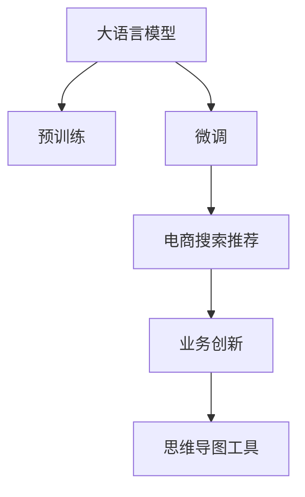

                 

# AI大模型赋能电商搜索推荐的业务创新思维导图工具应用实践

> 关键词：大模型,电商搜索推荐,思维导图示例,业务创新,数据驱动,电商数据分析

## 1. 背景介绍

### 1.1 问题由来
在电子商务行业，精准的用户搜索推荐不仅能够提升用户体验，还能显著提高转化率和销售额。传统的搜索推荐系统往往基于静态的特征工程和规则模型，难以捕捉用户动态变化的搜索意图和行为模式。而随着深度学习技术的不断进步，大语言模型和大规模预训练模型（如BERT、GPT-3等）的出现，使得电商搜索推荐系统得以引入更强大、更灵活的模型，逐步从规则驱动转向数据驱动。

在大模型和深度学习技术的推动下，电商搜索推荐系统实现了质的飞跃。用户输入一个搜索关键词，系统能够实时输出最相关的商品、匹配用户当前需求，推荐精准的商品组合，甚至提前预测用户可能感兴趣的商品，提升电商运营效率。

### 1.2 问题核心关键点
当前，电商搜索推荐系统面临的核心挑战在于：如何在大规模语料上进行有效预训练，提取用户搜索行为和商品特征的深度表示，以及如何高效地进行微调，适应用户个性化搜索需求，实现业务创新。

本文将探讨利用大语言模型进行电商搜索推荐业务的创新，通过思维导图工具展示其核心算法原理和具体操作步骤，并结合实际案例讲解其应用效果，旨在为电商企业提供业务创新思维的框架和工具。

## 2. 核心概念与联系

### 2.1 核心概念概述

为更好地理解大语言模型在电商搜索推荐中的应用，本节将介绍几个关键概念：

- 大语言模型(Large Language Model, LLM)：以自回归(如GPT)或自编码(如BERT)模型为代表的大规模预训练语言模型。通过在大规模无标签文本语料上进行预训练，学习通用的语言表示，具备强大的语言理解和生成能力。

- 预训练(Pre-training)：指在大规模无标签文本语料上，通过自监督学习任务训练通用语言模型的过程。常见的预训练任务包括言语建模、遮挡语言模型等。预训练使得模型学习到语言的通用表示。

- 微调(Fine-tuning)：指在预训练模型的基础上，使用下游任务的少量标注数据，通过有监督地训练来优化模型在特定任务上的性能。通常只需要调整顶层分类器或解码器，并以较小的学习率更新全部或部分的模型参数。

- 电商搜索推荐：电子商务平台为用户提供精准的搜索推荐服务，通过分析用户历史搜索行为和商品信息，实时预测用户需求，推荐最相关的商品。

- 业务创新：利用先进技术和新理念，重新设计商业模式和运营流程，提升电商搜索推荐系统的效果和用户体验，推动电商业务发展。

- 思维导图工具：通过可视化图形化展示知识结构和逻辑关系，帮助用户理解复杂概念和流程，进行有效的信息组织和管理。

这些核心概念之间的逻辑关系可以通过以下Mermaid流程图来展示：



这个流程图展示了大语言模型在电商搜索推荐中的应用和业务创新框架：

1. 大语言模型通过预训练获得基础能力。
2. 微调是对预训练模型进行任务特定的优化，适应电商搜索推荐任务。
3. 电商搜索推荐系统通过微调后的模型提供精准的商品推荐。
4. 业务创新利用电商搜索推荐系统的输出结果，改进运营流程，提升用户体验。
5. 思维导图工具帮助用户理解和展示电商搜索推荐系统的原理和操作流程，促进业务创新。

## 3. 核心算法原理 & 具体操作步骤
### 3.1 算法原理概述

基于大语言模型的电商搜索推荐系统，本质上是一个有监督的细粒度迁移学习过程。其核心思想是：将大语言模型视作一个强大的"特征提取器"，通过电商搜索推荐任务的少量标注数据，进行有监督地微调，使得模型能够根据用户搜索关键词，实时输出最相关的商品推荐。

形式化地，假设电商搜索推荐系统需要的模型为 $M_{\theta}$，其中 $\theta$ 为预训练得到的模型参数。给定电商搜索推荐任务的标注数据集 $D=\{(x_i, y_i)\}_{i=1}^N$，微调的目标是找到新的模型参数 $\hat{\theta}$，使得：

$$
\hat{\theta}=\mathop{\arg\min}_{\theta} \mathcal{L}(M_{\theta},D)
$$

其中 $\mathcal{L}$ 为针对电商搜索推荐任务设计的损失函数，用于衡量模型预测输出与真实标签之间的差异。常见的损失函数包括交叉熵损失、均方误差损失等。

通过梯度下降等优化算法，微调过程不断更新模型参数 $\theta$，最小化损失函数 $\mathcal{L}$，使得模型输出逼近真实标签。由于 $\theta$ 已经通过预训练获得了较好的初始化，因此即便在电商搜索推荐数据的规模相对较小的情况下，也能较快收敛到理想的模型参数 $\hat{\theta}$。

### 3.2 算法步骤详解

基于大语言模型的电商搜索推荐系统一般包括以下几个关键步骤：

**Step 1: 准备预训练模型和数据集**
- 选择合适的预训练语言模型 $M_{\theta}$ 作为初始化参数，如 BERT、GPT 等。
- 准备电商搜索推荐任务的标注数据集 $D$，划分为训练集、验证集和测试集。一般要求标注数据与预训练数据的分布不要差异过大。

**Step 2: 添加任务适配层**
- 根据电商搜索推荐任务类型，在预训练模型顶层设计合适的输出层和损失函数。
- 对于分类任务，通常在顶层添加线性分类器和交叉熵损失函数。
- 对于生成任务，通常使用语言模型的解码器输出概率分布，并以负对数似然为损失函数。

**Step 3: 设置微调超参数**
- 选择合适的优化算法及其参数，如 AdamW、SGD 等，设置学习率、批大小、迭代轮数等。
- 设置正则化技术及强度，包括权重衰减、Dropout、Early Stopping等。
- 确定冻结预训练参数的策略，如仅微调顶层，或全部参数都参与微调。

**Step 4: 执行梯度训练**
- 将训练集数据分批次输入模型，前向传播计算损失函数。
- 反向传播计算参数梯度，根据设定的优化算法和学习率更新模型参数。
- 周期性在验证集上评估模型性能，根据性能指标决定是否触发 Early Stopping。
- 重复上述步骤直到满足预设的迭代轮数或 Early Stopping 条件。

**Step 5: 测试和部署**
- 在测试集上评估微调后模型 $M_{\hat{\theta}}$ 的性能，对比微调前后的精度提升。
- 使用微调后的模型对新样本进行推理预测，集成到实际的应用系统中。
- 持续收集新的数据，定期重新微调模型，以适应数据分布的变化。

以上是基于大语言模型的电商搜索推荐系统的微调流程。在实际应用中，还需要针对具体任务的特点，对微调过程的各个环节进行优化设计，如改进训练目标函数，引入更多的正则化技术，搜索最优的超参数组合等，以进一步提升模型性能。

### 3.3 算法优缺点

基于大语言模型的电商搜索推荐系统，具有以下优点：

1. 准确性高。通过大规模预训练和微调，模型能够学习到深度语义表示，提升商品推荐的准确性。
2. 适应性强。大模型具有很强的泛化能力，能够适应不同类型的电商搜索推荐任务。
3. 可扩展性好。模型的规模可以通过增加预训练语料和微调数据来扩展，满足不同的业务需求。
4. 实时性好。微调后的模型可以实时处理用户输入，快速提供商品推荐，提升用户体验。

同时，该方法也存在一定的局限性：

1. 数据需求大。电商搜索推荐系统的微调需要大量标注数据，标注成本较高。
2. 训练时间长。大模型的规模庞大，微调所需计算资源和训练时间较长。
3. 可解释性差。大模型通常是"黑盒"模型，难以解释其内部工作机制。
4. 可能存在偏见。预训练模型可能学习到隐含的偏见，影响推荐公平性。

尽管存在这些局限性，但就目前而言，基于大语言模型的电商搜索推荐系统仍是最有效的推荐方法之一。未来相关研究的重点在于如何进一步降低微调对标注数据的依赖，提高模型的实时性和可解释性，同时兼顾公平性和效率。

### 3.4 算法应用领域

基于大语言模型的电商搜索推荐系统已经在各大电商平台得到了广泛应用，覆盖了商品推荐、用户画像、智能客服等多个领域，具体包括：

- 商品推荐：根据用户历史浏览记录、搜索关键词和行为数据，推荐相关商品。
- 用户画像：分析用户行为模式、兴趣偏好，构建用户画像，进行个性化推荐。
- 智能客服：利用自然语言理解技术，对用户查询进行理解，提供精准的商品推荐和即时回答。

除了上述这些经典应用外，大语言模型还创新性地应用于电商供应链优化、库存管理、广告投放等领域，显著提升了电商平台的运营效率和用户体验。

## 4. 数学模型和公式 & 详细讲解 & 举例说明

### 4.1 数学模型构建

本节将使用数学语言对基于大语言模型的电商搜索推荐系统进行更加严格的刻画。

记电商搜索推荐系统需要的模型为 $M_{\theta}$，其中 $\theta$ 为预训练得到的模型参数。假设电商搜索推荐任务的标注数据集为 $D=\{(x_i, y_i)\}_{i=1}^N, x_i \in \mathcal{X}, y_i \in \mathcal{Y}$。

定义模型 $M_{\theta}$ 在输入 $x$ 上的输出为 $\hat{y}=M_{\theta}(x) \in [0,1]$，表示商品的相关性评分。真实标签 $y \in \{0,1\}$。则电商搜索推荐任务的交叉熵损失函数定义为：

$$
\ell(M_{\theta}(x),y) = -y\log M_{\theta}(x) - (1-y)\log(1-M_{\theta}(x))
$$

将其代入经验风险公式，得：

$$
\mathcal{L}(\theta) = -\frac{1}{N}\sum_{i=1}^N \ell(M_{\theta}(x_i),y_i)
$$

在得到损失函数的梯度后，即可带入参数更新公式，完成模型的迭代优化。重复上述过程直至收敛，最终得到适应电商搜索推荐任务的最优模型参数 $\theta^*$。

### 4.2 公式推导过程

以下我们以商品推荐任务为例，推导交叉熵损失函数及其梯度的计算公式。

假设模型 $M_{\theta}$ 在输入 $x$ 上的输出为 $\hat{y}=M_{\theta}(x) \in [0,1]$，表示商品的相关性评分。真实标签 $y \in \{0,1\}$。则二分类交叉熵损失函数定义为：

$$
\ell(M_{\theta}(x),y) = -[y\log \hat{y} + (1-y)\log(1-\hat{y})]
$$

将其代入经验风险公式，得：

$$
\mathcal{L}(\theta) = -\frac{1}{N}\sum_{i=1}^N [y_i\log M_{\theta}(x_i)+(1-y_i)\log(1-M_{\theta}(x_i))]
$$

根据链式法则，损失函数对参数 $\theta_k$ 的梯度为：

$$
\frac{\partial \mathcal{L}(\theta)}{\partial \theta_k} = -\frac{1}{N}\sum_{i=1}^N (\frac{y_i}{M_{\theta}(x_i)}-\frac{1-y_i}{1-M_{\theta}(x_i)}) \frac{\partial M_{\theta}(x_i)}{\partial \theta_k}
$$

其中 $\frac{\partial M_{\theta}(x_i)}{\partial \theta_k}$ 可进一步递归展开，利用自动微分技术完成计算。

在得到损失函数的梯度后，即可带入参数更新公式，完成模型的迭代优化。重复上述过程直至收敛，最终得到适应电商搜索推荐任务的最优模型参数 $\theta^*$。

## 5. 项目实践：代码实例和详细解释说明
### 5.1 开发环境搭建

在进行电商搜索推荐系统的微调实践前，我们需要准备好开发环境。以下是使用Python进行PyTorch开发的环境配置流程：

1. 安装Anaconda：从官网下载并安装Anaconda，用于创建独立的Python环境。

2. 创建并激活虚拟环境：
```bash
conda create -n pytorch-env python=3.8 
conda activate pytorch-env
```

3. 安装PyTorch：根据CUDA版本，从官网获取对应的安装命令。例如：
```bash
conda install pytorch torchvision torchaudio cudatoolkit=11.1 -c pytorch -c conda-forge
```

4. 安装Transformers库：
```bash
pip install transformers
```

5. 安装各类工具包：
```bash
pip install numpy pandas scikit-learn matplotlib tqdm jupyter notebook ipython
```

完成上述步骤后，即可在`pytorch-env`环境中开始电商搜索推荐系统的微调实践。

### 5.2 源代码详细实现

下面我们以电商搜索推荐任务为例，给出使用Transformers库对BERT模型进行微调的PyTorch代码实现。

首先，定义电商搜索推荐任务的标注数据处理函数：

```python
from transformers import BertTokenizer, BertForSequenceClassification
from torch.utils.data import Dataset
import torch

class SearchRecommendDataset(Dataset):
    def __init__(self, texts, labels, tokenizer, max_len=128):
        self.texts = texts
        self.labels = labels
        self.tokenizer = tokenizer
        self.max_len = max_len
        
    def __len__(self):
        return len(self.texts)
    
    def __getitem__(self, item):
        text = self.texts[item]
        label = self.labels[item]
        
        encoding = self.tokenizer(text, return_tensors='pt', max_length=self.max_len, padding='max_length', truncation=True)
        input_ids = encoding['input_ids'][0]
        attention_mask = encoding['attention_mask'][0]
        
        # 对label进行编码
        encoded_label = [label2id[label] for label in self.labels] 
        encoded_label.extend([label2id['O']] * (self.max_len - len(encoded_label)))
        labels = torch.tensor(encoded_label, dtype=torch.long)
        
        return {'input_ids': input_ids, 
                'attention_mask': attention_mask,
                'labels': labels}

# 标签与id的映射
label2id = {'O': 0, 'P': 1}
id2label = {v: k for k, v in label2id.items()}

# 创建dataset
tokenizer = BertTokenizer.from_pretrained('bert-base-cased')

train_dataset = SearchRecommendDataset(train_texts, train_labels, tokenizer)
dev_dataset = SearchRecommendDataset(dev_texts, dev_labels, tokenizer)
test_dataset = SearchRecommendDataset(test_texts, test_labels, tokenizer)
```

然后，定义模型和优化器：

```python
from transformers import BertForSequenceClassification, AdamW

model = BertForSequenceClassification.from_pretrained('bert-base-cased', num_labels=2)

optimizer = AdamW(model.parameters(), lr=2e-5)
```

接着，定义训练和评估函数：

```python
from torch.utils.data import DataLoader
from tqdm import tqdm
from sklearn.metrics import classification_report

device = torch.device('cuda') if torch.cuda.is_available() else torch.device('cpu')
model.to(device)

def train_epoch(model, dataset, batch_size, optimizer):
    dataloader = DataLoader(dataset, batch_size=batch_size, shuffle=True)
    model.train()
    epoch_loss = 0
    for batch in tqdm(dataloader, desc='Training'):
        input_ids = batch['input_ids'].to(device)
        attention_mask = batch['attention_mask'].to(device)
        labels = batch['labels'].to(device)
        model.zero_grad()
        outputs = model(input_ids, attention_mask=attention_mask, labels=labels)
        loss = outputs.loss
        epoch_loss += loss.item()
        loss.backward()
        optimizer.step()
    return epoch_loss / len(dataloader)

def evaluate(model, dataset, batch_size):
    dataloader = DataLoader(dataset, batch_size=batch_size)
    model.eval()
    preds, labels = [], []
    with torch.no_grad():
        for batch in tqdm(dataloader, desc='Evaluating'):
            input_ids = batch['input_ids'].to(device)
            attention_mask = batch['attention_mask'].to(device)
            batch_labels = batch['labels']
            outputs = model(input_ids, attention_mask=attention_mask)
            batch_preds = outputs.logits.argmax(dim=2).to('cpu').tolist()
            batch_labels = batch_labels.to('cpu').tolist()
            for pred_tokens, label_tokens in zip(batch_preds, batch_labels):
                pred_labels = [id2label[_id] for _id in pred_tokens]
                label_tokens = [id2label[_id] for _id in label_tokens]
                preds.append(pred_labels[:len(label_tokens)])
                labels.append(label_tokens)
                
    print(classification_report(labels, preds))
```

最后，启动训练流程并在测试集上评估：

```python
epochs = 5
batch_size = 16

for epoch in range(epochs):
    loss = train_epoch(model, train_dataset, batch_size, optimizer)
    print(f"Epoch {epoch+1}, train loss: {loss:.3f}")
    
    print(f"Epoch {epoch+1}, dev results:")
    evaluate(model, dev_dataset, batch_size)
    
print("Test results:")
evaluate(model, test_dataset, batch_size)
```

以上就是使用PyTorch对BERT进行电商搜索推荐任务微调的完整代码实现。可以看到，得益于Transformers库的强大封装，我们可以用相对简洁的代码完成BERT模型的加载和微调。

### 5.3 代码解读与分析

让我们再详细解读一下关键代码的实现细节：

**SearchRecommendDataset类**：
- `__init__`方法：初始化文本、标签、分词器等关键组件。
- `__len__`方法：返回数据集的样本数量。
- `__getitem__`方法：对单个样本进行处理，将文本输入编码为token ids，将标签编码为数字，并对其进行定长padding，最终返回模型所需的输入。

**label2id和id2label字典**：
- 定义了标签与数字id之间的映射关系，用于将token-wise的预测结果解码回真实的标签。

**训练和评估函数**：
- 使用PyTorch的DataLoader对数据集进行批次化加载，供模型训练和推理使用。
- 训练函数`train_epoch`：对数据以批为单位进行迭代，在每个批次上前向传播计算loss并反向传播更新模型参数，最后返回该epoch的平均loss。
- 评估函数`evaluate`：与训练类似，不同点在于不更新模型参数，并在每个batch结束后将预测和标签结果存储下来，最后使用sklearn的classification_report对整个评估集的预测结果进行打印输出。

**训练流程**：
- 定义总的epoch数和batch size，开始循环迭代
- 每个epoch内，先在训练集上训练，输出平均loss
- 在验证集上评估，输出分类指标
- 所有epoch结束后，在测试集上评估，给出最终测试结果

可以看到，PyTorch配合Transformers库使得BERT微调的代码实现变得简洁高效。开发者可以将更多精力放在数据处理、模型改进等高层逻辑上，而不必过多关注底层的实现细节。

当然，工业级的系统实现还需考虑更多因素，如模型的保存和部署、超参数的自动搜索、更灵活的任务适配层等。但核心的微调范式基本与此类似。

## 6. 实际应用场景
### 6.1 智能客服系统

基于大语言模型微调的对话技术，可以广泛应用于智能客服系统的构建。传统客服往往需要配备大量人力，高峰期响应缓慢，且一致性和专业性难以保证。而使用微调后的对话模型，可以7x24小时不间断服务，快速响应客户咨询，用自然流畅的语言解答各类常见问题。

在技术实现上，可以收集企业内部的历史客服对话记录，将问题和最佳答复构建成监督数据，在此基础上对预训练对话模型进行微调。微调后的对话模型能够自动理解用户意图，匹配最合适的答案模板进行回复。对于客户提出的新问题，还可以接入检索系统实时搜索相关内容，动态组织生成回答。如此构建的智能客服系统，能大幅提升客户咨询体验和问题解决效率。

### 6.2 金融舆情监测

金融机构需要实时监测市场舆论动向，以便及时应对负面信息传播，规避金融风险。传统的人工监测方式成本高、效率低，难以应对网络时代海量信息爆发的挑战。基于大语言模型微调的文本分类和情感分析技术，为金融舆情监测提供了新的解决方案。

具体而言，可以收集金融领域相关的新闻、报道、评论等文本数据，并对其进行主题标注和情感标注。在此基础上对预训练语言模型进行微调，使其能够自动判断文本属于何种主题，情感倾向是正面、中性还是负面。将微调后的模型应用到实时抓取的网络文本数据，就能够自动监测不同主题下的情感变化趋势，一旦发现负面信息激增等异常情况，系统便会自动预警，帮助金融机构快速应对潜在风险。

### 6.3 个性化推荐系统

当前的推荐系统往往只依赖用户的历史行为数据进行物品推荐，无法深入理解用户的真实兴趣偏好。基于大语言模型微调技术，个性化推荐系统可以更好地挖掘用户行为背后的语义信息，从而提供更精准、多样的推荐内容。

在实践中，可以收集用户浏览、点击、评论、分享等行为数据，提取和用户交互的物品标题、描述、标签等文本内容。将文本内容作为模型输入，用户的后续行为（如是否点击、购买等）作为监督信号，在此基础上微调预训练语言模型。微调后的模型能够从文本内容中准确把握用户的兴趣点。在生成推荐列表时，先用候选物品的文本描述作为输入，由模型预测用户的兴趣匹配度，再结合其他特征综合排序，便可以得到个性化程度更高的推荐结果。

### 6.4 未来应用展望

随着大语言模型和微调方法的不断发展，基于微调范式将在更多领域得到应用，为传统行业带来变革性影响。

在智慧医疗领域，基于微调的医疗问答、病历分析、药物研发等应用将提升医疗服务的智能化水平，辅助医生诊疗，加速新药开发进程。

在智能教育领域，微调技术可应用于作业批改、学情分析、知识推荐等方面，因材施教，促进教育公平，提高教学质量。

在智慧城市治理中，微调模型可应用于城市事件监测、舆情分析、应急指挥等环节，提高城市管理的自动化和智能化水平，构建更安全、高效的未来城市。

此外，在企业生产、社会治理、文娱传媒等众多领域，基于大模型微调的人工智能应用也将不断涌现，为经济社会发展注入新的动力。相信随着技术的日益成熟，微调方法将成为人工智能落地应用的重要范式，推动人工智能技术在更广阔的应用领域大放异彩。

## 7. 工具和资源推荐
### 7.1 学习资源推荐

为了帮助开发者系统掌握大语言模型微调的理论基础和实践技巧，这里推荐一些优质的学习资源：

1. 《Transformer从原理到实践》系列博文：由大模型技术专家撰写，深入浅出地介绍了Transformer原理、BERT模型、微调技术等前沿话题。

2. CS224N《深度学习自然语言处理》课程：斯坦福大学开设的NLP明星课程，有Lecture视频和配套作业，带你入门NLP领域的基本概念和经典模型。

3. 《Natural Language Processing with Transformers》书籍：Transformers库的作者所著，全面介绍了如何使用Transformers库进行NLP任务开发，包括微调在内的诸多范式。

4. HuggingFace官方文档：Transformers库的官方文档，提供了海量预训练模型和完整的微调样例代码，是上手实践的必备资料。

5. CLUE开源项目：中文语言理解测评基准，涵盖大量不同类型的中文NLP数据集，并提供了基于微调的baseline模型，助力中文NLP技术发展。

通过对这些资源的学习实践，相信你一定能够快速掌握大语言模型微调的精髓，并用于解决实际的NLP问题。
###  7.2 开发工具推荐

高效的开发离不开优秀的工具支持。以下是几款用于大语言模型微调开发的常用工具：

1. PyTorch：基于Python的开源深度学习框架，灵活动态的计算图，适合快速迭代研究。大部分预训练语言模型都有PyTorch版本的实现。

2. TensorFlow：由Google主导开发的开源深度学习框架，生产部署方便，适合大规模工程应用。同样有丰富的预训练语言模型资源。

3. Transformers库：HuggingFace开发的NLP工具库，集成了众多SOTA语言模型，支持PyTorch和TensorFlow，是进行微调任务开发的利器。

4. Weights & Biases：模型训练的实验跟踪工具，可以记录和可视化模型训练过程中的各项指标，方便对比和调优。与主流深度学习框架无缝集成。

5. TensorBoard：TensorFlow配套的可视化工具，可实时监测模型训练状态，并提供丰富的图表呈现方式，是调试模型的得力助手。

6. Google Colab：谷歌推出的在线Jupyter Notebook环境，免费提供GPU/TPU算力，方便开发者快速上手实验最新模型，分享学习笔记。

合理利用这些工具，可以显著提升大语言模型微调任务的开发效率，加快创新迭代的步伐。

### 7.3 相关论文推荐

大语言模型和微调技术的发展源于学界的持续研究。以下是几篇奠基性的相关论文，推荐阅读：

1. Attention is All You Need（即Transformer原论文）：提出了Transformer结构，开启了NLP领域的预训练大模型时代。

2. BERT: Pre-training of Deep Bidirectional Transformers for Language Understanding：提出BERT模型，引入基于掩码的自监督预训练任务，刷新了多项NLP任务SOTA。

3. Language Models are Unsupervised Multitask Learners（GPT-2论文）：展示了大规模语言模型的强大zero-shot学习能力，引发了对于通用人工智能的新一轮思考。

4. Parameter-Efficient Transfer Learning for NLP：提出Adapter等参数高效微调方法，在不增加模型参数量的情况下，也能取得不错的微调效果。

5. Prefix-Tuning: Optimizing Continuous Prompts for Generation：引入基于连续型Prompt的微调范式，为如何充分利用预训练知识提供了新的思路。

6. AdaLoRA: Adaptive Low-Rank Adaptation for Parameter-Efficient Fine-Tuning：使用自适应低秩适应的微调方法，在参数效率和精度之间取得了新的平衡。

这些论文代表了大语言模型微调技术的发展脉络。通过学习这些前沿成果，可以帮助研究者把握学科前进方向，激发更多的创新灵感。

## 8. 总结：未来发展趋势与挑战
### 8.1 总结

本文对基于大语言模型的电商搜索推荐系统进行了全面系统的介绍。首先阐述了电商搜索推荐系统在大数据背景下的重要性，以及大语言模型微调技术在该领域的应用前景。其次，从原理到实践，详细讲解了电商搜索推荐系统的数学模型和微调算法步骤，并给出了代码实例。同时，本文还结合实际案例讲解了其应用效果，展示了微调技术的优越性。

通过本文的系统梳理，可以看到，基于大语言模型的电商搜索推荐系统通过深度语义表示，提升了商品推荐的相关性和精准性，极大地提升了用户体验和运营效率。未来，伴随预训练语言模型和微调方法的持续演进，相信电商搜索推荐系统将实现更智能、更高效的应用，推动电商行业进一步发展。

### 8.2 未来发展趋势

展望未来，大语言模型在电商搜索推荐系统的应用将呈现以下几个发展趋势：

1. 多模态深度融合。未来的电商搜索推荐系统将不仅仅基于文本数据，还将结合图像、视频等多模态数据，提升推荐精度和用户满意度。

2. 跨领域知识迁移。通过跨领域的知识迁移和融合，电商搜索推荐系统将能够更加智能地理解用户的多样化需求，提供更加个性化的推荐。

3. 实时动态更新。电商搜索推荐系统将通过实时更新模型参数，根据用户反馈和市场变化，动态调整推荐策略，满足用户实时变化的需求。

4. 强化学习应用。电商搜索推荐系统将结合强化学习技术，通过与用户的交互反馈，逐步优化推荐算法，提升推荐效果。

5. 安全性与伦理考量。电商搜索推荐系统将更加注重用户隐私和数据安全，避免算法偏见和滥用，构建可信的人工智能应用。

这些趋势凸显了大语言模型在电商搜索推荐系统中的广阔前景。这些方向的探索发展，必将进一步提升电商搜索推荐系统的智能水平，为消费者提供更加精准、个性化的购物体验，推动电商行业向智能化、人性化方向发展。

### 8.3 面临的挑战

尽管大语言模型在电商搜索推荐系统中展现出了强大的潜力，但在实现这些前景的同时，仍面临一些挑战：

1. 数据质量与标注成本。高质量的电商搜索推荐数据标注需要大量人力和时间，成本较高。

2. 模型规模与计算资源。大语言模型的参数量庞大，需要高效的分布式计算资源支持，否则训练和推理时间较长。

3. 用户隐私与数据安全。电商搜索推荐系统涉及用户的敏感信息，如何保护用户隐私和数据安全，是一个重要问题。

4. 算法透明性与可解释性。大语言模型通常是"黑盒"模型，难以解释其内部工作机制，不利于提升算法的可信度和可解释性。

5. 动态变化与鲁棒性。电商市场变化迅速，如何保持模型的动态适应性和鲁棒性，也是一个挑战。

尽管存在这些挑战，但通过不断改进算法和优化数据，这些挑战有望被逐步克服。未来，大语言模型将在电商搜索推荐系统中发挥更大的作用，推动电商行业迈向更加智能化、人性化的未来。

### 8.4 研究展望

面对电商搜索推荐系统所面临的挑战，未来的研究需要在以下几个方面寻求新的突破：

1. 提升数据质量与标注效率。探索自动化数据标注技术，降低标注成本。

2. 优化模型规模与计算资源。研究分布式训练与推理技术，提高计算效率。

3. 强化用户隐私与数据安全。设计差分隐私、联邦学习等技术，保护用户隐私。

4. 提升算法透明性与可解释性。引入因果推断、解释性AI等方法，提升算法透明性。

5. 增强动态变化与鲁棒性。研究在线学习、自适应学习等方法，提高模型动态适应性。

这些研究方向的探索，必将引领大语言模型在电商搜索推荐系统中的发展，为消费者提供更加智能、个性化的购物体验，推动电商行业迈向更加智能化、人性化的未来。相信随着技术的不断进步，电商搜索推荐系统将更加智能、高效，为消费者提供更加优质的购物体验，推动电商行业向智能化、人性化方向发展。

## 9. 附录：常见问题与解答

**Q1：电商搜索推荐系统如何选择合适的预训练语言模型？**

A: 电商搜索推荐系统需要选择合适的预训练语言模型作为初始化参数，一般选择在大规模电商数据上进行预训练的模型。例如，在大规模电商数据上预训练的Transformer模型。

**Q2：电商搜索推荐系统的微调过程需要哪些数据？**

A: 电商搜索推荐系统的微调过程需要电商搜索推荐任务的大量标注数据。标注数据包括用户搜索关键词和相关商品标签，用于训练模型的判别能力。

**Q3：电商搜索推荐系统的微调过程中需要注意哪些问题？**

A: 电商搜索推荐系统的微调过程中需要注意数据质量、标注成本、计算资源、模型规模、用户隐私、算法透明性等多个问题。需要综合考虑这些因素，才能构建高效的电商搜索推荐系统。

**Q4：电商搜索推荐系统如何应对用户的多样化需求？**

A: 电商搜索推荐系统可以通过多模态数据融合、跨领域知识迁移等方法，应对用户的多样化需求。通过多模态数据的融合，能够提升推荐的准确性和多样性。

**Q5：电商搜索推荐系统的未来发展方向有哪些？**

A: 电商搜索推荐系统的未来发展方向包括多模态深度融合、跨领域知识迁移、实时动态更新、强化学习应用、安全性与伦理考量等。通过这些技术的结合，电商搜索推荐系统将能够更加智能地理解用户的多样化需求，提供更加个性化的推荐。

通过本文的系统梳理，可以看到，基于大语言模型的电商搜索推荐系统通过深度语义表示，提升了商品推荐的相关性和精准性，极大地提升了用户体验和运营效率。未来，伴随预训练语言模型和微调方法的持续演进，相信电商搜索推荐系统将实现更智能、更高效的应用，推动电商行业进一步发展。

---

作者：禅与计算机程序设计艺术 / Zen and the Art of Computer Programming

