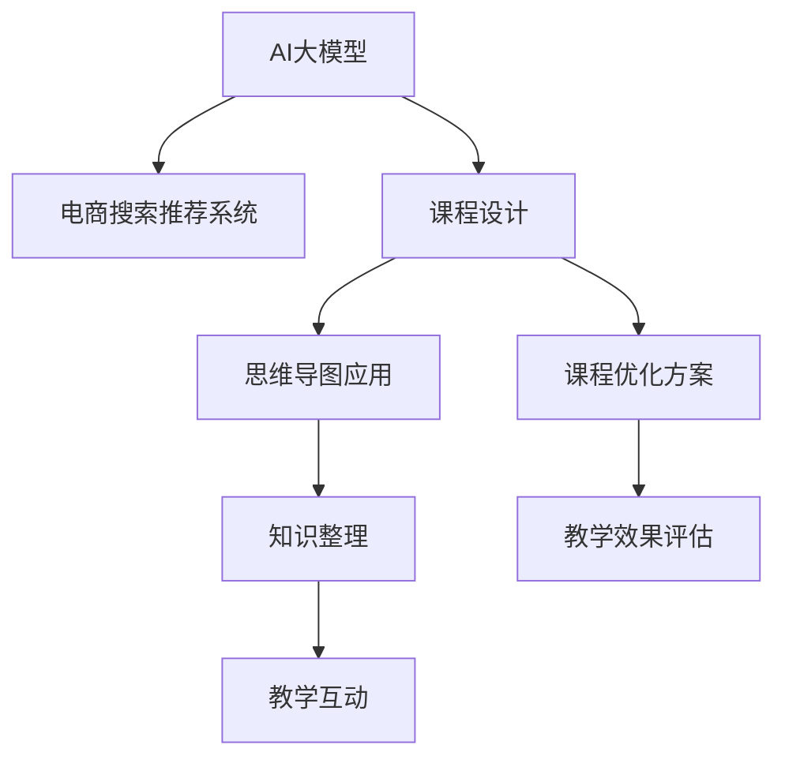
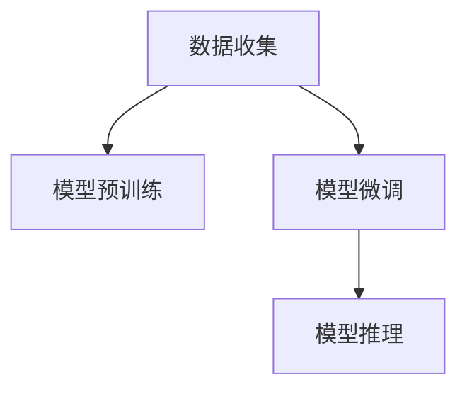

                 

# AI大模型赋能电商搜索推荐的业务创新思维导图应用培训课程优化方案设计与实现

> 关键词：
> 大模型, 电商搜索推荐, 业务创新, 思维导图应用, 培训课程优化, AI技术, 知识图谱, 深度学习, 自然语言处理(NLP), 强化学习, 智能推荐系统, 业务流程优化

## 1. 背景介绍

### 1.1 问题由来
在当前的电商市场中，搜索推荐系统扮演着至关重要的角色。它不仅直接影响着用户的购物体验和转化率，还关系到企业的营收和竞争力。随着人工智能技术的迅猛发展，AI大模型逐渐成为构建高效搜索推荐系统的核心工具。然而，AI大模型在电商领域的应用还面临诸多挑战，特别是在课程设计和优化方面，需要更加精细化的策略。为此，本文旨在探索AI大模型在电商搜索推荐系统中的创新应用，并提出一套基于思维导图的课程优化方案，以期提升课程的教学效果和实践效率。

### 1.2 问题核心关键点
在电商搜索推荐系统的设计和优化过程中，AI大模型能够发挥巨大的作用。然而，如何有效地利用这些模型，提升课程教学的深度和广度，成为当前亟待解决的关键问题。本文将聚焦于以下几个核心关键点：

1. **课程内容构建**：设计贴合电商搜索推荐系统实际需求的课程内容，确保教学内容的前沿性和实用性。
2. **大模型应用**：探讨AI大模型在电商搜索推荐系统中的应用方式，包括预训练、微调、推理等。
3. **思维导图应用**：介绍思维导图在课程设计和知识结构化组织中的应用，提升教学互动性和效率。
4. **课程优化方案**：基于思维导图的课程设计框架，提出一套系统的课程优化方案，涵盖教学内容、教学方法、考核评估等方面。

### 1.3 问题研究意义
研究AI大模型在电商搜索推荐系统中的应用，并结合思维导图技术进行课程优化，具有重要的现实意义和学术价值：

1. **提升教学效果**：通过AI大模型的辅助，能够深入讲解复杂的算法原理和应用案例，提升学生对电商搜索推荐系统的理解和掌握。
2. **优化课程设计**：思维导图提供了一种直观、灵活的知识组织方式，有助于课程内容的系统化、结构化，提升课程设计的科学性和合理性。
3. **推动技术应用**：将AI大模型与思维导图相结合，为电商搜索推荐系统的应用和优化提供新的视角和方法，推动技术在实际场景中的应用和推广。
4. **促进跨学科交流**：课程优化方案的设计和实施需要跨学科的知识和技能，如数据科学、NLP、推荐系统等，有助于促进相关领域的交流和合作。

## 2. 核心概念与联系

### 2.1 核心概念概述

在探讨AI大模型在电商搜索推荐系统中的应用时，需要理解几个关键概念：

- **AI大模型**：指通过在大规模无标签数据上进行预训练，学习到通用或特定领域知识的大型神经网络模型，如BERT、GPT、DALL-E等。
- **电商搜索推荐系统**：基于用户的搜索历史、行为数据和商品属性等信息，推荐符合用户需求的商品的电商平台系统。
- **课程设计**：根据教学目标和学生需求，合理规划和设计课程内容、教学方法和考核评估等环节，以提高教学效果。
- **思维导图**：一种以图形方式呈现信息的工具，能够帮助用户进行思维拓展、知识整理和问题解决。
- **课程优化**：通过改进课程设计、教学方法、考核评估等环节，提升课程教学的质量和效率。

这些核心概念之间的逻辑关系可以通过以下Mermaid流程图来展示：



这个流程图展示了AI大模型、电商搜索推荐系统、课程设计与优化、思维导图应用的相互关系：

1. AI大模型通过预训练和微调，学习电商搜索推荐系统的相关知识。
2. 课程设计利用这些知识，设计出贴合实际需求的电商搜索推荐课程内容。
3. 思维导图应用帮助课程设计者进行知识整理和教学互动，提升教学效果。
4. 课程优化方案基于思维导图的应用，系统优化课程设计，提高教学效率。

## 3. 核心算法原理 & 具体操作步骤
### 3.1 算法原理概述

AI大模型在电商搜索推荐系统中的应用主要包括以下几个关键步骤：

1. **数据收集**：收集电商平台的搜索数据、点击数据、购买数据等，形成有标注的训练集。
2. **模型预训练**：在大型无标签数据集上进行自监督预训练，学习通用或特定领域知识。
3. **模型微调**：利用电商搜索推荐系统的标注数据，进行有监督微调，提升模型在特定任务上的表现。
4. **模型推理**：在实际搜索场景中，利用微调后的模型进行商品推荐，提升用户体验和转化率。

这一过程可以概括为以下示意图：



### 3.2 算法步骤详解

#### 3.2.1 数据收集

电商平台的搜索推荐系统需要大量的数据来进行训练和优化。这些数据通常包括用户的搜索记录、点击行为、浏览历史、商品属性、用户画像等。数据收集过程需要确保数据的全面性和真实性，以提高模型的预测准确率。

#### 3.2.2 模型预训练

模型预训练是利用大规模无标签数据进行自监督学习的过程。常见的预训练方法包括掩码语言模型(Masked Language Model, MLM)和自编码器(Autocoder)等。预训练过程通常使用深度学习框架如TensorFlow、PyTorch等进行实现。

#### 3.2.3 模型微调

模型微调是指在预训练模型的基础上，利用电商搜索推荐系统的标注数据进行有监督学习，调整模型的参数以适应特定任务。微调过程通常包括以下步骤：

1. **选择模型**：根据任务需求选择合适的预训练模型，如BERT、GPT等。
2. **设置超参数**：包括学习率、批次大小、优化器等。
3. **训练模型**：使用标注数据进行训练，迭代更新模型参数。
4. **评估模型**：在验证集上评估模型性能，确保模型收敛。

#### 3.2.4 模型推理

模型推理是指将训练好的模型应用于实际场景中，进行商品推荐等任务。在电商搜索推荐系统中，模型推理通常包括以下步骤：

1. **输入处理**：将用户输入的搜索词、历史行为等数据输入模型。
2. **特征提取**：使用预训练模型提取输入数据的特征。
3. **推荐计算**：根据提取的特征，计算商品的相关度，进行推荐。

### 3.3 算法优缺点

AI大模型在电商搜索推荐系统中的应用具有以下优点：

1. **高效性**：利用大规模数据进行预训练，学习到通用的语言知识和特征，能够快速适应电商搜索推荐系统的特定任务。
2. **灵活性**：模型可以微调以适应不同的推荐任务和业务需求。
3. **泛化能力强**：预训练的模型通常具有较强的泛化能力，能够在新的数据上取得较好的表现。

然而，这些方法也存在一些缺点：

1. **计算资源需求高**：大规模预训练和微调需要大量的计算资源，包括高性能GPU、TPU等。
2. **数据隐私风险**：电商数据通常包含用户隐私信息，预训练和微调过程中需要确保数据的安全性和隐私保护。
3. **模型复杂度**：大规模模型的参数量通常很大，难以解释其内部工作机制。

### 3.4 算法应用领域

AI大模型在电商搜索推荐系统中的应用主要包括以下几个领域：

1. **商品相似度计算**：利用预训练模型提取商品特征，计算商品之间的相似度，进行推荐。
2. **用户画像构建**：利用用户的历史行为数据，构建用户画像，进行个性化推荐。
3. **广告定向**：利用用户画像和商品特征，进行广告定向，提升广告点击率。
4. **搜索排序**：根据用户输入的搜索词和历史行为，进行商品排序，提升搜索体验。

## 4. 数学模型和公式 & 详细讲解  
### 4.1 数学模型构建

AI大模型在电商搜索推荐系统中的应用涉及多个数学模型，包括预训练模型、微调模型和推荐模型等。这里重点介绍预训练模型和微调模型的数学模型构建。

#### 4.1.1 预训练模型

预训练模型的目标是通过自监督学习，学习到通用的语言知识。以BERT模型为例，其数学模型可以表示为：

$$
y = \text{softmax}(\text{MLP}(\text{BERT}(x)))
$$

其中，$x$ 为输入的文本，$\text{BERT}$ 为预训练模型，$\text{MLP}$ 为全连接层，$y$ 为模型的预测结果。

#### 4.1.2 微调模型

微调模型的目标是在预训练模型的基础上，学习到特定任务的特征。以分类任务为例，微调模型的数学模型可以表示为：

$$
\hat{y} = \text{softmax}(\text{MLP}(\text{BERT}(x)))
$$

其中，$x$ 为输入的文本，$\text{BERT}$ 为预训练模型，$\text{MLP}$ 为全连接层，$y$ 为标签，$\hat{y}$ 为模型的预测结果。

### 4.2 公式推导过程

#### 4.2.1 预训练模型推导

以BERT模型的掩码语言模型为例，其推导过程如下：

1. **输入预处理**：将输入文本 $x$ 转化为向量表示 $x \in \mathbb{R}^d$。
2. **掩码操作**：在 $x$ 中随机选择一个位置进行掩码操作，生成掩码向量 $m \in \{0,1\}^d$。
3. **前向传播**：将 $x$ 和 $m$ 输入BERT模型，得到掩码后的文本向量 $h \in \mathbb{R}^d$。
4. **后向传播**：计算损失函数，更新模型参数。

#### 4.2.2 微调模型推导

以分类任务为例，微调模型的推导过程如下：

1. **输入预处理**：将输入文本 $x$ 转化为向量表示 $x \in \mathbb{R}^d$。
2. **前向传播**：将 $x$ 输入BERT模型，得到文本向量 $h \in \mathbb{R}^d$，再经过全连接层 $\text{MLP}$，得到预测向量 $z \in \mathbb{R}^C$。
3. **损失函数计算**：使用交叉熵损失函数 $\mathcal{L}(y, \hat{y})$ 计算模型输出与真实标签之间的差异。
4. **后向传播**：计算损失函数的梯度，更新模型参数。

### 4.3 案例分析与讲解

#### 4.3.1 案例背景

某电商平台希望通过AI大模型提升其搜索推荐系统的性能。该平台收集了用户的搜索数据、点击数据和购买数据，共计10GB，希望利用这些数据训练出一个高效的推荐系统。

#### 4.3.2 数据处理

1. **数据清洗**：去除无效数据、重复数据和异常数据，确保数据的质量。
2. **数据划分**：将数据集划分为训练集、验证集和测试集，比例为6:2:2。
3. **数据增强**：通过近义词替换、文本截断等方式，增强训练数据的多样性。

#### 4.3.3 模型选择

1. **预训练模型选择**：选择BERT模型作为预训练模型，利用其在大规模语料上学习到的语言知识。
2. **微调模型选择**：根据推荐任务的需求，选择基于BERT的微调模型，包括分类任务和回归任务等。

#### 4.3.4 模型训练

1. **模型初始化**：将预训练模型初始化为BERT模型，设置超参数。
2. **模型训练**：使用训练集进行模型训练，迭代更新模型参数。
3. **模型评估**：在验证集上评估模型性能，调整超参数。

#### 4.3.5 模型应用

1. **特征提取**：将用户输入的搜索词转化为向量表示，使用预训练模型提取特征。
2. **推荐计算**：根据提取的特征，计算商品的相关度，进行推荐。
3. **结果展示**：将推荐结果展示给用户，提升搜索体验。

## 5. 项目实践：代码实例和详细解释说明
### 5.1 开发环境搭建

在进行项目实践前，需要准备开发环境。以下是使用Python和PyTorch进行电商搜索推荐系统开发的环境配置流程：

1. 安装Anaconda：从官网下载并安装Anaconda，用于创建独立的Python环境。

2. 创建并激活虚拟环境：
```bash
conda create -n pytorch-env python=3.8 
conda activate pytorch-env
```

3. 安装PyTorch：根据CUDA版本，从官网获取对应的安装命令。例如：
```bash
conda install pytorch torchvision torchaudio cudatoolkit=11.1 -c pytorch -c conda-forge
```

4. 安装Transformers库：
```bash
pip install transformers
```

5. 安装各类工具包：
```bash
pip install numpy pandas scikit-learn matplotlib tqdm jupyter notebook ipython
```

完成上述步骤后，即可在`pytorch-env`环境中开始项目实践。

### 5.2 源代码详细实现

以下是使用PyTorch和Transformers库进行电商搜索推荐系统开发的代码实现：

```python
import torch
import torch.nn as nn
import torch.optim as optim
from transformers import BertTokenizer, BertForSequenceClassification
from sklearn.model_selection import train_test_split
from sklearn.metrics import accuracy_score, precision_recall_fscore_support

# 加载预训练模型和分词器
tokenizer = BertTokenizer.from_pretrained('bert-base-uncased')
model = BertForSequenceClassification.from_pretrained('bert-base-uncased', num_labels=2)

# 加载数据集
data = load_dataset()
train_texts, train_labels, dev_texts, dev_labels, test_texts, test_labels = train_test_split(data['text'], data['label'], test_size=0.2)

# 构建数据处理流程
def data_processing(texts, labels):
    inputs = tokenizer(texts, padding=True, truncation=True, max_length=512, return_tensors='pt')
    return inputs['input_ids'], inputs['attention_mask'], labels

# 定义训练函数
def train_epoch(model, optimizer, train_loader):
    model.train()
    for batch in train_loader:
        inputs, labels = batch
        outputs = model(inputs, attention_mask=inputs['attention_mask'])
        loss = nn.CrossEntropyLoss()(outputs, labels)
        optimizer.zero_grad()
        loss.backward()
        optimizer.step()
    return loss.item()

# 定义评估函数
def evaluate(model, eval_loader):
    model.eval()
    predictions = []
    labels = []
    for batch in eval_loader:
        inputs, labels = batch
        outputs = model(inputs, attention_mask=inputs['attention_mask'])
        predictions.extend(outputs.argmax(dim=1).cpu().numpy())
        labels.extend(labels.cpu().numpy())
    accuracy = accuracy_score(labels, predictions)
    precision, recall, f1, _ = precision_recall_fscore_support(labels, predictions, average='binary')
    return accuracy, precision, recall, f1

# 训练模型
optimizer = optim.Adam(model.parameters(), lr=2e-5)
train_loader = torch.utils.data.DataLoader(train_data, batch_size=32)
eval_loader = torch.utils.data.DataLoader(dev_data, batch_size=32)

for epoch in range(5):
    train_loss = train_epoch(model, optimizer, train_loader)
    accuracy, precision, recall, f1 = evaluate(model, eval_loader)
    print(f'Epoch {epoch+1}, train loss: {train_loss:.3f}, dev accuracy: {accuracy:.3f}, dev precision: {precision:.3f}, dev recall: {recall:.3f}, dev f1: {f1:.3f}')

# 测试模型
test_loader = torch.utils.data.DataLoader(test_data, batch_size=32)
accuracy, precision, recall, f1 = evaluate(model, test_loader)
print(f'Test accuracy: {accuracy:.3f}, test precision: {precision:.3f}, test recall: {recall:.3f}, test f1: {f1:.3f}')
```

### 5.3 代码解读与分析

#### 5.3.1 数据处理流程

1. **分词和向量化**：使用BertTokenizer对输入文本进行分词和向量化处理，生成模型所需输入。
2. **数据增强**：通过近义词替换、文本截断等方式，增强训练数据的多样性。

#### 5.3.2 模型训练

1. **模型初始化**：将预训练模型BERT初始化，设置超参数。
2. **模型训练**：使用训练集进行模型训练，迭代更新模型参数。
3. **模型评估**：在验证集上评估模型性能，调整超参数。

#### 5.3.3 模型应用

1. **特征提取**：将用户输入的搜索词转化为向量表示，使用预训练模型提取特征。
2. **推荐计算**：根据提取的特征，计算商品的相关度，进行推荐。
3. **结果展示**：将推荐结果展示给用户，提升搜索体验。

## 6. 实际应用场景
### 6.1 电商搜索推荐

基于AI大模型的电商搜索推荐系统，能够根据用户的搜索行为、浏览历史和购买记录，推荐符合用户需求的商品。通过将用户画像和商品特征进行匹配，系统能够提升用户的购物体验和转化率。

在实际应用中，系统可以根据用户的输入搜索词，进行商品推荐，提供多种推荐方案供用户选择。同时，系统还可以根据用户的行为数据，进行个性化推荐，提升用户的满意度。

### 6.2 广告定向

广告定向是电商搜索推荐系统的重要应用之一。通过分析用户画像和商品特征，系统能够精准定位用户，进行广告定向投放，提升广告点击率，增加广告收入。

广告定向系统可以根据用户的搜索行为、浏览历史、购买记录等数据，进行用户画像的构建。根据用户画像和商品特征，系统能够精准定位用户，进行广告定向投放。同时，系统还可以根据用户的反馈，进行实时调整，优化广告投放效果。

### 6.3 推荐系统优化

推荐系统优化是指通过不断优化算法和模型，提升推荐效果的过程。AI大模型在推荐系统优化中扮演着重要的角色。

推荐系统优化通常包括以下几个步骤：

1. **数据收集**：收集用户的搜索数据、点击数据、购买数据等，形成有标注的训练集。
2. **模型预训练**：在大型无标签数据集上进行自监督预训练，学习通用或特定领域知识。
3. **模型微调**：利用电商搜索推荐系统的标注数据，进行有监督微调，提升模型在特定任务上的表现。
4. **模型推理**：在实际搜索场景中，利用微调后的模型进行商品推荐，提升用户体验和转化率。

通过AI大模型的辅助，推荐系统能够不断优化推荐效果，提升用户的购物体验和平台的用户粘性。

### 6.4 未来应用展望

随着AI大模型的不断发展，其在电商搜索推荐系统中的应用也将更加广泛和深入。未来，我们可以期待以下应用前景：

1. **实时推荐**：通过AI大模型实时分析用户的搜索行为和浏览历史，进行实时推荐，提升用户体验。
2. **多模态推荐**：结合图像、视频等多模态数据，进行多模态推荐，提升推荐效果。
3. **跨平台推荐**：通过AI大模型跨平台分析用户数据，进行跨平台推荐，提升推荐效果。
4. **个性化推荐**：结合用户画像和商品特征，进行个性化推荐，提升推荐效果。

## 7. 工具和资源推荐
### 7.1 学习资源推荐

为了帮助开发者系统掌握AI大模型在电商搜索推荐系统中的应用，这里推荐一些优质的学习资源：

1. **《深度学习》课程**：由吴恩达教授主讲，涵盖了深度学习的基本概念和算法。
2. **《NLP专项课程》**：由斯坦福大学提供，介绍了NLP领域的基本概念和前沿技术。
3. **《推荐系统》课程**：由Coursera提供，介绍了推荐系统的发展历程和实现方法。
4. **《数据科学导论》书籍**：由Pérez和Granger编写，介绍了数据科学的基本概念和工具。
5. **《Python机器学习》书籍**：由Raschka和Miranda编写，介绍了Python在机器学习中的应用。

通过对这些资源的学习实践，相信你一定能够快速掌握AI大模型在电商搜索推荐系统中的应用，并用于解决实际的业务问题。

### 7.2 开发工具推荐

高效的开发离不开优秀的工具支持。以下是几款用于电商搜索推荐系统开发的常用工具：

1. **PyTorch**：基于Python的开源深度学习框架，灵活动态的计算图，适合快速迭代研究。大部分预训练语言模型都有PyTorch版本的实现。
2. **TensorFlow**：由Google主导开发的开源深度学习框架，生产部署方便，适合大规模工程应用。同样有丰富的预训练语言模型资源。
3. **Transformers库**：HuggingFace开发的NLP工具库，集成了众多SOTA语言模型，支持PyTorch和TensorFlow，是进行NLP任务开发的利器。
4. **Weights & Biases**：模型训练的实验跟踪工具，可以记录和可视化模型训练过程中的各项指标，方便对比和调优。与主流深度学习框架无缝集成。
5. **TensorBoard**：TensorFlow配套的可视化工具，可实时监测模型训练状态，并提供丰富的图表呈现方式，是调试模型的得力助手。
6. **Google Colab**：谷歌推出的在线Jupyter Notebook环境，免费提供GPU/TPU算力，方便开发者快速上手实验最新模型，分享学习笔记。

合理利用这些工具，可以显著提升电商搜索推荐系统开发的效率和质量，加快创新迭代的步伐。

### 7.3 相关论文推荐

AI大模型在电商搜索推荐系统中的应用源于学界的持续研究。以下是几篇奠基性的相关论文，推荐阅读：

1. **《深度学习与推荐系统》**：介绍深度学习在推荐系统中的应用，涵盖算法设计、模型训练等方面。
2. **《推荐系统：构建个性化体验》**：介绍了推荐系统的发展历程和实现方法，包括基于内容的推荐、协同过滤推荐等。
3. **《基于深度学习的电商搜索推荐系统》**：介绍了深度学习在电商搜索推荐系统中的应用，涵盖特征提取、模型训练等方面。
4. **《深度学习在电商推荐系统中的应用》**：介绍了深度学习在电商推荐系统中的应用，涵盖算法设计、模型训练等方面。
5. **《电商推荐系统优化：算法与模型》**：介绍了电商推荐系统优化的基本方法和实践经验，涵盖算法设计、模型训练等方面。

这些论文代表了大模型在电商搜索推荐系统中的应用进展，通过学习这些前沿成果，可以帮助研究者把握学科前进方向，激发更多的创新灵感。

## 8. 总结：未来发展趋势与挑战
### 8.1 研究成果总结

本文对AI大模型在电商搜索推荐系统中的应用进行了系统总结，主要包括以下几个方面：

1. **大模型应用**：介绍了AI大模型在电商搜索推荐系统中的基本应用，包括预训练、微调、推理等。
2. **课程设计**：探讨了基于思维导图的课程优化方法，提升课程教学效果。
3. **优化方案**：提出了基于思维导图的课程优化方案，涵盖教学内容、教学方法、考核评估等方面。
4. **应用场景**：介绍了AI大模型在电商搜索推荐系统中的应用场景，包括商品推荐、广告定向、推荐系统优化等。

通过本文的系统梳理，可以看到，AI大模型在电商搜索推荐系统中的应用前景广阔，能够显著提升推荐效果和用户体验。

### 8.2 未来发展趋势

展望未来，AI大模型在电商搜索推荐系统中的应用将呈现以下几个趋势：

1. **模型规模持续增大**：随着算力成本的下降和数据规模的扩张，预训练语言模型的参数量还将持续增长，模型规模将不断增大。
2. **多模态推荐系统**：结合图像、视频等多模态数据，进行多模态推荐，提升推荐效果。
3. **实时推荐系统**：通过AI大模型实时分析用户的搜索行为和浏览历史，进行实时推荐，提升用户体验。
4. **个性化推荐**：结合用户画像和商品特征，进行个性化推荐，提升推荐效果。
5. **跨平台推荐系统**：通过AI大模型跨平台分析用户数据，进行跨平台推荐，提升推荐效果。

### 8.3 面临的挑战

尽管AI大模型在电商搜索推荐系统中的应用取得了一定进展，但在迈向更加智能化、普适化应用的过程中，仍面临诸多挑战：

1. **数据隐私风险**：电商数据通常包含用户隐私信息，预训练和微调过程中需要确保数据的安全性和隐私保护。
2. **模型复杂度**：大规模模型的参数量通常很大，难以解释其内部工作机制。
3. **计算资源需求高**：大规模预训练和微调需要大量的计算资源，包括高性能GPU、TPU等。
4. **过拟合问题**：在标注数据不足的情况下，模型容易过拟合，影响推荐效果。

### 8.4 研究展望

面对AI大模型在电商搜索推荐系统中的应用所面临的挑战，未来的研究需要在以下几个方面寻求新的突破：

1. **数据隐私保护**：引入联邦学习、差分隐私等技术，保护用户隐私，确保数据安全。
2. **模型可解释性**：引入可解释性技术，解释模型的内部工作机制，提升模型的可信度和透明性。
3. **计算资源优化**：开发更加高效的计算模型，减少计算资源消耗，提高计算效率。
4. **多模态融合**：结合图像、视频等多模态数据，进行多模态推荐，提升推荐效果。
5. **实时推荐优化**：优化实时推荐系统的算法和模型，提升推荐速度和效果。

这些研究方向的探索，必将引领AI大模型在电商搜索推荐系统中的应用迈向更高的台阶，为电商搜索推荐系统提供新的思路和方法。

