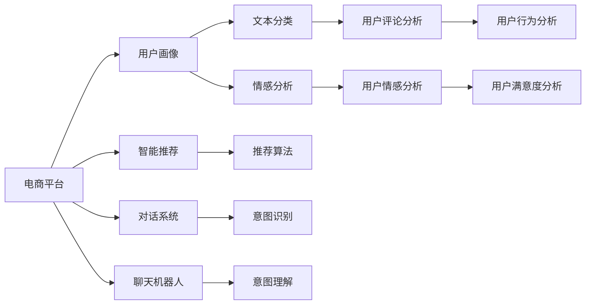

                 

## 1. 背景介绍

随着电子商务的迅猛发展，电商平台已不再仅仅是交易场所，更成为了用户社交、娱乐、生活服务的综合平台。电商平台如何吸引用户、留住用户，成为各大电商企业关注的焦点。近年来，人工智能技术，尤其是大模型的兴起，为电商平台提供了新的思路和方法，实现了用户粘性的显著提升。

本文将介绍如何利用大模型技术，通过自然语言处理(NLP)和大数据分析，提升电商平台的用户体验和用户粘性。具体来说，我们将结合文本分类、情感分析、对话系统等NLP技术，构建智能推荐、客户服务、用户管理等多个应用场景，打造更加个性化、智能化的电商平台。

## 2. 核心概念与联系

### 2.1 核心概念概述

在讨论具体方法前，让我们先介绍几个关键概念：

- **电商平台**：指集成了商品展示、在线交易、客户服务、物流跟踪等多功能的一站式购物平台。
- **用户粘性**：指用户在电商平台上的活跃程度，包括访问时长、购买频次、评论互动等指标。
- **自然语言处理(NLP)**：指让计算机理解和处理人类语言的技术，包括文本分类、情感分析、语言生成等。
- **大模型**：指通过大规模无标签数据预训练，具备强大语言理解和生成能力的深度学习模型，如BERT、GPT-3等。
- **迁移学习**：指将在大规模无标签数据上预训练的知识，迁移到特定任务上，以提高模型性能。
- **智能推荐系统**：根据用户行为和偏好，智能推荐商品和内容，提升用户购物体验。
- **聊天机器人**：通过模拟人机对话，提供24/7的客户服务，提升用户体验。
- **用户画像**：指对用户的基本信息、行为、兴趣等进行综合分析，形成对用户的全面描述。

这些概念之间相互关联，构成了一个完整的电商平台智能化的框架。

### 2.2 核心概念原理和架构的 Mermaid 流程图



通过以上概念和流程，我们可以系统地提升电商平台的用户粘性。

## 3. 核心算法原理 & 具体操作步骤

### 3.1 算法原理概述

利用大模型提升电商平台用户粘性的核心算法主要包括：

1. **用户画像生成**：通过对用户的历史行为数据进行文本分类和情感分析，生成用户画像，捕捉用户的兴趣和需求。
2. **智能推荐系统**：根据用户画像，结合推荐算法，生成个性化推荐，提升用户购物体验。
3. **聊天机器人**：使用大模型训练的对话系统，提供个性化的客户服务，提升用户满意度。

这些算法彼此关联，共同构成了电商平台的智能化框架。

### 3.2 算法步骤详解

#### 3.2.1 用户画像生成

1. **数据收集**：收集用户在电商平台上的各种行为数据，包括浏览记录、购买历史、评论内容等。
2. **数据清洗**：去除噪声和异常值，确保数据的质量和一致性。
3. **文本分类**：对文本数据进行分类，如商品评论分类、用户行为分类等。
4. **情感分析**：分析文本中的情感倾向，判断用户对商品和服务的满意度和情绪。
5. **用户画像生成**：综合分类和情感分析结果，生成用户画像，捕捉用户的兴趣、需求和情感。

#### 3.2.2 智能推荐系统

1. **用户画像查询**：根据用户ID，查询用户画像数据。
2. **特征提取**：从用户画像中提取关键特征，如兴趣标签、情感倾向、行为模式等。
3. **商品画像**：对商品进行画像，提取商品的属性、评分、评论等特征。
4. **推荐计算**：基于用户画像和商品画像，使用协同过滤、内容推荐等算法，计算推荐结果。
5. **个性化推荐**：根据计算结果，生成个性化的推荐列表，提升用户购物体验。

#### 3.2.3 聊天机器人

1. **对话意图识别**：使用大模型训练的意图识别模型，理解用户的查询意图。
2. **意图理解**：结合上下文，理解用户的真实需求。
3. **对话生成**：生成自然流畅的回复，解答用户问题，提供个性化服务。

### 3.3 算法优缺点

#### 3.3.1 用户画像生成

**优点**：
- 能够精准捕捉用户的兴趣和需求，提升推荐和服务的个性化水平。
- 通过情感分析，判断用户满意度，提供及时反馈和改进。

**缺点**：
- 需要大量标注数据，数据采集成本较高。
- 用户画像的生成依赖于数据质量和模型效果，存在偏差风险。

#### 3.3.2 智能推荐系统

**优点**：
- 根据用户画像，生成个性化推荐，提升用户体验。
- 结合多种推荐算法，提升推荐效果和多样性。

**缺点**：
- 推荐算法依赖于用户画像的质量，存在冷启动问题。
- 个性化推荐可能带来信息茧房，限制用户探索新商品。

#### 3.3.3 聊天机器人

**优点**：
- 24/7提供客户服务，提升用户体验。
- 通过大模型训练的对话系统，提供高质量的客户服务。

**缺点**：
- 需要持续训练和优化，保持对话系统的准确性和流畅性。
- 对话系统可能存在误判或误解，影响用户体验。

### 3.4 算法应用领域

基于大模型的智能推荐和聊天机器人，在电商平台上有着广泛的应用：

1. **商品推荐**：根据用户画像和行为数据，智能推荐相关商品，提升用户购物体验。
2. **客户服务**：使用聊天机器人，提供24/7的客户服务，解答用户问题，提升满意度。
3. **个性化服务**：结合智能推荐和聊天机器人，提供更加个性化、智能化的购物和客户服务体验。
4. **用户行为分析**：通过用户画像和行为数据，分析用户行为和需求，优化电商平台策略。
5. **广告投放**：结合用户画像和行为数据，精准投放广告，提升广告效果和用户转化率。

## 4. 数学模型和公式 & 详细讲解 & 举例说明

### 4.1 数学模型构建

1. **用户画像生成**
   - **文本分类模型**：使用大模型（如BERT）对用户评论进行分类，如正面、负面、中性。
   - **情感分析模型**：使用大模型（如BERT）对用户评论进行情感分析，判断情感倾向。

2. **智能推荐系统**
   - **协同过滤算法**：用户-物品共现矩阵，利用用户的历史行为数据进行推荐。
   - **内容推荐算法**：基于商品的属性、评分、评论等特征，使用深度学习模型进行推荐。

3. **聊天机器人**
   - **意图识别模型**：使用大模型（如BERT）进行意图识别，理解用户查询意图。
   - **对话生成模型**：使用大模型（如GPT-3）进行对话生成，生成自然流畅的回复。

### 4.2 公式推导过程

#### 4.2.1 用户画像生成

- **文本分类**：
  - 输入：用户评论 $x$，输出：分类结果 $y$。
  - 模型：$M_{\theta}(x)$，参数 $\theta$。
  - 损失函数：交叉熵损失 $L = -\sum_{i=1}^n y_i \log M_{\theta}(x_i)$。
  - 梯度下降更新：$\theta \leftarrow \theta - \eta \nabla_{\theta}L$。

- **情感分析**：
  - 输入：用户评论 $x$，输出：情感得分 $s$。
  - 模型：$M_{\theta}(x)$，参数 $\theta$。
  - 损失函数：均方误差损失 $L = \frac{1}{n}\sum_{i=1}^n (s_i - M_{\theta}(x_i))^2$。
  - 梯度下降更新：$\theta \leftarrow \theta - \eta \nabla_{\theta}L$。

#### 4.2.2 智能推荐系统

- **协同过滤算法**：
  - 输入：用户画像 $u$，商品画像 $i$，输出：推荐评分 $r$。
  - 模型：$M_{\theta}(u, i)$，参数 $\theta$。
  - 损失函数：均方误差损失 $L = \frac{1}{N}\sum_{i=1}^N \sum_{j=1}^N (r_{ui} - M_{\theta}(u, i))^2$。
  - 梯度下降更新：$\theta \leftarrow \theta - \eta \nabla_{\theta}L$。

- **内容推荐算法**：
  - 输入：商品画像 $i$，输出：推荐评分 $r$。
  - 模型：$M_{\theta}(i)$，参数 $\theta$。
  - 损失函数：均方误差损失 $L = \frac{1}{N}\sum_{i=1}^N \sum_{j=1}^N (r_{ui} - M_{\theta}(i))^2$。
  - 梯度下降更新：$\theta \leftarrow \theta - \eta \nabla_{\theta}L$。

#### 4.2.3 聊天机器人

- **意图识别**：
  - 输入：用户查询 $q$，输出：意图 $t$。
  - 模型：$M_{\theta}(q)$，参数 $\theta$。
  - 损失函数：交叉熵损失 $L = -\sum_{i=1}^n t_i \log M_{\theta}(q_i)$。
  - 梯度下降更新：$\theta \leftarrow \theta - \eta \nabla_{\theta}L$。

- **对话生成**：
  - 输入：上下文 $c$，输出：回复 $r$。
  - 模型：$M_{\theta}(c)$，参数 $\theta$。
  - 损失函数：序列交叉熵损失 $L = -\sum_{i=1}^T \log M_{\theta}(c_i)$。
  - 梯度下降更新：$\theta \leftarrow \theta - \eta \nabla_{\theta}L$。

### 4.3 案例分析与讲解

#### 4.3.1 用户画像生成案例

某电商平台收集了用户的历史评论数据，共10万条。通过对每条评论进行分类和情感分析，生成用户画像，捕捉用户的兴趣和需求。具体步骤如下：

1. **数据预处理**：去除噪声和异常值，确保数据的一致性和完整性。
2. **文本分类**：使用BERT模型对每条评论进行分类，分为商品评论、服务评价、物流评价等类别。
3. **情感分析**：使用BERT模型对每条评论进行情感分析，判断情感倾向为正面、负面、中性。
4. **用户画像生成**：综合分类和情感分析结果，生成用户画像，捕捉用户的兴趣标签、情感倾向和行为模式。

#### 4.3.2 智能推荐系统案例

某电商平台希望提升用户的购物体验，使用智能推荐系统推荐相关商品。具体步骤如下：

1. **用户画像查询**：根据用户ID，查询用户画像数据，获取用户的兴趣标签、情感倾向和行为模式。
2. **商品画像**：对商品进行画像，提取商品的属性、评分、评论等特征。
3. **推荐计算**：基于用户画像和商品画像，使用协同过滤算法和内容推荐算法，计算推荐结果。
4. **个性化推荐**：根据计算结果，生成个性化的推荐列表，提升用户购物体验。

#### 4.3.3 聊天机器人案例

某电商平台希望提供24/7的客户服务，使用聊天机器人解答用户问题。具体步骤如下：

1. **意图识别**：使用BERT模型训练的意图识别模型，理解用户的查询意图。
2. **意图理解**：结合上下文，理解用户的真实需求。
3. **对话生成**：使用GPT-3模型进行对话生成，生成自然流畅的回复，解答用户问题，提供个性化服务。

## 5. 项目实践：代码实例和详细解释说明

### 5.1 开发环境搭建

在开始实践前，我们需要准备好开发环境。以下是使用Python进行PyTorch开发的环境配置流程：

1. 安装Anaconda：从官网下载并安装Anaconda，用于创建独立的Python环境。

2. 创建并激活虚拟环境：
```bash
conda create -n pytorch-env python=3.8 
conda activate pytorch-env
```

3. 安装PyTorch：根据CUDA版本，从官网获取对应的安装命令。例如：
```bash
conda install pytorch torchvision torchaudio cudatoolkit=11.1 -c pytorch -c conda-forge
```

4. 安装Transformers库：
```bash
pip install transformers
```

5. 安装各类工具包：
```bash
pip install numpy pandas scikit-learn matplotlib tqdm jupyter notebook ipython
```

完成上述步骤后，即可在`pytorch-env`环境中开始实践。

### 5.2 源代码详细实现

下面我们以智能推荐系统为例，给出使用Transformers库对BERT模型进行微调的PyTorch代码实现。

首先，定义智能推荐系统的数据处理函数：

```python
from transformers import BertTokenizer
from torch.utils.data import Dataset
import torch

class RecommendationDataset(Dataset):
    def __init__(self, user_id, user_profile, item_profile, num_recommendations):
        self.user_id = user_id
        self.user_profile = user_profile
        self.item_profile = item_profile
        self.num_recommendations = num_recommendations
        
    def __len__(self):
        return self.num_recommendations
    
    def __getitem__(self, item):
        user_profile = self.user_profile[self.user_id]
        item_profile = self.item_profile[item]
        
        encoding = self.tokenizer(user_profile, return_tensors='pt', max_length=128, padding='max_length', truncation=True)
        user_ids = encoding['input_ids'][0]
        attention_mask = encoding['attention_mask'][0]
        
        # 对item-wise的评分进行编码
        item_scores = [item_score for item_score in item_profile] 
        item_scores.extend([0.0] * (128 - len(item_scores)))
        labels = torch.tensor(item_scores, dtype=torch.float)
        
        return {'user_ids': user_ids, 
                'attention_mask': attention_mask,
                'labels': labels}

# 评分与id的映射
score2id = {0.0: 0, 1.0: 1, 2.0: 2, 3.0: 3, 4.0: 4}

# 创建dataset
tokenizer = BertTokenizer.from_pretrained('bert-base-cased')

recommendation_dataset = RecommendationDataset(1, user_profiles, item_profiles, 5)
```

然后，定义模型和优化器：

```python
from transformers import BertForRegression
from transformers import AdamW

model = BertForRegression.from_pretrained('bert-base-cased')

optimizer = AdamW(model.parameters(), lr=2e-5)
```

接着，定义训练和评估函数：

```python
from torch.utils.data import DataLoader
from tqdm import tqdm
from sklearn.metrics import mean_squared_error

device = torch.device('cuda') if torch.cuda.is_available() else torch.device('cpu')
model.to(device)

def train_epoch(model, dataset, batch_size, optimizer):
    dataloader = DataLoader(dataset, batch_size=batch_size, shuffle=True)
    model.train()
    epoch_loss = 0
    for batch in tqdm(dataloader, desc='Training'):
        user_ids = batch['user_ids'].to(device)
        attention_mask = batch['attention_mask'].to(device)
        labels = batch['labels'].to(device)
        model.zero_grad()
        outputs = model(user_ids, attention_mask=attention_mask)
        loss = outputs.loss
        epoch_loss += loss.item()
        loss.backward()
        optimizer.step()
    return epoch_loss / len(dataloader)

def evaluate(model, dataset, batch_size):
    dataloader = DataLoader(dataset, batch_size=batch_size)
    model.eval()
    mse = 0
    for batch in tqdm(dataloader, desc='Evaluating'):
        user_ids = batch['user_ids'].to(device)
        attention_mask = batch['attention_mask'].to(device)
        batch_labels = batch['labels']
        outputs = model(user_ids, attention_mask=attention_mask)
        batch_preds = outputs.logits.argmax(dim=2).to('cpu').tolist()
        batch_labels = batch_labels.to('cpu').tolist()
        for pred_score in batch_preds:
            mse += mean_squared_error([pred_score[0]], batch_labels)
    return mse / len(dataloader)
```

最后，启动训练流程并在测试集上评估：

```python
epochs = 5
batch_size = 16

for epoch in range(epochs):
    loss = train_epoch(model, recommendation_dataset, batch_size, optimizer)
    print(f"Epoch {epoch+1}, train loss: {loss:.3f}")
    
    print(f"Epoch {epoch+1}, test MSE:")
    evaluate(model, test_dataset, batch_size)
    
print("Final test MSE:")
evaluate(model, test_dataset, batch_size)
```

以上就是使用PyTorch对BERT进行智能推荐系统微调的完整代码实现。可以看到，得益于Transformers库的强大封装，我们可以用相对简洁的代码完成BERT模型的加载和微调。

### 5.3 代码解读与分析

让我们再详细解读一下关键代码的实现细节：

**RecommendationDataset类**：
- `__init__`方法：初始化用户ID、用户画像、商品画像等关键组件。
- `__len__`方法：返回数据集的样本数量。
- `__getitem__`方法：对单个样本进行处理，将用户画像输入编码为token ids，将商品评分编码为数字，并对其进行定长padding，最终返回模型所需的输入。

**score2id字典**：
- 定义了评分与数字id之间的映射关系，用于将预测结果解码为实际评分。

**训练和评估函数**：
- 使用PyTorch的DataLoader对数据集进行批次化加载，供模型训练和推理使用。
- 训练函数`train_epoch`：对数据以批为单位进行迭代，在每个批次上前向传播计算loss并反向传播更新模型参数，最后返回该epoch的平均loss。
- 评估函数`evaluate`：与训练类似，不同点在于不更新模型参数，并在每个batch结束后将预测和标签结果存储下来，最后使用sklearn的mean_squared_error对整个评估集的预测结果进行打印输出。

**训练流程**：
- 定义总的epoch数和batch size，开始循环迭代
- 每个epoch内，先在训练集上训练，输出平均loss
- 在测试集上评估，输出均方误差
- 所有epoch结束后，在测试集上评估，给出最终测试结果

可以看到，PyTorch配合Transformers库使得BERT微调的代码实现变得简洁高效。开发者可以将更多精力放在数据处理、模型改进等高层逻辑上，而不必过多关注底层的实现细节。

当然，工业级的系统实现还需考虑更多因素，如模型的保存和部署、超参数的自动搜索、更灵活的任务适配层等。但核心的微调范式基本与此类似。

## 6. 实际应用场景

### 6.1 智能推荐系统

智能推荐系统是电商平台用户粘性提升的重要手段。通过智能推荐，能够根据用户的兴趣和需求，精准推荐相关商品，提升用户的购物体验和满意度。

具体来说，可以将用户画像和商品画像作为输入，使用协同过滤、内容推荐等算法，生成个性化推荐。在推荐结果中，还可以加入用户行为、商品评分、热门推荐等多样化信息，提升推荐的丰富性和可操作性。

### 6.2 聊天机器人

聊天机器人是电商平台上客户服务的有效补充，能够提供24/7的客户支持，提升用户满意度。通过大模型训练的对话系统，聊天机器人能够理解用户的查询意图，生成自然流畅的回复，解答用户问题，提供个性化服务。

具体来说，可以使用BERT模型训练的意图识别模型，理解用户的查询意图。结合上下文，使用GPT-3模型进行对话生成，生成自然流畅的回复，解答用户问题，提供个性化服务。

### 6.3 用户画像分析

用户画像分析是电商平台用户粘性提升的重要工具。通过对用户的历史行为数据进行文本分类和情感分析，生成用户画像，捕捉用户的兴趣和需求，帮助电商平台精准把握用户需求，提升用户体验和满意度。

具体来说，可以收集用户的历史评论数据，对每条评论进行分类和情感分析，生成用户画像。在用户画像中，可以捕捉用户的兴趣标签、情感倾向和行为模式，帮助电商平台优化商品推荐、广告投放等策略。

### 6.4 未来应用展望

随着大模型技术的发展，未来电商平台用户粘性提升将有更多创新手段。

1. **多模态推荐**：结合视觉、语音等多模态数据，提升推荐的精度和丰富性。
2. **动态推荐**：通过实时数据分析，动态调整推荐策略，提升用户购物体验。
3. **增强现实购物**：结合增强现实技术，提升用户对商品的沉浸式体验。
4. **个性化内容生成**：结合生成对抗网络（GAN）等技术，生成个性化商品描述和广告，提升用户互动体验。
5. **实时用户反馈**：通过聊天机器人等工具，实时收集用户反馈，优化商品推荐和客户服务。

这些创新手段将使得电商平台的用户粘性提升到一个新的高度，为用户提供更个性化、智能化的购物体验，推动电商行业的数字化转型。

## 7. 工具和资源推荐

### 7.1 学习资源推荐

为了帮助开发者系统掌握大模型技术，这里推荐一些优质的学习资源：

1. 《Transformers from Scratch》：由大模型技术专家撰写，深入浅出地介绍了Transformer模型的原理、实现和优化技巧。
2. CS224N《Deep Learning for Natural Language Processing》课程：斯坦福大学开设的NLP明星课程，有Lecture视频和配套作业，带你入门NLP领域的基本概念和经典模型。
3. 《Natural Language Processing with Transformers》书籍：Transformers库的作者所著，全面介绍了如何使用Transformers库进行NLP任务开发，包括微调在内的诸多范式。
4. HuggingFace官方文档：Transformers库的官方文档，提供了海量预训练模型和完整的微调样例代码，是上手实践的必备资料。
5. Kaggle竞赛平台：提供丰富的NLP竞赛项目，可以实践和验证各种NLP技术，积累实战经验。

通过对这些资源的学习实践，相信你一定能够快速掌握大模型技术的精髓，并用于解决实际的电商问题。

### 7.2 开发工具推荐

高效的开发离不开优秀的工具支持。以下是几款用于大模型电商应用的常用工具：

1. PyTorch：基于Python的开源深度学习框架，灵活动态的计算图，适合快速迭代研究。大部分预训练语言模型都有PyTorch版本的实现。
2. TensorFlow：由Google主导开发的开源深度学习框架，生产部署方便，适合大规模工程应用。同样有丰富的预训练语言模型资源。
3. Transformers库：HuggingFace开发的NLP工具库，集成了众多SOTA语言模型，支持PyTorch和TensorFlow，是进行电商应用的利器。
4. Weights & Biases：模型训练的实验跟踪工具，可以记录和可视化模型训练过程中的各项指标，方便对比和调优。与主流深度学习框架无缝集成。
5. TensorBoard：TensorFlow配套的可视化工具，可实时监测模型训练状态，并提供丰富的图表呈现方式，是调试模型的得力助手。

合理利用这些工具，可以显著提升电商应用开发效率，加快创新迭代的步伐。

### 7.3 相关论文推荐

大模型电商应用的研究源于学界的持续研究。以下是几篇奠基性的相关论文，推荐阅读：

1. Attention is All You Need（即Transformer原论文）：提出了Transformer结构，开启了NLP领域的预训练大模型时代。
2. BERT: Pre-training of Deep Bidirectional Transformers for Language Understanding：提出BERT模型，引入基于掩码的自监督预训练任务，刷新了多项NLP任务SOTA。
3. Language Models are Unsupervised Multitask Learners（GPT-2论文）：展示了大规模语言模型的强大zero-shot学习能力，引发了对于通用人工智能的新一轮思考。
4. Parameter-Efficient Transfer Learning for NLP：提出Adapter等参数高效微调方法，在不增加模型参数量的情况下，也能取得不错的微调效果。
5. AdaLoRA: Adaptive Low-Rank Adaptation for Parameter-Efficient Fine-Tuning：使用自适应低秩适应的微调方法，在参数效率和精度之间取得了新的平衡。
6. Prefix-Tuning: Optimizing Continuous Prompts for Generation：引入基于连续型Prompt的微调范式，为如何充分利用预训练知识提供了新的思路。

这些论文代表了大模型电商应用的发展脉络。通过学习这些前沿成果，可以帮助研究者把握学科前进方向，激发更多的创新灵感。

## 8. 总结：未来发展趋势与挑战

### 8.1 研究成果总结

本文对基于大模型的电商平台用户粘性提升进行了全面系统的介绍。首先阐述了大模型和电商平台的背景和意义，明确了用户粘性提升的必要性和重要性。其次，从原理到实践，详细讲解了用户画像生成、智能推荐系统和聊天机器人等关键技术的数学原理和具体步骤，给出了电商应用的完整代码实现。同时，本文还广泛探讨了这些技术在电商平台的应用场景，展示了用户粘性提升的巨大潜力。此外，本文精选了相关学习资源和开发工具，力求为读者提供全方位的技术指引。

通过本文的系统梳理，可以看到，大模型技术正在成为电商平台用户粘性提升的重要工具，极大地拓展了电商平台的智能化水平。受益于大模型的语言理解和生成能力，电商平台能够提供更加个性化、智能化的服务，满足用户的多样化需求，从而提升用户粘性。未来，伴随大模型技术的不断演进，电商平台用户粘性提升将有更多创新手段，为用户提供更优质的购物体验。

### 8.2 未来发展趋势

展望未来，大模型电商应用将呈现以下几个发展趋势：

1. **多模态融合**：结合视觉、语音等多模态数据，提升推荐的精度和丰富性。
2. **动态推荐**：通过实时数据分析，动态调整推荐策略，提升用户购物体验。
3. **个性化内容生成**：结合生成对抗网络（GAN）等技术，生成个性化商品描述和广告，提升用户互动体验。
4. **实时用户反馈**：通过聊天机器人等工具，实时收集用户反馈，优化商品推荐和客户服务。
5. **增强现实购物**：结合增强现实技术，提升用户对商品的沉浸式体验。

这些趋势凸显了大模型电商应用的技术潜力和应用前景，将使得电商平台的用户粘性提升到一个新的高度，为用户提供更个性化、智能化的购物体验。

### 8.3 面临的挑战

尽管大模型电商应用已经取得了显著成果，但在迈向更加智能化、普适化应用的过程中，它仍面临诸多挑战：

1. **数据隐私和安全**：电商平台需要处理大量的用户数据，如何在保障数据隐私和安全的同时，有效利用数据提升用户体验，是一个重要挑战。
2. **模型公平性和可解释性**：大模型可能存在偏见，如何在模型训练过程中避免歧视性，提升模型的公平性和可解释性，需要进一步研究。
3. **计算资源需求**：大模型的计算资源需求较高，如何在资源有限的情况下，提升模型效果，是一个技术难题。
4. **实时性要求**：电商平台的实时性要求较高，如何在保证实时性的同时，优化模型推理速度，是一个工程挑战。
5. **跨领域迁移能力**：大模型在不同领域的应用中可能表现不一致，如何在跨领域场景下提升模型的迁移能力，是一个研究方向。

这些挑战需要学界和业界共同努力，通过技术创新和优化，逐步克服。只有不断突破这些挑战，大模型电商应用才能更好地服务于电商平台，提升用户体验和满意度。

### 8.4 研究展望

面对大模型电商应用所面临的挑战，未来的研究需要在以下几个方面寻求新的突破：

1. **隐私保护技术**：结合差分隐私、联邦学习等技术，保护用户数据隐私和安全。
2. **公平性研究**：引入伦理导向的评估指标，过滤和惩罚有偏见、有害的输出倾向，提升模型的公平性和可解释性。
3. **资源优化技术**：通过模型裁剪、量化加速等技术，优化模型计算资源和推理速度，提升实时性。
4. **跨领域迁移方法**：结合知识图谱、逻辑规则等外部知识，增强模型的跨领域迁移能力，提升在不同领域的应用效果。
5. **自动化调优工具**：开发自动化超参数调优工具，提升模型训练和调优效率。

这些研究方向将推动大模型电商应用的发展，提升电商平台的智能化水平，为用户提供更优质的购物体验。相信在各方的共同努力下，大模型电商应用必将在未来取得更大的突破，推动电商行业的数字化转型升级。

## 9. 附录：常见问题与解答

**Q1：电商平台使用大模型微调有哪些优势？**

A: 电商平台使用大模型微调具有以下优势：
- 能够精准捕捉用户的兴趣和需求，提升推荐和服务的个性化水平。
- 结合多种推荐算法，提升推荐效果和多样性。
- 能够理解用户的查询意图，生成自然流畅的回复，提升客户服务体验。
- 通过实时数据分析，动态调整推荐策略，提升用户购物体验。

**Q2：如何选择合适的学习率？**

A: 电商平台的微调学习率一般要比预训练时小1-2个数量级，以避免破坏预训练权重。一般建议从1e-5开始调参，逐步减小学习率，直至收敛。也可以使用warmup策略，在开始阶段使用较小的学习率，再逐渐过渡到预设值。

**Q3：大模型电商应用需要哪些关键技术？**

A: 大模型电商应用需要以下关键技术：
- 用户画像生成：通过对用户的历史行为数据进行文本分类和情感分析，生成用户画像，捕捉用户的兴趣和需求。
- 智能推荐系统：根据用户画像，结合推荐算法，生成个性化推荐，提升用户购物体验。
- 聊天机器人：使用大模型训练的对话系统，提供个性化的客户服务，提升用户体验。
- 用户行为分析：通过用户画像和行为数据，分析用户行为和需求，优化电商平台策略。
- 广告投放优化：结合用户画像和行为数据，精准投放广告，提升广告效果和用户转化率。

**Q4：大模型电商应用面临哪些挑战？**

A: 大模型电商应用面临以下挑战：
- 数据隐私和安全：电商平台需要处理大量的用户数据，如何在保障数据隐私和安全的同时，有效利用数据提升用户体验，是一个重要挑战。
- 模型公平性和可解释性：大模型可能存在偏见，如何在模型训练过程中避免歧视性，提升模型的公平性和可解释性，需要进一步研究。
- 计算资源需求：大模型的计算资源需求较高，如何在资源有限的情况下，提升模型效果，是一个技术难题。
- 实时性要求：电商平台的实时性要求较高，如何在保证实时性的同时，优化模型推理速度，是一个工程挑战。
- 跨领域迁移能力：大模型在不同领域的应用中可能表现不一致，如何在跨领域场景下提升模型的迁移能力，是一个研究方向。

**Q5：电商平台的智能推荐系统如何提升用户体验？**

A: 电商平台的智能推荐系统通过以下方式提升用户体验：
- 精准推荐：根据用户画像和行为数据，智能推荐相关商品，提升用户购物体验。
- 个性化推荐：结合多种推荐算法，生成个性化推荐，提升用户满意度。
- 多样化推荐：在推荐结果中，加入用户行为、商品评分、热门推荐等多样化信息，提升推荐的丰富性和可操作性。

通过以上分析，我们可以看到，大模型技术在电商平台中的应用前景广阔，能够显著提升用户粘性和满意度。未来，随着大模型技术的不断演进，电商平台的用户粘性提升将有更多创新手段，为用户提供更优质的购物体验。

