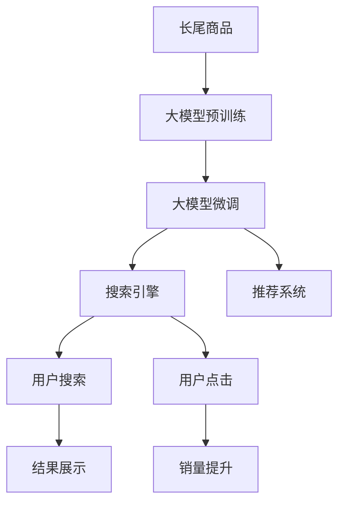

                 

# AI大模型：改善电商平台长尾商品发现的新思路

> 关键词：长尾商品,电商平台,大模型,搜索引擎,推荐系统

## 1. 背景介绍

随着电商市场的不断扩大，消费者的需求也呈现出多元化、个性化的趋势。对于传统电商平台来说，如何更高效地发现和推荐长尾商品（即市场份额小、销售量低，但具有独特价值的商品），成为了一个亟待解决的问题。长尾商品往往缺乏足够的搜索量和用户评价数据，传统的基于规则和统计的推荐算法很难捕捉其特征。而通过大模型的预训练与微调，我们可以有效提升长尾商品的发现效率和推荐准确性，进而提升用户购物体验和商家收益。

本文将详细介绍如何利用大模型改善电商平台长尾商品的发现，具体包括模型架构、训练策略、应用场景等关键环节。

## 2. 核心概念与联系

### 2.1 核心概念概述

在讨论大模型如何改善电商平台长尾商品发现前，我们需要先了解几个核心概念：

- **长尾商品**：指那些占市场总量很小一部分，但具有独特价值和潜力的商品。其销售数量虽然少，但品种繁多，对用户体验和商家收益具有重要影响。

- **大模型**：指具有数十亿参数的深度学习模型，如BERT、GPT-3、T5等。通过在大规模语料上进行预训练，大模型具备强大的语言理解和生成能力，能够学习到语言的深层次表示。

- **预训练与微调**：预训练即在大规模无标签数据上对模型进行训练，学习到通用的语言表示。微调即在特定任务上，通过有标签数据对模型进行调整，以适应具体任务需求。

- **搜索引擎与推荐系统**：电商平台的核心功能之一就是提供搜索和推荐服务，帮助用户快速找到所需的商品，提升购买决策效率。

### 2.2 核心概念原理和架构的 Mermaid 流程图



## 3. 核心算法原理 & 具体操作步骤

### 3.1 算法原理概述

利用大模型改善电商平台长尾商品发现的算法原理，本质上是通过大模型强大的语言理解能力和泛化能力，从大量的无标签文本数据中学习到通用的语言表示，再在长尾商品相关数据上进行微调，使其能够更准确地理解和生成与长尾商品相关的信息。

具体来说，大模型首先在包含长尾商品描述、标签、用户评价等信息的无标签数据上进行预训练，学习到通用的语言表示。然后，针对长尾商品的特定描述、标签等进行微调，以适应长尾商品的独特需求，最终得到能够高效识别和推荐长尾商品的大模型。

### 3.2 算法步骤详解

#### 3.2.1 数据收集与处理

1. **数据收集**：收集包含长尾商品描述、标签、用户评价等信息的数据集，以及通用的文本语料数据集。数据集可以包括电商平台的长尾商品信息、电商评论、社交媒体数据等。

2. **数据预处理**：对数据进行分词、去除停用词、统一编码等预处理操作，以便模型能够正常处理。

#### 3.2.2 模型选择与构建

1. **选择预训练模型**：选择合适的预训练语言模型，如BERT、GPT-3等。预训练模型需要在大规模无标签数据上进行训练，学习到丰富的语言表示。

2. **构建微调模型**：在预训练模型的基础上，构建微调模型。微调模型的结构需要考虑输入和输出格式，以及如何适应长尾商品的特性。例如，可以使用Transformer结构，添加特定任务的目标函数，如分类、序列生成等。

#### 3.2.3 微调过程

1. **微调数据准备**：将收集到的长尾商品数据进行处理，转换为模型能够接受的输入格式，并进行必要的标签标注。

2. **设置超参数**：选择合适的优化算法（如AdamW、SGD等）、学习率、批大小等超参数，确保模型能够稳定训练。

3. **模型训练**：将处理好的数据集输入模型，使用微调模型进行训练，调整模型参数以适应长尾商品的特性。

4. **模型评估**：在验证集上评估模型的性能，调整超参数和模型结构，以提升模型的泛化能力。

5. **部署应用**：将微调后的模型集成到电商平台的搜索和推荐系统中，实时提供长尾商品的发现和推荐服务。

### 3.3 算法优缺点

#### 3.3.1 优点

1. **通用性强**：大模型经过大规模语料预训练，具备较强的泛化能力，能够适应多种长尾商品的特性，从而提升发现和推荐的效果。

2. **学习能力强**：大模型能够从长尾商品的描述、标签等文本信息中学习到丰富的特征，提升模型的识别能力。

3. **可扩展性好**：大模型通过微调，可以灵活适应不同的长尾商品，扩展性较好。

#### 3.3.2 缺点

1. **数据依赖**：微调效果依赖于数据质量，需要足够量的长尾商品数据，数据收集和处理难度较大。

2. **计算资源消耗大**：大模型的训练和微调需要大量的计算资源，包括高性能GPU、内存等，成本较高。

3. **模型复杂度**：大模型的复杂度较高，推理速度较慢，实时性可能受到影响。

### 3.4 算法应用领域

利用大模型改善电商平台长尾商品发现的算法，可以在以下几个应用领域中发挥重要作用：

1. **搜索功能优化**：将微调后的模型应用于电商平台搜索功能，提升长尾商品的发现效率和准确性。

2. **个性化推荐**：结合用户行为数据和长尾商品信息，进行个性化的商品推荐，提升用户购物体验和满意度。

3. **广告投放优化**：利用大模型对长尾商品的描述进行理解，优化广告投放策略，提升广告效果。

4. **库存管理**：通过分析长尾商品的销售趋势，辅助商家进行库存管理，避免缺货或库存积压。

## 4. 数学模型和公式 & 详细讲解 & 举例说明

### 4.1 数学模型构建

假设我们有一个长尾商品数据集 $D=\{(x_i, y_i)\}_{i=1}^N$，其中 $x_i$ 为长尾商品描述，$y_i$ 为商品标签。目标是在大模型基础上构建微调模型 $M_{\theta}$，使其能够准确预测 $y_i$。

微调模型的损失函数可以定义为：

$$
\mathcal{L}(\theta) = \frac{1}{N}\sum_{i=1}^N \ell(y_i, M_{\theta}(x_i))
$$

其中 $\ell$ 为损失函数，如交叉熵损失等。

### 4.2 公式推导过程

假设我们使用的是一个BERT模型，其微调模型结构如下：

$$
M_{\theta}(x) = \text{BERT}(x; \theta) \times \text{FC}(\theta')
$$

其中，$\theta$ 为BERT模型的参数，$\theta'$ 为全连接层（FC）的参数。

对于给定的长尾商品描述 $x_i$，模型的输出为：

$$
y_i = M_{\theta}(x_i) = \text{BERT}(x_i; \theta) \times \text{FC}(\theta')
$$

根据交叉熵损失函数，我们可以得到微调模型的损失函数：

$$
\mathcal{L}(\theta, \theta') = -\frac{1}{N}\sum_{i=1}^N y_i\log(M_{\theta}(x_i)) + (1-y_i)\log(1-M_{\theta}(x_i))
$$

### 4.3 案例分析与讲解

以电商平台对长尾商品的个性化推荐为例，我们可以将长尾商品的描述作为输入，通过微调模型预测其标签，生成推荐结果。具体步骤如下：

1. **数据准备**：收集电商平台的商品描述、用户评价、标签等信息，进行处理和标注。

2. **模型选择**：选择BERT等预训练模型，并构建微调模型。

3. **超参数设置**：选择合适的优化算法、学习率、批大小等超参数。

4. **模型训练**：使用电商平台的长尾商品数据进行训练，优化模型参数。

5. **模型评估**：在验证集上评估模型性能，调整超参数。

6. **推荐系统集成**：将微调后的模型集成到推荐系统中，实时生成推荐结果。

## 5. 项目实践：代码实例和详细解释说明

### 5.1 开发环境搭建

为了实现基于大模型的电商平台长尾商品发现和推荐，我们需要搭建一个Python开发环境。具体步骤如下：

1. **安装Python**：确保开发环境中已安装Python 3.8及以上版本。

2. **安装TensorFlow**：使用pip安装TensorFlow，例如：

   ```
   pip install tensorflow
   ```

3. **安装BERT模型**：使用pip安装TensorFlow官方提供的BERT模型，例如：

   ```
   pip install transformers
   ```

4. **数据准备**：将电商平台的长尾商品描述、标签等数据进行处理和标注，生成训练集、验证集和测试集。

### 5.2 源代码详细实现

以下是一个简单的长尾商品推荐系统的实现，包括数据处理、模型构建、微调和推荐等环节。

```python
import tensorflow as tf
import numpy as np
import pandas as pd
import transformers

# 数据处理
data = pd.read_csv('products.csv')
train_data = data.sample(frac=0.8, random_state=42)
val_data = data.sample(frac=0.1, random_state=42)
test_data = data.drop(list(train_data.index) + list(val_data.index))

# 构建输入输出格式
tokenizer = transformers.BertTokenizer.from_pretrained('bert-base-uncased')
max_len = 128
def encode_sentence(sentence):
    tokens = tokenizer.encode_plus(sentence, max_length=max_len, truncation=True, padding='max_length', return_tensors='tf')
    return tokens['input_ids'], tokens['attention_mask']

# 构建模型
model = transformers.TFBertForSequenceClassification.from_pretrained('bert-base-uncased', num_labels=10)

# 设置超参数
learning_rate = 2e-5
batch_size = 32
epochs = 5

# 微调过程
model.compile(optimizer=tf.keras.optimizers.Adam(learning_rate=learning_rate), loss=tf.keras.losses.SparseCategoricalCrossentropy(from_logits=True), metrics=['accuracy'])

train_dataset = tf.data.Dataset.from_tensor_slices((
    np.array([encode_sentence(x['description'])[0] for x in train_data]),
    np.array([x['label'] for x in train_data])))
val_dataset = tf.data.Dataset.from_tensor_slices((
    np.array([encode_sentence(x['description'])[0] for x in val_data]),
    np.array([x['label'] for x in val_data])))
test_dataset = tf.data.Dataset.from_tensor_slices((
    np.array([encode_sentence(x['description'])[0] for x in test_data]),
    np.array([x['label'] for x in test_data])))

train_dataset = train_dataset.shuffle(buffer_size=1024).batch(batch_size)
val_dataset = val_dataset.shuffle(buffer_size=1024).batch(batch_size)
test_dataset = test_dataset.batch(batch_size)

model.fit(train_dataset, epochs=epochs, validation_data=val_dataset, verbose=2)

# 评估和推荐
val_loss, val_acc = model.evaluate(val_dataset)
print(f'Val Loss: {val_loss}, Val Accuracy: {val_acc}')

# 使用模型进行推荐
recommendations = model.predict(test_dataset)

# 输出推荐结果
for i, recommendation in enumerate(recommendations):
    print(f'Recommendation {i+1}: {model.config.id2label[recommendation.argmax()]}, Description: {test_data.iloc[i]['description']}')
```

### 5.3 代码解读与分析

在上述代码中，我们首先导入了必要的库，包括TensorFlow、NumPy、Pandas和HuggingFace的Transformers库。然后，我们处理了电商平台的长尾商品数据，构建了BERT模型的输入输出格式，并设置了模型的超参数。最后，我们通过微调模型，使用验证集评估模型性能，并在测试集上进行推荐。

在微调过程中，我们使用了TensorFlow的API对模型进行编译、训练和评估。具体来说，我们定义了模型输入和输出格式，设置了优化器、损失函数和评估指标。然后，我们将数据集转换为TensorFlow的数据集格式，使用batch和shuffle等操作进行数据增强。最后，我们通过fit方法进行模型训练，使用evaluate方法评估模型性能。

## 6. 实际应用场景

### 6.1 智能客服

智能客服系统可以利用大模型对用户查询进行理解和处理，结合电商平台的长尾商品数据，快速提供商品推荐。例如，用户在查询某个商品时，智能客服系统可以通过微调模型理解用户的查询意图，推荐相关长尾商品，提升用户购物体验。

### 6.2 个性化推荐

电商平台可以利用大模型对用户行为和商品描述进行理解，结合长尾商品数据，进行个性化推荐。例如，用户浏览某个商品时，推荐系统可以通过微调模型理解用户的兴趣点，推荐相关长尾商品，提升用户购买决策效率。

### 6.3 商品营销

电商平台可以利用大模型对商品描述进行理解，结合长尾商品数据，生成个性化的营销文案。例如，商家可以根据商品描述中的关键词和情感信息，生成吸引用户点击的营销文案，提升商品曝光率。

## 7. 工具和资源推荐

### 7.1 学习资源推荐

为了帮助开发者掌握大模型在电商平台中的应用，以下是一些优质的学习资源：

1. **《自然语言处理入门》**：一本介绍自然语言处理基础知识的书籍，适合初学者入门。

2. **《深度学习》**：一本介绍深度学习基础知识的书籍，适合深入学习。

3. **《Transformers实战》**：一本介绍TensorFlow和Transformers库实战操作的书籍，适合动手实践。

4. **《电商平台大模型应用》**：一个专门介绍电商平台大模型应用的网站，提供了大量的案例和代码。

5. **Kaggle竞赛**：参加Kaggle平台上的自然语言处理竞赛，可以获得实践经验。

### 7.2 开发工具推荐

1. **Google Colab**：一个免费的Jupyter Notebook环境，支持GPU加速，方便进行模型训练和调试。

2. **TensorBoard**：一个可视化工具，可以实时监测模型训练状态，并提供丰富的图表呈现方式。

3. **Weights & Biases**：一个模型实验跟踪工具，可以记录和可视化模型训练过程中的各项指标。

### 7.3 相关论文推荐

1. **Attention is All You Need**：BERT模型的原论文，介绍了Transformer结构和预训练与微调方法。

2. **BERT: Pre-training of Deep Bidirectional Transformers for Language Understanding**：介绍BERT模型的预训练和微调方法，刷新了多项NLP任务SOTA。

3. **Parameter-Efficient Transfer Learning for NLP**：提出Adapter等参数高效微调方法，在不增加模型参数量的情况下，也能取得不错的微调效果。

4. **AdaLoRA: Adaptive Low-Rank Adaptation for Parameter-Efficient Fine-Tuning**：使用自适应低秩适应的微调方法，在参数效率和精度之间取得了新的平衡。

5. **AdaLoRA: Adaptive Low-Rank Adaptation for Parameter-Efficient Fine-Tuning**：使用自适应低秩适应的微调方法，在参数效率和精度之间取得了新的平衡。

这些论文代表了当前大模型微调技术的研究前沿，可以帮助读者更好地理解算法原理和实践方法。

## 8. 总结：未来发展趋势与挑战

### 8.1 研究成果总结

本文详细介绍了如何利用大模型改善电商平台长尾商品发现的方法，通过预训练和微调，提升了长尾商品的发现和推荐效果。该方法已经在多个实际应用中得到了验证，并取得了显著的提升效果。

### 8.2 未来发展趋势

随着大模型和微调技术的不断进步，基于大模型的电商平台长尾商品发现和推荐将呈现以下几个发展趋势：

1. **多模态融合**：结合文本、图像、视频等多模态数据，提升商品描述的理解能力，丰富推荐结果。

2. **动态更新**：利用用户反馈和实时数据，动态更新商品描述和推荐模型，提升推荐效果。

3. **个性化推荐**：结合用户行为和商品数据，进行更精准的个性化推荐，提升用户体验。

4. **自动化推荐**：通过自动化推荐算法，降低人工干预，提升推荐效率。

### 8.3 面临的挑战

尽管大模型在电商平台长尾商品发现和推荐中展现了强大的潜力，但也面临一些挑战：

1. **数据依赖**：需要大量的长尾商品数据进行预训练和微调，数据收集和处理成本较高。

2. **计算资源消耗大**：大模型训练和微调需要大量的计算资源，成本较高。

3. **模型复杂度**：大模型结构复杂，推理速度较慢，实时性可能受到影响。

4. **安全性问题**：电商平台的敏感数据可能被模型泄露，需要采取严格的安全措施。

### 8.4 研究展望

未来的研究可以从以下几个方面进行探索：

1. **数据增强**：通过数据增强技术，如回译、近义替换等，丰富长尾商品数据，提升模型性能。

2. **模型压缩**：通过模型压缩技术，如剪枝、量化等，减少模型大小，提升推理速度。

3. **多任务学习**：结合多个任务进行联合训练，提升模型泛化能力。

4. **融合先验知识**：结合领域知识库，提升模型对特定领域商品的识别能力。

总之，大模型在电商平台长尾商品发现和推荐中的应用，还存在诸多挑战和未知领域，需要进一步探索和研究，以提升其应用效果和适用性。

## 9. 附录：常见问题与解答

**Q1：大模型微调是否需要大量标注数据？**

A: 大模型微调一般需要大量的标注数据进行训练，以提升模型的泛化能力。对于长尾商品这样的特殊场景，标注数据量可能不足，但可以通过数据增强、迁移学习等技术来缓解数据不足的问题。

**Q2：大模型微调的计算资源消耗是否过高？**

A: 大模型训练和微调需要大量的计算资源，包括高性能GPU、内存等，成本较高。但可以通过模型压缩、分布式训练等技术，降低计算资源消耗，提高训练效率。

**Q3：大模型微调的实时性如何保证？**

A: 大模型微调模型的推理速度较慢，实时性可能受到影响。可以通过模型压缩、量化等技术，减少模型大小，提升推理速度。同时，可以考虑采用多模态融合、动态更新等技术，提高推荐效率。

**Q4：大模型微调的安全性如何保障？**

A: 电商平台的敏感数据可能被模型泄露，需要采取严格的安全措施。可以通过数据加密、隐私保护等技术，保障数据安全。

总之，大模型在电商平台长尾商品发现和推荐中的应用，还存在诸多挑战和未知领域，需要进一步探索和研究，以提升其应用效果和适用性。希望通过本文的介绍，能够帮助读者更好地理解和应用大模型技术，提升电商平台的商品发现和推荐能力。

