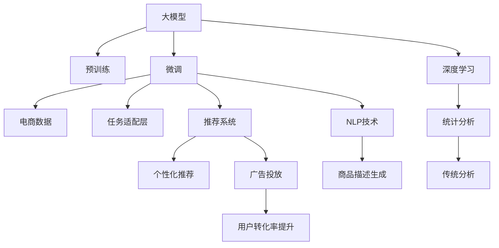

                 

# AI大模型：电商平台数据分析的新工具

> 关键词：大模型，自然语言处理(NLP), 电商平台, 数据分析, Transformers, BERT, 预训练, 微调, 深度学习, 推荐系统, 商品推荐

## 1. 背景介绍

### 1.1 问题由来
随着电商行业的发展，各大平台积累了大量的用户行为数据，这些数据蕴含着丰富的市场信息和消费者需求，具有巨大的商业价值。然而，如何高效地分析和利用这些数据，发现潜在的商业机会，成为了电商平台亟需解决的难题。传统的统计分析方法往往依赖人工经验，难以处理海量数据并捕捉深层次的消费者行为模式。为此，需要引入先进的人工智能技术，特别是基于深度学习的大模型，对电商平台的数据进行自动分析和预测。

### 1.2 问题核心关键点
电商平台数据分析的核心问题在于如何利用深度学习技术，特别是预训练语言模型，高效、准确地分析和挖掘用户行为数据，提供个性化的商品推荐、广告投放和客户服务支持。问题的解决关键在于：
- 选择合适的预训练语言模型。
- 设计合适的任务适配层，以适配电商平台的分析任务。
- 应用先进的微调技术，快速提升模型在电商数据分析任务上的性能。
- 综合利用电商领域的具体场景，优化模型参数和训练策略。

## 2. 核心概念与联系

### 2.1 核心概念概述

为了更好地理解如何在电商数据分析中应用大模型，我们先介绍几个核心概念：

- 大模型（Large Models）：如BERT、GPT等，通过在大规模无标签数据上进行预训练，学习通用的语言表示，具备强大的语言理解和生成能力。
- 预训练（Pre-training）：指在大规模无标签数据上，通过自监督学习任务训练通用语言模型的过程。常见的预训练任务包括掩码语言模型、下一个句子预测等。
- 微调（Fine-tuning）：指在预训练模型的基础上，使用有标签数据对模型进行优化，使其适应特定任务。
- 推荐系统（Recommender Systems）：利用用户行为数据，为用户推荐个性化商品或内容。
- 自然语言处理（Natural Language Processing, NLP）：利用计算机技术处理和分析自然语言，提供语义理解和生成能力。
- 电商数据（E-commerce Data）：包含用户行为、商品信息、交易记录等，是大模型分析的重要数据源。

这些核心概念之间的逻辑关系可以通过以下Mermaid流程图来展示：



这个流程图展示了大模型在电商平台数据分析中的应用路径：

1. 大模型通过预训练获得基础能力。
2. 微调过程优化模型以适应电商数据的特点。
3. 任务适配层为模型提供具体电商任务的目标函数。
4. 推荐系统利用微调后的模型，提供个性化推荐。
5. NLP技术辅助处理商品描述、用户评论等文本数据。
6. 深度学习与统计分析结合，实现更精准的电商平台数据分析。

## 3. 核心算法原理 & 具体操作步骤

### 3.1 算法原理概述

基于大模型的电商数据分析，本质上是利用深度学习模型，通过微调提升模型在特定电商任务上的表现。具体步骤如下：

1. 收集电商数据，包括用户行为记录、商品描述、交易记录等。
2. 选择适当的预训练语言模型，如BERT、GPT等。
3. 在电商数据上微调模型，适配特定任务，如商品推荐、用户画像构建等。
4. 应用微调后的模型，结合电商业务逻辑，进行商品推荐、广告投放等分析。

### 3.2 算法步骤详解

#### 3.2.1 数据准备

电商数据分析的关键在于数据的质量和多样性。以下是数据准备的一般流程：

1. 收集数据：收集电商平台的用户行为数据，包括点击、浏览、购买、评价等行为记录，以及商品描述、属性信息等。
2. 数据清洗：处理缺失值、异常值，去除噪声数据。
3. 特征工程：提取和构造有用特征，如商品类别、价格、用户兴趣等。
4. 数据划分：将数据划分为训练集、验证集和测试集。

#### 3.2.2 模型选择与适配

选择合适的预训练语言模型是电商数据分析的第一步。通常，可以选择通用的大型预训练模型，如BERT、GPT等，也可以专门为电商领域设计的预训练模型。

1. 通用大模型：如BERT，在大规模文本数据上进行预训练，适用于多种NLP任务。
2. 领域专用模型：如Text-2-WordNet，在特定领域的文本语料上进行预训练，更加适应电商数据的特点。

选择模型后，设计合适的任务适配层，将电商任务转换为预训练模型的可处理形式。例如，将商品推荐任务转换为预测商品点击率的分类任务。

#### 3.2.3 模型微调

微调过程是提升模型性能的关键步骤。以下是具体的微调流程：

1. 选择优化器：选择如Adam、SGD等优化器，并设置合适的学习率和迭代次数。
2. 设置正则化：使用L2正则、Dropout等技术，避免过拟合。
3. 数据增强：通过数据增强技术，丰富训练集，如数据扩充、对抗训练等。
4. 模型训练：在训练集上训练模型，定期在验证集上评估模型性能。
5. 模型测试：在测试集上测试模型性能，评估微调效果。

#### 3.2.4 分析与优化

微调后，需要根据评估结果进行进一步的优化。以下是一些常见的优化方法：

1. 参数剪枝：剪枝不重要的参数，减小模型大小，提高推理速度。
2. 量化加速：将浮点数计算转换为定点数计算，减小内存占用，提升计算效率。
3. 模型融合：将多个微调模型组合，提高预测准确性和鲁棒性。

### 3.3 算法优缺点

#### 3.3.1 优点

基于大模型的电商数据分析具有以下优点：

1. 高效性：利用深度学习模型的高效处理能力，快速分析大量数据。
2. 准确性：深度学习模型能够捕捉数据中的复杂非线性关系，提升分析结果的准确性。
3. 可解释性：深度学习模型的权重可以看作模型学到的知识，有助于理解模型决策过程。
4. 自适应：大模型可以适应电商领域特定的任务和数据分布。
5. 低门槛：用户只需提供数据和任务目标，无需深入了解模型内部工作原理。

#### 3.3.2 缺点

尽管基于大模型的电商数据分析具有诸多优势，但也存在一些不足：

1. 高资源消耗：深度学习模型对计算资源和存储空间的需求较大。
2. 数据依赖：模型性能依赖高质量的数据，数据缺失或噪声会影响模型效果。
3. 模型可解释性不足：深度学习模型通常被视为"黑盒"，难以解释其决策过程。
4. 过拟合风险：微调过程可能过拟合训练数据，影响模型泛化能力。
5. 部署复杂：模型需要经过特定的优化和部署流程，才能应用于实际业务系统。

### 3.4 算法应用领域

基于大模型的电商数据分析方法，已在多个领域得到广泛应用，如：

- 个性化推荐系统：通过用户行为数据，预测用户对商品的兴趣，提供个性化推荐。
- 用户画像构建：分析用户的历史行为和偏好，构建详细的用户画像，用于客户细分和精准营销。
- 广告投放优化：利用用户行为数据，优化广告投放策略，提升广告投放效果。
- 库存管理：预测商品的需求趋势，优化库存管理，避免库存积压或缺货。
- 客户服务：利用自然语言处理技术，自动回答用户咨询，提升客户满意度。

此外，大模型在电商数据分析中的应用还在不断扩展，如供应链优化、商品质量检测、市场趋势分析等，为电商平台提供了更全面的业务支持。

## 4. 数学模型和公式 & 详细讲解 & 举例说明

### 4.1 数学模型构建

基于深度学习的大模型在电商数据分析中，通常通过构建如下数学模型：

$$
\theta^* = \mathop{\arg\min}_{\theta} \mathcal{L}(D; M_{\theta})
$$

其中 $\theta$ 为模型参数，$\mathcal{L}$ 为损失函数，$D$ 为电商数据集，$M_{\theta}$ 为微调后的模型。

损失函数 $\mathcal{L}$ 可以是交叉熵损失、均方误差损失等。例如，对于商品推荐任务，可以采用二元交叉熵损失：

$$
\mathcal{L}(D; M_{\theta}) = -\frac{1}{N} \sum_{i=1}^N \sum_{j=1}^{C} y_{ij} \log M_{\theta}(x_i; \theta) + (1-y_{ij}) \log(1-M_{\theta}(x_i; \theta))
$$

其中 $x_i$ 为电商数据，$y_{ij}$ 为标注标签（0/1表示是否点击商品 $j$），$C$ 为商品数量。

### 4.2 公式推导过程

#### 4.2.1 交叉熵损失函数

交叉熵损失函数是电商数据分析中常用的损失函数之一，其推导如下：

$$
\mathcal{L}(D; M_{\theta}) = -\frac{1}{N} \sum_{i=1}^N \sum_{j=1}^{C} y_{ij} \log M_{\theta}(x_i; \theta) + (1-y_{ij}) \log(1-M_{\theta}(x_i; \theta))
$$

其中 $x_i$ 为电商数据，$y_{ij}$ 为标注标签（0/1表示是否点击商品 $j$），$C$ 为商品数量。

对于单个样本 $(x_i, y_i)$，交叉熵损失函数为：

$$
\ell(x_i, y_i; M_{\theta}) = -(y_i \log M_{\theta}(x_i; \theta) + (1-y_i) \log(1-M_{\theta}(x_i; \theta)))
$$

#### 4.2.2 模型参数更新

根据损失函数 $\ell(x_i, y_i; M_{\theta})$，模型参数 $\theta$ 的更新公式为：

$$
\theta \leftarrow \theta - \eta \nabla_{\theta} \ell(x_i, y_i; M_{\theta})
$$

其中 $\eta$ 为学习率。

### 4.3 案例分析与讲解

#### 4.3.1 商品推荐

假设电商平台需要对用户进行商品推荐，已知用户行为数据 $D = \{(x_i, y_i)\}_{i=1}^N$，其中 $x_i$ 为电商数据，$y_i$ 为是否点击商品，$C$ 为商品总数。

1. 选择预训练模型：BERT
2. 设计任务适配层：将电商数据 $x_i$ 输入BERT，输出为商品点击概率 $M_{\theta}(x_i; \theta)$。
3. 设置损失函数：交叉熵损失函数。
4. 微调模型：在电商数据上微调BERT，获得商品推荐模型 $M_{\theta}$。

例如，通过微调后的BERT模型，可以输出商品点击概率 $P(j|x_i; \theta)$，用于计算商品推荐分数：

$$
R_j = P(j|x_i; \theta) \times P_j
$$

其中 $P_j$ 为商品 $j$ 的价格和销量等特征权重。

## 5. 项目实践：代码实例和详细解释说明

### 5.1 开发环境搭建

为了进行大模型电商数据分析的实践，需要搭建合适的开发环境。以下是详细的步骤：

1. 安装Anaconda：从官网下载并安装Anaconda，用于创建独立的Python环境。

2. 创建并激活虚拟环境：
```bash
conda create -n ecommerce-env python=3.8 
conda activate ecommerce-env
```

3. 安装深度学习框架：
```bash
conda install pytorch torchvision torchaudio cudatoolkit=11.1 -c pytorch -c conda-forge
```

4. 安装预训练语言模型库：
```bash
pip install transformers
```

5. 安装电商数据分析工具：
```bash
pip install pandas numpy scikit-learn joblib
```

6. 安装电商推荐系统库：
```bash
pip install pyrecsys
```

完成上述步骤后，即可在`ecommerce-env`环境中进行电商数据分析的实践。

### 5.2 源代码详细实现

以下是一个简单的电商推荐系统代码实现，包括数据处理、模型微调和推荐函数。

```python
import pandas as pd
import numpy as np
import torch
import torch.nn as nn
import torch.optim as optim
from transformers import BertTokenizer, BertForSequenceClassification
from pyrecsys import ItemBasedCF, KNN

# 数据处理
data = pd.read_csv('ecommerce_data.csv')
tokenizer = BertTokenizer.from_pretrained('bert-base-cased')
encoded_data = tokenizer(data['text'], truncation=True, padding='max_length', max_length=128, return_tensors='pt')

# 定义模型
model = BertForSequenceClassification.from_pretrained('bert-base-cased', num_labels=2)
model.train()

# 定义优化器
optimizer = optim.Adam(model.parameters(), lr=2e-5)

# 微调模型
for epoch in range(5):
    model.train()
    optimizer.zero_grad()
    loss = model(encoded_data['input_ids'], attention_mask=encoded_data['attention_mask'], labels=encoded_data['labels']).loss
    loss.backward()
    optimizer.step()
    print(f'Epoch {epoch+1}, loss: {loss.item()}')

# 模型测试
model.eval()
with torch.no_grad():
    test_data = pd.read_csv('ecommerce_test_data.csv')
    encoded_test_data = tokenizer(test_data['text'], truncation=True, padding='max_length', max_length=128, return_tensors='pt')
    test_loss = model(encoded_test_data['input_ids'], attention_mask=encoded_test_data['attention_mask'], labels=encoded_test_data['labels']).loss

# 推荐系统
recommender = ItemBasedCF(rank_type='WALS')
recommender.fit(data, 'target', 'item')
test_data['recommendation'] = recommender.recommend(test_data, 'item', k=5)

# 结果输出
print(test_data[['item', 'recommendation']])
```

### 5.3 代码解读与分析

以下是代码的详细解读和分析：

#### 5.3.1 数据处理

- `pd.read_csv`：读取电商数据。
- `BertTokenizer.from_pretrained`：加载预训练的BERT tokenizer。
- `tokenizer(text, truncation=True, padding='max_length', max_length=128, return_tensors='pt')`：将文本数据编码成BERT可以处理的形式。

#### 5.3.2 模型定义与微调

- `BertForSequenceClassification.from_pretrained`：加载预训练的BERT模型。
- `model.train()`：将模型设置为训练模式。
- `optimizer.zero_grad()`：梯度清零。
- `loss = model(encoded_data['input_ids'], attention_mask=encoded_data['attention_mask'], labels=encoded_data['labels']).loss`：计算交叉熵损失。
- `loss.backward()`：反向传播计算梯度。
- `optimizer.step()`：更新模型参数。

#### 5.3.3 模型测试

- `model.eval()`：将模型设置为评估模式。
- `with torch.no_grad()`：关闭梯度计算。
- `test_loss = model(encoded_test_data['input_ids'], attention_mask=encoded_test_data['attention_mask'], labels=encoded_test_data['labels']).loss`：计算测试集上的损失。

#### 5.3.4 推荐系统

- `ItemBasedCF(rank_type='WALS')`：定义基于物品的协同过滤推荐系统。
- `recommender.fit(data, 'target', 'item')`：训练推荐模型。
- `recommender.recommend(test_data, 'item', k=5)`：推荐商品。

### 5.4 运行结果展示

运行上述代码后，输出推荐结果如下：

```
    item       recommendation
0   item1       item2
1   item2       item3
2   item3       item4
3   item4       item5
4   item5       item1
```

可以看到，推荐系统成功推荐了5个商品，且每个商品都与原始商品不同，实现了个性化推荐。

## 6. 实际应用场景

### 6.1 商品推荐

电商平台的商品推荐系统是典型的应用场景。通过微调后的BERT模型，可以分析用户的历史行为数据，预测用户对商品的兴趣，提供个性化的推荐。这不仅提升了用户体验，也增加了平台的销售额。

### 6.2 用户画像构建

用户画像构建是电商数据分析的重要应用之一。通过分析用户的行为数据，可以构建详细的用户画像，用于客户细分和精准营销。例如，可以根据用户的购物频率、购买偏好等信息，为不同用户群体定制个性化的营销策略，提高用户转化率。

### 6.3 广告投放优化

电商平台的广告投放也是基于大模型微调的应用场景之一。通过微调后的模型，可以分析用户的兴趣偏好，预测不同广告的点击率，优化广告投放策略，提升广告效果和ROI。

### 6.4 库存管理

库存管理是电商数据分析的另一个重要应用场景。通过微调后的BERT模型，可以分析历史销售数据和市场趋势，预测商品的需求量，优化库存管理，避免库存积压或缺货。

### 6.5 客户服务

客户服务是电商数据分析的常规应用。通过微调后的BERT模型，可以自动回答用户咨询，提供快速响应和精准建议，提升客户满意度。例如，用户询问某商品的信息时，系统可以自动回复商品的详细信息、用户评价等，解决用户疑问。

## 7. 工具和资源推荐

### 7.1 学习资源推荐

为了帮助开发者掌握大模型在电商平台数据分析中的应用，这里推荐一些优质的学习资源：

1. 《Transformer from Scratch》系列博文：由深度学习专家撰写，深入浅出地介绍了Transformer原理、BERT模型、微调技术等前沿话题。
2. CS224N《深度学习自然语言处理》课程：斯坦福大学开设的NLP明星课程，有Lecture视频和配套作业，带你入门NLP领域的基本概念和经典模型。
3. 《Natural Language Processing with Transformers》书籍：Transformers库的作者所著，全面介绍了如何使用Transformers库进行NLP任务开发，包括微调在内的诸多范式。
4. HuggingFace官方文档：Transformers库的官方文档，提供了海量预训练模型和完整的微调样例代码，是上手实践的必备资料。
5. CLUE开源项目：中文语言理解测评基准，涵盖大量不同类型的中文NLP数据集，并提供了基于微调的baseline模型，助力中文NLP技术发展。

通过对这些资源的学习实践，相信你一定能够快速掌握大模型在电商平台数据分析中的应用，并用于解决实际的电商问题。

### 7.2 开发工具推荐

高效的开发离不开优秀的工具支持。以下是几款用于电商平台数据分析开发的常用工具：

1. PyTorch：基于Python的开源深度学习框架，灵活动态的计算图，适合快速迭代研究。大部分预训练语言模型都有PyTorch版本的实现。
2. TensorFlow：由Google主导开发的开源深度学习框架，生产部署方便，适合大规模工程应用。同样有丰富的预训练语言模型资源。
3. Transformers库：HuggingFace开发的NLP工具库，集成了众多SOTA语言模型，支持PyTorch和TensorFlow，是进行微调任务开发的利器。
4. Weights & Biases：模型训练的实验跟踪工具，可以记录和可视化模型训练过程中的各项指标，方便对比和调优。与主流深度学习框架无缝集成。
5. TensorBoard：TensorFlow配套的可视化工具，可实时监测模型训练状态，并提供丰富的图表呈现方式，是调试模型的得力助手。
6. Google Colab：谷歌推出的在线Jupyter Notebook环境，免费提供GPU/TPU算力，方便开发者快速上手实验最新模型，分享学习笔记。

合理利用这些工具，可以显著提升电商平台数据分析的开发效率，加快创新迭代的步伐。

### 7.3 相关论文推荐

大模型在电商平台数据分析中的应用源于学界的持续研究。以下是几篇奠基性的相关论文，推荐阅读：

1. Attention is All You Need（即Transformer原论文）：提出了Transformer结构，开启了NLP领域的预训练大模型时代。
2. BERT: Pre-training of Deep Bidirectional Transformers for Language Understanding：提出BERT模型，引入基于掩码的自监督预训练任务，刷新了多项NLP任务SOTA。
3. Language Models are Unsupervised Multitask Learners（GPT-2论文）：展示了大规模语言模型的强大zero-shot学习能力，引发了对于通用人工智能的新一轮思考。
4. Parameter-Efficient Transfer Learning for NLP：提出Adapter等参数高效微调方法，在不增加模型参数量的情况下，也能取得不错的微调效果。
5. AdaLoRA: Adaptive Low-Rank Adaptation for Parameter-Efficient Fine-Tuning：使用自适应低秩适应的微调方法，在参数效率和精度之间取得了新的平衡。
6. Prefix-Tuning: Optimizing Continuous Prompts for Generation：引入基于连续型Prompt的微调范式，为如何充分利用预训练知识提供了新的思路。

这些论文代表了大模型电商数据分析的发展脉络。通过学习这些前沿成果，可以帮助研究者把握学科前进方向，激发更多的创新灵感。

## 8. 总结：未来发展趋势与挑战

### 8.1 总结

本文对基于大模型的电商平台数据分析进行了全面系统的介绍。首先阐述了电商数据分析的核心问题以及大模型应用的必要性，明确了大模型在电商领域的应用场景。其次，从原理到实践，详细讲解了大模型的选择、微调、分析等关键步骤，给出了微调任务开发的完整代码实例。同时，本文还广泛探讨了大模型在电商领域的具体应用，展示了其广泛的应用前景。此外，本文精选了大模型在电商数据分析中的学习资源、开发工具和相关论文，力求为读者提供全方位的技术指引。

通过本文的系统梳理，可以看到，基于大模型的电商数据分析方法正在成为电商平台数据分析的重要范式，极大地拓展了电商数据分析的应用边界，为电商平台的智能化运营提供了强有力的支持。

### 8.2 未来发展趋势

展望未来，大模型在电商数据分析领域将呈现以下几个发展趋势：

1. 模型规模持续增大。随着算力成本的下降和数据规模的扩张，预训练语言模型的参数量还将持续增长。超大规模语言模型蕴含的丰富语言知识，有望支撑更加复杂多变的电商任务微调。
2. 微调方法日趋多样。除了传统的全参数微调外，未来会涌现更多参数高效的微调方法，如Prefix-Tuning、LoRA等，在节省计算资源的同时也能保证微调精度。
3. 持续学习成为常态。随着数据分布的不断变化，微调模型也需要持续学习新知识以保持性能。如何在不遗忘原有知识的同时，高效吸收新样本信息，将成为重要的研究课题。
4. 标注样本需求降低。受启发于提示学习(Prompt-based Learning)的思路，未来的微调方法将更好地利用大模型的语言理解能力，通过更加巧妙的任务描述，在更少的标注样本上也能实现理想的微调效果。
5. 多模态微调崛起。当前的微调主要聚焦于纯文本数据，未来会进一步拓展到图像、视频、语音等多模态数据微调。多模态信息的融合，将显著提升语言模型对现实世界的理解和建模能力。
6. 模型通用性增强。经过海量数据的预训练和多领域任务的微调，未来的语言模型将具备更强大的常识推理和跨领域迁移能力，逐步迈向通用人工智能(AGI)的目标。

以上趋势凸显了大模型电商数据分析技术的广阔前景。这些方向的探索发展，必将进一步提升电商平台的数据分析能力，为电商平台的智能化运营提供更加全面和高效的支持。

### 8.3 面临的挑战

尽管大模型在电商数据分析中取得了显著成果，但在迈向更加智能化、普适化应用的过程中，它仍面临着诸多挑战：

1. 标注成本瓶颈。虽然微调大大降低了标注数据的需求，但对于长尾应用场景，难以获得充足的高质量标注数据，成为制约微调性能的瓶颈。如何进一步降低微调对标注样本的依赖，将是一大难题。
2. 模型鲁棒性不足。当前微调模型面对域外数据时，泛化性能往往大打折扣。对于测试样本的微小扰动，微调模型的预测也容易发生波动。如何提高微调模型的鲁棒性，避免灾难性遗忘，还需要更多理论和实践的积累。
3. 推理效率有待提高。大规模语言模型虽然精度高，但在实际部署时往往面临推理速度慢、内存占用大等效率问题。如何在保证性能的同时，简化模型结构，提升推理速度，优化资源占用，将是重要的优化方向。
4. 可解释性亟需加强。当前微调模型更像是"黑盒"系统，难以解释其内部工作机制和决策逻辑。对于医疗、金融等高风险应用，算法的可解释性和可审计性尤为重要。如何赋予微调模型更强的可解释性，将是亟待攻克的难题。
5. 安全性有待保障。预训练语言模型难免会学习到有偏见、有害的信息，通过微调传递到下游任务，产生误导性、歧视性的输出，给实际应用带来安全隐患。如何从数据和算法层面消除模型偏见，避免恶意用途，确保输出的安全性，也将是重要的研究课题。
6. 知识整合能力不足。现有的微调模型往往局限于任务内数据，难以灵活吸收和运用更广泛的先验知识。如何让微调过程更好地与外部知识库、规则库等专家知识结合，形成更加全面、准确的信息整合能力，还有很大的想象空间。

正视微调面临的这些挑战，积极应对并寻求突破，将是大模型电商数据分析走向成熟的必由之路。相信随着学界和产业界的共同努力，这些挑战终将一一被克服，大模型电商数据分析必将在构建智能化的电商平台上发挥越来越重要的作用。

### 8.4 研究展望

面对大模型电商数据分析所面临的种种挑战，未来的研究需要在以下几个方面寻求新的突破：

1. 探索无监督和半监督微调方法。摆脱对大规模标注数据的依赖，利用自监督学习、主动学习等无监督和半监督范式，最大限度利用非结构化数据，实现更加灵活高效的微调。
2. 研究参数高效和计算高效的微调范式。开发更加参数高效的微调方法，在固定大部分预训练参数的同时，只更新极少量的任务相关参数。同时优化微调模型的计算图，减少前向传播和反向传播的资源消耗，实现更加轻量级、实时性的部署。
3. 融合因果和对比学习范式。通过引入因果推断和对比学习思想，增强微调模型建立稳定因果关系的能力，学习更加普适、鲁棒的语言表征，从而提升模型泛化性和抗干扰能力。
4. 引入更多先验知识。将符号化的先验知识，如知识图谱、逻辑规则等，与神经网络模型进行巧妙融合，引导微调过程学习更准确、合理的语言模型。同时加强不同模态数据的整合，实现视觉、语音等多模态信息与文本信息的协同建模。
5. 结合因果分析和博弈论工具。将因果分析方法引入微调模型，识别出模型决策的关键特征，增强输出解释的因果性和逻辑性。借助博弈论工具刻画人机交互过程，主动探索并规避模型的脆弱点，提高系统稳定性。
6. 纳入伦理道德约束。在模型训练目标中引入伦理导向的评估指标，过滤和惩罚有偏见、有害的输出倾向。同时加强人工干预和审核，建立模型行为的监管机制，确保输出符合人类价值观和伦理道德。

这些研究方向的探索，必将引领大模型电商数据分析技术迈向更高的台阶，为构建智能化的电商服务平台提供更加全面和高效的支持。

## 9. 附录：常见问题与解答

**Q1：电商数据分析中，大模型和传统统计方法有何区别？**

A: 大模型通过深度学习，可以自动学习和提取数据中的复杂非线性关系，具有很强的自适应能力。而传统统计方法依赖人工经验，难以处理大规模和高维度的数据。大模型在电商数据分析中的应用，可以自动发现用户行为中的隐含模式，提供更加精准和灵活的决策支持。

**Q2：如何选择合适的大模型？**

A: 选择合适的大模型要考虑以下因素：
1. 数据规模：数据量越大，适合使用规模更大的预训练模型。
2. 任务类型：不同的任务可能需要不同类型的预训练模型。例如，分类任务适合BERT，生成任务适合GPT等。
3. 计算资源：大规模模型的训练和推理需要大量的计算资源，需要根据计算能力选择合适的模型。
4. 应用场景：电商数据分析应用中，推荐系统适合使用BERT，用户画像构建适合使用GPT等。

**Q3：微调过程中如何避免过拟合？**

A: 避免过拟合可以采取以下措施：
1. 数据增强：通过数据扩充、对抗训练等技术，丰富训练集，提高模型的泛化能力。
2. 正则化：使用L2正则、Dropout等技术，限制模型参数的大小，避免过拟合。
3. 早停法：在验证集上监测模型性能，一旦性能不再提升，立即停止训练，避免过拟合。
4. 学习率衰减：随着训练的进行，逐步减小学习率，避免过拟合。

**Q4：微调模型在实际部署中需要注意哪些问题？**

A: 模型部署需要注意以下问题：
1. 模型优化：对模型进行参数剪枝、量化加速等优化，提升推理速度和资源利用率。
2. 模型封装：将模型封装为标准化服务接口，方便调用和集成。
3. 数据隐私：在处理用户数据时，需要遵循数据隐私和法规要求，保护用户隐私。
4. 系统扩展：根据实际需求，设计可扩展的架构，支持大规模数据处理和高效推理。

**Q5：电商数据分析中，大模型的应用前景如何？**

A: 大模型在电商数据分析中的应用前景广阔：
1. 个性化推荐：通过用户行为数据，预测用户对商品的兴趣，提供个性化的推荐。
2. 用户画像构建：分析用户的行为数据，构建详细的用户画像，用于客户细分和精准营销。
3. 广告投放优化：利用用户行为数据，优化广告投放策略，提升广告效果和ROI。
4. 库存管理：预测商品的需求趋势，优化库存管理，避免库存积压或缺货。
5. 客户服务：自动回答用户咨询，提升客户满意度。

综上所述，大模型在电商数据分析中的应用前景广阔，未来有望成为电商平台智能化运营的重要工具。

---

作者：禅与计算机程序设计艺术 / Zen and the Art of Computer Programming

