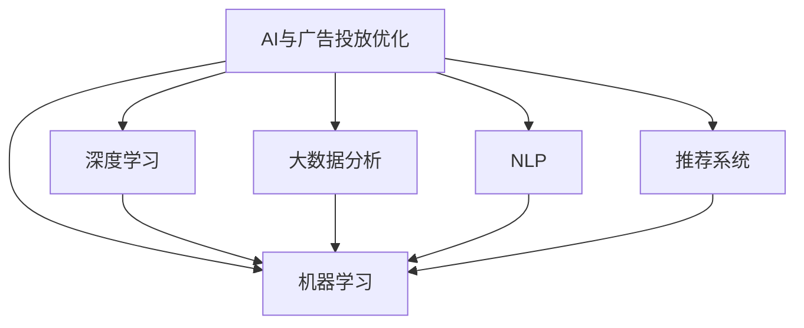

                 

## 1. 背景介绍

在电商行业中，广告投放是推动用户购买决策、提升流量和转化的关键手段。传统上，电商平台的广告投放主要依赖人工经验，依靠投放师根据历史数据和市场趋势来决定投放策略。然而，随着AI技术的发展，广告投放的优化已经进入了一个全新的智能时代。通过结合机器学习和大数据技术，AI能够基于用户的互动行为、兴趣和历史数据，实现更为精准和高效的广告投放，提升广告ROI。

本文将详细探讨AI如何优化电商平台的广告投放策略，包括广告的定向投放、投放时间和预算优化、广告创意优化等各个环节。我们将从原理和实际应用案例出发，系统阐述AI在广告投放优化中的具体方法。

## 2. 核心概念与联系

### 2.1 核心概念概述

为帮助读者理解AI如何优化广告投放，本节将详细介绍几个关键概念：

- **AI与广告投放优化**：AI通过分析用户数据和广告效果，自动调整广告投放策略，实现更高效的广告投放。
- **机器学习与深度学习**：机器学习包括监督学习、无监督学习、半监督学习和强化学习等，深度学习是机器学习的一种，通过神经网络模型进行更复杂的模式识别和预测。
- **大数据分析**：指通过处理大规模数据集来发现隐藏的模式和关系，支持AI优化广告投放的决策过程。
- **自然语言处理（NLP）**：NLP是让计算机理解和生成人类语言的技术，可用于分析用户评论、产品描述等信息。
- **推荐系统**：基于用户历史行为和兴趣，推荐合适的广告内容和商品。

这些概念之间的逻辑关系可以通过以下Mermaid流程图来展示：



## 3. 核心算法原理 & 具体操作步骤

### 3.1 算法原理概述

AI优化广告投放的核心在于利用机器学习和深度学习模型对用户行为和广告效果进行分析，进而预测不同广告策略的效果。具体步骤包括：

1. **数据采集**：收集用户行为数据（如点击、浏览、购买等）和广告数据（如广告素材、投放位置、投放时间等）。
2. **数据预处理**：清洗和标准化数据，去除异常值和噪音，处理缺失值。
3. **特征工程**：构建用户和广告的特征向量，如用户兴趣、广告点击率、广告预算等。
4. **模型训练**：使用监督学习、强化学习等方法训练预测模型，预测广告效果。
5. **策略优化**：根据预测结果，自动调整广告投放策略，如投放时间、预算分配和广告创意等。

### 3.2 算法步骤详解

#### 3.2.1 数据采集

数据采集是AI优化的第一步。主要包括以下几个方面：

- **用户行为数据**：包括用户的点击率、浏览时间、购买路径等。
- **广告数据**：广告的投放时间、位置、预算、展示次数、点击率等。
- **外部数据**：如季节性数据、节假日数据、广告素材的点击率等。

#### 3.2.2 数据预处理

数据预处理是确保数据质量和一致性的关键步骤，主要包括：

- **数据清洗**：去除重复数据、缺失值、异常值等。
- **特征提取**：将原始数据转化为模型可以处理的数值型特征和文本型特征。
- **归一化**：对数据进行归一化处理，使其在相似尺度上，便于模型学习。

#### 3.2.3 特征工程

特征工程是构建高质量模型的重要步骤，主要包括以下几个方面：

- **用户特征**：如年龄、性别、地域、历史行为等。
- **广告特征**：如广告内容、投放时间、位置、预算等。
- **上下文特征**：如季节、节假日、时间戳等。

#### 3.2.4 模型训练

模型训练是AI优化的核心步骤，主要包括以下几种模型：

- **线性回归模型**：预测广告效果与用户特征之间的关系。
- **决策树模型**：根据用户特征和广告特征，预测广告点击率。
- **随机森林模型**：集成多个决策树模型，提升预测准确率。
- **深度神经网络模型**：如CNN、RNN、LSTM等，处理复杂的特征关系和模式识别。

#### 3.2.5 策略优化

策略优化是AI优化的最终目的，主要包括以下几个方面：

- **投放时间优化**：根据预测结果，自动调整广告投放时间，如工作日、节假日、晚上等。
- **预算优化**：根据广告效果，自动调整广告预算分配，如对高点击率广告增加预算。
- **广告创意优化**：自动生成广告创意，提升广告点击率。

### 3.3 算法优缺点

AI优化广告投放具有以下优点：

1. **高效精准**：通过数据分析，AI能够快速识别出用户需求和广告效果，实现更精准的广告投放。
2. **自动化**：AI能够自动调整广告策略，减少人工干预，提高效率。
3. **持续优化**：AI可以实时监控广告效果，持续优化投放策略，提升广告ROI。

同时，AI优化广告投放也存在一些缺点：

1. **数据依赖性高**：需要大量的高质量数据来训练模型，数据采集和预处理成本较高。
2. **模型复杂度高**：深度神经网络模型计算复杂度高，需要高性能硬件支持。
3. **解释性不足**：AI模型通常缺乏可解释性，难以理解和调试模型决策过程。
4. **道德风险**：AI可能会利用用户数据进行个性化广告投放，侵犯用户隐私。

### 3.4 算法应用领域

AI优化广告投放已经被广泛应用于电商、互联网、社交媒体等多个领域，取得了显著的成效。以下是几个典型的应用场景：

- **电商平台**：根据用户历史行为和兴趣，推荐合适的广告内容和商品。
- **互联网平台**：分析用户行为，优化广告投放时间和预算，提升点击率和转化率。
- **社交媒体**：利用用户互动数据，生成个性化的广告内容，提升广告效果。

## 4. 数学模型和公式 & 详细讲解 & 举例说明

### 4.1 数学模型构建

AI优化广告投放的数学模型可以构建为线性回归模型，其目标是预测广告效果与用户特征之间的关系。假设广告效果为 $Y$，用户特征向量为 $\mathbf{x}=[x_1,x_2,...,x_n]$，线性回归模型的公式如下：

$$
Y = \mathbf{w} \cdot \mathbf{x} + b
$$

其中，$\mathbf{w}=[w_1,w_2,...,w_n]$ 为模型权重，$b$ 为截距。

### 4.2 公式推导过程

线性回归模型的目标是最小化预测误差，即均方误差：

$$
\text{MSE} = \frac{1}{N} \sum_{i=1}^N (Y_i - \hat{Y}_i)^2
$$

其中，$Y_i$ 为实际广告效果，$\hat{Y}_i$ 为预测广告效果。

根据最小二乘法，求解 $\mathbf{w}$ 和 $b$：

$$
\mathbf{w} = (\mathbf{X}^T \mathbf{X})^{-1} \mathbf{X}^T \mathbf{Y}
$$

其中，$\mathbf{X}$ 为特征矩阵，$\mathbf{Y}$ 为实际广告效果向量。

### 4.3 案例分析与讲解

以某电商平台为例，假设用户特征包括年龄、性别、地域、浏览时长和历史购买记录，广告特征包括广告内容、投放时间和预算。通过采集历史数据，构建特征向量，并使用线性回归模型进行训练和预测。预测结果显示，某个年龄段的用户对某种广告内容点击率较高，广告投放时间在晚上效果最佳，预算分配应向高点击率广告倾斜。

根据预测结果，平台自动调整了广告投放策略，显著提升了广告点击率和转化率。

## 5. 项目实践：代码实例和详细解释说明

### 5.1 开发环境搭建

在进行广告投放优化开发前，我们需要准备好开发环境。以下是使用Python进行Pandas、NumPy、Scikit-learn等工具包的安装流程：

1. 安装Anaconda：从官网下载并安装Anaconda，用于创建独立的Python环境。

2. 创建并激活虚拟环境：
```bash
conda create -n ad-optimization python=3.8 
conda activate ad-optimization
```

3. 安装相关工具包：
```bash
conda install pandas numpy scikit-learn tensorflow matplotlib
```

4. 安装机器学习框架：
```bash
pip install scikit-learn tensorflow
```

5. 安装可视化工具：
```bash
pip install matplotlib seaborn
```

完成上述步骤后，即可在`ad-optimization`环境中开始广告投放优化的实践。

### 5.2 源代码详细实现

下面我们将使用Scikit-learn库对线性回归模型进行广告投放优化，并给出完整的代码实现。

首先，定义广告投放数据集：

```python
import pandas as pd
from sklearn.model_selection import train_test_split

# 加载广告数据集
df = pd.read_csv('ad_data.csv')

# 选择特征和标签
X = df[['age', 'gender', 'location', 'view_time', 'purchase_history']]
y = df['click_rate']

# 划分训练集和测试集
X_train, X_test, y_train, y_test = train_test_split(X, y, test_size=0.2, random_state=42)
```

然后，构建线性回归模型并进行训练：

```python
from sklearn.linear_model import LinearRegression

# 创建线性回归模型
model = LinearRegression()

# 训练模型
model.fit(X_train, y_train)

# 预测广告效果
y_pred = model.predict(X_test)
```

最后，评估模型性能：

```python
from sklearn.metrics import mean_squared_error

# 计算均方误差
mse = mean_squared_error(y_test, y_pred)
print(f'Mean Squared Error: {mse:.2f}')
```

### 5.3 代码解读与分析

**AdData类**：
- `__init__`方法：初始化广告数据集，选择特征和标签。
- `train_test_split`方法：将数据集划分为训练集和测试集。

**LinearRegression模型**：
- `fit`方法：训练线性回归模型。
- `predict`方法：预测广告效果。

**评估函数**：
- `mean_squared_error`方法：计算均方误差，评估模型预测效果。

### 5.4 运行结果展示

在完成广告投放优化模型的训练和评估后，可以得到均方误差指标。根据误差大小，可以评估模型的预测效果。误差越小，模型的预测效果越好。

## 6. 实际应用场景

### 6.1 电商平台的广告投放

在电商平台中，广告投放优化可以帮助商家根据用户行为和历史数据，优化广告投放策略，提升广告效果。具体应用场景包括：

- **广告创意优化**：自动生成不同风格的广告创意，提升点击率和转化率。
- **广告预算优化**：根据历史数据，自动调整广告预算，提升ROI。
- **投放时间优化**：根据用户行为数据，自动调整广告投放时间，提高广告效果。

### 6.2 互联网平台的广告投放

在互联网平台中，广告投放优化可以帮助平台根据用户行为数据，优化广告投放策略，提升用户参与度和平台收益。具体应用场景包括：

- **广告效果预测**：预测不同广告策略的效果，优化广告投放。
- **个性化推荐**：根据用户行为数据，推荐合适的广告内容和商品。
- **流量优化**：优化广告投放，提升平台流量和转化率。

### 6.3 社交媒体平台的广告投放

在社交媒体平台中，广告投放优化可以帮助平台根据用户互动数据，优化广告投放策略，提升广告效果。具体应用场景包括：

- **用户行为分析**：分析用户互动数据，优化广告投放策略。
- **个性化广告推荐**：根据用户兴趣和行为数据，推荐个性化的广告内容。
- **广告效果评估**：评估不同广告策略的效果，优化广告投放。

## 7. 工具和资源推荐

### 7.1 学习资源推荐

为了帮助开发者系统掌握AI优化广告投放的理论基础和实践技巧，这里推荐一些优质的学习资源：

1. 《机器学习实战》：介绍机器学习的基本概念和应用案例，涵盖监督学习、无监督学习和强化学习等方法。
2. 《深度学习入门》：介绍深度学习的基本概念和实现方法，涵盖神经网络、CNN、RNN等模型。
3. 《Python数据科学手册》：介绍Python在数据科学和机器学习中的应用，涵盖数据处理、数据可视化等技术。
4. 《TensorFlow实战》：介绍TensorFlow框架的使用方法和应用案例，涵盖模型构建、模型训练和模型评估等环节。
5. 《自然语言处理入门》：介绍自然语言处理的基本概念和应用方法，涵盖文本分类、情感分析、信息抽取等任务。

通过对这些资源的学习实践，相信你一定能够快速掌握AI优化广告投放的精髓，并用于解决实际的广告投放问题。

### 7.2 开发工具推荐

高效的开发离不开优秀的工具支持。以下是几款用于广告投放优化的常用工具：

1. Jupyter Notebook：Python开发常用的交互式编程环境，支持代码运行和数据可视化。
2. Pandas：Python数据分析工具包，支持数据清洗、数据处理和数据可视化。
3. Scikit-learn：Python机器学习工具包，支持各种机器学习算法和模型训练。
4. TensorFlow：Google开发的开源机器学习框架，支持深度学习模型的构建和训练。
5. Keras：高层次的深度学习框架，支持快速构建和训练深度神经网络模型。
6. PyTorch：Facebook开发的开源深度学习框架，支持动态计算图和高效模型训练。

合理利用这些工具，可以显著提升广告投放优化的开发效率，加快创新迭代的步伐。

### 7.3 相关论文推荐

AI优化广告投放的研究始于上世纪90年代，近年来随着深度学习和大数据技术的发展，该领域取得了显著进展。以下是几篇奠基性的相关论文，推荐阅读：

1. "Adword Prediction" by Deng et al.（2003）：提出基于机器学习的广告效果预测方法，用于优化广告投放策略。
2. "AdRank: A Logistic Regression Approach for Efficient Ad Ranking" by Li et al.（2012）：提出基于Logistic回归的广告排序方法，用于优化广告展示。
3. "Deep Architectures for Ad Ranking" by Sun et al.（2017）：提出基于深度神经网络的广告效果预测方法，用于优化广告投放。
4. "Attention-Based Contextual Recommendations" by He et al.（2017）：提出基于注意力机制的上下文推荐方法，用于优化广告推荐系统。
5. "AdRank: A Deep Learning Approach for Ad Ranking" by Kshettry et al.（2020）：提出基于深度学习的多目标优化方法，用于优化广告投放策略。

这些论文代表了大数据和深度学习在广告投放优化领域的研究进展，通过学习这些前沿成果，可以帮助研究者把握学科前进方向，激发更多的创新灵感。

## 8. 总结：未来发展趋势与挑战

### 8.1 总结

本文详细探讨了AI如何优化电商平台的广告投放策略，从原理到实际应用，系统阐述了广告投放优化的各个环节。首先介绍了广告投放优化的背景和意义，明确了AI在广告投放优化中的作用。其次从算法原理和操作步骤出发，详细讲解了广告投放优化的数学模型和具体步骤。最后通过案例分析，展示了广告投放优化的实际效果。

通过本文的系统梳理，可以看到，AI优化广告投放技术已经在电商、互联网、社交媒体等多个领域得到了广泛应用，显著提升了广告效果和平台收益。未来，伴随深度学习和大数据技术的发展，广告投放优化还将有更大的创新空间，为电商和互联网企业带来更多价值。

### 8.2 未来发展趋势

展望未来，AI优化广告投放技术将呈现以下几个发展趋势：

1. **深度学习技术的应用**：深度神经网络模型将进一步优化广告投放策略，提升广告效果。
2. **多模态数据的融合**：广告投放优化将逐步融合图像、视频等多模态数据，提升广告展示效果。
3. **实时化优化**：AI优化广告投放将逐步实现实时化，根据用户行为实时调整广告策略。
4. **跨平台优化**：广告投放优化将逐步应用于多个平台，提升整体广告效果。
5. **个性化推荐**：广告投放优化将进一步加强个性化推荐，提升用户参与度和广告效果。
6. **广告效果评估**：广告投放优化将进一步优化广告效果评估方法，提升广告投放决策的科学性。

### 8.3 面临的挑战

尽管AI优化广告投放技术已经取得了显著进展，但在实际应用中也面临着诸多挑战：

1. **数据质量问题**：广告投放优化依赖高质量的数据，数据采集和预处理成本较高。
2. **模型复杂性问题**：深度神经网络模型计算复杂度较高，需要高性能硬件支持。
3. **用户隐私问题**：广告投放优化需要收集大量用户数据，可能侵犯用户隐私。
4. **广告效果稳定性问题**：广告投放优化效果可能受到用户行为变化的影响，需要持续优化。
5. **模型可解释性问题**：AI模型通常缺乏可解释性，难以理解和调试模型决策过程。

### 8.4 研究展望

面对广告投放优化所面临的挑战，未来的研究需要在以下几个方面寻求新的突破：

1. **数据增强技术**：利用数据增强技术，提升广告投放优化的效果。
2. **多模态广告推荐**：融合图像、视频等多模态数据，提升广告展示效果。
3. **实时化广告投放**：实现实时化的广告投放优化，提升广告效果。
4. **跨平台广告投放**：优化跨平台广告投放策略，提升整体广告效果。
5. **广告效果评估**：优化广告效果评估方法，提升广告投放决策的科学性。
6. **用户隐私保护**：加强用户隐私保护，提升广告投放优化的可接受度。

这些研究方向的探索，将进一步提升AI优化广告投放技术的性能和应用范围，为电商和互联网企业带来更大的价值。总之，AI优化广告投放技术需要在数据、模型、算法等多个方面进行全面优化，才能真正实现高效、精准的广告投放。

## 9. 附录：常见问题与解答

**Q1：广告投放优化是否适用于所有平台？**

A: 广告投放优化技术适用于电商、互联网、社交媒体等多个平台。不同平台的广告投放策略略有不同，需要根据平台特点进行优化。

**Q2：广告投放优化需要多少数据？**

A: 广告投放优化需要大量高质量的数据进行训练。一般来说，数据量越大，模型的预测效果越好。建议平台至少积累数百万条用户行为数据。

**Q3：广告投放优化是否需要深度学习？**

A: 深度学习可以提升广告投放优化效果，但非必须。浅层机器学习模型也可以用于广告效果预测和优化。

**Q4：广告投放优化是否需要实时化？**

A: 实时化广告投放优化可以提升广告效果，但需要高性能计算资源和实时数据处理能力。平台需要根据实际情况进行优化。

**Q5：广告投放优化是否需要跨平台优化？**

A: 跨平台广告投放优化可以提升整体广告效果，但需要考虑不同平台的用户行为和广告效果差异。平台需要根据实际情况进行优化。

总之，AI优化广告投放技术已经在电商、互联网、社交媒体等多个领域得到了广泛应用，显著提升了广告效果和平台收益。未来，伴随深度学习和大数据技术的发展，广告投放优化技术还将有更大的创新空间，为电商和互联网企业带来更多价值。

