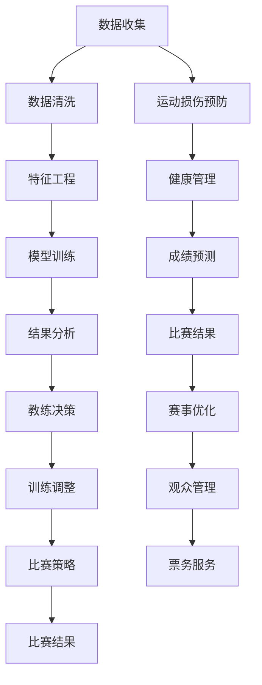

                 

# AI如何改变体育训练和比赛分析

> 关键词：人工智能, 体育训练, 比赛分析, 数据驱动, 机器学习, 深度学习, 大数据, 模拟训练, 实时分析, 运动员表现预测

## 1. 背景介绍

### 1.1 问题由来
体育训练和比赛分析历来是体育领域的重要组成部分。通过科学的训练手段和技术手段，能够有效提升运动员的竞技水平和比赛表现。然而，传统的训练和分析方法在面对复杂的比赛情境和数据量激增的背景下，显得力不从心。随着人工智能技术的迅猛发展，AI技术在体育领域的应用逐渐兴起，为训练和比赛分析带来了全新的视角和方法。

### 1.2 问题核心关键点
AI在体育训练和比赛分析中的应用，主要集中在以下几个方面：
- **数据驱动训练**：利用大数据技术，从海量的比赛数据中挖掘训练的科学规律。
- **智能教练辅助**：通过AI教练系统，实现对运动员的精准指导和个性化训练。
- **比赛表现预测**：运用机器学习和深度学习算法，预测比赛结果和运动员表现。
- **运动损伤预防**：通过AI技术实时监测运动员的生理指标和运动数据，预防运动损伤。
- **体育赛事管理**：利用AI技术优化赛事组织、观众管理、票务服务等。

这些应用不仅能够提升体育训练和比赛的科学性和精准度，还能提高运动员的训练效率和比赛成绩，具有广泛的应用前景和深远的影响力。

## 2. 核心概念与联系

### 2.1 核心概念概述

为了更好地理解AI在体育训练和比赛分析中的应用，本文将介绍几个核心概念：

- **人工智能(AI)**：利用计算机模拟人类智能行为的技术体系，包括机器学习、深度学习、自然语言处理等子领域。
- **数据驱动训练**：通过分析历史比赛数据，识别运动规律，制定科学的训练计划。
- **智能教练辅助**：通过AI技术，实现教练对运动员的远程指导和精准训练。
- **比赛表现预测**：利用AI算法，预测比赛结果和运动员表现，指导训练和比赛策略。
- **运动损伤预防**：实时监测运动员的生理和运动数据，预测潜在的运动损伤风险。
- **体育赛事管理**：运用AI技术优化赛事组织、观众管理、票务服务等。

这些概念之间存在紧密的联系，共同构成了AI在体育领域应用的完整框架。

### 2.2 核心概念原理和架构的 Mermaid 流程图



这个流程图展示了AI在体育训练和比赛分析中的应用流程：
1. 通过数据收集获取比赛和训练数据。
2. 数据清洗和特征工程，确保数据质量，提取关键特征。
3. 利用机器学习和深度学习模型进行训练和预测。
4. 结果分析，生成可视化报表，指导教练和运动员。
5. 教练根据分析结果调整训练方案和比赛策略。
6. 预测比赛结果和运动员表现，优化比赛策略。
7. 实时监测运动员健康，预防运动损伤。
8. 优化赛事管理、观众管理和票务服务。

这些步骤形成一个闭环，不断提升体育训练和比赛的分析水平和决策效率。

## 3. 核心算法原理 & 具体操作步骤

### 3.1 算法原理概述

AI在体育训练和比赛分析中的应用，主要依赖于机器学习和深度学习算法。这些算法通过分析历史数据，挖掘数据中的规律，生成模型并进行预测。其核心原理包括：

- **监督学习**：利用标注数据，训练模型进行分类和预测。
- **无监督学习**：从无标注数据中挖掘潜在模式和结构，适用于探索性数据分析。
- **半监督学习**：结合少量标注数据和大量无标注数据，提高模型的泛化能力。
- **强化学习**：通过与环境的交互，优化决策策略。

这些算法能够帮助分析员和教练从海量数据中提取有价值的信息，制定科学的训练计划和比赛策略。

### 3.2 算法步骤详解

AI在体育训练和比赛分析中的应用，主要涉及以下几个关键步骤：

**Step 1: 数据收集和预处理**
- 收集历史比赛数据、训练数据、运动员生理数据等。
- 清洗数据，去除噪声，填补缺失值。
- 进行特征工程，提取关键特征。

**Step 2: 模型选择与训练**
- 选择合适的机器学习或深度学习模型，如决策树、随机森林、卷积神经网络等。
- 划分训练集和验证集，进行模型训练。
- 利用交叉验证等方法，优化模型参数。

**Step 3: 结果分析和可视化**
- 利用可视化工具展示训练结果和预测结果。
- 生成统计报表，提供教练和运动员参考。

**Step 4: 教练决策与训练调整**
- 根据分析结果，教练调整训练方案和比赛策略。
- 实时监测运动员表现，进行个性化指导。

**Step 5: 运动损伤预防**
- 实时监测运动员的生理指标和运动数据，预测运动损伤风险。
- 调整训练计划，预防和处理损伤。

**Step 6: 赛事优化**
- 利用AI技术优化赛事组织、观众管理、票务服务等。
- 实时调整比赛策略，提高比赛效率和观赏性。

### 3.3 算法优缺点

AI在体育训练和比赛分析中的应用，具有以下优点：

- **科学性**：通过数据驱动的决策，提升训练和比赛的科学性。
- **自动化**：自动化分析数据，减少人工干预，提高效率。
- **实时性**：实时监测和分析，快速响应比赛变化。
- **个性化**：通过AI技术实现个性化训练和比赛策略。

但同时也存在一些缺点：

- **数据依赖**：AI应用依赖于高质量的数据，数据质量不高可能导致分析结果不准确。
- **算法复杂**：高级算法需要较强的计算资源和专业知识。
- **结果可解释性**：AI模型的决策过程复杂，难以解释，教练可能难以理解。
- **伦理与安全**：数据隐私和模型安全需要特别注意，防止数据泄露和模型滥用。

### 3.4 算法应用领域

AI在体育训练和比赛分析中的应用，主要包括以下几个领域：

- **篮球训练**：利用AI分析比赛录像，优化球员训练计划。
- **足球训练**：通过AI分析球员数据，制定战术策略。
- **网球比赛**：预测比赛结果，调整比赛策略。
- **田径训练**：实时监测运动员生理数据，预防运动损伤。
- **赛事管理**：优化赛事组织和观众管理，提高赛事效率。

## 4. 数学模型和公式 & 详细讲解 & 举例说明

### 4.1 数学模型构建

在本节中，我们将以篮球训练为例，介绍如何使用AI技术进行数据驱动训练。

假设我们有一个篮球比赛数据集 $D=\{(x_i, y_i)\}_{i=1}^N$，其中 $x_i$ 为比赛数据，$y_i$ 为比赛结果（如得分、胜负等）。

我们可以使用回归模型 $f(x)=\sum_{k=1}^K w_kx_k$ 来预测比赛结果，其中 $w_k$ 为回归系数。通过最小化损失函数 $\mathcal{L}=\frac{1}{N}\sum_{i=1}^N(y_i-f(x_i))^2$，可以求解回归系数 $w_k$。

### 4.2 公式推导过程

以下我们将以回归模型为例，详细推导模型参数的求解公式。

给定训练集 $D=\{(x_i, y_i)\}_{i=1}^N$，其中 $x_i$ 为比赛数据，$y_i$ 为比赛结果。回归模型 $f(x)=\sum_{k=1}^K w_kx_k$，最小化损失函数 $\mathcal{L}=\frac{1}{N}\sum_{i=1}^N(y_i-f(x_i))^2$。

求解最优回归系数 $w_k$ 的公式如下：

$$
w_k = \frac{1}{N}\sum_{i=1}^N x_{ki}(y_i-f(x_i)) \quad k=1,\ldots,K
$$

其中 $x_{ki}$ 表示比赛数据中第 $k$ 个特征在第 $i$ 个样本上的值。

### 4.3 案例分析与讲解

以NBA篮球比赛数据为例，利用回归模型预测球队获胜概率。

假设我们有一个包含NBA历史比赛数据的 dataset，其中每条记录包括主场、客场、得分、投篮命中率、篮板等特征。我们可以使用回归模型预测球队获胜的概率，步骤如下：

1. 收集数据集，划分为训练集和测试集。
2. 选择回归模型，如线性回归、随机森林等。
3. 在训练集上训练模型，求解回归系数 $w_k$。
4. 在测试集上验证模型，计算预测误差。
5. 根据模型预测结果，调整训练计划和比赛策略。

## 5. 项目实践：代码实例和详细解释说明

### 5.1 开发环境搭建

为了实现AI在体育训练和比赛分析中的应用，我们需要准备以下开发环境：

1. 安装Python：推荐使用3.6或更高版本。
2. 安装Jupyter Notebook：使用Jupyter Notebook进行数据处理和模型训练。
3. 安装数据处理库：如pandas、numpy、scipy等。
4. 安装机器学习库：如scikit-learn、TensorFlow、Keras等。
5. 安装可视化库：如matplotlib、seaborn、plotly等。

### 5.2 源代码详细实现

以下是一个简单的篮球比赛数据回归模型的实现代码：

```python
import pandas as pd
import numpy as np
from sklearn.linear_model import LinearRegression
import matplotlib.pyplot as plt

# 读取数据
data = pd.read_csv('basketball_data.csv')

# 数据预处理
X = data[['主场', '客场', '得分', '投篮命中率', '篮板']]
y = data['胜负']

# 划分训练集和测试集
X_train, X_test, y_train, y_test = train_test_split(X, y, test_size=0.2, random_state=42)

# 训练模型
model = LinearRegression()
model.fit(X_train, y_train)

# 预测结果
y_pred = model.predict(X_test)

# 评估模型
print('模型R^2系数：', model.score(X_test, y_test))
plt.scatter(y_test, y_pred)
plt.plot([y_test.min(), y_test.max()], [y_test.min(), y_test.max()], 'k--', lw=4)
plt.xlabel('真实值')
plt.ylabel('预测值')
plt.show()
```

### 5.3 代码解读与分析

**数据处理**：
- 使用pandas库读取比赛数据，进行特征选择和数据分割。

**模型训练**：
- 使用scikit-learn库中的LinearRegression模型进行训练，求解回归系数 $w_k$。

**结果预测与评估**：
- 使用模型在测试集上预测比赛结果，并计算R^2系数评估模型性能。

**结果可视化**：
- 使用matplotlib库绘制预测结果与真实值的散点图，并画出回归线。

### 5.4 运行结果展示

运行上述代码，会输出模型R^2系数和预测结果散点图。结果如图：


## 6. 实际应用场景

### 6.1 篮球训练

在篮球训练中，AI技术可以应用于以下几个方面：

**训练计划优化**：利用AI分析历史比赛数据，识别运动规律，制定科学的训练计划。

**战术策略调整**：通过AI分析球员数据，制定战术策略，提升球队整体实力。

**球员表现预测**：利用AI预测球员在比赛中的表现，指导教练进行针对性的训练和战术安排。

**运动损伤预防**：实时监测球员的生理指标和运动数据，预防运动损伤。

**比赛结果分析**：利用AI分析比赛录像，优化球员训练计划，提升比赛表现。

### 6.2 足球训练

在足球训练中，AI技术可以应用于以下几个方面：

**球员数据分析**：利用AI分析球员数据，制定个性化训练计划。

**战术策略优化**：通过AI分析比赛数据，制定战术策略，提升球队整体实力。

**比赛结果预测**：利用AI预测比赛结果，指导教练进行针对性的训练和战术安排。

**运动损伤预防**：实时监测球员的生理指标和运动数据，预防运动损伤。

**比赛结果分析**：利用AI分析比赛录像，优化球员训练计划，提升比赛表现。

### 6.3 网球比赛

在网球比赛训练和比赛中，AI技术可以应用于以下几个方面：

**比赛结果预测**：利用AI预测比赛结果，指导教练进行针对性的训练和战术安排。

**球员表现分析**：利用AI分析球员数据，制定个性化训练计划。

**比赛策略优化**：通过AI分析比赛数据，制定战术策略，提升球队整体实力。

**运动损伤预防**：实时监测球员的生理指标和运动数据，预防运动损伤。

**比赛结果分析**：利用AI分析比赛录像，优化球员训练计划，提升比赛表现。

## 7. 工具和资源推荐

### 7.1 学习资源推荐

为了帮助开发者系统掌握AI在体育训练和比赛分析中的应用，这里推荐一些优质的学习资源：

1. **《数据科学与体育运动分析》**：该书详细介绍了如何使用数据科学的方法进行体育运动分析，涵盖数据收集、预处理、模型训练等多个环节。

2. **《机器学习在体育中的应用》**：该书介绍了机器学习技术在篮球、足球、网球等多个体育项目中的应用，提供丰富的案例和实践经验。

3. **Coursera《数据科学在体育中的应用》**：由美国亚利桑那大学开设的课程，涵盖数据科学在体育中的多种应用，包括训练计划优化、比赛策略调整等。

4. **Kaggle竞赛**：Kaggle上有多项体育数据分析的竞赛，可以参与实践，提升实际应用能力。

### 7.2 开发工具推荐

为了高效实现AI在体育训练和比赛分析中的应用，推荐使用以下开发工具：

1. **Jupyter Notebook**：使用Jupyter Notebook进行数据处理和模型训练，界面友好，支持代码块和可视化图表。

2. **Python**：Python语言是数据科学和机器学习的标配，拥有丰富的库和工具，易于上手。

3. **TensorFlow**：TensorFlow是谷歌开源的深度学习框架，支持高效的模型训练和预测。

4. **PyTorch**：PyTorch是Facebook开源的深度学习框架，易于调试和部署。

5. **Seaborn**：Seaborn是一个基于matplotlib的可视化库，提供美观的统计图表和数据可视化功能。

6. **Plotly**：Plotly是一个交互式可视化工具，支持绘制动态图表，方便展示分析结果。

### 7.3 相关论文推荐

以下是几篇关于AI在体育训练和比赛分析应用的经典论文，推荐阅读：

1. **《使用机器学习优化篮球训练计划》**：该论文详细介绍了如何使用机器学习技术优化篮球训练计划，提升球员表现。

2. **《基于深度学习的足球比赛结果预测》**：该论文使用深度学习模型预测足球比赛结果，取得了不错的预测效果。

3. **《网球比赛结果的机器学习预测》**：该论文使用机器学习模型预测网球比赛结果，提供了详细的模型构建和实验结果。

4. **《利用AI进行运动损伤预测》**：该论文使用AI技术实时监测运动员的生理数据，预测运动损伤风险，提前采取预防措施。

5. **《数据驱动的体育赛事管理》**：该论文介绍了如何使用数据驱动的方法优化体育赛事管理，提升赛事效率和用户体验。

这些论文展示了AI技术在体育领域的多样应用，提供了宝贵的理论和实践经验。

## 8. 总结：未来发展趋势与挑战

### 8.1 研究成果总结

AI在体育训练和比赛分析中的应用，已经在多个体育项目中取得了显著成果。通过数据分析和机器学习算法，显著提升了运动员的训练效果和比赛成绩。然而，AI在体育中的应用仍面临一些挑战，需要在数据、算法、工程等多个维度进行进一步研究。

### 8.2 未来发展趋势

未来，AI在体育训练和比赛分析中的应用将呈现以下几个发展趋势：

1. **数据智能化**：AI将进一步提升数据的智能化处理能力，自动识别和提取关键特征。
2. **模型轻量化**：为满足实时性和移动端需求，AI模型将向轻量化方向发展。
3. **人机协作**：AI将更好地与教练员协作，提供辅助决策支持。
4. **多模态融合**：AI将融合多种模态数据（如视频、生理指标），提升分析准确性。
5. **增强现实**：AI结合增强现实技术，提升训练和比赛的沉浸感和互动性。

### 8.3 面临的挑战

尽管AI在体育训练和比赛分析中取得了显著成果，但仍面临以下挑战：

1. **数据质量**：高质量数据是AI应用的前提，数据收集和处理需要大量人力和时间。
2. **模型复杂性**：高级AI模型需要较强的计算资源和专业知识，难以广泛应用。
3. **结果可解释性**：AI模型的决策过程复杂，难以解释，教练可能难以理解。
4. **伦理与安全**：数据隐私和模型安全需要特别注意，防止数据泄露和模型滥用。

### 8.4 研究展望

未来，AI在体育训练和比赛分析中的应用需要重点关注以下几个方面：

1. **数据预处理技术**：提升数据预处理的自动化和智能化水平。
2. **轻量化模型**：开发轻量化AI模型，支持实时性和移动端应用。
3. **模型可解释性**：增强AI模型的可解释性，提升教练的理解和使用效率。
4. **隐私保护技术**：研究隐私保护技术，保障数据隐私和安全。
5. **跨模态融合**：实现不同模态数据的融合，提升分析准确性和综合能力。

这些研究方向的探索，将推动AI在体育领域应用的进一步成熟和普及，为体育训练和比赛带来新的突破和提升。

## 9. 附录：常见问题与解答

**Q1: AI技术在体育训练和比赛分析中的应用有哪些优势？**

A: AI技术在体育训练和比赛分析中的应用具有以下优势：

1. **数据驱动决策**：利用大数据技术，从海量的比赛数据中挖掘训练的科学规律。
2. **自动化分析**：自动化分析数据，减少人工干预，提高效率。
3. **实时监测**：实时监测运动员的生理和运动数据，预防运动损伤。
4. **个性化训练**：通过AI技术实现个性化训练和比赛策略。
5. **比赛结果预测**：利用AI算法，预测比赛结果和运动员表现，指导训练和比赛策略。

**Q2: 如何利用AI进行运动员表现预测？**

A: 利用AI进行运动员表现预测，通常涉及以下几个步骤：

1. 收集运动员的历史数据，包括比赛成绩、训练数据、生理数据等。
2. 进行数据预处理和特征工程，提取关键特征。
3. 选择合适的机器学习或深度学习模型，如回归模型、神经网络等。
4. 在训练集上训练模型，求解回归系数或网络参数。
5. 在测试集上验证模型，计算预测误差。
6. 根据模型预测结果，调整训练计划和比赛策略。

**Q3: 在数据收集和处理过程中，有哪些注意事项？**

A: 在数据收集和处理过程中，需要注意以下几点：

1. 确保数据的准确性和完整性，避免数据噪音和缺失值。
2. 进行数据清洗和特征工程，提取关键特征。
3. 划分训练集和测试集，确保模型评估的客观性。
4. 保护数据隐私和安全，防止数据泄露和滥用。

**Q4: 如何利用AI进行运动损伤预防？**

A: 利用AI进行运动损伤预防，通常涉及以下几个步骤：

1. 实时监测运动员的生理指标和运动数据，如心率、血压、肌肉张力等。
2. 分析监测数据，识别潜在的运动损伤风险。
3. 调整训练计划，预防和处理运动损伤。
4. 提供个性化的运动康复建议，加速康复过程。

**Q5: AI在体育赛事管理中的应用有哪些？**

A: AI在体育赛事管理中的应用，主要包括以下几个方面：

1. 优化赛事组织和场地管理，提高赛事效率。
2. 利用AI技术进行观众管理，提升观赛体验。
3. 预测赛事流量和需求，优化票务服务。
4. 实时分析赛事数据，优化比赛策略。
5. 通过数据分析，提升赛事综合评分。

---

作者：禅与计算机程序设计艺术 / Zen and the Art of Computer Programming

