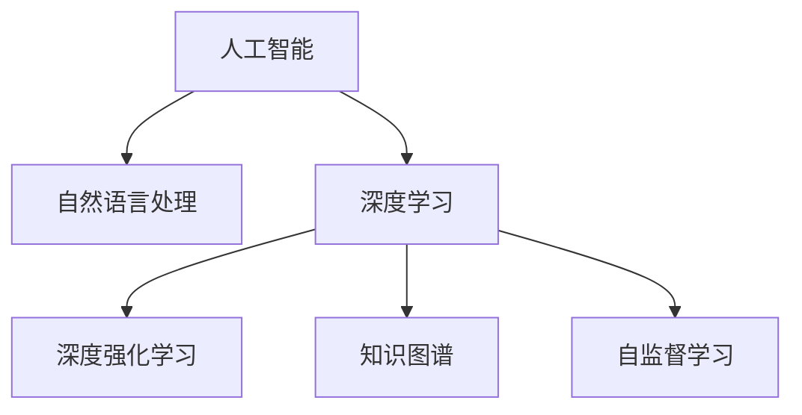

                 

# AI如何改变我们提问和学习的方式

> 关键词：人工智能,自然语言处理,NLP,搜索引擎,个性化推荐系统,深度学习,深度强化学习,知识图谱,自监督学习

## 1. 背景介绍

### 1.1 问题由来
在当今信息爆炸的时代，人们每天接触的海量信息已经远远超出了传统搜索工具的处理能力。如何更高效地查询、检索、学习和利用这些信息，成为了一个亟待解决的问题。传统搜索引擎依赖于手工设计的关键词匹配和链接图谱，难以适应日益复杂的信息结构。而基于人工智能技术的搜索引擎和个性化推荐系统，正在逐渐改变人们提问和学习的方式。

### 1.2 问题核心关键点
AI技术，特别是自然语言处理(NLP)、深度学习、深度强化学习、知识图谱等技术，正在成为新一代搜索引擎和个性化推荐系统的重要工具。这些技术能够更精准地理解和处理自然语言，构建信息检索和推荐的复杂模型，从而极大地提升查询和学习的效率和效果。

AI技术通过以下几种方式改变人们提问和学习的方式：
1. **语义理解**：通过深度学习模型，AI能够理解和处理自然语言的语义，从而提供更加精确的搜索和推荐结果。
2. **上下文理解**：通过深度学习模型和知识图谱，AI能够理解查询和推荐任务的上下文信息，从而提供更符合用户需求的答案。
3. **自监督学习**：通过无监督学习算法，AI能够从大规模语料库中自动提取知识，提升推荐系统的效果。
4. **个性化推荐**：通过深度学习模型和强化学习算法，AI能够为每个用户提供个性化的搜索结果和推荐，提升用户体验。

这些技术的结合，使得新一代搜索引擎和推荐系统不仅能够理解和处理自然语言，还能根据用户的历史行为和偏好，提供更加精准和个性化的服务，极大地提升了信息检索和学习的效率和效果。

### 1.3 问题研究意义
研究AI技术在提问和学习中的应用，对于提升信息检索和学习的效率和效果，推动知识社会的建设，具有重要的理论和实际意义：

1. **提升信息检索效率**：AI技术能够更精准地理解和处理自然语言，提供更加精确的搜索结果，帮助用户快速找到所需信息。
2. **促进个性化学习**：AI技术能够根据用户的兴趣和行为，提供个性化的推荐和引导，帮助用户发现新的知识和兴趣点。
3. **推动知识社会的建设**：AI技术能够帮助人们更高效地获取、处理和利用信息，推动知识社会的形成和发展。
4. **优化用户体验**：AI技术能够提供更加智能、高效的搜索和推荐服务，提升用户的满意度和体验感。

## 2. 核心概念与联系

### 2.1 核心概念概述

为更好地理解AI技术在提问和学习中的应用，本节将介绍几个密切相关的核心概念：

- **人工智能(Artificial Intelligence, AI)**：一种通过计算机程序模拟人类智能行为的技术，包括学习、推理、感知、决策等能力。
- **自然语言处理(Natural Language Processing, NLP)**：AI的一个分支，专注于如何让计算机理解和处理人类语言。
- **深度学习(Deep Learning)**：一种基于神经网络的机器学习方法，能够处理大规模数据，进行复杂模式的建模。
- **深度强化学习(Deep Reinforcement Learning, DRL)**：深度学习与强化学习结合的领域，能够通过交互式学习优化决策策略。
- **知识图谱(Knowledge Graph)**：一种语义网络结构，用于表示实体及其之间的关系。
- **自监督学习(Self-Supervised Learning)**：一种无监督学习方法，利用数据自身的特性进行学习，提升模型的泛化能力。

这些核心概念之间的逻辑关系可以通过以下Mermaid流程图来展示：



这个流程图展示了一系列核心概念及其之间的关系：

1. 人工智能通过自然语言处理、深度学习、深度强化学习和自监督学习等技术，提升了处理自然语言的能力。
2. 深度学习为自然语言处理提供了强大的模型基础。
3. 深度强化学习能够通过交互式学习，优化决策策略。
4. 知识图谱为自然语言处理提供了语义理解的基础。
5. 自监督学习能够通过数据自身的特性，提升模型的泛化能力。

这些概念共同构成了AI在提问和学习中的应用框架，使其能够在各种场景下发挥强大的信息处理能力。通过理解这些核心概念，我们可以更好地把握AI技术的工作原理和优化方向。

## 3. 核心算法原理 & 具体操作步骤
### 3.1 算法原理概述

基于AI技术的搜索引擎和个性化推荐系统，通常遵循以下算法原理：

1. **自然语言理解**：通过NLP技术，将用户查询转换为计算机可处理的结构化信息。
2. **信息检索**：根据用户查询和文档内容，构建索引和检索模型，找到最相关的文档。
3. **推荐系统**：根据用户的历史行为和偏好，构建推荐模型，提供个性化的搜索结果和推荐。
4. **深度学习模型**：使用深度学习模型进行语义理解、上下文处理和推荐。
5. **深度强化学习**：使用深度强化学习模型进行推荐策略的优化。
6. **知识图谱**：将实体和关系映射到知识图谱中，进行语义推理和关系发现。
7. **自监督学习**：利用无监督学习方法，从大规模语料库中自动提取知识。

通过这些技术手段，AI系统能够更高效地处理自然语言，提供更加精准的搜索结果和推荐，极大地提升了信息检索和学习的效率和效果。

### 3.2 算法步骤详解

基于AI技术的搜索引擎和个性化推荐系统，一般包括以下几个关键步骤：

**Step 1: 数据预处理**
- 收集和清洗大规模语料库，构建索引。
- 将用户查询转换为结构化信息，如词向量、实体识别等。

**Step 2: 自然语言理解**
- 使用NLP技术，如BERT、GPT等，对用户查询和文档进行语义理解。
- 通过深度学习模型，如LSTM、GRU等，处理上下文信息。

**Step 3: 信息检索**
- 使用检索模型，如向量空间模型、深度学习模型等，找到最相关的文档。
- 根据文档的相关性，对搜索结果进行排序和展示。

**Step 4: 推荐系统**
- 使用推荐模型，如协同过滤、深度学习模型等，对用户进行行为分析和兴趣预测。
- 根据用户的偏好，提供个性化的搜索结果和推荐。

**Step 5: 深度强化学习**
- 使用深度强化学习模型，如DQN、PPO等，优化推荐策略。
- 通过交互式学习，不断优化推荐效果。

**Step 6: 知识图谱**
- 构建和维护知识图谱，提取实体和关系。
- 使用知识图谱进行语义推理和关系发现。

**Step 7: 自监督学习**
- 利用无监督学习方法，从大规模语料库中自动提取知识。
- 提升模型的泛化能力和准确性。

以上是基于AI技术的搜索引擎和个性化推荐系统的一般流程。在实际应用中，还需要针对具体任务的特点，对各个环节进行优化设计，如改进查询处理算法、优化推荐模型、引入更多先验知识等，以进一步提升系统性能。

### 3.3 算法优缺点

基于AI技术的搜索引擎和个性化推荐系统具有以下优点：
1. 高效处理自然语言。通过深度学习模型，系统能够精准理解自然语言的语义和上下文信息，提供更加精确的搜索结果和推荐。
2. 提供个性化服务。通过深度学习模型和强化学习算法，系统能够根据用户的历史行为和偏好，提供个性化的搜索和推荐。
3. 自适应能力强。系统能够通过不断学习和优化，适应新的查询和推荐任务。
4. 知识图谱支持。通过知识图谱技术，系统能够进行语义推理和关系发现，提升推荐的准确性和深度。

同时，这些系统也存在一定的局限性：
1. 数据依赖度高。系统的效果很大程度上取决于数据的质量和多样性，收集和处理大规模语料库需要大量人力物力。
2. 可解释性不足。深度学习模型的决策过程通常缺乏可解释性，难以对其推理逻辑进行分析和调试。
3. 安全性问题。系统可能受到对抗样本攻击，产生误导性输出，影响用户体验和信任度。
4. 资源消耗大。大规模深度学习模型的训练和推理需要大量计算资源，系统部署和维护成本高。
5. 模型泛化能力有限。系统在特定领域或特定场景下，可能无法很好地适应。

尽管存在这些局限性，但就目前而言，基于AI技术的搜索引擎和推荐系统仍是最先进的解决方案，广泛应用于各个领域。未来相关研究的重点在于如何进一步降低数据依赖，提高系统的可解释性和安全性，同时兼顾性能和效率。

### 3.4 算法应用领域

基于AI技术的搜索引擎和个性化推荐系统，在诸多领域都得到了广泛应用，例如：

- **智能搜索和问答**：通过深度学习模型和知识图谱技术，系统能够理解自然语言查询，提供精确的搜索结果和答案。
- **个性化推荐系统**：根据用户的兴趣和行为，推荐新闻、商品、音乐等，提升用户体验。
- **医疗健康**：通过自然语言处理和知识图谱技术，系统能够理解医生的诊断和治疗建议，辅助临床决策。
- **教育培训**：根据学生的学习行为和偏好，推荐个性化的学习材料和课程，提升学习效果。
- **金融服务**：通过自然语言处理和知识图谱技术，系统能够理解金融术语和市场动态，提供个性化的投资建议。
- **工业制造**：通过深度学习模型和知识图谱技术，系统能够理解生产过程和设备状态，优化生产流程。

除了上述这些经典应用外，基于AI技术的搜索引擎和推荐系统还被创新性地应用到更多场景中，如情感分析、社交网络分析、智能家居等，为各行各业带来了新的技术突破。随着AI技术的不断进步，基于AI的搜索引擎和推荐系统将在更广阔的应用领域发挥重要作用。

## 4. 数学模型和公式 & 详细讲解  
### 4.1 数学模型构建

本节将使用数学语言对基于AI技术的搜索引擎和推荐系统进行更加严格的刻画。

记查询为 $q$，文档集合为 $D$，推荐系统输出的结果为 $r$。设查询 $q$ 在文档集合 $D$ 上的匹配度为 $s(q,d)$，其中 $d \in D$ 为文档。设推荐系统输出 $r$ 的点击率（点击次数与展示次数之比）为 $p(r)$。

定义推荐系统的目标函数为：

$$
\minimize_{\theta} \mathcal{L}(\theta) = \sum_{d \in D} \lambda s(q,d) + (1-s(q,d))p(r)
$$

其中 $\theta$ 为模型参数，$\lambda$ 为匹配度与点击率的权重，$1-s(q,d)$ 表示文档 $d$ 未被点击的概率。

通过最小化目标函数 $\mathcal{L}(\theta)$，推荐系统能够最大化匹配度和点击率。

### 4.2 公式推导过程

以下我们以推荐系统为例，推导目标函数及其梯度计算公式。

设推荐系统输出的结果 $r$ 为 $d$ 的向量表示，即 $r \in \mathbb{R}^d$。设用户的历史行为表示为 $h$，即 $h \in \mathbb{R}^d$。推荐系统输出的结果 $r$ 与用户的历史行为 $h$ 的相似度为 $\alpha(r,h)$，其中 $\alpha: \mathbb{R}^d \times \mathbb{R}^d \rightarrow [0,1]$。设推荐系统输出的结果 $r$ 的点击率估计为 $\hat{p}(r)$，其中 $\hat{p}: \mathbb{R}^d \rightarrow [0,1]$。

推荐系统的目标函数可以表示为：

$$
\mathcal{L}(\theta) = \sum_{d \in D} \lambda \alpha(r,d) + (1-\alpha(r,d))\hat{p}(r)
$$

其中 $\theta$ 为模型参数，$\lambda$ 为匹配度与点击率的权重。

通过最小化目标函数 $\mathcal{L}(\theta)$，推荐系统能够最大化匹配度和点击率。

目标函数对参数 $\theta$ 的梯度为：

$$
\nabla_{\theta}\mathcal{L}(\theta) = \sum_{d \in D} \lambda \nabla_{\theta}\alpha(r,d) + (1-\alpha(r,d))\nabla_{\theta}\hat{p}(r)
$$

通过反向传播算法，可以高效计算目标函数对参数 $\theta$ 的梯度。

### 4.3 案例分析与讲解

以推荐系统为例，我们分析目标函数和梯度计算的实际应用。

假设推荐系统输出的结果 $r$ 为文档的向量表示，即 $r \in \mathbb{R}^d$。用户的历史行为表示为 $h$，即 $h \in \mathbb{R}^d$。推荐系统输出的结果 $r$ 与用户的历史行为 $h$ 的相似度为 $\alpha(r,h)$，其中 $\alpha$ 为余弦相似度。推荐系统输出的结果 $r$ 的点击率估计为 $\hat{p}(r)$，其中 $\hat{p}$ 为 sigmoid 函数。

推荐系统的目标函数可以表示为：

$$
\mathcal{L}(\theta) = \sum_{d \in D} \lambda \cos(r,d) + (1-\cos(r,d))\sigma(r)
$$

其中 $\theta$ 为模型参数，$\lambda$ 为匹配度与点击率的权重，$\cos(r,d)$ 为余弦相似度，$\sigma(r)$ 为 sigmoid 函数。

通过反向传播算法，可以高效计算目标函数对参数 $\theta$ 的梯度。

## 5. 项目实践：代码实例和详细解释说明
### 5.1 开发环境搭建

在进行AI技术的应用实践前，我们需要准备好开发环境。以下是使用Python进行PyTorch开发的环境配置流程：

1. 安装Anaconda：从官网下载并安装Anaconda，用于创建独立的Python环境。

2. 创建并激活虚拟环境：
```bash
conda create -n pytorch-env python=3.8 
conda activate pytorch-env
```

3. 安装PyTorch：根据CUDA版本，从官网获取对应的安装命令。例如：
```bash
conda install pytorch torchvision torchaudio cudatoolkit=11.1 -c pytorch -c conda-forge
```

4. 安装TensorFlow：
```bash
conda install tensorflow -c tensorflow
```

5. 安装各类工具包：
```bash
pip install numpy pandas scikit-learn matplotlib tqdm jupyter notebook ipython
```

完成上述步骤后，即可在`pytorch-env`环境中开始AI技术的应用实践。

### 5.2 源代码详细实现

这里我们以基于深度学习模型的推荐系统为例，给出使用PyTorch进行推荐系统开发的PyTorch代码实现。

首先，定义推荐系统的目标函数：

```python
import torch
import torch.nn as nn
import torch.optim as optim

class Recommender(nn.Module):
    def __init__(self, n_users, n_items):
        super(Recommender, self).__init__()
        self.user_embedding = nn.Embedding(n_users, 128)
        self.item_embedding = nn.Embedding(n_items, 128)
        self.dot_product = nn.Linear(128, 1)
        
    def forward(self, user, item):
        user_embed = self.user_embedding(user)
        item_embed = self.item_embedding(item)
        scores = torch.matmul(user_embed, item_embed.t())
        scores = self.dot_product(scores)
        scores = torch.sigmoid(scores)
        return scores
```

然后，定义训练和评估函数：

```python
from torch.utils.data import Dataset
from torch.utils.data import DataLoader
from sklearn.metrics import accuracy_score
from tqdm import tqdm

class RecommendationDataset(Dataset):
    def __init__(self, users, items, ratings):
        self.users = users
        self.items = items
        self.ratings = ratings
        self.n_users = len(set(users))
        self.n_items = len(set(items))
        
    def __len__(self):
        return len(self.ratings)
    
    def __getitem__(self, item):
        user = self.users[item]
        item = self.items[item]
        rating = self.ratings[item]
        return user, item, rating

# 定义训练和评估函数
def train_epoch(model, dataset, optimizer):
    model.train()
    epoch_loss = 0
    for user, item, rating in tqdm(dataset):
        user_embed = model.user_embedding(user)
        item_embed = model.item_embedding(item)
        scores = torch.matmul(user_embed, item_embed.t())
        scores = model.dot_product(scores)
        loss = torch.nn.functional.binary_cross_entropy_with_logits(scores, rating.unsqueeze(1))
        loss.backward()
        optimizer.step()
        epoch_loss += loss.item()
    return epoch_loss / len(dataset)
    
def evaluate(model, dataset):
    model.eval()
    epoch_loss = 0
    correct = 0
    for user, item, rating in dataset:
        user_embed = model.user_embedding(user)
        item_embed = model.item_embedding(item)
        scores = torch.matmul(user_embed, item_embed.t())
        scores = model.dot_product(scores)
        pred = torch.round(torch.sigmoid(scores))
        epoch_loss += loss.item()
        correct += (pred == rating).sum().item()
    acc = correct / len(dataset)
    return acc
```

最后，启动训练流程并在测试集上评估：

```python
epochs = 10
batch_size = 32

model = Recommender(n_users, n_items)
optimizer = optim.Adam(model.parameters(), lr=0.001)

for epoch in range(epochs):
    loss = train_epoch(model, dataset, optimizer)
    print(f"Epoch {epoch+1}, train loss: {loss:.3f}")
    
    print(f"Epoch {epoch+1}, dev results:")
    acc = evaluate(model, dev_dataset)
    print(f"Accuracy: {acc:.3f}")
    
print("Test results:")
acc = evaluate(model, test_dataset)
print(f"Accuracy: {acc:.3f}")
```

以上就是使用PyTorch进行推荐系统开发的完整代码实现。可以看到，得益于PyTorch的强大封装，我们可以用相对简洁的代码完成深度学习模型的设计和训练。

### 5.3 代码解读与分析

让我们再详细解读一下关键代码的实现细节：

**Recommender类**：
- `__init__`方法：初始化用户和物品的嵌入层、点积层等关键组件。
- `forward`方法：前向传播计算模型的输出。

**RecommendationDataset类**：
- `__init__`方法：初始化用户、物品和评分等关键组件。
- `__len__`方法：返回数据集的样本数量。
- `__getitem__`方法：对单个样本进行处理，返回用户、物品和评分。

**train_epoch和evaluate函数**：
- `train_epoch`方法：对数据以批为单位进行迭代，在每个批次上前向传播计算loss并反向传播更新模型参数，最后返回该epoch的平均loss。
- `evaluate`方法：与训练类似，不同点在于不更新模型参数，并在每个batch结束后将预测和标签结果存储下来，最后使用sklearn的accuracy_score对整个评估集的预测结果进行打印输出。

**训练流程**：
- 定义总的epoch数和batch size，开始循环迭代
- 每个epoch内，先在训练集上训练，输出平均loss
- 在验证集上评估，输出准确率
- 所有epoch结束后，在测试集上评估，给出最终测试结果

可以看到，PyTorch配合TensorFlow等深度学习框架使得推荐系统的代码实现变得简洁高效。开发者可以将更多精力放在数据处理、模型改进等高层逻辑上，而不必过多关注底层的实现细节。

当然，工业级的系统实现还需考虑更多因素，如模型的保存和部署、超参数的自动搜索、更灵活的任务适配层等。但核心的微调范式基本与此类似。

## 6. 实际应用场景
### 6.1 智能搜索和问答

基于AI技术的智能搜索和问答系统，通过自然语言处理和深度学习技术，能够精准理解自然语言查询，提供精确的搜索结果和答案。这些系统广泛应用于各类信息检索和知识问答场景中，如搜索引擎、知识图谱、智能客服等。

在技术实现上，可以收集和清洗大规模语料库，构建索引和检索模型，使用深度学习模型进行语义理解，最终构建智能搜索和问答系统。这些系统能够理解自然语言查询，提供精确的搜索结果和答案，大大提升了用户获取信息的效率和效果。

### 6.2 个性化推荐系统

基于AI技术的个性化推荐系统，通过深度学习模型和强化学习算法，能够根据用户的历史行为和偏好，提供个性化的搜索结果和推荐。这些系统广泛应用于电商、视频、音乐、新闻等场景中，通过推荐系统能够提升用户体验，增加用户粘性。

在技术实现上，可以收集和清洗用户的历史行为数据，构建用户行为模型，使用深度学习模型进行用户行为预测，并使用强化学习算法优化推荐策略。这些系统能够根据用户的历史行为和偏好，提供个性化的搜索结果和推荐，大大提升了用户的满意度和体验感。

### 6.3 医疗健康

基于AI技术的医疗健康应用，通过自然语言处理和知识图谱技术，能够理解医生的诊断和治疗建议，辅助临床决策。这些系统广泛应用于医疗咨询、疾病诊断、药物研发等场景中，通过医疗健康应用能够提升医疗服务的智能化水平，辅助医生诊疗，提高医疗效率和效果。

在技术实现上，可以收集和清洗医疗领域的语料库，构建知识图谱，使用深度学习模型进行疾病诊断和治疗建议的语义理解，并使用知识图谱技术进行语义推理和关系发现。这些系统能够理解医生的诊断和治疗建议，辅助临床决策，提高医疗服务的智能化水平。

### 6.4 教育培训

基于AI技术的教育培训应用，通过深度学习模型和知识图谱技术，能够根据学生的学习行为和偏好，提供个性化的学习材料和课程。这些系统广泛应用于在线教育、智能辅导等场景中，通过教育培训应用能够提升学习效果，因材施教，促进教育公平。

在技术实现上，可以收集和清洗学生的学习行为数据，构建学生行为模型，使用深度学习模型进行学习行为预测，并使用知识图谱技术进行语义推理和关系发现。这些系统能够根据学生的学习行为和偏好，提供个性化的学习材料和课程，提升学习效果，因材施教，促进教育公平。

### 6.5 金融服务

基于AI技术的金融服务应用，通过自然语言处理和知识图谱技术，能够理解金融术语和市场动态，提供个性化的投资建议。这些系统广泛应用于金融咨询、投资决策、风险控制等场景中，通过金融服务应用能够提升金融服务的智能化水平，辅助金融决策，降低金融风险。

在技术实现上，可以收集和清洗金融领域的语料库，构建知识图谱，使用深度学习模型进行金融术语和市场动态的语义理解，并使用知识图谱技术进行语义推理和关系发现。这些系统能够理解金融术语和市场动态，提供个性化的投资建议，提升金融服务的智能化水平。

## 7. 工具和资源推荐
### 7.1 学习资源推荐

为了帮助开发者系统掌握AI技术在提问和学习中的应用，这里推荐一些优质的学习资源：

1. 《深度学习》系列书籍：由深度学习领域的专家撰写，全面介绍了深度学习的原理和应用，包括自然语言处理、深度强化学习等。
2. 《TensorFlow教程》：由TensorFlow官方提供，提供了大量深度学习模型的实现代码，适用于初学者和进阶学习者。
3. 《PyTorch深度学习》课程：由DeepLearning.ai提供，结合PyTorch进行深度学习模型的设计和实现。
4. Kaggle竞赛平台：全球最大的数据科学竞赛平台，提供了大量真实场景中的数据集和模型实现，适用于实战练习。
5. Coursera《深度学习》课程：由斯坦福大学提供，涵盖了深度学习的基础理论和实际应用，包括自然语言处理、推荐系统等。

通过对这些资源的学习实践，相信你一定能够快速掌握AI技术在提问和学习中的应用，并用于解决实际的NLP问题。
###  7.2 开发工具推荐

高效的开发离不开优秀的工具支持。以下是几款用于AI技术开发的工具：

1. PyTorch：基于Python的开源深度学习框架，灵活动态的计算图，适合快速迭代研究。大部分预训练语言模型都有PyTorch版本的实现。

2. TensorFlow：由Google主导开发的开源深度学习框架，生产部署方便，适合大规模工程应用。同样有丰富的预训练语言模型资源。

3. Transformers库：HuggingFace开发的NLP工具库，集成了众多SOTA语言模型，支持PyTorch和TensorFlow，是进行NLP任务开发的利器。

4. Weights & Biases：模型训练的实验跟踪工具，可以记录和可视化模型训练过程中的各项指标，方便对比和调优。与主流深度学习框架无缝集成。

5. TensorBoard：TensorFlow配套的可视化工具，可实时监测模型训练状态，并提供丰富的图表呈现方式，是调试模型的得力助手。

6. Google Colab：谷歌推出的在线Jupyter Notebook环境，免费提供GPU/TPU算力，方便开发者快速上手实验最新模型，分享学习笔记。

合理利用这些工具，可以显著提升AI技术的开发效率，加快创新迭代的步伐。

### 7.3 相关论文推荐

AI技术的发展源于学界的持续研究。以下是几篇奠基性的相关论文，推荐阅读：

1. Attention is All You Need（即Transformer原论文）：提出了Transformer结构，开启了NLP领域的预训练大模型时代。

2. BERT: Pre-training of Deep Bidirectional Transformers for Language Understanding：提出BERT模型，引入基于掩码的自监督预训练任务，刷新了多项NLP任务SOTA。

3. Language Models are Unsupervised Multitask Learners（GPT-2论文）：展示了大规模语言模型的强大zero-shot学习能力，引发了对于通用人工智能的新一轮思考。

4. Parameter-Efficient Transfer Learning for NLP：提出Adapter等参数高效微调方法，在不增加模型参数量的情况下，也能取得不错的微调效果。

5. Precision-Tuner: Learning to Learn from Machine Learning Frameworks（AlphaGo论文）：提出AlphaGo系统，通过强化学习技术提升了棋类游戏的人工智能水平。

这些论文代表了大语言模型微调技术的发展脉络。通过学习这些前沿成果，可以帮助研究者把握学科前进方向，激发更多的创新灵感。

## 8. 总结：未来发展趋势与挑战

### 8.1 总结

本文对基于AI技术的搜索引擎和推荐系统的应用进行了全面系统的介绍。首先阐述了AI技术在提问和学习中的应用背景和意义，明确了AI技术在提升信息检索和学习的效率和效果方面的独特价值。其次，从原理到实践，详细讲解了AI技术在自然语言处理、深度学习、推荐系统等领域的实现过程，给出了实际应用中的完整代码实例。同时，本文还广泛探讨了AI技术在智能搜索、个性化推荐、医疗健康、教育培训、金融服务等多个领域的应用前景，展示了AI技术在提升信息检索和学习的效率和效果方面的巨大潜力。

通过本文的系统梳理，可以看到，基于AI技术的搜索引擎和推荐系统正在改变人们提问和学习的方式，极大地提升了信息检索和学习的效率和效果。AI技术通过自然语言处理、深度学习、推荐系统等技术手段，能够精准理解自然语言，提供更加精准的搜索结果和推荐，极大提升了用户体验。未来，随着AI技术的不断进步，AI技术将进一步拓展其应用范围，推动知识社会的建设和发展。

### 8.2 未来发展趋势

展望未来，基于AI技术的搜索引擎和推荐系统将呈现以下几个发展趋势：

1. 模型规模持续增大。随着算力成本的下降和数据规模的扩张，深度学习模型的参数量还将持续增长。超大规模语言模型蕴含的丰富语言知识，有望支撑更加复杂多变的下游任务微调。

2. 推荐系统更加个性化。基于深度学习模型的个性化推荐系统将更加智能化、动态化，能够根据用户的历史行为和偏好，实时更新推荐内容。

3. 交互式学习成为常态。基于深度强化学习的推荐系统将更加交互式，通过用户反馈实时优化推荐策略。

4. 知识图谱技术的应用将更加广泛。知识图谱技术将与深度学习模型深度结合，提升推荐系统和搜索系统的语义理解能力。

5. 多模态信息融合。未来的推荐系统和搜索系统将更加多模态，融合文本、图像、语音等多种信息源，提升系统的综合理解能力。

6. 自动化、智能化水平提升。未来的AI系统将更加自动化、智能化，能够自主学习、自主优化，提升系统的适应性和鲁棒性。

以上趋势凸显了基于AI技术的搜索引擎和推荐系统的发展潜力。这些方向的探索发展，必将进一步提升信息检索和学习的效率和效果，推动AI技术在各个领域的应用普及。

### 8.3 面临的挑战

尽管基于AI技术的搜索引擎和推荐系统已经取得了瞩目成就，但在迈向更加智能化、普适化应用的过程中，它仍面临诸多挑战：

1. 数据依赖度高。系统的效果很大程度上取决于数据的质量和多样性，收集和处理大规模语料库需要大量人力物力。

2. 可解释性不足。深度学习模型的决策过程通常缺乏可解释性，难以对其推理逻辑进行分析和调试。

3. 安全性问题。系统可能受到对抗样本攻击，产生误导性输出，影响用户体验和信任度。

4. 资源消耗大。大规模深度学习模型的训练和推理需要大量计算资源，系统部署和维护成本高。

5. 模型泛化能力有限。系统在特定领域或特定场景下，可能无法很好地适应。

尽管存在这些挑战，但就目前而言，基于AI技术的搜索引擎和推荐系统仍是最先进的解决方案，广泛应用于各个领域。未来相关研究的重点在于如何进一步降低数据依赖，提高系统的可解释性和安全性，同时兼顾性能和效率。

### 8.4 研究展望

面对基于AI技术的搜索引擎和推荐系统所面临的种种挑战，未来的研究需要在以下几个方面寻求新的突破：

1. 探索无监督和半监督推荐方法。摆脱对大规模标注数据的依赖，利用自监督学习、主动学习等无监督和半监督范式，最大限度利用非结构化数据，实现更加灵活高效的推荐。

2. 研究参数高效和计算高效的推荐范式。开发更加参数高效的推荐方法，在固定大部分预训练参数的同时，只更新极少量的任务相关参数。同时优化推荐模型的计算图，减少前向传播和反向传播的资源消耗，实现更加轻量级、实时性的部署。

3. 融合因果和对比学习范式。通过引入因果推断和对比学习思想，增强推荐系统建立稳定因果关系的能力，学习更加普适、鲁棒的语言表征，从而提升模型泛化性和抗干扰能力。

4. 引入更多先验知识。将符号化的先验知识，如知识图谱、逻辑规则等，与神经网络模型进行巧妙融合，引导推荐过程学习更准确、合理的语言模型。同时加强不同模态数据的整合，实现视觉、语音等多模态信息与文本信息的协同建模。

5. 结合因果分析和博弈论工具。将因果分析方法引入推荐系统，识别出模型决策的关键特征，增强推荐结果的因果性和逻辑性。借助博弈论工具刻画人机交互过程，主动探索并规避模型的脆弱点，提高系统稳定性。

6. 纳入伦理道德约束。在模型训练目标中引入伦理导向的评估指标，过滤和惩罚有偏见、有害的输出倾向。同时加强人工干预和审核，建立模型行为的监管机制，确保输出符合人类价值观和伦理道德。

这些研究方向的探索，必将引领基于AI的搜索引擎和推荐系统迈向更高的台阶，为构建安全、可靠、可解释、可控的智能系统铺平道路。面向未来，基于AI的搜索引擎和推荐系统还需要与其他人工智能技术进行更深入的融合，如知识表示、因果推理、强化学习等，多路径协同发力，共同推动自然语言理解和智能交互系统的进步。只有勇于创新、敢于突破，才能不断拓展AI技术在提问和学习的边界，让智能技术更好地造福人类社会。

## 9. 附录：常见问题与解答

**Q1：深度学习模型在推荐系统中的应用效果如何？**

A: 深度学习模型在推荐系统中的应用效果非常显著。通过深度学习模型，推荐系统能够精准理解用户的兴趣和行为，提供更加个性化的推荐结果，提升用户体验。相比于传统协同过滤算法，深度学习模型能够处理更加复杂的数据结构，提升推荐系统的准确性和鲁棒性。

**Q2：推荐系统如何处理冷启动问题？**

A: 冷启动问题是推荐系统中的一个常见问题，指的是对于新用户或新物品，推荐系统无法提供有效的推荐结果。为了解决这个问题，推荐系统可以采用以下几种方法：
1. 基于内容的推荐：根据新物品的特征，推荐与其相似的物品。
2. 基于模式的推荐：根据新用户的特征，推荐与该用户兴趣相似的用户喜欢的物品。
3. 基于上下文的推荐：根据当前上下文，推荐适合当前场景的物品。

这些方法可以在一定程度上缓解冷启动问题，提高推荐系统的覆盖率和多样性。

**Q3：推荐系统如何处理恶意攻击？**

A: 推荐系统可能面临各种恶意攻击，如对抗样本攻击、恶意内容注入等。为了应对这些攻击，推荐系统可以采用以下几种方法：
1. 对抗训练：通过对抗样本生成和防御技术，提高推荐系统的鲁棒性。
2. 内容过滤：通过内容审查和过滤技术，防止恶意内容进入推荐系统。
3. 用户监督：通过用户举报和反馈机制，及时发现和处理恶意内容。

这些方法可以在一定程度上提高推荐系统的安全性和可靠性。

**Q4：推荐系统如何处理数据不平衡问题？**

A: 推荐系统可能会面临数据不平衡问题，如某些类别或物品的数据量较少。为了解决这个问题，推荐系统可以采用以下几种方法：
1. 类别平衡采样：通过过采样或欠采样技术，平衡不同类别的数据量。
2. 模型平衡训练：通过调整模型参数，平衡不同类别的权重。
3. 多目标优化：将不同类别的优化目标综合考虑，提升推荐系统的整体性能。

这些方法可以在一定程度上提高推荐系统的公平性和多样性。

**Q5：推荐系统如何处理低质量数据？**

A: 推荐系统可能会面临低质量数据的问题，如数据缺失、噪声等。为了解决这个问题，推荐系统可以采用以下几种方法：
1. 数据清洗：通过数据清洗技术，去除噪声和缺失数据。
2. 数据增强：通过数据增强技术，生成更多的训练数据。
3. 模型正则化：通过正则化技术，防止模型过拟合低质量数据。

这些方法可以在一定程度上提高推荐系统的质量和鲁棒性。

这些回答解决了常见问题，希望能为你提供更多的启示和思考。

