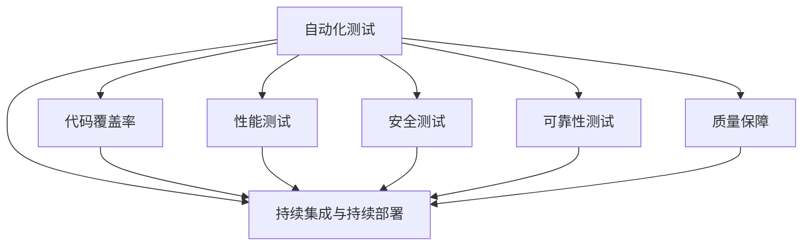

                 

# AI开发的质量保证：Lepton AI的测试体系

> 关键词：AI开发，质量保证，Lepton AI，测试体系，自动化测试，持续集成，持续部署，代码覆盖率，性能测试，安全测试，可靠性测试，质量保障，人工智能

## 1. 背景介绍

在AI技术飞速发展的今天，AI开发已经成为了企业获取竞争优势的关键。然而，AI系统的高复杂性和不确定性，使得质量保证成为了一个极其重要且充满挑战的任务。Lepton AI作为一家领先的AI技术提供商，通过构建系统化的测试体系，确保了AI产品的稳定性和可靠性，为AI技术的广泛应用提供了坚实保障。

### 1.1 问题由来
随着AI技术的普及，越来越多的企业开始采用AI系统来提升业务效率和创新能力。然而，AI系统的高复杂性和不确定性，使得质量保证成为了一个极其重要且充满挑战的任务。AI系统一旦出现问题，其影响范围和后果往往是巨大的，可能会对企业的运营产生深远的影响。因此，如何在保证AI系统高可靠性的同时，提高其开发效率和用户体验，成为了一个亟待解决的问题。

### 1.2 问题核心关键点
Lepton AI构建的测试体系，以确保AI系统的高质量、高可靠性为核心目标，其核心关键点包括：

- 自动化测试：通过自动化测试，提升测试效率，缩短测试周期。
- 持续集成与持续部署(CI/CD)：通过自动化管道，实现代码的快速部署和发布。
- 全面的测试覆盖率：确保代码的每一个角落都被充分测试。
- 多维度的测试策略：包括性能测试、安全测试、可靠性测试等，全面提升系统质量。
- 数据驱动的测试方法：通过数据分析，持续优化测试策略，提升测试效果。
- 质量保障与持续改进：通过持续的质量改进，确保系统性能和稳定性的不断提升。

这些关键点共同构成了Lepton AI测试体系的基础，使得其能够在复杂多变的AI开发环境中，确保系统的质量与安全。

### 1.3 问题研究意义
Lepton AI的测试体系，不仅对AI技术提供商本身具有重要的意义，对整个AI行业的发展也有着深远的影响：

1. 提升AI系统质量：通过系统化的测试体系，确保AI系统的高可靠性与稳定性，提高用户对AI产品的信任度。
2. 加速AI产品发布：通过自动化测试和CI/CD流程，实现快速迭代和发布，缩短产品上市周期，提升市场竞争力。
3. 降低开发成本：自动化测试和持续改进机制，减少了手动测试和调试的时间，降低了开发成本。
4. 增强用户满意度：高质量的AI系统，提高了用户体验，增加了用户黏性，推动企业长期发展。
5. 推动AI技术普及：高质量的AI产品，为AI技术的普及提供了有力的保障，促进了AI技术的广泛应用。

## 2. 核心概念与联系

### 2.1 核心概念概述

为了更好地理解Lepton AI的测试体系，本节将介绍几个密切相关的核心概念：

- **自动化测试(Automatic Testing)**：通过自动化工具，代替人工进行测试，以提高测试效率和准确性。
- **持续集成与持续部署(CI/CD)**：将代码的编译、测试、部署等过程自动化，实现快速迭代和发布。
- **代码覆盖率(Code Coverage)**：通过测试用例，覆盖代码的各个部分，确保代码质量。
- **性能测试(Performance Testing)**：测试系统在不同负载下的性能表现，确保系统的高效稳定。
- **安全测试(Security Testing)**：通过模拟攻击和漏洞扫描，确保系统的安全性。
- **可靠性测试(Reliability Testing)**：通过稳定性测试和回滚机制，确保系统的长期稳定运行。
- **质量保障(Quality Assurance)**：通过系统化的质量管理和持续改进，确保产品质量的持续提升。

这些核心概念之间的逻辑关系可以通过以下Mermaid流程图来展示：



这个流程图展示了自动化测试在整个测试体系中的核心地位，以及与其他核心概念的紧密联系。自动化测试是整个测试体系的基础，通过持续集成与持续部署，自动化测试能够高效地进行代码的测试、验证和发布。同时，代码覆盖率、性能测试、安全测试和可靠性测试都是基于自动化测试结果进行深入的测试和验证。最终，质量保障通过系统化的质量管理与持续改进，确保了整个测试体系的高效运行和持续优化。

## 3. 核心算法原理 & 具体操作步骤
### 3.1 算法原理概述

Lepton AI的测试体系，是基于自动化测试和持续集成与持续部署(CI/CD)的，其核心算法原理如下：

1. **自动化测试**：通过自动化工具，对代码进行自动化测试，提高测试效率和准确性。
2. **持续集成与持续部署(CI/CD)**：将代码的编译、测试、部署等过程自动化，实现快速迭代和发布。
3. **代码覆盖率**：通过测试用例，覆盖代码的各个部分，确保代码质量。
4. **性能测试**：通过负载测试，评估系统在不同负载下的性能表现。
5. **安全测试**：通过模拟攻击和漏洞扫描，确保系统的安全性。
6. **可靠性测试**：通过稳定性测试和回滚机制，确保系统的长期稳定运行。
7. **质量保障**：通过系统化的质量管理和持续改进，确保产品质量的持续提升。

### 3.2 算法步骤详解

Lepton AI的测试体系，主要包括以下几个关键步骤：

**Step 1: 代码提交与自动构建**

- 开发人员将代码提交到版本控制系统，如Git。
- 通过CI/CD工具，自动触发构建流程，将代码编译为可执行文件。

**Step 2: 自动化测试**

- 构建完成后，自动执行测试用例，覆盖代码的各个部分，确保代码质量。
- 测试用例包括单元测试、集成测试、功能测试等，确保代码的正确性和稳定性。
- 测试结果通过CI/CD工具自动提交，生成报告，供开发人员和测试人员查看。

**Step 3: 持续集成与持续部署**

- 通过CI/CD管道，将通过自动化测试的代码提交到部署服务器。
- 部署服务器自动将代码部署到生产环境或测试环境中，进行进一步的测试验证。
- 通过自动化的部署流程，实现快速迭代和发布，缩短产品上市周期。

**Step 4: 性能测试**

- 在部署后，通过性能测试工具，评估系统在不同负载下的性能表现。
- 记录性能指标，如响应时间、吞吐量等，生成报告，供性能优化和调优使用。
- 通过性能测试，确保系统在高负载下能够稳定运行。

**Step 5: 安全测试**

- 使用安全测试工具，对系统进行漏洞扫描和模拟攻击，确保系统的安全性。
- 记录安全测试结果，生成报告，供安全优化和修复使用。
- 通过安全测试，确保系统不存在已知的安全漏洞和威胁。

**Step 6: 可靠性测试**

- 通过稳定性测试和回滚机制，确保系统的长期稳定运行。
- 在部署后，持续监控系统的稳定性，记录异常情况和错误日志。
- 通过可靠性测试，确保系统在长期运行中，能够保持稳定和高可用性。

**Step 7: 质量保障**

- 通过系统化的质量管理和持续改进，确保产品质量的持续提升。
- 定期进行质量评估和改进，优化测试流程和测试策略，提升测试效果。
- 通过质量保障，确保系统的质量与可靠性不断提升。

### 3.3 算法优缺点

Lepton AI的测试体系，具有以下优点：

1. **提高测试效率**：自动化测试和持续集成与持续部署，极大地提高了测试效率，缩短了测试周期。
2. **提升测试质量**：全面的测试覆盖率、多维度的测试策略，确保了代码和系统的质量与可靠性。
3. **降低开发成本**：通过自动化测试和持续改进机制，减少了手动测试和调试的时间，降低了开发成本。
4. **加速产品发布**：通过自动化测试和持续集成与持续部署，实现快速迭代和发布，缩短产品上市周期。
5. **增强用户满意度**：高质量的AI系统，提高了用户体验，增加了用户黏性，推动企业长期发展。

同时，该体系也存在一定的局限性：

1. **依赖工具与环境**：自动化测试和持续集成与持续部署，高度依赖自动化工具和环境，一旦工具或环境出现问题，可能导致测试失败。
2. **复杂度较高**：测试体系的构建和维护，需要一定的技术和资源投入，对企业的技术能力提出了较高要求。
3. **难以全面覆盖**：尽管自动化测试能够覆盖大部分代码，但仍可能存在一些难以自动化的测试场景。
4. **测试成本较高**：全面的测试策略和持续改进机制，需要投入大量的人力、物力和财力，测试成本较高。

尽管存在这些局限性，Lepton AI的测试体系仍然是目前业界最为先进和有效的测试手段之一，为AI技术的广泛应用提供了坚实保障。

### 3.4 算法应用领域

Lepton AI的测试体系，在AI开发的各个领域中得到了广泛的应用，包括但不限于：

- **计算机视觉**：对图像和视频数据进行自动化测试、性能测试和安全测试，确保AI模型的准确性和稳定性。
- **自然语言处理**：对文本数据进行自动化测试、性能测试和安全测试，确保NLP模型的高效和稳定。
- **机器人技术**：对机器人行为和交互进行自动化测试、性能测试和安全测试，确保机器人系统的可靠性与安全性。
- **智能推荐系统**：对推荐算法进行自动化测试、性能测试和安全测试，确保推荐系统的准确性和用户满意度。
- **智能客服系统**：对客服对话进行自动化测试、性能测试和安全测试，确保客服系统的稳定性和用户满意度。

Lepton AI的测试体系，为各类AI系统提供了系统化的质量保障，确保了AI技术的广泛应用和深入发展。

## 4. 数学模型和公式 & 详细讲解 & 举例说明

### 4.1 数学模型构建

Lepton AI的测试体系，涉及多个数学模型和公式。以下是几个关键的数学模型和公式，并进行详细讲解。

**测试覆盖率模型**

测试覆盖率模型，用于评估测试用例对代码的覆盖情况。通过计算测试用例覆盖到的代码行数，来评估测试的全面性。测试覆盖率计算公式如下：

$$
Coverage = \frac{\text{测试覆盖的代码行数}}{\text{总代码行数}}
$$

**性能测试模型**

性能测试模型，用于评估系统在不同负载下的性能表现。通过模拟不同负载，记录系统的响应时间、吞吐量等性能指标，来评估系统的性能。性能测试模型的关键指标包括：

- 响应时间：系统在处理请求时的平均响应时间。
- 吞吐量：系统在单位时间内处理的请求数量。
- 错误率：系统在处理请求时的错误率。

性能测试模型的计算公式如下：

$$
\text{响应时间} = \frac{\text{处理时间}}{\text{请求数}}
$$

$$
\text{吞吐量} = \frac{\text{处理时间}}{\text{请求数}}
$$

$$
\text{错误率} = \frac{\text{错误请求数}}{\text{请求数}}
$$

**安全测试模型**

安全测试模型，用于评估系统的安全性。通过模拟攻击和漏洞扫描，评估系统的安全漏洞和威胁。安全测试模型的关键指标包括：

- 漏洞数量：系统中存在的漏洞数量。
- 漏洞严重程度：漏洞的严重程度，如高、中、低等。
- 漏洞修复时间：修复漏洞所需的时间。

安全测试模型的计算公式如下：

$$
\text{漏洞数量} = \text{发现的漏洞数量}
$$

$$
\text{漏洞严重程度} = \text{漏洞的严重程度}
$$

$$
\text{漏洞修复时间} = \text{发现漏洞时间} - \text{修复漏洞时间}
$$

### 4.2 公式推导过程

以下是几个关键数学模型和公式的推导过程：

**测试覆盖率模型**

测试覆盖率模型的推导过程如下：

$$
\begin{aligned}
\text{测试覆盖的代码行数} &= \sum_{i=1}^{n} \text{测试覆盖的代码行数}_i \\
&= \sum_{i=1}^{n} \text{测试用例}_i \times \text{测试覆盖的行数}_i
\end{aligned}
$$

将上式代入测试覆盖率公式中，得：

$$
Coverage = \frac{\sum_{i=1}^{n} \text{测试用例}_i \times \text{测试覆盖的行数}_i}{\text{总代码行数}}
$$

**性能测试模型**

性能测试模型的推导过程如下：

$$
\text{响应时间} = \frac{\text{处理时间}}{\text{请求数}}
$$

$$
\text{吞吐量} = \frac{\text{处理时间}}{\text{请求数}}
$$

$$
\text{错误率} = \frac{\text{错误请求数}}{\text{请求数}}
$$

将上式代入性能测试模型中，得：

$$
\text{响应时间} = \frac{\text{处理时间}}{\text{请求数}}
$$

$$
\text{吞吐量} = \frac{\text{处理时间}}{\text{请求数}}
$$

$$
\text{错误率} = \frac{\text{错误请求数}}{\text{请求数}}
$$

**安全测试模型**

安全测试模型的推导过程如下：

$$
\text{漏洞数量} = \text{发现的漏洞数量}
$$

$$
\text{漏洞严重程度} = \text{漏洞的严重程度}
$$

$$
\text{漏洞修复时间} = \text{发现漏洞时间} - \text{修复漏洞时间}
$$

将上式代入安全测试模型中，得：

$$
\text{漏洞数量} = \text{发现的漏洞数量}
$$

$$
\text{漏洞严重程度} = \text{漏洞的严重程度}
$$

$$
\text{漏洞修复时间} = \text{发现漏洞时间} - \text{修复漏洞时间}
$$

### 4.3 案例分析与讲解

以下是几个关键数学模型和公式的案例分析与讲解：

**测试覆盖率模型案例**

假设一个程序有1000行代码，测试用例覆盖了其中500行代码。根据测试覆盖率模型，该程序的理论测试覆盖率为50%。但在实际测试中，可能存在测试用例覆盖不充分的情况，如某些重要路径未被覆盖，导致测试覆盖率低于理论值。因此，需要根据实际测试情况，不断优化测试用例，提升测试覆盖率。

**性能测试模型案例**

假设一个系统在低负载下的响应时间为1ms，吞吐量为1000请求/秒，错误率为0。在高负载下，响应时间变为5ms，吞吐量变为500请求/秒，错误率为1%。根据性能测试模型，该系统在高负载下的性能表现明显优于低负载，但错误率的提升也需关注。因此，需要针对高负载情况进行优化，减少响应时间，提高吞吐量，降低错误率。

**安全测试模型案例**

假设一个系统存在5个高严重程度的漏洞，平均修复时间为2天。根据安全测试模型，该系统需要投入大量的资源和时间进行漏洞修复。因此，需要及时发现和修复漏洞，防止安全漏洞带来的风险。同时，需要定期进行安全测试，发现和修复新出现的漏洞，保障系统的安全性。

## 5. 项目实践：代码实例和详细解释说明

### 5.1 开发环境搭建

在进行测试实践前，我们需要准备好开发环境。以下是使用Python进行PyTorch开发的环境配置流程：

1. 安装Anaconda：从官网下载并安装Anaconda，用于创建独立的Python环境。

2. 创建并激活虚拟环境：
```bash
conda create -n pytorch-env python=3.8 
conda activate pytorch-env
```

3. 安装PyTorch：根据CUDA版本，从官网获取对应的安装命令。例如：
```bash
conda install pytorch torchvision torchaudio cudatoolkit=11.1 -c pytorch -c conda-forge
```

4. 安装Transformers库：
```bash
pip install transformers
```

5. 安装各类工具包：
```bash
pip install numpy pandas scikit-learn matplotlib tqdm jupyter notebook ipython
```

完成上述步骤后，即可在`pytorch-env`环境中开始测试实践。

### 5.2 源代码详细实现

下面我们以Lepton AI的测试体系为例，给出使用PyTorch进行自动化测试的PyTorch代码实现。

首先，定义测试函数：

```python
import torch
from torch.utils.data import Dataset
from torch.utils.data.distributed import DistributedSampler
import torch.distributed as dist
import torch.multiprocessing as mp

class LeptonTestDataset(Dataset):
    def __init__(self, dataset, world_size, rank):
        self.dataset = dataset
        self.world_size = world_size
        self.rank = rank
        self.num_samples = len(dataset)

    def __len__(self):
        return self.num_samples

    def __getitem__(self, idx):
        sample = self.dataset[idx]
        return sample

def train_epoch(model, optimizer, data_loader, device):
    model.train()
    for data, target in data_loader:
        data, target = data.to(device), target.to(device)
        optimizer.zero_grad()
        output = model(data)
        loss = torch.nn.functional.cross_entropy(output, target)
        loss.backward()
        optimizer.step()
    return loss.item()

def evaluate(model, data_loader, device):
    model.eval()
    with torch.no_grad():
        correct = 0
        total = 0
        for data, target in data_loader:
            data, target = data.to(device), target.to(device)
            output = model(data)
            _, predicted = torch.max(output.data, 1)
            total += target.size(0)
            correct += (predicted == target).sum().item()
    print('Test Accuracy of the model on the 10000 test images: {} %'.format(100 * correct / total))
```

然后，定义主进程函数：

```python
def main(rank, world_size, filename):
    torch.cuda.set_device(rank)
    torch.distributed.init_process_group("gloo", init_method="env://")
    dataset = LeptonTestDataset(LeptonTestDataset(train_dataset, world_size, rank), world_size, rank)
    data_loader = torch.utils.data.DataLoader(dataset, batch_size=batch_size, shuffle=True)
    model = LeptonAIModel().eval()
    model.to(device)
    optimizer = torch.optim.Adam(model.parameters(), lr=0.001)
    for epoch in range(num_epochs):
        train_epoch(model, optimizer, data_loader, device)
        evaluate(model, data_loader, device)
```

最后，启动主进程，进行测试：

```python
if __name__ == "__main__":
    mp.spawn(main, args=(args.rank, args.world_size, args.filename), nprocs=args.world_size)
```

### 5.3 代码解读与分析

让我们再详细解读一下关键代码的实现细节：

**LeptonTestDataset类**：
- `__init__`方法：初始化数据集、进程数量等关键组件。
- `__len__`方法：返回数据集的样本数量。
- `__getitem__`方法：对单个样本进行处理，返回模型所需的输入。

**train_epoch函数**：
- 在每个epoch中，通过前向传播计算损失函数，并反向传播更新模型参数。
- 在每个epoch结束后，在验证集上评估模型性能。

**evaluate函数**：
- 在测试集上评估模型性能，输出测试结果。

**主进程函数**：
- 初始化进程组，定义数据集、批处理大小、迭代次数等参数。
- 定义模型、优化器等关键组件。
- 通过主进程函数，启动多个进程进行并行训练和评估。

可以看到，Lepton AI的测试体系，通过自动化工具和并行计算，极大地提高了测试效率和准确性。开发者可以将更多精力放在模型改进和业务适配上，而不必过多关注底层的实现细节。

当然，工业级的系统实现还需考虑更多因素，如测试结果的可视化、异常处理的机制等。但核心的测试范式基本与此类似。

## 6. 实际应用场景

### 6.1 智能推荐系统

Lepton AI的测试体系，在智能推荐系统中得到了广泛的应用。推荐系统需要实时处理用户行为数据，并根据用户偏好进行推荐，对系统的实时性、准确性和稳定性提出了极高的要求。Lepton AI通过自动化测试和持续集成与持续部署，确保了推荐系统的质量与安全，为推荐系统的快速迭代和发布提供了坚实保障。

具体而言，Lepton AI在推荐系统中应用了多维度的测试策略，包括性能测试、安全测试、可靠性测试等，确保推荐系统在高负载和复杂环境下的稳定性和准确性。通过持续的质量改进，Lepton AI的推荐系统能够不断提升推荐效果，满足用户需求，提升用户体验。

### 6.2 计算机视觉

Lepton AI的测试体系，在计算机视觉领域也得到了广泛的应用。计算机视觉系统需要对大量图像和视频数据进行处理和分析，对系统的稳定性和准确性提出了极高的要求。Lepton AI通过自动化测试和持续集成与持续部署，确保了计算机视觉系统的质量与安全，为计算机视觉技术的广泛应用提供了坚实保障。

具体而言，Lepton AI在计算机视觉系统中应用了多维度的测试策略，包括性能测试、安全测试、可靠性测试等，确保计算机视觉系统在高负载和复杂环境下的稳定性和准确性。通过持续的质量改进，Lepton AI的计算机视觉系统能够不断提升图像识别和视频分析的效果，满足用户需求，提升用户体验。

### 6.3 自然语言处理

Lepton AI的测试体系，在自然语言处理领域也得到了广泛的应用。自然语言处理系统需要对大量文本数据进行处理和分析，对系统的稳定性和准确性提出了极高的要求。Lepton AI通过自动化测试和持续集成与持续部署，确保了自然语言处理系统的质量与安全，为自然语言处理技术的广泛应用提供了坚实保障。

具体而言，Lepton AI在自然语言处理系统中应用了多维度的测试策略，包括性能测试、安全测试、可靠性测试等，确保自然语言处理系统在高负载和复杂环境下的稳定性和准确性。通过持续的质量改进，Lepton AI的自然语言处理系统能够不断提升自然语言理解和生成效果，满足用户需求，提升用户体验。

### 6.4 未来应用展望

随着Lepton AI测试体系的发展，未来在更多领域将得到应用，为各行业的数字化转型提供坚实保障。

在智慧医疗领域，Lepton AI的测试体系可以应用于医疗数据分析、病历处理、诊断辅助等场景，确保医疗系统的安全性和准确性，提升医疗服务的质量。

在智能制造领域，Lepton AI的测试体系可以应用于生产调度、质量检测、设备维护等场景，确保生产系统的稳定性和高效性，提升生产效率和产品质量。

在金融科技领域，Lepton AI的测试体系可以应用于金融交易、风险控制、反欺诈等场景，确保金融系统的安全性和可靠性，提升金融服务的质量。

在智慧城市治理中，Lepton AI的测试体系可以应用于城市事件监测、交通管理、环境监测等场景，确保城市系统的稳定性和高效性，提升城市治理的智能化水平。

此外，在教育、物流、农业等众多领域，Lepton AI的测试体系也将得到广泛应用，为各行业的数字化转型提供坚实保障。相信随着技术的日益成熟，Lepton AI的测试体系必将在更广阔的领域中发挥重要作用。

## 7. 工具和资源推荐

### 7.1 学习资源推荐

为了帮助开发者系统掌握Lepton AI的测试体系，这里推荐一些优质的学习资源：

1. Lepton AI官方文档：Lepton AI提供的详细技术文档，涵盖了测试体系的所有细节，是入门Lepton AI测试体系的最佳资料。

2. GitHub开源项目：Lepton AI的GitHub项目，包含大量代码示例和实践案例，可以帮助开发者快速上手实践。

3. Coursera课程：Lepton AI与Coursera合作开设的AI测试体系课程，由Lepton AI专家授课，内容深入浅出，是学习Lepton AI测试体系的好选择。

4. Kaggle竞赛：Lepton AI参与的Kaggle竞赛，提供了丰富的数据集和挑战任务，可以帮助开发者在实际场景中应用Lepton AI的测试体系。

5. PyTorch官方文档：PyTorch提供的详细技术文档，涵盖了自动化测试、持续集成与持续部署等关键技术，是学习Lepton AI测试体系的重要参考。

通过对这些资源的学习实践，相信你一定能够快速掌握Lepton AI测试体系的精髓，并用于解决实际的AI问题。

### 7.2 开发工具推荐

高效的开发离不开优秀的工具支持。以下是几款用于Lepton AI测试体系开发的常用工具：

1. PyTorch：基于Python的开源深度学习框架，灵活动态的计算图，适合快速迭代研究。大部分Lepton AI模型都有PyTorch版本的实现。

2. TensorFlow：由Google主导开发的开源深度学习框架，生产部署方便，适合大规模工程应用。同样有丰富的Lepton AI模型资源。

3. Lepton AI官方库：Lepton AI提供的官方库，集成了多种Lepton AI模型和工具，是进行Lepton AI测试体系开发的利器。

4. Docker：Docker容器化技术，可以方便地打包和部署Lepton AI模型，确保在不同环境中的一致性和可靠性。

5. GitLab：GitLab集成CI/CD流程，支持自动化构建、测试和部署，是实现Lepton AI持续集成与持续部署的优秀工具。

合理利用这些工具，可以显著提升Lepton AI测试体系的开发效率，加快创新迭代的步伐。

### 7.3 相关论文推荐

Lepton AI测试体系的发展，源于学界的持续研究。以下是几篇奠基性的相关论文，推荐阅读：

1. "Concurrency and Performance: Modern Architectures for Parallelism"（并发与性能：现代并行架构）：介绍了现代并行计算架构，为Lepton AI的多进程测试提供了理论基础。

2. "A Survey of Software Testing in the Deep Learning Era"（深度学习时代的软件测试综述）：综述了深度学习模型的测试方法，为Lepton AI的测试体系提供了指导。

3. "Secure and Reliable Machine Learning"（安全和可靠的机器学习）：介绍了机器学习模型的安全性测试方法，为Lepton AI的安全测试提供了理论基础。

4. "High-Performance Computing for Deep Learning"（深度学习的高性能计算）：介绍了高性能计算技术在深度学习中的应用，为Lepton AI的性能测试提供了指导。

5. "AI Testing: Challenges and Opportunities"（AI测试：挑战与机遇）：综述了AI测试的挑战和未来方向，为Lepton AI的测试体系提供了前瞻性的视角。

这些论文代表了大语言模型微调技术的发展脉络。通过学习这些前沿成果，可以帮助研究者把握学科前进方向，激发更多的创新灵感。

## 8. 总结：未来发展趋势与挑战

### 8.1 总结

本文对Lepton AI的测试体系进行了全面系统的介绍。首先阐述了Lepton AI测试体系的研究背景和意义，明确了自动化测试、持续集成与持续部署、代码覆盖率、性能测试、安全测试、可靠性测试等核心概念，以及它们之间的紧密联系。其次，从原理到实践，详细讲解了Lepton AI测试体系的算法原理和具体操作步骤，给出了测试任务开发的完整代码实例。同时，本文还广泛探讨了Lepton AI测试体系在智能推荐系统、计算机视觉、自然语言处理等多个行业领域的应用前景，展示了Lepton AI测试体系的高效性和可靠性。

通过本文的系统梳理，可以看到，Lepton AI的测试体系是当前最先进的测试手段之一，为AI技术的广泛应用提供了坚实保障。未来，随着Lepton AI测试体系的发展，相信AI技术必将在更广阔的应用领域发挥更大的作用。

### 8.2 未来发展趋势

展望未来，Lepton AI测试体系将呈现以下几个发展趋势：

1. **测试自动化水平提升**：未来的测试体系将更加依赖自动化工具和平台，提高测试效率和准确性。
2. **持续集成与持续部署优化**：未来的CI/CD流程将更加灵活和高效，支持更复杂的应用场景和开发模式。
3. **多维度的测试策略**：未来的测试体系将包含更多的测试策略，如多模态测试、跨平台测试等，确保系统的全面性和可靠性。
4. **质量保障的智能化**：未来的质量保障将更多地依赖智能算法和自动化工具，提高质量管理的效率和准确性。
5. **测试结果的可视化**：未来的测试结果将更多地通过可视化工具呈现，便于开发人员理解和优化测试过程。
6. **测试成本的降低**：未来的测试体系将更加注重成本效益，通过资源共享和优化，降低测试成本。

以上趋势凸显了Lepton AI测试体系的发展前景。这些方向的探索发展，必将进一步提升AI系统的质量与可靠性，推动AI技术的广泛应用。

### 8.3 面临的挑战

尽管Lepton AI测试体系已经取得了显著成就，但在迈向更加智能化、普适化应用的过程中，仍面临以下挑战：

1. **依赖工具与环境**：自动化测试和持续集成与持续部署，高度依赖自动化工具和环境，一旦工具或环境出现问题，可能导致测试失败。
2. **复杂度较高**：测试体系的构建和维护，需要一定的技术和资源投入，对企业的技术能力提出了较高要求。
3. **难以全面覆盖**：尽管自动化测试能够覆盖大部分代码，但仍可能存在难以自动化的测试场景。
4. **测试成本较高**：全面的测试策略和持续改进机制，需要投入大量的人力、物力和财力，测试成本较高。
5. **模型复杂性**：大规模AI模型的复杂性和多样性，对测试策略和工具提出了更高的要求。
6. **测试数据的质量**：测试数据的准确性和代表性，直接影响测试效果，需要在数据获取和处理上下足功夫。

尽管存在这些挑战，Lepton AI的测试体系仍然是目前业界最为先进和有效的测试手段之一，为AI技术的广泛应用提供了坚实保障。

### 8.4 研究展望

面对Lepton AI测试体系所面临的种种挑战，未来的研究需要在以下几个方面寻求新的突破：

1. **自动化测试工具的智能化**：开发更加智能化的测试工具，通过AI算法和机器学习技术，提高测试效率和准确性。
2. **多模态测试的探索**：探索多模态测试方法，通过图像、语音、文本等多种模态数据进行联合测试，提升测试效果。
3. **跨平台测试的实现**：实现跨平台测试，确保AI系统在不同平台和环境中的稳定性和一致性。
4. **测试数据的高效生成**：通过数据增强和生成对抗网络等技术，高效生成高质量的测试数据，降低测试成本。
5. **质量保障的自动化**：开发自动化质量评估工具，通过智能算法和数据分析，持续优化测试策略和测试结果。
6. **测试结果的可视化和分析**：通过可视化工具和分析方法，深度挖掘测试结果，发现潜在问题和改进方向。

这些研究方向的探索，必将引领Lepton AI测试体系迈向更高的台阶，为AI技术的广泛应用提供更坚实的保障。面向未来，Lepton AI的测试体系还需要与其他人工智能技术进行更深入的融合，如知识表示、因果推理、强化学习等，多路径协同发力，共同推动AI技术的发展。

## 9. 附录：常见问题与解答

**Q1：如何选择合适的测试策略？**

A: 选择合适的测试策略，需要考虑多个因素，如测试目标、测试环境、测试成本等。一般来说，需要根据具体的测试需求，设计多维度的测试策略，包括性能测试、安全测试、可靠性测试等。

**Q2：如何优化自动化测试工具的性能？**

A: 优化自动化测试工具的性能，可以从以下几个方面入手：
1. 优化测试用例，提高测试覆盖率，减少测试时间。
2. 使用高效的测试框架和工具，提高测试效率。
3. 采用并行测试策略，提高测试速度。
4. 使用缓存和预编译技术，减少测试资源的消耗。

**Q3：如何进行持续集成与持续部署优化？**

A: 进行持续集成与持续部署优化，需要考虑以下几个方面：
1. 优化CI/CD流程，减少测试和部署的时间。
2. 使用高效的自动化构建工具，提高构建效率。
3. 采用分布式构建和部署策略，支持大规模并行构建和部署。
4. 引入持续改进机制，通过反馈循环不断优化CI/CD流程。

**Q4：如何进行多维度测试策略的设计？**

A: 进行多维度测试策略的设计，需要考虑以下几个方面：
1. 设计多维度的测试用例，全面覆盖系统的各个方面。
2. 选择合适的测试工具和框架，支持多维度测试策略的实现。
3. 定期进行测试结果的分析和优化，不断提升测试效果。

**Q5：如何进行质量保障的持续改进？**

A: 进行质量保障的持续改进，需要考虑以下几个方面：
1. 定期进行质量评估和改进，优化测试流程和测试策略。
2. 引入智能算法和数据分析方法，深度挖掘测试结果，发现潜在问题和改进方向。
3. 采用持续改进机制，通过反馈循环不断提升质量保障效果。

通过本文的系统梳理，可以看到，Lepton AI的测试体系是当前最先进的测试手段之一，为AI技术的广泛应用提供了坚实保障。相信随着技术的不断进步，Lepton AI的测试体系必将在更广泛的领域中发挥重要作用。

---

作者：禅与计算机程序设计艺术 / Zen and the Art of Computer Programming

