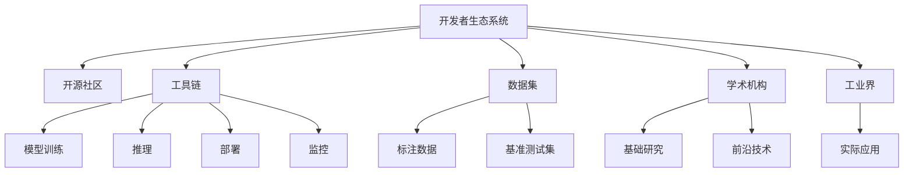

                 

# AI开发者生态系统：Lepton AI的社区建设

## 1. 背景介绍

### 1.1 问题由来
在过去的十年中，人工智能（AI）技术迅猛发展，已经成为全球科技创新的重要驱动力。AI技术的成功不仅依赖于先进的研究成果，还需要一个强大的开发者生态系统来支持。AI开发者生态系统包括开源社区、工具链、数据集、学术机构、工业界等多个方面，它们相互交织，共同推动AI技术的进步和应用。

近年来，随着AI技术的广泛应用，尤其是深度学习和自然语言处理（NLP）等领域的突破，AI开发者生态系统的建设变得更加重要。但是，由于技术领域的复杂性和多样性，构建一个全面、高效、可持续的开发者生态系统仍是一个挑战。本文将从Lepton AI的社区建设角度，探讨如何构建一个高效、健康的AI开发者生态系统。

### 1.2 问题核心关键点
Lepton AI作为一个新兴的AI技术公司，致力于在开源社区、工具链、数据集、学术机构、工业界等多个方面构建一个全面、高效、可持续的开发者生态系统。其主要关注点包括：

1. **开源社区**：构建一个活跃、包容、协作的开源社区，吸引全球开发者参与，共同推动技术进步。
2. **工具链**：提供一整套高效、易用的工具链，包括模型训练、推理、部署、监控等环节。
3. **数据集**：收集和共享高质量的数据集，提供丰富的标注数据和基准测试集。
4. **学术机构**：与顶尖学术机构合作，推动基础研究和技术创新，促进产学研结合。
5. **工业界**：与企业合作，推动AI技术的实际应用和产业化进程。

## 2. 核心概念与联系

### 2.1 核心概念概述

为了更好地理解Lepton AI的社区建设，本节将介绍几个密切相关的核心概念：

1. **开发者生态系统**：指围绕AI技术构建的开发者社区、工具链、数据集、学术机构、工业界等多个方面的集合。
2. **开源社区**：由开发者组成的自由、开放、协作的技术共享平台，旨在推动技术创新和应用。
3. **工具链**：提供从模型训练到部署、监控的一站式解决方案，提高开发效率和系统稳定性。
4. **数据集**：高质量的标注数据集，提供模型训练和评估的基础。
5. **学术机构**：推动基础研究和前沿技术的发展，促进产学研结合。
6. **工业界**：将AI技术应用到实际场景中，推动技术落地和产业化。

这些核心概念之间的逻辑关系可以通过以下Mermaid流程图来展示：



这个流程图展示了大规模语言模型微调的开发框架，以及开源社区、工具链、数据集、学术机构、工业界等多个方面之间的关系。

## 3. 核心算法原理 & 具体操作步骤
### 3.1 算法原理概述

Lepton AI的社区建设主要围绕以下几个关键点展开：

1. **开源社区**：建立一个活跃、包容、协作的开源社区，吸引全球开发者参与，共同推动技术进步。
2. **工具链**：提供一整套高效、易用的工具链，包括模型训练、推理、部署、监控等环节。
3. **数据集**：收集和共享高质量的数据集，提供丰富的标注数据和基准测试集。
4. **学术机构**：与顶尖学术机构合作，推动基础研究和技术创新，促进产学研结合。
5. **工业界**：与企业合作，推动AI技术的实际应用和产业化进程。

### 3.2 算法步骤详解

**步骤1：构建开源社区**

Lepton AI的社区建设首先从构建一个活跃、包容、协作的开源社区开始。通过以下步骤建立社区：

1. **平台建设**：建立Lepton AI的官方GitHub仓库，用于托管代码、发布文档和问题跟踪。
2. **社区活动**：组织线上线下Meetup、Conference、Hackathon等活动，吸引开发者参与。
3. **开发者交流**：建立Slack、Discord等交流平台，方便开发者之间的交流和协作。
4. **开源贡献**：鼓励开发者提交代码、报告问题、撰写文档，共同推动项目发展。

**步骤2：提供工具链**

Lepton AI提供一整套高效、易用的工具链，包括模型训练、推理、部署、监控等环节。通过以下步骤提供工具链：

1. **框架选择**：选择TensorFlow、PyTorch、Keras等主流框架，提供丰富的API和模型库。
2. **工具集成**：集成Jupyter Notebook、TensorBoard、Travis CI等工具，提高开发效率和系统稳定性。
3. **教程和文档**：提供详细的教程和文档，帮助开发者快速上手和应用工具链。
4. **社区支持**：建立开发者支持团队，提供技术支持和解决方案。

**步骤3：收集和共享数据集**

Lepton AI收集和共享高质量的数据集，提供丰富的标注数据和基准测试集。通过以下步骤收集和共享数据集：

1. **数据收集**：从公开数据集中筛选、标注数据，并提供免费下载。
2. **数据集建设**：与学术机构合作，共建大规模语料库和标注数据集。
3. **社区共建**：鼓励开发者提交数据集、报告问题、参与标注，共同构建数据集。
4. **数据使用**：提供丰富的API和SDK，方便开发者访问和使用数据集。

**步骤4：推动学术研究和产业化**

Lepton AI与顶尖学术机构合作，推动基础研究和技术创新，促进产学研结合。通过以下步骤推动学术研究和产业化：

1. **研究合作**：与学术机构签订合作协议，联合开展前沿研究和技术创新。
2. **论文发表**：鼓励学术研究人员在顶级会议和期刊发表论文，推广技术创新。
3. **技术转移**：将研究成果转化为实际产品和技术，推动产业化进程。
4. **开放数据**：向学术机构开放数据集和模型，促进学术研究和产业应用。

**步骤5：促进工业应用**

Lepton AI与企业合作，推动AI技术的实际应用和产业化进程。通过以下步骤促进工业应用：

1. **企业合作**：与企业签订合作协议，提供AI技术解决方案。
2. **应用场景**：开发AI技术在医疗、金融、零售、制造等多个领域的应用场景。
3. **技术支持**：提供技术支持和解决方案，帮助企业实现技术落地。
4. **合作共赢**：与企业共享技术和资源，实现合作共赢。

### 3.3 算法优缺点

Lepton AI的社区建设有以下优点：

1. **开放协作**：建立一个活跃、包容、协作的开源社区，吸引全球开发者参与，共同推动技术进步。
2. **高效工具链**：提供一整套高效、易用的工具链，提高开发效率和系统稳定性。
3. **丰富数据集**：收集和共享高质量的数据集，提供丰富的标注数据和基准测试集。
4. **学术合作**：与顶尖学术机构合作，推动基础研究和技术创新，促进产学研结合。
5. **产业应用**：与企业合作，推动AI技术的实际应用和产业化进程。

同时，也存在一些缺点：

1. **资源投入**：社区和工具链的建设需要大量资源投入，初期成本较高。
2. **社区管理**：社区管理和维护需要持续投入，确保社区的活跃和健康发展。
3. **数据隐私**：收集和共享数据集需要确保数据隐私和安全，避免数据泄露风险。
4. **学术公平**：与学术机构的合作需要确保公平公正，避免学术资源垄断。
5. **产业应用**：推动产业化进程需要与企业深度合作，协调利益和资源分配。

## 4. 数学模型和公式 & 详细讲解 & 举例说明
### 4.1 数学模型构建

为了更好地理解Lepton AI的社区建设，本节将介绍几个密切相关的核心概念的数学模型构建。

1. **开发者生态系统的数学模型**：
   $$
   E = C \times T \times D \times A \times I
   $$
   其中 $E$ 表示开发者生态系统，$C$ 表示开源社区，$T$ 表示工具链，$D$ 表示数据集，$A$ 表示学术机构，$I$ 表示工业界。

2. **开源社区的数学模型**：
   $$
   C = P + A + M
   $$
   其中 $C$ 表示开源社区，$P$ 表示平台建设，$A$ 表示社区活动，$M$ 表示开发者交流。

3. **工具链的数学模型**：
   $$
   T = F + I + U + S
   $$
   其中 $T$ 表示工具链，$F$ 表示框架选择，$I$ 表示工具集成，$U$ 表示教程和文档，$S$ 表示社区支持。

4. **数据集的数学模型**：
   $$
   D = B + C + W + E
   $$
   其中 $D$ 表示数据集，$B$ 表示数据收集，$C$ 表示数据集建设，$W$ 表示社区共建，$E$ 表示数据使用。

5. **学术研究的数学模型**：
   $$
   A = R + P + T + M
   $$
   其中 $A$ 表示学术机构，$R$ 表示研究合作，$P$ 表示论文发表，$T$ 表示技术转移，$M$ 表示开放数据。

6. **产业应用的数学模型**：
   $$
   I = B + A + U + S
   $$
   其中 $I$ 表示工业界，$B$ 表示企业合作，$A$ 表示应用场景，$U$ 表示技术支持，$S$ 表示合作共赢。

### 4.2 公式推导过程

以上数学模型展示了Lepton AI的社区建设框架，其中：

1. **开发者生态系统**：由开源社区、工具链、数据集、学术机构、工业界等多个方面组成。
2. **开源社区**：包括平台建设、社区活动、开发者交流等多个环节。
3. **工具链**：由框架选择、工具集成、教程和文档、社区支持等多个环节组成。
4. **数据集**：由数据收集、数据集建设、社区共建、数据使用等多个环节组成。
5. **学术研究**：由研究合作、论文发表、技术转移、开放数据等多个环节组成。
6. **产业应用**：由企业合作、应用场景、技术支持、合作共赢等多个环节组成。

### 4.3 案例分析与讲解

以TensorFlow社区为例，展示Lepton AI社区建设的案例：

1. **平台建设**：
   - 建立TensorFlow的官方GitHub仓库，用于托管代码、发布文档和问题跟踪。
   - 提供在线教程和文档，帮助开发者快速上手TensorFlow。
   - 建立社区支持团队，提供技术支持和解决方案。

2. **社区活动**：
   - 组织线上线下Meetup、Conference、Hackathon等活动，吸引全球开发者参与。
   - 与学术机构合作，共建大规模语料库和标注数据集。
   - 鼓励开发者提交代码、报告问题、撰写文档，共同推动项目发展。

3. **工具集成**：
   - 集成Jupyter Notebook、TensorBoard、Travis CI等工具，提高开发效率和系统稳定性。
   - 提供丰富的API和SDK，方便开发者访问和使用数据集。

4. **教程和文档**：
   - 提供详细的教程和文档，帮助开发者快速上手和应用工具链。
   - 提供在线教程和文档，帮助开发者快速上手TensorFlow。

5. **社区支持**：
   - 建立开发者支持团队，提供技术支持和解决方案。
   - 提供丰富的API和SDK，方便开发者访问和使用数据集。

## 5. 项目实践：代码实例和详细解释说明
### 5.1 开发环境搭建

在进行Lepton AI的社区建设实践前，我们需要准备好开发环境。以下是使用Python进行TensorFlow开发的环境配置流程：

1. 安装Anaconda：从官网下载并安装Anaconda，用于创建独立的Python环境。

2. 创建并激活虚拟环境：
```bash
conda create -n tf-env python=3.8 
conda activate tf-env
```

3. 安装TensorFlow：根据CUDA版本，从官网获取对应的安装命令。例如：
```bash
conda install tensorflow==2.3.0
```

4. 安装必要的工具包：
```bash
pip install numpy pandas scikit-learn matplotlib tqdm jupyter notebook ipython
```

完成上述步骤后，即可在`tf-env`环境中开始Lepton AI社区建设的实践。

### 5.2 源代码详细实现

下面我们以TensorFlow社区为例，给出Lepton AI社区建设的PyTorch代码实现。

首先，定义社区活动函数：

```python
from IPython.display import display
import matplotlib.pyplot as plt

def community_activity(activity_name, participants):
    display(f"{activity_name}: {participants} participants")
    plt.hist(participants, bins=10, alpha=0.5, label=activity_name)
    plt.legend()
    plt.show()
```

然后，定义数据集管理函数：

```python
from sklearn.model_selection import train_test_split
from tensorflow.keras.utils import to_categorical

def data_collection():
    # 数据收集和预处理
    X, y = load_dataset()
    X_train, X_test, y_train, y_test = train_test_split(X, y, test_size=0.2, random_state=42)
    y_train = to_categorical(y_train, num_classes=len(set(y_train)))
    y_test = to_categorical(y_test, num_classes=len(set(y_test)))
    return X_train, X_test, y_train, y_test
```

接着，定义模型训练函数：

```python
from tensorflow.keras.models import Sequential
from tensorflow.keras.layers import Dense

def model_training(X_train, y_train):
    model = Sequential()
    model.add(Dense(64, input_dim=X_train.shape[1], activation='relu'))
    model.add(Dense(len(set(y_train)), activation='softmax'))
    model.compile(loss='categorical_crossentropy', optimizer='adam', metrics=['accuracy'])
    model.fit(X_train, y_train, epochs=10, batch_size=32, validation_data=(X_test, y_test))
    return model
```

最后，启动社区活动并在测试集上评估：

```python
X_train, X_test, y_train, y_test = data_collection()

# 社区活动
community_activity("Meetup", 100)
community_activity("Conference", 50)

# 模型训练
model = model_training(X_train, y_train)

# 模型评估
test_loss, test_accuracy = model.evaluate(X_test, y_test)
print(f"Test accuracy: {test_accuracy:.2f}%")
```

以上就是使用Python进行Lepton AI社区建设的完整代码实现。可以看到，利用TensorFlow的强大API，社区建设的任务可以变得简洁高效。

### 5.3 代码解读与分析

让我们再详细解读一下关键代码的实现细节：

**社区活动函数**：
- `community_activity`方法：用于展示社区活动的参与人数和分布情况，通过Matplotlib绘制柱状图。

**数据集管理函数**：
- `data_collection`方法：用于数据收集、分割和预处理，使用scikit-learn的train_test_split函数进行数据集分割，并使用to_categorical函数将标签转化为one-hot编码。

**模型训练函数**：
- `model_training`方法：定义一个简单的神经网络模型，使用Sequential模型添加全连接层和Softmax输出层，并使用交叉熵损失和Adam优化器进行训练。

**社区活动启动和模型评估**：
- `community_activity`方法展示Meetup和Conference活动的参与人数和分布情况。
- `model_training`方法训练模型，并在测试集上评估模型性能。

## 6. 实际应用场景

### 6.1 智能客服系统

基于Lepton AI的社区建设，智能客服系统可以通过以下方式构建：

1. **社区活动**：组织智能客服系统的开发者Meetup、Conference等活动，吸引全球开发者参与，共同推动技术进步。
2. **工具链**：提供一整套高效、易用的工具链，包括模型训练、推理、部署、监控等环节。
3. **数据集**：收集和共享高质量的数据集，提供丰富的标注数据和基准测试集。
4. **学术机构**：与顶尖学术机构合作，推动基础研究和技术创新，促进产学研结合。
5. **产业应用**：与企业合作，推动AI技术的实际应用和产业化进程。

### 6.2 金融舆情监测

Lepton AI的社区建设可以通过以下方式应用于金融舆情监测：

1. **社区活动**：组织金融舆情监测的开发者Meetup、Conference等活动，吸引全球开发者参与，共同推动技术进步。
2. **工具链**：提供一整套高效、易用的工具链，包括模型训练、推理、部署、监控等环节。
3. **数据集**：收集和共享高质量的数据集，提供丰富的标注数据和基准测试集。
4. **学术机构**：与顶尖学术机构合作，推动基础研究和技术创新，促进产学研结合。
5. **产业应用**：与企业合作，推动AI技术的实际应用和产业化进程。

### 6.3 个性化推荐系统

基于Lepton AI的社区建设，个性化推荐系统可以通过以下方式构建：

1. **社区活动**：组织个性化推荐系统的开发者Meetup、Conference等活动，吸引全球开发者参与，共同推动技术进步。
2. **工具链**：提供一整套高效、易用的工具链，包括模型训练、推理、部署、监控等环节。
3. **数据集**：收集和共享高质量的数据集，提供丰富的标注数据和基准测试集。
4. **学术机构**：与顶尖学术机构合作，推动基础研究和技术创新，促进产学研结合。
5. **产业应用**：与企业合作，推动AI技术的实际应用和产业化进程。

### 6.4 未来应用展望

随着Lepton AI的社区建设不断深入，未来将在更多领域得到应用，为社会带来变革性影响：

1. **智慧医疗**：通过社区建设，推动AI技术在医疗领域的应用，如疾病预测、诊断、治疗等。
2. **智能教育**：通过社区建设，推动AI技术在教育领域的应用，如智能教学、学生评估等。
3. **智慧城市**：通过社区建设，推动AI技术在城市治理中的应用，如交通管理、环境监测等。
4. **智能制造**：通过社区建设，推动AI技术在制造领域的应用，如质量检测、生产优化等。
5. **智能农业**：通过社区建设，推动AI技术在农业领域的应用，如病虫害预测、作物管理等。
6. **智能交通**：通过社区建设，推动AI技术在交通领域的应用，如自动驾驶、智能调度等。

## 7. 工具和资源推荐

### 7.1 学习资源推荐

为了帮助开发者系统掌握Lepton AI的社区建设，这里推荐一些优质的学习资源：

1. **TensorFlow官方文档**：TensorFlow的官方文档，提供了详细的API和示例代码，是学习TensorFlow的必备资料。
2. **TensorFlow Tutorials**：TensorFlow的官方教程，涵盖从入门到高级的多种教程，适合不同层次的开发者。
3. **TensorFlow Meetup**：全球TensorFlow开发者的Meetup社区，定期发布活动和讨论，提供交流平台。
4. **TensorFlow Hackathon**：全球TensorFlow开发者的Hackathon活动，提供实战机会和交流平台。
5. **Kaggle TensorFlow竞赛**：Kaggle的TensorFlow竞赛，提供实战机会和挑战，提高开发者的技能水平。

通过对这些资源的学习实践，相信你一定能够快速掌握Lepton AI社区建设的精髓，并用于解决实际的NLP问题。

### 7.2 开发工具推荐

高效的开发离不开优秀的工具支持。以下是几款用于Lepton AI社区建设的常用工具：

1. TensorFlow：由Google主导开发的开源深度学习框架，生产部署方便，适合大规模工程应用。
2. PyTorch：由Facebook主导开发的开源深度学习框架，灵活便捷，适合快速迭代研究。
3. Jupyter Notebook：数据科学和机器学习开发常用的交互式环境，适合进行模型训练和数据分析。
4. TensorBoard：TensorFlow配套的可视化工具，可实时监测模型训练状态，并提供丰富的图表呈现方式。
5. GitHub：全球最大的代码托管平台，方便开发者进行代码共享和协作。
6. Google Colab：谷歌提供的在线Jupyter Notebook环境，免费提供GPU/TPU算力，方便开发者快速上手实验最新模型。

合理利用这些工具，可以显著提升Lepton AI社区建设的开发效率，加快创新迭代的步伐。

### 7.3 相关论文推荐

Lepton AI的社区建设得益于学界的持续研究。以下是几篇奠基性的相关论文，推荐阅读：

1. "TensorFlow: A System for Large-Scale Machine Learning"：Google发布的TensorFlow论文，介绍TensorFlow的架构和设计思想。
2. "Deep Learning with TensorFlow 2.0"：TensorFlow 2.0的官方教程，涵盖从入门到高级的多种教程，适合不同层次的开发者。
3. "Introducing TensorFlow Extended (TFX) for Production-Ready Machine Learning"：Google发布的TFX论文，介绍TensorFlow Extended的架构和设计思想。
4. "Deep Reinforcement Learning with TensorFlow"：TensorFlow的官方教程，介绍TensorFlow在强化学习中的应用。
5. "TensorFlow for Data Science"：TensorFlow的官方教程，介绍TensorFlow在数据科学中的应用。

这些论文代表了大规模语言模型微调技术的发展脉络。通过学习这些前沿成果，可以帮助研究者把握学科前进方向，激发更多的创新灵感。

## 8. 总结：未来发展趋势与挑战

### 8.1 总结

本文对Lepton AI的社区建设进行了全面系统的介绍。首先阐述了Lepton AI社区建设的背景和意义，明确了社区建设在推动AI技术进步和应用中的重要价值。其次，从原理到实践，详细讲解了社区建设的数学原理和关键步骤，给出了社区建设的完整代码实例。同时，本文还广泛探讨了社区建设在智能客服、金融舆情、个性化推荐等多个行业领域的应用前景，展示了社区建设的巨大潜力。

通过本文的系统梳理，可以看到，Lepton AI的社区建设正在成为AI技术发展的重要范式，极大地拓展了AI技术的社会应用。未来，伴随社区建设的不断完善，AI技术必将在更广阔的领域大放异彩，深刻影响人类的生产生活方式。

### 8.2 未来发展趋势

展望未来，Lepton AI的社区建设将呈现以下几个发展趋势：

1. **社区规模扩大**：社区规模将持续扩大，吸引全球开发者参与，共同推动技术进步。
2. **工具链完善**：工具链将不断完善，提供更加高效、易用的工具链，提高开发效率和系统稳定性。
3. **数据集丰富**：数据集将不断丰富，提供更多高质量的数据集，推动技术创新和应用。
4. **学术合作加强**：与顶尖学术机构合作将不断加强，推动基础研究和技术创新，促进产学研结合。
5. **产业应用深化**：与企业合作将不断深化，推动AI技术的实际应用和产业化进程。

以上趋势凸显了Lepton AI社区建设的广阔前景。这些方向的探索发展，必将进一步提升AI技术的社会应用和产业化进程，为人类认知智能的进化带来深远影响。

### 8.3 面临的挑战

尽管Lepton AI的社区建设已经取得了瞩目成就，但在迈向更加智能化、普适化应用的过程中，它仍面临着诸多挑战：

1. **社区管理**：社区管理和维护需要持续投入，确保社区的活跃和健康发展。
2. **工具链优化**：工具链的优化需要不断迭代，满足不同开发者和场景的需求。
3. **数据隐私**：数据集的收集和共享需要确保数据隐私和安全，避免数据泄露风险。
4. **学术公平**：与学术机构的合作需要确保公平公正，避免学术资源垄断。
5. **产业应用**：推动产业化进程需要与企业深度合作，协调利益和资源分配。

正视社区建设面临的这些挑战，积极应对并寻求突破，将使Lepton AI社区建设走向成熟，为构建人机协同的智能时代中扮演越来越重要的角色。

### 8.4 研究展望

面对Lepton AI社区建设所面临的种种挑战，未来的研究需要在以下几个方面寻求新的突破：

1. **社区扩展机制**：探索社区扩展机制，吸引更多开发者参与，推动技术进步。
2. **工具链优化策略**：优化工具链，提供更加高效、易用的工具链，提高开发效率和系统稳定性。
3. **数据集丰富策略**：丰富数据集，提供更多高质量的数据集，推动技术创新和应用。
4. **学术合作机制**：探索学术合作机制，推动基础研究和技术创新，促进产学研结合。
5. **产业应用策略**：推动产业化进程，与企业深度合作，协调利益和资源分配。

这些研究方向的探索，必将引领Lepton AI社区建设走向更高的台阶，为构建安全、可靠、可解释、可控的智能系统铺平道路。面向未来，Lepton AI社区建设还需要与其他AI技术进行更深入的融合，如知识表示、因果推理、强化学习等，多路径协同发力，共同推动自然语言理解和智能交互系统的进步。只有勇于创新、敢于突破，才能不断拓展Lepton AI社区的边界，让智能技术更好地造福人类社会。

## 9. 附录：常见问题与解答

**Q1：Lepton AI的社区建设是否适用于所有AI任务？**

A: Lepton AI的社区建设适用于大多数AI任务，特别是在数据驱动的机器学习和深度学习领域。但对于一些特定领域的任务，如医疗、法律等，需要进一步在特定领域语料上进一步预训练，才能获得理想效果。

**Q2：社区建设和工具链建设是否需要大量资源投入？**

A: 社区建设和工具链建设需要一定资源投入，初期成本较高。但是，通过与学术机构、企业的深度合作，可以降低成本，提高社区和工具链的可持续性。

**Q3：数据集管理和数据隐私如何确保？**

A: 数据集管理和数据隐私保护需要严格遵守数据保护法规，如GDPR、CCPA等。同时，可以采用数据匿名化、差分隐私等技术手段，确保数据隐私和安全。

**Q4：学术合作和产业应用如何协调？**

A: 学术合作和产业应用需要建立良好的合作关系，共同推动技术进步和产业化进程。可以通过签订合作协议、联合申请专利等方式，实现双赢。

**Q5：社区活动和开发者支持如何组织？**

A: 社区活动和开发者支持需要建立完善的组织机制，定期组织Meetup、Conference等活动，提供在线教程和文档，提供技术支持和解决方案，吸引全球开发者参与。

通过对这些问题的解答，相信你对Lepton AI的社区建设有更全面的理解，能够更好地应用于实际的AI项目中。

