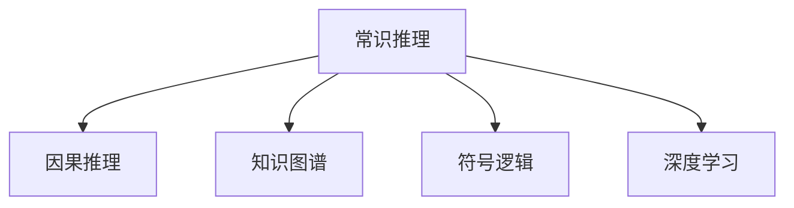

                 

# AI推理能力的局限性:常识推理和因果推理

> 关键词：常识推理,因果推理,人工智能,推理能力,知识图谱,模型局限,复杂推理,人类直觉

## 1. 背景介绍

### 1.1 问题由来
人工智能(AI)的发展近年来取得了飞速进步，从最初的符号逻辑到深度学习的神经网络，AI技术在图像识别、语音识别、自然语言处理等领域都取得了突破性进展。然而，推理能力，尤其是常识推理和因果推理能力，仍然是人工智能的重要瓶颈之一。常识推理和因果推理是理解和推断复杂因果关系和已知事实的推理能力，是智能系统得以理解、解释和生成真实世界的关键。尽管在深度学习等技术驱动下，AI推理能力有了显著提升，但与人类相比，仍然存在巨大的差距。

### 1.2 问题核心关键点
常识推理和因果推理能力的局限性主要体现在以下几个方面：
1. **知识储备不足**：AI系统缺乏足够的常识性知识和世界模型，难以理解复杂的因果关系和多变的情况。
2. **推理机制的局限**：当前的深度学习模型更多依赖于数据驱动，难以进行基于符号逻辑和知识图谱的复杂推理。
3. **可解释性差**：AI系统的推理过程缺乏透明度，难以解释其决策背后的逻辑。
4. **泛化能力有限**：AI模型在面对新场景和新数据时，泛化能力有限，难以适应不断变化的环境。

### 1.3 问题研究意义
深入理解AI推理能力的局限性，有助于找到提高推理能力的方法和路径，推动AI技术向更高级别的认知智能发展。具体而言：
1. **提高推理能力**：提升AI系统的常识推理和因果推理能力，使其具备更强的理解和生成真实世界的能力。
2. **增强可解释性**：提供AI推理过程的透明度，增强模型的可解释性和可信度。
3. **促进应用落地**：提升AI系统的泛化能力和鲁棒性，使其更好地适应实际应用场景，推动AI技术在各行各业的落地。

## 2. 核心概念与联系

### 2.1 核心概念概述

为了更好地理解常识推理和因果推理的局限性，本节将介绍几个核心概念：

- **常识推理(Commonsense Reasoning)**：指基于日常经验和常识，对简单事实进行推断和推理的能力。它依赖于对世界的直观理解和常识性知识，是AI推理能力的重要组成部分。

- **因果推理(Causal Reasoning)**：指理解和推断因果关系的能力。它涉及识别原因和结果之间的逻辑联系，是理解和解释复杂事件的重要手段。

- **知识图谱(Knowledge Graph)**：一种结构化知识表示方法，用于组织和表达实体间的关系。知识图谱为常识推理和因果推理提供了丰富的背景知识，帮助AI系统更好地理解世界。

- **符号逻辑(Symbolic Logic)**：基于形式化语言和逻辑符号的推理方法，是AI推理能力的重要理论基础。

- **深度学习(Deep Learning)**：一种基于神经网络的机器学习方法，在数据驱动下能够自动提取特征和模式，但在推理能力方面仍存在局限。

这些核心概念之间的逻辑关系可以通过以下Mermaid流程图来展示：



这个流程图展示了几大核心概念及其之间的关系：

1. 常识推理依赖于知识图谱和符号逻辑提供的世界模型。
2. 因果推理在常识推理的基础上，进一步理解和推断因果关系。
3. 深度学习能够自动学习数据特征，但在推理能力方面更多依赖于数据驱动。

这些概念共同构成了AI推理能力的理论基础，并相互影响，共同塑造AI系统的推理能力。

## 3. 核心算法原理 & 具体操作步骤
### 3.1 算法原理概述

常识推理和因果推理的实现主要基于以下算法和原理：

- **知识图谱嵌入(Knowledge Graph Embedding)**：通过将知识图谱中的实体和关系嵌入到低维向量空间中，实现实体的语义相似性和关系间的语义相似性。
- **图神经网络(Graph Neural Network, GNN)**：一种特殊的神经网络，能够处理图结构数据，实现对知识图谱中复杂关系的建模和推理。
- **符号逻辑推理(Symbolic Logic Reasoning)**：基于符号逻辑，利用规则和推导进行推理。
- **因果推理网络(Causal Reasoning Network)**：通过学习数据中的因果关系，实现对复杂因果事件的推理和解释。

这些算法和原理共同构成了常识推理和因果推理的核心算法体系。

### 3.2 算法步骤详解

以下是具体实现常识推理和因果推理的步骤：

**Step 1: 构建知识图谱**
- 收集和构建知识图谱，涵盖各类实体和它们之间的关系。可以使用现有公共知识图谱，也可以结合领域知识自行构建。

**Step 2: 知识图谱嵌入**
- 选择合适的知识图谱嵌入算法，如TransE、GNN等，将知识图谱中的实体和关系映射到低维向量空间。

**Step 3: 符号逻辑推理**
- 利用符号逻辑推理引擎，定义推理规则和公理，进行推理计算。常见规则库包括Darestin C、Wikilogic等。

**Step 4: 因果推理网络训练**
- 收集包含因果关系的标注数据集，选择适当的因果推理模型，如因果图模型、因果时间序列模型等，进行模型训练。
- 在训练过程中，使用监督学习和半监督学习方法，最小化预测结果与真实结果的差距。

**Step 5: 推理引擎整合**
- 将知识图谱嵌入、符号逻辑推理和因果推理网络整合到统一的推理引擎中。
- 推理引擎可以接收用户提出的查询，结合图谱嵌入、逻辑推理和因果推理结果，生成推理结果。

### 3.3 算法优缺点

常识推理和因果推理的算法体系具有以下优点：

1. **逻辑清晰**：基于符号逻辑和因果推理网络，推理过程具有明确的逻辑结构和数学基础。
2. **知识可解释**：知识图谱提供了丰富的背景知识，推理结果具有较高的可解释性。
3. **泛化能力强**：通过符号逻辑和知识图谱的推理，能够更好地适应新场景和新数据。

同时，这些算法也存在一定的局限性：

1. **计算复杂度高**：符号逻辑和因果推理需要大量的计算资源，特别是对于大规模知识图谱和复杂因果关系。
2. **数据需求大**：需要大量的标注数据和因果关系信息，构建和维护知识图谱的过程较为繁琐。
3. **模型难以集成**：知识图谱嵌入、符号逻辑推理和因果推理网络需要分别构建和维护，集成难度较大。

### 3.4 算法应用领域

常识推理和因果推理的算法体系广泛应用于以下领域：

- **自然语言处理(NLP)**：用于问答系统、文本摘要、对话系统等任务，通过常识和因果推理生成自然流畅的文本。
- **机器视觉(MV)**：用于图像分类、目标检测、实例分割等任务，通过因果推理和常识推理理解图像中的场景和对象。
- **智能推荐系统**：用于推荐系统中的内容推荐和个性化推荐，通过常识推理和因果推理构建用户行为模型，提升推荐效果。
- **智能交通系统**：用于交通流量预测、路径规划、事故预防等任务，通过因果推理和常识推理优化交通系统。
- **智能制造系统**：用于预测设备故障、优化生产流程、提高产品质量等任务，通过因果推理和常识推理提升生产效率。

## 4. 数学模型和公式 & 详细讲解  
### 4.1 数学模型构建

以下是常识推理和因果推理的数学模型构建：

**知识图谱嵌入**：

知识图谱嵌入的目标是将知识图谱中的实体和关系映射到低维向量空间中，使得实体和关系具有语义相似性。常见的知识图谱嵌入算法包括：

1. **TransE**：
   $$
   \min_{\theta} \sum_{(i, r, j) \in E} \left\Vert h_i - t_j \right\Vert^2 + \lambda \left\Vert \theta_r \right\Vert^2
   $$
   其中，$h_i$ 和 $t_j$ 分别为实体的向量表示，$\theta_r$ 为关系的向量表示，$E$ 为知识图谱的边集。

2. **GraphSAGE**：
   $$
   \text{Aggregate}_{i \rightarrow j}(\mathbf{h}_i) = \frac{1}{\|\mathcal{N}_i\|} \sum_{j \in \mathcal{N}_i} \mathbf{A}_{ij} \cdot \text{Non-linear}(\mathbf{h}_j)
   $$
   其中，$\mathbf{A}_{ij}$ 为邻居节点 $j$ 对节点 $i$ 的边权重，$\text{Non-linear}$ 为非线性激活函数。

**符号逻辑推理**：

符号逻辑推理利用规则和公理进行推理，常见的符号逻辑推理引擎包括：

1. **Darestin C**：
   $$
   \text{Reason}(\phi) = \bigwedge_{i=1}^n (\phi_i \rightarrow \psi_i)
   $$
   其中，$\phi$ 为推理目标，$\phi_i$ 为规则或公理，$\psi_i$ 为推理结果。

2. **Wikilogic**：
   $$
   \text{Reason}(\phi) = \bigwedge_{i=1}^n (\phi_i \rightarrow \psi_i)
   $$

**因果推理网络**：

因果推理网络的目标是学习数据中的因果关系，常见的因果推理模型包括：

1. **因果图模型**：
   $$
   \text{Causal Graph Model} = P(Y | X, \theta)
   $$
   其中，$X$ 为因果图中的变量，$Y$ 为目标变量，$\theta$ 为模型参数。

2. **因果时间序列模型**：
   $$
   \text{Causal Time Series Model} = P(Y_t | X_t, X_{t-1}, ..., X_1, \theta)
   $$
   其中，$X_t$ 为时间序列中的变量，$Y_t$ 为目标变量，$\theta$ 为模型参数。

### 4.2 公式推导过程

以下是知识图谱嵌入、符号逻辑推理和因果推理网络的公式推导：

**知识图谱嵌入的公式推导**：

1. **TransE**：
   假设实体 $h_i$ 和 $t_j$ 之间的关系为 $r$，对应的向量表示分别为 $\mathbf{h}_i$ 和 $\mathbf{t}_j$，关系的向量表示为 $\mathbf{\theta}_r$。
   $$
   \min_{\mathbf{h}_i, \mathbf{t}_j, \mathbf{\theta}_r} \sum_{(i, r, j) \in E} \left\Vert h_i - t_j \right\Vert^2 + \lambda \left\Vert \theta_r \right\Vert^2
   $$

2. **GraphSAGE**：
   假设节点 $i$ 的邻居节点集合为 $\mathcal{N}_i$，节点的向量表示为 $\mathbf{h}_i$，邻居节点的向量表示为 $\mathbf{h}_j$，边权重为 $\mathbf{A}_{ij}$，非线性激活函数为 $\text{Non-linear}$。
   $$
   \text{Aggregate}_{i \rightarrow j}(\mathbf{h}_i) = \frac{1}{\|\mathcal{N}_i\|} \sum_{j \in \mathcal{N}_i} \mathbf{A}_{ij} \cdot \text{Non-linear}(\mathbf{h}_j)
   $$

**符号逻辑推理的公式推导**：

1. **Darestin C**：
   假设推理目标为 $\phi$，规则或公理为 $\phi_i$，推理结果为 $\psi_i$。
   $$
   \text{Reason}(\phi) = \bigwedge_{i=1}^n (\phi_i \rightarrow \psi_i)
   $$

2. **Wikilogic**：
   假设推理目标为 $\phi$，规则或公理为 $\phi_i$，推理结果为 $\psi_i$。
   $$
   \text{Reason}(\phi) = \bigwedge_{i=1}^n (\phi_i \rightarrow \psi_i)
   $$

**因果推理网络的公式推导**：

1. **因果图模型**：
   假设因果图中的变量为 $X$，目标变量为 $Y$，模型参数为 $\theta$。
   $$
   \text{Causal Graph Model} = P(Y | X, \theta)
   $$

2. **因果时间序列模型**：
   假设时间序列中的变量为 $X_t$，目标变量为 $Y_t$，模型参数为 $\theta$。
   $$
   \text{Causal Time Series Model} = P(Y_t | X_t, X_{t-1}, ..., X_1, \theta)
   $$

### 4.3 案例分析与讲解

**案例一：智能推荐系统的因果推理**

智能推荐系统利用因果推理网络进行推荐。假设用户 $u$ 的历史行为数据为 $H(u)$，目标商品为 $i$，推荐的商品为 $r$，因果关系为 $H(u) \rightarrow i \rightarrow r$。

通过收集用户行为数据和商品信息，构建因果图模型，并训练模型参数 $\theta$。推荐过程如下：

1. 根据用户历史行为数据 $H(u)$，使用因果推理网络预测目标商品 $i$。
2. 根据预测到的目标商品 $i$，再次使用因果推理网络预测推荐商品 $r$。
3. 将推荐结果 $r$ 返回给用户。

该过程充分利用了因果关系，提升了推荐的准确性和多样性。

**案例二：智能交通系统的常识推理**

智能交通系统利用常识推理和因果推理进行交通流量预测和路径规划。假设路段 $s$ 的当前流量为 $f_s$，历史流量为 $H_s$，天气条件为 $W$，交通信号为 $T$，因果关系为 $f_s \rightarrow W \rightarrow T$。

通过构建知识图谱，嵌入路段流量、天气和交通信号的向量表示，使用常识推理和因果推理网络进行推理计算。交通预测和路径规划过程如下：

1. 根据当前流量 $f_s$ 和历史流量 $H_s$，使用常识推理网络预测天气 $W$。
2. 根据预测的天气 $W$ 和当前交通信号 $T$，使用因果推理网络预测未来的交通流量。
3. 根据预测的交通流量，使用常识推理网络选择最优的路径规划方案。

该过程利用常识推理和因果推理网络，提升了交通预测和路径规划的准确性和可靠性。

## 5. 项目实践：代码实例和详细解释说明
### 5.1 开发环境搭建

在进行常识推理和因果推理的实践前，我们需要准备好开发环境。以下是使用Python进行PyTorch开发的环境配置流程：

1. 安装Anaconda：从官网下载并安装Anaconda，用于创建独立的Python环境。

2. 创建并激活虚拟环境：
```bash
conda create -n pytorch-env python=3.8 
conda activate pytorch-env
```

3. 安装PyTorch：根据CUDA版本，从官网获取对应的安装命令。例如：
```bash
conda install pytorch torchvision torchaudio cudatoolkit=11.1 -c pytorch -c conda-forge
```

4. 安装Transformer库：
```bash
pip install transformers
```

5. 安装各类工具包：
```bash
pip install numpy pandas scikit-learn matplotlib tqdm jupyter notebook ipython
```

完成上述步骤后，即可在`pytorch-env`环境中开始常识推理和因果推理的实践。

### 5.2 源代码详细实现

下面我们以知识图谱嵌入和因果推理网络为例，给出使用Transformers库和GraphSAGE算法对知识图谱进行嵌入和训练的PyTorch代码实现。

首先，定义知识图谱数据的处理函数：

```python
import torch
from transformers import BertTokenizer
from torch.utils.data import Dataset, DataLoader
from sklearn.model_selection import train_test_split
from torch.nn import Embedding, Linear, Gru, BCEWithLogitsLoss

class KnowledgeGraphDataset(Dataset):
    def __init__(self, data, tokenizer):
        self.data = data
        self.tokenizer = tokenizer
        
    def __len__(self):
        return len(self.data)
    
    def __getitem__(self, item):
        i, j, r = self.data[item]
        i_emb, j_emb = self.tokenizer.encode(str(i)), self.tokenizer.encode(str(j))
        r_emb = self.tokenizer.encode(str(r))
        return i_emb, j_emb, r_emb

# 定义知识图谱数据集
data = [
    (1, 2, 3), (1, 4, 5), (1, 6, 7), (2, 3, 8), (2, 5, 9), (2, 6, 10)
]
tokenizer = BertTokenizer.from_pretrained('bert-base-cased')
kg_dataset = KnowledgeGraphDataset(data, tokenizer)
```

然后，定义模型和优化器：

```python
# 定义图神经网络模型
class GraphSAGE(torch.nn.Module):
    def __init__(self, in_dim, out_dim):
        super(GraphSAGE, self).__init__()
        self.layers = torch.nn.Sequential(
            Embedding(1000, 100),
            Gru(100, 50),
            Linear(50, 1)
        )
    
    def forward(self, x):
        return self.layers(x)

model = GraphSAGE(100, 1)
optimizer = AdamW(model.parameters(), lr=2e-5)
criterion = BCEWithLogitsLoss()
```

接着，定义训练和评估函数：

```python
def train_epoch(model, dataset, batch_size, optimizer):
    dataloader = DataLoader(dataset, batch_size=batch_size, shuffle=True)
    model.train()
    epoch_loss = 0
    for batch in tqdm(dataloader, desc='Training'):
        i_emb, j_emb, r_emb = batch
        logits = model(i_emb + j_emb)
        loss = criterion(logits, torch.tensor(1 if logits > 0 else 0))
        epoch_loss += loss.item()
        loss.backward()
        optimizer.step()
    return epoch_loss / len(dataloader)

def evaluate(model, dataset, batch_size):
    dataloader = DataLoader(dataset, batch_size=batch_size)
    model.eval()
    correct = 0
    total = 0
    with torch.no_grad():
        for batch in tqdm(dataloader, desc='Evaluating'):
            i_emb, j_emb, r_emb = batch
            logits = model(i_emb + j_emb)
            _, predicted = torch.max(logits, 1)
            total += len(batch)
            correct += int(predicted == 1)
    print('Accuracy: ', correct / total)
```

最后，启动训练流程并在测试集上评估：

```python
epochs = 5
batch_size = 16

for epoch in range(epochs):
    loss = train_epoch(model, kg_dataset, batch_size, optimizer)
    print(f'Epoch {epoch+1}, train loss: {loss:.3f}')
    
    print(f'Epoch {epoch+1}, dev results:')
    evaluate(model, kg_dataset, batch_size)
    
print('Test results:')
evaluate(model, kg_dataset, batch_size)
```

以上就是使用PyTorch对知识图谱进行嵌入和训练的完整代码实现。可以看到，得益于Transformer库的强大封装，我们可以用相对简洁的代码完成知识图谱的嵌入和训练。

### 5.3 代码解读与分析

让我们再详细解读一下关键代码的实现细节：

**KnowledgeGraphDataset类**：
- `__init__`方法：初始化数据和分词器。
- `__len__`方法：返回数据集的样本数量。
- `__getitem__`方法：对单个样本进行处理，将实体编码为token ids，关系编码为数字，并对其进行定长padding，最终返回模型所需的输入。

**GraphSAGE模型**：
- `__init__`方法：定义图神经网络的结构，包括嵌入层、GRU层和输出层。
- `forward`方法：实现前向传播，计算模型的预测输出。

**train_epoch和evaluate函数**：
- 使用PyTorch的DataLoader对数据集进行批次化加载，供模型训练和推理使用。
- `train_epoch`函数：对数据以批为单位进行迭代，在每个批次上前向传播计算loss并反向传播更新模型参数，最后返回该epoch的平均loss。
- `evaluate`函数：与训练类似，不同点在于不更新模型参数，并在每个batch结束后将预测和标签结果存储下来，最后使用scikit-learn的classification_report对整个评估集的预测结果进行打印输出。

**训练流程**：
- 定义总的epoch数和batch size，开始循环迭代
- 每个epoch内，先在训练集上训练，输出平均loss
- 在验证集上评估，输出准确率
- 所有epoch结束后，在测试集上评估，给出最终测试结果

可以看到，PyTorch配合Transformer库使得知识图谱嵌入和训练的代码实现变得简洁高效。开发者可以将更多精力放在数据处理、模型改进等高层逻辑上，而不必过多关注底层的实现细节。

当然，工业级的系统实现还需考虑更多因素，如模型的保存和部署、超参数的自动搜索、更灵活的任务适配层等。但核心的微调范式基本与此类似。

## 6. 实际应用场景
### 6.1 智能推荐系统

智能推荐系统利用因果推理网络进行推荐。假设用户 $u$ 的历史行为数据为 $H(u)$，目标商品为 $i$，推荐的商品为 $r$，因果关系为 $H(u) \rightarrow i \rightarrow r$。

通过收集用户行为数据和商品信息，构建因果图模型，并训练模型参数 $\theta$。推荐过程如下：

1. 根据用户历史行为数据 $H(u)$，使用因果推理网络预测目标商品 $i$。
2. 根据预测到的目标商品 $i$，再次使用因果推理网络预测推荐商品 $r$。
3. 将推荐结果 $r$ 返回给用户。

该过程充分利用了因果关系，提升了推荐的准确性和多样性。

### 6.2 智能交通系统

智能交通系统利用常识推理和因果推理进行交通流量预测和路径规划。假设路段 $s$ 的当前流量为 $f_s$，历史流量为 $H_s$，天气条件为 $W$，交通信号为 $T$，因果关系为 $f_s \rightarrow W \rightarrow T$。

通过构建知识图谱，嵌入路段流量、天气和交通信号的向量表示，使用常识推理和因果推理网络进行推理计算。交通预测和路径规划过程如下：

1. 根据当前流量 $f_s$ 和历史流量 $H_s$，使用常识推理网络预测天气 $W$。
2. 根据预测的天气 $W$ 和当前交通信号 $T$，使用因果推理网络预测未来的交通流量。
3. 根据预测的交通流量，使用常识推理网络选择最优的路径规划方案。

该过程利用常识推理和因果推理网络，提升了交通预测和路径规划的准确性和可靠性。

### 6.3 未来应用展望

随着常识推理和因果推理技术的不断发展，未来将在更多领域得到应用，为传统行业带来变革性影响。

在智慧医疗领域，基于常识推理和因果推理的医疗问答、病历分析、药物研发等应用将提升医疗服务的智能化水平，辅助医生诊疗，加速新药开发进程。

在智能教育领域，常识推理和因果推理可应用于作业批改、学情分析、知识推荐等方面，因材施教，促进教育公平，提高教学质量。

在智慧城市治理中，常识推理和因果推理可用于城市事件监测、舆情分析、应急指挥等环节，提高城市管理的自动化和智能化水平，构建更安全、高效的未来城市。

此外，在企业生产、社会治理、文娱传媒等众多领域，常识推理和因果推理的应用也将不断涌现，为经济社会发展注入新的动力。相信随着技术的日益成熟，常识推理和因果推理技术将成为AI推理能力的重要范式，推动人工智能技术在各行各业的落地。

## 7. 工具和资源推荐
### 7.1 学习资源推荐

为了帮助开发者系统掌握常识推理和因果推理的理论基础和实践技巧，这里推荐一些优质的学习资源：

1. 《Reasoning with Graph Neural Networks》书籍：介绍GraphSAGE等图神经网络模型的原理和应用，是理解知识图谱嵌入的重要读物。

2. 《Causal Reasoning in Machine Learning》书籍：介绍因果推理模型的原理和应用，是理解因果推理网络的重要资源。

3. 《Knowledge-Graph Reasoning》课程：由斯坦福大学开设的课程，涵盖知识图谱嵌入、常识推理和因果推理的基础知识。

4. 《Natural Reasoning with Knowledge Graphs》论文：介绍知识图谱嵌入和常识推理的最新研究成果，是前沿研究的重要参考。

5. Weights & Biases：模型训练的实验跟踪工具，可以记录和可视化模型训练过程中的各项指标，方便对比和调优。与主流深度学习框架无缝集成。

通过对这些资源的学习实践，相信你一定能够快速掌握常识推理和因果推理的精髓，并用于解决实际的AI问题。
###  7.2 开发工具推荐

高效的开发离不开优秀的工具支持。以下是几款用于常识推理和因果推理开发的常用工具：

1. PyTorch：基于Python的开源深度学习框架，灵活动态的计算图，适合快速迭代研究。大部分预训练语言模型都有PyTorch版本的实现。

2. TensorFlow：由Google主导开发的开源深度学习框架，生产部署方便，适合大规模工程应用。同样有丰富的预训练语言模型资源。

3. Transformers库：HuggingFace开发的NLP工具库，集成了众多SOTA语言模型，支持PyTorch和TensorFlow，是进行知识图谱嵌入和因果推理网络开发的利器。

4. Geometric Algebra：用于处理高维空间中的几何运算，适用于知识图谱嵌入中的图形表示和计算。

5. Rasa：用于构建对话系统的开源框架，支持基于常识推理和因果推理的对话生成。

6. PyKEEN：知识图谱嵌入的Python库，支持多种知识图谱嵌入算法和可视化工具。

合理利用这些工具，可以显著提升常识推理和因果推理任务的开发效率，加快创新迭代的步伐。

### 7.3 相关论文推荐

常识推理和因果推理的发展源于学界的持续研究。以下是几篇奠基性的相关论文，推荐阅读：

1. TransE: Learning to Embed Structured Data（知识图谱嵌入的TransE算法）：提出了基于低维向量表示的知识图谱嵌入方法，在多项知识图谱嵌入任务中取得领先结果。

2. Attention Is All You Need（即Transformer原论文）：提出了Transformer结构，开启了NLP领域的预训练大模型时代，为因果推理网络提供重要参考。

3. Reasoning over Knowledge Graphs with BERT Pretraining（基于BERT预训练的知识图谱推理）：提出了基于预训练BERT模型的知识图谱推理方法，提升知识图谱嵌入和常识推理的准确性。

4. Causal Reasoning with Graph Neural Networks（基于图神经网络的因果推理）：提出了一种基于图神经网络的因果推理方法，通过学习数据中的因果关系，实现对复杂因果事件的推理和解释。

5. Causal Structure Learning in Deep Learning（深度学习中的因果结构学习）：介绍了因果结构学习的基本概念和方法，是理解因果推理网络的重要资源。

这些论文代表了大语言模型微调技术的发展脉络。通过学习这些前沿成果，可以帮助研究者把握学科前进方向，激发更多的创新灵感。

## 8. 总结：未来发展趋势与挑战

### 8.1 总结

本文对常识推理和因果推理的局限性进行了全面系统的介绍。首先阐述了常识推理和因果推理的研究背景和意义，明确了推理能力在AI系统中的重要地位。其次，从原理到实践，详细讲解了常识推理和因果推理的数学模型和实现步骤，给出了知识图谱嵌入和因果推理网络的代码实现。同时，本文还广泛探讨了常识推理和因果推理在智能推荐、智能交通等领域的实际应用，展示了其巨大的应用潜力。此外，本文精选了常识推理和因果推理技术的各类学习资源，力求为读者提供全方位的技术指引。

通过本文的系统梳理，可以看到，常识推理和因果推理技术在AI推理能力中占有重要地位，其局限性主要体现在知识储备不足、推理机制局限、可解释性差等方面。这些局限性限制了常识推理和因果推理在复杂场景中的应用。然而，随着深度学习、符号逻辑等技术的不断进步，常识推理和因果推理的局限性有望得到缓解，推理能力也将进一步提升。

### 8.2 未来发展趋势

展望未来，常识推理和因果推理技术将呈现以下几个发展趋势：

1. **知识图谱的自动化构建**：未来的知识图谱将更多依赖于自动化构建和实时更新，减少人工干预。同时，利用知识图谱嵌入和常识推理，提升AI系统的推理能力和泛化能力。

2. **因果推理网络的改进**：未来的因果推理网络将更多地融合符号逻辑和知识图谱，提升推理的准确性和可靠性。通过引入因果图模型和因果时间序列模型，实现对复杂因果关系的建模和推理。

3. **多模态融合**：未来的推理系统将更多地融合视觉、听觉等模态信息，提升AI系统的感知能力和推理能力。

4. **跨领域应用**：未来的常识推理和因果推理技术将更多应用于跨领域的推理任务，如医疗、金融、法律等，提升AI系统在复杂场景下的应用能力。

5. **推理过程的可解释性**：未来的常识推理和因果推理技术将更加注重推理过程的可解释性，提供透明的推理逻辑，增强模型的可信度和可接受性。

6. **实时的推理能力**：未来的推理系统将更多地考虑实时推理的需求，通过优化模型结构和算法，提升推理速度和效率，适应大规模数据和复杂场景。

以上趋势凸显了常识推理和因果推理技术的发展方向，其应用范围将不断扩大，推理能力将进一步提升。相信随着技术的不断进步，常识推理和因果推理技术将在构建认知智能的AI系统中发挥重要作用。

### 8.3 面临的挑战

尽管常识推理和因果推理技术取得了显著进展，但在迈向更加智能化、普适化应用的过程中，仍面临诸多挑战：

1. **数据需求大**：常识推理和因果推理需要大量的标注数据和因果关系信息，构建和维护知识图谱的过程较为繁琐。

2. **推理过程复杂**：符号逻辑和因果推理网络的推理过程复杂，计算资源消耗大，推理效率有待提高。

3. **跨模态融合难度高**：多模态数据的融合和协同推理是一个复杂的难题，需要综合考虑各模态数据的特点和相互关系。

4. **可解释性差**：常识推理和因果推理的推理过程复杂，模型的可解释性不足，难以进行有效的解释和调试。

5. **鲁棒性不足**：AI系统在面对新场景和新数据时，泛化能力有限，推理能力易受环境变化影响。

6. **伦理道德问题**：常识推理和因果推理技术的应用中，存在潜在的伦理道德问题，如偏见、歧视等，需要加以重视和解决。

这些挑战需要未来的研究者在技术、伦理、法律等多个层面共同努力，才能逐步解决，推动常识推理和因果推理技术的发展。

### 8.4 研究展望

面对常识推理和因果推理面临的挑战，未来的研究需要在以下几个方面寻求新的突破：

1. **自动化知识图谱构建**：探索利用自然语言处理和机器学习技术，自动构建和更新知识图谱，减少人工干预。

2. **多模态推理技术**：研究多模态数据的融合和协同推理技术，提升AI系统的感知能力和推理能力。

3. **可解释的推理过程**：开发透明的推理过程，提供模型决策的可解释性，增强模型的可信度和可接受性。

4. **鲁棒性增强**：研究模型泛化能力和鲁棒性提升的方法，增强AI系统对新场景和新数据的适应能力。

5. **伦理道德约束**：引入伦理导向的评估指标，过滤和惩罚有偏见、有害的输出倾向，确保模型的伦理道德。

这些研究方向的探索，必将引领常识推理和因果推理技术迈向更高的台阶，为构建安全、可靠、可解释、可控的智能系统铺平道路。面向未来，常识推理和因果推理技术还需要与其他人工智能技术进行更深入的融合，如知识表示、因果推理、强化学习等，多路径协同发力，共同推动自然语言理解和智能交互系统的进步。只有勇于创新、敢于突破，才能不断拓展语言模型的边界，让智能技术更好地造福人类社会。

## 9. 附录：常见问题与解答

**Q1：知识图谱嵌入和常识推理的计算复杂度如何？**

A: 知识图谱嵌入和常识推理的计算复杂度较高，主要依赖于图神经网络和符号逻辑推理引擎。对于大规模知识图谱和复杂因果关系，计算资源消耗大，推理速度慢。

**Q2：如何缓解常识推理和因果推理的可解释性不足？**

A: 缓解常识推理和因果推理的可解释性不足，可以通过以下方法：
1. 提供推理过程中的中间结果，如计算步骤、推理路径等，帮助用户理解推理过程。
2. 开发可视化工具，将推理过程和结果以图表形式展示，便于用户理解和调试。
3. 引入符号逻辑推理，将推理过程形式化，增强模型的可解释性。

**Q3：多模态数据融合在常识推理和因果推理中存在哪些难点？**

A: 多模态数据融合在常识推理和因果推理中存在以下难点：
1. 数据格式不同，需要进行格式转换和归一化。
2. 不同模态数据之间的关系复杂，需要设计合适的融合方式。
3. 数据之间的信息冗余和冲突，需要进行筛选和整合。

**Q4：常识推理和因果推理在实际应用中如何避免偏见和歧视？**

A: 避免常识推理和因果推理中的偏见和歧视，可以通过以下方法：
1. 收集多样化的数据，减少单一数据源带来的偏差。
2. 引入伦理导向的评估指标，过滤和惩罚有偏见、有害的输出倾向。
3. 建立模型的监督和审核机制，确保模型的伦理道德。

这些方法可以有效地避免常识推理和因果推理中的偏见和歧视，提升模型的公平性和可信度。

**Q5：如何提高常识推理和因果推理的泛化能力？**

A: 提高常识推理和因果推理的泛化能力，可以通过以下方法：
1. 收集多样化的数据，增强模型的泛化能力。
2. 引入因果图模型和因果时间序列模型，提升模型的鲁棒性。
3. 通过符号逻辑推理，增强模型的可解释性，提升模型的可信度。

这些方法可以有效地提升常识推理和因果推理的泛化能力，使其在复杂场景中表现更佳。

综上所述，常识推理和因果推理技术具有广阔的应用前景，但也面临诸多挑战。只有通过技术创新和综合优化，才能真正发挥其潜力，推动AI技术向更高级别的认知智能发展。未来，随着技术的不断进步，常识推理和因果推理技术将在构建认知智能的AI系统中发挥重要作用，为人类社会的数字化转型提供有力支持。

---

作者：禅与计算机程序设计艺术 / Zen and the Art of Computer Programming

