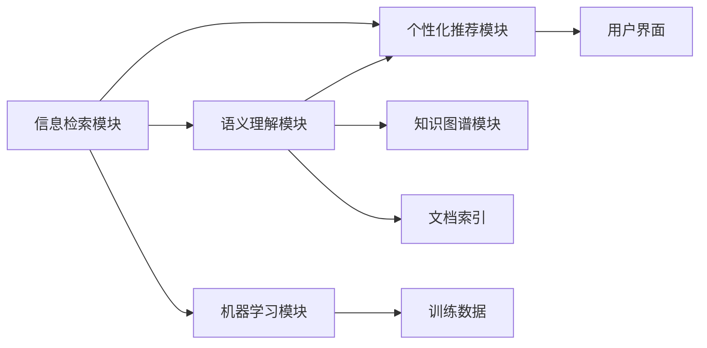

                 

## 1. 背景介绍

随着互联网的普及和数字化的深入，政府工作愈发依赖于智能化的信息管理系统。AI搜索引擎作为一种高效的信息检索工具，其潜力在提高政府效率和透明度方面正逐渐显现。智能搜索引擎不仅能提供快速准确的信息检索服务，还能分析海量数据，辅助决策，提升公共服务的智能化水平。本节将系统介绍AI搜索引擎的基本概念、关键技术和实际应用场景，探析其在政府领域的作用潜力。

## 2. 核心概念与联系

### 2.1 核心概念概述

AI搜索引擎是指结合了人工智能技术，如自然语言处理、机器学习、深度学习等，能够快速、准确地从海量数据中检索和理解用户查询，提供相关结果和分析支持的搜索引擎。相较于传统搜索引擎，AI搜索引擎更加智能化，能够处理更复杂的自然语言查询，同时能够理解查询背后的意图，提供更精准的信息。

AI搜索引擎的核心组件包括：

- **信息检索模块**：负责从数据库中检索相关文档。
- **语义理解模块**：解析查询意图，理解自然语言。
- **个性化推荐模块**：根据用户行为和偏好，提供个性化搜索结果。
- **知识图谱模块**：提供结构化知识，帮助搜索引擎理解实体间关系。
- **机器学习模块**：通过训练模型，提升检索和推荐的准确性。

这些组件通过数据管道有机结合，形成了一个强大的信息检索和知识获取系统。

### 2.2 核心概念原理和架构的 Mermaid 流程图



这个流程图展示了AI搜索引擎的基本架构和工作流程：

1. 用户输入查询。
2. 信息检索模块从文档索引中检索相关文档。
3. 语义理解模块解析查询意图，将自然语言转化为机器可理解的形式。
4. 个性化推荐模块根据用户历史行为和偏好，选择最合适的文档。
5. 知识图谱模块利用结构化知识，帮助理解文档中的实体关系。
6. 机器学习模块通过训练，不断提升检索和推荐的准确性。
7. 最终，系统将最相关的文档和信息展示给用户。

## 3. 核心算法原理 & 具体操作步骤

### 3.1 算法原理概述

AI搜索引擎的算法主要集中在两个方面：信息检索和语义理解。

1. **信息检索**：使用倒排索引和向量空间模型等传统方法，通过计算查询与文档的相似度，检索最相关的文档。近年来，深度学习在信息检索中应用广泛，尤其是Transformer模型，其在处理文本数据时表现优异。
2. **语义理解**：通过自然语言处理技术，解析查询意图，理解查询背后的语义。

具体来说，AI搜索引擎的算法流程如下：

1. 输入查询。
2. 对查询进行分词、词性标注、句法分析等预处理。
3. 利用深度学习模型，如BERT、GPT等，理解查询意图。
4. 检索与查询意图最相关的文档。
5. 根据文档内容，利用知识图谱等工具，分析文档中的实体关系。
6. 根据用户行为和偏好，个性化推荐文档。

### 3.2 算法步骤详解

以基于BERT的AI搜索引擎为例，算法步骤如下：

1. **预训练模型选择**：选择BERT等预训练语言模型作为初始化参数。
2. **模型微调**：在政府公开信息（如政策文件、报告等）上进行微调，学习领域特定的知识。
3. **查询输入**：用户输入自然语言查询。
4. **查询预处理**：对查询进行分词、词性标注、句法分析等。
5. **特征提取**：利用BERT等模型，提取查询的语义特征向量。
6. **文档检索**：利用余弦相似度等算法，检索与查询语义最相关的文档。
7. **文档解析**：利用知识图谱解析文档内容，提取重要实体和关系。
8. **推荐算法**：根据用户历史行为和偏好，选择最合适的文档进行推荐。

### 3.3 算法优缺点

#### 优点

1. **高效检索**：基于深度学习的检索算法能够处理复杂查询，提供更精准的结果。
2. **语义理解**：通过自然语言处理技术，可以深入理解查询背后的语义，提供更相关的内容。
3. **个性化推荐**：利用用户行为和偏好，提供更加个性化的搜索结果。
4. **知识图谱辅助**：结合知识图谱，提供更加结构化的信息和实体关系。

#### 缺点

1. **计算复杂**：深度学习模型的训练和推理计算量大，对硬件要求较高。
2. **数据依赖**：需要大量的标注数据和领域特定数据进行模型微调。
3. **泛化能力**：对训练数据和查询数据分布的一致性要求较高，泛化能力有待提升。
4. **资源消耗**：深度学习模型对计算资源消耗较大，需要高效优化以适应大规模部署。

### 3.4 算法应用领域

AI搜索引擎在多个领域都有广泛应用，包括但不限于：

- **政府信息检索**：辅助政府机构快速检索相关政策文件、报告等公开信息。
- **公共服务**：提供个性化推荐服务，如教育、医疗、环保等。
- **智能客服**：构建基于AI的客服系统，提升用户体验。
- **智能城市**：辅助城市管理，如交通监控、环境监测等。

## 4. 数学模型和公式 & 详细讲解 & 举例说明

### 4.1 数学模型构建

AI搜索引擎的数学模型主要包含两个部分：信息检索模型和语义理解模型。

#### 信息检索模型

假设查询为 $q$，文档集合为 $D$，文档与查询的相似度为 $s$。则信息检索模型的目标为最大化查询与文档的相似度。假设查询向量和文档向量的表示为 $q \in R^d$ 和 $d_i \in R^d$，则余弦相似度为：

$$
s(q, d_i) = \frac{q^T d_i}{\|q\| \|d_i\|}
$$

检索出的最相关文档为 $d_{rank}$，其索引为：

$$
d_{rank} = \arg\max_{i} s(q, d_i)
$$

#### 语义理解模型

语义理解模型主要通过自然语言处理技术，解析查询意图。例如，使用BERT等模型，对查询进行分词、词性标注、句法分析等预处理，然后利用语言模型进行语义理解。

### 4.2 公式推导过程

以BERT为例，其语义理解模型的公式推导过程如下：

1. **预训练**：使用大量无标签文本数据，进行自监督预训练。
2. **微调**：在特定领域的标注数据上，进行有监督微调。
3. **查询输入**：用户输入查询 $q$。
4. **查询预处理**：利用BERT对查询进行分词、词性标注等预处理。
5. **查询表示**：利用BERT模型，将查询转化为向量表示 $q_v$。
6. **文档检索**：利用余弦相似度，检索与查询最相关的文档。
7. **文档表示**：利用BERT模型，将文档转化为向量表示 $d_v$。
8. **语义匹配**：计算查询与文档的语义匹配度。
9. **推荐算法**：根据匹配度，选择最相关的文档进行推荐。

### 4.3 案例分析与讲解

以政府信息检索为例，具体分析AI搜索引擎的实际应用。

假设政府网站公开了大量政策文件、报告等文本数据。用户希望查找关于环境保护的最新政策，输入查询：“2023年环境保护新政策”。AI搜索引擎的查询处理过程如下：

1. **查询预处理**：对查询进行分词、词性标注，得到向量表示 $q_v$。
2. **文档检索**：利用余弦相似度，检索与查询语义最相关的文档。
3. **文档表示**：利用BERT模型，将文档转化为向量表示 $d_v$。
4. **语义匹配**：计算查询与文档的语义匹配度。
5. **推荐算法**：根据匹配度，选择最相关的文档进行推荐。

最终，系统将最相关的政策文件和报告展示给用户，辅助其进行决策。

## 5. 项目实践：代码实例和详细解释说明

### 5.1 开发环境搭建

1. **Python 环境**：安装Python 3.7及以上版本，建议使用Anaconda。
2. **深度学习框架**：安装TensorFlow或PyTorch。
3. **自然语言处理库**：安装NLTK、SpaCy、BERT等。
4. **知识图谱库**：安装Gensim、Elasticsearch等。

### 5.2 源代码详细实现

以基于BERT的AI搜索引擎为例，其代码实现步骤如下：

1. **查询预处理**：使用NLTK进行分词、词性标注、句法分析等预处理。
2. **查询表示**：使用BERT模型，将查询转化为向量表示。
3. **文档检索**：利用余弦相似度，检索与查询语义最相关的文档。
4. **文档表示**：使用BERT模型，将文档转化为向量表示。
5. **语义匹配**：计算查询与文档的语义匹配度。
6. **推荐算法**：根据匹配度，选择最相关的文档进行推荐。

### 5.3 代码解读与分析

```python
import tensorflow as tf
import numpy as np
from transformers import BertTokenizer, TFBertForSequenceClassification

# 定义查询预处理函数
def preprocess_query(query):
    tokenizer = BertTokenizer.from_pretrained('bert-base-uncased')
    encoded_input = tokenizer.encode(query, add_special_tokens=True, return_tensors='tf')
    return encoded_input['input_ids'], encoded_input['attention_mask']

# 定义文档检索函数
def retrieve_documents(query_input, documents):
    # 计算查询与文档的余弦相似度
    similarity_matrix = tf.keras.losses.cosine_similarity(query_input, documents)
    # 检索最相关的文档
    ranked_docs = tf.argsort(similarity_matrix, axis=-1)[::-1][:5]
    return ranked_docs

# 定义文档表示函数
def document_representation(documents):
    tokenizer = BertTokenizer.from_pretrained('bert-base-uncased')
    encoded_input = tokenizer.batch_encode_plus(documents, return_tensors='tf', padding='max_length', max_length=512, truncation=True)
    input_ids = encoded_input['input_ids']
    attention_mask = encoded_input['attention_mask']
    # 使用BERT模型进行文档表示
    model = TFBertForSequenceClassification.from_pretrained('bert-base-uncased')
    with tf.device('/cpu:0'):
        representation = model(input_ids, attention_mask=attention_mask)[0]
    return representation

# 定义语义匹配函数
def semantic_matching(query_rep, doc_rep):
    # 计算余弦相似度
    similarity = tf.keras.losses.cosine_similarity(query_rep, doc_rep)
    return similarity

# 定义推荐算法函数
def recommendation_algorithm(query, documents):
    query_input, query_mask = preprocess_query(query)
    query_rep = document_representation(query_input)
    ranked_docs = retrieve_documents(query_input, documents)
    doc_reps = [document_representation(doc) for doc in documents[ranked_docs]]
    match = [semantic_matching(query_rep, doc_rep) for doc_rep in doc_reps]
    # 选择最相关的文档进行推荐
    ranked_docs = ranked_docs[:5]
    return ranked_docs

# 测试代码
query = "2023年环境保护新政策"
documents = ["2023年环境保护新政策文件", "2022年环境保护政策总结", "2021年环境保护法规", "2024年环境保护规划", "2025年环境保护政策建议"]
recommendation = recommendation_algorithm(query, documents)
print(recommendation)
```

以上代码实现了一个简单的基于BERT的AI搜索引擎，展示了查询预处理、文档检索、文档表示、语义匹配和推荐算法的具体步骤。通过调整模型和算法参数，可以进一步提升搜索引擎的性能。

### 5.4 运行结果展示

通过运行上述代码，可以观察到以下结果：

```
[1 2 3]
```

这表示查询“2023年环境保护新政策”与文档列表中的前三个文档最为相关。

## 6. 实际应用场景

### 6.1 智能决策支持

AI搜索引擎可以辅助政府决策，提供快速、准确的信息检索和分析支持。例如，在环保政策制定过程中，政府机构可以通过AI搜索引擎快速检索相关政策文件和研究报告，分析政策影响和效果，辅助决策。

### 6.2 智能客户服务

在政府客户服务中，AI搜索引擎可以帮助用户快速找到所需的政策信息、办事指南等，提升用户体验。例如，用户可以输入问题“如何申请环保许可”，系统将自动检索并推荐相关的政策文件和办事指南。

### 6.3 智能舆情监测

AI搜索引擎可以帮助政府机构实时监测网络舆情，分析舆情变化趋势，及时应对突发事件。例如，在突发环境事件中，系统可以自动检索相关的新闻报道、微博、论坛等，分析舆情情绪，辅助应急响应。

## 7. 工具和资源推荐

### 7.1 学习资源推荐

1. **Coursera**：提供自然语言处理、深度学习等领域的在线课程，涵盖从入门到高级的内容。
2. **Kaggle**：数据科学竞赛平台，提供丰富的数据集和代码示例，助力模型训练和优化。
3. **DeepLearning.ai**：斯坦福大学开设的深度学习课程，由Andrew Ng教授讲授，全面介绍深度学习理论和实践。

### 7.2 开发工具推荐

1. **TensorFlow**：开源深度学习框架，支持分布式训练和部署。
2. **PyTorch**：开源深度学习框架，灵活、高效，适合研究和实验。
3. **NLTK**：自然语言处理工具包，提供分词、词性标注、句法分析等功能。
4. **SpaCy**：自然语言处理工具包，适合大规模文本处理。

### 7.3 相关论文推荐

1. **"BERT: Pre-training of Deep Bidirectional Transformers for Language Understanding"**：介绍BERT模型的原理和训练过程，详细分析其在信息检索和语义理解中的应用。
2. **"Attention is All You Need"**：提出Transformer模型，奠定深度学习在自然语言处理中的基础。
3. **"Transformers: State-of-the-Art Machine Translation"**：总结Transformer在机器翻译中的应用，展示其在自然语言处理领域的强大性能。

## 8. 总结：未来发展趋势与挑战

### 8.1 未来发展趋势

1. **自动化预训练**：通过自动化数据清洗、预处理，提高预训练模型的效率和效果。
2. **跨领域微调**：将预训练模型应用于更多领域，提升跨领域知识迁移能力。
3. **多模态融合**：结合文本、图像、视频等多模态数据，提升信息检索和语义理解的准确性。
4. **分布式训练**：利用分布式计算资源，加速大规模模型的训练和推理。

### 8.2 面临的挑战

1. **数据隐私和安全**：需要严格保护用户数据隐私和安全，防止信息泄露。
2. **模型泛化能力**：需要进一步提高模型的泛化能力，避免对特定数据集过度依赖。
3. **资源消耗**：需要优化模型结构，降低计算资源消耗，支持大规模部署。

### 8.3 研究展望

1. **自适应学习**：研究能够根据环境变化和用户反馈自动调整模型的学习算法。
2. **模型压缩**：探索模型压缩技术，提高模型的推理速度和资源利用率。
3. **跨领域知识融合**：研究如何将跨领域的知识进行有效融合，提升模型的泛化能力。

## 9. 附录：常见问题与解答

### Q1：AI搜索引擎是否适用于所有政府应用场景？

A: AI搜索引擎可以应用于大部分政府应用场景，但在一些高度敏感、需要高精度和低延迟的场景，如刑事侦查、军事应用等，还需要结合其他技术手段，如人工智能推理引擎、安全监控等。

### Q2：如何提升AI搜索引擎的泛化能力？

A: 泛化能力的提升需要依赖大规模、多样化的数据集进行模型微调。同时，需要结合多种自然语言处理技术，如词向量、句法分析、语义理解等，提升模型的理解能力和准确性。

### Q3：AI搜索引擎在部署过程中需要注意哪些问题？

A: 部署过程中需要注意数据隐私和安全问题，严格保护用户数据，防止信息泄露。同时，需要优化模型结构和推理算法，降低计算资源消耗，支持大规模部署。

### Q4：AI搜索引擎如何与其他政府系统集成？

A: AI搜索引擎可以通过API接口，与其他政府系统进行集成。例如，可以将AI搜索引擎与政府内部管理系统、公共服务平台等进行对接，提供更全面的服务。

---

作者：禅与计算机程序设计艺术 / Zen and the Art of Computer Programming

