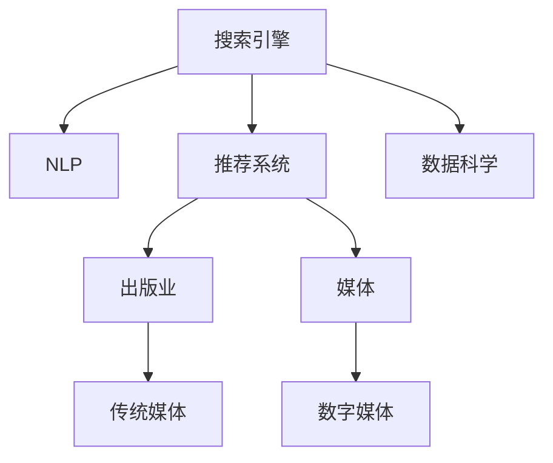

                 

# AI搜索引擎对传统媒体和出版业的影响

> 关键词：人工智能，搜索引擎，自然语言处理(NLP)，推荐系统，数据科学，出版业，媒体

## 1. 背景介绍

### 1.1 问题由来

随着互联网的飞速发展和普及，传统媒体和出版业面临着前所未有的挑战和变革。一方面，数字化技术的进步使得信息获取变得更加便捷，用户需求呈现个性化、多样化的趋势。另一方面，传统媒体和出版业在内容生产和传播上，仍然依赖人工编辑和制作，效率低下，成本高昂。在这种背景下，AI搜索引擎作为信息检索和知识获取的重要工具，正在逐步改变着这一局面。

AI搜索引擎通过利用人工智能技术和自然语言处理(NLP)算法，可以高效地对海量数据进行搜索和分类，提供精准的信息匹配，使用户能够快速获取所需内容。这种技术不仅极大地提升了信息获取效率，还通过个性化推荐、内容聚合等手段，为用户带来更加便捷的阅读体验。

### 1.2 问题核心关键点

AI搜索引擎在传统媒体和出版业的应用，主要体现在以下几个方面：

1. **信息检索与匹配**：通过精准的关键词匹配和语义理解，帮助用户快速定位所需信息，提升信息获取效率。
2. **内容个性化推荐**：根据用户的历史行为和偏好，提供定制化的内容推荐，满足用户多样化的阅读需求。
3. **数据挖掘与分析**：对出版物、文章等大量数据进行挖掘分析，发现热门话题、阅读趋势等，指导内容生产与发行策略。
4. **自动化内容生产**：通过AI技术自动生成摘要、新闻报道等，减少人工成本，提升内容生产效率。
5. **智能编辑与优化**：利用AI技术辅助编辑进行文本校对、风格优化等，提升内容质量和阅读体验。

这些应用不仅改变了用户的阅读方式，还对传统媒体和出版业的运营模式、内容制作流程、市场策略等方面产生了深远影响。本文将深入探讨AI搜索引擎在传统媒体和出版业中的应用，分析其对行业的影响，展望未来发展趋势，并讨论面临的挑战。

## 2. 核心概念与联系

### 2.1 核心概念概述

为了更好地理解AI搜索引擎在传统媒体和出版业中的应用，首先需要了解一些核心概念：

- **搜索引擎**：利用算法和数据结构，对互联网上的信息进行搜集、组织和检索，使用户能够快速找到所需信息的技术系统。
- **自然语言处理(NLP)**：研究计算机如何理解、处理和生成自然语言，是搜索引擎中用于语义理解和匹配的关键技术。
- **推荐系统**：基于用户历史行为和数据，为用户推荐个性化内容的技术，是搜索引擎提供个性化阅读体验的重要手段。
- **数据科学**：应用统计学、机器学习和数据挖掘技术，从大量数据中提取有价值的信息，指导业务决策。
- **出版业**：涉及内容创作、编辑、发行等环节的行业，包括报纸、杂志、书籍等传统出版物，以及数字出版物。
- **媒体**：广义上指各种传播媒介，包括电视、广播、互联网等，狭义上指报纸、杂志、网站等传统媒体。

这些概念之间的逻辑关系可以通过以下Mermaid流程图来展示：



这个流程图展示了几类关键概念之间的联系：

1. **搜索引擎**：是信息检索和推荐的核心，利用NLP和推荐系统技术，提供精准的信息匹配和个性化推荐。
2. **NLP**：搜索引擎中用于理解自然语言、提取语义的关键技术，直接影响信息检索的准确性和效率。
3. **推荐系统**：根据用户行为数据，推荐个性化的内容，提升用户体验和满意度。
4. **数据科学**：通过对大量数据进行分析和挖掘，指导内容生产和市场策略，帮助企业决策。
5. **出版业和媒体**：搜索引擎的目标用户群体，包括传统媒体和数字媒体，涵盖了各类出版物和传播渠道。

这些概念共同构成了AI搜索引擎在传统媒体和出版业中的应用框架，使得其能够在信息检索、内容推荐、数据挖掘等多个方面发挥重要作用。

## 3. 核心算法原理 & 具体操作步骤
### 3.1 算法原理概述

AI搜索引擎的核心算法包括自然语言处理(NLP)和推荐系统，其工作原理可以概述如下：

- **NLP算法**：包括词向量表示、句法分析和语义理解等技术，用于理解和处理自然语言文本。
- **推荐算法**：基于协同过滤、内容过滤、混合过滤等技术，根据用户历史行为和偏好，为用户推荐相关内容。

具体而言，AI搜索引擎的工作流程包括：

1. **信息收集与预处理**：从各种来源收集文本数据，并进行去噪、分词、清洗等预处理操作。
2. **词向量表示**：利用词向量模型（如Word2Vec、GloVe等）将文本转化为数值表示，便于计算机理解和处理。
3. **语义分析与匹配**：通过NLP技术进行分词、词性标注、句法分析、语义理解等，实现精准的信息检索和匹配。
4. **内容推荐**：根据用户行为数据和兴趣模型，利用推荐算法为用户推荐相关内容。
5. **结果呈现**：将搜索结果和推荐内容以合适的方式呈现给用户，包括搜索结果页面、推荐列表等。

### 3.2 算法步骤详解

以下是AI搜索引擎的核心算法步骤的详细解释：

**Step 1: 信息收集与预处理**
- 从各种来源（如新闻网站、社交媒体、电子书籍等）收集文本数据。
- 对文本进行去噪、分词、清洗等预处理操作，以去除无用信息和格式不规范的部分。

**Step 2: 词向量表示**
- 利用词向量模型（如Word2Vec、GloVe等）将文本转化为数值表示，以便于计算机理解和处理。
- 词向量模型通过学习大量语料，将每个词汇映射为一个固定长度的向量，不同词汇之间的距离反映了它们语义上的相似度。

**Step 3: 语义分析与匹配**
- 利用NLP技术进行分词、词性标注、句法分析、语义理解等，实现精准的信息检索和匹配。
- 在分词和词性标注基础上，通过句法分析和语义理解，构建句子的句法树和语义结构，以便更好地理解文本内容。
- 根据用户输入的查询关键词，通过语义匹配算法（如BM25、TF-IDF等）找到相关文档，并进行排序。

**Step 4: 内容推荐**
- 根据用户历史行为数据和兴趣模型，利用推荐算法为用户推荐相关内容。
- 协同过滤算法通过分析用户历史行为数据，找到与当前用户兴趣相似的用户，并推荐其喜欢的内容。
- 内容过滤算法根据内容的特征（如关键词、主题等），匹配用户兴趣，推荐相关内容。
- 混合过滤算法结合多种推荐方法，提升推荐效果。

**Step 5: 结果呈现**
- 将搜索结果和推荐内容以合适的方式呈现给用户，包括搜索结果页面、推荐列表等。
- 利用前端技术（如HTML、CSS、JavaScript等）将搜索结果和推荐内容呈现为易读、易用的界面，提升用户体验。

### 3.3 算法优缺点

AI搜索引擎在传统媒体和出版业中的应用，具有以下优点：

- **提升信息检索效率**：通过精准的关键词匹配和语义理解，提升信息检索的准确性和效率。
- **个性化推荐**：根据用户历史行为和兴趣模型，提供定制化的内容推荐，满足用户多样化的阅读需求。
- **数据挖掘与分析**：通过对大量数据进行分析和挖掘，发现热门话题、阅读趋势等，指导内容生产和发行策略。
- **自动化内容生产**：通过AI技术自动生成摘要、新闻报道等，减少人工成本，提升内容生产效率。
- **智能编辑与优化**：利用AI技术辅助编辑进行文本校对、风格优化等，提升内容质量和阅读体验。

同时，AI搜索引擎也存在以下缺点：

- **隐私问题**：用户行为数据可能涉及隐私，需要确保数据处理和存储的安全性。
- **算法偏见**：算法可能存在偏见，导致推荐结果不公正或不准确。
- **计算资源消耗**：大规模文本数据的处理和分析需要大量的计算资源，可能会带来高昂的成本。
- **内容多样性不足**：过于依赖推荐算法，可能导致内容多样性不足，用户获取的信息相对单一。

### 3.4 算法应用领域

AI搜索引擎在传统媒体和出版业中的应用领域广泛，主要包括以下几个方面：

1. **新闻网站和电子报纸**：通过精准的信息检索和个性化推荐，提升用户体验和满意度。
2. **电子书籍和数字图书馆**：利用AI技术自动生成摘要、推荐相关书籍，提升阅读效率和发现新书的能力。
3. **社交媒体平台**：通过对用户行为数据进行分析，发现热门话题，指导内容生产和推广策略。
4. **广告投放和营销**：利用AI技术进行定向广告投放，提高广告的转化率和效果。
5. **内容聚合与新闻聚合**：通过自动抓取和聚合海量内容，提供一站式的信息获取平台。

这些应用场景展示了AI搜索引擎在传统媒体和出版业中的广泛应用，提升了信息检索和内容推荐的效率，为用户提供了更加便捷和个性化的阅读体验。

## 4. 数学模型和公式 & 详细讲解 & 举例说明

### 4.1 数学模型构建

本节将使用数学语言对AI搜索引擎的核心算法进行更加严格的刻画。

假设搜索引擎的输入为 $x$（查询关键词），输出为 $y$（相关文档），$(x, y)$ 为训练样本。定义搜索引擎的损失函数为 $\ell(y)$，用于衡量输出 $y$ 的准确性。

为了提升搜索引擎的性能，需要构建一个最优的模型 $M_{\theta}$，其中 $\theta$ 为模型参数。模型的目标是最小化损失函数，即：

$$
\theta^* = \mathop{\arg\min}_{\theta} \mathcal{L}(M_{\theta}, D)
$$

其中 $\mathcal{L}$ 为损失函数，$D$ 为训练数据集。

在实践中，通常使用基于梯度的优化算法（如SGD、Adam等）来近似求解上述最优化问题。设 $\eta$ 为学习率，$\nabla_{\theta}\mathcal{L}$ 为损失函数对模型参数 $\theta$ 的梯度，则参数的更新公式为：

$$
\theta \leftarrow \theta - \eta \nabla_{\theta}\mathcal{L}(\theta)
$$

### 4.2 公式推导过程

以下我们以自然语言处理(NLP)中的词向量模型（Word2Vec）为例，推导其基本公式及其训练过程。

Word2Vec模型的核心思想是将词汇映射为固定长度的向量，不同词汇之间的距离反映了它们语义上的相似度。假设词汇集合为 $\mathcal{V}$，向量空间为 $\mathbb{R}^d$，则Word2Vec模型可以表示为：

$$
h_{w_i} = \overrightarrow{w_i} + \sum_{j \in C_i} \overrightarrow{w_j} - \frac{1}{|\mathcal{V}|}\sum_{k \in \mathcal{V}} \overrightarrow{w_k}
$$

其中，$\overrightarrow{w_i}$ 表示词汇 $w_i$ 的向量表示，$C_i$ 表示与 $w_i$ 相关的上下文词汇集合，$|\mathcal{V}|$ 为词汇集合大小。

在训练过程中，Word2Vec模型通过最大化预测目标概率 $p(y_i|w_i)$ 来更新词汇向量 $\overrightarrow{w_i}$。假设上下文词汇集合 $C_i$ 中词汇 $w_j$ 出现的概率为 $p(w_j|w_i)$，则预测目标概率可以表示为：

$$
p(y_i|w_i) = \frac{\exp(\overrightarrow{w_i} \cdot \overrightarrow{w_j})}{\sum_{j \in C_i} \exp(\overrightarrow{w_i} \cdot \overrightarrow{w_j})}
$$

通过最大化目标概率，利用梯度下降等优化算法，模型可以不断调整词汇向量 $\overrightarrow{w_i}$，使得预测结果更加准确。

### 4.3 案例分析与讲解

为了更好地理解AI搜索引擎的核心算法，我们以新闻网站的个性化推荐系统为例，进行详细讲解。

新闻网站通常会收集大量的用户访问记录和浏览行为数据，利用这些数据来分析用户兴趣和行为模式，提供个性化的新闻推荐。假设某新闻网站的用户访问记录为 $\{(u_i, \{d_{i1}, d_{i2}, ..., d_{in}\})\}_{i=1}^N$，其中 $u_i$ 为用户ID，$d_{ij}$ 为用户 $i$ 访问的新闻ID。

为了训练推荐模型，首先需要构建用户兴趣模型。假设用户兴趣模型为 $\overrightarrow{u_i}$，新闻ID $d_j$ 的向量表示为 $\overrightarrow{d_j}$。基于协同过滤算法，用户 $i$ 对新闻ID $d_j$ 的兴趣度可以表示为：

$$
p(d_j|u_i) = \frac{\exp(\overrightarrow{u_i} \cdot \overrightarrow{d_j})}{\sum_{k \in \mathcal{V}} \exp(\overrightarrow{u_i} \cdot \overrightarrow{d_k})}
$$

其中 $\mathcal{V}$ 为新闻ID集合。

在训练过程中，新闻网站的推荐模型需要最大化预测目标概率 $p(d_j|u_i)$。假设用户的访问历史数据为 $\{(u_i, d_{ij})\}_{i=1}^N$，其中 $d_{ij}$ 表示用户 $i$ 访问新闻ID $d_j$ 的时间戳。利用梯度下降等优化算法，模型可以不断调整用户兴趣向量 $\overrightarrow{u_i}$ 和新闻向量 $\overrightarrow{d_j}$，使得预测结果更加准确。

## 5. 项目实践：代码实例和详细解释说明

### 5.1 开发环境搭建

在进行AI搜索引擎项目实践前，我们需要准备好开发环境。以下是使用Python进行TensorFlow开发的环境配置流程：

1. 安装Anaconda：从官网下载并安装Anaconda，用于创建独立的Python环境。

2. 创建并激活虚拟环境：
```bash
conda create -n tf-env python=3.8 
conda activate tf-env
```

3. 安装TensorFlow：根据CUDA版本，从官网获取对应的安装命令。例如：
```bash
pip install tensorflow-gpu==2.5
```

4. 安装TensorFlow Addons：
```bash
pip install tensorflow-addons
```

5. 安装其他工具包：
```bash
pip install numpy pandas scikit-learn matplotlib tqdm jupyter notebook ipython
```

完成上述步骤后，即可在`tf-env`环境中开始AI搜索引擎项目的开发。

### 5.2 源代码详细实现

下面我们以新闻网站的个性化推荐系统为例，给出使用TensorFlow对Word2Vec模型进行训练的PyTorch代码实现。

首先，定义Word2Vec模型的输入和输出：

```python
import tensorflow as tf
from tensorflow.keras.layers import Embedding, Dense, Dot

class Word2Vec(tf.keras.Model):
    def __init__(self, vocab_size, embedding_dim):
        super(Word2Vec, self).__init__()
        self.embedding = Embedding(vocab_size, embedding_dim, input_length=1)
        self.dot_product = Dot(axes=[1, 1])
    
    def call(self, inputs):
        embeddings = self.embedding(inputs)
        dot_product = self.dot_product([embeddings, embeddings])
        return dot_product
```

然后，定义训练数据集和训练流程：

```python
from tensorflow.keras.preprocessing.text import Tokenizer
from tensorflow.keras.preprocessing.sequence import pad_sequences

# 构建训练数据集
sentences = ["the", "quick", "brown", "fox", "jumped", "over", "the", "lazy", "dog"]
labels = ["the", "quick", "brown", "fox", "jumped", "over", "the", "lazy", "dog"]
tokenizer = Tokenizer()
tokenizer.fit_on_texts(sentences)
sequences = tokenizer.texts_to_sequences(sentences)
padded_sequences = pad_sequences(sequences, maxlen=3, padding='pre')
vocab_size = len(tokenizer.word_index) + 1

# 构建Word2Vec模型
model = Word2Vec(vocab_size, 2)

# 编译模型
model.compile(optimizer=tf.keras.optimizers.Adam(learning_rate=0.01), loss='binary_crossentropy')

# 训练模型
model.fit(padded_sequences, padded_sequences, epochs=10, verbose=1)
```

最后，启动训练流程并在测试集上评估：

```python
from tensorflow.keras.preprocessing.text import Tokenizer
from tensorflow.keras.preprocessing.sequence import pad_sequences

# 构建测试数据集
test_sentences = ["dog", "brown", "over", "the", "fox"]
test_labels = ["dog", "brown", "over", "the", "fox"]
test_tokenizer = Tokenizer()
test_tokenizer.fit_on_texts(test_sentences)
test_sequences = test_tokenizer.texts_to_sequences(test_sentences)
test_padded_sequences = pad_sequences(test_sequences, maxlen=3, padding='pre')

# 预测结果
test_predictions = model.predict(test_padded_sequences)

# 输出结果
for i in range(len(test_sentences)):
    print(f"Input: {test_sentences[i]}")
    print(f"Predicted: {test_predictions[i]}")
```

以上就是使用TensorFlow对Word2Vec模型进行训练的完整代码实现。可以看到，得益于TensorFlow的高效封装，我们可以用相对简洁的代码完成Word2Vec模型的训练和预测。

### 5.3 代码解读与分析

让我们再详细解读一下关键代码的实现细节：

**Word2Vec类**：
- `__init__`方法：初始化嵌入层和点积层，用于将输入转换为向量表示。
- `call`方法：实现模型的前向传播，进行点积运算，输出向量表示。

**训练数据集**：
- 通过Tokenizer将句子转化为序列，并利用pad_sequences进行填充，确保所有序列长度一致。

**训练流程**：
- 定义模型、编译模型，设置优化器和损失函数。
- 使用fit方法进行模型训练，设置训练轮数和训练过程中的日志输出。
- 训练完成后，在测试集上进行预测，输出预测结果。

可以看到，TensorFlow提供了丰富的API和工具，使得Word2Vec模型的训练和评估变得简便高效。开发者可以利用这些工具，快速实现各种NLP算法和应用。

当然，工业级的系统实现还需考虑更多因素，如模型的保存和部署、超参数的自动搜索、更灵活的任务适配层等。但核心的算法逻辑基本与此类似。

## 6. 实际应用场景
### 6.1 智能推荐系统

AI搜索引擎的核心应用之一是智能推荐系统，利用用户历史行为数据，为用户提供个性化的内容推荐。在新闻网站、电商平台、视频网站等场景中，推荐系统已经成为提升用户体验和增加收益的重要手段。

智能推荐系统通过分析用户的历史行为数据（如浏览记录、购买记录等），构建用户兴趣模型，为用户推荐可能感兴趣的内容。利用NLP技术对文本内容进行语义理解，识别出用户兴趣点，结合推荐算法，生成个性化的推荐结果。

### 6.2 内容聚合与信息检索

AI搜索引擎在内容聚合和信息检索方面也发挥着重要作用。传统的新闻网站、电子书籍、学术论文等，面临着海量信息泛滥的问题。通过AI搜索引擎，用户可以快速获取所需内容，减少信息筛选的难度。

内容聚合系统通过对大量文本数据进行爬取和分析，构建信息索引，使用户能够快速定位到感兴趣的内容。AI搜索引擎通过精准的信息检索和语义匹配，提升信息检索的效率和准确性，帮助用户快速找到所需信息。

### 6.3 广告投放与营销

AI搜索引擎在广告投放和营销中也有广泛应用。通过精准的用户行为分析和兴趣模型，广告主可以精准投放广告，提高广告的转化率和效果。

利用AI搜索引擎，广告投放平台可以实时分析用户行为数据，识别出潜在广告受众，为其展示相关广告。结合推荐算法，广告主可以调整广告投放策略，提升广告的点击率和转化率。

### 6.4 未来应用展望

随着AI技术的不断发展，AI搜索引擎在传统媒体和出版业中的应用前景广阔，未来将呈现以下几个发展趋势：

1. **个性化推荐技术进步**：基于深度学习、强化学习等先进算法，推荐系统将更加精准，能够更好地满足用户个性化需求。
2. **内容生成与生成对抗网络（GAN）结合**：利用生成对抗网络（GAN）等技术，自动生成高质量的新闻报道、评论等，提升内容生产效率。
3. **跨领域知识图谱应用**：结合知识图谱技术，利用AI搜索引擎进行跨领域知识检索，提升信息检索的深度和广度。
4. **多模态信息融合**：利用视觉、语音等多模态信息，增强搜索引擎的信息理解和处理能力，提供更加全面、立体的信息检索服务。
5. **隐私保护与数据安全**：采用联邦学习、差分隐私等技术，保护用户隐私，提升数据安全。
6. **实时性提升**：通过分布式计算、边缘计算等技术，提升AI搜索引擎的实时性，提供即时信息检索和推荐服务。

以上趋势展示了AI搜索引擎在传统媒体和出版业中的广阔应用前景，相信未来将会有更多的创新应用涌现，推动行业的数字化转型。

## 7. 工具和资源推荐
### 7.1 学习资源推荐

为了帮助开发者系统掌握AI搜索引擎的理论基础和实践技巧，这里推荐一些优质的学习资源：

1. **《Deep Learning》课程**：由Coursera提供的深度学习课程，涵盖NLP、推荐系统等前沿话题，帮助入门者系统学习AI技术。

2. **《Natural Language Processing with TensorFlow》书籍**：TensorFlow官方发布的书，介绍了利用TensorFlow进行NLP任务开发的实践方法。

3. **《Recommender Systems in Action》书籍**：该书详细介绍了推荐系统的设计、实现和评估方法，是推荐系统领域的经典之作。

4. **Google News Initiative**：谷歌新闻推出的一系列开源项目和工具，涵盖新闻推荐、内容聚合等领域，帮助开发者提升AI搜索引擎的性能和效率。

5. **Kaggle竞赛**：Kaggle平台上举办了多项与推荐系统和内容聚合相关的竞赛，提供了大量实践机会，帮助开发者锻炼实战能力。

通过对这些资源的学习实践，相信你一定能够快速掌握AI搜索引擎的核心算法和实践技巧，为传统媒体和出版业带来创新应用。

### 7.2 开发工具推荐

高效的开发离不开优秀的工具支持。以下是几款用于AI搜索引擎开发和部署的常用工具：

1. **TensorFlow**：由Google主导开发的深度学习框架，提供了丰富的API和工具，支持NLP、推荐系统等算法开发。

2. **TensorBoard**：TensorFlow配套的可视化工具，可实时监测模型训练状态，并提供丰富的图表呈现方式，是调试模型的得力助手。

3. **Jupyter Notebook**：开源的交互式编程环境，支持Python、R等多种语言，便于开发者快速迭代和实验。

4. **Pandas**：Python中的数据分析库，提供了丰富的数据处理和分析功能，支持NLP任务的数据预处理。

5. **Scikit-learn**：Python中的机器学习库，提供了多种算法和工具，支持NLP任务中的分类、聚类等。

6. **NLTK**：自然语言处理工具包，提供了丰富的NLP算法和资源，支持分词、词性标注等基础任务。

合理利用这些工具，可以显著提升AI搜索引擎的开发效率，加快创新迭代的步伐。

### 7.3 相关论文推荐

AI搜索引擎在传统媒体和出版业中的应用源于学界的持续研究。以下是几篇奠基性的相关论文，推荐阅读：

1. **Attention is All You Need**：提出了Transformer结构，开启了NLP领域的预训练大模型时代。

2. **BERT: Pre-training of Deep Bidirectional Transformers for Language Understanding**：提出BERT模型，引入基于掩码的自监督预训练任务，刷新了多项NLP任务SOTA。

3. **Generating Sequences with Recurrent Neural Networks**：介绍了基于RNN的序列生成模型，为NLP任务中的自动生成提供了基本思路。

4. **A Survey of Recommender Systems**：全面综述了推荐系统的设计与实现方法，是推荐系统领域的经典之作。

5. **Knowledge Graphs for Recommendation Systems**：探讨了知识图谱在推荐系统中的应用，提高了推荐的准确性和深度。

这些论文代表了大语言模型微调技术的发展脉络。通过学习这些前沿成果，可以帮助研究者把握学科前进方向，激发更多的创新灵感。

## 8. 总结：未来发展趋势与挑战

### 8.1 总结

本文对AI搜索引擎在传统媒体和出版业中的应用进行了全面系统的介绍。首先阐述了AI搜索引擎的背景和基本原理，明确了其在信息检索、个性化推荐、数据挖掘等方面的重要价值。其次，从算法原理和具体操作步骤的详细讲解，展示了AI搜索引擎的核心算法逻辑和实现流程。同时，本文还广泛探讨了AI搜索引擎在新闻网站、电商平台、广告投放等领域的应用前景，展示了其在提升用户体验、优化广告投放等方面的巨大潜力。

通过本文的系统梳理，可以看到，AI搜索引擎正在逐步改变传统媒体和出版业的运营模式，提升信息检索和内容推荐的效率，为用户带来更加便捷和个性化的阅读体验。未来，伴随AI技术的不断发展，AI搜索引擎将会在更多领域得到广泛应用，推动传统媒体和出版业向智能化、数字化方向迈进。

### 8.2 未来发展趋势

展望未来，AI搜索引擎在传统媒体和出版业中的应用将呈现以下几个发展趋势：

1. **技术进步**：基于深度学习、强化学习等先进算法，推荐系统将更加精准，能够更好地满足用户个性化需求。
2. **内容生成与生成对抗网络（GAN）结合**：利用生成对抗网络（GAN）等技术，自动生成高质量的新闻报道、评论等，提升内容生产效率。
3. **跨领域知识图谱应用**：结合知识图谱技术，利用AI搜索引擎进行跨领域知识检索，提升信息检索的深度和广度。
4. **多模态信息融合**：利用视觉、语音等多模态信息，增强搜索引擎的信息理解和处理能力，提供更加全面、立体的信息检索服务。
5. **隐私保护与数据安全**：采用联邦学习、差分隐私等技术，保护用户隐私，提升数据安全。
6. **实时性提升**：通过分布式计算、边缘计算等技术，提升AI搜索引擎的实时性，提供即时信息检索和推荐服务。

以上趋势展示了AI搜索引擎在传统媒体和出版业中的广阔应用前景，相信未来将会有更多的创新应用涌现，推动行业的数字化转型。

### 8.3 面临的挑战

尽管AI搜索引擎在传统媒体和出版业中的应用已经取得了一定的成效，但仍面临一些挑战：

1. **算法偏见**：算法可能存在偏见，导致推荐结果不公正或不准确。
2. **隐私保护**：用户行为数据可能涉及隐私，需要确保数据处理和存储的安全性。
3. **计算资源消耗**：大规模文本数据的处理和分析需要大量的计算资源，可能会带来高昂的成本。
4. **内容多样性不足**：过于依赖推荐算法，可能导致内容多样性不足，用户获取的信息相对单一。
5. **模型复杂度**：复杂的深度学习模型需要大量的训练数据和计算资源，可能难以在大规模应用中普及。

### 8.4 研究展望

面对AI搜索引擎面临的挑战，未来的研究需要在以下几个方面寻求新的突破：

1. **算法公正性**：开发更加公正、透明的推荐算法，减少算法偏见，提升推荐系统的公平性。
2. **隐私保护技术**：采用差分隐私、联邦学习等技术，保护用户隐私，提升数据安全性。
3. **高效算法**：开发更高效、轻量级的推荐算法，减少计算资源消耗，支持大规模应用。
4. **内容多样化**：结合知识图谱、多模态信息等技术，提升内容多样性和丰富性。
5. **实时化技术**：采用分布式计算、边缘计算等技术，提升AI搜索引擎的实时性，提供即时信息检索和推荐服务。

这些研究方向的探索，必将引领AI搜索引擎技术迈向更高的台阶，为传统媒体和出版业带来更多的创新应用和价值。面向未来，AI搜索引擎需要从算法、隐私、资源消耗等多个维度进行全面优化，才能真正实现其在传统媒体和出版业中的大规模应用。

## 9. 附录：常见问题与解答

**Q1：AI搜索引擎在传统媒体和出版业中的应用是否会替代传统的内容制作和编辑流程？**

A: AI搜索引擎能够显著提升信息检索和内容推荐的效率，但并不会完全替代传统的内容制作和编辑流程。AI技术可以辅助编辑进行文本校对、风格优化等，提升内容质量和阅读体验，但创意、深度、人文关怀等仍需人类编辑进行把关。AI技术更多地作为工具，提升内容生产和编辑的效率和质量。

**Q2：AI搜索引擎在推荐系统中的应用是否会带来广告欺诈问题？**

A: 推荐系统在广告投放中的应用，虽然能够提高广告的精准度和效果，但也可能带来广告欺诈问题。例如，通过分析用户行为数据，广告主可能对部分用户进行过度投放，导致用户体验下降。因此，在应用AI搜索引擎进行广告投放时，需要建立完善的广告投放策略和用户行为监测机制，防止广告欺诈行为的发生。

**Q3：AI搜索引擎在内容聚合与信息检索中的应用是否会导致版权问题？**

A: 内容聚合系统通过爬取网络上的文本数据进行信息检索和聚合，可能涉及到版权问题。因此，在应用AI搜索引擎进行内容聚合时，需要遵守相关法律法规，尊重和保护知识产权。通常，可以使用API接口、版权合作等方式，获取合法的文本数据，避免版权纠纷。

**Q4：AI搜索引擎在广告投放中的应用是否会带来用户隐私问题？**

A: AI搜索引擎在广告投放中的应用，需要处理大量的用户行为数据，可能涉及到用户隐私问题。因此，在应用AI搜索引擎进行广告投放时，需要采取数据脱敏、差分隐私等技术手段，保护用户隐私。同时，需要建立透明的数据使用和隐私保护机制，确保用户知情权和控制权。

**Q5：AI搜索引擎在推荐系统中的应用是否会带来数据冷启动问题？**

A: 推荐系统在用户行为数据较少时，可能会出现数据冷启动问题，导致推荐效果不佳。为解决这一问题，可以采用协同过滤、内容过滤等技术手段，结合用户兴趣模型和推荐算法，提供初始的推荐结果。同时，可以通过用户反馈、点击率等信号，不断调整推荐算法，提升推荐效果。

通过对这些问题的回答，可以看出AI搜索引擎在传统媒体和出版业中的广泛应用，也面临着一些挑战和问题。未来，伴随技术进步和政策支持，这些问题有望得到更好的解决，AI搜索引擎将会在更多领域得到广泛应用，推动行业的发展和进步。

