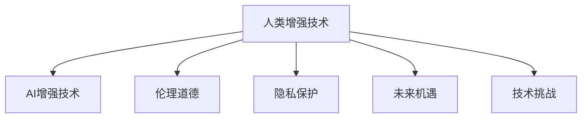

                 

# AI时代的人类增强：道德考虑与身体增强的未来发展机遇挑战分析

> 关键词：AI增强, 人类增强, 生物技术, 道德伦理, 隐私保护, 未来机遇, 技术挑战

## 1. 背景介绍

### 1.1 问题由来
随着人工智能技术的飞速发展，越来越多的AI应用开始渗透到我们生活的各个领域，极大地提升了个体的生产力和生活质量。例如，智能语音助手如Siri、Google Assistant等，能够帮助用户快速获取信息、设置提醒、控制设备；智能推荐系统如Netflix、Amazon等，能够根据用户的历史行为和偏好推荐个性化内容；智能机器人如扫地机器人、自动驾驶汽车等，能够自动化地完成复杂劳动。

然而，这些AI技术在提升人们生活质量的同时，也引发了一系列伦理道德和隐私保护问题。例如，智能推荐系统可能会过度推荐不良内容，导致青少年沉迷于网络；智能监控系统可能会侵犯个人隐私，影响用户的正常生活；自动化劳动可能会替代大量人类工作，加剧社会不平等。

这些问题引发了人们对于AI技术的深度反思。如何构建负责任的AI系统，如何在提升生活质量的同时保护个人隐私和伦理道德，成为了当下急需解决的重要课题。本文聚焦于人类增强技术，特别是身体增强技术，探讨其在AI时代的发展机遇与面临的挑战，并从伦理道德角度对人类增强技术提出几点思考。

### 1.2 问题核心关键点
人类增强技术的核心在于通过生物技术手段提升人类的身体能力，包括但不限于视觉、听觉、触觉、运动、记忆等方面。当前，身体增强技术已经在某些领域取得了显著进展，如视力和听力的辅助设备、外骨骼机器人、脑机接口等。然而，这些技术在带来便利的同时，也引发了一系列伦理道德和隐私保护问题。

未来，随着AI技术的进一步发展，人类增强技术也将获得更多应用场景。例如，AI可以用于脑机接口的实时训练和优化，提升其对人类脑电信号的识别精度；AI可以用于个性化医疗方案的制定，根据患者的基因信息和疾病历史提供量身定制的增强方案；AI可以用于外骨骼机器人的智能控制，提升其作业效率和适应性。

### 1.3 问题研究意义
研究人类增强技术在AI时代的发展机遇与挑战，对于探索未来社会的可持续发展路径，保护人类福祉，具有重要意义：

1. **提升生活质量**：通过增强技术提升人类身体能力，可以帮助残疾人更好地融入社会，改善其生活质量。
2. **促进经济发展**：自动化和智能化水平的提升，将创造更多就业机会，促进经济发展。
3. **应对老龄化社会**：通过增强技术提升老年人健康水平和生活质量，缓解老龄化社会的压力。
4. **伦理道德引导**：在发展技术的同时，更需要思考其伦理道德问题，避免技术滥用和伦理危机。

## 2. 核心概念与联系

### 2.1 核心概念概述

为了更好地理解人类增强技术及其在AI时代的发展，本文将介绍几个密切相关的核心概念：

- **人类增强技术**：通过生物技术手段提升人类身体能力的科学和技术，包括基因工程、生物信息学、神经科学、机器人学等。
- **AI增强技术**：通过AI技术提升人类身体能力的科学和技术，包括智能康复、智能辅助、智能控制等。
- **伦理道德**：关于人类行为和决策的道德准则和规范，涉及隐私保护、知情同意、公平正义等。
- **隐私保护**：保护个人数据和信息不被未授权访问、使用和泄露，涉及数据加密、匿名化、访问控制等技术手段。
- **未来机遇**：技术发展带来的新应用场景和新商业机会，涉及市场潜力、用户需求、技术趋势等。
- **技术挑战**：技术实现过程中面临的技术难题和瓶颈，涉及设备成本、安全可靠性、用户体验等。

这些核心概念之间的逻辑关系可以通过以下Mermaid流程图来展示：



这个流程图展示了几大核心概念之间的关系：

1. 人类增强技术与AI增强技术相互支撑，共同提升人类身体能力。
2. 人类增强技术的发展需要考虑伦理道德问题，避免技术滥用和伦理危机。
3. 隐私保护是增强技术应用的重要保障，确保用户信息安全。
4. 未来机遇与技术挑战相辅相成，推动技术不断突破与完善。

## 3. 核心算法原理 & 具体操作步骤
### 3.1 算法原理概述

人类增强技术涉及多种生物技术手段和AI技术手段，其核心算法原理可以归结为以下几个方面：

- **基因工程**：通过修改人类基因，提升身体能力。基因编辑技术如CRISPR-Cas9已经展示了其潜力，可以在精度和效率上进一步提升。
- **神经科学**：通过研究人类神经系统的结构和功能，开发出神经刺激和神经调控技术，改善神经系统的损伤和疾病。
- **机器人学**：通过设计和制造机器人，扩展人类的身体能力，包括外骨骼机器人、智能假肢等。
- **脑机接口(BMI)**：通过获取和处理人类脑电信号，实现脑与机器的直接交互，提升信息传递和处理效率。

### 3.2 算法步骤详解

人类增强技术的实现流程大致可以分为以下几个步骤：

**Step 1: 需求分析**
- 确定需要增强的身体能力和应用场景，如视力、听力、运动、记忆等。
- 分析用户的健康状况、生活习惯、心理需求等，制定个性化的增强方案。

**Step 2: 技术选择**
- 选择合适的技术手段，如基因工程、神经科学、机器人学、脑机接口等。
- 确定技术实现的可行性、安全性和有效性。

**Step 3: 实验设计**
- 设计实验方案，包括实验对象、实验环境、实验指标等。
- 使用临床试验、动物实验等方式验证技术的可行性和安全性。

**Step 4: 数据收集与分析**
- 收集实验数据，包括生理数据、行为数据、脑电信号等。
- 使用数据分析技术，如机器学习、深度学习等，优化技术方案。

**Step 5: 临床试验**
- 在有限的临床环境下，对技术进行验证和优化。
- 根据临床试验结果，进一步调整技术方案。

**Step 6: 大规模应用**
- 将技术应用到实际场景中，如医疗、康复、教育等。
- 持续收集反馈，不断优化技术方案。

### 3.3 算法优缺点

人类增强技术在提升人类身体能力方面具有以下优点：

- **提升生活质量**：通过增强技术，可以帮助残疾人更好地融入社会，提升其生活质量。
- **促进经济发展**：增强技术的商业应用将带来新的市场机会和经济增长。
- **应对老龄化社会**：通过增强技术提升老年人健康水平和生活质量，缓解老龄化社会的压力。

然而，该技术也存在一些缺点：

- **技术风险**：基因编辑、神经调控等技术尚未完全成熟，存在安全风险。
- **伦理道德问题**：技术的应用可能引发伦理道德争议，如基因编辑的伦理争议、脑机接口的隐私问题等。
- **社会不平等**：技术应用可能加剧社会不平等，如高昂的技术成本导致技术普及率低下。
- **技术滥用**：技术可能被滥用，如非法的基因编辑、不道德的神经调控等。

### 3.4 算法应用领域

人类增强技术已经在多个领域获得了应用，包括医疗、康复、运动、教育等。以下是几个典型应用场景：

- **医疗康复**：通过基因编辑和神经调控技术，帮助患者恢复视力、听力、运动功能等。
- **运动训练**：通过外骨骼机器人、智能假肢等技术，提升运动员的训练效率和比赛表现。
- **教育辅助**：通过智能教育设备和脑机接口，提升学生的学习能力和教育质量。
- **娱乐体验**：通过虚拟现实和增强现实技术，提供沉浸式的娱乐体验。
- **人类增强材料**：通过生物材料和智能材料，增强人类身体的耐久性和灵活性。

## 4. 数学模型和公式 & 详细讲解 & 举例说明（备注：数学公式请使用latex格式，latex嵌入文中独立段落使用 $$，段落内使用 $)
### 4.1 数学模型构建

为更好地理解人类增强技术的数学原理，本文将从生物技术和AI技术的角度分别介绍其数学模型构建。

**基因工程**：
- **DNA序列设计**：假设有n个基因位点需要编辑，每个位点的基因序列用0和1表示，则有$2^n$种可能的基因序列。
- **基因编辑精度**：假设有m个基因位点被成功编辑，则成功编辑的比例为$m/n$。

**神经科学**：
- **神经刺激模型**：假设神经系统的激活强度为x，神经刺激电流为y，则有函数关系$f(y)=g(x)$。
- **神经调控模型**：假设神经系统的激活强度为x，调控信号为z，则有函数关系$h(x)=j(z)$。

**机器人学**：
- **运动控制模型**：假设机器人的关节位置为q，控制信号为u，则有函数关系$r(u)=s(q)$。
- **路径规划模型**：假设机器人的运动路径为p，环境地图为g，则有函数关系$t(p)=v(g)$。

**脑机接口**：
- **脑电信号处理模型**：假设脑电信号为e，信号预处理为f，则有函数关系$m(e)=n(f)$。
- **神经解码模型**：假设神经解码输出为o，神经解码器为d，则有函数关系$l(d)=k(o)$。

### 4.2 公式推导过程

以下是几个典型模型的公式推导：

**基因编辑精度**：
假设基因编辑技术的成功率率为p，则成功编辑的比例为：
$$
\text{成功编辑比例} = 1 - (1-p)^n
$$

**神经刺激模型**：
假设神经系统的激活强度x和刺激电流y之间的关系为线性关系，则有：
$$
x = a \cdot y + b
$$
其中a和b为系数，a表示刺激电流的放大倍数，b表示阈值。

**运动控制模型**：
假设机器人的关节位置q和控制信号u之间的关系为非线性关系，则有：
$$
q = f(u)
$$
其中f为非线性函数。

**脑电信号处理模型**：
假设脑电信号e和预处理信号f之间的关系为滤波关系，则有：
$$
e = h(f)
$$
其中h为滤波器，f为预处理信号。

**神经解码模型**：
假设神经解码器d和解码输出o之间的关系为线性关系，则有：
$$
o = d(o)
$$
其中d为神经解码器，o为解码输出。

### 4.3 案例分析与讲解

假设我们希望开发一种能够增强视力的基因编辑技术，通过CRISPR-Cas9修改患者的基因组，修复视杆细胞中受损的基因，从而提升视力。

**需求分析**：
- 确定需要增强的视力指标，如视力清晰度、夜视能力等。
- 分析患者的视力状况和基因信息，制定个性化的基因编辑方案。

**技术选择**：
- 选择CRISPR-Cas9技术进行基因编辑。
- 设计基因编辑位点，使用设计软件进行基因序列设计。

**实验设计**：
- 设计基因编辑实验，确定实验对象、实验环境、实验指标。
- 进行基因编辑实验，使用CRISPR-Cas9对患者基因组进行编辑。

**数据收集与分析**：
- 收集患者编辑后的基因序列，使用数据分析技术优化基因编辑方案。
- 监测患者视力变化，使用数据分析技术评估效果。

**临床试验**：
- 在有限的临床环境下，对技术进行验证和优化。
- 根据临床试验结果，进一步调整基因编辑方案。

**大规模应用**：
- 将技术应用到实际场景中，如眼科医院、视力康复中心等。
- 持续收集反馈，不断优化基因编辑方案。

## 5. 项目实践：代码实例和详细解释说明
### 5.1 开发环境搭建

在进行人类增强技术的项目实践前，我们需要准备好开发环境。以下是使用Python进行开发的环境配置流程：

1. 安装Anaconda：从官网下载并安装Anaconda，用于创建独立的Python环境。

2. 创建并激活虚拟环境：
```bash
conda create -n enhancement-env python=3.8 
conda activate enhancement-env
```

3. 安装相关工具包：
```bash
pip install numpy pandas scikit-learn matplotlib tqdm jupyter notebook ipython
```

4. 安装BioPython和SciPy等生物信息学和科学计算工具包：
```bash
pip install biopython scipy
```

5. 安装神经网络和机器学习相关的工具包：
```bash
pip install keras tensorflow
```

完成上述步骤后，即可在`enhancement-env`环境中开始项目实践。

### 5.2 源代码详细实现

以下是一个简单的神经网络模型，用于训练和预测神经刺激电流与神经系统激活强度之间的关系。

```python
import numpy as np
import tensorflow as tf
from tensorflow import keras

# 加载数据集
(x_train, y_train), (x_test, y_test) = keras.datasets.mnist.load_data()
x_train, x_test = x_train / 255.0, x_test / 255.0

# 定义神经网络模型
model = keras.Sequential([
    keras.layers.Flatten(input_shape=(28, 28)),
    keras.layers.Dense(128, activation='relu'),
    keras.layers.Dense(10)
])

# 编译模型
model.compile(optimizer='adam',
              loss=tf.keras.losses.SparseCategoricalCrossentropy(from_logits=True),
              metrics=['accuracy'])

# 训练模型
model.fit(x_train, y_train, epochs=10, validation_data=(x_test, y_test))

# 评估模型
model.evaluate(x_test, y_test, verbose=2)
```

### 5.3 代码解读与分析

让我们再详细解读一下关键代码的实现细节：

**加载数据集**：
- 使用MNIST手写数字数据集，包含28x28像素的手写数字图像和对应的标签。
- 将数据标准化，将像素值归一化到0-1之间。

**定义神经网络模型**：
- 使用Flatten层将输入数据从二维图像展平为一维向量。
- 使用Dense层构建全连接神经网络，包含128个神经元，使用ReLU激活函数。
- 使用输出层，包含10个神经元，用于预测0-9之间的数字标签。

**编译模型**：
- 使用Adam优化器，设置交叉熵损失函数和准确率指标。
- 使用SparseCategoricalCrossentropy作为损失函数，用于多分类问题。

**训练模型**：
- 使用fit方法训练模型，设置训练轮数为10轮，并在验证集上进行评估。

**评估模型**：
- 使用evaluate方法评估模型在测试集上的性能，输出准确率等指标。

## 6. 实际应用场景
### 6.1 智能康复

人类增强技术在医疗康复领域有着广泛应用，如脑刺激疗法、基因编辑疗法等。智能康复设备通过脑机接口与患者的大脑直接交互，实现精准的康复训练和治疗。

**应用场景**：
- 神经刺激疗法：通过脑刺激器实时监测和调控患者的大脑活动，帮助其恢复运动功能和认知能力。
- 基因编辑疗法：通过基因编辑技术修复患者基因中的损伤，提高其健康水平和生活质量。

**技术实现**：
- 使用脑电信号采集设备，如脑电波监测帽，实时采集患者的脑电信号。
- 使用神经解码算法，将脑电信号转化为控制信号，驱动康复设备。
- 使用数据分析技术，评估康复效果，不断优化训练方案。

**未来展望**：
- 智能康复设备将更加智能化和个性化，能够实时监测患者的健康状况和康复进度。
- 智能康复系统将更加普及，提升医疗资源的可及性和效率。

### 6.2 运动训练

外骨骼机器人、智能假肢等技术，通过增强人类的运动能力，帮助残疾人、老年人等群体更好地融入社会。

**应用场景**：
- 外骨骼机器人：帮助下肢截肢者恢复正常行走能力。
- 智能假肢：帮助上肢截肢者进行日常活动和劳动。

**技术实现**：
- 使用机械设计和制造技术，开发出高性能的外骨骼机器人或智能假肢。
- 使用传感器和信号处理技术，实时监测用户的运动状态和健康状况。
- 使用机器学习和数据分析技术，优化控制策略和康复训练方案。

**未来展望**：
- 外骨骼机器人将更加轻便、舒适，能够适应多种运动场景。
- 智能假肢将更加智能化和自适应，能够实时调整控制参数。

### 6.3 教育辅助

脑机接口、智能教育设备和AR/VR技术，能够提升学生的学习能力和教育质量，特别是对于残疾学生和特殊教育学生。

**应用场景**：
- 脑机接口：帮助有特殊需求的学生进行语音、阅读、写作等学习活动。
- 智能教育设备：提供个性化的学习方案，提升学生的学习兴趣和效率。
- AR/VR技术：提供沉浸式的学习体验，增强学生的空间感知和认知能力。

**技术实现**：
- 使用脑机接口技术，实现人脑与计算机的直接交互。
- 使用智能教育设备和AR/VR技术，提供个性化的学习资源和场景。
- 使用数据分析技术，评估学习效果，不断优化教学方案。

**未来展望**：
- 脑机接口将更加智能化和普适化，能够适应不同的学习需求。
- 智能教育设备和AR/VR技术将更加普及，提升教育资源的可及性和质量。

## 7. 工具和资源推荐
### 7.1 学习资源推荐

为了帮助开发者系统掌握人类增强技术的理论基础和实践技巧，这里推荐一些优质的学习资源：

1. **《神经科学导论》**：一本关于神经科学的经典教材，介绍了神经系统的结构和功能，以及相关的研究方法和技术。
2. **《基因工程原理与应用》**：一本关于基因工程的教材，介绍了基因编辑技术、基因表达调控、基因组学等知识。
3. **《机器学习》**：一本关于机器学习的教材，介绍了各种机器学习算法、深度学习模型、优化技术等。
4. **Coursera《神经科学》课程**：斯坦福大学开设的神经科学在线课程，涵盖神经系统的基本原理和应用。
5. **Coursera《基因工程》课程**：宾夕法尼亚大学开设的基因工程在线课程，介绍了基因工程的基本原理和技术。
6. **edX《机器学习》课程**：麻省理工学院开设的机器学习在线课程，涵盖了机器学习的基础和进阶内容。

通过对这些资源的学习实践，相信你一定能够快速掌握人类增强技术的精髓，并用于解决实际的生物技术问题。

### 7.2 开发工具推荐

高效的开发离不开优秀的工具支持。以下是几款用于人类增强技术开发常用的工具：

1. **BioPython**：一个用于生物信息学和分子生物学的Python库，提供了丰富的基因编辑和数据分析工具。
2. **DeepLearning4j**：一个基于Java的深度学习框架，提供了丰富的神经网络和数据分析工具。
3. **SciPy**：一个用于科学计算的Python库，提供了丰富的数学和统计分析工具。
4. **Jupyter Notebook**：一个用于数据科学和机器学习的交互式笔记本，支持Python、R、MATLAB等多种编程语言。
5. **TensorBoard**：一个用于机器学习和深度学习的可视化工具，可以实时监测模型训练和推理状态。
6. **GitLab**：一个用于版本控制的Web平台，支持代码托管、项目管理、持续集成等。

合理利用这些工具，可以显著提升人类增强技术的开发效率，加快创新迭代的步伐。

### 7.3 相关论文推荐

人类增强技术的发展源于学界的持续研究。以下是几篇奠基性的相关论文，推荐阅读：

1. **《神经调制技术在神经疾病治疗中的应用》**：讨论了神经调制技术在帕金森病、抑郁症等神经疾病治疗中的应用前景。
2. **《CRISPR-Cas9技术的应用与挑战》**：介绍了CRISPR-Cas9技术在基因编辑中的应用和局限性。
3. **《外骨骼机器人的设计与应用》**：介绍了外骨骼机器人的基本原理和应用场景，包括医疗康复、运动训练等。
4. **《脑机接口技术的发展现状与未来趋势》**：讨论了脑机接口技术的发展历程和未来趋势，探讨了其在教育、娱乐等领域的潜在应用。
5. **《智能教育设备的研究与应用》**：介绍了智能教育设备的基本原理和应用场景，讨论了其对教育质量的影响。

这些论文代表了大人类增强技术的发展脉络。通过学习这些前沿成果，可以帮助研究者把握学科前进方向，激发更多的创新灵感。

## 8. 总结：未来发展趋势与挑战
### 8.1 研究成果总结

本文对人类增强技术在AI时代的发展机遇与挑战进行了全面系统的介绍。首先，从背景、核心概念和关键问题出发，探讨了人类增强技术在提升人类身体能力方面的潜力。其次，从算法原理到项目实践，详细讲解了人类增强技术的实现流程和关键技术点。最后，从伦理道德角度，对人类增强技术的应用前景和面临的挑战进行了深入思考。

### 8.2 未来发展趋势

展望未来，人类增强技术的发展趋势可以从以下几个方面进行总结：

1. **技术进步**：随着基因编辑、神经调控、脑机接口等技术的不断进步，人类增强技术将更加精准、高效和可靠。
2. **应用拓展**：人类增强技术将在医疗康复、运动训练、教育辅助等更多领域获得应用，带来更多的商业机会和社会价值。
3. **伦理引导**：随着技术应用的普及，社会将更加关注人类增强技术的伦理道德问题，建立健全的法规和监管机制。
4. **数据保护**：随着数据收集和处理规模的扩大，数据隐私和保护问题将成为人类增强技术的重要关注点。
5. **跨学科融合**：人类增强技术将与基因学、神经科学、生物信息学、机器学习等更多学科进行交叉融合，推动科学技术的进步。

### 8.3 面临的挑战

尽管人类增强技术在提升人类身体能力方面展现了巨大的潜力，但在发展过程中也面临着诸多挑战：

1. **技术风险**：基因编辑、神经调控等技术尚未完全成熟，存在安全风险。
2. **伦理道德问题**：技术的应用可能引发伦理道德争议，如基因编辑的伦理争议、脑机接口的隐私问题等。
3. **社会不平等**：技术应用可能加剧社会不平等，如高昂的技术成本导致技术普及率低下。
4. **技术滥用**：技术可能被滥用，如非法的基因编辑、不道德的神经调控等。

### 8.4 研究展望

面向未来，人类增强技术的研究需要从以下几个方面进行探索：

1. **跨学科研究**：将生物学、神经科学、机器学习等多个学科进行交叉融合，推动技术的创新发展。
2. **伦理道德研究**：建立健全的伦理道德规范和监管机制，确保技术的负责任应用。
3. **数据隐私保护**：制定严格的数据隐私保护政策，确保用户的隐私和安全。
4. **社会公平研究**：研究技术应用对社会公平的影响，确保技术应用的普适性和公平性。

这些研究方向的探索，必将引领人类增强技术迈向更高的台阶，为构建安全、可靠、可解释、可控的智能系统铺平道路。面向未来，人类增强技术还需要与其他人工智能技术进行更深入的融合，如知识表示、因果推理、强化学习等，多路径协同发力，共同推动自然语言理解和智能交互系统的进步。只有勇于创新、敢于突破，才能不断拓展语言模型的边界，让智能技术更好地造福人类社会。

## 9. 附录：常见问题与解答

**Q1：人类增强技术在医疗康复中的应用前景如何？**

A: 人类增强技术在医疗康复领域具有广泛的应用前景。通过基因编辑和神经调控技术，可以修复患者基因中的损伤，改善其健康水平和生活质量。例如，神经刺激疗法可以帮助患者恢复运动功能和认知能力，基因编辑疗法可以修复患者的基因缺陷。未来，随着技术的进一步成熟和普及，智能康复设备将更加智能化和个性化，能够实时监测患者的健康状况和康复进度，提升医疗资源的可及性和效率。

**Q2：外骨骼机器人和智能假肢在运动训练中的应用前景如何？**

A: 外骨骼机器人和智能假肢在运动训练中的应用前景非常广阔。通过增强人类的运动能力，可以帮助残疾人、老年人等群体更好地融入社会。例如，外骨骼机器人可以帮助下肢截肢者恢复正常行走能力，智能假肢可以帮助上肢截肢者进行日常活动和劳动。未来，随着技术的不断进步和成熟，外骨骼机器人将更加轻便、舒适，能够适应多种运动场景，智能假肢将更加智能化和自适应，能够实时调整控制参数。

**Q3：脑机接口在教育辅助中的应用前景如何？**

A: 脑机接口在教育辅助领域具有巨大的应用前景。通过脑机接口技术，可以帮助有特殊需求的学生进行语音、阅读、写作等学习活动，提升其学习能力和教育质量。例如，脑机接口可以帮助视障学生进行阅读和写作，帮助听障学生进行语音交流。未来，随着技术的进一步发展，脑机接口将更加智能化和普适化，能够适应不同的学习需求，智能教育设备和AR/VR技术将更加普及，提升教育资源的可及性和质量。

**Q4：如何平衡技术进步与伦理道德问题？**

A: 平衡技术进步与伦理道德问题需要从以下几个方面进行考虑：
1. **伦理规范制定**：建立健全的伦理规范和监管机制，确保技术的负责任应用。
2. **公众参与**：加强公众对技术的认知和理解，引导公众参与技术应用的决策和监督。
3. **风险评估**：进行全面的风险评估和影响评估，确保技术应用的安全性和可靠性。
4. **隐私保护**：制定严格的数据隐私保护政策，确保用户的隐私和安全。
5. **透明度和可解释性**：提高技术的透明度和可解释性，确保用户能够理解和信任技术。

这些措施将有助于在技术进步和伦理道德之间找到平衡，推动技术的健康发展。

**Q5：如何在技术应用中避免社会不平等？**

A: 在技术应用中避免社会不平等需要从以下几个方面进行考虑：
1. **技术普及**：确保技术的普适性和可及性，避免技术被少数群体垄断。
2. **成本控制**：通过政策引导和技术优化，降低技术的成本，使更多人能够负担得起。
3. **公平分配**：建立公平的技术分配机制，确保技术应用带来的利益能够公平分配给所有人。
4. **社会监督**：加强对技术应用的监督和评估，确保技术应用的公平性和公正性。
5. **公众教育**：加强公众对技术的认知和理解，提高其对技术应用的社会责任意识。

这些措施将有助于在技术应用中避免社会不平等，确保技术的普惠性和公平性。

---

作者：禅与计算机程序设计艺术 / Zen and the Art of Computer Programming

