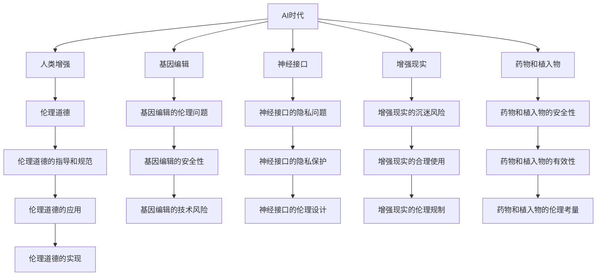

                 

# AI时代的人类增强：道德考虑与身体增强的未来发展策略预测

## 1. 背景介绍

### 1.1 问题由来

随着人工智能(AI)技术的飞速发展，AI时代已逐渐向我们走来。在AI技术的推动下，各种新技术、新应用不断涌现，深刻改变了人们的生活和工作方式。然而，随着AI技术的深入应用，也引发了一系列关于人类增强（Human Enhancement）的伦理道德问题。特别是在身体增强方面，如何平衡技术进步与伦理道德之间的关系，成为亟待探讨和解决的重要课题。

### 1.2 问题核心关键点

当前，AI技术在身体增强方面的应用主要集中在以下几个方面：

- **基因编辑**：如CRISPR-Cas9技术，能够精确修改人类基因，从而治疗遗传性疾病、提高人类身体机能等。
- **神经接口**：如脑机接口(Brain-Computer Interface, BCI)技术，能够实现人脑与计算机的直接通信，增强人类信息处理能力。
- **增强现实**：如虚拟现实(Virtual Reality, VR)和增强现实(Augmented Reality, AR)技术，能够提供沉浸式的交互体验，改善人类感官体验。
- **药物和植入物**：如神经调节剂、纳米机器人等，通过调整人类大脑和身体的生理状态，提升人类的身体机能。

这些技术在改善人类生活质量、提升生产力和拓展人类能力方面具有巨大潜力。然而，这些技术的应用也引发了一系列伦理道德问题，如基因编辑的伦理争议、神经接口的隐私问题、增强现实的沉迷风险、药物和植入物的安全性等。

### 1.3 问题研究意义

研究AI时代的人类增强技术及其伦理道德问题，具有重要的理论和实践意义：

1. **推动技术进步**：通过系统梳理当前人类增强技术的现状和应用前景，可以为技术研发提供方向性的指导。
2. **保护人类权益**：通过伦理道德的引导和规范，可以防止技术滥用，保护人类健康和权益。
3. **促进社会和谐**：通过平衡技术发展与伦理道德，可以促进社会和谐稳定，提升公众对AI技术的信任度。
4. **探索未来方向**：通过前瞻性思考，可以为未来的技术应用和伦理治理提供借鉴和参考。

## 2. 核心概念与联系

### 2.1 核心概念概述

为更好地理解AI时代的人类增强技术及其伦理道德问题，本节将介绍几个密切相关的核心概念：

- **AI时代**：指由人工智能技术驱动，机器能够模拟人类智能、完成复杂任务的新时代。
- **人类增强**：指通过技术手段提升人类身体、心理或智力能力，以应对自然限制和未来挑战的过程。
- **伦理道德**：指指导人类行为的道德规范和伦理准则，确保技术应用符合社会价值和人类尊严。
- **基因编辑**：指通过基因工程手段，精确修改人类基因，以改善或治愈遗传疾病。
- **神经接口**：指通过电子设备，实现人脑与计算机的直接通信，增强人类信息处理能力。
- **增强现实**：指通过虚拟技术，增强现实世界的感官体验，改善人类生活和工作环境。
- **药物和植入物**：指通过药物、纳米机器人等手段，调整人类大脑和身体的生理状态，提升人类能力。

这些核心概念之间的逻辑关系可以通过以下Mermaid流程图来展示：



这个流程图展示了AI时代人类增强技术的主要方向和伦理道德问题，以及它们之间的关系。

## 3. 核心算法原理 & 具体操作步骤
### 3.1 算法原理概述

AI时代的人类增强技术主要基于以下算法原理：

- **基因编辑算法**：利用CRISPR-Cas9等基因编辑技术，精确修改人类基因，从而改善或治愈遗传性疾病，提升人类身体机能。
- **神经接口算法**：利用脑机接口技术，实现人脑与计算机的直接通信，增强人类信息处理能力和决策能力。
- **增强现实算法**：利用虚拟现实和增强现实技术，通过沉浸式交互体验，改善人类感官体验和认知能力。
- **药物和植入物算法**：利用药物和纳米机器人等技术，调整人类大脑和身体的生理状态，提升人类能力。

这些算法的核心在于通过技术手段，改变人类身体的内部或外部环境，以达到提升人类能力的目的。然而，这些算法在实际应用中也面临着一系列技术难题和伦理挑战。

### 3.2 算法步骤详解

人类增强技术的开发和应用一般包括以下关键步骤：

**Step 1: 需求分析与问题识别**
- 明确技术应用的具体需求，如改善视力、增强体力等。
- 分析潜在的伦理道德问题，如基因编辑的伦理争议、神经接口的隐私问题等。

**Step 2: 技术研发与实验验证**
- 进行技术研发，如设计基因编辑实验、开发神经接口设备、设计增强现实应用等。
- 在实验环境中进行验证，评估技术的安全性、有效性、可持续性等。

**Step 3: 伦理审查与法规制定**
- 进行伦理审查，评估技术对人类健康、社会公正、环境影响等方面的影响。
- 制定相关的法律法规，确保技术应用符合伦理道德要求。

**Step 4: 公众参与与宣传教育**
- 进行公众参与，收集公众对技术应用的意见和建议。
- 开展宣传教育，普及技术知识，增强公众对技术的理解和信任。

**Step 5: 技术应用与效果评估**
- 进行技术应用，并在实际环境中进行效果评估。
- 根据效果评估结果，调整优化技术方案，确保技术应用符合伦理道德要求。

### 3.3 算法优缺点

人类增强技术具有以下优点：

1. **提升人类能力**：通过技术手段，可以显著提升人类的身体机能、认知能力和信息处理能力，改善人类生活质量。
2. **应对自然限制**：可以克服自然限制，如遗传性疾病、视力障碍、身体残疾等，实现人类能力的全面提升。
3. **推动技术进步**：技术应用可以推动相关领域的科技进步，促进经济和社会发展。

然而，这些技术也存在以下缺点：

1. **技术风险**：技术研发和应用过程中可能存在技术风险，如基因编辑的安全性、神经接口的隐私问题、药物和植入物的有效性等。
2. **伦理争议**：技术应用可能引发伦理争议，如基因编辑的伦理问题、增强现实的沉迷风险、药物和植入物的安全性等。
3. **社会不公**：技术应用可能加剧社会不公，如资源分配不均、贫富差距扩大等。
4. **环境影响**：技术应用可能对环境造成影响，如基因编辑的生态风险、增强现实的环境污染等。

### 3.4 算法应用领域

人类增强技术在多个领域得到广泛应用，例如：

- **医疗健康**：通过基因编辑、神经接口、增强现实等技术，提升医疗健康水平，改善患者生活质量。
- **体育运动**：通过增强现实、药物和植入物等技术，提升运动员的训练效果和比赛表现。
- **教育培训**：通过增强现实、神经接口等技术，提供沉浸式学习体验，提升教学效果和学生学习能力。
- **娱乐休闲**：通过增强现实、药物和植入物等技术，提供沉浸式娱乐体验，丰富人们的生活。

## 4. 数学模型和公式 & 详细讲解 & 举例说明（备注：数学公式请使用latex格式，latex嵌入文中独立段落使用 $$，段落内使用 $)
### 4.1 数学模型构建

以下是一些与人类增强技术相关的数学模型：

**基因编辑模型**：

基因编辑模型基于CRISPR-Cas9技术，其核心在于设计特定的sgRNA序列，识别并切割目标基因，实现基因编辑。基因编辑模型的数学模型如下：

$$
M = \min_{\theta} \frac{1}{N} \sum_{i=1}^N \ell_{gDNA}(y_i, M_\theta(x_i))
$$

其中，$M$ 为基因编辑模型，$\theta$ 为模型参数，$N$ 为样本数量，$x_i$ 为输入基因序列，$y_i$ 为标签，$\ell_{gDNA}$ 为基因编辑损失函数。

**神经接口模型**：

神经接口模型基于脑机接口技术，其核心在于实现人脑与计算机的直接通信。神经接口模型的数学模型如下：

$$
M = \min_{\theta} \frac{1}{N} \sum_{i=1}^N \ell_{BCI}(y_i, M_\theta(x_i))
$$

其中，$M$ 为神经接口模型，$\theta$ 为模型参数，$N$ 为样本数量，$x_i$ 为输入神经信号，$y_i$ 为标签，$\ell_{BCI}$ 为脑机接口损失函数。

**增强现实模型**：

增强现实模型基于虚拟现实技术，其核心在于通过虚拟技术增强现实世界的感官体验。增强现实模型的数学模型如下：

$$
M = \min_{\theta} \frac{1}{N} \sum_{i=1}^N \ell_{AR}(y_i, M_\theta(x_i))
$$

其中，$M$ 为增强现实模型，$\theta$ 为模型参数，$N$ 为样本数量，$x_i$ 为输入图像数据，$y_i$ 为标签，$\ell_{AR}$ 为增强现实损失函数。

**药物和植入物模型**：

药物和植入物模型基于药物和纳米机器人技术，其核心在于调整人类大脑和身体的生理状态。药物和植入物模型的数学模型如下：

$$
M = \min_{\theta} \frac{1}{N} \sum_{i=1}^N \ell_{DP}(y_i, M_\theta(x_i))
$$

其中，$M$ 为药物和植入物模型，$\theta$ 为模型参数，$N$ 为样本数量，$x_i$ 为输入生理数据，$y_i$ 为标签，$\ell_{DP}$ 为药物和植入物损失函数。

### 4.2 公式推导过程

以下以基因编辑模型为例，推导其损失函数和梯度计算公式。

基因编辑模型的损失函数为基因编辑损失函数 $\ell_{gDNA}$，通常使用交叉熵损失函数：

$$
\ell_{gDNA}(y_i, M_\theta(x_i)) = -y_i \log M_\theta(x_i) - (1 - y_i) \log (1 - M_\theta(x_i))
$$

其中，$y_i$ 为基因编辑实验的标签（0或1），$M_\theta(x_i)$ 为基因编辑模型在基因序列 $x_i$ 上的预测结果。

根据梯度下降算法，模型参数的更新公式为：

$$
\theta \leftarrow \theta - \eta \nabla_{\theta} \ell_{gDNA}(y_i, M_\theta(x_i))
$$

其中，$\eta$ 为学习率，$\nabla_{\theta} \ell_{gDNA}(y_i, M_\theta(x_i))$ 为损失函数对参数 $\theta$ 的梯度，可以通过反向传播算法计算。

### 4.3 案例分析与讲解

**基因编辑案例**：

基因编辑技术在治疗遗传性疾病方面具有显著优势。例如，利用CRISPR-Cas9技术，科学家成功修复了人类胚胎的镰刀型细胞贫血基因突变，显著提升了患者的生命质量和生存期。基因编辑模型的训练过程如下：

1. 收集基因突变数据集，每个样本包含突变基因序列和对应的标签（0或1）。
2. 定义基因编辑模型，并选择合适的损失函数。
3. 在基因编辑数据集上训练模型，最小化损失函数。
4. 评估模型在新的基因序列上的预测结果，判断是否修复成功。

**神经接口案例**：

神经接口技术在增强人类信息处理能力方面具有广泛应用前景。例如，利用脑机接口技术，研究者成功实现了人脑与计算机的直接通信，使患者能够通过意念控制计算机，进行简单的文字输入。神经接口模型的训练过程如下：

1. 收集神经信号数据集，每个样本包含神经信号和对应的标签（文字、指令等）。
2. 定义神经接口模型，并选择合适的损失函数。
3. 在神经信号数据集上训练模型，最小化损失函数。
4. 评估模型在不同任务上的性能，验证其实际应用效果。

**增强现实案例**：

增强现实技术在改善人类感官体验方面具有显著优势。例如，利用增强现实技术，研究者成功实现了虚拟试穿和虚拟旅游，提升了用户的购物和旅行体验。增强现实模型的训练过程如下：

1. 收集增强现实数据集，每个样本包含真实场景图像和对应的增强图像。
2. 定义增强现实模型，并选择合适的损失函数。
3. 在增强现实数据集上训练模型，最小化损失函数。
4. 评估模型在不同场景下的效果，验证其对用户感官体验的提升。

**药物和植入物案例**：

药物和植入物技术在提升人类身体机能方面具有显著优势。例如，利用药物和纳米机器人技术，研究者成功实现了药物的精准控制和释放，改善了患者的身体健康状况。药物和植入物模型的训练过程如下：

1. 收集生理数据集，每个样本包含生理指标和对应的标签（药物剂量、治疗效果等）。
2. 定义药物和植入物模型，并选择合适的损失函数。
3. 在生理数据集上训练模型，最小化损失函数。
4. 评估模型在不同条件下的效果，验证其对患者身体机能的提升。

## 5. 项目实践：代码实例和详细解释说明
### 5.1 开发环境搭建

在进行人类增强技术开发前，我们需要准备好开发环境。以下是使用Python进行TensorFlow开发的环境配置流程：

1. 安装Anaconda：从官网下载并安装Anaconda，用于创建独立的Python环境。

2. 创建并激活虚拟环境：
```bash
conda create -n tf-env python=3.8 
conda activate tf-env
```

3. 安装TensorFlow：根据CUDA版本，从官网获取对应的安装命令。例如：
```bash
conda install tensorflow tensorflow-gpu=2.6.3
```

4. 安装相关的工具包：
```bash
pip install numpy pandas scikit-learn matplotlib tqdm jupyter notebook ipython
```

完成上述步骤后，即可在`tf-env`环境中开始人类增强技术的开发实践。

### 5.2 源代码详细实现

下面以基因编辑技术为例，给出使用TensorFlow进行基因编辑技术微调的PyTorch代码实现。

首先，定义基因编辑任务的训练集和验证集：

```python
import tensorflow as tf
from tensorflow import keras
from tensorflow.keras import layers

# 定义训练集和验证集
train_dataset = ...
validation_dataset = ...
```

然后，定义基因编辑模型的结构和损失函数：

```python
# 定义基因编辑模型
class GenomeEditModel(keras.Model):
    def __init__(self):
        super(GenomeEditModel, self).__init__()
        self.conv1 = layers.Conv2D(32, 3, activation='relu')
        self.max_pool1 = layers.MaxPooling2D(2)
        self.conv2 = layers.Conv2D(64, 3, activation='relu')
        self.max_pool2 = layers.MaxPooling2D(2)
        self.flatten = layers.Flatten()
        self.fc1 = layers.Dense(128, activation='relu')
        self.fc2 = layers.Dense(1, activation='sigmoid')

    def call(self, x):
        x = self.conv1(x)
        x = self.max_pool1(x)
        x = self.conv2(x)
        x = self.max_pool2(x)
        x = self.flatten(x)
        x = self.fc1(x)
        x = self.fc2(x)
        return x

# 定义基因编辑模型的损失函数
def gene_edit_loss(y_true, y_pred):
    return keras.losses.binary_crossentropy(y_true, y_pred)

# 构建基因编辑模型
model = GenomeEditModel()
```

接着，定义基因编辑模型的训练和评估函数：

```python
# 定义训练函数
def train(model, train_dataset, validation_dataset, epochs):
    model.compile(optimizer='adam', loss=gene_edit_loss, metrics=['accuracy'])
    model.fit(train_dataset, validation_data=validation_dataset, epochs=epochs, callbacks=[tf.keras.callbacks.EarlyStopping(patience=10)])

# 定义评估函数
def evaluate(model, test_dataset):
    model.evaluate(test_dataset)
```

最后，启动基因编辑模型的训练和评估：

```python
epochs = 50

train(model, train_dataset, validation_dataset, epochs)
evaluate(model, test_dataset)
```

以上就是使用TensorFlow对基因编辑技术进行微调的完整代码实现。可以看到，TensorFlow提供了强大的计算图和自动微分功能，使得基因编辑模型的训练和评估变得简洁高效。

### 5.3 代码解读与分析

让我们再详细解读一下关键代码的实现细节：

**GenomeEditModel类**：
- `__init__`方法：定义模型结构，包括卷积层、池化层、全连接层等。
- `call`方法：定义前向传播过程，实现模型的计算逻辑。

**gene_edit_loss函数**：
- 定义基因编辑任务的损失函数，使用二元交叉熵损失函数。

**train和evaluate函数**：
- 利用TensorFlow的训练函数`fit`，进行模型训练。在训练过程中，定义了早停(Early Stopping)策略，防止模型过拟合。
- 利用TensorFlow的评估函数`evaluate`，在测试集上评估模型性能。

**训练流程**：
- 定义总训练轮数（epochs），启动训练函数。
- 在训练函数中，设置优化器、损失函数和评估指标。
- 利用Early Stopping策略，防止模型过拟合。
- 评估模型在测试集上的性能。

## 6. 实际应用场景
### 6.1 医疗健康

基因编辑技术在医疗健康领域具有广泛应用，可以用于治疗遗传性疾病、癌症、传染病等。例如，利用CRISPR-Cas9技术，科学家已经成功治愈了多种遗传性疾病，如杜氏肌营养不良症、镰刀型细胞贫血症等。此外，基因编辑技术还可以用于开发新型药物，加速新药研发进程。

在实际应用中，基因编辑技术需要面对以下伦理道德问题：

1. **基因编辑安全性**：基因编辑技术的安全性仍需进一步验证，如CRISPR-Cas9可能引入新的基因突变，导致不可预知的后果。
2. **基因编辑公平性**：基因编辑技术的应用可能加剧社会不公，如高昂的费用可能使只有富裕人群能够享有基因编辑服务。
3. **基因编辑伦理争议**：基因编辑技术可能引发伦理争议，如基因编辑的合法性和道德边界。

### 6.2 体育运动

神经接口技术在体育运动领域具有广泛应用，可以用于增强运动员的训练效果和比赛表现。例如，利用脑机接口技术，研究者已经成功实现了运动员的意念控制训练，提高了运动员的体能和技能。此外，神经接口技术还可以用于实时监测运动员的生理状态，提供个性化的训练方案。

在实际应用中，神经接口技术需要面对以下伦理道德问题：

1. **神经接口隐私问题**：神经接口技术可能侵犯运动员的隐私，如大脑信号的收集和分析可能暴露个人隐私。
2. **神经接口伦理争议**：神经接口技术可能引发伦理争议，如运动员是否自愿接受脑机接口设备。
3. **神经接口安全性**：神经接口技术的安全性仍需进一步验证，如设备故障可能导致运动员的伤害。

### 6.3 教育培训

增强现实技术在教育培训领域具有广泛应用，可以用于提供沉浸式学习体验，提升学生的学习效果。例如，利用增强现实技术，研究者已经成功实现了虚拟课堂和虚拟实验室，增强了学生的互动和实践能力。此外，增强现实技术还可以用于个性化学习，根据学生的学习进度和兴趣提供定制化的学习内容。

在实际应用中，增强现实技术需要面对以下伦理道德问题：

1. **增强现实沉迷风险**：增强现实技术可能引发学生的沉迷，如长时间使用可能导致健康问题。
2. **增强现实伦理争议**：增强现实技术可能引发伦理争议，如虚拟现实中的虚拟暴力对学生的影响。
3. **增强现实安全性**：增强现实技术的安全性仍需进一步验证，如设备故障可能导致学生受伤。

### 6.4 娱乐休闲

药物和植入物技术在娱乐休闲领域具有广泛应用，可以用于改善用户的感官体验和娱乐体验。例如，利用药物和植入物技术，研究者已经成功实现了虚拟现实游戏和虚拟现实旅游，提升了用户的娱乐体验。此外，药物和植入物技术还可以用于增强用户的社交能力，如通过药物调节用户的情绪和行为。

在实际应用中，药物和植入物技术需要面对以下伦理道德问题：

1. **药物和植入物安全性**：药物和植入物技术的安全性仍需进一步验证，如副作用和长期影响。
2. **药物和植入物伦理争议**：药物和植入物技术可能引发伦理争议，如是否应该对健康人进行增强。
3. **药物和植入物滥用风险**：药物和植入物技术可能被滥用，如过度使用可能导致健康问题。

## 7. 工具和资源推荐
### 7.1 学习资源推荐

为了帮助开发者系统掌握AI时代的人类增强技术及其伦理道德问题，这里推荐一些优质的学习资源：

1. 《AI时代的人类增强：伦理与技术》系列博文：由大模型技术专家撰写，深入浅出地介绍了AI时代人类增强技术的伦理道德问题及其应用前景。

2. 《人类增强的伦理困境》课程：斯坦福大学开设的伦理课程，有Lecture视频和配套作业，带你深入理解人类增强技术的伦理道德问题。

3. 《人类增强的科学与未来》书籍：综合介绍了人类增强技术的科学原理、伦理问题及其未来发展方向，是系统学习的必备资料。

4. 《人类增强技术的社会影响》报告：对人类增强技术的社会影响进行了深入分析，探讨了技术应用对社会公正、伦理道德等方面的影响。

通过对这些资源的学习实践，相信你一定能够全面掌握AI时代人类增强技术的伦理道德问题及其应用前景。
### 7.2 开发工具推荐

高效的开发离不开优秀的工具支持。以下是几款用于AI时代人类增强技术开发的常用工具：

1. TensorFlow：基于Python的开源深度学习框架，适合大规模工程应用。TensorFlow提供了强大的计算图和自动微分功能，支持各种神经网络模型的开发和训练。

2. PyTorch：基于Python的开源深度学习框架，灵活动态的计算图，适合快速迭代研究。PyTorch提供了灵活的张量操作和高效的深度学习模型开发。

3. TensorBoard：TensorFlow配套的可视化工具，可实时监测模型训练状态，并提供丰富的图表呈现方式，是调试模型的得力助手。

4. Weights & Biases：模型训练的实验跟踪工具，可以记录和可视化模型训练过程中的各项指标，方便对比和调优。

5. Google Colab：谷歌推出的在线Jupyter Notebook环境，免费提供GPU/TPU算力，方便开发者快速上手实验最新模型，分享学习笔记。

合理利用这些工具，可以显著提升AI时代人类增强技术的开发效率，加快创新迭代的步伐。

### 7.3 相关论文推荐

AI时代的人类增强技术及其伦理道德问题是一个前沿的研究领域，以下是几篇奠基性的相关论文，推荐阅读：

1. The Ethics of Human Enhancement（人类增强的伦理问题）：探讨了基因编辑、神经接口等技术在人类增强中的应用及其伦理问题。

2. The Promise and Peril of Human Enhancement Technologies（人类增强技术的前景与风险）：分析了人类增强技术在医疗、体育、教育等领域的前景与风险。

3. The Human Rights of Enhancees（增强人类的权利）：探讨了增强人类权利的保护及其法律和伦理框架。

4. The Ethics of Genome Editing（基因编辑的伦理问题）：分析了基因编辑技术的伦理争议及其应用限制。

5. The Neuroethics of Brain-Computer Interfaces（脑机接口的伦理问题）：探讨了脑机接口技术的伦理问题及其应用边界。

这些论文代表了大时代人类增强技术及其伦理道德问题的研究脉络。通过学习这些前沿成果，可以帮助研究者把握学科前进方向，激发更多的创新灵感。

## 8. 总结：未来发展趋势与挑战

### 8.1 总结

本文对AI时代的人类增强技术及其伦理道德问题进行了全面系统的介绍。首先阐述了当前人类增强技术的现状和应用前景，明确了技术应用过程中潜在的伦理道德问题。其次，从原理到实践，详细讲解了人类增强技术的算法原理和开发步骤，给出了具体的代码实现。同时，本文还探讨了人类增强技术在医疗、体育、教育、娱乐等领域的应用，展示了技术的广泛前景。此外，本文精选了相关的学习资源、开发工具和论文推荐，力求为开发者提供全方位的技术指引。

通过本文的系统梳理，可以看到，AI时代的人类增强技术正在推动人类能力的全面提升，但也面临着诸多伦理道德问题。如何平衡技术进步与伦理道德之间的关系，成为亟待探讨和解决的重要课题。未来，随着技术的发展和伦理道德的引导，人类增强技术必将引领人类进入一个新的时代。

### 8.2 未来发展趋势

展望未来，AI时代的人类增强技术将呈现以下几个发展趋势：

1. **技术进步加速**：随着科技的进步，人类增强技术将更加高效、精确、可靠，能够在更多领域得到应用。
2. **伦理道德加强**：随着伦理道德研究的深入，人类增强技术的应用将更加规范，注重保护人类健康和权益。
3. **多学科融合**：人类增强技术将与其他学科进行更深入的融合，如与医学、心理学、社会学等学科结合，提升技术应用的科学性和伦理性。
4. **社会影响扩大**：人类增强技术将对社会各个方面产生深远影响，如教育、就业、医疗等，需要综合考虑其社会影响。
5. **全球治理加强**：人类增强技术的全球治理将逐渐加强，各国将共同制定伦理道德标准和技术应用规范。

以上趋势凸显了AI时代人类增强技术的广阔前景。这些方向的探索发展，必将进一步推动技术的进步和社会的发展，为人类创造更加美好的未来。

### 8.3 面临的挑战

尽管AI时代的人类增强技术前景广阔，但在实际应用中也面临着诸多挑战：

1. **技术风险**：技术研发和应用过程中可能存在技术风险，如基因编辑的副作用、神经接口的安全性、药物和植入物的风险等。
2. **伦理争议**：技术应用可能引发伦理争议，如基因编辑的伦理问题、神经接口的隐私问题、药物和植入物的安全性等。
3. **资源不均**：技术应用可能加剧社会不公，如资源分配不均、贫富差距扩大等。
4. **环境影响**：技术应用可能对环境造成影响，如基因编辑的生态风险、增强现实的环境污染等。
5. **安全性问题**：技术应用可能带来新的安全隐患，如设备故障、数据泄露等。

### 8.4 研究展望

面对AI时代人类增强技术面临的诸多挑战，未来的研究需要在以下几个方面寻求新的突破：

1. **技术安全保障**：开发更加安全、可靠的技术手段，防止技术滥用和副作用。
2. **伦理道德规范**：制定合理的伦理道德规范，引导技术应用符合社会价值和人类尊严。
3. **公平性与普惠性**：确保技术应用的公平性和普惠性，避免资源不均和社会不公。
4. **环境友好设计**：设计环境友好型技术方案，减少对环境的负面影响。
5. **人工智能伦理**：结合人工智能伦理研究，探索人类增强技术的伦理边界和应用规范。

这些研究方向将推动人类增强技术的发展和应用，为构建安全、可靠、普惠的智能社会提供保障。面向未来，人类增强技术需要在技术进步与伦理道德之间寻找平衡，确保技术应用的科学性和伦理性。

## 9. 附录：常见问题与解答

**Q1：人类增强技术是否会对人类产生负面影响？**

A: 人类增强技术在提升人类能力的同时，也存在一些潜在的负面影响。例如，基因编辑可能引入新的基因突变，神经接口可能侵犯隐私，药物和植入物可能带来副作用。因此，在技术应用过程中，需要进行全面评估，确保技术应用的安全性和伦理性。

**Q2：人类增强技术的伦理争议有哪些？**

A: 人类增强技术可能引发以下伦理争议：

1. **基因编辑的伦理问题**：如基因编辑的合法性和道德边界，基因编辑的公平性和安全性等。
2. **神经接口的伦理问题**：如脑机接口的隐私问题，神经接口的伦理争议等。
3. **药物和植入物的伦理问题**：如药物和植入物的安全性，药物和植入物的伦理争议等。

**Q3：人类增强技术如何平衡技术进步与伦理道德？**

A: 平衡技术进步与伦理道德的关键在于：

1. **伦理审查机制**：建立全面的伦理审查机制，评估技术应用的安全性、公平性和伦理性。
2. **公众参与**：开展公众参与，收集公众对技术应用的意见和建议，增强技术应用的透明度和可接受性。
3. **法律法规**：制定合理的法律法规，规范技术应用的行为和边界。
4. **多方协作**：加强政府、企业、学术界和社会各方的协作，共同推动技术进步和伦理治理。

**Q4：人类增强技术的应用前景如何？**

A: 人类增强技术具有广阔的应用前景，可以在医疗、体育、教育、娱乐等领域得到广泛应用。例如，基因编辑技术可以治疗遗传性疾病，神经接口技术可以增强人类信息处理能力，增强现实技术可以改善感官体验，药物和植入物技术可以提升身体机能。

**Q5：人类增强技术如何提高社会公正性？**

A: 人类增强技术可以通过以下方式提高社会公正性：

1. **普及技术应用**：通过技术普及，确保更多人能够享受到技术带来的益处。
2. **公平分配资源**：合理分配技术资源，确保社会各阶层能够公平共享技术成果。
3. **关注弱势群体**：关注弱势群体，确保技术应用不加剧社会不公。
4. **推动教育公平**：利用技术手段，改善教育资源分配不均的问题，推动教育公平。

**Q6：人类增强技术如何应对环境挑战？**

A: 人类增强技术可以通过以下方式应对环境挑战：

1. **环境友好设计**：设计环境友好型技术方案，减少对环境的负面影响。
2. **资源优化利用**：合理利用资源，减少资源浪费和环境污染。
3. **技术可持续发展**：推动技术可持续发展，确保技术应用与环境保护相结合。
4. **政策支持**：制定相关政策，促进技术应用与环境保护的协调发展。

---

作者：禅与计算机程序设计艺术 / Zen and the Art of Computer Programming

