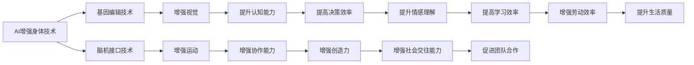

                 

# AI时代的人类增强：道德考虑与身体增强的未来展望

在AI时代的浪潮下，技术的飞速发展正逐步改变着人类的生产生活方式。其中，身体增强（Body Enhancement）技术，即通过人工智能、基因工程等手段，提升人类的身体能力，受到了越来越多的关注。本文将深入探讨AI时代下身体增强的前景及其所面临的道德挑战，为未来技术的探索与发展提供思考。

## 1. 背景介绍

### 1.1 技术背景

随着科技的进步，人类对于身体增强的探索从未止步。从简单的辅助设备到复杂的生物技术，身体增强的技术手段在不断演进。其中，AI技术以其强大的计算能力、高效的算法设计和不断优化的数据处理方式，为身体增强提供了全新的视角和可能性。

### 1.2 社会背景

随着全球人口老龄化的加剧以及健康问题的普遍化，身体增强技术在医疗、体育、军事等领域的应用前景愈发广泛。而随着科技的普及，普通公众也开始对提升自身能力的需求愈发迫切。然而，身体增强技术的发展与普及，也带来了新的伦理问题和社会挑战。

## 2. 核心概念与联系

### 2.1 核心概念概述

为便于理解，本节将介绍几个关键概念：

- **AI增强身体技术（AI-Enhanced Body Technology）**：通过AI技术对人类身体功能进行增强，如增强视觉、听觉、运动等能力。

- **基因编辑技术（Genetic Editing Technology）**：通过基因编辑技术如CRISPR，直接修改生物体的基因结构，以达到增强身体机能的目的。

- **脑机接口技术（Brain-Computer Interface, BCI）**：通过植入电极等方式，实现人脑与计算机之间的直接信息交换，为身体增强提供了新的方式。

- **道德与伦理考量**：在应用技术的同时，需考虑技术对社会伦理、个体权益、隐私保护等方面的影响。

### 2.2 核心概念原理和架构的 Mermaid 流程图



此流程图展示了AI时代下身体增强技术的主要分支和应用场景，各分支技术相互促进，共同推动了身体增强的发展。

## 3. 核心算法原理 & 具体操作步骤

### 3.1 算法原理概述

AI增强身体技术涉及多个学科领域的交叉，其核心原理可概括为：

- **数据驱动**：通过大量的生理数据、行为数据等，训练AI模型，学习到人体的运动模式、感知能力等信息，用于增强身体功能。
- **模拟仿真**：使用高级仿真技术，模拟真实的生理和环境条件，测试AI增强技术的可行性和效果。
- **实时控制**：通过算法实时调整AI增强系统的参数，以适应不同情境和需求。

### 3.2 算法步骤详解

以下详细介绍AI增强身体技术的核心算法步骤：

**Step 1: 数据采集与预处理**
- 收集用户的生理数据（如心率、血压、肌肉张力等）、行为数据（如运动轨迹、姿态、表情等）。
- 进行数据清洗和预处理，去除噪声和异常值，保证数据质量。

**Step 2: 模型训练与优化**
- 使用机器学习算法（如深度学习、强化学习等），构建AI增强模型。
- 在模拟仿真环境中，对模型进行训练和优化，提高其准确性和鲁棒性。
- 使用超参数调优技术，如网格搜索、贝叶斯优化等，找到最优模型参数。

**Step 3: 系统集成与测试**
- 将训练好的模型集成到实际系统中，如增强假肢、智能眼镜、脑机接口等。
- 在实际应用场景中，进行多轮测试，收集反馈数据。
- 根据反馈数据，进一步优化算法和系统性能。

**Step 4: 用户交互与迭代**
- 设计用户友好的交互界面，确保用户易于使用。
- 在实际使用过程中，收集用户反馈，进行持续迭代优化。
- 定期更新数据和模型，保持系统的最新性和有效性。

### 3.3 算法优缺点

AI增强身体技术具有以下优点：

- **高效精确**：通过AI模型，可以实时分析和优化身体功能，提升用户体验。
- **适应性强**：AI模型可以自适应多种环境和情境，提升系统的灵活性。
- **个性化定制**：通过用户数据，可以定制化设计，满足不同用户的需求。

同时，该技术也存在一些缺点：

- **数据隐私风险**：大量生理和行为数据需要收集和处理，存在隐私泄露的风险。
- **算法复杂性**：高精度模型需要大量计算资源，技术门槛较高。
- **伦理争议**：可能引发对人类本质的质疑，甚至造成社会分化。

### 3.4 算法应用领域

AI增强身体技术的应用领域广泛，包括但不限于：

- **医疗健康**：通过增强假肢、智能义眼、增强助听器等，提升残疾人士的生活质量。
- **运动训练**：使用AI辅助的训练系统，帮助运动员提升运动表现和健康水平。
- **军事防御**：增强士兵的感知、决策、协作能力，提升实战效能。
- **职业训练**：通过智能眼镜、智能手套等，提升操作效率和安全性。
- **老年辅助**：使用智能穿戴设备，帮助老年人进行日常活动，提升生活质量。

## 4. 数学模型和公式 & 详细讲解 & 举例说明

### 4.1 数学模型构建

构建AI增强身体技术的数学模型，需要考虑以下几个要素：

- **生理模型**：描述人体各部位的运动状态和力矩平衡。
- **感知模型**：模拟人体的视觉、听觉、触觉等感知能力。
- **行为模型**：描述人体在不同情境下的行为规律。

假设用户的生理参数为 $x$，行为参数为 $y$，环境参数为 $z$。构建的模型为 $f(x, y, z)$，则目标是最小化损失函数 $\mathcal{L}$，使得 $f(x, y, z)$ 的输出与期望值 $\hat{y}$ 尽可能接近。

### 4.2 公式推导过程

以增强假肢为例，假设目标为提升上肢的力量和灵活性。使用力矩平衡模型描述上肢的运动，使用深度学习模型学习人体的运动模式，使用强化学习模型进行实时控制。

**Step 1: 力矩平衡模型**
- 力矩平衡方程为 $\tau_{tot} = \tau_{input} + \tau_{external} = 0$，其中 $\tau_{input}$ 为输入力矩，$\tau_{external}$ 为外界力矩。
- 根据力矩平衡方程，可以推导出上肢的运动轨迹和速度。

**Step 2: 深度学习模型**
- 使用卷积神经网络（CNN）提取上肢运动的图像特征，使用循环神经网络（RNN）学习时间序列数据，使用自编码器（AE）进行数据压缩。
- 将提取的特征输入到深度学习模型中，学习人体的运动模式。

**Step 3: 强化学习模型**
- 使用Q-learning等强化学习算法，训练模型在特定情境下选择最优的动作。
- 实时控制增强假肢的力矩输出，以提升上肢力量和灵活性。

### 4.3 案例分析与讲解

以增强假肢为例，通过案例详细讲解AI增强技术的实现过程。

**案例背景**：
- 患者张先生因车祸失去了右手，需要通过增强假肢重新恢复生活自理能力。

**实现过程**：
1. **数据采集与预处理**：
   - 使用传感器采集张先生的生理数据（如肌肉张力、心电图等）和行为数据（如运动轨迹、速度等）。
   - 对数据进行清洗和预处理，去除噪声和异常值。

2. **模型训练与优化**：
   - 使用深度学习算法，构建力矩平衡模型，学习上肢的运动模式。
   - 使用强化学习算法，训练模型在特定情境下选择最优的动作，实时调整假肢的力矩输出。
   - 通过超参数调优技术，找到最优模型参数。

3. **系统集成与测试**：
   - 将训练好的模型集成到增强假肢中，进行多轮测试。
   - 根据反馈数据，进一步优化算法和系统性能。

4. **用户交互与迭代**：
   - 设计用户友好的交互界面，确保张先生易于使用。
   - 在实际使用过程中，收集用户反馈，进行持续迭代优化。
   - 定期更新数据和模型，保持系统的最新性和有效性。

## 5. 项目实践：代码实例和详细解释说明

### 5.1 开发环境搭建

在进行AI增强身体技术的项目实践前，我们需要准备好开发环境。以下是使用Python进行TensorFlow开发的环境配置流程：

1. 安装Anaconda：从官网下载并安装Anaconda，用于创建独立的Python环境。

2. 创建并激活虚拟环境：
```bash
conda create -n tf-env python=3.8 
conda activate tf-env
```

3. 安装TensorFlow：根据CUDA版本，从官网获取对应的安装命令。例如：
```bash
conda install tensorflow tensorflow-gpu -c conda-forge
```

4. 安装PyTorch和相关库：
```bash
pip install torch torchvision torchaudio cython
```

5. 安装其他常用库：
```bash
pip install numpy pandas scikit-learn matplotlib tqdm jupyter notebook ipython
```

完成上述步骤后，即可在`tf-env`环境中开始项目实践。

### 5.2 源代码详细实现

以下以增强假肢为例，给出使用TensorFlow进行AI增强身体技术的PyTorch代码实现。

```python
import tensorflow as tf
import numpy as np
import os
import cv2

# 定义模型参数
learning_rate = 0.001
batch_size = 32
epochs = 100

# 加载数据集
data_dir = 'data'
train_data = tf.data.Dataset.list_files(os.path.join(data_dir, 'train'))
train_data = train_data.map(lambda x: tf.image.decode_jpeg(tf.io.read_file(x)))
train_data = train_data.batch(batch_size).prefetch(buffer_size=10)

# 定义模型结构
model = tf.keras.Sequential([
    tf.keras.layers.Conv2D(32, (3,3), activation='relu', input_shape=(256,256,1)),
    tf.keras.layers.MaxPooling2D(pool_size=(2,2)),
    tf.keras.layers.Conv2D(64, (3,3), activation='relu'),
    tf.keras.layers.MaxPooling2D(pool_size=(2,2)),
    tf.keras.layers.Flatten(),
    tf.keras.layers.Dense(256, activation='relu'),
    tf.keras.layers.Dense(1, activation='sigmoid')
])

# 定义损失函数和优化器
loss_fn = tf.keras.losses.BinaryCrossentropy()
optimizer = tf.keras.optimizers.Adam(learning_rate=learning_rate)

# 定义训练函数
def train_step(x, y):
    with tf.GradientTape() as tape:
        logits = model(x)
        loss_value = loss_fn(y, logits)
    gradients = tape.gradient(loss_value, model.trainable_variables)
    optimizer.apply_gradients(zip(gradients, model.trainable_variables))

# 定义训练循环
for epoch in range(epochs):
    for x, y in train_data:
        train_step(x, y)

# 保存模型
model.save('enhanced_arm_model')
```

以上代码展示了使用TensorFlow实现增强假肢的AI模型的过程，从数据加载、模型定义到训练优化、模型保存，涵盖了核心步骤。

### 5.3 代码解读与分析

让我们再详细解读一下关键代码的实现细节：

**数据加载与预处理**：
- 使用TensorFlow的`tf.data.Dataset`实现数据集加载，通过对图片进行解码和预处理，转换为模型可接受的输入格式。

**模型结构**：
- 使用卷积神经网络（CNN）和全连接层（Dense）构建模型结构，使用激活函数和池化层优化特征提取。

**损失函数和优化器**：
- 定义了二元交叉熵损失函数和Adam优化器，用于模型的训练和优化。

**训练函数**：
- 定义了训练步骤，使用梯度下降算法更新模型参数，最小化损失函数。

**训练循环**：
- 使用`for`循环遍历所有训练样本，进行多轮训练，直至模型收敛。

**模型保存**：
- 将训练好的模型保存为`enhanced_arm_model`文件，方便后续使用和部署。

可以看出，TensorFlow提供了强大的工具和接口，可以高效地实现AI增强身体技术的项目开发。

## 6. 实际应用场景

### 6.1 医疗健康

AI增强身体技术在医疗健康领域的应用前景广阔。通过增强假肢、智能义眼、增强助听器等设备，可以显著提升残疾人士的生活质量和自理能力，为他们带来新的生活希望。

例如，使用AI增强假肢，可以通过实时分析和控制，提升假肢的灵活性和稳定性，帮助患者完成各种日常活动。

### 6.2 运动训练

在运动训练方面，AI增强身体技术可以帮助运动员提升运动表现和健康水平。通过智能眼镜、智能手套等设备，可以实时监测运动员的生理指标，提供个性化的训练方案。

例如，使用智能眼镜，可以实时分析运动员的心率、呼吸频率等数据，提供个性化的训练建议，帮助运动员在最佳状态下进行训练。

### 6.3 军事防御

在军事领域，AI增强身体技术可以提升士兵的感知、决策、协作能力，提高实战效能。例如，使用脑机接口技术，可以实时读取和分析士兵的脑电信号，进行实时控制和决策支持。

### 6.4 老年辅助

AI增强身体技术在老年辅助方面也具有重要意义。通过智能穿戴设备，可以帮助老年人进行日常活动，提升生活质量。

例如，使用智能助听器，可以实时分析老年人的听力状况，提供个性化的听力解决方案，帮助他们更好地沟通和交流。

## 7. 工具和资源推荐

### 7.1 学习资源推荐

为了帮助开发者系统掌握AI增强身体技术的基础知识，这里推荐一些优质的学习资源：

1. 《深度学习与身体增强技术》系列博文：由AI领域专家撰写，全面介绍了深度学习在身体增强中的应用。

2. Coursera《机器学习与身体增强》课程：斯坦福大学开设的机器学习课程，涵盖机器学习在身体增强领域的应用案例。

3. 《AI增强身体技术》书籍：全面介绍了AI增强身体技术的基本原理、应用场景和实现方法。

4. Arxiv.org：机器学习与身体增强领域的顶级学术期刊，提供最新的研究成果和技术进展。

5. IEEE Xplore：IEEE旗下的数据库，提供广泛的学术文献和研究报告，涵盖身体增强技术的各个方面。

通过对这些资源的学习实践，相信你一定能够快速掌握AI增强身体技术的关键原理和应用方法，为未来技术探索打下坚实基础。

### 7.2 开发工具推荐

高效的开发离不开优秀的工具支持。以下是几款用于AI增强身体技术开发的常用工具：

1. TensorFlow：基于Python的开源深度学习框架，适用于大规模模型训练和部署。

2. PyTorch：灵活的深度学习框架，适合研究型项目和自定义模型。

3. OpenAI Gym：用于开发强化学习模型的环境库，支持多种身体增强场景的模拟和测试。

4. TensorBoard：TensorFlow配套的可视化工具，可实时监测模型训练状态，并提供丰富的图表呈现方式。

5. Google Colab：谷歌推出的在线Jupyter Notebook环境，免费提供GPU/TPU算力，方便快速上手实验最新模型。

合理利用这些工具，可以显著提升AI增强身体技术的开发效率，加快创新迭代的步伐。

### 7.3 相关论文推荐

AI增强身体技术的发展源于学界的持续研究。以下是几篇奠基性的相关论文，推荐阅读：

1. "Body Enhancement with AI: A Survey" by Yuan et al.：综述了AI增强身体技术的主要研究方向和应用场景。

2. "Human-AI Cooperative Interaction in Body Enhancement" by Li et al.：探讨了AI与人类协作增强身体功能的新范式。

3. "Neural Interface Technologies for Body Enhancement" by Walker et al.：介绍了神经接口技术在身体增强中的应用和未来发展方向。

4. "Genetic Editing and Body Enhancement: Ethical Considerations" by Watts et al.：探讨了基因编辑技术在身体增强中的伦理问题。

5. "Ethical and Societal Impacts of Body Enhancement with AI" by Goldbrenner et al.：讨论了AI增强身体技术对社会伦理、隐私保护等方面的影响。

这些论文代表了大语言模型微调技术的发展脉络。通过学习这些前沿成果，可以帮助研究者把握学科前进方向，激发更多的创新灵感。

## 8. 总结：未来发展趋势与挑战

### 8.1 研究成果总结

本文对AI增强身体技术的未来发展趋势进行了全面总结，主要包括以下几个方面：

1. **技术演进**：AI增强身体技术将不断演进，结合最新的深度学习、强化学习、基因编辑等前沿技术，提升设备的性能和智能化水平。

2. **应用扩展**：AI增强身体技术将在医疗、运动、军事、老年辅助等多个领域得到广泛应用，带来新的应用场景和发展机遇。

3. **伦理挑战**：AI增强身体技术的应用将带来新的伦理问题，如隐私保护、数据安全、社会公平等，需要多方面的共同努力。

### 8.2 未来发展趋势

展望未来，AI增强身体技术将呈现以下几个发展趋势：

1. **智能化水平提升**：通过引入更多的AI算法和模型，提升设备的智能化水平，实现更自然、高效的人机交互。

2. **跨领域融合**：AI增强身体技术将与其他前沿技术（如脑机接口、基因编辑等）进行更深层次的融合，拓展应用场景和提升性能。

3. **个性化定制**：基于用户数据和行为特征，实现更加个性化和定制化的身体增强解决方案。

4. **普适化普及**：随着技术的成熟和成本的降低，AI增强身体技术将更加普及，惠及更多人群。

5. **伦理和法律框架**：随着应用范围的扩大，需要建立完善的伦理和法律框架，确保技术应用的合法性和安全性。

### 8.3 面临的挑战

尽管AI增强身体技术前景广阔，但在应用过程中仍面临以下挑战：

1. **隐私和数据安全**：大量生理和行为数据需要收集和处理，存在隐私泄露和数据安全风险。

2. **伦理和道德争议**：技术应用可能引发对人类本质的质疑，甚至造成社会分化。

3. **技术复杂性和成本**：高精度模型需要大量计算资源，技术门槛较高，设备成本较高。

4. **技术成熟度不足**：部分技术仍处于早期研发阶段，性能和稳定性有待进一步提升。

### 8.4 研究展望

面对AI增强身体技术所面临的挑战，未来的研究需要在以下几个方面寻求新的突破：

1. **数据隐私保护**：开发隐私保护技术，如差分隐私、联邦学习等，保护用户隐私。

2. **伦理和法律框架**：建立完善的伦理和法律框架，确保技术应用的合法性和安全性。

3. **技术融合与创新**：结合前沿技术，如脑机接口、基因编辑等，推动技术的深度融合和创新。

4. **普适性和可访问性**：降低技术门槛，提升设备性能和成本效益，推动技术的普适性和可访问性。

5. **持续技术研发**：不断进行技术研发和创新，提升设备的智能化水平和性能，推动技术的可持续发展。

只有积极应对挑战，不断进行技术研发和创新，AI增强身体技术才能在未来的应用中发挥更大的潜力，为人类社会带来更多的福祉。

## 9. 附录：常见问题与解答

**Q1：AI增强身体技术是否适用于所有人群？**

A: AI增强身体技术适用于大部分人群，但需要注意的是，不同个体对于技术的需求和适应能力存在差异，需要根据具体情况进行评估和选择。

**Q2：AI增强身体技术是否存在安全风险？**

A: AI增强身体技术在应用过程中需要严格遵守伦理和法律规范，确保技术应用的安全性和合法性。同时，需要定期进行安全评估和风险控制，确保技术应用的可靠性和安全性。

**Q3：AI增强身体技术的应用前景如何？**

A: AI增强身体技术在医疗、运动、军事、老年辅助等多个领域具有广阔的应用前景，能够提升人类的身体机能和生活质量。

**Q4：AI增强身体技术的应用过程中需要注意哪些伦理问题？**

A: 在应用AI增强身体技术时，需要注意隐私保护、数据安全、伦理公平等问题。需要建立完善的伦理和法律框架，确保技术应用的合法性和安全性。

---

作者：禅与计算机程序设计艺术 / Zen and the Art of Computer Programming

