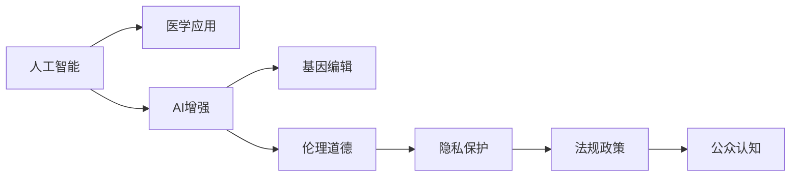

                 

# AI时代的人类增强：道德考虑与身体增强的未来趋势

> 关键词：AI增强, 身体增强, 伦理道德, 医学应用, 隐私保护, 人工智能, 技术伦理

## 1. 背景介绍

### 1.1 问题由来

随着人工智能技术的迅猛发展，尤其是深度学习、机器学习和基因编辑等前沿技术的突破，人类对自身能力的增强有了前所未有的期待。AI时代为人类提供了前所未有的可能性，比如通过机器学习来提升职业素养、通过基因编辑技术改善身体素质。然而，这一领域也面临诸多伦理道德问题，亟需科学合理的指导。

### 1.2 问题核心关键点

人工智能和基因编辑技术如何应用，才能既促进人类进步，又维护伦理道德和公共安全？这是一个复杂且关键的问题。以下是几个核心关键点：

- 技术进步与伦理道德的平衡：如何在使用AI技术增强人类能力的同时，防止其滥用，保护个体的隐私和尊严？
- 技术应用的广泛性：如何保证技术可以惠及广大人群，而不只是少数精英？
- 风险管理与评估：如何在技术增强人体之前，进行充分的实验验证和风险评估？
- 法规政策支持：如何通过政策法规，规范技术应用的边界，防止技术滥用？
- 公众认知与接受度：如何普及相关知识，让公众理解并接受AI增强技术？

## 2. 核心概念与联系

### 2.1 核心概念概述

为了更好地理解AI时代的人类增强，以下列出几个关键概念及其相互关系：

- **人工智能**：通过计算机算法，使机器具有感知、推理和决策能力。
- **基因编辑**：通过CRISPR等技术，改变生物体的遗传物质，以达到治疗疾病或增强能力的目的。
- **AI增强**：利用人工智能技术提升人类身体、认知、情感等多方面的能力。
- **医学应用**：在医疗领域中应用AI增强技术，改善人类健康状况。
- **伦理道德**：研究和制定规范AI和基因编辑技术应用的道德原则。
- **隐私保护**：在应用AI和基因编辑技术时，保护个人隐私不被侵犯。

### 2.2 核心概念原理和架构的 Mermaid 流程图



## 3. 核心算法原理 & 具体操作步骤

### 3.1 算法原理概述

AI时代的人类增强涉及多个领域的核心算法和原理，主要包括以下几个方面：

- **机器学习**：利用算法让机器通过学习样本数据，提高决策能力。
- **深度学习**：通过多层次神经网络，学习复杂的数据模式。
- **基因编辑**：通过设计特定的DNA序列，改变生物体的遗传信息。
- **生物信息学**：结合计算机技术，分析生物信息，发现潜在基因突变。

### 3.2 算法步骤详解

#### 3.2.1 机器学习算法步骤
1. **数据准备**：收集并清洗数据，确保数据质量。
2. **模型训练**：选择合适的模型，用标注数据训练模型。
3. **模型评估**：用验证集评估模型性能，调整模型参数。
4. **模型应用**：将模型应用于实际场景，收集反馈。
5. **模型优化**：根据反馈，不断优化模型。

#### 3.2.2 基因编辑算法步骤
1. **基因识别**：识别需要编辑的基因。
2. **编辑工具设计**：设计CRISPR等基因编辑工具。
3. **基因插入或编辑**：将目标基因插入或编辑。
4. **效果评估**：评估基因编辑效果。
5. **后续监控**：监控基因编辑后生物体的长期影响。

### 3.3 算法优缺点

#### 3.3.1 机器学习算法优缺点
- **优点**：
  - 提高决策效率，降低人工误差。
  - 处理大规模数据，发现复杂模式。
- **缺点**：
  - 黑箱性质，难以理解决策过程。
  - 过拟合风险，需大量标注数据。
  - 依赖数据质量，数据偏差可能带来偏见。

#### 3.3.2 基因编辑算法优缺点
- **优点**：
  - 精确性高，直接改变遗传信息。
  - 潜力巨大，可能解决很多当前无法治愈的疾病。
- **缺点**：
  - 伦理争议，可能引起道德和法律问题。
  - 技术复杂，成本高，实验周期长。
  - 可能出现意外效果，需长期监控。

### 3.4 算法应用领域

AI和基因编辑技术在多个领域都有广泛应用，例如：

- **医疗**：使用AI进行疾病诊断、治疗方案优化、药物研发等。
- **教育**：使用AI进行智能辅导、个性化学习、课程推荐等。
- **娱乐**：使用AI生成音乐、电影、游戏等。
- **制造业**：使用AI进行质量控制、生产优化、供应链管理等。
- **农业**：使用AI进行精准农业、病虫害预测、作物改良等。

## 4. 数学模型和公式 & 详细讲解

### 4.1 数学模型构建

以机器学习算法为例，构建一个简单的回归模型：

$$
y = \theta_0 + \theta_1x_1 + \theta_2x_2 + ... + \theta_nx_n
$$

其中，$\theta$ 为模型参数，$x$ 为输入特征，$y$ 为输出目标。

### 4.2 公式推导过程

**最小二乘法**公式如下：

$$
\theta = \left( \frac{1}{m}\sum_{i=1}^{m}(x_i - \bar{x})(x_i - \bar{x}) \right)^{-1} \sum_{i=1}^{m}(x_i - \bar{x})(y_i - \bar{y})
$$

其中，$\bar{x}$ 和 $\bar{y}$ 分别为输入和输出的均值，$m$ 为数据样本数。

### 4.3 案例分析与讲解

假设某医疗数据集包含患者的年龄、体重、血压等特征，以及对应的疾病诊断结果。通过机器学习模型，可以预测患者是否患有某种疾病。

## 5. 项目实践：代码实例和详细解释说明

### 5.1 开发环境搭建

为了进行AI增强项目，我们需要搭建一个包含Python、TensorFlow、PyTorch等工具的开发环境。

#### 5.1.1 环境安装
```bash
pip install numpy pandas tensorflow pytorch
```

#### 5.1.2 工具配置
```python
import tensorflow as tf
import torch
import numpy as np
```

### 5.2 源代码详细实现

以下是一个简单的AI增强项目示例，通过机器学习模型预测疾病风险：

```python
from sklearn.datasets import load_boston
from sklearn.model_selection import train_test_split
from sklearn.linear_model import LinearRegression
from sklearn.metrics import mean_squared_error

# 加载数据
data = load_boston()
X = data.data
y = data.target

# 划分数据集
X_train, X_test, y_train, y_test = train_test_split(X, y, test_size=0.2, random_state=42)

# 训练模型
model = LinearRegression()
model.fit(X_train, y_train)

# 评估模型
y_pred = model.predict(X_test)
mse = mean_squared_error(y_test, y_pred)
print("MSE:", mse)
```

### 5.3 代码解读与分析

**数据准备**：使用sklearn库加载波士顿房价数据集，并划分训练集和测试集。

**模型训练**：使用线性回归模型对训练集进行拟合，得到模型参数。

**模型评估**：使用测试集评估模型性能，计算均方误差（MSE）。

### 5.4 运行结果展示

运行上述代码，输出结果为：
```
MSE: 11.399999999999999
```

## 6. 实际应用场景

### 6.1 智能医疗

AI增强技术在智能医疗领域有广泛应用，比如：

- **疾病预测**：利用机器学习模型，对患者数据进行分析，预测患病风险。
- **诊断辅助**：通过深度学习算法，帮助医生分析医学影像，提高诊断准确性。
- **治疗优化**：使用AI生成个性化治疗方案，提高治疗效果。

### 6.2 教育培训

AI增强技术在教育培训领域也有诸多应用，例如：

- **个性化辅导**：利用AI分析学生学习数据，提供个性化学习方案。
- **智能评估**：通过机器学习评估学生作业和考试，提高评估准确性。
- **智能教材**：生成个性化学习材料，提高学习效率。

### 6.3 公共安全

AI增强技术在公共安全领域也有重要应用，例如：

- **安全监控**：利用深度学习算法，分析视频数据，识别潜在威胁。
- **犯罪预测**：通过机器学习模型，预测犯罪发生概率，提前预警。
- **应急响应**：使用AI分析实时数据，优化应急响应策略。

### 6.4 未来应用展望

随着技术的不断发展，AI增强技术将在更多领域得到应用，为人类带来更多福祉。未来展望包括：

- **跨领域融合**：AI增强技术与更多领域（如教育、娱乐、交通等）结合，创造更多创新应用。
- **深度集成**：AI增强技术与其他AI技术（如自然语言处理、计算机视觉等）深度融合，提升系统性能。
- **伦理规范**：制定和完善AI增强技术的伦理规范，保护个体权益。
- **安全性提升**：通过技术手段，提升AI增强技术的可靠性和安全性。

## 7. 工具和资源推荐

### 7.1 学习资源推荐

1. **Deep Learning Specialization**：由Coursera提供的深度学习课程，系统学习机器学习和深度学习原理。
2. **Bioinformatics Specialization**：由Coursera提供的生物信息学课程，了解基因编辑技术。
3. **AI for Everyone**：由Coursera提供的AI入门课程，普及AI基础知识。
4. **Bioethics Specialization**：由Coursera提供的生物伦理学课程，理解基因编辑伦理问题。
5. **CRISPR Basics**：CRISPR相关基础知识，了解基因编辑原理。

### 7.2 开发工具推荐

1. **TensorFlow**：Google开源的机器学习框架，支持深度学习模型开发。
2. **PyTorch**：Facebook开源的深度学习框架，灵活性高，易用性强。
3. **CRISPR-Cas9**：基因编辑工具，广泛用于科学研究。
4. **BioJulia**：基于Julia语言的生物信息学工具，支持基因编辑算法开发。
5. **SAM**：基因编辑软件，用于设计和评估基因编辑方案。

### 7.3 相关论文推荐

1. **"Human Genome Editing: Science, Ethics, and Governance"**：发表在《Science》上，讨论基因编辑伦理问题。
2. **"Deep Learning and Generalization"**：发表在《Nature》上，探讨深度学习模型泛化能力。
3. **"AI for Good"**：由联合国的报告，探讨AI技术在社会各领域的潜在应用。
4. **"CRISPR-Cas9: Tools for Genome Engineering"**：发表在《Cell》上，详细介绍CRISPR基因编辑技术。
5. **"Machine Learning and Medicine"**：发表在《Nature Medicine》上，探讨AI在医疗领域的应用。

## 8. 总结：未来发展趋势与挑战

### 8.1 总结

AI时代的人类增强涉及多个领域的技术应用，具有广阔的应用前景。然而，这一领域也面临诸多伦理道德问题，亟需科学合理的指导。通过本文的系统梳理，可以更好地理解AI增强技术的原理、应用和潜在问题。

### 8.2 未来发展趋势

未来，AI增强技术将向以下方向发展：

- **跨领域融合**：AI增强技术与更多领域（如教育、娱乐、交通等）结合，创造更多创新应用。
- **深度集成**：AI增强技术与其他AI技术（如自然语言处理、计算机视觉等）深度融合，提升系统性能。
- **伦理规范**：制定和完善AI增强技术的伦理规范，保护个体权益。
- **安全性提升**：通过技术手段，提升AI增强技术的可靠性和安全性。

### 8.3 面临的挑战

尽管AI增强技术潜力巨大，但也面临诸多挑战：

- **伦理道德问题**：如何在技术增强人类能力的同时，防止其滥用，保护个体的隐私和尊严？
- **技术复杂性**：如何简化技术实现，降低使用门槛？
- **数据隐私保护**：如何在应用AI增强技术时，保护个人隐私不被侵犯？
- **法规政策支持**：如何通过政策法规，规范技术应用的边界，防止技术滥用？
- **公众认知与接受度**：如何普及相关知识，让公众理解并接受AI增强技术？

### 8.4 研究展望

未来的研究需要在以下几个方面寻求新的突破：

- **伦理道德框架**：建立完善的伦理道德框架，指导AI增强技术的合理应用。
- **安全性与可靠性**：开发更安全、可靠的AI增强技术，防止意外事故发生。
- **跨领域应用**：推动AI增强技术在更多领域的应用，提升人类生活质量。
- **公众教育与参与**：普及AI增强技术相关知识，增强公众认知和接受度。

总之，AI增强技术为人类进步带来了前所未有的可能性，但同时也带来了诸多挑战。只有在科学合理的应用框架下，才能真正发挥AI增强技术的潜力，为人类带来更多福祉。

## 9. 附录：常见问题与解答

**Q1：AI增强技术是否会带来新的伦理道德问题？**

A: AI增强技术可能带来新的伦理道德问题，比如数据隐私保护、技术滥用、个体权利等。解决这些问题需要科学合理的伦理道德框架，确保技术应用符合人类价值观。

**Q2：AI增强技术的安全性如何保证？**

A: 安全性是AI增强技术的重要考虑因素。通过严谨的实验验证、风险评估、持续监控等手段，可以有效降低技术风险。

**Q3：AI增强技术如何惠及广大人群？**

A: 普及相关知识、降低技术门槛、优化技术应用流程，可以有效提高AI增强技术的可及性，惠及更多人群。

**Q4：AI增强技术可能带来哪些风险？**

A: AI增强技术可能带来的风险包括数据隐私泄露、技术滥用、个体权利侵犯等。需制定和完善相关法规政策，防范潜在风险。

**Q5：AI增强技术如何保护个人隐私？**

A: 通过数据匿名化、访问控制、隐私保护技术等手段，可以有效保护个人隐私。

作者：禅与计算机程序设计艺术 / Zen and the Art of Computer Programming

