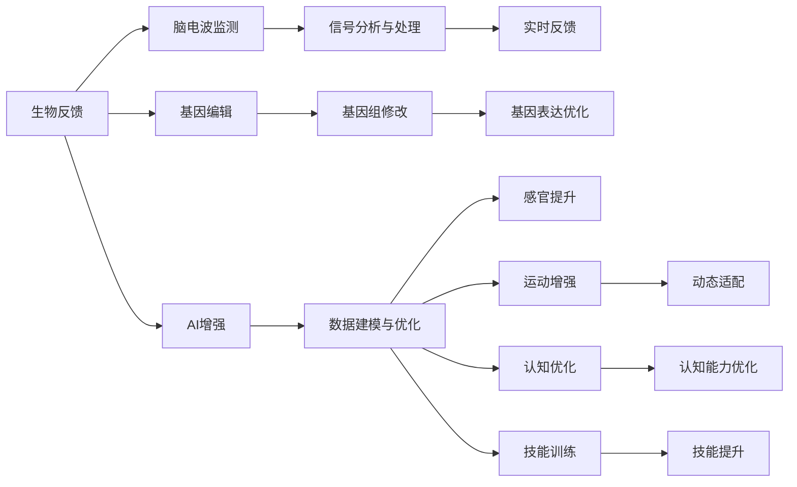
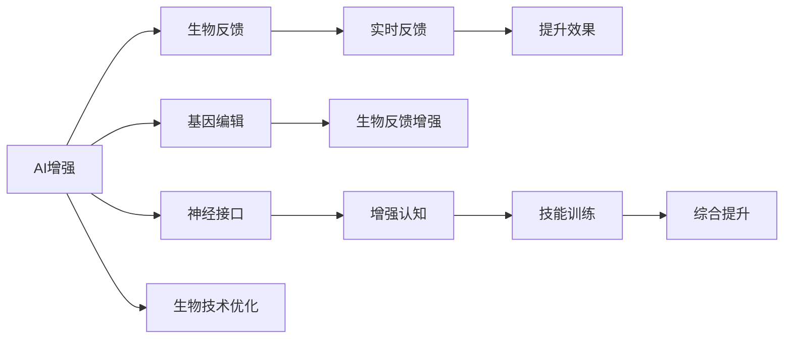

                 

# AI时代的人类增强：道德考虑和身体增强技术

> 关键词：AI增强, 道德伦理, 身体增强技术, 生物技术, 健康改善, 基因编辑, 人类增强

## 1. 背景介绍

### 1.1 问题由来

随着人工智能(AI)技术的迅猛发展，人类社会正步入一个全新的AI时代。这一时代，AI技术在诸多领域展现出了巨大的应用潜力，不仅极大地改变了我们的工作和生活方式，还为人类自身带来了前所未有的增强能力。然而，随着AI技术与人类的深度融合，涉及道德、伦理以及社会安全等诸多问题也日益凸显。特别是在人体增强领域，AI与生物技术的结合更是引发了广泛的关注与争议。

### 1.2 问题核心关键点

AI与身体增强技术的结合，旨在通过生物技术手段，利用AI算法和技术，增强人类的体能、智力和感官能力，提升生活质量和生产效率。其核心关键点包括：

- AI增强与生物技术的结合。如何有效利用AI算法对生物数据进行分析和处理，优化基因编辑、生物反馈和神经系统增强等技术手段。
- 道德伦理问题的考量。在追求人类增强的同时，如何保障人类尊严、公平和隐私，避免技术滥用。
- 社会安全与风险评估。身体增强技术可能带来的社会伦理风险，如生物不平等、基因歧视、生物安全等问题。
- 技术普及与公众接受度。如何将高技术含量的身体增强技术普及到更多人群，增强公众对其的认知与接受度。

这些关键点共同构成了AI时代人类增强技术面临的复杂局面，需要在技术发展与道德规范之间寻找平衡点。

## 2. 核心概念与联系

### 2.1 核心概念概述

要深入理解AI与身体增强技术的结合，首先需要掌握以下几个核心概念：

- **AI增强（AI Augmentation）**：通过AI算法和技术手段，对人类身体机能进行优化和增强，提升感官、运动和认知能力。
- **生物技术（Biotechnology）**：涉及生物系统的物理和化学过程，通过生物工程、基因工程等手段改造生物系统，提升人类健康和能力。
- **基因编辑（Genetic Editing）**：利用CRISPR-Cas9等技术，对人类基因组进行精确修改，改变生物体的遗传特性。
- **生物反馈（Biofeedback）**：通过监测生物信号，如心率、脑电波等，进行实时反馈，帮助用户调整身心状态。
- **神经接口（Neural Interface）**：通过脑机接口技术，实现脑与计算机之间的直接通信，提升人类与机器的互动效率。

### 2.2 核心概念原理和架构的 Mermaid 流程图



### 2.3 核心概念的相互联系

上述核心概念之间的逻辑关系可以通过以下Mermaid流程图来展示：



这些核心概念相互关联，共同构成了AI时代人类增强技术的基本框架。AI算法通过生物反馈、基因编辑和神经接口等技术手段，对人类身体机能进行全面优化，提升人类在体能、智力和感官方面的能力。

## 3. 核心算法原理 & 具体操作步骤

### 3.1 算法原理概述

AI与身体增强技术的结合，主要依赖于以下几个关键算法和原理：

- **数据驱动优化**：通过收集和分析生物数据，利用AI算法对人类身体机能进行优化和增强。
- **生物反馈闭环控制**：通过生物反馈系统实时监测生物信号，并利用AI算法进行实时调整，优化身体状态。
- **基因编辑精修**：利用AI技术对基因编辑结果进行精确分析和评估，优化基因表达和生物体特性。
- **神经接口同步**：通过脑机接口技术，实现脑与机器的实时通信，优化神经网络结构，提升认知和运动能力。

### 3.2 算法步骤详解

基于上述算法原理，AI与身体增强技术的结合大致可以分为以下几个步骤：

1. **数据采集与处理**：通过传感器和监测设备，收集人类生物数据，如心率、脑电波、肌肉电信号等，并进行数据清洗和预处理。
2. **数据建模与优化**：利用机器学习和深度学习算法，对生物数据进行建模和优化，识别出影响身体机能的关键因素。
3. **AI算法训练**：根据建模结果，训练AI算法，优化生物反馈控制、基因编辑和神经接口等技术手段。
4. **生物反馈闭环控制**：将AI算法嵌入到生物反馈系统中，实时监测和调整生物信号，提升身体状态。
5. **基因编辑与优化**：利用AI技术对基因编辑结果进行分析和评估，优化基因表达，提升生物体特性。
6. **神经接口同步与训练**：通过脑机接口技术，实现脑与机器的同步通信，优化神经网络结构，提升认知和运动能力。
7. **综合优化与提升**：结合生物反馈、基因编辑和神经接口等技术手段，全面提升人类身体机能，实现综合优化。

### 3.3 算法优缺点

AI与身体增强技术的结合，具有以下优点：

- **高效率和精确性**：通过AI算法对生物数据进行精确分析和处理，显著提升身体增强的效果和效率。
- **个性化与适应性**：根据个体差异和需求，量身定制身体增强方案，实现高度个性化和适应性。
- **多维度整合**：结合生物反馈、基因编辑和神经接口等技术手段，实现多维度身体增强，提升综合能力。

同时，这种技术也存在以下缺点：

- **伦理与安全风险**：基因编辑和神经接口等技术可能带来的伦理风险，如基因歧视、生物安全等问题。
- **技术复杂与成本高昂**：涉及多种复杂技术的结合，技术实现和应用成本较高，不易普及。
- **数据隐私与安全**：生物数据的采集和处理需要高度的数据隐私保护，存在数据泄露和安全风险。
- **公众接受度与认知**：公众对新技术的接受度和认知水平较低，可能阻碍技术的普及和应用。

### 3.4 算法应用领域

AI与身体增强技术的结合，在多个领域展现出广阔的应用前景：

- **医疗健康**：通过基因编辑和生物反馈技术，改善疾病治疗效果，提升患者生活质量。
- **运动训练**：利用神经接口和生物反馈技术，优化运动训练方案，提升运动员表现和效率。
- **娱乐休闲**：通过增强现实和虚拟现实技术，结合生物反馈和神经接口，提升娱乐体验。
- **教育培训**：结合生物反馈和神经接口，优化学习过程，提升教育效果和用户体验。
- **军事训练**：通过基因编辑和神经接口技术，增强士兵的身体机能和反应能力，提升战斗力。

## 4. 数学模型和公式 & 详细讲解

### 4.1 数学模型构建

生物反馈系统和基因编辑技术涉及大量生物数据的处理与分析，数学模型在这一过程中起着至关重要的作用。以基因编辑为例，我们可以构建如下的数学模型：

设基因组为 $G$，基因编辑目标为 $T$，AI算法优化参数为 $\theta$。基因编辑过程可以表示为：

$$
G \rightarrow G_{\theta} \rightarrow G_T
$$

其中 $G_{\theta}$ 表示在AI算法优化下的基因组，$G_T$ 表示基因编辑后的目标基因组。

### 4.2 公式推导过程

基因编辑过程中，AI算法优化参数 $\theta$ 的推导过程如下：

1. **数据采集与处理**：收集基因组数据 $G$ 并预处理。
2. **特征提取与建模**：利用AI算法提取基因组关键特征 $X$，构建基因编辑模型 $f_\theta(X)$。
3. **优化与训练**：通过优化算法（如梯度下降）训练模型 $f_\theta(X)$，找到最优参数 $\theta^*$。
4. **基因编辑与评估**：将优化后的基因组 $G_{\theta}$ 进行基因编辑，得到目标基因组 $G_T$，评估编辑效果。

### 4.3 案例分析与讲解

以CRISPR-Cas9技术为例，AI算法在基因编辑中的应用：

- **数据采集与处理**：从基因组中提取关键序列特征 $X$，并进行预处理。
- **特征提取与建模**：利用深度学习算法，对特征 $X$ 进行建模，构建基因编辑模型 $f_\theta(X)$。
- **优化与训练**：通过梯度下降等优化算法，训练模型 $f_\theta(X)$，找到最优参数 $\theta^*$。
- **基因编辑与评估**：将优化后的基因组 $G_{\theta}$ 进行CRISPR-Cas9编辑，得到目标基因组 $G_T$，评估编辑效果。

## 5. 项目实践：代码实例和详细解释说明

### 5.1 开发环境搭建

在进行AI与身体增强技术的开发时，需要搭建一个完整的开发环境。以下是使用Python进行TensorFlow开发的环境配置流程：

1. 安装Anaconda：从官网下载并安装Anaconda，用于创建独立的Python环境。

2. 创建并激活虚拟环境：
```bash
conda create -n tensorflow-env python=3.8 
conda activate tensorflow-env
```

3. 安装TensorFlow：根据CUDA版本，从官网获取对应的安装命令。例如：
```bash
conda install tensorflow -c tensorflow -c conda-forge
```

4. 安装其他依赖工具包：
```bash
pip install numpy scipy matplotlib tensorflow-probability
```

完成上述步骤后，即可在`tensorflow-env`环境中开始开发实践。

### 5.2 源代码详细实现

以下是一个简化的基因编辑AI算法模型实现示例：

```python
import tensorflow as tf
import numpy as np

# 构建基因编辑模型
class GeneEditingModel(tf.keras.Model):
    def __init__(self, input_dim, output_dim):
        super(GeneEditingModel, self).__init__()
        self.fc1 = tf.keras.layers.Dense(64, activation='relu')
        self.fc2 = tf.keras.layers.Dense(output_dim)
    
    def call(self, inputs):
        x = self.fc1(inputs)
        x = self.fc2(x)
        return x

# 准备基因编辑数据
X_train = np.random.randn(1000, 10)
y_train = np.random.randint(0, 10, (1000, 1))

# 构建并训练基因编辑模型
model = GeneEditingModel(input_dim=10, output_dim=1)
model.compile(optimizer=tf.keras.optimizers.Adam(0.001), loss=tf.keras.losses.MeanSquaredError())
model.fit(X_train, y_train, epochs=10, batch_size=32)

# 预测基因编辑结果
X_test = np.random.randn(100, 10)
y_pred = model.predict(X_test)
```

### 5.3 代码解读与分析

在上述代码中，我们定义了一个简单的基因编辑AI算法模型，使用TensorFlow库进行训练和预测。具体解读如下：

- **GeneEditingModel类**：定义了一个基因编辑模型，包含两个全连接层，通过ReLU激活函数进行处理。
- **数据准备**：通过NumPy生成随机数据X_train和y_train作为训练集。
- **模型训练**：使用Adam优化器和均方误差损失函数，对模型进行10个epoch的训练，每个epoch使用32个样本。
- **模型预测**：对测试集X_test进行预测，输出预测结果y_pred。

这段代码展示了基因编辑AI算法模型的基本实现，包括模型定义、数据准备、训练和预测等环节。实际应用中，还需要结合生物反馈和神经接口等技术，进行更全面的优化和整合。

## 6. 实际应用场景

### 6.1 医疗健康

AI与身体增强技术的结合，在医疗健康领域展现出巨大潜力。通过基因编辑和生物反馈技术，改善疾病治疗效果，提升患者生活质量。

例如，基因编辑技术可以用于治疗遗传性疾病，如镰状细胞贫血和囊性纤维化等。AI算法可以对基因编辑结果进行精准分析和评估，优化基因表达，提升治疗效果。此外，生物反馈系统可以实时监测患者的生命体征，调整治疗方案，确保治疗过程的安全和有效性。

### 6.2 运动训练

运动训练是AI与身体增强技术结合的重要应用场景之一。通过神经接口和生物反馈技术，优化运动训练方案，提升运动员表现和效率。

例如，AI算法可以分析运动员的动作数据，识别出训练中的不足之处，制定个性化的训练计划。生物反馈系统可以实时监测运动员的心率和肌肉电信号，调整训练强度和节奏，避免训练过度或不足。

### 6.3 娱乐休闲

AI与身体增强技术的结合，在娱乐休闲领域也展现出广阔的应用前景。通过增强现实和虚拟现实技术，结合生物反馈和神经接口，提升娱乐体验。

例如，虚拟现实游戏可以通过脑机接口技术，实现玩家与游戏环境的互动，提升游戏沉浸感和体验感。生物反馈系统可以实时监测玩家的身体状态，调整游戏难度和节奏，确保玩家的安全和舒适。

### 6.4 教育培训

AI与身体增强技术的结合，在教育培训领域同样具有重要应用。结合生物反馈和神经接口，优化学习过程，提升教育效果和用户体验。

例如，AI算法可以分析学生的学习数据，识别出学习中的难点和瓶颈，制定个性化的学习计划。生物反馈系统可以实时监测学生的注意力和情绪状态，调整学习内容和节奏，提升学习效果。

### 6.5 未来应用展望

随着AI与身体增强技术的不断发展，未来将展现出更多应用前景：

- **智能假肢**：结合生物反馈和神经接口技术，实现智能假肢的自主控制，提升肢体功能和生活质量。
- **增强现实办公**：结合生物反馈和神经接口技术，提升办公效率和体验，实现高效办公和远程协作。
- **虚拟现实教育**：结合生物反馈和神经接口技术，提升虚拟现实教育效果，实现个性化学习和互动。
- **人体增强助行**：结合生物反馈和神经接口技术，实现人体增强助行，提升老年人和残障人士的行动能力。

## 7. 工具和资源推荐

### 7.1 学习资源推荐

为了帮助开发者系统掌握AI与身体增强技术的理论和实践，这里推荐一些优质的学习资源：

1. **《深度学习与神经网络》**：涵盖深度学习的基础概念和算法，适合入门学习和进阶学习。
2. **《TensorFlow实战》**：通过丰富的代码示例，详细介绍TensorFlow的使用方法和实践技巧。
3. **《AI与生物技术》**：介绍AI在生物技术领域的应用，涵盖基因编辑、生物反馈、神经接口等核心技术。
4. **《基因编辑技术与应用》**：详细讲解CRISPR-Cas9等基因编辑技术的原理和应用。
5. **《神经接口技术》**：介绍脑机接口技术的原理和实现方法，适合从事神经接口应用的开发者学习。

通过对这些资源的学习实践，相信你一定能够快速掌握AI与身体增强技术的基本理论和实践技巧，并用于解决实际的生物技术问题。

### 7.2 开发工具推荐

高效的开发离不开优秀的工具支持。以下是几款用于AI与身体增强技术开发的常用工具：

1. **TensorFlow**：基于Python的开源深度学习框架，灵活动态的计算图，适合快速迭代研究。
2. **PyTorch**：灵活的动态计算图，适合快速原型开发和实验研究。
3. **OpenAI Gym**：构建和管理机器学习算法的开发环境，方便实验和测试。
4. **Brain recordings toolkit (BRTK)**：用于脑电信号处理的开源工具，支持多种数据格式和分析方法。
5. **CRISPR-Cas9设计软件**：如CRISPR Direct Designer，辅助设计基因编辑方案，提升编辑精度和效果。

合理利用这些工具，可以显著提升AI与身体增强技术的开发效率，加快创新迭代的步伐。

### 7.3 相关论文推荐

AI与身体增强技术的发展源于学界的持续研究。以下是几篇奠基性的相关论文，推荐阅读：

1. **《A Survey of Deep Learning Techniques for Biomedical Image Analysis》**：总结了深度学习在医学影像分析中的应用，涵盖分类、分割、检测等任务。
2. **《The Ethics of Genome Editing》**：讨论了基因编辑技术的伦理问题，提出了技术应用中的伦理规范和指导原则。
3. **《Neural Interface for Human-AI Communication》**：探讨了神经接口技术在人类与AI通信中的潜在应用，展望了未来的发展方向。
4. **《Optimization of CRISPR-Cas9 Off-Target Effects》**：总结了CRISPR-Cas9技术在基因编辑中的优化方法和挑战，提出了未来的研究方向。
5. **《AI in Biological Feedback Systems》**：讨论了AI在生物反馈系统中的应用，提升了反馈控制的精度和效果。

这些论文代表了大语言模型微调技术的发展脉络。通过学习这些前沿成果，可以帮助研究者把握学科前进方向，激发更多的创新灵感。

## 8. 总结：未来发展趋势与挑战

### 8.1 总结

本文对AI与身体增强技术的基本原理和实践进行了全面系统的介绍。首先阐述了AI与身体增强技术的研究背景和意义，明确了技术发展在人类增强方面的重要价值。其次，从原理到实践，详细讲解了AI与身体增强技术的核心算法和操作步骤，给出了具体代码实现和详细解读。同时，本文还广泛探讨了AI与身体增强技术在医疗健康、运动训练、娱乐休闲、教育培训等多个行业领域的应用前景，展示了技术的广阔应用空间。此外，本文精选了相关学习资源和工具，力求为读者提供全方位的技术指引。

通过本文的系统梳理，可以看到，AI与身体增强技术正在成为人类增强领域的重要范式，极大地拓展了生物技术的应用边界，催生了更多的落地场景。得益于深度学习和生物技术的结合，AI与身体增强技术有望在多个领域实现突破，显著提升人类在体能、智力和感官方面的能力，推动人类社会的全面进步。

### 8.2 未来发展趋势

展望未来，AI与身体增强技术将呈现以下几个发展趋势：

1. **技术融合与创新**：AI与生物技术的深度融合，将催生更多跨学科的创新应用，如智能假肢、增强现实办公等。
2. **个性化与定制化**：基于个体差异和需求，量身定制身体增强方案，实现高度个性化和定制化。
3. **伦理与安全保障**：技术发展必须遵守伦理规范和安全标准，避免技术滥用和伦理风险。
4. **社会接受与普及**：加强公众教育和认知普及，提升公众对AI与身体增强技术的接受度和认知水平。
5. **跨学科合作**：AI与身体增强技术的未来发展需要跨学科合作，涵盖医学、工程、伦理等多个领域。

以上趋势凸显了AI与身体增强技术的广阔前景。这些方向的探索发展，必将进一步提升人类增强技术的性能和应用范围，为人类认知智能的进化带来深远影响。

### 8.3 面临的挑战

尽管AI与身体增强技术已经取得了瞩目成就，但在迈向更加智能化、普适化应用的过程中，它仍面临着诸多挑战：

1. **伦理与安全风险**：基因编辑和神经接口等技术可能带来的伦理风险，如基因歧视、生物安全等问题。
2. **技术复杂与成本高昂**：涉及多种复杂技术的结合，技术实现和应用成本较高，不易普及。
3. **数据隐私与安全**：生物数据的采集和处理需要高度的数据隐私保护，存在数据泄露和安全风险。
4. **公众接受度与认知**：公众对新技术的接受度和认知水平较低，可能阻碍技术的普及和应用。
5. **技术效果与伦理平衡**：如何在提升技术效果的同时，保障人类尊严、公平和隐私，避免技术滥用。

这些挑战需要在技术发展与道德规范之间寻找平衡点，通过多方协作，共同推动AI与身体增强技术的发展和普及。

### 8.4 研究展望

面对AI与身体增强技术所面临的挑战，未来的研究需要在以下几个方面寻求新的突破：

1. **技术效果的优化**：进一步提升基因编辑、神经接口等技术的精度和效果，降低技术实现成本，提高应用可普及性。
2. **伦理规范的制定**：制定完善的伦理规范和指导原则，确保技术应用的合法性和道德性，避免伦理风险。
3. **数据隐私的保护**：加强数据隐私保护技术的研究，确保生物数据的采集和处理过程的安全和隐私。
4. **公众教育的普及**：加强对公众的教育和科普，提升公众对AI与身体增强技术的认知和接受度，推动技术的普及应用。
5. **跨学科合作**：推动AI与身体增强技术的跨学科合作，涵盖医学、工程、伦理等多个领域，实现技术与社会的深度融合。

这些研究方向将引领AI与身体增强技术的未来发展，为构建安全、可靠、可解释、可控的智能系统铺平道路。面向未来，AI与身体增强技术还需要与其他人工智能技术进行更深入的融合，如知识表示、因果推理、强化学习等，多路径协同发力，共同推动自然语言理解和智能交互系统的进步。只有勇于创新、敢于突破，才能不断拓展AI与身体增强技术的边界，让人工智能更好地造福人类社会。

## 9. 附录：常见问题与解答

**Q1：AI与身体增强技术是否适用于所有人类增强场景？**

A: AI与身体增强技术在大多数增强场景中都能取得不错的效果，特别是对于数据量较小的任务。但对于一些特定领域的任务，如医学、法律等，仅仅依靠通用语料预训练的模型可能难以很好地适应。此时需要在特定领域语料上进一步预训练，再进行微调，才能获得理想效果。此外，对于一些需要时效性、个性化很强的任务，如对话、推荐等，AI与身体增强方法也需要针对性的改进优化。

**Q2：AI与身体增强技术在医疗健康中的应用有哪些？**

A: AI与身体增强技术在医疗健康领域展现出巨大潜力。具体应用包括：

- **疾病治疗**：通过基因编辑和生物反馈技术，改善疾病治疗效果，提升患者生活质量。例如，利用基因编辑技术治疗遗传性疾病。
- **健康监测**：通过生物反馈系统实时监测患者的生命体征，调整治疗方案，确保治疗过程的安全和有效性。
- **手术辅助**：结合神经接口技术，辅助手术操作，提升手术精度和效率。

**Q3：AI与身体增强技术在运动训练中的应用有哪些？**

A: AI与身体增强技术在运动训练领域也有广泛应用。具体包括：

- **训练方案优化**：利用AI算法分析运动员的动作数据，识别出训练中的不足之处，制定个性化的训练计划。
- **实时反馈控制**：通过生物反馈系统实时监测运动员的心率和肌肉电信号，调整训练强度和节奏，避免训练过度或不足。
- **康复训练**：结合神经接口技术，帮助运动受伤患者进行康复训练，加速恢复速度。

**Q4：AI与身体增强技术在娱乐休闲中的应用有哪些？**

A: AI与身体增强技术在娱乐休闲领域同样具有重要应用。具体包括：

- **虚拟现实游戏**：通过脑机接口技术，实现玩家与游戏环境的互动，提升游戏沉浸感和体验感。
- **运动健身**：利用神经接口技术，实时监测用户的运动状态，调整运动方案，提升健身效果。
- **智能玩具**：结合生物反馈技术，开发智能玩具，提升儿童的认知和运动能力。

**Q5：AI与身体增强技术在教育培训中的应用有哪些？**

A: AI与身体增强技术在教育培训领域同样具有重要应用。具体包括：

- **个性化学习**：利用AI算法分析学生的学习数据，识别出学习中的难点和瓶颈，制定个性化的学习计划。
- **实时反馈**：通过生物反馈系统实时监测学生的注意力和情绪状态，调整学习内容和节奏，提升学习效果。
- **虚拟现实教育**：结合神经接口技术，提升虚拟现实教育效果，实现个性化学习和互动。

---

作者：禅与计算机程序设计艺术 / Zen and the Art of Computer Programming

