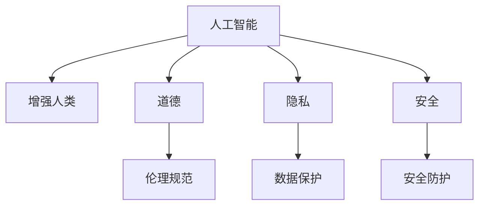
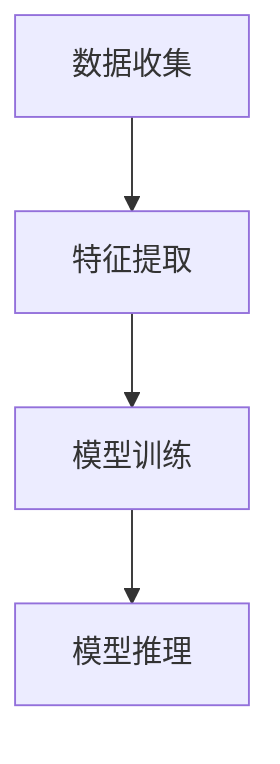

                 

# AI时代的人类增强：道德、隐私和安全挑战

> 关键词：人工智能,增强人类,道德,隐私,安全,技术伦理

## 1. 背景介绍

### 1.1 问题由来
随着人工智能技术的迅猛发展，尤其是深度学习、自然语言处理、计算机视觉等领域的突破，AI技术正在以越来越深入的方式融入人类的生产生活。从自动驾驶、智能医疗、工业机器人，到个性化推荐、语音助手、智能客服，AI技术的应用无处不在。在极大提升效率、优化体验的同时，AI技术也对人类的身体、心理、社会等各个层面产生了深远的影响。

一方面，AI技术通过自动执行繁琐、重复的任务，极大地解放了人类的劳动，使得人们能够专注于更有创造性、战略性的工作。此外，AI在医疗、教育、心理健康等领域的应用，有望显著提升服务质量，让更多人受益。然而，随着AI技术的广泛应用，也引发了一系列新的伦理道德和安全挑战。如何平衡技术进步与人类福祉，成为了我们必须正视的问题。

### 1.2 问题核心关键点
在AI时代，如何增强人类能力，同时保障隐私、安全、道德等原则，是当前研究和技术应用中的核心关键点。本文将从道德、隐私、安全三个维度，深入探讨AI技术在人类增强过程中面临的挑战，并提供相应的解决方案，帮助技术开发者、使用者、监管者共同构建一个可持续、负责任的人工智能未来。

## 2. 核心概念与联系

### 2.1 核心概念概述

为更好地理解AI技术在人类增强过程中面临的伦理道德和安全挑战，本节将介绍几个密切相关的核心概念：

- 人工智能(Artificial Intelligence, AI)：指利用计算机和算法，使机器能够模拟、扩展人类智能能力的科技领域。
- 增强人类(Augmenting Humanity)：通过AI技术提升人类在物理、认知、情感等维度的能力，提高生活质量和工作效率。
- 道德(Ethics)：关于正确与错误、正义与非正义、善良与邪恶的行为规范和价值判断。
- 隐私(Privacy)：指个人信息的保密性和安全性，保护个人数据不被未经授权的获取和使用。
- 安全(Security)：指保护系统、数据和通信不受未授权访问、破坏、泄露等威胁的过程。

这些核心概念之间的逻辑关系可以通过以下Mermaid流程图来展示：



这个流程图展示了大语言模型的核心概念及其之间的关系：

1. 人工智能通过技术手段增强人类能力。
2. 道德、隐私、安全是增强人类过程中需要遵循的三个关键原则。
3. 伦理规范指导AI技术的应用，确保其符合人类社会的价值导向。
4. 数据保护确保个人隐私不被泄露。
5. 安全防护保障系统、通信的安全稳定。

这些概念共同构成了AI技术应用的重要框架，使得AI在提升人类福祉的同时，也能遵循伦理道德和安全原则，构建一个可持续的未来。

## 3. 核心算法原理 & 具体操作步骤
### 3.1 算法原理概述

AI技术在人类增强中的应用，通常涉及对大数据的分析和处理，以及对复杂系统的模拟和优化。其核心算法原理主要包括以下几个方面：

- 数据收集与预处理：从传感器、用户交互、社交媒体等多种渠道收集数据，并进行清洗、归一化等预处理操作。
- 特征提取与选择：从原始数据中提取有意义的特征，并筛选出对增强任务最有用的特征子集。
- 模型训练与优化：选择合适的机器学习或深度学习模型，在标注数据上训练优化，获得针对特定任务的高效模型。
- 模型推理与决策：将训练好的模型应用于实时数据，进行推理决策，并输出增强结果。

这些算法原理通常以数据流图的形式表示，即：



### 3.2 算法步骤详解

基于AI技术的人类增强，通常包括以下几个关键步骤：

**Step 1: 需求分析和数据获取**
- 明确增强目标，如提升体能、智能、创造力等。
- 确定所需的数据类型和采集渠道，如传感器数据、生理指标、行为数据、环境数据等。
- 制定数据采集方案，包括数据收集方法、存储格式、传输方式等。

**Step 2: 数据预处理与特征工程**
- 对采集的数据进行清洗、去噪、归一化等预处理操作，确保数据质量。
- 分析数据的结构和特点，提取有意义的特征，如位置、速度、情感、认知等。
- 应用特征选择算法，去除冗余和无关特征，提高模型效率。

**Step 3: 模型设计与训练**
- 根据任务需求，选择合适的机器学习或深度学习模型。
- 设计合适的模型架构，如卷积神经网络、循环神经网络、变分自编码器等。
- 利用标注数据，进行模型的训练和优化，调整模型超参数。

**Step 4: 模型部署与评估**
- 将训练好的模型部署到实际应用场景中，如智能穿戴设备、虚拟助手、智能家居等。
- 收集用户反馈和实际使用数据，评估模型效果，如准确率、召回率、用户满意度等。
- 根据评估结果，进行模型优化和改进。

**Step 5: 持续迭代与优化**
- 定期更新和扩充数据集，确保模型的长期有效性。
- 引入反馈机制，收集用户反馈和实时数据，不断优化模型。
- 保持与伦理、隐私、安全等方面的持续关注和调整，确保技术应用的负责任性。

### 3.3 算法优缺点

基于AI技术的人类增强方法具有以下优点：
1. 高效智能。通过AI技术自动化、智能化处理海量数据，极大地提升了人类在特定任务上的能力。
2. 广泛适用。AI技术可以应用于多种增强场景，如体能增强、智能辅助、心理健康等。
3. 灵活多样。AI模型可以根据具体需求进行定制化设计，适应不同用户的个性化需求。

同时，这些方法也存在一些局限性：
1. 数据依赖。增强效果依赖于高质量的数据输入，数据获取和预处理成本较高。
2. 隐私风险。AI技术需要大量数据训练，可能导致用户隐私泄露。
3. 安全风险。模型推理可能面临数据篡改、攻击等安全威胁。
4. 伦理争议。AI技术的应用可能引发一系列伦理道德问题，如公平性、责任归属等。

尽管存在这些局限性，但总体而言，AI技术在增强人类方面的潜力是巨大的。未来相关研究的重点在于如何在技术进步的同时，更好地平衡伦理、隐私和安全，确保AI技术健康、可持续地服务于人类社会。

### 3.4 算法应用领域

基于AI技术的人类增强方法，已经广泛应用于诸多领域，如：

- 体能增强：利用可穿戴设备采集生理数据，进行健康监测和运动指导，提升身体素质。
- 智能辅助：通过语音助手、智能家居、自动化办公等技术，提升日常生活的便利性和效率。
- 心理支持：应用智能心理咨询、情感分析等技术，缓解心理压力，提升心理健康水平。
- 医疗健康：使用AI进行疾病诊断、个性化治疗、药物研发等，提高医疗服务质量。
- 教育培训：通过智能推荐、个性化辅导等技术，提升教育效果和用户体验。
- 娱乐传媒：利用AI技术实现沉浸式体验、个性化推荐、情感识别等，提升用户体验。

除了上述这些经典应用外，AI技术还在不断拓展新的增强领域，如智能交通、智慧城市、灾害预测等，为人类社会的全面进步提供新的动力。

## 4. 数学模型和公式 & 详细讲解
### 4.1 数学模型构建

本节将使用数学语言对基于AI技术的人类增强方法进行更加严格的刻画。

假设增强任务为 $T$，所需的数据集为 $D=\{(x_i,y_i)\}_{i=1}^N$，其中 $x_i$ 为输入数据， $y_i$ 为增强目标。定义增强函数 $F$，输入数据 $x$ 通过增强函数 $F$ 得到增强结果 $y$，即 $y=F(x)$。

增强任务的优化目标是最小化损失函数 $\mathcal{L}$，即：

$$
\mathop{\arg\min}_{F} \mathcal{L}(F,D)
$$

其中 $\mathcal{L}$ 为损失函数，通常包括回归误差、分类误差、对数似然等。在实际应用中，我们通常使用基于梯度的优化算法（如SGD、Adam等）来近似求解上述最优化问题。设 $\eta$ 为学习率，$\lambda$ 为正则化系数，则参数的更新公式为：

$$
F \leftarrow F - \eta \nabla_{F}\mathcal{L}(F) - \eta\lambda F
$$

其中 $\nabla_{F}\mathcal{L}(F)$ 为损失函数对增强函数 $F$ 的梯度，可通过反向传播算法高效计算。

### 4.2 公式推导过程

以下我们以运动推荐系统为例，推导基于AI技术的人类增强的优化公式。

假设用户当前的体能数据为 $x$，运动目标为 $y$。定义增强函数 $F$ 为神经网络模型，通过训练学习输入数据 $x$ 到运动目标 $y$ 的映射。在训练集 $D=\{(x_i,y_i)\}_{i=1}^N$ 上，定义损失函数 $\mathcal{L}$ 为均方误差（MSE）：

$$
\mathcal{L}(F,D)=\frac{1}{N}\sum_{i=1}^N \left( y_i - F(x_i) \right)^2
$$

根据链式法则，损失函数对增强函数 $F$ 的梯度为：

$$
\frac{\partial \mathcal{L}(F,D)}{\partial F} = \frac{1}{N}\sum_{i=1}^N 2 \left( y_i - F(x_i) \right) F'(x_i)
$$

其中 $F'(x_i)$ 为增强函数 $F$ 在数据 $x_i$ 上的导数，可以通过反向传播算法递归计算。

在得到损失函数的梯度后，即可带入参数更新公式，完成模型的迭代优化。重复上述过程直至收敛，最终得到适应增强任务的优化增强函数 $F^*$。

## 5. 项目实践：代码实例和详细解释说明
### 5.1 开发环境搭建

在进行人类增强实践前，我们需要准备好开发环境。以下是使用Python进行TensorFlow开发的环境配置流程：

1. 安装Anaconda：从官网下载并安装Anaconda，用于创建独立的Python环境。

2. 创建并激活虚拟环境：
```bash
conda create -n tf-env python=3.8 
conda activate tf-env
```

3. 安装TensorFlow：根据CUDA版本，从官网获取对应的安装命令。例如：
```bash
conda install tensorflow -c tf -c conda-forge
```

4. 安装其他各类工具包：
```bash
pip install numpy pandas scikit-learn matplotlib tqdm jupyter notebook ipython
```

完成上述步骤后，即可在`tf-env`环境中开始人类增强实践。

### 5.2 源代码详细实现

下面我们以运动推荐系统为例，给出使用TensorFlow进行神经网络模型训练的PyTorch代码实现。

首先，定义运动推荐任务的数据处理函数：

```python
import tensorflow as tf
from tensorflow.keras import layers

class SportRecommender(tf.keras.Model):
    def __init__(self, input_shape, output_shape):
        super(SportRecommender, self).__init__()
        self.dense1 = layers.Dense(64, activation='relu', input_shape=input_shape)
        self.dense2 = layers.Dense(64, activation='relu')
        self.dense3 = layers.Dense(output_shape)
    
    def call(self, inputs):
        x = self.dense1(inputs)
        x = self.dense2(x)
        return self.dense3(x)

# 创建输入和输出
input_shape = (20,)
output_shape = (4,)

model = SportRecommender(input_shape, output_shape)
```

然后，定义训练和评估函数：

```python
# 定义优化器和损失函数
optimizer = tf.keras.optimizers.Adam(learning_rate=0.001)
loss_fn = tf.keras.losses.MeanSquaredError()

# 定义训练函数
@tf.function
def train_epoch(model, dataset, batch_size, optimizer):
    for x_batch, y_batch in dataset.batch(batch_size):
        with tf.GradientTape() as tape:
            y_pred = model(x_batch)
            loss = loss_fn(y_batch, y_pred)
        grads = tape.gradient(loss, model.trainable_variables)
        optimizer.apply_gradients(zip(grads, model.trainable_variables))
        
# 定义评估函数
@tf.function
def evaluate(model, dataset, batch_size):
    total_loss = 0
    for x_batch, y_batch in dataset.batch(batch_size):
        y_pred = model(x_batch)
        loss = loss_fn(y_batch, y_pred)
        total_loss += loss.numpy()
    return total_loss / len(dataset)
```

接着，启动训练流程并在测试集上评估：

```python
epochs = 10
batch_size = 32

for epoch in range(epochs):
    train_epoch(model, train_dataset, batch_size, optimizer)
    print(f"Epoch {epoch+1}, loss: {evaluate(model, test_dataset, batch_size)}")
```

以上就是使用TensorFlow对运动推荐系统进行神经网络模型训练的完整代码实现。可以看到，得益于TensorFlow的强大封装，我们只需关注模型设计、损失函数选择、优化器调参等高层逻辑，而底层实现细节则由框架自动处理。

### 5.3 代码解读与分析

让我们再详细解读一下关键代码的实现细节：

**SportRecommender类**：
- `__init__`方法：初始化神经网络模型结构，包括三个全连接层。
- `call`方法：定义模型前向传播过程，依次通过三个全连接层，最终输出推荐结果。

**训练和评估函数**：
- 使用TensorFlow的`tf.function`装饰器，将训练和评估函数编译为图模型，以提高计算效率。
- 在训练函数中，使用梯度计算和反向传播更新模型参数。
- 在评估函数中，计算模型在测试集上的均方误差，返回总损失值。

**训练流程**：
- 定义总的epoch数和batch size，开始循环迭代
- 每个epoch内，先对训练集进行训练，输出模型损失
- 在测试集上评估，输出模型均方误差
- 重复上述过程直至模型收敛

可以看到，TensorFlow在实现神经网络模型的训练和评估过程中，提供了高效、便捷的API和工具，使得模型开发和优化变得更加简单。然而，在实际应用中，还需要考虑模型集成、超参数优化、性能调优等更多因素，以确保人类增强系统的稳定性和鲁棒性。

## 6. 实际应用场景
### 6.1 智能家居

智能家居系统通过传感器和物联网设备，收集用户的日常活动数据，利用AI技术进行分析处理，实现智能化的生活辅助。例如，智能灯光可以根据用户的作息时间和活动轨迹自动调节亮度和颜色，智能温控系统可以根据室内外温度和人体热成像数据自动调整温度，智能安防系统可以实时监控并预警异常行为。

在技术实现上，可以应用AI技术对用户行为数据进行建模，提取有意义的特征，如时间、位置、频率等，进行分类和预测。微调神经网络模型，实现对不同场景的智能识别和响应。通过持续学习和优化，智能家居系统将能够更加精准地预测和满足用户的需求，提升生活品质。

### 6.2 虚拟助手

虚拟助手通过语音识别、自然语言处理和机器学习技术，模拟人类对话，提供智能问答、提醒服务、日程管理等功能。例如，Amazon的Alexa、苹果的Siri、微软的Cortana等虚拟助手，已经在家庭、工作、出行等多个场景中得到了广泛应用。

在技术实现上，虚拟助手需要处理自然语言输入，进行意图识别、实体抽取、对话管理等任务。微调基于Transformer的序列模型，如GPT-3、BERT等，使其能够理解自然语言指令，生成自然流畅的对话回复。通过持续学习和交互优化，虚拟助手将能够更好地适应用户需求，提供个性化服务。

### 6.3 个性化推荐

个性化推荐系统通过分析用户的历史行为数据，推荐符合用户兴趣的个性化内容。例如，电商平台的商品推荐、视频网站的影片推荐、社交媒体的内容推荐等。

在技术实现上，应用深度学习模型对用户行为数据进行建模，提取兴趣特征，进行协同过滤、内容推荐等任务。微调神经网络模型，使其能够根据用户当前行为进行动态推荐。通过引入多模态数据，如文本、图像、音频等，增强推荐系统的丰富性和多样性。持续优化模型参数和推荐策略，实现更加精准、高效的推荐。

### 6.4 未来应用展望

随着AI技术的不断进步，基于AI技术的人类增强将在更多领域得到应用，为人类社会带来变革性影响。

在智慧医疗领域，基于AI的医学影像诊断、个性化治疗、药物研发等技术，将显著提升医疗服务质量，帮助医生做出更准确的诊断和治疗方案。

在智慧教育领域，基于AI的智能辅导、个性化推荐、作业批改等技术，将提升教育效果，让更多人有机会接受优质教育。

在智慧城市治理中，基于AI的智能交通、环境监测、公共安全等技术，将提高城市管理的自动化和智能化水平，构建更安全、高效的未来城市。

此外，在智能制造、环境保护、灾害预警等众多领域，AI技术也将发挥越来越重要的作用，推动人类社会的全面进步。

## 7. 工具和资源推荐
### 7.1 学习资源推荐

为了帮助开发者系统掌握AI技术在人类增强中的应用，这里推荐一些优质的学习资源：

1. 《深度学习》（Ian Goodfellow等著）：深度学习领域的经典教材，系统介绍了深度学习的基本原理和算法，是AI技术学习的重要参考。

2. 《人工智能伦理》（Zeynep Tufekci著）：探讨了AI技术的伦理问题，如公平性、透明性、责任归属等，是理解AI技术伦理和社会影响的重要读物。

3. 《隐私保护技术》（Salil Vadhan等著）：介绍了隐私保护的基本概念和技术，如差分隐私、匿名化等，是隐私保护领域的权威指南。

4. 《安全与隐私》（Michael Zalewski等著）：探讨了网络安全与隐私保护的基本原理和技术，是信息安全领域的学习资源。

5. 《道德计算》（Jane J. Caldwell等著）：探讨了AI技术的道德问题，如公正性、责任归属、决策透明性等，是AI技术伦理研究的重要参考。

通过对这些资源的学习实践，相信你一定能够系统掌握AI技术在人类增强中的应用，并在技术开发和应用中充分考虑伦理、隐私、安全等方面的问题。

### 7.2 开发工具推荐

高效的开发离不开优秀的工具支持。以下是几款用于AI技术人类增强开发的常用工具：

1. TensorFlow：由Google主导开发的深度学习框架，生产部署方便，适合大规模工程应用。

2. PyTorch：基于Python的开源深度学习框架，灵活动态的计算图，适合快速迭代研究。

3. OpenAI的GPT系列：提供预训练语言模型和微调框架，可以用于智能问答、生成对话等任务。

4. Amazon SageMaker：提供云端机器学习平台，支持模型训练、部署和优化。

5. Azure Machine Learning：提供完整的机器学习开发平台，支持数据准备、模型训练、模型部署等环节。

6. Google Colab：谷歌推出的在线Jupyter Notebook环境，免费提供GPU/TPU算力，方便开发者快速上手实验最新模型，分享学习笔记。

合理利用这些工具，可以显著提升AI技术人类增强任务的开发效率，加快创新迭代的步伐。

### 7.3 相关论文推荐

AI技术在人类增强领域的发展源于学界的持续研究。以下是几篇奠基性的相关论文，推荐阅读：

1. "Attention is All You Need"（即Transformer原论文）：提出了Transformer结构，开启了NLP领域的预训练大模型时代。

2. "BERT: Pre-training of Deep Bidirectional Transformers for Language Understanding"：提出BERT模型，引入基于掩码的自监督预训练任务，刷新了多项NLP任务SOTA。

3. "Towards Explainable AI: An AIXI* Model for Explainable Decision-Making"：提出了一种可解释的AI模型，通过引入代理模型和决策树，增强模型的可解释性。

4. "Fairness and Progress in Multi-Agent Reinforcement Learning"：探讨了公平性问题在多智能体学习中的应用，提出了公平性优先的算法框架。

5. "A Survey on Privacy-Preserving Machine Learning"：系统回顾了隐私保护技术在机器学习中的应用，如差分隐私、隐私保护学习等。

这些论文代表了大语言模型微调技术的发展脉络。通过学习这些前沿成果，可以帮助研究者把握学科前进方向，激发更多的创新灵感。

## 8. 总结：未来发展趋势与挑战

### 8.1 总结

本文对基于AI技术的人类增强方法进行了全面系统的介绍。首先阐述了AI技术在人类增强中的研究背景和应用前景，明确了增强人类能力的核心目标。其次，从道德、隐私、安全三个维度，深入探讨了AI技术在增强人类过程中面临的挑战，并提出了相应的解决方案。最后，展望了AI技术在各个领域的未来应用，展望了未来的技术趋势和挑战。

通过本文的系统梳理，可以看到，AI技术在提升人类能力方面的潜力是巨大的。然而，在技术应用的同时，如何平衡伦理、隐私、安全等方面，确保技术应用的负责任性，仍然是一个重要的课题。未来，通过技术创新和规范建设，相信AI技术必将在提升人类福祉、推动社会进步方面发挥更大的作用。

### 8.2 未来发展趋势

展望未来，AI技术在人类增强方面的发展趋势将呈现以下几个方向：

1. 技术融合与协同：AI技术将与其他技术进行更深度的融合，如生物传感、脑机接口、自然语言处理等，实现多模态的增强效果。

2. 伦理与责任：AI技术的应用将更多地考虑伦理和社会影响，建立责任追溯机制，确保技术应用的公平性和透明性。

3. 隐私保护与数据利用：随着数据保护法规的逐步完善，AI技术将更多地采用隐私保护技术，如差分隐私、联邦学习等，确保数据安全和用户隐私。

4. 安全与鲁棒性：AI系统将更多地考虑安全性问题，引入对抗样本、鲁棒优化等技术，提高系统的鲁棒性和抗攻击能力。

5. 可解释性与透明性：AI技术将更加注重可解释性和透明性，通过引入代理模型、决策树等技术，增强模型的可解释性，提高用户信任度。

6. 自动化与自适应：AI技术将更多地采用自动化技术，如自动调参、模型自适应等，提高系统开发和应用的效率和灵活性。

以上趋势凸显了AI技术在人类增强方面的广阔前景。这些方向的探索发展，必将进一步提升AI技术的人类增强能力，为构建安全、可靠、可解释、可控的智能系统铺平道路。

### 8.3 面临的挑战

尽管AI技术在人类增强方面取得了显著成就，但在迈向更加智能化、普适化应用的过程中，仍面临诸多挑战：

1. 数据质量与安全：高质量的数据是AI技术应用的基础，但数据获取和预处理成本较高，且数据安全问题不容忽视。如何保证数据质量和安全性，是未来研究的重要课题。

2. 技术伦理与法规：AI技术的应用可能引发一系列伦理问题，如公平性、透明性、责任归属等，需要通过立法和技术手段加以规范。

3. 技术可靠性与鲁棒性：AI系统面临的数据干扰、对抗攻击等挑战，需要提升系统的鲁棒性和可靠性，避免算法偏见和错误决策。

4. 用户接受度与信任度：AI技术在提升人类能力的同时，也可能引发用户的不信任和抵触。如何提升用户接受度，增强系统的透明度和可解释性，是技术应用的关键。

5. 跨领域整合与协同：AI技术的应用需要跨领域整合，如医疗、教育、交通等，如何实现各领域数据的有效整合和协同建模，是未来研究的难点。

6. 资源消耗与成本：大规模AI系统的部署需要大量的算力、内存和存储空间，如何优化系统资源消耗，降低成本，是技术应用的重要考量。

正视这些挑战，积极应对并寻求突破，将是大语言模型微调走向成熟的必由之路。相信随着学界和产业界的共同努力，这些挑战终将一一被克服，AI技术必将在构建安全、可靠、可解释、可控的智能系统方面发挥更大作用。

### 8.4 研究展望

面向未来，AI技术在人类增强领域的研究需要从以下几个方面进行探索：

1. 探索无监督和半监督学习技术。摆脱对大规模标注数据的依赖，利用自监督学习、主动学习等无监督和半监督范式，最大限度利用非结构化数据，实现更加灵活高效的增强。

2. 研究隐私保护与数据共享技术。开发隐私保护技术，如差分隐私、联邦学习等，确保数据安全和个人隐私，同时促进数据共享和合作。

3. 引入伦理与公平性评估指标。在技术设计和应用过程中，引入伦理导向的评估指标，过滤和惩罚有偏见、有害的输出倾向，确保技术应用的公平性和透明性。

4. 融合多模态数据与知识。将符号化的先验知识，如知识图谱、逻辑规则等，与神经网络模型进行巧妙融合，引导增强过程学习更准确、合理的语言模型，同时加强不同模态数据的整合，实现视觉、语音等多模态信息与文本信息的协同建模。

5. 引入因果分析和博弈论工具。将因果分析方法引入增强模型，识别出模型决策的关键特征，增强输出解释的因果性和逻辑性。借助博弈论工具刻画人机交互过程，主动探索并规避模型的脆弱点，提高系统稳定性。

6. 纳入伦理道德约束。在模型训练目标中引入伦理导向的评估指标，过滤和惩罚有偏见、有害的输出倾向。同时加强人工干预和审核，建立模型行为的监管机制，确保输出符合人类价值观和伦理道德。

这些研究方向将引领AI技术在人类增强领域的研究和应用，为构建一个可持续、负责任的人工智能未来提供坚实的理论和技术基础。

## 9. 附录：常见问题与解答

**Q1：AI技术在增强人类过程中如何平衡伦理、隐私、安全等方面的问题？**

A: 在AI技术的应用过程中，平衡伦理、隐私、安全等方面的问题至关重要。具体来说，可以从以下几个方面入手：

1. 制定明确的伦理准则：明确AI技术的伦理边界和应用原则，确保技术应用符合人类社会的价值观和伦理规范。

2. 引入伦理评估指标：在技术设计和应用过程中，引入伦理导向的评估指标，如公平性、透明性、责任归属等，过滤和惩罚有偏见、有害的输出倾向。

3. 加强隐私保护：采用隐私保护技术，如差分隐私、联邦学习等，确保数据安全和用户隐私。同时，对用户数据进行最小必要化处理，避免数据滥用。

4. 提升系统鲁棒性：引入对抗样本、鲁棒优化等技术，提高系统的鲁棒性和抗攻击能力，避免数据干扰和算法偏见。

5. 增强系统透明性：通过引入代理模型、决策树等技术，增强模型的可解释性，提高用户信任度。同时，建立透明的决策过程和反馈机制，让用户了解系统的运行情况和决策依据。

通过以上措施，可以更好地平衡AI技术在增强人类过程中面临的伦理、隐私、安全等方面的问题，确保技术应用的负责任性和可持续性。

**Q2：AI技术在人类增强过程中如何保证数据质量与安全？**

A: 高质量的数据是AI技术应用的基础，但数据获取和预处理成本较高，且数据安全问题不容忽视。以下是一些保证数据质量与安全的方法：

1. 数据清洗与标注：对采集的数据进行清洗、去噪、归一化等预处理操作，确保数据质量。同时，采用人工标注、半自动标注等方法，提高数据标注的准确性和一致性。

2. 数据加密与匿名化：对敏感数据进行加密处理，确保数据传输和存储的安全性。同时，采用数据匿名化技术，去除个人身份信息，保护用户隐私。

3. 数据共享与合作：通过数据共享与合作，提高数据多样性和丰富性，促进技术的快速发展和应用。但需要注意数据共享过程中的安全风险，采用加密传输、联邦学习等技术，确保数据安全。

4. 数据监控与审计：建立数据监控与审计机制，实时监测数据获取和使用的过程，及时发现和处理异常行为。同时，定期进行安全审计，确保数据系统的安全性。

5. 数据治理与法规：建立数据治理体系，制定数据使用规范和隐私保护法规，确保数据使用和管理的合法合规。同时，推动数据治理标准的制定和实施，提升数据管理水平。

通过以上措施，可以更好地保证AI技术在人类增强过程中面临的数据质量与安全问题，确保技术应用的可靠性和安全性。

**Q3：AI技术在增强人类过程中如何提升系统鲁棒性？**

A: AI系统面临的数据干扰、对抗攻击等挑战，需要提升系统的鲁棒性和可靠性，避免算法偏见和错误决策。以下是一些提升系统鲁棒性的方法：

1. 引入对抗样本：通过生成对抗样本，测试和改进模型的鲁棒性。对抗样本训练可以提高模型对数据干扰的抵抗能力，减少错误决策。

2. 鲁棒优化：采用鲁棒优化算法，如Robust Regression、Robust PCA等，提高模型的鲁棒性和稳定性。

3. 模型集成与融合：通过模型集成和融合，增强系统的鲁棒性和泛化能力。多个模型的融合可以提高系统的鲁棒性和抗干扰能力，减少单个模型的脆弱性。

4. 异常检测与预警：引入异常检测与预警机制，及时发现和处理异常行为，避免系统误判和错误决策。

5. 用户反馈与迭代优化：通过用户反馈和迭代优化，持续改进系统的鲁棒性和可靠性。用户反馈可以及时发现系统的问题和不足，通过迭代优化提升系统性能。

通过以上措施，可以更好地提升AI系统在增强人类过程中的鲁棒性和可靠性，确保系统稳定运行和高质量应用。

**Q4：AI技术在增强人类过程中如何提升用户接受度与信任度？**

A: AI技术在提升人类能力的同时，也可能引发用户的不信任和抵触。提升用户接受度与信任度，需要从以下几个方面入手：

1. 增强系统透明性：通过引入代理模型、决策树等技术，增强模型的可解释性，提高用户信任度。同时，建立透明的决策过程和反馈机制，让用户了解系统的运行情况和决策依据。

2. 提高用户参与度：通过用户参与设计、测试和反馈，提高用户对系统的认可和接受度。用户参与可以增强系统的人性化和个性化，提升用户体验和满意度。

3. 引入伦理导向：在技术设计和应用过程中，引入伦理导向的评估指标，如公平性、透明性、责任归属等，过滤和惩罚有偏见、有害的输出倾向，确保技术应用的公平性和透明性。

4. 提供个性化服务：通过个性化推荐、智能问答等服务，满足用户的多样化需求，提升用户满意度。个性化服务可以增强用户的使用体验，提高系统的吸引力和接受度。

5. 建立用户隐私保护机制：采用隐私保护技术，如差分隐私、联邦学习等，确保数据安全和用户隐私。同时，对用户数据进行最小必要化处理，避免数据滥用，增强用户信任度。

通过以上措施，可以更好地提升AI技术在增强人类过程中的用户接受度与信任度，确保技术应用的安全性和可持续性。

**Q5：AI技术在增强人类过程中如何实现跨领域整合与协同？**

A: AI技术的应用需要跨领域整合，如医疗、教育、交通等，如何实现各领域数据的有效整合和协同建模，是未来研究的难点。以下是一些实现跨领域整合与协同的方法：

1. 数据融合与共享：通过数据融合与共享，实现各领域数据的整合和协同，提高数据的多样性和丰富性。同时，采用数据匿名化和隐私保护技术，确保数据共享过程中的安全性。

2. 领域知识与规则：引入领域知识和规则，如医学知识、教育规则、交通规则等，增强AI模型的领域适应性和准确性。领域知识可以提升模型的泛化能力和鲁棒性。

3. 多模态数据融合：将不同模态的数据进行融合，如文本、图像、音频等，实现多模态信息的协同建模。多模态数据融合可以增强模型的丰富性和多样性，提高系统的综合能力。

4. 标准化与互操作性：制定各领域的数据标准和互操作性协议，确保不同领域数据之间的互通和共享。标准化和互操作性可以提升数据的集成和利用效率，促进技术应用。

5. 协作与协同优化：通过跨领域的协作与协同优化，提升AI系统的综合能力和应用效果。协作与协同优化可以提高系统的复杂性和多样性，增强系统的综合适应性和鲁棒性。

通过以上措施，可以更好地实现AI技术在增强人类过程中的跨领域整合与协同，提升系统的综合能力和应用效果。

---

作者：禅与计算机程序设计艺术 / Zen and the Art of Computer Programming

