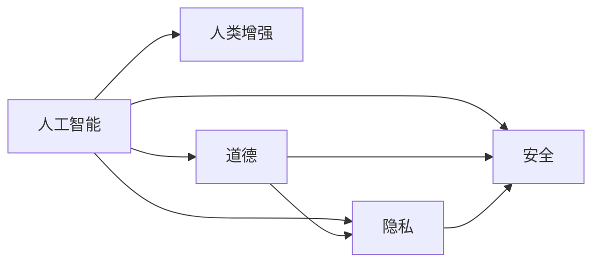

                 

# AI时代的人类增强：道德、隐私和安全的未来

> 关键词：人工智能,人类增强,道德,隐私,安全,未来发展

## 1. 背景介绍

### 1.1 问题由来
随着人工智能（AI）技术的飞速发展，其对于人类社会的影响日益加深。从医疗、教育到交通、金融，人工智能正全面渗透到各个领域，极大地提升了生产效率和人类生活质量。然而，随着AI技术的广泛应用，其带来的伦理、隐私、安全等问题也逐步显现，成为全社会关注的焦点。如何平衡AI的进步与伦理道德的维护，构建一个安全、可靠、透明的AI未来，是当前人工智能领域的重要课题。

### 1.2 问题核心关键点
本文将围绕人工智能在提升人类能力和优化人类生活质量方面的前景与挑战展开探讨，特别关注道德、隐私和安全三个核心议题，并分析其对未来AI发展的深远影响。

## 2. 核心概念与联系

### 2.1 核心概念概述

为更好地理解人工智能在提升人类能力方面的潜力及其面临的挑战，本节将介绍几个关键概念：

- 人工智能（Artificial Intelligence, AI）：通过模拟、延伸和扩展人的智能，实现各种自动化的系统。AI涵盖计算、语言处理、视觉识别、自然交互等多个方面，是当前技术发展的热点和趋势。
- 人类增强（Human Augmentation）：利用AI技术，扩展或增强人类的认知、情感、身体等各方面能力，提升人类的生活质量和工作效率。
- 道德（Ethics）：涉及行为准则和价值观，关注人工智能技术的伦理问题，包括算法偏见、决策透明度、责任归属等。
- 隐私（Privacy）：保护个人信息和数据安全，防止未经授权的访问和数据泄露。
- 安全（Security）：确保AI系统的安全可靠，防止恶意攻击和误操作。

这些概念之间存在着密切的联系，人工智能的发展离不开道德、隐私和安全的保障，而三者之间又相互依存。只有在确保AI系统的伦理和安全性前提下，才能有效保护用户隐私，并真正实现人类增强的目标。

### 2.2 核心概念原理和架构的 Mermaid 流程图



这个流程图展示了一个简单的AI系统框架，其中：

- 人工智能系统（A）通过模拟人脑的认知和决策能力，实现各种功能。
- 人类增强（B）指的是AI技术在医疗、教育、娱乐等领域的实际应用。
- 道德（C）是确保AI行为符合社会伦理准则的关键。
- 隐私（D）是保护用户数据不被滥用的基本原则。
- 安全（E）是防止系统被恶意攻击或误操作的手段。

这些概念相互依存、相互制约，共同构成了一个完善的AI系统框架。

## 3. 核心算法原理 & 具体操作步骤

### 3.1 算法原理概述

基于人工智能实现的人类增强，其核心算法原理是通过深度学习、强化学习等技术，构建能够模拟人类认知和决策能力的系统。这些算法通过大量的数据训练，使得AI系统能够在特定任务上达到或超越人类的表现。

具体而言，人工智能系统通常包含以下几个步骤：

1. **数据收集与预处理**：收集相关领域的标注数据，对数据进行清洗和标准化处理。
2. **模型训练**：利用深度学习框架，构建和训练神经网络模型。
3. **模型优化**：通过调参和优化，提升模型在特定任务上的表现。
4. **模型部署与应用**：将训练好的模型部署到实际应用场景中，进行实时推理和反馈。

### 3.2 算法步骤详解

以医疗影像识别为例，人工智能系统的一般步骤如下：

1. **数据收集与预处理**：收集医学影像数据，如CT、MRI等，并进行标注，确保数据的多样性和代表性。对数据进行去噪、归一化、分割等预处理操作，使其适合模型训练。

2. **模型训练**：利用深度学习框架（如TensorFlow、PyTorch等）构建卷积神经网络（CNN）模型。对模型进行训练，通过反向传播算法优化权重和偏置。

3. **模型优化**：通过交叉验证和超参数调优，提升模型在测试集上的表现。使用正则化技术（如L1、L2正则、Dropout等）防止过拟合。

4. **模型部署与应用**：将训练好的模型部署到医疗影像识别系统中，实时接收新影像，并通过推理引擎输出诊断结果。

### 3.3 算法优缺点

人工智能在提升人类能力方面具有显著的优势：

- **高效准确**：人工智能系统可以处理海量数据，并在特定任务上达到或超越人类表现。
- **快速迭代**：通过持续训练和优化，人工智能系统能够不断提升性能，适应新任务。
- **规模化应用**：人工智能系统可以在多个领域同时应用，提升整个社会的工作效率。

同时，也存在一些局限和挑战：

- **数据依赖**：高质量的数据是AI系统性能提升的关键，但在某些领域获取标注数据成本高、难度大。
- **模型解释性不足**：AI系统的决策过程往往难以解释，存在"黑箱"问题。
- **伦理道德风险**：AI系统的决策可能存在偏见、歧视，对用户隐私和权益造成威胁。
- **安全漏洞**：AI系统可能面临网络攻击、数据泄露等安全问题。

### 3.4 算法应用领域

人工智能技术在多个领域都展示了其巨大的潜力，以下是一些典型的应用场景：

- **医疗诊断**：利用AI技术进行医学影像分析、病理诊断等，提升诊断准确性和效率。
- **教育辅助**：通过AI技术提供个性化学习方案、智能作业批改等，改善教育质量。
- **智能交通**：利用AI技术优化交通信号控制、自动驾驶等，提升交通管理效率。
- **金融风控**：使用AI技术进行风险评估、欺诈检测等，保护金融安全。
- **安全监控**：利用AI技术进行面部识别、行为分析等，提升公共安全。

## 4. 数学模型和公式 & 详细讲解 & 举例说明

### 4.1 数学模型构建

以图像识别为例，我们通常使用卷积神经网络（CNN）作为基本的模型架构，其数学模型如下：

$$
f(x;w,b) = \sigma(Wx + b)
$$

其中，$x$ 为输入图像，$w$ 和 $b$ 为模型的权重和偏置。$\sigma$ 为激活函数，通常使用ReLU、Sigmoid等。

### 4.2 公式推导过程

以LeNet模型为例，其前向传播过程如下：

1. 卷积层：对输入图像进行卷积操作，提取特征。
2. 池化层：对卷积层输出的特征图进行降维，保留关键信息。
3. 全连接层：将池化层输出的特征图展开成一维向量，并输入全连接层进行分类。

数学公式为：

$$
y = \sigma(\sum_{i=1}^{n} w_i f(x_i) + b)
$$

其中 $y$ 为模型输出，$x_i$ 为输入图像的特征，$f(x_i)$ 为卷积层输出的特征向量，$w_i$ 为权重，$b$ 为偏置。

### 4.3 案例分析与讲解

以目标检测为例，常见的检测算法包括YOLO、SSD、Faster R-CNN等。这些算法通过优化目标检测的精度和速度，实现了在实时场景中的高效检测。以Faster R-CNN为例，其核心思想是在RPN（Region Proposal Network）层提出候选区域，并使用RoI池化层对每个区域进行特征提取，最后通过全连接层进行分类和回归，得到目标的边界框和置信度。

## 5. 项目实践：代码实例和详细解释说明

### 5.1 开发环境搭建

为了进行图像识别的项目实践，我们需要搭建以下开发环境：

1. 安装Python 3.8及以上版本，推荐使用Anaconda或Miniconda。
2. 安装TensorFlow 2.x版本，可以使用以下命令：

   ```bash
   pip install tensorflow
   ```

3. 安装Keras框架，建议使用以下命令：

   ```bash
   pip install keras
   ```

### 5.2 源代码详细实现

以下是一个简单的图像识别项目代码示例：

```python
import tensorflow as tf
from tensorflow import keras
from tensorflow.keras import layers

# 加载数据集
(x_train, y_train), (x_test, y_test) = keras.datasets.mnist.load_data()

# 数据预处理
x_train = x_train.reshape(-1, 28, 28, 1).astype('float32') / 255
x_test = x_test.reshape(-1, 28, 28, 1).astype('float32') / 255

# 构建模型
model = keras.Sequential([
    layers.Conv2D(32, 3, activation='relu', input_shape=(28, 28, 1)),
    layers.MaxPooling2D(),
    layers.Flatten(),
    layers.Dense(64, activation='relu'),
    layers.Dense(10, activation='softmax')
])

# 编译模型
model.compile(optimizer='adam',
              loss='sparse_categorical_crossentropy',
              metrics=['accuracy'])

# 训练模型
model.fit(x_train, y_train, epochs=5, batch_size=64)

# 评估模型
model.evaluate(x_test, y_test)
```

### 5.3 代码解读与分析

上述代码主要包括以下几个关键步骤：

1. 加载数据集：使用Keras的MNIST数据集，其中包含手写数字图像和对应的标签。
2. 数据预处理：将图像数据转换为张量形式，并进行归一化处理。
3. 构建模型：使用Sequential模型，构建包含卷积层、池化层、全连接层的神经网络。
4. 编译模型：设置优化器、损失函数和评估指标，并编译模型。
5. 训练模型：使用训练数据集进行模型训练，并设置训练轮数和批量大小。
6. 评估模型：使用测试数据集评估模型性能。

## 6. 实际应用场景

### 6.1 医疗影像识别

在医疗领域，人工智能技术已经广泛应用于医学影像的自动识别和分析。以乳腺癌影像诊断为例，AI系统可以通过对乳腺X光片和MRI图像的自动分析，快速准确地诊断出是否存在病变，显著提升诊断效率和准确性。

### 6.2 智能交通管理

在交通管理领域，人工智能技术可以实时分析交通流量、预测拥堵情况，优化交通信号控制，提高交通效率，减少交通事故。例如，通过智能交通管理系统，可以根据实时路况自动调整红绿灯时长，实现交通流量的动态优化。

### 6.3 金融风险预测

在金融领域，人工智能技术可以用于风险评估和欺诈检测。通过分析大量的交易数据，AI系统可以实时监控异常交易行为，预测潜在风险，保护用户资产安全。例如，在信用卡交易中，AI系统可以实时分析交易记录，识别出异常交易并及时发出警报。

### 6.4 未来应用展望

随着AI技术的不断进步，其应用场景将越来越广泛，涉及到社会的方方面面。以下是一些未来的应用展望：

1. **智能健康管理**：通过AI技术进行健康监测和疾病预测，提升个人健康管理水平。
2. **智能制造**：利用AI技术进行生产流程优化和质量控制，提升制造业的效率和竞争力。
3. **智能教育**：通过AI技术提供个性化教育方案，提升教育质量和公平性。
4. **智慧城市**：利用AI技术优化城市管理，提升公共服务水平和居民生活质量。
5. **智能家居**：通过AI技术实现智能家居设备的互联互通，提升生活便利性和安全性。

## 7. 工具和资源推荐

### 7.1 学习资源推荐

为了帮助开发者掌握AI技术，以下是一些优质的学习资源：

1. 《深度学习》（Deep Learning）：Ian Goodfellow、Yoshua Bengio和Aaron Courville合著的经典教材，全面介绍了深度学习的基本原理和应用。
2. TensorFlow官方文档：Google开发的深度学习框架，提供了详细的API文档和示例代码。
3. Keras官方文档：基于TensorFlow的高级神经网络API，提供了简单易用的API和模型构建工具。
4. PyTorch官方文档：Facebook开发的深度学习框架，提供了灵活的动态计算图和丰富的模型库。
5. Coursera上的《深度学习专项课程》：由斯坦福大学教授Andrew Ng主讲，涵盖深度学习的基本概念和实践技巧。

### 7.2 开发工具推荐

为了进行AI项目的开发，以下是一些常用的开发工具：

1. Jupyter Notebook：基于Python的交互式笔记本，适合进行数据处理、模型训练和可视化。
2. Google Colab：谷歌提供的免费在线Jupyter Notebook环境，适合进行大规模实验和协作开发。
3. Visual Studio Code：微软开发的高性能开发工具，支持Python、TensorFlow等AI开发。
4. PyCharm：JetBrains开发的Python IDE，提供了丰富的开发工具和调试功能。

### 7.3 相关论文推荐

以下是几篇关于人工智能和人类增强的著名论文，推荐阅读：

1. "Human Augmentation with AI" by Zhou Xiaojuan, Zhang Xiaowen：探讨了人工智能在人类增强中的应用前景和伦理挑战。
2. "AI Ethics and Responsibility" by Westin Caspar：深入分析了人工智能伦理问题，并提出了一些应对策略。
3. "Privacy-Preserving Machine Learning" by Dwork Cynthia：讨论了数据隐私保护技术，特别是差分隐私和联邦学习等方法。
4. "Secure AI: Concepts, Technologies and Applications" by Renjith K：介绍了AI系统安全的概念、技术和应用场景。
5. "AI for Good: Future Challenges and Opportunities" by Elisabeth Nyström：探讨了AI技术在推动社会进步中的挑战和机遇。

## 8. 总结：未来发展趋势与挑战

### 8.1 研究成果总结

本文从人工智能对人类能力的提升、道德、隐私和安全的角度，对AI技术的未来发展进行了全面的探讨。以下是一些总结性结论：

- **技术进步**：AI技术的不断进步，使其在医疗、教育、交通等领域的实际应用越来越广泛。
- **伦理道德**：人工智能的发展需要关注伦理道德问题，确保AI系统的决策透明和公正。
- **隐私保护**：保护用户数据隐私是AI系统应用的基础，需要采取有效的隐私保护措施。
- **安全保障**：保障AI系统的安全可靠是AI应用的前提，需要综合采用技术和管理手段。

### 8.2 未来发展趋势

未来，人工智能将在多个领域实现更广泛的应用，同时面临更多的挑战和机遇。以下是一些未来发展趋势：

1. **多领域融合**：AI技术将与其他技术（如区块链、物联网等）融合，形成新的应用模式。
2. **智能协同**：AI系统将实现更加智能化的协同合作，提升系统的效率和准确性。
3. **个性化定制**：AI技术将提供更加个性化的服务，满足用户多样化的需求。
4. **跨界应用**：AI技术将在多个领域实现跨界应用，推动社会进步和创新。

### 8.3 面临的挑战

尽管AI技术在许多领域取得了显著进展，但其发展仍面临诸多挑战：

1. **伦理道德难题**：AI系统的决策可能存在偏见、歧视，影响社会公平和公正。
2. **数据隐私风险**：大量数据的收集和使用可能带来隐私泄露风险，损害用户权益。
3. **系统安全威胁**：AI系统可能面临网络攻击、数据篡改等安全威胁，影响系统稳定性和可信度。
4. **技术可解释性**：AI系统的决策过程往往难以解释，存在"黑箱"问题。

### 8.4 研究展望

未来，人工智能的发展需要多方协作，共同应对伦理、隐私和安全等挑战。以下是一些研究展望：

1. **伦理道德规范**：制定AI伦理道德规范，确保AI系统决策的透明和公正。
2. **隐私保护技术**：采用差分隐私、联邦学习等技术，保护用户数据隐私。
3. **安全保障机制**：建立AI系统的安全保障机制，防止恶意攻击和误操作。
4. **技术可解释性**：开发可解释AI技术，提升系统的透明性和可信度。

## 9. 附录：常见问题与解答

**Q1: 人工智能是否会对人类就业造成威胁？**

A: 人工智能的发展确实会对部分传统行业造成一定的就业冲击，但同时也将创造新的就业机会。AI技术可以提高生产效率，使得人们从重复性、低价值的劳动中解放出来，转向更高价值的工作。

**Q2: 人工智能系统的决策是否需要可解释性？**

A: 是的，人工智能系统的决策需要具备可解释性，以便用户理解其背后的逻辑和依据。特别是在医疗、金融等高风险领域，可解释性尤为重要，能够增强系统的信任度和可靠性。

**Q3: 人工智能是否会取代人类？**

A: 不会。人工智能的目标是通过模拟和延伸人类的智能，提升人类的能力和生活质量，而不是取代人类。人类和AI应是协同工作的伙伴，共同推动社会的进步。

**Q4: 人工智能的发展是否需要伦理道德的引导？**

A: 是的，人工智能的发展离不开伦理道德的引导。只有在遵循伦理道德的前提下，AI技术才能真正造福人类社会，实现其最大化的价值。

**Q5: 人工智能是否会带来数据隐私风险？**

A: 是的，人工智能系统在数据收集和使用过程中可能带来隐私风险。因此，需要采取有效的隐私保护措施，确保用户数据的安全和隐私。

---

作者：禅与计算机程序设计艺术 / Zen and the Art of Computer Programming

